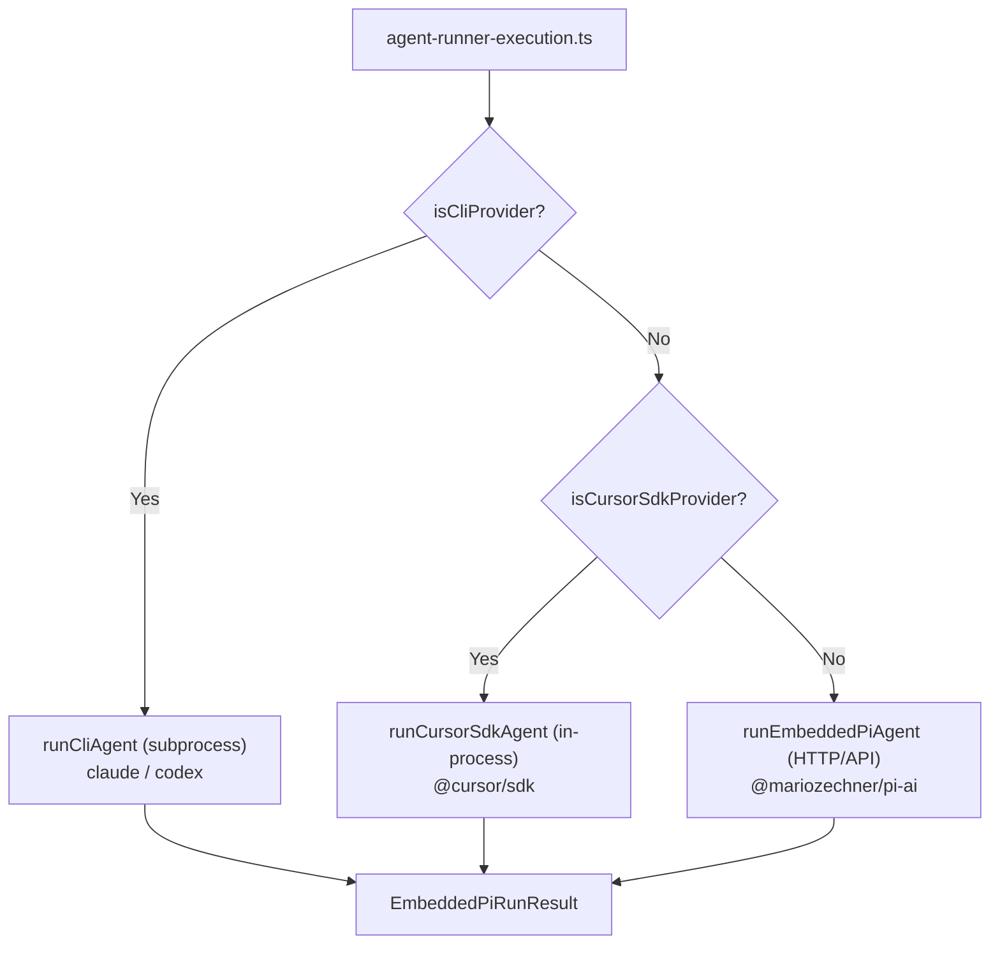

# Add Cursor SDK as a Core Task Delegation Backend

## Approach

Pure core addition — same pattern as Claude CLI (`claude-cli`) and Codex CLI (`codex-cli`). The Cursor SDK differs only in that it's a TypeScript library rather than a subprocess, so it gets its own runner function instead of reusing `runCliAgent`.

## Dispatch Flow



## New Files

- `src/agents/cursor-sdk-runner.ts` — Core runner (mirrors `cli-runner.ts` structure)
- `src/commands/auth-choice.apply.cursor-sdk.ts` — Auth handler (mirrors `auth-choice.apply.xai.ts` pattern)

## Modified Files

- `package.json` — Add `@cursor/sdk` dependency
- `src/config/types.agent-defaults.ts` — Add `CursorSdkBackendConfig` type + `cursorSdk?` field on `AgentDefaultsConfig`
- `src/config/zod-schema.agent-defaults.ts` — Add Zod schema for the new config (`.strict()` pattern)
- `src/agents/model-selection.ts` — Add `isCursorSdkProvider()` (mirrors `isCliProvider`)
- `src/agents/model-auth.ts` — Add `"cursor-sdk": "CURSOR_API_KEY"` to `envMap` in `resolveEnvApiKey`
- `src/auto-reply/reply/agent-runner-execution.ts` — Add dispatch branch (mirrors CLI dispatch block)
- `src/commands/agent.ts` — Add dispatch in `runAgentAttempt` (mirrors `isCliProvider` branch)
- `src/cron/isolated-agent/run.ts` — Add dispatch in cron run (mirrors `isCliProvider` branch)
- `src/commands/onboard-types.ts` — Add `"cursor-sdk"` to `AuthChoice` union
- `src/commands/auth-choice.preferred-provider.ts` — Add `"cursor-sdk": "cursor-sdk"` to map
- `src/commands/auth-choice.apply.ts` — Add `applyAuthChoiceCursorSdk` to handlers array
- `src/commands/onboard-auth.credentials.ts` — Add `setCursorSdkApiKey` function
- `src/agents/cli-session.ts` — Add `cursor-sdk` session id support (reuse `cliSessionIds` map)

## Implementation Details (Following Exact Codebase Patterns)

### 1. Configuration Type (`src/config/types.agent-defaults.ts`)

Add after `CliBackendConfig`:

```typescript
export type CursorSdkBackendConfig = {
  /** Runtime mode: "local" (user's machine) or "cloud" (Cursor VM). */
  runtime?: "local" | "cloud";
  /** Default model id for Cursor agent runs (e.g. "composer-2"). */
  model?: string;
  /** Cloud-specific settings. */
  cloud?: {
    repos?: Array<{ url: string; startingRef?: string }>;
    autoCreatePR?: boolean;
  };
  /** Local-specific settings (defaults to agent workspace dir). */
  local?: {
    cwd?: string;
  };
};
```

Add to `AgentDefaultsConfig`:

```typescript
  /** Cursor SDK backend settings (cursor-sdk provider). */
  cursorSdk?: CursorSdkBackendConfig;
```

### 2. Zod Schema (`src/config/zod-schema.agent-defaults.ts`)

Follow the `.strict().optional()` pattern used for `compaction`, `contextPruning`, etc:

```typescript
cursorSdk: z
  .object({
    runtime: z.union([z.literal("local"), z.literal("cloud")]).optional(),
    model: z.string().optional(),
    cloud: z
      .object({
        repos: z
          .array(
            z.object({
              url: z.string(),
              startingRef: z.string().optional(),
            }).strict(),
          )
          .optional(),
        autoCreatePR: z.boolean().optional(),
      })
      .strict()
      .optional(),
    local: z
      .object({
        cwd: z.string().optional(),
      })
      .strict()
      .optional(),
  })
  .strict()
  .optional(),
```

### 3. Provider Detection (`src/agents/model-selection.ts`)

Add directly below `isCliProvider`:

```typescript
export function isCursorSdkProvider(provider: string, _cfg?: OpenClawConfig): boolean {
  return normalizeProviderId(provider) === "cursor-sdk";
}
```

### 4. Env API Key (`src/agents/model-auth.ts`)

Add to the `envMap` record:

```typescript
"cursor-sdk": "CURSOR_API_KEY",
```

### 5. Runner (`src/agents/cursor-sdk-runner.ts`)

Follow `cli-runner.ts` structure exactly:

- `createSubsystemLogger("agent/cursor-sdk")` at top
- Same params object shape as `runCliAgent`
- `resolveRunWorkspaceDir` for workspace resolution + fallback logging
- `FailoverError` for all error paths (timeout, auth, rate_limit)
- Return `EmbeddedPiRunResult` with `{ payloads, meta: { durationMs, agentMeta } }`
- `try/catch` with `isFailoverErrorMessage` classification

```typescript
import type { ImageContent } from "@mariozechner/pi-ai";
import type { ThinkLevel } from "../auto-reply/thinking.js";
import type { OpenClawConfig } from "../config/config.js";
import { createSubsystemLogger } from "../logging/subsystem.js";
import { resolveApiKeyForProvider } from "./model-auth.js";
import { FailoverError, resolveFailoverStatus } from "./failover-error.js";
import { classifyFailoverReason, isFailoverErrorMessage } from "./pi-embedded-helpers.js";
import type { EmbeddedPiRunResult } from "./pi-embedded-runner.js";
import { redactRunIdentifier, resolveRunWorkspaceDir } from "./workspace-run.js";

const log = createSubsystemLogger("agent/cursor-sdk");

export async function runCursorSdkAgent(params: {
  sessionId: string;
  sessionKey?: string;
  agentId?: string;
  sessionFile: string;
  workspaceDir: string;
  config?: OpenClawConfig;
  prompt: string;
  provider: string;
  model?: string;
  thinkLevel?: ThinkLevel;
  timeoutMs: number;
  runId: string;
  extraSystemPrompt?: string;
  cursorRunId?: string;
  images?: ImageContent[];
}): Promise<EmbeddedPiRunResult> {
  const started = Date.now();
  const workspaceResolution = resolveRunWorkspaceDir({
    workspaceDir: params.workspaceDir,
    sessionKey: params.sessionKey,
    agentId: params.agentId,
    config: params.config,
  });
  const resolvedWorkspace = workspaceResolution.workspaceDir;
  if (workspaceResolution.usedFallback) {
    log.warn(
      `[workspace-fallback] caller=runCursorSdkAgent reason=${workspaceResolution.fallbackReason} run=${params.runId} session=${redactRunIdentifier(params.sessionId)}`,
    );
  }
  const workspaceDir = resolvedWorkspace;
  const modelId = (params.model ?? "composer-2").trim() || "composer-2";

  // resolveApiKeyForProvider returns { apiKey, source, mode } or throws.
  let apiKey: string;
  try {
    const auth = await resolveApiKeyForProvider({
      provider: "cursor-sdk",
      cfg: params.config,
      agentDir: undefined, // uses default agent dir
    });
    apiKey = auth.apiKey;
  } catch {
    throw new FailoverError("No API key found for cursor-sdk provider.", {
      reason: "auth",
      provider: params.provider,
      model: modelId,
      status: resolveFailoverStatus("auth"),
    });
  }

  const cursorSdkConfig = params.config?.agents?.defaults?.cursorSdk;
  const runtime = cursorSdkConfig?.runtime ?? "local";

  try {
    const { Agent } = await import("@cursor/sdk");

    log.info(
      `cursor-sdk exec: runtime=${runtime} model=${modelId} promptChars=${params.prompt.length}`,
    );

    // Agent.create returns an SDKAgent handle.
    // Pass `local` or `cloud` to pick runtime (never both).
    const agent =
      runtime === "cloud" && cursorSdkConfig?.cloud
        ? await Agent.create({
            apiKey,
            model: { id: modelId },
            cloud: {
              repos: cursorSdkConfig.cloud.repos ?? [],
              autoCreatePR: cursorSdkConfig.cloud.autoCreatePR,
            },
          })
        : await Agent.create({
            apiKey,
            model: { id: modelId },
            local: { cwd: cursorSdkConfig?.local?.cwd ?? workspaceDir },
          });

    try {
      const run = await agent.send(params.prompt);

      // Stream SDKMessage events. Discriminate on `event.type`:
      // "assistant" | "thinking" | "tool_call" | "status" | "task"
      let text = "";
      for await (const event of run.stream()) {
        if (event.type === "assistant") {
          for (const block of event.message.content) {
            if (block.type === "text") {
              text += block.text;
            }
          }
        }
      }

      // Await final result for metadata (status, durationMs, git info).
      const result = await run.wait();

      const trimmedText = text.trim() || result.result?.trim() || "";
      const payloads = trimmedText ? [{ text: trimmedText }] : undefined;

      return {
        payloads,
        meta: {
          durationMs: result.durationMs ?? Date.now() - started,
          agentMeta: {
            sessionId: run.id ?? params.sessionId,
            provider: params.provider,
            model: modelId,
          },
        },
      };
    } finally {
      // SDKAgent implements Symbol.asyncDispose for cleanup.
      await agent[Symbol.asyncDispose]();
    }
  } catch (err) {
    if (err instanceof FailoverError) {
      throw err;
    }
    const message = err instanceof Error ? err.message : String(err);
    if (isFailoverErrorMessage(message)) {
      const reason = classifyFailoverReason(message) ?? "unknown";
      const status = resolveFailoverStatus(reason);
      throw new FailoverError(message, {
        reason,
        provider: params.provider,
        model: modelId,
        status,
      });
    }
    throw err;
  }
}
```

### 6. Dispatch — `agent-runner-execution.ts`

Insert a new branch **before** the `isCliProvider` check (or after — order doesn't matter since they're mutually exclusive). Follow the same lifecycle event pattern:

```typescript
if (isCursorSdkProvider(provider, params.followupRun.run.config)) {
  const startedAt = Date.now();
  emitAgentEvent({ runId, stream: "lifecycle", data: { phase: "start", startedAt } });
  const cursorRunId = getCliSessionId(params.getActiveSessionEntry(), provider);
  return (async () => {
    let lifecycleTerminalEmitted = false;
    try {
      const result = await runCursorSdkAgent({
        sessionId: params.followupRun.run.sessionId,
        sessionKey: params.sessionKey,
        agentId: params.followupRun.run.agentId,
        sessionFile: params.followupRun.run.sessionFile,
        workspaceDir: params.followupRun.run.workspaceDir,
        config: params.followupRun.run.config,
        prompt: params.commandBody,
        provider,
        model,
        thinkLevel: params.followupRun.run.thinkLevel,
        timeoutMs: params.followupRun.run.timeoutMs,
        runId,
        extraSystemPrompt: params.followupRun.run.extraSystemPrompt,
        cursorRunId,
        images: params.opts?.images,
      });
      const sdkText = result.payloads?.[0]?.text?.trim();
      if (sdkText) {
        emitAgentEvent({ runId, stream: "assistant", data: { text: sdkText } });
      }
      emitAgentEvent({
        runId,
        stream: "lifecycle",
        data: { phase: "end", startedAt, endedAt: Date.now() },
      });
      lifecycleTerminalEmitted = true;
      return result;
    } catch (err) {
      emitAgentEvent({
        runId,
        stream: "lifecycle",
        data: { phase: "error", startedAt, endedAt: Date.now(), error: String(err) },
      });
      lifecycleTerminalEmitted = true;
      throw err;
    } finally {
      if (!lifecycleTerminalEmitted) {
        emitAgentEvent({
          runId,
          stream: "lifecycle",
          data: { phase: "error", startedAt, endedAt: Date.now() },
        });
      }
    }
  })();
}
```

### 7. Dispatch — `commands/agent.ts`

In `runAgentAttempt`, add between `isCliProvider` and `runEmbeddedPiAgent`:

```typescript
if (isCursorSdkProvider(params.providerOverride, params.cfg)) {
  const cursorRunId = getCliSessionId(params.sessionEntry, params.providerOverride);
  return runCursorSdkAgent({
    sessionId: params.sessionId,
    sessionKey: params.sessionKey,
    agentId: params.sessionAgentId,
    sessionFile: params.sessionFile,
    workspaceDir: params.workspaceDir,
    config: params.cfg,
    prompt: effectivePrompt,
    provider: params.providerOverride,
    model: params.modelOverride,
    thinkLevel: params.resolvedThinkLevel,
    timeoutMs: params.timeoutMs,
    runId: params.runId,
    extraSystemPrompt: params.opts.extraSystemPrompt,
    cursorRunId,
    images: params.isFallbackRetry ? undefined : params.opts.images,
  });
}
```

### 8. Dispatch — `cron/isolated-agent/run.ts`

Same pattern, add between `isCliProvider` and `runEmbeddedPiAgent` in the `run:` callback:

```typescript
if (isCursorSdkProvider(providerOverride, cfgWithAgentDefaults)) {
  const cursorRunId = getCliSessionId(cronSession.sessionEntry, providerOverride);
  return runCursorSdkAgent({
    sessionId: cronSession.sessionEntry.sessionId,
    sessionKey: agentSessionKey,
    agentId,
    sessionFile,
    workspaceDir,
    config: cfgWithAgentDefaults,
    prompt: commandBody,
    provider: providerOverride,
    model: modelOverride,
    thinkLevel,
    timeoutMs,
    runId: cronSession.sessionEntry.sessionId,
    cursorRunId,
  });
}
```

### 9. Auth Credential (`src/commands/onboard-auth.credentials.ts`)

Add alongside the other `set*ApiKey` functions:

```typescript
export async function setCursorSdkApiKey(key: string, agentDir?: string) {
  upsertAuthProfile({
    profileId: "cursor-sdk:default",
    credential: {
      type: "api_key",
      provider: "cursor-sdk",
      key,
    },
    agentDir: resolveAuthAgentDir(agentDir),
  });
}
```

### 10. Auth Choice Apply (`src/commands/auth-choice.apply.cursor-sdk.ts`)

Follow the pattern from `auth-choice.apply.xai.ts`:

```typescript
import { resolveEnvApiKey } from "../agents/model-auth.js";
import {
  formatApiKeyPreview,
  normalizeApiKeyInput,
  validateApiKeyInput,
} from "./auth-choice.api-key.js";
import type { ApplyAuthChoiceParams, ApplyAuthChoiceResult } from "./auth-choice.apply.js";
import { setCursorSdkApiKey } from "./onboard-auth.credentials.js";

const CURSOR_SDK_DEFAULT_MODEL_REF = "cursor-sdk/composer-2";

export async function applyAuthChoiceCursorSdk(
  params: ApplyAuthChoiceParams,
): Promise<ApplyAuthChoiceResult | null> {
  if (params.authChoice !== "cursor-sdk") {
    return null;
  }

  let hasCredential = false;

  const envKey = resolveEnvApiKey("cursor-sdk");
  if (envKey) {
    const useExisting = await params.prompter.confirm({
      message: `Use existing CURSOR_API_KEY (${envKey.source}, ${formatApiKeyPreview(envKey.apiKey)})?`,
      initialValue: true,
    });
    if (useExisting) {
      await setCursorSdkApiKey(envKey.apiKey, params.agentDir);
      hasCredential = true;
    }
  }

  if (!hasCredential) {
    const key = await params.prompter.text({
      message: "Enter your Cursor API key:",
      validate: validateApiKeyInput,
    });
    await setCursorSdkApiKey(normalizeApiKeyInput(String(key ?? "")), params.agentDir);
  }

  // Apply default model
  const nextConfig = { ...params.config };
  // set model primary to cursor-sdk/composer-2 if setDefaultModel is true
  if (params.setDefaultModel) {
    nextConfig.agents = {
      ...nextConfig.agents,
      defaults: {
        ...nextConfig.agents?.defaults,
        model: { primary: CURSOR_SDK_DEFAULT_MODEL_REF },
      },
    };
  }

  return { config: nextConfig };
}
```

### 11. Preferred Provider Map

Add to `PREFERRED_PROVIDER_BY_AUTH_CHOICE` in `auth-choice.preferred-provider.ts`:

```typescript
"cursor-sdk": "cursor-sdk",
```

### 12. Auth Choice Apply Registry

Add to the `handlers` array in `auth-choice.apply.ts`:

```typescript
import { applyAuthChoiceCursorSdk } from "./auth-choice.apply.cursor-sdk.js";
// ...
const handlers = [
  // ... existing handlers
  applyAuthChoiceCursorSdk,
];
```

### 13. Onboard Types

Add to `AuthChoice` union in `onboard-types.ts`:

```typescript
| "cursor-sdk"
```

## Session Resume

Reuse the existing `cliSessionIds` map on `SessionEntry` (from `cli-session.ts`). The Cursor SDK's `run.id` is stored via `setCliSessionId(entry, "cursor-sdk", run.id)` and retrieved with `getCliSessionId(entry, "cursor-sdk")`. On resume, use `Agent.getRun(runId, { runtime, agentId })`.

## User-Facing Config

```json
{
  "agents": {
    "defaults": {
      "model": { "primary": "cursor-sdk/composer-2" },
      "cursorSdk": { "runtime": "local" }
    }
  }
}
```

Cloud with auto-PR:

```json
{
  "agents": {
    "defaults": {
      "model": { "primary": "cursor-sdk/composer-2" },
      "cursorSdk": {
        "runtime": "cloud",
        "cloud": {
          "repos": [{ "url": "https://github.com/org/repo", "startingRef": "main" }],
          "autoCreatePR": true
        }
      }
    }
  }
}
```

## Tests

### Unit test: `src/agents/cursor-sdk-runner.e2e.test.ts`

Follows the exact pattern of `cli-runner.e2e.test.ts` — mocks the `@cursor/sdk` module and tests the runner in isolation:

```typescript
import { beforeEach, describe, expect, it, vi } from "vitest";
import type { OpenClawConfig } from "../config/config.js";
import { runCursorSdkAgent } from "./cursor-sdk-runner.js";

// Mock @cursor/sdk
const agentSendMock = vi.fn();
const agentDisposeMock = vi.fn();
const agentCreateMock = vi.fn();

vi.mock("@cursor/sdk", () => ({
  Agent: {
    create: (...args: unknown[]) => agentCreateMock(...args),
  },
}));

// Mock model-auth to return a fake key
vi.mock("./model-auth.js", () => ({
  resolveApiKeyForProvider: vi.fn().mockResolvedValue({
    apiKey: "test-cursor-key",
    source: "env: CURSOR_API_KEY",
    mode: "api-key",
  }),
}));

describe("runCursorSdkAgent", () => {
  beforeEach(() => {
    agentCreateMock.mockReset();
    agentSendMock.mockReset();
    agentDisposeMock.mockReset();
  });

  it("creates local agent, sends prompt, and returns text payload", async () => {
    // Mock stream yields one assistant event with text
    const mockStream = (async function* () {
      yield {
        type: "assistant",
        message: { content: [{ type: "text", text: "Hello from Cursor" }] },
      };
    })();
    const mockRun = {
      id: "run-abc",
      stream: () => mockStream,
      wait: vi.fn().mockResolvedValue({ status: "finished", durationMs: 150 }),
    };
    agentSendMock.mockResolvedValue(mockRun);
    agentCreateMock.mockResolvedValue({
      send: agentSendMock,
      [Symbol.asyncDispose]: agentDisposeMock,
    });

    const result = await runCursorSdkAgent({
      sessionId: "s1",
      sessionFile: "/tmp/session.jsonl",
      workspaceDir: "/tmp/workspace",
      prompt: "hi",
      provider: "cursor-sdk",
      model: "composer-2",
      timeoutMs: 30_000,
      runId: "run-1",
    });

    expect(result.payloads?.[0]?.text).toBe("Hello from Cursor");
    expect(result.meta.agentMeta?.provider).toBe("cursor-sdk");
    expect(result.meta.agentMeta?.model).toBe("composer-2");
    expect(agentCreateMock).toHaveBeenCalledWith(
      expect.objectContaining({
        apiKey: "test-cursor-key",
        model: { id: "composer-2" },
        local: { cwd: "/tmp/workspace" },
      }),
    );
    expect(agentDisposeMock).toHaveBeenCalled();
  });

  it("throws FailoverError on auth failure", async () => {
    const { resolveApiKeyForProvider } = await import("./model-auth.js");
    vi.mocked(resolveApiKeyForProvider).mockRejectedValueOnce(new Error("No credentials found"));

    await expect(
      runCursorSdkAgent({
        sessionId: "s1",
        sessionFile: "/tmp/session.jsonl",
        workspaceDir: "/tmp",
        prompt: "hi",
        provider: "cursor-sdk",
        timeoutMs: 1_000,
        runId: "run-2",
      }),
    ).rejects.toThrow("No API key found for cursor-sdk");
  });

  it("creates cloud agent when runtime is cloud", async () => {
    const mockStream = (async function* () {
      yield {
        type: "assistant",
        message: { content: [{ type: "text", text: "cloud reply" }] },
      };
    })();
    agentSendMock.mockResolvedValue({
      id: "run-cloud",
      stream: () => mockStream,
      wait: vi.fn().mockResolvedValue({ status: "finished", durationMs: 200 }),
    });
    agentCreateMock.mockResolvedValue({
      send: agentSendMock,
      [Symbol.asyncDispose]: agentDisposeMock,
    });

    const cfg: OpenClawConfig = {
      agents: {
        defaults: {
          cursorSdk: {
            runtime: "cloud",
            cloud: {
              repos: [{ url: "https://github.com/test/repo", startingRef: "main" }],
              autoCreatePR: true,
            },
          },
        },
      },
    };

    await runCursorSdkAgent({
      sessionId: "s1",
      sessionFile: "/tmp/session.jsonl",
      workspaceDir: "/tmp",
      config: cfg,
      prompt: "fix bug",
      provider: "cursor-sdk",
      model: "gpt-5.5",
      timeoutMs: 60_000,
      runId: "run-3",
    });

    expect(agentCreateMock).toHaveBeenCalledWith(
      expect.objectContaining({
        model: { id: "gpt-5.5" },
        cloud: {
          repos: [{ url: "https://github.com/test/repo", startingRef: "main" }],
          autoCreatePR: true,
        },
      }),
    );
  });

  it("wraps SDK errors as FailoverError when classifiable", async () => {
    agentCreateMock.mockRejectedValueOnce(new Error("rate limit exceeded"));

    await expect(
      runCursorSdkAgent({
        sessionId: "s1",
        sessionFile: "/tmp/session.jsonl",
        workspaceDir: "/tmp",
        prompt: "hi",
        provider: "cursor-sdk",
        timeoutMs: 1_000,
        runId: "run-4",
      }),
    ).rejects.toMatchObject({ reason: "rate_limit" });
  });
});
```

### Unit test: `src/agents/model-selection.cursor-sdk.test.ts`

```typescript
import { describe, expect, it } from "vitest";
import { isCursorSdkProvider } from "./model-selection.js";

describe("isCursorSdkProvider", () => {
  it("returns true for cursor-sdk", () => {
    expect(isCursorSdkProvider("cursor-sdk")).toBe(true);
  });
  it("returns true for Cursor-SDK (case normalization)", () => {
    expect(isCursorSdkProvider("Cursor-SDK")).toBe(true);
  });
  it("returns false for claude-cli", () => {
    expect(isCursorSdkProvider("claude-cli")).toBe(false);
  });
});
```

### Live test: `src/agents/cursor-sdk-runner.live.test.ts`

Follows `gateway-cli-backend.live.test.ts` pattern — guarded by env var, actually calls the real SDK:

```typescript
import { describe, expect, it } from "vitest";
import { isTruthyEnvValue } from "../infra/env.js";
import { runCursorSdkAgent } from "./cursor-sdk-runner.js";

const LIVE = isTruthyEnvValue(process.env.OPENCLAW_LIVE_CURSOR_SDK);
const describeLive = LIVE ? describe : describe.skip;

describeLive("cursor-sdk runner (live)", () => {
  it("sends a prompt and gets a response", async () => {
    const result = await runCursorSdkAgent({
      sessionId: "live-test",
      sessionFile: "/tmp/cursor-sdk-live.jsonl",
      workspaceDir: process.cwd(),
      prompt: "Reply with exactly: CURSOR_SDK_LIVE_OK",
      provider: "cursor-sdk",
      model: process.env.CURSOR_SDK_LIVE_MODEL ?? "composer-2",
      timeoutMs: 120_000,
      runId: "live-run-1",
    });

    const text = result.payloads?.[0]?.text ?? "";
    expect(text).toContain("CURSOR_SDK_LIVE_OK");
  }, 120_000);
});
```

Run with: `OPENCLAW_LIVE_CURSOR_SDK=1 CURSOR_API_KEY=... pnpm vitest run --config vitest.live.config.ts src/agents/cursor-sdk-runner.live.test.ts`

### Smoke test script: `scripts/cursor-sdk-smoke.ts`

Standalone script that can run in a temp dir without the full OpenClaw stack:

```typescript
#!/usr/bin/env tsx
import { Agent } from "@cursor/sdk";

const apiKey = process.env.CURSOR_API_KEY;
if (!apiKey) {
  console.error("Set CURSOR_API_KEY to run this smoke test.");
  process.exit(1);
}

const cwd = process.env.CURSOR_SDK_CWD ?? process.cwd();
const model = process.env.CURSOR_MODEL ?? "composer-2";

console.log(`Smoke test: model=${model} cwd=${cwd}`);

const agent = await Agent.create({
  apiKey,
  model: { id: model },
  local: { cwd },
});

try {
  const run = await agent.send("Reply with exactly: SMOKE_TEST_OK");

  let text = "";
  for await (const event of run.stream()) {
    if (event.type === "assistant") {
      for (const block of event.message.content) {
        if (block.type === "text") {
          process.stdout.write(block.text);
          text += block.text;
        }
      }
    }
  }

  const result = await run.wait();
  console.log(`\n\nStatus: ${result.status}, Duration: ${result.durationMs}ms`);

  if (!text.includes("SMOKE_TEST_OK")) {
    console.error("FAIL: Expected response to contain SMOKE_TEST_OK");
    process.exit(1);
  }
  console.log("PASS: Smoke test succeeded.");
} finally {
  await agent[Symbol.asyncDispose]();
}
```

Run with: `CURSOR_API_KEY=... tsx scripts/cursor-sdk-smoke.ts`

## Testing Strategy

1. **Unit tests (no API key needed)** — mock `@cursor/sdk` and verify:
   - Correct `Agent.create()` options based on config (local vs cloud)
   - Proper text extraction from `SDKMessage` stream events
   - `FailoverError` thrown on auth failure, rate limits, timeouts
   - `Symbol.asyncDispose` always called (cleanup)
   - Dispatch branches route correctly (`isCursorSdkProvider`)

2. **Live test (requires `CURSOR_API_KEY`)** — guarded by `OPENCLAW_LIVE_CURSOR_SDK=1`:
   - Sends a real prompt, verifies response
   - Skipped in CI unless credentials are configured
   - Pattern: `vitest.live.config.ts` includes `*.live.test.ts`

3. **Smoke test script (requires `CURSOR_API_KEY`)** — standalone, no vitest:
   - Can run in any temp dir: `mkdir /tmp/cursor-smoke && cd /tmp/cursor-smoke && CURSOR_API_KEY=... tsx /path/to/scripts/cursor-sdk-smoke.ts`
   - Validates the SDK package installs and works end-to-end
   - First thing to run after implementation to verify the integration

## Smoke Test (Completed)

Standalone smoke test in `temp/` confirmed:

- `@cursor/sdk@^1.0.7` installs and works
- `CURSOR_API_KEY` authenticates successfully
- `Agent.create({ local: { cwd } })` + `agent.send()` + `run.stream()` works
- Stream events: `SDKMessage` with `event.type === "assistant"`, text in `event.message.content[].text`
- `run.wait()` returns `{ id, status, model }` — `durationMs` is `undefined` for local runs (calculate manually)
- `run.id` format: `run-<uuid>` — suitable for session resume storage
- Cleanup via `agent[Symbol.asyncDispose]()` works

## Git Workflow

- Upstream: `origin` = `https://github.com/openclaw/openclaw`
- Fork: `fork` = `https://github.com/a-tokyo/openclaw`
- Branch: `feat/cursor-sdk-backend` (created from current HEAD)
- Push to fork, PR against upstream when ready
