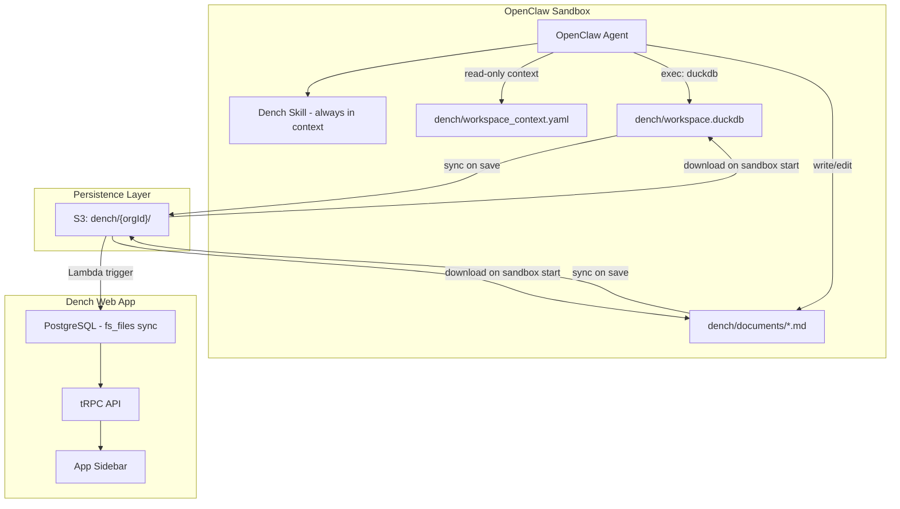

# Dench Filesystem-First CRM via OpenClaw

## Architecture Overview

The current Dench CRM agent uses 15+ individual tRPC-backed tools (createObjectTool, createFieldTool, createEntryTool, searchEntriesTool, etc.) that each make a Prisma call. This is slow -- the agent often needs 10+ tool calls for a single user request.

The new architecture gives OpenClaw a `dench/` workspace folder with a DuckDB database and markdown files. The agent generates SQL directly via `exec` (duckdb CLI) and writes documents as `.md` files. S3 syncs this data between sandbox sessions, and Dench's sidebar reads from S3/PostgreSQL.

**Why DuckDB over SQLite:**

- Native PIVOT/UNPIVOT -- essential for the EAV (Entity-Attribute-Value) pattern used by custom fields; every "show me entries as a table" query needs pivot
- PostgreSQL-compatible SQL dialect -- matches Dench's Supabase/Postgres, so generated SQL is portable
- Native JSON type -- clean handling of `enum_values`, `enum_colors`, field mappings (no JSON1 extension needed)
- Built-in CSV/Parquet import/export with auto-detection -- bulk CRM operations ("import 500 leads from CSV")
- FTS extension -- full-text search across entry fields
- `generate_series` + macros -- nanoid 32 generation in pure SQL
- ~50-100ms startup overhead is acceptable given agent tool-call overhead is already 200-500ms



---

## Phase 1: Always-In-Context Skill Infrastructure (OpenClaw)

Currently, all skills are lazy-loaded: only name + description appear in the system prompt, and the agent must `read` the SKILL.md to get full instructions. For the Dench CRM skill, we need the full content injected automatically.

**Approach:** Add an `inject: true` flag to skill metadata. When set, the skill's full content is included in the system prompt alongside bootstrap files (in the "Project Context" section), not in the lazy-loaded skills list.

**Files to modify:**

- [src/agents/skills/types.ts](src/agents/skills/types.ts) -- Add `inject?: boolean` to `OpenClawSkillMetadata`
- [src/agents/skills/workspace.ts](src/agents/skills/workspace.ts) -- In `buildWorkspaceSkillSnapshot()`, separate injected skills from lazy-loaded skills. Return injected skill contents alongside the prompt.
- [src/agents/system-prompt.ts](src/agents/system-prompt.ts) -- Accept injected skill content and include it in the "Project Context" / "Workspace Files" section (similar to how bootstrap files like AGENTS.md are included via `contextFiles`)
- [src/agents/pi-embedded-runner/run.ts](src/agents/pi-embedded-runner/run.ts) -- Pass injected skill content through to the system prompt builder

**Key change in `buildWorkspaceSkillSnapshot`:**

```typescript
// New return type addition
export type SkillSnapshot = {
  prompt: string; // lazy-loaded skills prompt (XML)
  injectedContent?: string; // always-in-context skill content (concatenated)
  skills: Array<{ name: string; primaryEnv?: string }>;
  // ...
};
```

---

## Phase 2: Dench CRM Skill (OpenClaw)

Create `skills/dench/SKILL.md` with:

- Full DuckDB schema reference
- nanoid 32 macro for ID generation (matching Dench's Supabase nanoid IDs)
- SQL patterns for all CRUD operations including PIVOT for table views
- Document management instructions
- Workspace structure documentation
- CRM patterns (contact, lead, deal, etc.) ported from the [Dench CRM agent prompt](file:///Users/kumareth/Documents/projects/dench/src/lib/agents/crm-agent.ts)

**New file:** `skills/dench/SKILL.md`

**Skill frontmatter:**

```yaml
---
name: dench
description: Manage Dench CRM workspace - create objects, fields, entries via DuckDB and documents as markdown files
metadata:
  openclaw:
    inject: true
    emoji: "📊"
---
```

**Workspace directory structure managed by the skill:**

```
~/.openclaw/workspace/dench/
  workspace_context.yaml  # READ-ONLY context (org, members, integrations, defaults)
  workspace.duckdb        # DuckDB database (CRM data)
  documents/            # Markdown documents (nested by path)
    getting-started.md
    projects/
      project-alpha.md
  exports/              # Generated CSV/Excel exports
  WORKSPACE.md          # Auto-generated schema documentation
```

**workspace_context.yaml** -- read-only context the agent consumes on startup (written by Dench, never by the agent):

```yaml
# Dench Workspace Context (READ-ONLY)
# This file is generated by Dench and synced via S3.
# The agent reads this for organizational context but MUST NOT modify it.
# Changes flow from Dench UI -> S3 -> this file (on sandbox init).

workspace:
  version: 1

# Organization identity (synced from Dench on sandbox init)
organization:
  id: "org_abc123"
  name: "Acme Corp"
  slug: "acme-corp"
  business:
    name: "Acme Corporation"
    type: "saas" # saas, agency, ecommerce, services, etc.
    industry: "Technology"
    website: "https://acme.com"

# Team members -- needed for "user" type fields (e.g. "Assigned To")
# Agent uses these IDs when creating entries with user-type fields.
members:
  - id: "usr_abc123"
    name: "John Doe"
    email: "john@acme.com"
    role: owner
  - id: "usr_def456"
    name: "Jane Smith"
    email: "jane@acme.com"
    role: admin
  - id: "usr_ghi789"
    name: "Bob Wilson"
    email: "bob@acme.com"
    role: member

# Protected objects -- cannot be deleted/renamed by agent
# Mirrors Dench's base-objects.ts immutable list
protected_objects:
  - name: "people"
    description: "Contact records"
    icon: "users"
  - name: "companies"
    description: "Company records"
    icon: "building-2"

# Connected integrations -- agent reads this for sync context
# Populated by Dench when sandbox initializes from S3
integrations:
  connections: []
  # Example when connected:
  # - app_key: "salesforce"
  #   app_name: "Salesforce"
  #   connection_id: "conn_xyz"
  #   synced_objects:
  #     - external_resource: "Lead"
  #       local_object: "lead"
  #       sync_direction: bidirectional  # import, export, bidirectional
  #       sync_frequency: hourly         # realtime, hourly, daily, manual
  #       field_mappings:
  #         "FirstName": "Full Name"
  #         "Email": "Email Address"

# Enrichment configuration
enrichment:
  enabled: false
  provider: "aviato" # aviato, apollo
  auto_enrich: false # Auto-enrich new entries on creation

# CRM defaults
defaults:
  default_view: table # table, kanban
  date_format: "YYYY-MM-DD"
  naming_convention: singular_lowercase # Object names: "lead" not "Leads"

# S3 persistence
sync:
  s3_bucket: "dench-workspaces"
  s3_prefix: "" # Set to org_id on init
  frequency: on_write # on_write, manual
  last_synced_at: null

# Credit account (for enrichment, AI operations)
credits:
  allowance_balance: 0
  topup_balance: 0
```

**Why YAML for context (not DuckDB):** This is read-only context the agent consumes once at startup -- never writes. The agent can `cat workspace_context.yaml` to understand the full org context instantly. Members list means no separate query to resolve user-type field assignments. Integrations give awareness of sync relationships without querying external APIs. This follows the Fintool pattern where user state (preferences, watchlists) lives as YAML in S3 while dense queryable data lives in the database. The data flow is one-way: Dench UI -> S3 -> workspace_context.yaml (on sandbox init). The agent never writes back to this file.

**DuckDB schema** (initialized by agent on first use via `duckdb dench/workspace.duckdb`):

```sql
-- nanoid 32 macro: generates 32-char IDs matching Dench's Supabase nanoid format
CREATE OR REPLACE MACRO nanoid32() AS (
  SELECT string_agg(
    substr('0123456789ABCDEFGHIJKLMNOPQRSTUVWXYZabcdefghijklmnopqrstuvwxyz_-',
      (floor(random() * 64) + 1)::int, 1), '')
  FROM generate_series(1, 32)
);

CREATE TABLE IF NOT EXISTS objects (
  id VARCHAR PRIMARY KEY DEFAULT (nanoid32()),
  name VARCHAR NOT NULL,
  description VARCHAR,
  icon VARCHAR,
  default_view VARCHAR DEFAULT 'table',  -- 'table' or 'kanban'
  parent_document_id VARCHAR,
  sort_order INTEGER DEFAULT 0,
  source_app VARCHAR,
  immutable BOOLEAN DEFAULT false,
  created_at TIMESTAMPTZ DEFAULT now(),
  updated_at TIMESTAMPTZ DEFAULT now(),
  UNIQUE(name)
);

CREATE TABLE IF NOT EXISTS fields (
  id VARCHAR PRIMARY KEY DEFAULT (nanoid32()),
  object_id VARCHAR NOT NULL REFERENCES objects(id) ON DELETE CASCADE,
  name VARCHAR NOT NULL,
  description VARCHAR,
  type VARCHAR NOT NULL,  -- text, number, email, phone, boolean, date, richtext, user, relation, enum
  required BOOLEAN DEFAULT false,
  default_value VARCHAR,
  related_object_id VARCHAR REFERENCES objects(id) ON DELETE SET NULL,
  relationship_type VARCHAR,  -- one_to_one, one_to_many, many_to_one, many_to_many
  enum_values JSON,     -- ["New","In Progress","Done"]
  enum_colors JSON,     -- ["#ef4444","#f59e0b","#22c55e"]
  enum_multiple BOOLEAN DEFAULT false,
  sort_order INTEGER DEFAULT 0,
  created_at TIMESTAMPTZ DEFAULT now(),
  updated_at TIMESTAMPTZ DEFAULT now(),
  UNIQUE(object_id, name)
);

CREATE TABLE IF NOT EXISTS entries (
  id VARCHAR PRIMARY KEY DEFAULT (nanoid32()),
  object_id VARCHAR NOT NULL REFERENCES objects(id) ON DELETE CASCADE,
  sort_order INTEGER DEFAULT 0,
  created_at TIMESTAMPTZ DEFAULT now(),
  updated_at TIMESTAMPTZ DEFAULT now()
);

CREATE TABLE IF NOT EXISTS entry_fields (
  id VARCHAR PRIMARY KEY DEFAULT (nanoid32()),
  entry_id VARCHAR NOT NULL REFERENCES entries(id) ON DELETE CASCADE,
  field_id VARCHAR NOT NULL REFERENCES fields(id) ON DELETE CASCADE,
  value VARCHAR,
  created_at TIMESTAMPTZ DEFAULT now(),
  updated_at TIMESTAMPTZ DEFAULT now(),
  UNIQUE(entry_id, field_id)
);

CREATE TABLE IF NOT EXISTS statuses (
  id VARCHAR PRIMARY KEY DEFAULT (nanoid32()),
  object_id VARCHAR NOT NULL REFERENCES objects(id) ON DELETE CASCADE,
  name VARCHAR NOT NULL,
  color VARCHAR DEFAULT '#94a3b8',
  sort_order INTEGER DEFAULT 0,
  is_default BOOLEAN DEFAULT false,
  created_at TIMESTAMPTZ DEFAULT now(),
  updated_at TIMESTAMPTZ DEFAULT now(),
  UNIQUE(object_id, name)
);

CREATE TABLE IF NOT EXISTS documents (
  id VARCHAR PRIMARY KEY DEFAULT (nanoid32()),
  title VARCHAR DEFAULT 'Untitled',
  icon VARCHAR,
  cover_image VARCHAR,
  file_path VARCHAR NOT NULL UNIQUE,  -- relative path in documents/ dir
  parent_id VARCHAR REFERENCES documents(id) ON DELETE CASCADE,
  parent_object_id VARCHAR REFERENCES objects(id) ON DELETE CASCADE,
  sort_order INTEGER DEFAULT 0,
  is_published BOOLEAN DEFAULT false,
  created_at TIMESTAMPTZ DEFAULT now(),
  updated_at TIMESTAMPTZ DEFAULT now()
);

-- Full-text search index (DuckDB FTS extension)
INSTALL fts; LOAD fts;
```

**Auto-generated views** -- after every object/field mutation, the agent regenerates a PIVOT view for each object. These are stored queries (zero data duplication) that make the EAV pattern invisible:

```sql
-- Auto-generated after creating the "leads" object and its fields
CREATE OR REPLACE VIEW v_leads AS
PIVOT (
  SELECT e.id as entry_id, e.created_at, e.updated_at,
         f.name as field_name, ef.value
  FROM entries e
  JOIN entry_fields ef ON ef.entry_id = e.id
  JOIN fields f ON f.id = ef.field_id
  WHERE e.object_id = (SELECT id FROM objects WHERE name = 'leads')
) ON field_name USING first(value);

-- Now query like a normal table:
SELECT * FROM v_leads WHERE "Status" = 'New' ORDER BY "Full Name" LIMIT 50;
SELECT "Status", COUNT(*) FROM v_leads GROUP BY "Status";
SELECT * FROM v_leads WHERE "Email Address" LIKE '%@gmail.com';
```

Views are regenerated (not data, just the query definition) whenever fields are added/removed/renamed. Naming convention: `v_{object_name}` (e.g., `v_leads`, `v_companies`, `v_people`).

**Filesystem directory structure** -- auto-projected from DuckDB after schema mutations. Represents the sidebar's nested knowledge tree. NO entry data in the filesystem (DuckDB is sole source of truth for entries):

```
dench/
  workspace.duckdb              # SOLE source of truth for all structured data + views
  workspace_context.yaml        # Read-only org context
  knowledge/                    # Root of knowledge tree (= sidebar root)
    people/                     # Object "people" (directory = object node in sidebar)
      .object.yaml              # Lightweight metadata projection (id, icon, view, field list)
      onboarding-guide.md       # Document nested UNDER the people object
    companies/                  # Object "companies"
      .object.yaml
    projects/                   # Document "Projects" (directory with children)
      projects.md               # Document content
      tasks/                    # Object nested UNDER the projects document
        .object.yaml
      roadmap.md                # Sibling document
    sales/
      sales.md
      leads/                    # Object nested under sales document
        .object.yaml
        follow-up-playbook.md   # Document nested under leads object
  exports/                      # CSV/Parquet exports (on-demand, not auto-generated)
  WORKSPACE.md                  # Auto-generated schema summary
```

**Source of truth rules:**

- **Entries (rows)**: DuckDB ONLY (queried via `v_{object}` views). Never duplicated to filesystem.
- **Fields (columns)**: DuckDB. Summary projected to `.object.yaml` (read-only).
- **Objects (tables)**: DuckDB. Projected as directories + `.object.yaml` (read-only). Queryable via auto-generated views.
- **Document metadata**: DuckDB. Projected as directory structure (read-only).
- **Document content**: Filesystem (`.md` files). DuckDB stores `file_path` reference only.
- **Nesting/ordering**: DuckDB. Projected as directory hierarchy (read-only).

**Key DuckDB advantages leveraged:**

- **PIVOT views**: Auto-generated `v_{object}` views make EAV invisible -- query like normal tables
- **Native JSON**: `enum_values` and `enum_colors` are native JSON columns, no string parsing needed
- **CSV import**: `COPY v_leads TO 'exports/leads.csv';` or import with `COPY ... FROM 'import.csv' (AUTO_DETECT true);`
- **PostgreSQL dialect**: Generated SQL is directly portable to Dench's Supabase/Postgres

**Skill content structure** -- the full SKILL.md incorporates and adapts every section from Dench's existing CRM agent prompt ([src/lib/agents/crm-agent.ts](file:///Users/kumareth/Documents/projects/dench/src/lib/agents/crm-agent.ts)), rewritten for DuckDB/filesystem execution instead of tool calls:

### Section 1: Role and Workspace Startup

- Role: Dench CRM Management Agent operating via DuckDB and filesystem
- On every conversation: read `dench/workspace_context.yaml` (READ-ONLY) for org context, members, integrations, protected objects
- Initialize DuckDB if not exists: `duckdb dench/workspace.duckdb < schema.sql`
- Database path: `dench/workspace.duckdb`, documents path: `dench/documents/`

### Section 2: Primary Responsibilities (adapted from `<primary_responsibilities>`)

- **Request analysis**: Same as original -- extract intent, identify entities/objects/fields/relationships, transform vague requests into structured SQL
- **Object creation**: Instead of `createObjectTool`, generate `INSERT INTO objects` SQL. Naming convention: singular, lowercase (e.g., "lead", "customer"). Check existing with `SELECT` first. For kanban: auto-create Status (enum) and Assigned To (user) fields in same transaction
- **Field management**: Instead of `createFieldTool`, generate `INSERT INTO fields` SQL. Field types: text, number, email, phone, boolean, date, richtext, user, relation, enum. Use `INSERT ... ON CONFLICT (object_id, name) DO UPDATE` for idempotency
- **Entry creation**: Instead of `createEntryTool`, generate `INSERT INTO entries` + `INSERT INTO entry_fields` in a transaction. Resolve field names to field IDs via `SELECT id FROM fields WHERE object_id = ? AND name = ?`
- **Entry search**: Instead of `searchEntriesTool`, generate PIVOT queries with WHERE/LIKE/ORDER BY. Use DuckDB FTS for full-text search. Operators: `=` (equals), `LIKE '%...%'` (contains), `LIKE '...%'` (startsWith), `LIKE '%...'` (endsWith), `IS NULL` (isEmpty), `IS NOT NULL` (isNotEmpty)

### Section 3: SQL Operation Guide (replaces `<tool_usage_guide>`)

Each former tool maps to SQL patterns:

- **createObjectTool -> INSERT object**: `INSERT INTO objects (name, description, icon, default_view) VALUES (...) ON CONFLICT (name) DO NOTHING RETURNING *;`
- **createFieldTool -> INSERT field**: `INSERT INTO fields (object_id, name, type, required, enum_values, enum_colors, related_object_id, relationship_type, sort_order) VALUES (...) ON CONFLICT (object_id, name) DO UPDATE SET ...;`
- **createEntryTool -> INSERT entry + entry_fields**: Transaction with `INSERT INTO entries` then `INSERT INTO entry_fields` for each field value
- **getObjectTool -> SELECT object + fields**: `SELECT o.*, json_group_array(json_object('id', f.id, 'name', f.name, 'type', f.type)) as fields FROM objects o LEFT JOIN fields f ON f.object_id = o.id WHERE o.id = ? GROUP BY o.id;`
- **getObjectsTool -> SELECT all objects**: `SELECT o.*, COUNT(e.id) as entry_count FROM objects o LEFT JOIN entries e ON e.object_id = o.id GROUP BY o.id ORDER BY o.sort_order;`
- **getOrganizationMembersTool -> READ workspace_context.yaml**: Members list is in `workspace_context.yaml` under `members:`. Read with `cat dench/workspace_context.yaml` and extract the members section. User fields store member IDs like `usr_abc123`.
- **searchEntriesTool -> query the auto-generated view**:
  ```sql
  -- Simple: query the pre-built PIVOT view like a normal table
  SELECT * FROM v_leads WHERE "Status" = 'New' ORDER BY created_at DESC LIMIT 50;
  SELECT * FROM v_leads WHERE "Email Address" LIKE '%@gmail.com';
  SELECT * FROM v_leads WHERE "Full Name" ILIKE '%john%';
  SELECT "Status", COUNT(*) FROM v_leads GROUP BY "Status";
  ```
  Views are auto-generated per object (`v_{object_name}`) so the agent never writes raw PIVOT queries for reads.
- **updateObjectTool -> UPDATE object**: `UPDATE objects SET name = ?, description = ?, updated_at = now() WHERE id = ?;`
- **updateFieldTool -> UPDATE field**: `UPDATE fields SET ... WHERE id = ?;`
- **updateEntryTool -> UPSERT entry_fields**: `INSERT INTO entry_fields (entry_id, field_id, value) VALUES (?, ?, ?) ON CONFLICT (entry_id, field_id) DO UPDATE SET value = excluded.value, updated_at = now();`
- **deleteObjectTool -> DELETE cascade**: `DELETE FROM objects WHERE id = ? AND immutable = false;` (cascades to fields, entries, entry_fields via FK)
- **deleteFieldTool -> DELETE field**: `DELETE FROM fields WHERE id = ?;` (cascades to entry_fields)
- **deleteEntryTool -> DELETE entry**: `DELETE FROM entries WHERE id = ?;` (cascades to entry_fields)
- **createManyEntriesTool -> Batch INSERT**: Wrap multiple entry+entry_fields inserts in `BEGIN TRANSACTION; ... COMMIT;`
- **Bulk import from CSV**: `COPY ... FROM 'import.csv' (AUTO_DETECT true);` with field mapping

### Section 4: Execution Workflows (adapted from `<execution_guidelines>`)

Same workflow selection principle: choose the minimal workflow needed based on user intent.

- **Create New CRM Structure**: `SELECT` to check existence -> `INSERT objects` -> `INSERT fields` (all in one `exec` call with multi-statement SQL in a transaction)
- **Search and Display**: Generate PIVOT query with appropriate WHERE/ORDER BY/LIMIT
- **Add New Entries**: `SELECT` object+fields -> `INSERT entries` + `INSERT entry_fields` in transaction
- **Update Existing Data**: PIVOT query to find -> `UPDATE` entry_fields
- **Quick Information**: `SELECT` with aggregate counts
- **Bulk Operations**: Multi-row INSERT in transaction, report counts
- **Data Cleanup**: PIVOT query with filters -> `DELETE` matching entries

Key differences from original:

1. **All steps happen in a single `exec` call** with multi-statement SQL, not 10+ separate tool calls
2. **After schema mutations**: regenerate the `v_{object}` view and project the filesystem directory structure
3. **Reads use views**: `SELECT * FROM v_leads` instead of raw PIVOT queries

Example of creating a full CRM structure in one shot:

```sql
BEGIN TRANSACTION;
INSERT INTO objects (name, description, icon, default_view) VALUES ('lead', 'Sales leads', 'user-plus', 'table') ON CONFLICT (name) DO NOTHING;
INSERT INTO fields (object_id, name, type, required, sort_order) VALUES
  ((SELECT id FROM objects WHERE name = 'lead'), 'Full Name', 'text', true, 0),
  ((SELECT id FROM objects WHERE name = 'lead'), 'Email Address', 'email', true, 1),
  ((SELECT id FROM objects WHERE name = 'lead'), 'Phone Number', 'phone', false, 2)
ON CONFLICT (object_id, name) DO NOTHING;
INSERT INTO fields (object_id, name, type, enum_values, enum_colors, sort_order) VALUES
  ((SELECT id FROM objects WHERE name = 'lead'), 'Status', 'enum',
   '["New","Contacted","Qualified","Converted"]'::JSON,
   '["#94a3b8","#3b82f6","#f59e0b","#22c55e"]'::JSON, 3)
ON CONFLICT (object_id, name) DO NOTHING;

-- Auto-generate the PIVOT view for this object
CREATE OR REPLACE VIEW v_lead AS
PIVOT (
  SELECT e.id as entry_id, e.created_at, e.updated_at,
         f.name as field_name, ef.value
  FROM entries e
  JOIN entry_fields ef ON ef.entry_id = e.id
  JOIN fields f ON f.id = ef.field_id
  WHERE e.object_id = (SELECT id FROM objects WHERE name = 'lead')
) ON field_name USING first(value);

COMMIT;
-- Then: project filesystem structure (mkdir knowledge/lead/, write .object.yaml)
```

### Section 5: CRM Patterns (adapted from `<crm_patterns>`)

Identical patterns, but with SQL examples instead of tool call examples:

- **Contact/Customer**: Full Name (text, required), Email Address (email, required), Phone Number (phone), Company (relation), Notes (richtext)
- **Lead/Prospect**: Full Name, Email, Phone, Status (enum: New/Contacted/Qualified/Converted), Source (enum), Score (number), Assigned To (user), Notes (richtext)
- **Company/Organization**: Company Name (text, required), Industry (enum), Website (text), Type (enum), Notes (richtext)
- **Deal/Opportunity**: Deal Name, Amount (number), Stage (enum: Discovery/Proposal/Negotiation/Closed Won/Closed Lost), Close Date (date), Probability (number), Primary Contact (relation), Assigned To (user), Notes (richtext)
- **Case/Project**: Case Number, Title, Client (relation), Status (enum), Priority (enum), Due Date (date), Assigned To (user), Notes (richtext)
- **Property/Asset**: Address, Property Type (enum), Price (number), Status (enum), Square Footage (number), Bedrooms (number), Notes (richtext)
- **Task/Activity** (kanban): Title, Description, Assigned To (user), Due Date, Status (enum: In Queue/In Progress/Done), Priority (enum), Notes (richtext). Use `default_view = 'kanban'` and auto-create Status + Assigned To fields.

### Section 6: Field Type Reference (adapted from `<field_type_selection>`)

- **text**: General text data, names, descriptions, addresses. Stored as VARCHAR.
- **email**: Email addresses. Stored as VARCHAR. Agent validates format.
- **phone**: Phone numbers. Stored as VARCHAR. Agent normalizes format.
- **number**: Numeric values (prices, quantities, scores). Stored as VARCHAR in entry_fields (EAV), cast with `::NUMERIC` in queries.
- **boolean**: Yes/no flags. Stored as "true"/"false" strings.
- **date**: Dates. Stored as ISO 8601 strings. Cast with `::DATE` in queries.
- **richtext**: Rich text for Notes fields. Content stored as entry_field value (plain text / markdown). Displayed in Notion-style editor in Dench UI.
- **user**: Person/assignee fields. Stores member ID (e.g., "usr_abc123") from `workspace_context.yaml` members list. ALWAYS resolve member name -> ID before inserting.
- **enum**: Dropdown/select fields. Field definition stores `enum_values` as JSON array. Entry stores the selected value string. `enum_colors` parallel array for styling. `enum_multiple = true` for multi-select (value stored as JSON array string).
- **relation**: Links to entries in another object. Field stores `related_object_id` and `relationship_type`. Entry stores the related entry ID(s). `many_to_one` for single select, `many_to_many` for multi-select (stored as JSON array).

### Section 7: Naming Conventions and Data Handling (adapted from `<field_naming_conventions>` and `<data_handling_best_practices>`)

- Object names: singular, lowercase, one word ("lead" not "Leads")
- Field names: human-readable, proper capitalization ("Email Address" not "email")
- Be descriptive: "Phone Number" not "Phone"
- Be consistent within an object
- Validate email formats, normalize phone numbers, use ISO 8601 dates
- Trim whitespace from all values
- Check for duplicates before creating entries (SELECT before INSERT)

### Section 8: Error Handling (adapted from `<error_handling>`)

- `UNIQUE constraint` on INSERT -> item already exists, treat as SUCCESS (use `ON CONFLICT DO NOTHING` or `DO UPDATE`)
- Protected object deletion -> check `immutable` column and `protected_objects` in workspace_context.yaml
- Field type mismatch -> warn user before changing type on field with existing data
- Missing required fields -> validate before INSERT, report which fields are missing

### Section 9: Document Management (new -- not in original CRM agent)

- Create document: `write` tool to create `dench/documents/<path>.md` + `INSERT INTO documents` with metadata
- Document content is the .md file; DuckDB `documents` table tracks metadata (title, icon, nesting, order)
- Cross-nesting: documents under objects (`parent_object_id`), objects under documents (`parent_document_id`)
- Document tree mirrors filesystem: `dench/documents/projects/alpha.md` -> `file_path = 'projects/alpha.md'`

### Section 10: Protected Objects and Read-Only Context (new)

- Read `protected_objects` from `workspace_context.yaml` on startup
- NEVER delete, rename, or modify immutable objects (People, Companies)
- NEVER modify `workspace_context.yaml` -- it is read-only context from Dench
- Members list is authoritative for user-type field resolution

### Section 11: Post-Mutation Checklist (MANDATORY -- revised after agent testing)

**Problem identified:** In testing, the agent correctly executed SQL (object + fields + entries) but skipped the filesystem projection (.object.yaml) and sometimes the PIVOT view. Root cause: the original skill mentioned these as afterthoughts ("Then project the filesystem...") with no concrete template or examples. The agent follows examples literally -- if examples only show SQL, it only does SQL.

**Fix:** Every workflow example now uses an explicit 3-step structure. The post-mutation section is now a checklist, not a description.

After creating/modifying an OBJECT or FIELDS:

- `CREATE OR REPLACE VIEW v_{object_name}` -- regenerate PIVOT view
- `mkdir -p dench/knowledge/{object_name}/` -- create directory
- Write `.object.yaml` with id, name, description, icon, default_view, entry_count, and full field list
- Update WORKSPACE.md

After adding ENTRIES:

- Update `entry_count` in `.object.yaml`
- Verify: `SELECT * FROM v_{object} LIMIT 5`

After deleting an OBJECT:

- `DROP VIEW IF EXISTS v_{object_name}`
- `rm -rf dench/knowledge/{object_name}/`

The skill now includes:

- A concrete `.object.yaml` template with example content (previously missing entirely)
- Full bash commands for generating `.object.yaml` from DuckDB queries
- "Step 1 / Step 2 / Step 3" structure in every workflow example (SQL, Filesystem, Verify)
- Critical Reminders section leads with "NEVER SKIP FILESYSTEM PROJECTION" and "THREE STEPS, EVERY TIME"

### Section 12: Critical Reminders (adapted from `<critical_reminders>`)

- Handle the ENTIRE CRM operation from analysis to SQL execution **to filesystem projection** to summary
- **NEVER SKIP FILESYSTEM PROJECTION**: After any object mutation, create/update `.object.yaml` AND the `v_{object}` view. If missing, the object is invisible in the sidebar.
- **THREE STEPS, EVERY TIME**: (1) SQL transaction, (2) filesystem projection, (3) verify
- Always check existing data before creating (SELECT before INSERT, or ON CONFLICT)
- Search proactively to provide better UX (PIVOT with filters)
- Never assume field names -- always verify with `SELECT * FROM fields WHERE object_id = ?`
- Extract ALL data from user messages
- NOTES FIELDS: type "richtext", displayed in Notion editor
- USER FIELDS: Resolve member name to ID from workspace_context.yaml BEFORE inserting
- ENUM FIELDS: type "enum" with `enum_values` JSON array
- RELATION FIELDS: type "relation" with `related_object_id`
- KANBAN BOARDS: `default_view = 'kanban'`, auto-create Status and Assigned To fields
- PROTECTED OBJECTS: Never delete objects listed in `workspace_context.yaml` `protected_objects`
- ONE EXEC CALL: Batch related SQL in a single transaction whenever possible -- this is the entire point of the filesystem-first approach
- ENTRY COUNT: After adding entries, update `entry_count` in `.object.yaml`

---

## Phase 3: S3 Sync Layer

**Two sync directions:**

1. **Sandbox -> S3:** After every database write or document save, sync changed files to S3
2. **S3 -> Sandbox:** On sandbox startup, download the latest dench/ folder from S3

**Option A (simpler): Script-based sync**

- Add a `dench/sync.sh` script that the agent calls after mutations
- Uses AWS CLI: `aws s3 sync dench/ s3://dench-workspaces/{orgId}/`
- Credentials injected via ABAC (short-lived, scoped to org prefix)
- Skill instructs the agent to run sync after writes

**Option B (more robust): inotifywait + background sync**

- Background process watches dench/ for changes
- Debounced sync to S3 (e.g., 5s after last change)
- More reliable but more infrastructure

**Recommendation:** Start with Option A. The agent is already making exec calls; one more `aws s3 sync` is trivial.

**New file:** `skills/dench/sync.sh` (bundled with the skill, referenced by SKILL.md)

**Sandbox startup hook:**

- Add to OpenClaw's sandbox initialization: download dench workspace from S3 if it exists
- Could be a `BOOTSTRAP.md` instruction or a sandbox pre-warm step

---

## Phase 4: Dench Sidebar Integration

The Dench sidebar currently reads from Prisma (`getAll` objects + `getAll` documents). It needs a new data source for workspace-managed data.

**Approach:** Add a new tRPC endpoint that reads from S3 (or the synced PostgreSQL `fs_files` table) and returns the same tree structure the sidebar expects.

**Files to modify in Dench:**

- [src/lib/trpc/routers/objects.ts](file:///Users/kumareth/Documents/projects/dench/src/lib/trpc/routers/objects.ts) -- Add `getWorkspaceObjects` endpoint that queries the synced SQLite data (either by reading dench.db from S3, or from a PostgreSQL materialized view)
- [src/lib/trpc/routers/documents.ts](file:///Users/kumareth/Documents/projects/dench/src/lib/trpc/routers/documents.ts) -- Add `getWorkspaceDocuments` endpoint
- [src/components/app-sidebar.tsx](file:///Users/kumareth/Documents/projects/dench/src/components/app-sidebar.tsx) -- Merge workspace data into the `buildKnowledgeTree` function

**S3 -> PostgreSQL sync (Lambda):**

- When workspace.duckdb is uploaded to S3, a Lambda function:
  1. Downloads the DuckDB file
  2. Reads objects, fields, entries, documents tables
  3. Upserts into PostgreSQL tables (or a dedicated `workspace_objects`, `workspace_documents` table)
- This mirrors the Fintool pattern: S3 source of truth, Lambda sync, PG for fast queries

**Alternative (simpler for v1):** Dench backend downloads workspace.duckdb from S3 on demand and queries it directly using `duckdb` Node.js bindings (`@duckdb/node-api`). No Lambda needed initially.

---

## Phase 5: Real-Time Updates (Future)

- WebSocket notifications when S3 objects change (via S3 Event Notifications -> SNS -> WebSocket)
- Dench sidebar auto-refreshes when workspace data changes
- Bidirectional: Dench UI edits write back to S3, agent picks up changes on next sandbox start

---

## Key Design Decisions

- **Three-layer storage** (following Fintool pattern):
  - **YAML** (`workspace_context.yaml`): Read-only workspace identity, team members, integrations, defaults. Written by Dench, consumed by agent. Never modified by the agent -- data flows one-way from Dench UI -> S3 -> this file.
  - **DuckDB** (`workspace.duckdb`): Dense, relational CRM data (objects, fields, entries, statuses). Queryable via SQL with PIVOT, JOIN, FTS.
  - **Markdown** (`documents/*.md`): Rich document content. Agent uses `write`/`edit` tools directly. DuckDB tracks metadata (title, icon, nesting) while the file system holds the content.
- **DuckDB over SQLite**: Native PIVOT/UNPIVOT is essential for the EAV data model (rendering custom-field entries as tables). PostgreSQL-compatible SQL dialect means generated SQL is portable to Dench's Supabase/Postgres. Native JSON type eliminates string parsing for enum_values/colors. Built-in CSV/Parquet import with auto-detection enables bulk CRM operations. FTS extension provides full-text search. ~50-100ms startup overhead is acceptable.
- **nanoid 32 IDs**: Matches Dench's Supabase PostgreSQL nanoid format. Generated via a DuckDB macro using `generate_series` + `random()` over the standard nanoid alphabet (`0-9A-Za-z_-`). 32 chars provides 192 bits of entropy.
- **Members in YAML not DuckDB**: The agent needs member IDs for "user" type fields (like "Assigned To"). Putting members in workspace_context.yaml means the agent reads them once on startup without a separate SQL query. The list changes infrequently (team changes, not per-request). Agent reads only, never writes.
- **Integrations in YAML not DuckDB**: The agent needs to know what apps are connected and how fields map, but doesn't need to query this relationally. YAML gives the agent instant context about sync relationships. Agent reads only, never writes.
- **Skill inject vs bootstrap file**: Using skill metadata `inject: true` is cleaner than adding a new bootstrap file type. It keeps the Dench instructions modular and version-controlled in the skills directory.
- **One transaction per operation**: The skill instructs the agent to wrap multi-step operations in `BEGIN ... COMMIT` for atomicity. DuckDB supports full ACID transactions.
