# Design Document

## Overview

This design adds Amazon Bedrock Guardrails support to the `amazon-bedrock` extension plugin. Bedrock Guardrails let operators apply content filtering, topic denial, word filters, sensitive information filters, and contextual grounding checks to model invocations by injecting a `guardrailConfig` field into the Bedrock Converse API request payload.

The change is self-contained within `extensions/amazon-bedrock`. It extends the plugin's `configSchema` in `openclaw.plugin.json` with a `guardrail` object, reads that config via `api.pluginConfig` at registration time, and wraps the existing `wrapStreamFn` with an outer layer that uses `streamWithPayloadPatch` to inject `guardrailConfig` into every outgoing payload. The wrapper composes around the existing Anthropic-vs-non-Anthropic cache behavior logic so both features work together.

## Architecture

```mermaid
flowchart TD
    A[Plugin Config<br/>guardrail object] -->|read at register time| B[register&#40;api&#41;]
    B --> C{guardrail<br/>present?}
    C -- yes --> D[createGuardrailWrapper&#40;innerWrapStreamFn, guardrailConfig&#41;]
    C -- no --> E[Original wrapStreamFn<br/>unchanged]
    D --> F[Outer StreamFn]
    F -->|delegates to| G[Inner wrapStreamFn<br/>cache behavior logic]
    G --> H{isAnthropicBedrockModel?}
    H -- yes --> I[passthrough streamFn]
    H -- no --> J[createBedrockNoCacheWrapper]
    I --> K[streamWithPayloadPatch<br/>injects guardrailConfig]
    J --> K
    K --> L[Bedrock ConverseStreamCommand]
```



The guardrail wrapper is the outermost layer. It first delegates to the inner `wrapStreamFn` (which handles cache behavior), then applies `streamWithPayloadPatch` on the resulting `StreamFn` to inject `guardrailConfig` into the payload. This preserves the existing `onPayload` chain.

## Components and Interfaces

### 1. Config Schema Extension (`openclaw.plugin.json`)

The `configSchema.properties` gains a `guardrail` object:

```json
{
  "guardrail": {
    "type": "object",
    "additionalProperties": false,
    "properties": {
      "guardrailIdentifier": { "type": "string" },
      "guardrailVersion": { "type": "string" },
      "streamProcessingMode": { "type": "string", "enum": ["sync", "async"] },
      "trace": { "type": "string", "enum": ["enabled", "disabled", "enabled_full"] }
    },
    "required": ["guardrailIdentifier", "guardrailVersion"]
  }
}
```

The `guardrail` property itself is optional at the top level (no `required` array on the root object), so omitting it entirely means no guardrail injection.

### 2. GuardrailConfig Type (`extensions/amazon-bedrock/index.ts`)

A local type representing the resolved guardrail config:

```typescript
type GuardrailConfig = {
  guardrailIdentifier: string;
  guardrailVersion: string;
  streamProcessingMode?: "sync" | "async";
  trace?: "enabled" | "disabled" | "enabled_full";
};
```

### 3. Guardrail Wrapper Factory

A pure function that takes the inner `wrapStreamFn` callback and a `GuardrailConfig`, and returns a new `wrapStreamFn` callback:

```typescript
function createGuardrailWrapStreamFn(
  innerWrapStreamFn: (ctx: ProviderWrapStreamFnContext) => StreamFn | null | undefined,
  guardrailConfig: GuardrailConfig,
): (ctx: ProviderWrapStreamFnContext) => StreamFn | null | undefined
```

Internally it:
1. Calls `innerWrapStreamFn(ctx)` to get the cache-behavior-wrapped `StreamFn`.
2. Returns a new `StreamFn` that calls `streamWithPayloadPatch` on the inner result, injecting `guardrailConfig` fields into the payload.

### 4. Payload Patch Logic

The `patchPayload` callback passed to `streamWithPayloadPatch`:

```typescript
(payload: Record<string, unknown>) => {
  const gc: Record<string, unknown> = {
    guardrailIdentifier: guardrailConfig.guardrailIdentifier,
    guardrailVersion: guardrailConfig.guardrailVersion,
  };
  if (guardrailConfig.streamProcessingMode) {
    gc.streamProcessingMode = guardrailConfig.streamProcessingMode;
  }
  if (guardrailConfig.trace) {
    gc.trace = guardrailConfig.trace;
  }
  payload.guardrailConfig = gc;
}
```

This always sets `guardrailIdentifier` and `guardrailVersion`, and conditionally includes `streamProcessingMode` and `trace` only when specified.

### 5. Registration Wiring (`register(api)`)

In `register(api)`:
1. Read `api.pluginConfig` and extract the `guardrail` property.
2. If `guardrail` is present and has the required fields, build a `GuardrailConfig`.
3. If guardrail config exists, wrap the `wrapStreamFn` with `createGuardrailWrapStreamFn`.
4. Otherwise, use the existing `wrapStreamFn` unchanged.

### 6. Documentation Update (`docs/providers/bedrock.md`)

A new "Guardrails" section added after the existing "Notes" section, containing:
- Configuration example with the `guardrail` object in plugin config.
- Note that `guardrailIdentifier` accepts both guardrail IDs and full ARNs.
- Required IAM permission: `bedrock:ApplyGuardrail`.

## Data Models

### Plugin Config Shape (after change)

```typescript
// Resolved from api.pluginConfig
type BedrockPluginConfig = {
  guardrail?: {
    guardrailIdentifier: string;
    guardrailVersion: string;
    streamProcessingMode?: "sync" | "async";
    trace?: "enabled" | "disabled" | "enabled_full";
  };
};
```

### Bedrock ConverseStreamCommand Payload (injected field)

```typescript
// Added to the outgoing payload by the guardrail wrapper
{
  guardrailConfig: {
    guardrailIdentifier: string;   // e.g. "abc123" or full ARN
    guardrailVersion: string;      // e.g. "1" or "DRAFT"
    streamProcessingMode?: string; // "sync" | "async", omitted if not configured
    trace?: string;                // "enabled" | "disabled" | "enabled_full", omitted if not configured
  }
}
```

## Correctness Properties

*A property is a characteristic or behavior that should hold true across all valid executions of a system — essentially, a formal statement about what the system should do. Properties serve as the bridge between human-readable specifications and machine-verifiable correctness guarantees.*

### Property 1: streamProcessingMode and trace reject invalid values

*For any* string that is not `"sync"` or `"async"`, validating a guardrail config with that string as `streamProcessingMode` should be rejected by the schema. Similarly, *for any* string that is not `"enabled"`, `"disabled"`, or `"enabled_full"`, validating a guardrail config with that string as `trace` should be rejected by the schema.

**Validates: Requirements 1.4, 1.6**

### Property 2: Absent guardrail config means no injection

*For any* model ID and any payload, when the plugin is configured without a `guardrail` object, the resulting payload after `wrapStreamFn` should not contain a `guardrailConfig` field.

**Validates: Requirements 1.5, 3.3**

### Property 3: Guardrail config round-trip into payload

*For any* valid `guardrailIdentifier` string, `guardrailVersion` string, optional `streamProcessingMode` value (`"sync"` or `"async"` or absent), and optional `trace` value (`"enabled"`, `"disabled"`, `"enabled_full"`, or absent), the injected `guardrailConfig` in the outgoing payload should contain exactly `guardrailIdentifier` and `guardrailVersion` matching the config, and should include `streamProcessingMode` and `trace` if and only if they were specified in the config.

**Validates: Requirements 2.1, 2.2, 2.3**

### Property 4: onPayload chain preservation

*For any* existing `onPayload` callback and any valid guardrail config, after guardrail injection the original `onPayload` callback should still be invoked during stream setup.

**Validates: Requirements 2.4**

### Property 5: Guardrail injection composes with cache behavior for all model types

*For any* model ID (Anthropic or non-Anthropic) and any valid guardrail config, the resulting stream options should contain `guardrailConfig` AND preserve the correct cache behavior: non-Anthropic models should have `cacheRetention: "none"`, while Anthropic models should not have `cacheRetention` forced to `"none"`.

**Validates: Requirements 2.5, 3.1, 3.2**

## Error Handling

- **Missing guardrail config**: When `guardrail` is omitted from plugin config, the plugin silently skips guardrail injection. No error, no warning. This is the default path.
- **Invalid streamProcessingMode**: The JSON Schema `enum` constraint rejects values other than `"sync"` or `"async"` at config validation time, before the plugin's `register()` is called. The plugin does not need runtime validation for this field.
- **Invalid trace**: The JSON Schema `enum` constraint rejects values other than `"enabled"`, `"disabled"`, or `"enabled_full"` at config validation time.
- **Missing guardrailIdentifier or guardrailVersion**: The JSON Schema `required` constraint on the `guardrail` object rejects configs missing these fields at validation time.
- **AWS-side guardrail errors**: If the guardrail ID/version is invalid or the IAM role lacks `bedrock:ApplyGuardrail`, the Bedrock API returns an error. This is handled by the existing pi-ai stream error path — no special handling needed in the plugin.
- **onPayload chain failures**: `streamWithPayloadPatch` preserves the original `onPayload` callback. If the original callback throws, the error propagates normally through the stream pipeline.

## Testing Strategy

### Unit Tests (Vitest)

Specific example and edge-case tests:

1. **Schema shape validation**: Verify `openclaw.plugin.json` contains the `guardrail` object with correct property types, required fields, and enum constraint.
2. **No guardrail config**: Register the plugin without a `guardrail` config, call `wrapStreamFn`, and verify no `guardrailConfig` appears in the payload.
3. **Guardrail with all optional fields**: Register with a full guardrail config including `streamProcessingMode: "sync"` and `trace: "enabled"`, verify the payload contains all four fields.
4. **Guardrail without optional fields**: Register with guardrail config omitting `streamProcessingMode` and `trace`, verify the payload contains only `guardrailIdentifier` and `guardrailVersion`.
5. **Anthropic model with guardrail**: Verify an Anthropic model ID gets `guardrailConfig` injected but does not get `cacheRetention: "none"`.
6. **Non-Anthropic model with guardrail**: Verify a non-Anthropic model ID gets both `guardrailConfig` and `cacheRetention: "none"`.
7. **Documentation content**: Verify `docs/providers/bedrock.md` contains a Guardrails section with the required configuration example and IAM permission note.

### Property-Based Tests (fast-check)

Each correctness property is implemented as a single property-based test using `fast-check` (already available in the repo's test dependencies or easily added). Each test runs a minimum of 100 iterations.

Each property test must be tagged with a comment referencing the design property:
- **Feature: bedrock-guardrails, Property 1: streamProcessingMode and trace reject invalid values**
- **Feature: bedrock-guardrails, Property 2: Absent guardrail config means no injection**
- **Feature: bedrock-guardrails, Property 3: Guardrail config round-trip into payload**
- **Feature: bedrock-guardrails, Property 4: onPayload chain preservation**
- **Feature: bedrock-guardrails, Property 5: Guardrail injection composes with cache behavior for all model types**

Property tests validate universal properties across randomly generated inputs (model IDs, guardrail identifiers, versions, streamProcessingMode presence, trace presence). Unit tests cover specific examples, edge cases, and documentation checks. Together they provide comprehensive coverage.
