# AGENT INTERACTION DIAGRAMS - Mermaid Visual Flows

_Diagramas visuais de todos os tipos de interação entre agentes_

---

## 📋 ÍNDICE

1. [sessions_spawn - Delegação Paralela](#1-sessions_spawn---delegação-paralela)
2. [sessions_send - Mensagem Direta](#2-sessions_send---mensagem-direta)
3. [collaboration - Debates Estruturados](#3-collaboration---debates-estruturados)
4. [delegation - Hierarquia Formal](#4-delegation---hierarquia-formal)
5. [team_workspace - Memória Compartilhada](#5-team_workspace---memória-compartilhada)
6. [sessions_inbox - Inbox Assíncrona](#6-sessions_inbox---inbox-assíncrona)
7. [sessions_spawn_batch - Paralelo Massivo](#7-sessions_spawn_batch---paralelo-massivo)
8. [Decision Tree Completo](#decision-tree-completo)

---

## 1. sessions_spawn - Delegação Paralela

### Sequence Diagram

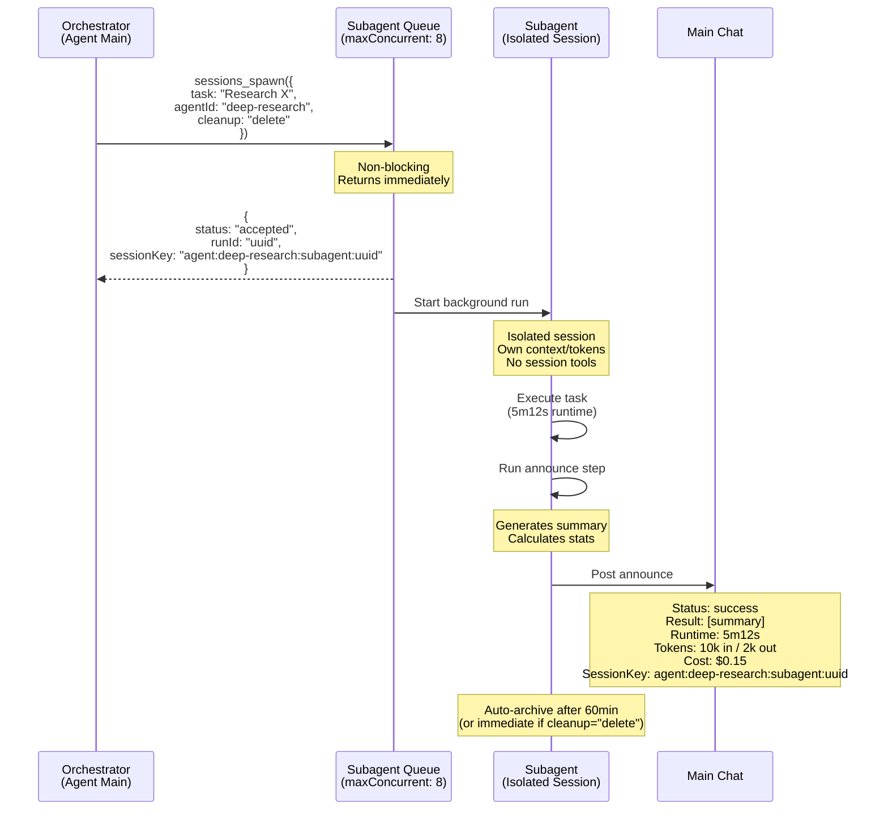
```mermaid
sequenceDiagram
    participant Orch as Orchestrator<br/>(Agent Main)
    participant Queue as Subagent Queue<br/>(maxConcurrent: 8)
    participant Sub as Subagent<br/>(Isolated Session)
    participant Chat as Main Chat

    Orch->>Queue: sessions_spawn({<br/>  task: "Research X",<br/>  agentId: "deep-research",<br/>  cleanup: "delete"<br/>})
    Note over Queue: Non-blocking<br/>Returns immediately
    Queue-->>Orch: {<br/>  status: "accepted",<br/>  runId: "uuid",<br/>  sessionKey: "agent:deep-research:subagent:uuid"<br/>}

    Queue->>Sub: Start background run
    Note over Sub: Isolated session<br/>Own context/tokens<br/>No session tools

    Sub->>Sub: Execute task<br/>(5m12s runtime)

    Sub->>Sub: Run announce step
    Note over Sub: Generates summary<br/>Calculates stats

    Sub->>Chat: Post announce
    Note over Chat: Status: success<br/>Result: [summary]<br/>Runtime: 5m12s<br/>Tokens: 10k in / 2k out<br/>Cost: $0.15<br/>SessionKey: agent:deep-research:subagent:uuid

    Note over Sub: Auto-archive after 60min<br/>(or immediate if cleanup="delete")
```

### State Diagram

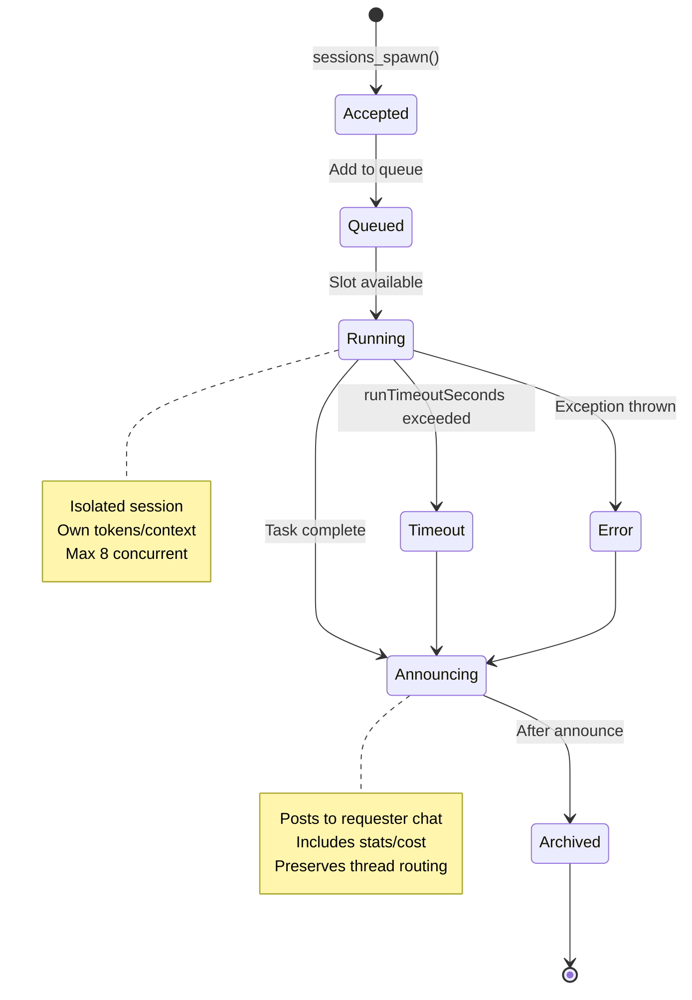
```mermaid
stateDiagram-v2
    [*] --> Accepted: sessions_spawn()
    Accepted --> Queued: Add to queue
    Queued --> Running: Slot available
    Running --> Announcing: Task complete
    Announcing --> Archived: After announce
    Archived --> [*]

    Running --> Timeout: runTimeoutSeconds exceeded
    Running --> Error: Exception thrown
    Timeout --> Announcing
    Error --> Announcing

    note right of Running
        Isolated session
        Own tokens/context
        Max 8 concurrent
    end note

    note right of Announcing
        Posts to requester chat
        Includes stats/cost
        Preserves thread routing
    end note
```

---

## 2. sessions_send - Mensagem Direta

### Sequence Diagram

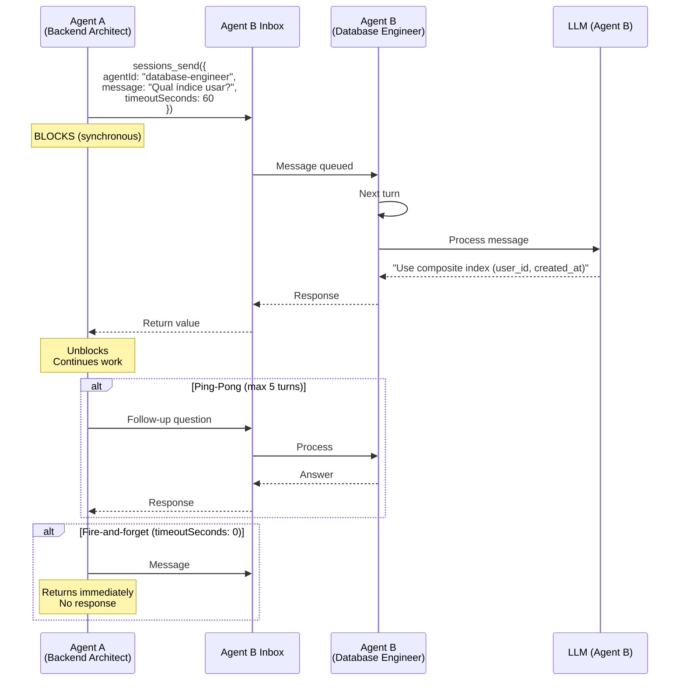
```mermaid
sequenceDiagram
    participant A as Agent A<br/>(Backend Architect)
    participant InboxB as Agent B Inbox
    participant B as Agent B<br/>(Database Engineer)
    participant ModelB as LLM (Agent B)

    A->>InboxB: sessions_send({<br/>  agentId: "database-engineer",<br/>  message: "Qual índice usar?",<br/>  timeoutSeconds: 60<br/>})
    Note over A: BLOCKS (synchronous)

    InboxB->>B: Message queued
    B->>B: Next turn
    B->>ModelB: Process message
    ModelB-->>B: "Use composite index (user_id, created_at)"

    B-->>InboxB: Response
    InboxB-->>A: Return value
    Note over A: Unblocks<br/>Continues work

    alt Ping-Pong (max 5 turns)
        A->>InboxB: Follow-up question
        InboxB->>B: Process
        B-->>InboxB: Answer
        InboxB-->>A: Response
    end

    alt Fire-and-forget (timeoutSeconds: 0)
        A->>InboxB: Message
        Note over A: Returns immediately<br/>No response
    end
```

### State Diagram

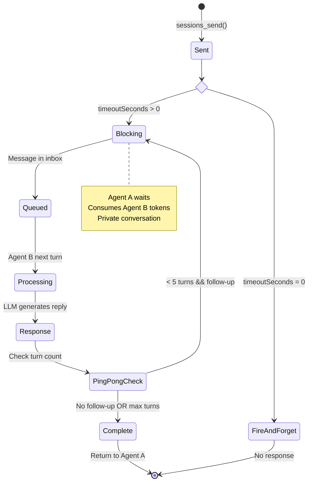
```mermaid
stateDiagram-v2
    [*] --> Sent: sessions_send()

    state timeout_check <<choice>>
    Sent --> timeout_check
    timeout_check --> Blocking: timeoutSeconds > 0
    timeout_check --> FireAndForget: timeoutSeconds = 0

    Blocking --> Queued: Message in inbox
    Queued --> Processing: Agent B next turn
    Processing --> Response: LLM generates reply
    Response --> PingPongCheck: Check turn count

    state PingPongCheck <<choice>>
    PingPongCheck --> Blocking: < 5 turns && follow-up
    PingPongCheck --> Complete: No follow-up OR max turns

    FireAndForget --> [*]: No response
    Complete --> [*]: Return to Agent A

    note right of Blocking
        Agent A waits
        Consumes Agent B tokens
        Private conversation
    end note
```

---

## 3. collaboration - Debates Estruturados

### Sequence Diagram

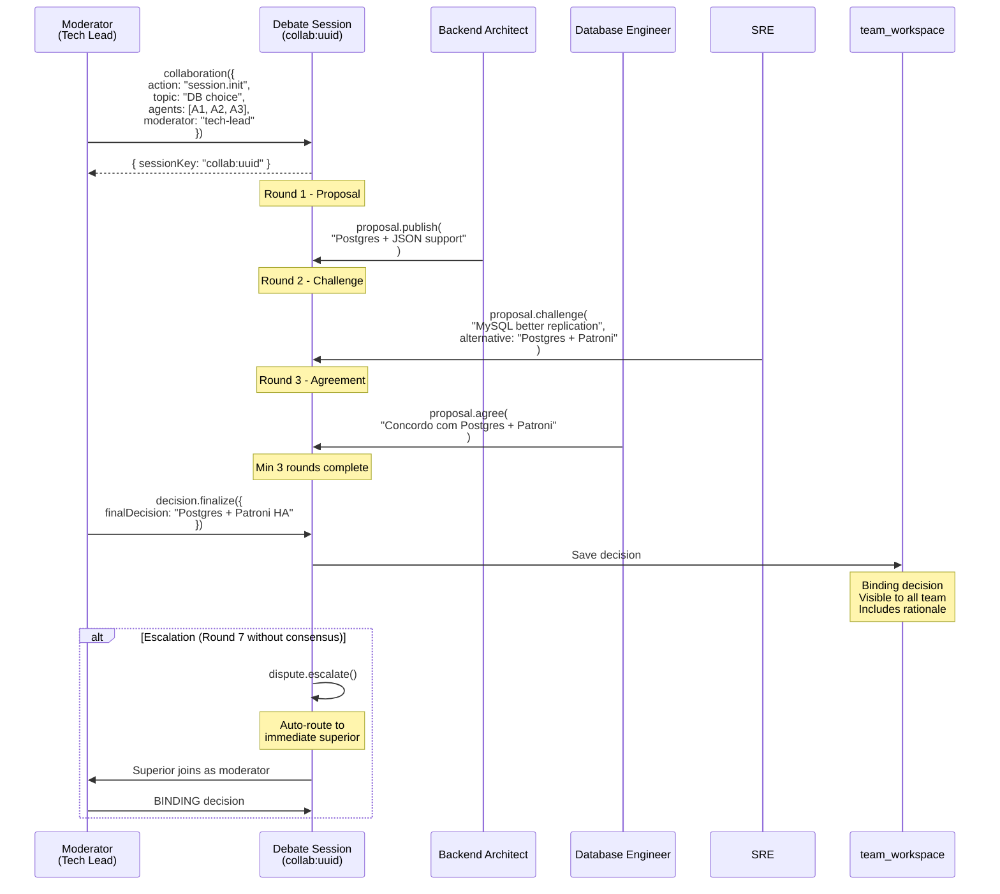
```mermaid
sequenceDiagram
    participant Mod as Moderator<br/>(Tech Lead)
    participant Session as Debate Session<br/>(collab:uuid)
    participant A1 as Backend Architect
    participant A2 as Database Engineer
    participant A3 as SRE
    participant WS as team_workspace

    Mod->>Session: collaboration({<br/>  action: "session.init",<br/>  topic: "DB choice",<br/>  agents: [A1, A2, A3],<br/>  moderator: "tech-lead"<br/>})
    Session-->>Mod: { sessionKey: "collab:uuid" }

    Note over Session: Round 1 - Proposal
    A1->>Session: proposal.publish(<br/>  "Postgres + JSON support"<br/>)

    Note over Session: Round 2 - Challenge
    A3->>Session: proposal.challenge(<br/>  "MySQL better replication",<br/>  alternative: "Postgres + Patroni"<br/>)

    Note over Session: Round 3 - Agreement
    A2->>Session: proposal.agree(<br/>  "Concordo com Postgres + Patroni"<br/>)

    Note over Session: Min 3 rounds complete

    Mod->>Session: decision.finalize({<br/>  finalDecision: "Postgres + Patroni HA"<br/>})

    Session->>WS: Save decision
    Note over WS: Binding decision<br/>Visible to all team<br/>Includes rationale

    alt Escalation (Round 7 without consensus)
        Session->>Session: dispute.escalate()
        Note over Session: Auto-route to<br/>immediate superior
        Session->>Mod: Superior joins as moderator
        Mod->>Session: BINDING decision
    end
```

### State Diagram

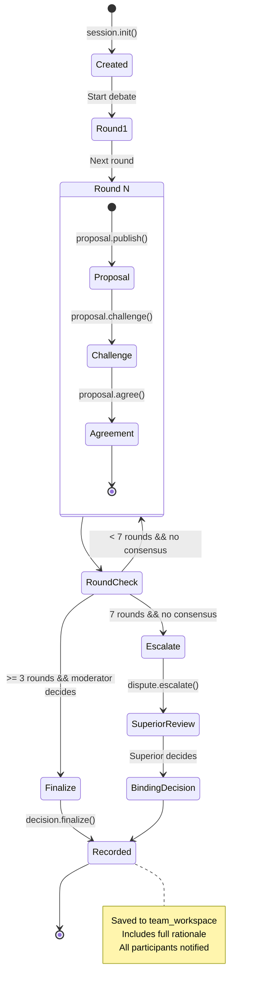
```mermaid
stateDiagram-v2
    [*] --> Created: session.init()
    Created --> Round1: Start debate

    state "Round N" as RoundN {
        [*] --> Proposal: proposal.publish()
        Proposal --> Challenge: proposal.challenge()
        Challenge --> Agreement: proposal.agree()
        Agreement --> [*]
    }

    Round1 --> RoundN: Next round
    RoundN --> RoundCheck

    state RoundCheck <<choice>>
    RoundCheck --> RoundN: < 7 rounds && no consensus
    RoundCheck --> Finalize: >= 3 rounds && moderator decides
    RoundCheck --> Escalate: 7 rounds && no consensus

    Finalize --> Recorded: decision.finalize()
    Escalate --> SuperiorReview: dispute.escalate()
    SuperiorReview --> BindingDecision: Superior decides

    BindingDecision --> Recorded
    Recorded --> [*]

    note right of Recorded
        Saved to team_workspace
        Includes full rationale
        All participants notified
    end note
```

### Flowchart - Debate Lifecycle

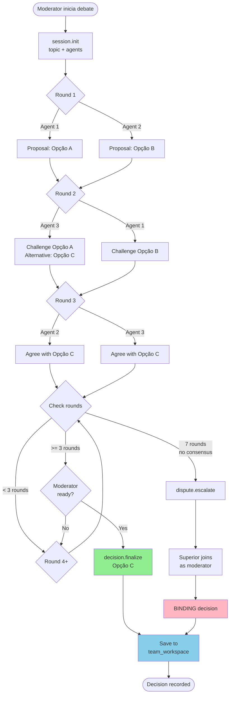
```mermaid
flowchart TD
    Start([Moderator inicia debate]) --> Init[session.init<br/>topic + agents]
    Init --> R1{Round 1}

    R1 -->|Agent 1| Prop1[Proposal: Opção A]
    R1 -->|Agent 2| Prop2[Proposal: Opção B]

    Prop1 --> R2{Round 2}
    Prop2 --> R2

    R2 -->|Agent 3| Chal1[Challenge Opção A<br/>Alternative: Opção C]
    R2 -->|Agent 1| Chal2[Challenge Opção B]

    Chal1 --> R3{Round 3}
    Chal2 --> R3

    R3 -->|Agent 2| Agree1[Agree with Opção C]
    R3 -->|Agent 3| Agree2[Agree with Opção C]

    Agree1 --> Check{Check rounds}
    Agree2 --> Check

    Check -->|>= 3 rounds| Mod{Moderator<br/>ready?}
    Check -->|< 3 rounds| R4{Round 4+}

    R4 --> Check

    Mod -->|Yes| Final[decision.finalize<br/>Opção C]
    Mod -->|No| R4

    Check -->|7 rounds<br/>no consensus| Esc[dispute.escalate]

    Esc --> Sup[Superior joins<br/>as moderator]
    Sup --> Bind[BINDING decision]

    Final --> Save[Save to<br/>team_workspace]
    Bind --> Save

    Save --> End([Decision recorded])

    style Final fill:#90EE90
    style Bind fill:#FFB6C1
    style Save fill:#87CEEB
```

---

## 4. delegation - Hierarquia Formal

### Sequence Diagram - Downward

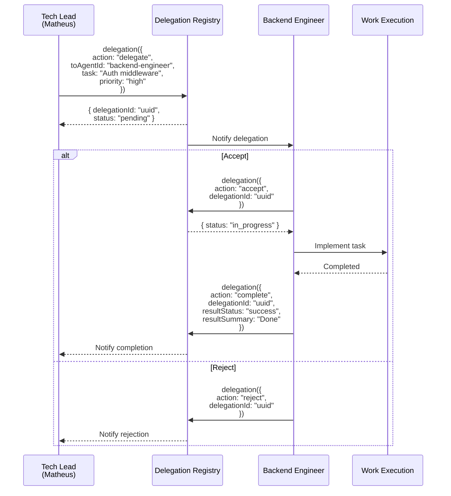
```mermaid
sequenceDiagram
    participant Lead as Tech Lead<br/>(Matheus)
    participant Reg as Delegation Registry
    participant Eng as Backend Engineer
    participant Work as Work Execution

    Lead->>Reg: delegation({<br/>  action: "delegate",<br/>  toAgentId: "backend-engineer",<br/>  task: "Auth middleware",<br/>  priority: "high"<br/>})
    Reg-->>Lead: { delegationId: "uuid",<br/>  status: "pending" }

    Reg->>Eng: Notify delegation

    alt Accept
        Eng->>Reg: delegation({<br/>  action: "accept",<br/>  delegationId: "uuid"<br/>})
        Reg-->>Eng: { status: "in_progress" }

        Eng->>Work: Implement task
        Work-->>Eng: Completed

        Eng->>Reg: delegation({<br/>  action: "complete",<br/>  delegationId: "uuid",<br/>  resultStatus: "success",<br/>  resultSummary: "Done"<br/>})
        Reg-->>Lead: Notify completion

    else Reject
        Eng->>Reg: delegation({<br/>  action: "reject",<br/>  delegationId: "uuid"<br/>})
        Reg-->>Lead: Notify rejection
    end
```

### Sequence Diagram - Upward

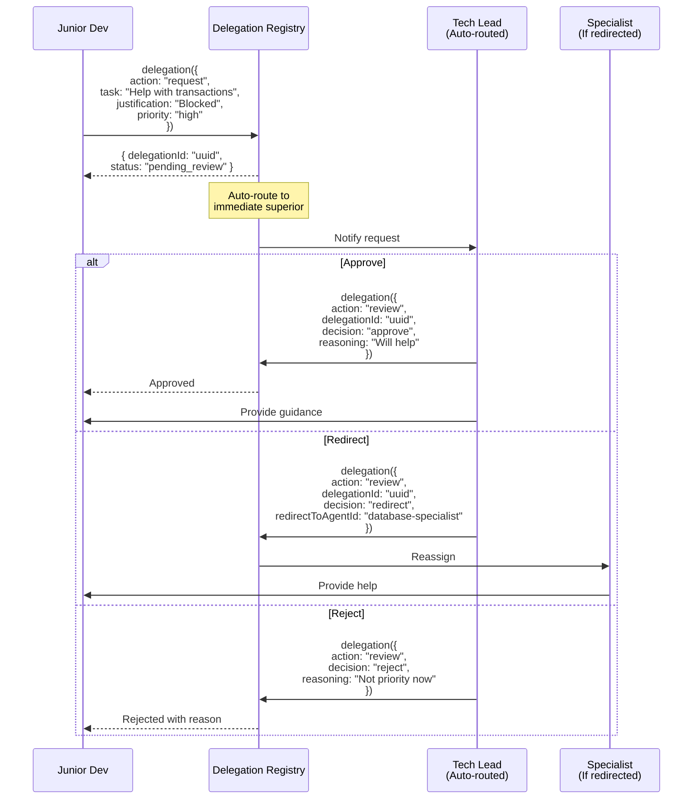
```mermaid
sequenceDiagram
    participant Jun as Junior Dev
    participant Reg as Delegation Registry
    participant Lead as Tech Lead<br/>(Auto-routed)
    participant Spec as Specialist<br/>(If redirected)

    Jun->>Reg: delegation({<br/>  action: "request",<br/>  task: "Help with transactions",<br/>  justification: "Blocked",<br/>  priority: "high"<br/>})
    Reg-->>Jun: { delegationId: "uuid",<br/>  status: "pending_review" }

    Note over Reg: Auto-route to<br/>immediate superior

    Reg->>Lead: Notify request

    alt Approve
        Lead->>Reg: delegation({<br/>  action: "review",<br/>  delegationId: "uuid",<br/>  decision: "approve",<br/>  reasoning: "Will help"<br/>})
        Reg-->>Jun: Approved
        Lead->>Jun: Provide guidance

    else Redirect
        Lead->>Reg: delegation({<br/>  action: "review",<br/>  delegationId: "uuid",<br/>  decision: "redirect",<br/>  redirectToAgentId: "database-specialist"<br/>})
        Reg->>Spec: Reassign
        Spec->>Jun: Provide help

    else Reject
        Lead->>Reg: delegation({<br/>  action: "review",<br/>  decision: "reject",<br/>  reasoning: "Not priority now"<br/>})
        Reg-->>Jun: Rejected with reason
    end
```

### State Diagram - Full Lifecycle

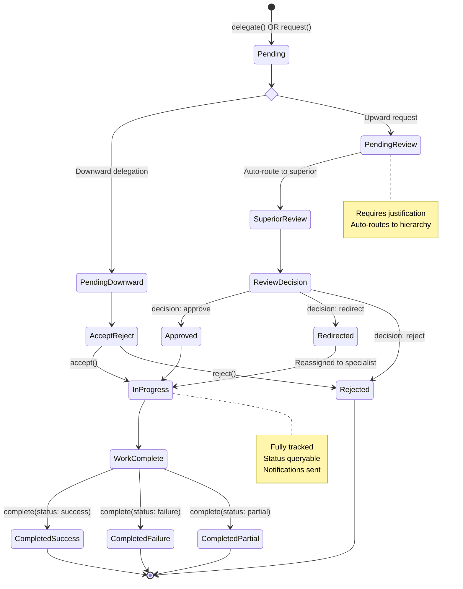
```mermaid
stateDiagram-v2
    [*] --> Pending: delegate() OR request()

    state direction_check <<choice>>
    Pending --> direction_check

    direction_check --> PendingDownward: Downward delegation
    direction_check --> PendingReview: Upward request

    PendingDownward --> AcceptReject
    state AcceptReject <<choice>>
    AcceptReject --> InProgress: accept()
    AcceptReject --> Rejected: reject()

    PendingReview --> SuperiorReview: Auto-route to superior

    SuperiorReview --> ReviewDecision
    state ReviewDecision <<choice>>
    ReviewDecision --> Approved: decision: approve
    ReviewDecision --> Redirected: decision: redirect
    ReviewDecision --> Rejected: decision: reject

    Approved --> InProgress
    Redirected --> InProgress: Reassigned to specialist

    InProgress --> WorkComplete
    state WorkComplete <<choice>>
    WorkComplete --> CompletedSuccess: complete(status: success)
    WorkComplete --> CompletedFailure: complete(status: failure)
    WorkComplete --> CompletedPartial: complete(status: partial)

    CompletedSuccess --> [*]
    CompletedFailure --> [*]
    CompletedPartial --> [*]
    Rejected --> [*]

    note right of PendingReview
        Requires justification
        Auto-routes to hierarchy
    end note

    note right of InProgress
        Fully tracked
        Status queryable
        Notifications sent
    end note
```

---

## 5. team_workspace - Memória Compartilhada

### Flowchart - Artifact Lifecycle

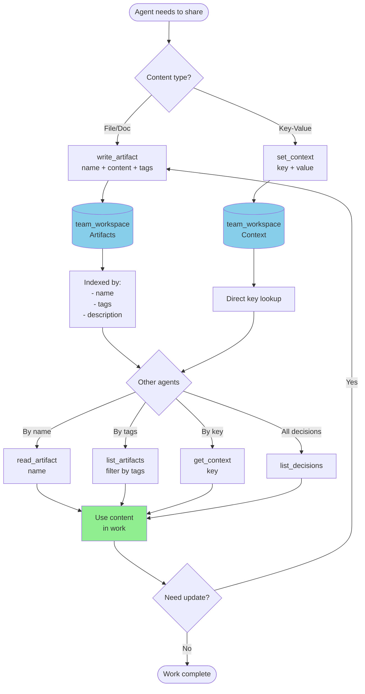
```mermaid
flowchart TD
    Start([Agent needs to share]) --> Type{Content type?}

    Type -->|File/Doc| WriteArt[write_artifact<br/>name + content + tags]
    Type -->|Key-Value| SetCtx[set_context<br/>key + value]

    WriteArt --> Store[(team_workspace<br/>Artifacts)]
    SetCtx --> StoreKV[(team_workspace<br/>Context)]

    Store --> Index[Indexed by:<br/>- name<br/>- tags<br/>- description]
    StoreKV --> Direct[Direct key lookup]

    Index --> Search{Other agents}
    Direct --> Search

    Search -->|By name| ReadArt[read_artifact<br/>name]
    Search -->|By tags| ListArt[list_artifacts<br/>filter by tags]
    Search -->|By key| GetCtx[get_context<br/>key]
    Search -->|All decisions| ListDec[list_decisions]

    ReadArt --> Use[Use content<br/>in work]
    ListArt --> Use
    GetCtx --> Use
    ListDec --> Use

    Use --> Update{Need update?}
    Update -->|Yes| WriteArt
    Update -->|No| End([Work complete])

    style Store fill:#87CEEB
    style StoreKV fill:#87CEEB
    style Use fill:#90EE90
```

### Sequence Diagram - Multi-Agent Context Sharing

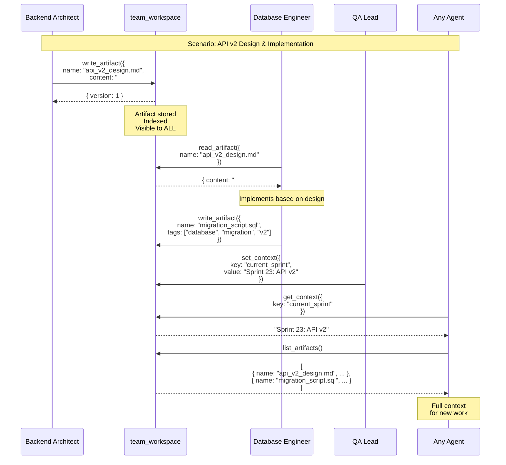
```mermaid
sequenceDiagram
    participant A1 as Backend Architect
    participant WS as team_workspace
    participant A2 as Database Engineer
    participant A3 as QA Lead
    participant A4 as Any Agent

    Note over A1,A4: Scenario: API v2 Design & Implementation

    A1->>WS: write_artifact({<br/>  name: "api_v2_design.md",<br/>  content: "## REST API Design...",<br/>  tags: ["api", "design", "v2"]<br/>})
    WS-->>A1: { version: 1 }

    Note over WS: Artifact stored<br/>Indexed<br/>Visible to ALL

    A2->>WS: read_artifact({<br/>  name: "api_v2_design.md"<br/>})
    WS-->>A2: { content: "## REST API Design..." }

    Note over A2: Implements based on design

    A2->>WS: write_artifact({<br/>  name: "migration_script.sql",<br/>  tags: ["database", "migration", "v2"]<br/>})

    A3->>WS: set_context({<br/>  key: "current_sprint",<br/>  value: "Sprint 23: API v2"<br/>})

    A4->>WS: get_context({<br/>  key: "current_sprint"<br/>})
    WS-->>A4: "Sprint 23: API v2"

    A4->>WS: list_artifacts()
    WS-->>A4: [<br/>  { name: "api_v2_design.md", ... },<br/>  { name: "migration_script.sql", ... }<br/>]

    Note over A4: Full context<br/>for new work
```

---

## 6. sessions_inbox - Inbox Assíncrona

### Sequence Diagram

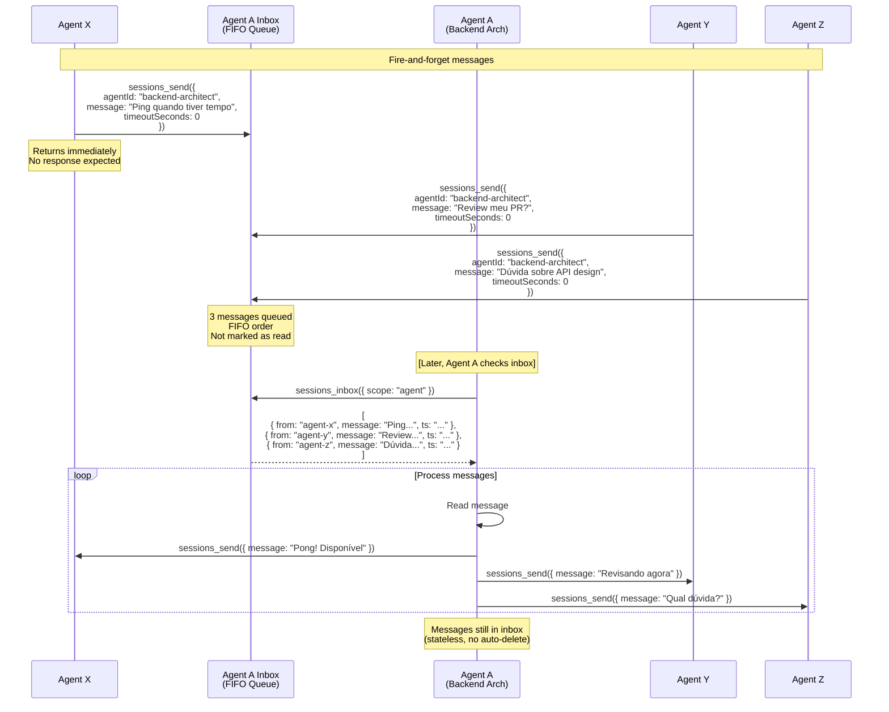
```mermaid
sequenceDiagram
    participant X as Agent X
    participant InboxA as Agent A Inbox<br/>(FIFO Queue)
    participant A as Agent A<br/>(Backend Arch)
    participant Y as Agent Y
    participant Z as Agent Z

    Note over X,Z: Fire-and-forget messages

    X->>InboxA: sessions_send({<br/>  agentId: "backend-architect",<br/>  message: "Ping quando tiver tempo",<br/>  timeoutSeconds: 0<br/>})
    Note over X: Returns immediately<br/>No response expected

    Y->>InboxA: sessions_send({<br/>  agentId: "backend-architect",<br/>  message: "Review meu PR?",<br/>  timeoutSeconds: 0<br/>})

    Z->>InboxA: sessions_send({<br/>  agentId: "backend-architect",<br/>  message: "Dúvida sobre API design",<br/>  timeoutSeconds: 0<br/>})

    Note over InboxA: 3 messages queued<br/>FIFO order<br/>Not marked as read

    Note over A: [Later, Agent A checks inbox]

    A->>InboxA: sessions_inbox({ scope: "agent" })
    InboxA-->>A: [<br/>  { from: "agent-x", message: "Ping...", ts: "..." },<br/>  { from: "agent-y", message: "Review...", ts: "..." },<br/>  { from: "agent-z", message: "Dúvida...", ts: "..." }<br/>]

    loop Process messages
        A->>A: Read message
        A->>X: sessions_send({ message: "Pong! Disponível" })
        A->>Y: sessions_send({ message: "Revisando agora" })
        A->>Z: sessions_send({ message: "Qual dúvida?" })
    end

    Note over A: Messages still in inbox<br/>(stateless, no auto-delete)
```

### State Diagram

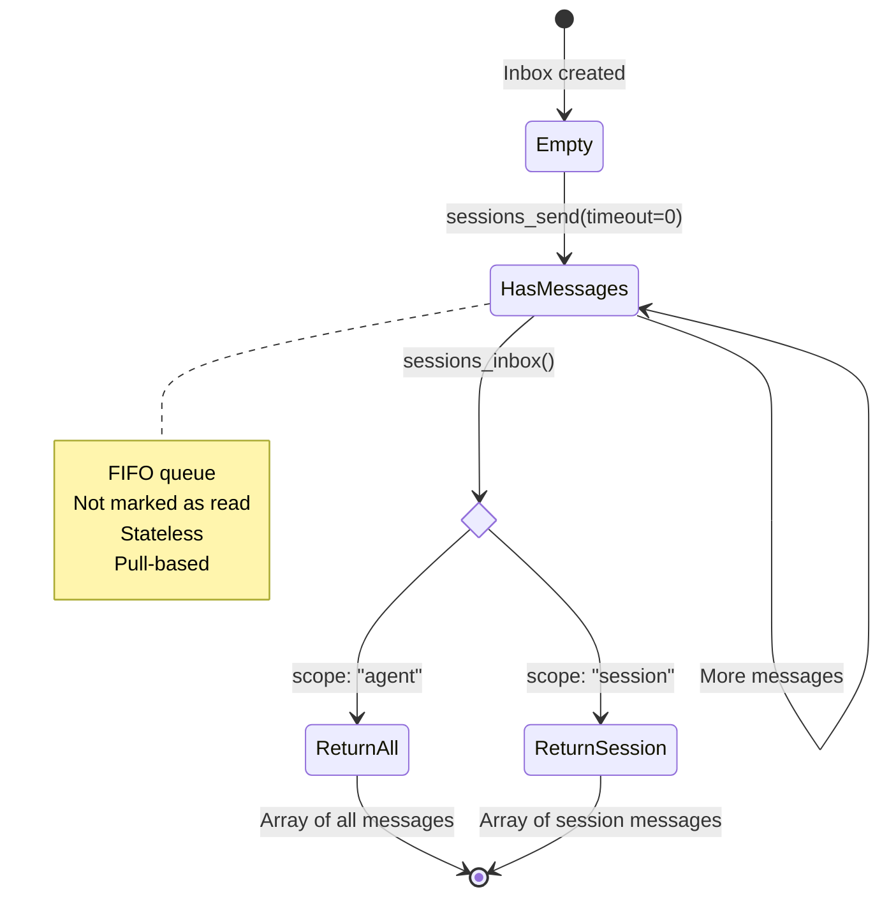
```mermaid
stateDiagram-v2
    [*] --> Empty: Inbox created

    Empty --> HasMessages: sessions_send(timeout=0)
    HasMessages --> HasMessages: More messages

    state check_scope <<choice>>
    HasMessages --> check_scope: sessions_inbox()

    check_scope --> ReturnAll: scope: "agent"
    check_scope --> ReturnSession: scope: "session"

    ReturnAll --> [*]: Array of all messages
    ReturnSession --> [*]: Array of session messages

    note right of HasMessages
        FIFO queue
        Not marked as read
        Stateless
        Pull-based
    end note
```

---

## 7. sessions_spawn_batch - Paralelo Massivo

### Sequence Diagram - waitMode: "all"

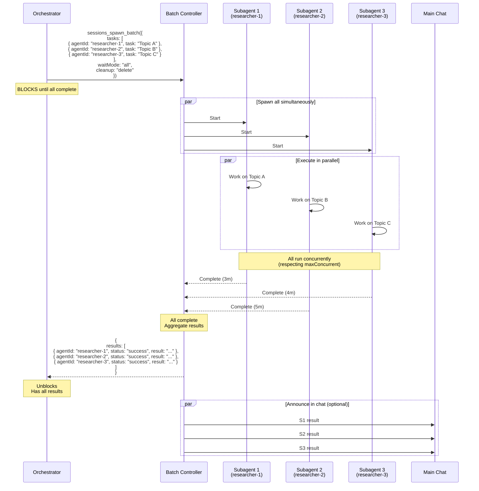
```mermaid
sequenceDiagram
    participant Orch as Orchestrator
    participant Batch as Batch Controller
    participant S1 as Subagent 1<br/>(researcher-1)
    participant S2 as Subagent 2<br/>(researcher-2)
    participant S3 as Subagent 3<br/>(researcher-3)
    participant Chat as Main Chat

    Orch->>Batch: sessions_spawn_batch({<br/>  tasks: [<br/>    { agentId: "researcher-1", task: "Topic A" },<br/>    { agentId: "researcher-2", task: "Topic B" },<br/>    { agentId: "researcher-3", task: "Topic C" }<br/>  ],<br/>  waitMode: "all",<br/>  cleanup: "delete"<br/>})

    Note over Orch: BLOCKS until all complete

    par Spawn all simultaneously
        Batch->>S1: Start
        Batch->>S2: Start
        Batch->>S3: Start
    end

    par Execute in parallel
        S1->>S1: Work on Topic A
        S2->>S2: Work on Topic B
        S3->>S3: Work on Topic C
    end

    Note over S1,S3: All run concurrently<br/>(respecting maxConcurrent)

    S1-->>Batch: Complete (3m)
    S3-->>Batch: Complete (4m)
    S2-->>Batch: Complete (5m)

    Note over Batch: All complete<br/>Aggregate results

    Batch-->>Orch: {<br/>  results: [<br/>    { agentId: "researcher-1", status: "success", result: "..." },<br/>    { agentId: "researcher-2", status: "success", result: "..." },<br/>    { agentId: "researcher-3", status: "success", result: "..." }<br/>  ]<br/>}

    Note over Orch: Unblocks<br/>Has all results

    par Announce in chat (optional)
        Batch->>Chat: S1 result
        Batch->>Chat: S2 result
        Batch->>Chat: S3 result
    end
```

### Flowchart - Wait Mode Decision

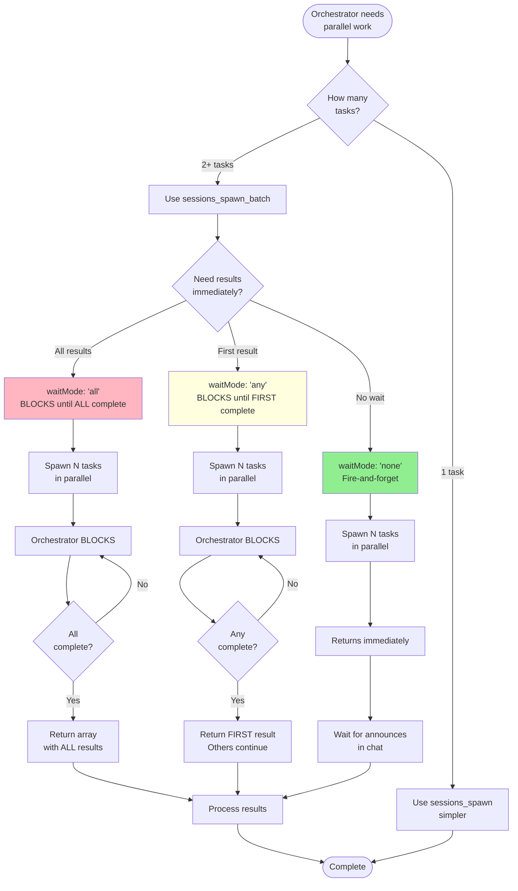
```mermaid
flowchart TD
    Start([Orchestrator needs<br/>parallel work]) --> Count{How many<br/>tasks?}

    Count -->|1 task| Single[Use sessions_spawn<br/>simpler]
    Count -->|2+ tasks| Batch[Use sessions_spawn_batch]

    Batch --> Need{Need results<br/>immediately?}

    Need -->|All results| WaitAll[waitMode: 'all'<br/>BLOCKS until ALL complete]
    Need -->|First result| WaitAny[waitMode: 'any'<br/>BLOCKS until FIRST complete]
    Need -->|No wait| WaitNone[waitMode: 'none'<br/>Fire-and-forget]

    WaitAll --> ExecAll[Spawn N tasks<br/>in parallel]
    WaitAny --> ExecAny[Spawn N tasks<br/>in parallel]
    WaitNone --> ExecNone[Spawn N tasks<br/>in parallel]

    ExecAll --> BlockAll[Orchestrator BLOCKS]
    ExecAny --> BlockAny[Orchestrator BLOCKS]
    ExecNone --> RetNone[Returns immediately]

    BlockAll --> AllDone{All<br/>complete?}
    AllDone -->|Yes| RetAll[Return array<br/>with ALL results]
    AllDone -->|No| BlockAll

    BlockAny --> AnyDone{Any<br/>complete?}
    AnyDone -->|Yes| RetAny[Return FIRST result<br/>Others continue]
    AnyDone -->|No| BlockAny

    RetAll --> Use[Process results]
    RetAny --> Use
    RetNone --> Wait[Wait for announces<br/>in chat]

    Wait --> Use
    Use --> End([Complete])
    Single --> End

    style WaitAll fill:#FFB6C1
    style WaitAny fill:#FFFFE0
    style WaitNone fill:#90EE90
```

### State Diagram - Batch Lifecycle

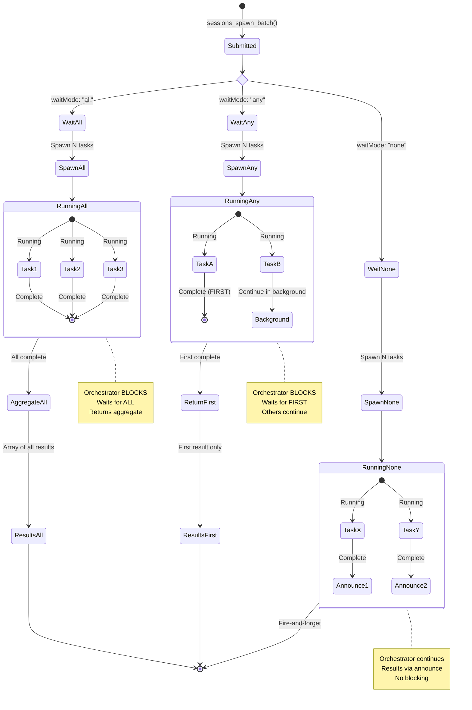
```mermaid
stateDiagram-v2
    [*] --> Submitted: sessions_spawn_batch()

    state waitmode_check <<choice>>
    Submitted --> waitmode_check

    waitmode_check --> WaitAll: waitMode: "all"
    waitmode_check --> WaitAny: waitMode: "any"
    waitmode_check --> WaitNone: waitMode: "none"

    WaitAll --> SpawnAll: Spawn N tasks
    WaitAny --> SpawnAny: Spawn N tasks
    WaitNone --> SpawnNone: Spawn N tasks

    SpawnAll --> RunningAll
    SpawnAny --> RunningAny
    SpawnNone --> RunningNone

    state RunningAll {
        [*] --> Task1: Running
        [*] --> Task2: Running
        [*] --> Task3: Running
        Task1 --> [*]: Complete
        Task2 --> [*]: Complete
        Task3 --> [*]: Complete
    }

    state RunningAny {
        [*] --> TaskA: Running
        [*] --> TaskB: Running
        TaskA --> [*]: Complete (FIRST)
        TaskB --> Background: Continue in background
    }

    state RunningNone {
        [*] --> TaskX: Running
        [*] --> TaskY: Running
        TaskX --> Announce1: Complete
        TaskY --> Announce2: Complete
    }

    RunningAll --> AggregateAll: All complete
    RunningAny --> ReturnFirst: First complete
    RunningNone --> [*]: Fire-and-forget

    AggregateAll --> ResultsAll: Array of all results
    ReturnFirst --> ResultsFirst: First result only

    ResultsAll --> [*]
    ResultsFirst --> [*]

    note right of RunningAll
        Orchestrator BLOCKS
        Waits for ALL
        Returns aggregate
    end note

    note right of RunningAny
        Orchestrator BLOCKS
        Waits for FIRST
        Others continue
    end note

    note right of RunningNone
        Orchestrator continues
        Results via announce
        No blocking
    end note
```

---

## Decision Tree Completo

### Flowchart - Qual Tool Usar?

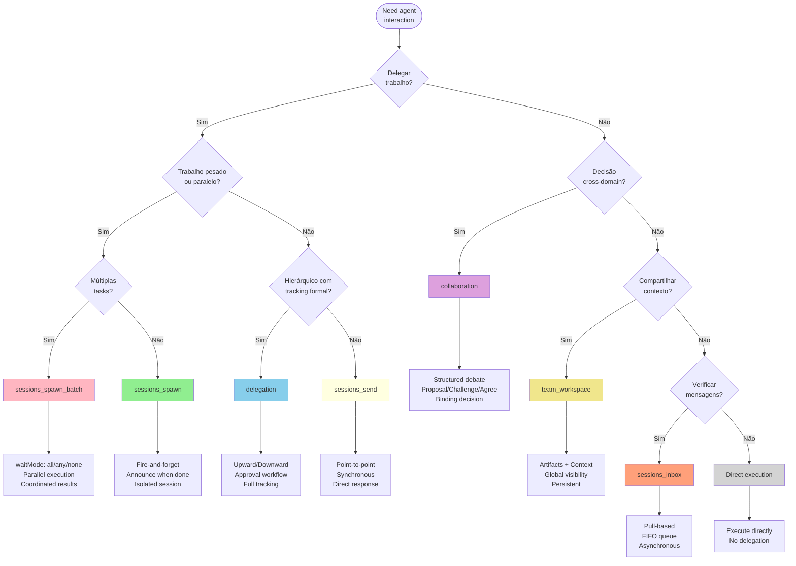
```mermaid
flowchart TD
    Start([Need agent<br/>interaction]) --> Q1{Delegar<br/>trabalho?}

    Q1 -->|Sim| Q2{Trabalho pesado<br/>ou paralelo?}
    Q1 -->|Não| Q6{Decisão<br/>cross-domain?}

    Q2 -->|Sim| Q3{Múltiplas<br/>tasks?}
    Q2 -->|Não| Q4{Hierárquico com<br/>tracking formal?}

    Q3 -->|Sim| Batch[sessions_spawn_batch]
    Q3 -->|Não| Spawn[sessions_spawn]

    Q4 -->|Sim| Deleg[delegation]
    Q4 -->|Não| Send[sessions_send]

    Q6 -->|Sim| Collab[collaboration]
    Q6 -->|Não| Q7{Compartilhar<br/>contexto?}

    Q7 -->|Sim| WS[team_workspace]
    Q7 -->|Não| Q8{Verificar<br/>mensagens?}

    Q8 -->|Sim| Inbox[sessions_inbox]
    Q8 -->|Não| Direct[Direct execution]

    Batch --> Details1[waitMode: all/any/none<br/>Parallel execution<br/>Coordinated results]
    Spawn --> Details2[Fire-and-forget<br/>Announce when done<br/>Isolated session]
    Deleg --> Details3[Upward/Downward<br/>Approval workflow<br/>Full tracking]
    Send --> Details4[Point-to-point<br/>Synchronous<br/>Direct response]
    Collab --> Details5[Structured debate<br/>Proposal/Challenge/Agree<br/>Binding decision]
    WS --> Details6[Artifacts + Context<br/>Global visibility<br/>Persistent]
    Inbox --> Details7[Pull-based<br/>FIFO queue<br/>Asynchronous]
    Direct --> Details8[Execute directly<br/>No delegation]

    style Batch fill:#FFB6C1
    style Spawn fill:#90EE90
    style Deleg fill:#87CEEB
    style Send fill:#FFFFE0
    style Collab fill:#DDA0DD
    style WS fill:#F0E68C
    style Inbox fill:#FFA07A
    style Direct fill:#D3D3D3
```

### Comparison Matrix

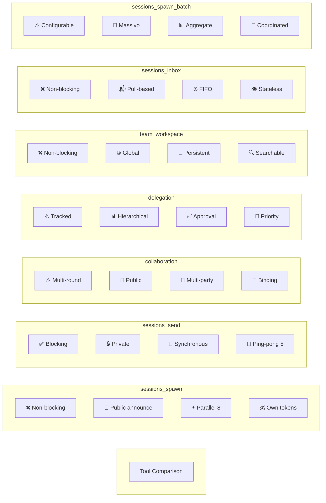
```mermaid
graph LR
    subgraph " "
        A[Tool Comparison]
    end

    subgraph "sessions_spawn"
        S1[❌ Non-blocking]
        S2[📢 Public announce]
        S3[⚡ Parallel 8]
        S4[💰 Own tokens]
    end

    subgraph "sessions_send"
        E1[✅ Blocking]
        E2[🔒 Private]
        E3[🔄 Synchronous]
        E4[💬 Ping-pong 5]
    end

    subgraph "collaboration"
        C1[⚠️ Multi-round]
        C2[📢 Public]
        C3[👥 Multi-party]
        C4[📝 Binding]
    end

    subgraph "delegation"
        D1[⚠️ Tracked]
        D2[📊 Hierarchical]
        D3[✅ Approval]
        D4[🚨 Priority]
    end

    subgraph "team_workspace"
        W1[❌ Non-blocking]
        W2[🌐 Global]
        W3[💾 Persistent]
        W4[🔍 Searchable]
    end

    subgraph "sessions_inbox"
        I1[❌ Non-blocking]
        I2[📬 Pull-based]
        I3[⏰ FIFO]
        I4[👁️ Stateless]
    end

    subgraph "sessions_spawn_batch"
        B1[⚠️ Configurable]
        B2[🚀 Massivo]
        B3[📊 Aggregate]
        B4[🎯 Coordinated]
    end
```

---

## Architecture Overview - All Interactions

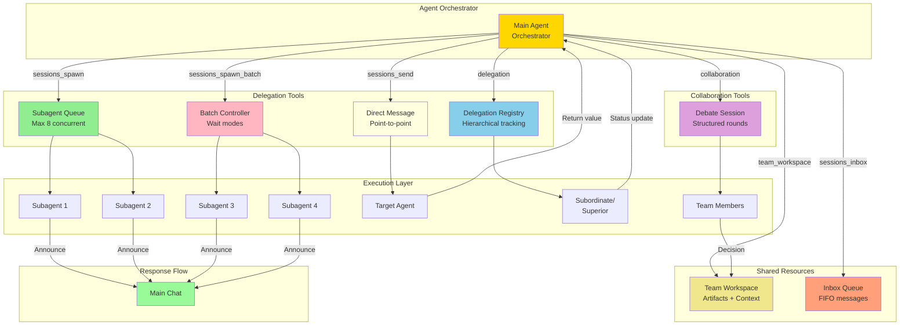
```mermaid
graph TB
    subgraph "Agent Orchestrator"
        Main[Main Agent<br/>Orchestrator]
    end

    subgraph "Delegation Tools"
        Main -->|sessions_spawn| Spawn[Subagent Queue<br/>Max 8 concurrent]
        Main -->|sessions_spawn_batch| Batch[Batch Controller<br/>Wait modes]
        Main -->|sessions_send| Send[Direct Message<br/>Point-to-point]
        Main -->|delegation| Deleg[Delegation Registry<br/>Hierarchical tracking]
    end

    subgraph "Collaboration Tools"
        Main -->|collaboration| Collab[Debate Session<br/>Structured rounds]
    end

    subgraph "Shared Resources"
        Main -->|team_workspace| WS[Team Workspace<br/>Artifacts + Context]
        Main -->|sessions_inbox| Inbox[Inbox Queue<br/>FIFO messages]
    end

    subgraph "Execution Layer"
        Spawn --> Sub1[Subagent 1]
        Spawn --> Sub2[Subagent 2]
        Batch --> Sub3[Subagent 3]
        Batch --> Sub4[Subagent 4]
        Send --> Agent1[Target Agent]
        Deleg --> Agent2[Subordinate/<br/>Superior]
        Collab --> Team[Team Members]
    end

    subgraph "Response Flow"
        Sub1 -->|Announce| Chat[Main Chat]
        Sub2 -->|Announce| Chat
        Sub3 -->|Announce| Chat
        Sub4 -->|Announce| Chat
        Agent1 -->|Return value| Main
        Agent2 -->|Status update| Main
        Team -->|Decision| WS
    end

    style Main fill:#FFD700
    style Spawn fill:#90EE90
    style Batch fill:#FFB6C1
    style Send fill:#FFFFE0
    style Deleg fill:#87CEEB
    style Collab fill:#DDA0DD
    style WS fill:#F0E68C
    style Inbox fill:#FFA07A
    style Chat fill:#98FB98
```

---

_Criado: 2026-02-13_  
_Última atualização: 2026-02-13_  
_Renderize em GitHub/GitLab ou use [Mermaid Live Editor](https://mermaid.live)_
