```mermaid
sequenceDiagram
    participant A as Agent A<br/>(Backend Architect)
    participant InboxB as Agent B Inbox
    participant B as Agent B<br/>(Database Engineer)
    participant ModelB as LLM (Agent B)

    A->>InboxB: sessions_send({<br/>  agentId: "database-engineer",<br/>  message: "Qual índice usar?",<br/>  timeoutSeconds: 60<br/>})
    Note over A: BLOCKS (synchronous)

    InboxB->>B: Message queued
    B->>B: Next turn
    B->>ModelB: Process message
    ModelB-->>B: "Use composite index (user_id, created_at)"

    B-->>InboxB: Response
    InboxB-->>A: Return value
    Note over A: Unblocks<br/>Continues work

    alt Ping-Pong (max 5 turns)
        A->>InboxB: Follow-up question
        InboxB->>B: Process
        B-->>InboxB: Answer
        InboxB-->>A: Response
    end

    alt Fire-and-forget (timeoutSeconds: 0)
        A->>InboxB: Message
        Note over A: Returns immediately<br/>No response
    end
```

```mermaid
sequenceDiagram
    participant X as Agent X
    participant InboxA as Agent A Inbox<br/>(FIFO Queue)
    participant A as Agent A<br/>(Backend Arch)
    participant Y as Agent Y
    participant Z as Agent Z

    Note over X,Z: Fire-and-forget messages

    X->>InboxA: sessions_send({<br/>  agentId: "backend-architect",<br/>  message: "Ping quando tiver tempo",<br/>  timeoutSeconds: 0<br/>})
    Note over X: Returns immediately<br/>No response expected

    Y->>InboxA: sessions_send({<br/>  agentId: "backend-architect",<br/>  message: "Review meu PR?",<br/>  timeoutSeconds: 0<br/>})

    Z->>InboxA: sessions_send({<br/>  agentId: "backend-architect",<br/>  message: "Dúvida sobre API design",<br/>  timeoutSeconds: 0<br/>})

    Note over InboxA: 3 messages queued<br/>FIFO order<br/>Not marked as read

    Note over A: [Later, Agent A checks inbox]

    A->>InboxA: sessions_inbox({ scope: "agent" })
    InboxA-->>A: [<br/>  { from: "agent-x", message: "Ping...", ts: "..." },<br/>  { from: "agent-y", message: "Review...", ts: "..." },<br/>  { from: "agent-z", message: "Dúvida...", ts: "..." }<br/>]

    loop Process messages
        A->>A: Read message
        A->>X: sessions_send({ message: "Pong! Disponível" })
        A->>Y: sessions_send({ message: "Revisando agora" })
        A->>Z: sessions_send({ message: "Qual dúvida?" })
    end

    Note over A: Messages still in inbox<br/>(stateless, no auto-delete)
```

# AGENT INTERACTION DIAGRAMS - Mermaid Visual Flows

_Diagramas visuais de todos os tipos de interação entre agentes_

---

## 📋 ÍNDICE

1. [sessions_spawn - Delegação Paralela](#1-sessions_spawn---delegação-paralela)
2. [sessions_send - Mensagem Direta](#2-sessions_send---mensagem-direta)
3. [collaboration - Debates Estruturados](#3-collaboration---debates-estruturados)
4. [delegation - Hierarquia Formal](#4-delegation---hierarquia-formal)
5. [team_workspace - Memória Compartilhada](#5-team_workspace---memória-compartilhada)
6. [sessions_inbox - Inbox Assíncrona](#6-sessions_inbox---inbox-assíncrona)
7. [sessions_spawn_batch - Paralelo Massivo](#7-sessions_spawn_batch---paralelo-massivo)
8. [Decision Tree Completo](#decision-tree-completo)

---

## 1. sessions_spawn - Delegação Paralela

### Sequence Diagram

### State Diagram

---

## 2. sessions_send - Mensagem Direta

### Sequence Diagram

### State Diagram

---

## 3. collaboration - Debates Estruturados

### Sequence Diagram

### State Diagram

### Flowchart - Debate Lifecycle

```mermaid
flowchart TD
    Start([Moderator inicia debate]) --> Init[session.init<br/>topic + agents]
    Init --> R1{Round 1}

    R1 -->|Agent 1| Prop1[Proposal: Opção A]
    R1 -->|Agent 2| Prop2[Proposal: Opção B]

    Prop1 --> R2{Round 2}
    Prop2 --> R2

    R2 -->|Agent 3| Chal1[Challenge Opção A<br/>Alternative: Opção C]
    R2 -->|Agent 1| Chal2[Challenge Opção B]

    Chal1 --> R3{Round 3}
    Chal2 --> R3

    R3 -->|Agent 2| Agree1[Agree with Opção C]
    R3 -->|Agent 3| Agree2[Agree with Opção C]

    Agree1 --> Check{Check rounds}
    Agree2 --> Check

    Check -->|>= 3 rounds| Mod{Moderator<br/>ready?}
    Check -->|< 3 rounds| R4{Round 4+}

    R4 --> Check

    Mod -->|Yes| Final[decision.finalize<br/>Opção C]
    Mod -->|No| R4

    Check -->|7 rounds<br/>no consensus| Esc[dispute.escalate]

    Esc --> Sup[Superior joins<br/>as moderator]
    Sup --> Bind[BINDING decision]

    Final --> Save[Save to<br/>team_workspace]
    Bind --> Save

    Save --> End([Decision recorded])

    style Final fill:#90EE90
    style Bind fill:#FFB6C1
    style Save fill:#87CEEB
```

---

## 4. delegation - Hierarquia Formal

### Sequence Diagram - Downward

### Sequence Diagram - Upward

### State Diagram - Full Lifecycle

---

## 5. team_workspace - Memória Compartilhada

### Flowchart - Artifact Lifecycle

### Sequence Diagram - Multi-Agent Context Sharing

---

## 6. sessions_inbox - Inbox Assíncrona

### Sequence Diagram

### State Diagram

---

## 7. sessions_spawn_batch - Paralelo Massivo

### Sequence Diagram - waitMode: "all"

### Flowchart - Wait Mode Decision

### State Diagram - Batch Lifecycle

---

## Decision Tree Completo

### Flowchart - Qual Tool Usar?

### Comparison Matrix

```mermaid
graph LR
    subgraph " "
        A[Tool Comparison]
    end

    subgraph "sessions_spawn"
        S1[❌ Non-blocking]
        S2[📢 Public announce]
        S3[⚡ Parallel 8]
        S4[💰 Own tokens]
    end

    subgraph "sessions_send"
        E1[✅ Blocking]
        E2[🔒 Private]
        E3[🔄 Synchronous]
        E4[💬 Ping-pong 5]
    end

    subgraph "collaboration"
        C1[⚠️ Multi-round]
        C2[📢 Public]
        C3[👥 Multi-party]
        C4[📝 Binding]
    end

    subgraph "delegation"
        D1[⚠️ Tracked]
        D2[📊 Hierarchical]
        D3[✅ Approval]
        D4[🚨 Priority]
    end

    subgraph "team_workspace"
        W1[❌ Non-blocking]
        W2[🌐 Global]
        W3[💾 Persistent]
        W4[🔍 Searchable]
    end

    subgraph "sessions_inbox"
        I1[❌ Non-blocking]
        I2[📬 Pull-based]
        I3[⏰ FIFO]
        I4[👁️ Stateless]
    end

    subgraph "sessions_spawn_batch"
        B1[⚠️ Configurable]
        B2[🚀 Massivo]
        B3[📊 Aggregate]
        B4[🎯 Coordinated]
    end
```

---

## Architecture Overview - All Interactions

---

_Criado: 2026-02-13_  
_Última atualização: 2026-02-13_  
_Renderize em GitHub/GitLab ou use [Mermaid Live Editor](https://mermaid.live)_
