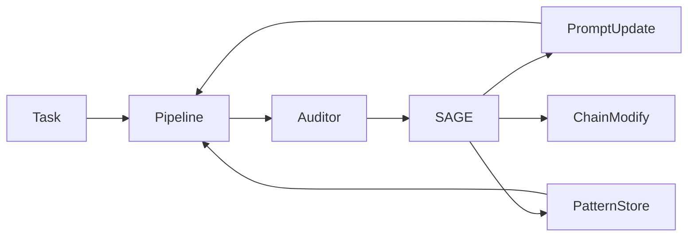

---
tags:
  - protocol
  - self-learning
  - sage
  - reflexion
category: domain-knowledge
difficulty: advanced
training: true
created: 2026-06-30
---

# Protocol: SAGE Self-Evolution

Протокол самоэволюции через анализ обратной связи от Auditor-а.

## Источник

arXiv papers:

- SAGE (Self-Aware Generative Engine) — самоэволюция через мета-рефлексию
- Reflexion (arXiv:2303.11366) — обучение на ошибках через verbal RL
- SLEA-RL (arXiv:2603.18079) — step-level experience augmentation

## Триггер

После каждого завершённого pipeline-запуска (успех или неудача).

## Шаги

### 1. Анализ результата

```
Auditor feedback → SAGE Engine
```

SAGE анализирует:

- Какие роли справились хорошо (+ credit attribution)
- Какие роли допустили ошибки (- penalty)
- Какой паттерн привёл к ошибке

### 2. Генерация коррекций

```python
sage_engine.evolve(
    chain_result=result,
    auditor_feedback=feedback,
    episode_history=supermemory.recall_episodes(k=5)
)
```

Выходы:

- **Prompt corrections**: обновления system-промптов ролей
- **Chain modifications**: предложения по изменению цепочки
- **Pattern additions**: новые паттерны для `special_skills.json`

### 3. Counterfactual Credit (Shapley)

```
CounterfactualCredit.assign(roles, contributions)
```

Shapley-подобная атрибуция — определяет вклад каждой роли в итоговый результат. Роли с высоким credit получают больше будущих задач.

### 4. ProRL Reward Modeling

```
ProRLEngine.evaluate(trajectory) → reward_signal
```

Лёгкая оценка без отдельной модели — по эвристикам:

- Код компилируется? +0.3
- Тесты проходят? +0.4
- Auditor доволен? +0.3

### 5. Episodic Storage

```python
supermemory.record_episode(
    task=prompt,
    steps=chain_steps,
    reward=prorl_reward
)
```

StepExperience (SLEA-RL):

```python
supermemory.record_step_experience(
    episode_id=ep.id,
    step_index=i,
    role="Coder",
    action=prompt_summary,
    observation=response_summary,
    reward=per_step_score
)
```

## Цикл обратной связи


