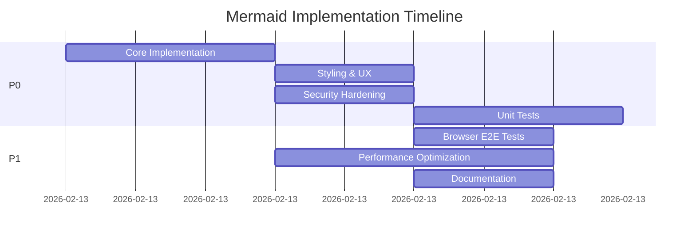
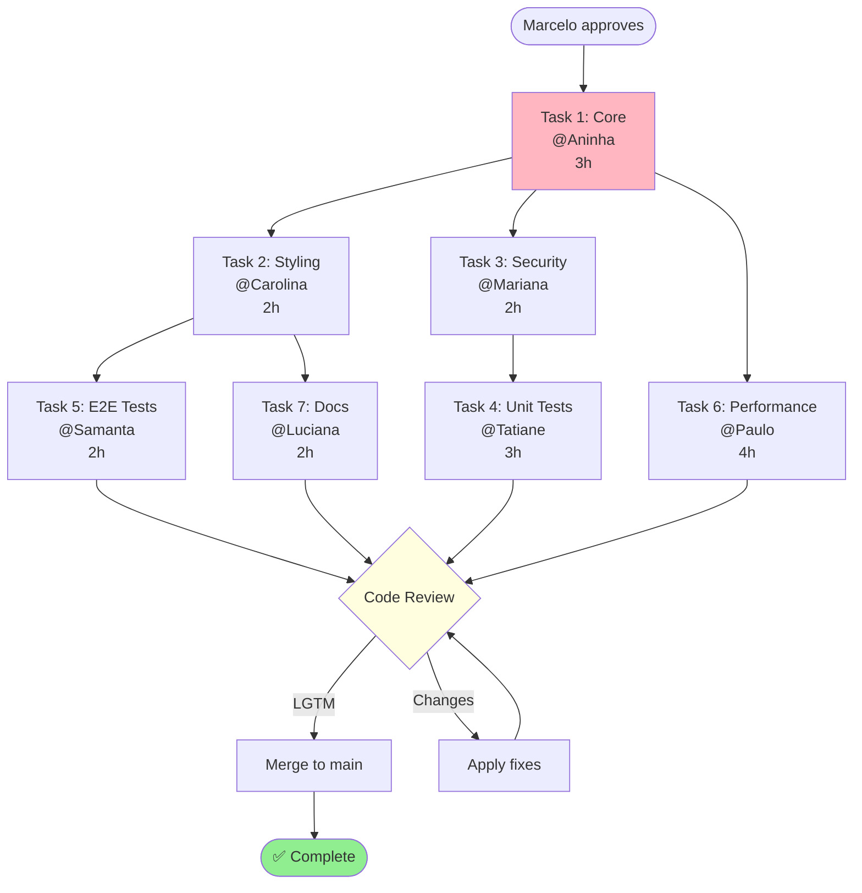

# Mermaid Webchat - Plano de Execução

_Delegação de tarefas para implementação completa_

---

## 📋 Tasks Breakdown

### Task 1: Core Implementation (P0)

**Responsável:** @Aninha (frontend-architect)  
**ETA:** 3h  
**Dependências:** Nenhuma

**Deliverables:**

1. Adicionar `mermaid@^11.4.1` em `ui/package.json`
2. Modificar `ui/src/ui/markdown.ts`:
   - Import mermaid
   - Initialize mermaid
   - Custom renderer para blocos ```mermaid
   - Update allowedTags + allowedAttrs (SVG)
3. Criar `ui/src/ui/mermaid-renderer.ts` (helper module)

**Acceptance:**

- `pnpm install` adiciona mermaid sem erros
- Diagrams renderizam como SVG
- Build passa (0 erros)

---

### Task 2: Styling & UX (P0)

**Responsável:** @Carolina (ui-designer)  
**ETA:** 2h  
**Dependências:** Task 1

**Deliverables:**

1. CSS para `.mermaid-diagram` em `ui/src/styles/chat.css`
2. Dark mode support
3. Responsive design (mobile/tablet)
4. Error state styling (`.mermaid-error`)

**Acceptance:**

- Diagrams visualmente consistentes com design system
- Dark mode funciona
- Mobile-friendly

---

### Task 3: Security Hardening (P0)

**Responsável:** @Mariana (security-engineer)  
**ETA:** 2h  
**Dependências:** Task 1

**Deliverables:**

1. DOMPurify hooks para sanitizar SVG
2. Mermaid security config (`securityLevel: strict`)
3. XSS prevention validation
4. Security audit report

**Acceptance:**

- No XSS vulnerabilities
- SVG sanitization functional
- Security scan passes

---

### Task 4: Unit Tests (P0)

**Responsável:** @Tatiane (testing-specialist)  
**ETA:** 3h  
**Dependências:** Task 1, Task 3

**Deliverables:**

1. Tests em `ui/src/ui/markdown.test.ts`:
   - Valid mermaid renders SVG
   - Invalid mermaid shows error
   - Non-mermaid unchanged
   - Cache behavior
2. Coverage >90%

**Acceptance:**

- `pnpm test` passa 100%
- Coverage report >90%

---

### Task 5: Browser E2E Tests (P1)

**Responsável:** @Samanta (qa-automation)  
**ETA:** 2h  
**Dependências:** Task 1, Task 2

**Deliverables:**

1. Tests em `ui/src/ui/chat-markdown.browser.test.ts`:
   - Diagram renders in chat
   - Dark mode switch
   - Error handling UI
2. Playwright screenshots

**Acceptance:**

- E2E tests green
- Screenshots match expected

---

### Task 6: Performance Optimization (P1)

**Responsável:** @Paulo (performance-engineer)  
**ETA:** 4h  
**Dependências:** Task 1

**Deliverables:**

1. Lazy loading de Mermaid
2. Diagram caching
3. Debounced re-render
4. Performance benchmarks

**Acceptance:**

- Render time <500ms
- Cache hit rate >80%
- Bundle size increase <100KB

---

### Task 7: Documentation (P1)

**Responsável:** @Luciana (technical-writer)  
**ETA:** 2h  
**Dependências:** Task 1, Task 2

**Deliverables:**

1. User guide: `docs/webchat-mermaid.md`
2. Update `docs/webchat.md`
3. Code comments
4. Examples

**Acceptance:**

- User can follow guide to create diagrams
- All diagram types documented

---

## 🚀 Execution Timeline



**Total Time:** 18h  
**Critical Path:** Task 1 → Task 3 → Task 4  
**Earliest Completion:** 8h (P0 only)  
**Full Completion:** 18h (P0 + P1)

---

## 🔄 Fan-Out Strategy

### Parallel Execution



---

## 📊 Risk Matrix

| Risk                          | Probability | Impact   | Mitigation                           |
| ----------------------------- | ----------- | -------- | ------------------------------------ |
| Mermaid bundle size too large | Medium      | Medium   | Lazy loading + code splitting        |
| SVG XSS vulnerability         | Low         | Critical | DOMPurify + strict security level    |
| Performance regression        | Medium      | High     | Caching + debouncing                 |
| Browser compatibility         | Low         | Medium   | Mermaid supports all modern browsers |
| Dark mode theme mismatch      | Medium      | Low      | Test both themes, adjust CSS         |

---

## ✅ Definition of Done (Global)

- [ ] All P0 tasks complete
- [ ] Code review approved (2+ reviewers)
- [ ] Tests passing (unit + E2E)
- [ ] Security audit clean
- [ ] Performance benchmarks met
- [ ] Documentation published
- [ ] Demo to Julio completed
- [ ] Feature flag enabled (if needed)

---

## 🎯 Success Criteria

**User Perspective:**

- ✅ User sends message with ```mermaid block
- ✅ Diagram renders automatically as visual SVG
- ✅ Works in light and dark mode
- ✅ Error messages clear if syntax invalid

**Technical Perspective:**

- ✅ Zero XSS vulnerabilities
- ✅ Render time <500ms
- ✅ Bundle size <100KB increase
- ✅ Test coverage >90%

---

## 🔧 Rollback Plan

**If issues detected post-merge:**

1. **Immediate:** Feature flag disable (if enabled)
2. **Short-term:** Revert commit via `git revert`
3. **Investigation:** Root cause analysis
4. **Fix forward:** Apply patch + re-deploy

**Rollback SLA:** <5min (feature flag) or <30min (git revert)

---

## 📞 Communication Plan

### Kickoff

- [ ] Julio approves plan
- [ ] @Marcelo spawns all tasks in parallel
- [ ] Each agent confirms receipt + ETA

### During Work

- [ ] Agents post updates every hour
- [ ] Blockers escalated to @Marcelo immediately
- [ ] Cross-dependencies coordinated via `sessions_send`

### Completion

- [ ] Each agent posts "✅ [Task] complete"
- [ ] @Marcelo aggregates results
- [ ] Demo to Julio
- [ ] Retro + lessons learned

---

_Criado: 2026-02-13_  
_Orchestrator: @Marcelo_  
_Status: AWAITING APPROVAL_
