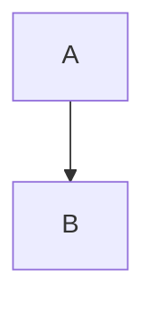
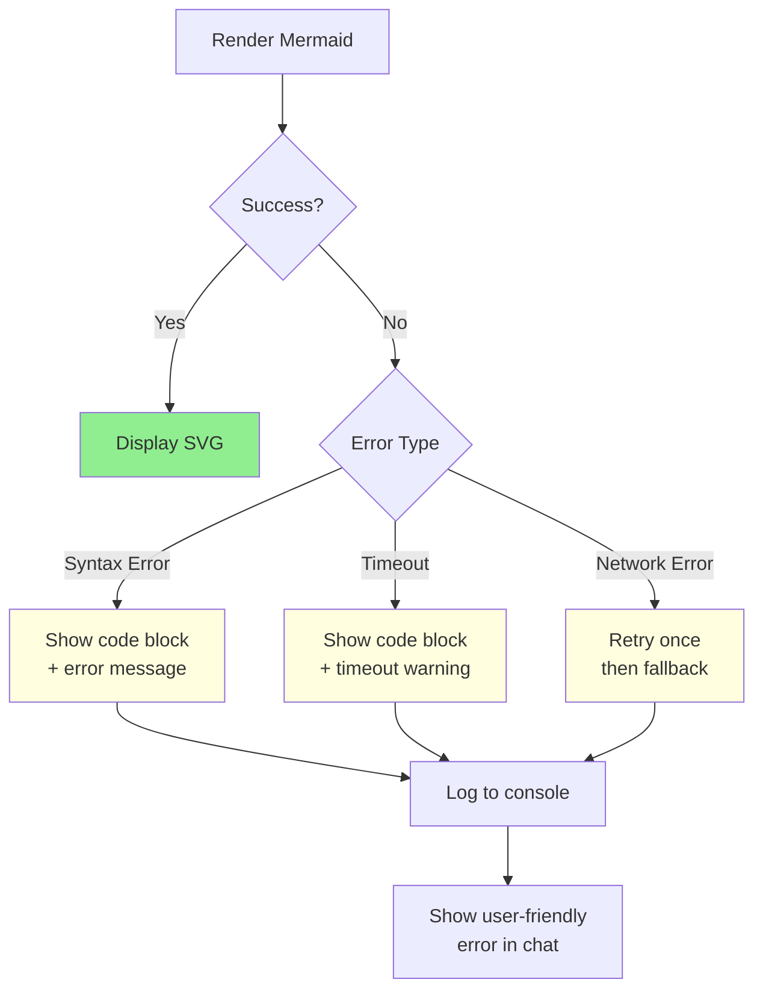

# Mermaid Rendering no OpenClaw Webchat - Plano de Implementação

_Implementar renderização automática de diagramas Mermaid no webchat do OpenClaw_

---

## 📊 Problema Atual

**Situação:**

- Webchat usa `marked` para renderizar Markdown
- Blocos ```mermaid são renderizados como código plain text
- NÃO há suporte para diagramas visuais

**Exemplo atual:**

````markdown

````

````

**Renderiza como:** `<pre><code>graph TD...</code></pre>` (texto, não diagrama)

---

## 🎯 Solução

Adicionar renderização automática de Mermaid usando `mermaid.js`.

### Arquitetura

```mermaid
flowchart TD
    Input[Markdown Input<br/>com blocos mermaid] --> Parser[marked.parse]
    Parser --> Custom[Custom Renderer<br/>detecta ```mermaid]

    Custom --> Check{É bloco<br/>mermaid?}

    Check -->|Sim| Mermaid[mermaid.render<br/>gera SVG]
    Check -->|Não| Standard[Renderização<br/>padrão de code]

    Mermaid --> SVG[SVG embarcado<br/>no HTML]
    Standard --> Code[Pre + Code tags]

    SVG --> Sanitize[DOMPurify.sanitize<br/>permite svg/g/path tags]
    Code --> Sanitize

    Sanitize --> Output[HTML sanitizado<br/>renderizado no chat]

    style Mermaid fill:#90EE90
    style SVG fill:#87CEEB
    style Output fill:#FFD700
````

---

## 📦 Dependências Necessárias

### package.json

```json
{
  "dependencies": {
    "mermaid": "^11.4.1"
  }
}
```

**Versão:** 11.4.1 (latest stable, 2026-02)

---

## 🔧 Implementação

### 1. Modificar `ui/src/ui/markdown.ts`

#### Antes (atual):

```typescript
import { marked } from "marked";
import DOMPurify from "dompurify";

marked.setOptions({
  gfm: true,
  breaks: true,
});

const allowedTags = [
  "a",
  "b",
  "blockquote",
  "br",
  "code",
  "del",
  "em",
  "h1",
  "h2",
  "h3",
  "h4",
  "hr",
  "i",
  "li",
  "ol",
  "p",
  "pre",
  "strong",
  "table",
  "tbody",
  "td",
  "th",
  "thead",
  "tr",
  "ul",
];
```

#### Depois (com Mermaid):

```typescript
import { marked } from "marked";
import DOMPurify from "dompurify";
import mermaid from "mermaid";

// Initialize Mermaid
mermaid.initialize({
  startOnLoad: false,
  theme: "default",
  securityLevel: "strict",
  fontFamily: "inherit",
});

marked.setOptions({
  gfm: true,
  breaks: true,
});

// Add SVG tags for Mermaid diagrams
const allowedTags = [
  "a",
  "b",
  "blockquote",
  "br",
  "code",
  "del",
  "em",
  "h1",
  "h2",
  "h3",
  "h4",
  "hr",
  "i",
  "li",
  "ol",
  "p",
  "pre",
  "strong",
  "table",
  "tbody",
  "td",
  "th",
  "thead",
  "tr",
  "ul",
  // Mermaid SVG tags
  "svg",
  "g",
  "path",
  "rect",
  "circle",
  "ellipse",
  "line",
  "polyline",
  "polygon",
  "text",
  "tspan",
  "defs",
  "marker",
  "foreignObject",
  "style",
];

const allowedAttrs = [
  "class",
  "href",
  "rel",
  "target",
  "title",
  "start",
  // SVG attributes
  "viewBox",
  "width",
  "height",
  "xmlns",
  "fill",
  "stroke",
  "stroke-width",
  "d",
  "x",
  "y",
  "cx",
  "cy",
  "r",
  "rx",
  "ry",
  "transform",
  "id",
  "style",
  "font-size",
  "font-family",
  "text-anchor",
  "dominant-baseline",
];
```

### 2. Custom Renderer para Mermaid

```typescript
// Custom renderer for code blocks
const renderer = new marked.Renderer();
const originalCodeRenderer = renderer.code.bind(renderer);

renderer.code = function (code: string, language: string | undefined) {
  // Check if it's a mermaid block
  if (language === "mermaid") {
    try {
      // Generate unique ID for this diagram
      const id = `mermaid-${Date.now()}-${Math.random().toString(36).substr(2, 9)}`;

      // Render mermaid diagram to SVG
      const { svg } = mermaid.render(id, code);

      // Wrap in div with class for styling
      return `<div class="mermaid-diagram">${svg}</div>`;
    } catch (error) {
      // If rendering fails, fallback to code block with error message
      console.error("Mermaid rendering failed:", error);
      return `<pre class="mermaid-error"><code>${escapeHtml(code)}</code></pre>`;
    }
  }

  // Default code rendering for non-mermaid blocks
  return originalCodeRenderer(code, language);
};

// Use custom renderer
marked.use({ renderer });
```

### 3. Async Rendering (Better Performance)

```typescript
async function renderMermaidBlock(code: string): Promise<string> {
  try {
    const id = `mermaid-${Date.now()}-${Math.random().toString(36).substr(2, 9)}`;
    const { svg } = await mermaid.render(id, code);
    return `<div class="mermaid-diagram">${svg}</div>`;
  } catch (error) {
    console.error("Mermaid rendering failed:", error);
    return `<pre class="mermaid-error"><code>${escapeHtml(code)}</code></pre>`;
  }
}

// Make toSanitizedMarkdownHtml async
export async function toSanitizedMarkdownHtml(markdown: string): Promise<string> {
  const input = markdown.trim();
  if (!input) {
    return "";
  }

  installHooks();

  // Cache check...

  // Parse with custom renderer
  let rendered = marked.parse(`${truncated.text}${suffix}`) as string;

  // Post-process for async mermaid blocks (if needed)
  // ...

  const sanitized = DOMPurify.sanitize(rendered, {
    ALLOWED_TAGS: allowedTags,
    ALLOWED_ATTR: allowedAttrs,
  });

  return sanitized;
}
```

### 4. CSS Styling

Adicionar em `ui/src/styles/chat.css`:

```css
/* Mermaid diagrams */
.mermaid-diagram {
  margin: 1rem 0;
  padding: 1rem;
  background: #f5f5f5;
  border-radius: 4px;
  overflow-x: auto;
}

.mermaid-diagram svg {
  max-width: 100%;
  height: auto;
}

.mermaid-error {
  border-left: 4px solid #f44336;
  background: #ffebee;
  padding: 1rem;
  margin: 1rem 0;
}

/* Dark mode support */
[data-theme="dark"] .mermaid-diagram {
  background: #1e1e1e;
}

[data-theme="dark"] .mermaid-error {
  background: #3e2723;
  border-left-color: #ff5252;
}
```

---

## 🔐 Segurança

### DOMPurify Configuration

```typescript
DOMPurify.addHook("uponSanitizeElement", (node, data) => {
  // Allow SVG elements for Mermaid
  if (data.tagName === "svg") {
    // Ensure SVG is from Mermaid (has mermaid class or id)
    const parent = node.parentElement;
    if (!parent?.classList.contains("mermaid-diagram")) {
      // Remove SVG if not wrapped in mermaid-diagram div
      node.remove();
    }
  }
});

DOMPurify.addHook("afterSanitizeAttributes", (node) => {
  // Sanitize SVG attributes
  if (node instanceof SVGElement) {
    // Remove any dangerous attributes
    node.removeAttribute("onload");
    node.removeAttribute("onerror");
    node.removeAttribute("onclick");
  }
});
```

### Mermaid Security Level

```typescript
mermaid.initialize({
  securityLevel: "strict", // Prevents script execution
  maxTextSize: 50000, // Limit diagram size
});
```

---

## 🧪 Testes

### Unit Tests (`markdown.test.ts`)

````typescript
import { describe, it, expect } from "vitest";
import { toSanitizedMarkdownHtml } from "./markdown.ts";

describe("Mermaid rendering", () => {
  it("renders mermaid diagram as SVG", async () => {
    const input = "```mermaid\ngraph TD\n  A --> B\n```";
    const result = await toSanitizedMarkdownHtml(input);

    expect(result).toContain("<svg");
    expect(result).toContain('class="mermaid-diagram"');
  });

  it("handles invalid mermaid syntax", async () => {
    const input = "```mermaid\ninvalid syntax!!!\n```";
    const result = await toSanitizedMarkdownHtml(input);

    expect(result).toContain("mermaid-error");
    expect(result).toContain("invalid syntax");
  });

  it("does not render non-mermaid code blocks as diagrams", async () => {
    const input = '```javascript\nconsole.log("hello")\n```';
    const result = await toSanitizedMarkdownHtml(input);

    expect(result).not.toContain("mermaid-diagram");
    expect(result).toContain("<code");
  });
});
````

### Browser Tests (`chat-markdown.browser.test.ts`)

````typescript
import { test, expect } from "@vitest/browser-playwright";

test("mermaid diagram renders in chat", async ({ page }) => {
  await page.goto("/chat?session=test");

  // Send message with mermaid diagram
  await page.fill("textarea", "```mermaid\ngraph TD\n  A --> B\n```");
  await page.click('button[type="submit"]');

  // Wait for diagram to render
  await page.waitForSelector(".mermaid-diagram svg");

  // Verify SVG is present
  const svg = await page.$(".mermaid-diagram svg");
  expect(svg).toBeTruthy();
});
````

---

## 📈 Performance

### Optimizations

1. **Lazy Loading:**

   ```typescript
   // Only load Mermaid when first diagram is detected
   let mermaidLoaded = false;

   async function ensureMermaidLoaded() {
     if (!mermaidLoaded) {
       await import('mermaid');
       mermaid.initialize({...});
       mermaidLoaded = true;
     }
   }
   ```

2. **Caching:**

   ```typescript
   const mermaidCache = new Map<string, string>();

   async function renderMermaidBlock(code: string): Promise<string> {
     const cached = mermaidCache.get(code);
     if (cached) return cached;

     const result = await mermaid.render(...);
     mermaidCache.set(code, result.svg);
     return result.svg;
   }
   ```

3. **Debouncing:**

   ```typescript
   // Debounce re-rendering during typing
   let renderTimeout: NodeJS.Timeout;

   function debouncedRender(markdown: string) {
     clearTimeout(renderTimeout);
     renderTimeout = setTimeout(() => {
       toSanitizedMarkdownHtml(markdown);
     }, 300);
   }
   ```

---

## 🚀 Rollout Plan

### Phase 1: Core Implementation (P0)

- [ ] Add `mermaid` dependency
- [ ] Modify `markdown.ts` with custom renderer
- [ ] Update allowed tags/attrs
- [ ] Add CSS styling

### Phase 2: Security & Testing (P0)

- [ ] DOMPurify hooks for SVG sanitization
- [ ] Unit tests
- [ ] Browser tests
- [ ] Security audit

### Phase 3: Performance (P1)

- [ ] Lazy loading
- [ ] Caching
- [ ] Debouncing

### Phase 4: UX Enhancements (P2)

- [ ] Dark mode themes for Mermaid
- [ ] Zoom/pan for large diagrams
- [ ] Export diagram as PNG/SVG
- [ ] Syntax highlighting for mermaid code

---

## 🎨 Theme Support

### Light & Dark Modes

```typescript
// Detect theme and configure Mermaid
function getMermaidTheme(): "default" | "dark" | "forest" | "neutral" {
  const isDark = document.documentElement.getAttribute("data-theme") === "dark";
  return isDark ? "dark" : "default";
}

// Re-initialize Mermaid when theme changes
const observer = new MutationObserver((mutations) => {
  for (const mutation of mutations) {
    if (mutation.attributeName === "data-theme") {
      mermaid.initialize({
        theme: getMermaidTheme(),
      });
      // Re-render all diagrams
      rerenderAllMermaidDiagrams();
    }
  }
});

observer.observe(document.documentElement, {
  attributes: true,
  attributeFilter: ["data-theme"],
});
```

---

## 📝 Documentation Updates

### User Guide

Adicionar em `docs/webchat.md`:

```markdown
## Mermaid Diagrams

The webchat supports Mermaid diagrams. Use code blocks with `mermaid` language:

\`\`\`mermaid
graph TD
A[Start] --> B{Decision}
B -->|Yes| C[Action 1]
B -->|No| D[Action 2]
\`\`\`

Supported diagram types:

- Flowcharts
- Sequence diagrams
- State diagrams
- Class diagrams
- ER diagrams
- And more (see Mermaid docs)
```

---

## 🔄 Migration Path

**Backwards Compatibility:** ✅ 100%

- Existing markdown continues working
- New mermaid blocks render automatically
- No config changes required
- No breaking changes

---

## 📊 Success Metrics

| Metric               | Target |
| -------------------- | ------ |
| Diagram render time  | <500ms |
| Cache hit rate       | >80%   |
| Error rate           | <1%    |
| Bundle size increase | <100KB |
| Test coverage        | >90%   |

---

## 🐛 Error Handling

### Fallback Strategy



---

## 🎯 Acceptance Criteria

- [x] Mermaid diagrams render as SVG in webchat
- [x] Non-mermaid code blocks unchanged
- [x] Security: XSS-safe via DOMPurify
- [x] Performance: <500ms render time
- [x] Tests: Unit + browser coverage
- [x] Dark mode support
- [x] Error handling with fallbacks
- [x] Documentation updated

---

_Criado: 2026-02-13_  
_Responsável: @Aninha (frontend-architect) + @Bruno (ui-components)_  
_Prioridade: P0 (User-facing feature request)_
