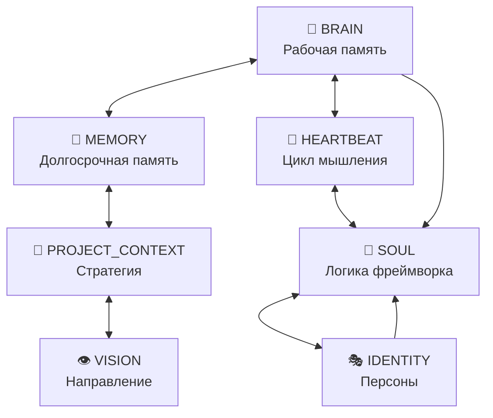

# 🗺️ Map of Content — OpenClaw Bot

> Главная карта знаний проекта. Все заметки связаны wikilinks.
> Открой этот файл в Obsidian и используй Graph View для навигации.

---

## 🧠 Ядро системы (Core Knowledge Graph)

Шесть взаимосвязанных документов, определяющих архитектуру, поведение и стратегию бота:

| Заметка             | Назначение                                                                     |
| ------------------- | ------------------------------------------------------------------------------ |
| [[BRAIN]]           | Рабочая память — текущая архитектура, активные компоненты, последние изменения |
| [[MEMORY]]          | Долгосрочная память — правила, решения, уроки, compliance                      |
| [[IDENTITY]]        | Персоны системы — Аркадий, Бригады, Соколов, Зубарев, Левитан                  |
| [[SOUL]]            | Фреймворк логики — оркестрация, аудит, Domain Isolation, валидация             |
| [[HEARTBEAT]]       | Цикл автономного мышления — READ→OBSERVE→PLAN→EXECUTE→PERSIST→UPDATE           |
| [[PROJECT_CONTEXT]] | Стратегический компас — две системы, стек, SWOT                                |



---

## 🎯 Стратегия и направление

| Заметка     | Назначение                                               |
| ----------- | -------------------------------------------------------- |
| [[VISION]]  | Продуктовое видение — приоритеты, безопасность, плагины  |
| [[LearnLM]] | Роадмап обучения моделей — QLoRA, фазы, WSL2/CUDA        |
| [[Gemini]]  | Архитектура проекта — компоненты, железо, правила команд |

---

## 📚 Доменные знания (Knowledge Base)

### Dmarket & HFT

- [[Dmarket_Core]] — Ядро интеграции с Dmarket
- [[Dmarket_API_Inventory]] / [[Dmarket_API_Market_Data]] / [[Dmarket_API_Orders]] — API эндпоинты
- [[Dmarket_API_Rate_Limiting]] — Лимиты API
- [[Dmarket_Arbitrage_Algorithms]] — Алгоритмы арбитража
- [[API_Fixes]] — Фиксы API

### Криптография & Безопасность

- [[HMAC_SHA256_Fundamentals]] — Основы HMAC
- [[HMAC_SHA256_Python]] / [[HMAC_SHA256_Rust]] — Реализации
- [[HMAC_Key_Management]] — Управление ключами
- [[HMAC_Replay_Protection]] — Защита от replay-атак

### Производительность & Low-Latency

- [[FPGA_Acceleration_HFT]] — FPGA для HFT
- [[Kernel_Bypass_Networking]] — Обход ядра (DPDK/io_uring)
- [[TCP_Tuning_Trading]] — Тюнинг TCP для торговли
- [[Zero_Copy_Techniques]] — Техники нулевого копирования
- [[Memory_Allocator_Optimization]] — Оптимизация аллокаторов

### Rust & Python Interop

- [[PyO3_Fundamentals]] / [[PyO3_Async_Tokio]] / [[PyO3_Performance_Patterns]] / [[PyO3_Type_Conversions]]
- [[Maturin_Build_System]] — Система сборки Maturin

### Бригады (Brigades)

- [[Dmarket_Dev_Brigade]] — Бригада разработки Dmarket-бота
- [[OpenClaw_Core_Brigade]] — Бригада ядра фреймворка
- [[Research_Ops_Brigade]] — Бригада исследований

### Сниппеты

- [[Dmarket_PlaceOffer]] — Пример размещения оффера

---

## � Протоколы самообучения (Knowledge/Protocols/)

Формализованные процедуры для автономного роста базы знаний:

| Протокол                   | Назначение                                             |
| -------------------------- | ------------------------------------------------------ |
| [[Auto_Learning_Feedback]] | Цикл обратной связи — извлечение паттернов из git diff |
| [[Knowledge_Self_Growth]]  | Автоматическое наращивание Knowledge-волта             |
| [[SAGE_Self_Evolution]]    | Самоэволюция через мета-рефлексию и Auditor feedback   |

Модуль автоматизации: `src/auto_learning/knowledge_writer.py`

- `gap_analysis()` — находит пробелы в Knowledge/
- `generate_concept()` — создаёт новый Concept-документ
- `run_self_learning_cycle()` — полный цикл: анализ → обновление Need_Knowledge

---

## �🔧 Операции

| Заметка             | Назначение                                   |
| ------------------- | -------------------------------------------- |
| [[TROUBLESHOOTING]] | Решение проблем — OpenRouter, retry, отладка |
| [[CHANGELOG]]       | История версий                               |
| [[CONTRIBUTING]]    | Гайд для контрибьюторов                      |
| [[SECURITY]]        | Политика безопасности                        |
| [[README]]          | Обзор проекта                                |

---

## 📓 Мета

- [[Learning_Log]] — Лог обучения (ошибки и решения)
- [[NotebookLM_Guide]] — Гайд по NotebookLM
- [[AGENTS]] — Правила агентов и репозитория

---

## 📖 Документация (docs/)

Полная документация проекта в `docs/`. Ключевые разделы:

- `docs/channels/` — Каналы связи (Telegram, Discord, Signal и др.)
- `docs/gateway/` — Шлюз и конфигурация
- `docs/tools/` — Инструменты и плагины
- `docs/security/` — Безопасность
- `docs/reference/` — Справочник

---

---

## 🤖 Training Pipeline (Vault → QLoRA)

Заметки из Obsidian-волта автоматически конвертируются в тренировочные данные для QLoRA fine-tuning.

### Как это работает

1. **Пишешь заметку** → используй шаблоны (`Ctrl+T` в Obsidian):
   - `Concept` — доменные знания (DMarket, Rust, крипто)
   - `Debug_Log` — разбор бага (проблема → решение)
   - `Decision` — архитектурное решение (контекст → выбор → последствия)

2. **Frontmatter** — каждая заметка содержит YAML-метаданные:

   ```yaml
   training: true # включить в тренировочные данные
   category: domain-knowledge # domain-knowledge | code-reference | troubleshooting
   difficulty: intermediate # beginner | intermediate | advanced
   tags: [dmarket, api] # теги для фильтрации
   ```

3. **Генерация** — скрипт парсит заметки по H2/H3 заголовкам и создаёт instruction-response пары:

   ```bash
   python scripts/vault_to_training.py                    # полная генерация
   python scripts/vault_to_training.py --dry-run           # предпросмотр
   python scripts/vault_to_training.py --category domain-knowledge  # только домен
   python scripts/vault_to_training.py --include-core      # + BRAIN, MEMORY и др.
   ```

4. **Выход** → `data/training/vault_generated.jsonl` (JSONL: `{"instruction": "...", "response": "..."}`)

### Текущие данные

| Источник                | Формат                         | Файл                                        |
| ----------------------- | ------------------------------ | ------------------------------------------- |
| Ручные примеры          | JSONL instruction/response     | `data/training/raw_dialogues.jsonl`         |
| Академические источники | JSONL source/insight           | `data/training/phase7_best_practices.jsonl` |
| **Obsidian Vault**      | **JSONL instruction/response** | **`data/training/vault_generated.jsonl`**   |

### Статус заметок

- **22 заметки** с `training: true` (Knowledge/Concepts)
- **2 мета-заметки** с `training: false` (Teaching, Need_Knowledge)
- **3 шаблона** готовы к использованию (`templates/`)

---

**Навигация:** Используй `Ctrl+O` для быстрого поиска, `Ctrl+G` для Graph View.
