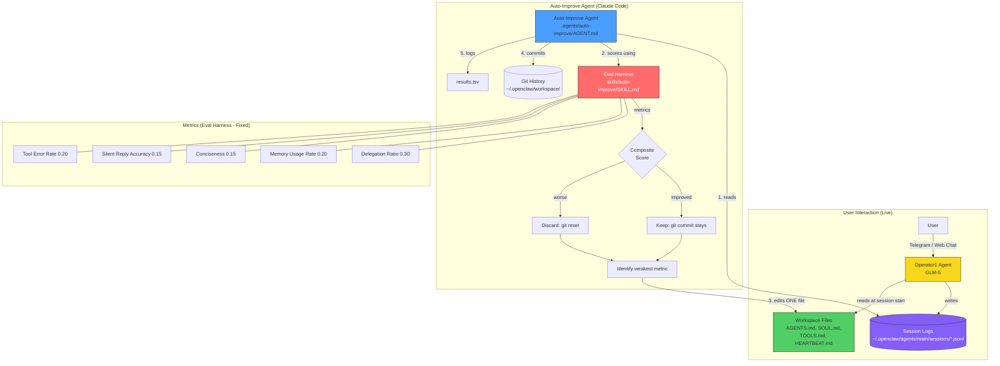
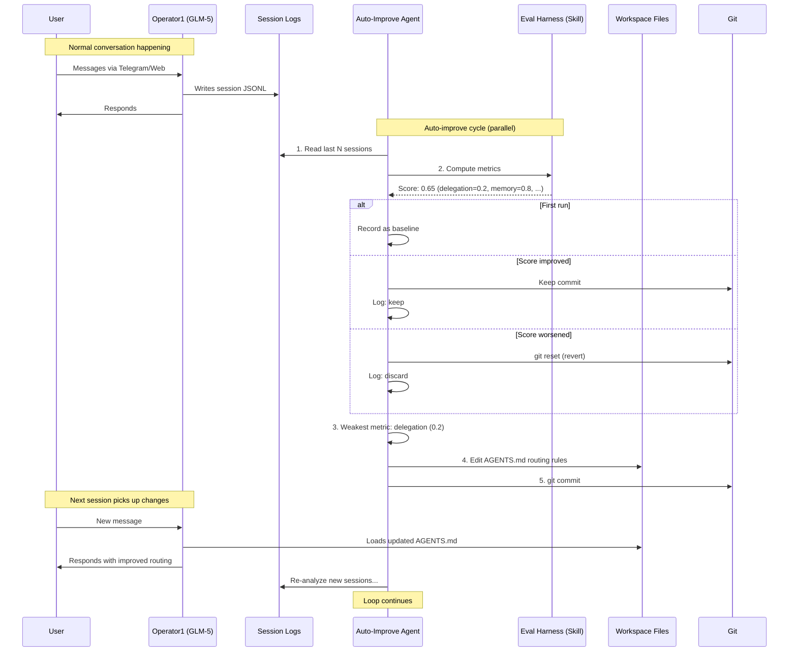

# Auto-Improve Agent for Operator1

**Created:** 2026-03-22
**Status:** In Progress
**Inspired by:** [karpathy/autoresearch](https://github.com/karpathy/autoresearch)

## 1. Goal

Create a Claude Code agent that autonomously analyzes Operator1's gateway session logs, scores response quality using heuristic metrics, and iteratively improves the workspace prompt files — committing changes that improve metrics, reverting changes that don't.

## 2. Architecture Mapping (AutoResearch → Operator1)

| AutoResearch                      | Operator1 Adaptation                                                               |
| --------------------------------- | ---------------------------------------------------------------------------------- |
| `prepare.py` (fixed eval harness) | Skill: `skills/auto-improve/SKILL.md` — scoring formulas, JSONL schema, thresholds |
| `train.py` (agent edits this)     | Workspace files: AGENTS.md, SOUL.md, TOOLS.md, HEARTBEAT.md                        |
| `program.md` (human edits this)   | Agent: `.agents/auto-improve/AGENT.md` — research strategy                         |
| `val_bpb` metric                  | Composite score: delegation ratio, memory usage, conciseness, error rate           |
| `results.tsv`                     | `~/.openclaw/workspace/auto-improve/results.tsv`                                   |
| 5-min training run                | Analyze last N hours of real conversations                                         |

## 3. Heuristic Metrics

| Metric                    | Weight | Source                                                             | Good      | Bad        |
| ------------------------- | ------ | ------------------------------------------------------------------ | --------- | ---------- |
| Delegation ratio          | 0.30   | Count `sessions_spawn`/`message` vs `exec`/`mcp_search` tool calls | >0.5      | <0.2       |
| Memory usage rate         | 0.20   | Count `memory_search` calls vs context-trigger messages            | >0.8      | <0.3       |
| Conciseness               | 0.15   | Average response word count for simple queries                     | <80 words | >200 words |
| Silent reply accuracy     | 0.15   | Correct `NO_REPLY` for off-channel messages                        | >0.9      | <0.5       |
| Tool error rate (inverse) | 0.20   | Count `is_error` in tool results                                   | <0.05     | >0.2       |

## 4. File Access Rules

| File                 | Access       | Reason                                         |
| -------------------- | ------------ | ---------------------------------------------- |
| `AGENTS.md`          | Read + Write | Primary prompt file — routing rules, protocols |
| `SOUL.md`            | Read + Write | Identity and behavior rules                    |
| `TOOLS.md`           | Read + Write | Tool guidance and delegation rules             |
| `HEARTBEAT.md`       | Read + Write | Proactive behavior rules                       |
| `MEMORY.md`          | Read ONLY    | Contains personal data — never modify          |
| `IDENTITY.md`        | Read ONLY    | System-critical — never modify                 |
| Source code (`src/`) | NEVER        | Fixed infrastructure, like `prepare.py`        |

## 5. Division: Agent vs Skill

**Agent (`.agents/auto-improve/AGENT.md`)** — the researcher:

- Strategy for analyzing logs and identifying weaknesses
- Decision-making: which file to edit, what change to try
- Experiment loop: edit → commit → wait → re-score → keep/discard
- You iterate on this file to make it a better researcher

**Skill (`skills/auto-improve/SKILL.md`)** — the eval harness:

- JSONL log parsing schema (toolCall format, entry types)
- Metric computation formulas
- Keep/discard thresholds
- File access rules (editable vs read-only)
- Results tracking format
- Fixed — not modified by the agent

## 6. System Overview





## 7. Experiment Loop

```
LOOP:
  1. Read last N sessions from ~/.openclaw/agents/main/sessions/*.jsonl
  2. Score each session against heuristic metrics
  3. Compute composite score
  4. If first run: record as baseline, continue
  5. Compare to previous score
  6. If improved: keep (git commit stays), log to results.tsv
  7. If worse: revert (git reset), log to results.tsv
  8. Identify weakest metric
  9. Propose ONE change to ONE workspace file targeting that weakness
  10. Edit file, git commit
  11. Wait for new conversations (or configurable interval)
  12. GOTO 1
```

## 8. Parallel Operation

Safe to run while user chats with Operator1 because:

- Workspace files loaded at session start — mid-session edits take effect on next session
- Session logs are append-only — concurrent read is safe
- Git operations isolated to workspace repo

## 9. Tasks

- [ ] **8.1** Create `.agents/auto-improve/AGENT.md` with experiment loop instructions
- [ ] **8.2** Create `skills/auto-improve/SKILL.md` with eval harness (metrics, parsing, thresholds)
- [ ] **8.3** Create scoring script or inline scoring logic for JSONL log analysis
- [ ] **8.4** Test: run agent, verify it can parse logs and compute baseline scores
- [ ] **8.5** Test: verify keep/discard cycle works with git commit/revert
- [ ] **8.6** Document in workspace README or TOOLS.md how to invoke the agent

## 10. Future Expansion (Out of Scope for v1)

- LLM-based response quality scoring (beyond heuristics)
- Auto-create new memory files or skills
- Multi-agent coordination (auto-improve Neo/Morpheus/Trinity too)
- Cron-based fully autonomous loop (run overnight)
