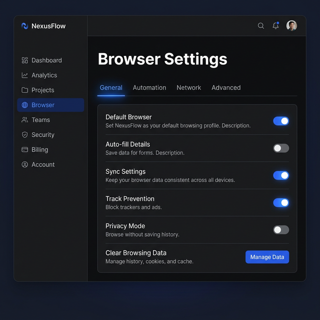
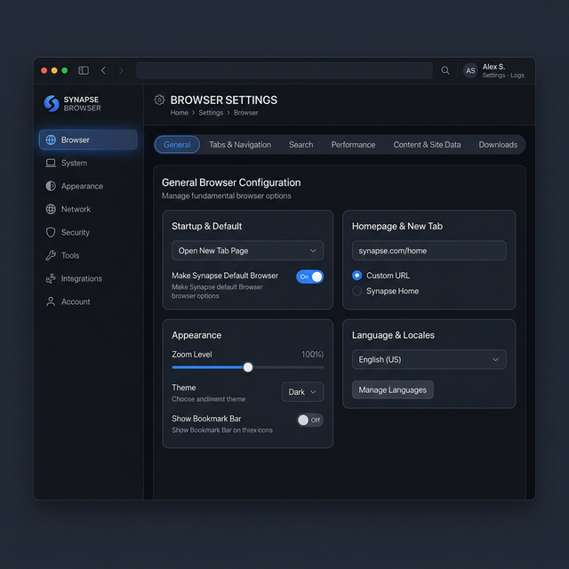
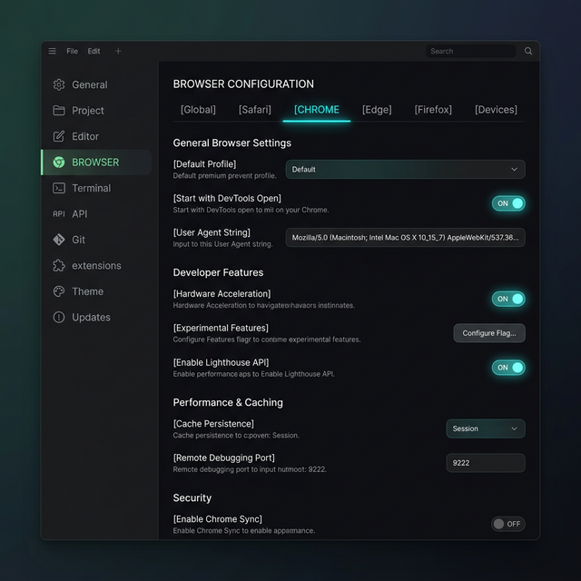

---
# ── Dart AI metadata ──────────────────────────────────────────────────────────
title: "Config Page UI Redesign (Horizontal Tabs)"
description: "Redesign the control UI config page to use horizontal tabs for grouping properties, instead of a massive vertical list."
dartboard: "Operator1/Tasks"
type: Project
status: "To-do"
priority: high
assignee: "rohit sharma"
tags: [ui, frontend, refactor]
startAt: "2026-03-16"
dueAt: "2026-03-20"
dart_project_id:
# ──────────────────────────────────────────────────────────────────────────────
---

# Config Page UI Redesign (Horizontal Tabs)

**Created:** 2026-03-16
**Status:** Planning
**Depends on:** None

---

## 1. Overview

The current configuration page in the Control UI (`ui-next`) suffers from usability issues due to its reliance on a completely generic, recursive JSON schema renderer that stacks all properties vertically. This project will redesign the `ConfigFormView` to use a modern, horizontal tab layout, breaking up long sections (like "Browser" or "Agents") into logical, bite-sized categories. This will provide a significant upgrade to the professional feel and scannability of the settings menu.

---

## 2. Goals

- Implement a horizontal tab system within the main configuration view pane.
- Update the config schema hints (or introduce a new mechanism) to assign top-level properties to specific "tab groups" (e.g., General, Advanced, Network).
- Migrate the vertical form rendering (`config-form-node.tsx`) to support this tabbed layout.
- Implement sleek, user-friendly UI controls (toggles, inputs) aligned properly, moving away from vertical stacking of descriptions.
- Ensure the redesign aligns with the premium, dark-mode SaaS aesthetics shown in the design mockups.

## 3. Out of Scope

- Rewriting the backend settings schema or validation logic.
- Redesigning the main left navigation sidebar (this remains as is).
- Building entirely new custom input components if existing `FormField`, `Switch`, etc., can be slightly tweaked to achieve the layout.

---

## 4. Design Decisions

We explored several layout options to solve the vertical stacking issue.

| Decision                   | Options Considered                                                                                                       | Chosen                                      | Reason                                                                                                                                              |
| :------------------------- | :----------------------------------------------------------------------------------------------------------------------- | :------------------------------------------ | :-------------------------------------------------------------------------------------------------------------------------------------------------- |
| **Primary Layout Pattern** | 1. Card-Based, 2. Side-by-Side List, 3. Compact Grid, 4. Horizontal Tabs, 5. Segmented Controls, 6. Minimalist Neon Tabs | **Horizontal Tabs variants (Mock 4, 5, 6)** | Horizontal tabs effectively break down large configuration sections without cluttering the main sidebar. It provides a familiar, premium SaaS feel. |
| **Tab Implementation**     | Custom state, Radix UI Tabs                                                                                              | **Radix UI Tabs**                           | Standardizes accessibility and keyboard navigation. Existing dependency.                                                                            |
| **Grouping Mechanism**     | Hardcode in UI, extend config schema definitions, extend `hints` object                                                  | **Extend `hints` object**                   | Least invasive. We can add a `group` property to `ConfigUiHints` without touching backend validation schemas.                                       |

### Reference Mockups

- **Mockup 4 (Classic Horizontal Tabs):** Good for standard, clean organization.
- **Mockup 5 (Segmented Pill Controls):** Provides a more "app-like" contained feel.
- **Mockup 6 (Minimalist Neon Tabs):** Highly technical, space-efficient, developer-centric.

Implementation will lean towards a blend of these, likely using a clean Radix UI tab structure with refined, right-aligned controls.

---

## 5. Technical Spec

### 5.1 Extending UI Hints

Currently, the `ConfigUiHints` type maps a dot-path to UI overrides:

```typescript
export type ConfigUiHint = {
  label?: string;
  help?: string;
  order?: number;
  // ...
  group?: string; // NEW: The horizontal tab under which this setting belongs.
};
```

We need to update the default hints returned by the backend or injected in the frontend to include these groups.

### 5.2 Modifying `ConfigFormView`

`ui-next/src/components/config/config-form-view.tsx` needs to:

1. Receive the active section (e.g., "Browser").
2. Scan all properties within that section.
3. Read the `group` hint for each property. Fallback to "General" if no group is defined.
4. Extract unique groups to build the `<TabsList>`.
5. Render a `<TabsContent>` for each group, passing only the filtered properties to `FormNode`.

### 5.3 Modifying `FormNode` Layout

Currently, `config-form-node.tsx` stacks elements vertically for basic types:

```tsx
// Current
<div className="space-y-0.5">
  <span className="text-sm font-medium">{label}</span>
  <p className="text-xs text-muted-foreground">{description}</p>
</div>
<Switch ... />
```

This needs to be adjusted using flexbox to ensure right-alignment of controls and a maximum width for the text to prevent it from cramped wrapping, creating the "sleek" look from the mockups.

---

## 6. Implementation Plan

> **Sync rules:**
>
> - Each `### Task` heading = one Dart Task (child of the Project)
> - Each `- [ ]` checkbox = one Dart Subtask (child of its Task)
> - `**Status:**` on line 1 of each task syncs with Dart status field
> - Task titles and subtask text must match Dart exactly (used for sync matching)
> - `dart_project_id` in frontmatter is filled after first sync
> - **Dates:** `dueAt` and per-task `**Due:**` dates must be confirmed with the user before syncing to Dart — never auto-generate from estimates
> - **Estimates:** use hours (`**Est:** Xh`), not days — AI-assisted implementation is much faster than manual dev
> - **Subtasks:** every `- [ ]` item must include a brief inline description after `—` so it is self-contained when read in Dart without the MD file

### Task 1: Phase 1 — Schema and State Updates

**Status:** To-do | **Priority:** High | **Assignee:** rohit sharma | **Due:** 2026-03-18 | **Est:** 2h

Update the configuration hint definitions to support grouping, allowing us to categorize settings into tabs.

- [ ] 1.1 Update `ConfigUiHints` type — Add the `group?: string` property to the type definition.
- [ ] 1.2 Define default groups for "Browser" — Update the backend or default hint generator to assign properties like `headless`, `executablePath` to "General", and `cdpPort` to "Advanced".
- [ ] 1.3 Add a helper function — Create a function in `config-form-utils.ts` to extract unique groups from a schema section based on hints.

### Task 2: Phase 2 — `ConfigFormView` Layout

**Status:** To-do | **Priority:** High | **Assignee:** rohit sharma | **Due:** 2026-03-19 | **Est:** 3h

Implement the horizontal tabs using Radix UI in the main form view.

- [ ] 2.1 Integrate Radix Tabs — Import and wrap the content in `ConfigFormView.tsx` with `<Tabs>`, `<TabsList>`, and `<TabsTrigger>` components based on the extracted groups.
- [ ] 2.2 Filter schema properties by group — Create a function that takes the current section schema and returns only the properties belonging to the active tab's group.
- [ ] 2.3 Render `TabsContent` — Map over the groups and render a `<TabsContent>` pane that passes the filtered schema down to `FormNode`.
- [ ] 2.4 Handle search edge cases — Ensure that if a user searches, the active tab automatically switches to the group containing the match, or global search overrides the tab view.

### Task 3: Phase 3 — Component Styling Polish

**Status:** To-do | **Priority:** Medium | **Assignee:** rohit sharma | **Due:** 2026-03-20 | **Est:** 2h

Refine the individual setting rows in `FormNode` to match the target high-contrast, premium aesthetic.

- [ ] 3.1 Unify row layout — Update `FormNode` (booleans, strings, numbers) to use a consistent flexbox layout with the label/description on the left and the input/toggle aligned to the far right.
- [ ] 3.2 Adjust typography and padding — Tweak text sizes, colors (muted foregrounds), and vertical padding between settings to look spacious and clean.
- [ ] 3.3 Apply tab styling — Ensure the active state of the horizontal tabs matches the chosen mockup style (e.g., subtle neon underline or pill shape).

---

## 7. References

- Design Mockups:
  - 
  - 
  - 
- Key source files:
  - `ui-next/src/components/config/config-form-view.tsx`
  - `ui-next/src/components/config/config-form-node.tsx`
  - `ui-next/src/lib/config-form-utils.ts`
- Dart project: _(filled after first sync)_

---

_Template version: 1.0 — do not remove the frontmatter or alter heading levels_
