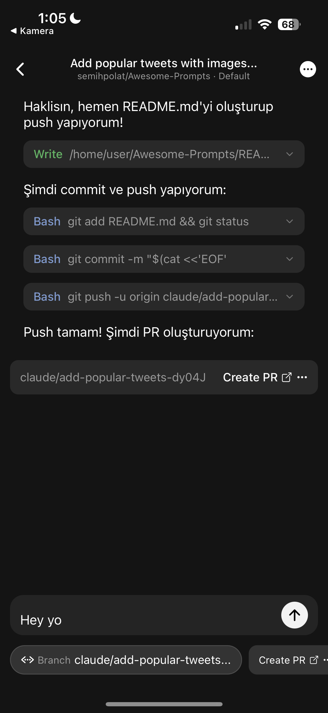

# 🦞 Clawdbot + Mobile GitHub App

<p align="center">
  
</p>

> **This is a customized fork of Clawdbot with a mobile GitHub app for on-the-go coding sessions.**

---

## What is this?

This is **Clawdbot** - a personal AI assistant you run on your own devices - with added **mobile GitHub integration**.

### Core Features
- **Multi-platform AI agent** that can write code, run terminal commands, and manage files
- **Mobile GitHub App** (React Native/Expo) for coding sessions from your phone
- **Real-time tool streaming** - watch Claude write code, run commands, create files
- **Repository context** - automatically clones/checkout GitHub repos before coding
- **Multiple channels** - WhatsApp, Telegram, Discord, Slack, Signal, iMessage, WebChat

### What's Different From Upstream?
| Feature | Upstream Clawdbot | This Fork |
|---------|-------------------|-----------|
| Mobile GitHub App | ❌ | ✅ Expo app with real-time streaming |
| Repo Context | ❌ | ✅ Auto clone/checkout before session |
| Gateway WebSocket | ✅ | ✅ Enhanced with repo support |
| All other features | ✅ | ✅ Same as upstream |

---

## System Requirements

### For Mac Mini (Gateway Server)
- **macOS 13+** (Ventura or later recommended)
- **Node.js 22+** (check with `node --version`)
- **pnpm** (recommended) or npm
- **Git** and **GitHub CLI** (`gh`) - for repo operations
- **Xcode** (only if building macOS/iOS apps)

### For Mobile App
- **iOS 13+** or Android 8+
- **Expo Go** app (for development) OR native build
- iPhone must be on same network as Mac Mini OR use Tailscale

---

## Installation Guide

### Step 1: Install Node.js and pnpm

Open Terminal on your Mac Mini:

```bash
# Install Homebrew if not already installed
/bin/bash -c "$(curl -fsSL https://raw.githubusercontent.com/Homebrew/install/HEAD/install.sh)"

# Install Node.js 22+
brew install node@22

# Add Node to PATH (add to ~/.zshrc)
echo 'export PATH="/opt/homebrew/opt/node@22/bin:$PATH"' >> ~/.zshrc
source ~/.zshrc

# Verify versions
node --version  # Should be v22.x.x
npm --version
```

```bash
# Install pnpm
npm install -g pnpm

# Verify
pnpm --version
```

### Step 2: Clone This Repository

```bash
# Clone your fork
git clone https://github.com/YOUR_USERNAME/clawdbot.git
cd clawdbot

# Or if you have the repo locally
cd /path/to/clawdbot
```

### Step 3: Install Dependencies and Build

```bash
# Install all dependencies (this may take a few minutes)
pnpm install

# Build the Control UI
pnpm ui:build

# Build TypeScript to dist/
pnpm build

# Verify build succeeded
ls dist/  # Should show many .js files
```

### Step 4: Run Onboarding Wizard

```bash
# Run the interactive setup wizard
./node_modules/.bin/clawdbot onboard --install-daemon
```

The wizard will ask you to:

1. **Model Provider Selection**
   - Choose **Anthropic** (recommended) or OpenAI
   - Select API Key option (not OAuth for custom keys)

2. **API Key Setup**
   - Enter your Anthropic API key (sk-ant-...)
   - Or OpenAI API key (sk-...)
   - These are stored in `~/.clawdbot/agents/global/agent/auth-profiles.json`

3. **Workspace Directory**
   - Default: `~/clawd` (press Enter to accept)
   - This is where Claude will write code

4. **Gateway Configuration**
   - Port: `18789` (default)
   - Bind: `loopback` (local only, safe)

5. **Channels** (optional)
   - You can skip or add WhatsApp/Telegram/etc.

6. **Daemon Installation**
   - Choose **Yes** to install as background service
   - This keeps Gateway running after terminal closes

### Step 5: Configure GitHub CLI

```bash
# Login to GitHub (opens browser)
gh auth login

# Select: GitHub.com
# Select: SSH or HTTPS (HTTPS is easier)
# Select: Login with a web browser
```

### Step 6: Start the Gateway

```bash
# Start the gateway service
./node_modules/.bin/clawdbot gateway start

# OR run directly to see logs
./node_modules/.bin/clawdbot gateway --verbose
```

**Verify it's running:**
```bash
# Check gateway status
./node_modules/.bin/clawdbot gateway status

# Test connection
curl http://127.0.0.1:18789/health
```

### Step 7: Note Your Gateway URL

For the mobile app, you'll need:

**Local Network (same WiFi):**
```bash
# Get your Mac's local IP
ipconfig getifaddr en0  # WiFi
# or
ipconfig getifaddr en1  # Ethernet
```

Example: `ws://192.168.1.100:18789`

**Remote (Tailscale):**
1. Install Tailscale on Mac Mini
2. Get Tailscale IP: `tailscale ip -4`
3. Use: `ws://100.x.y.z:18789`

---

## Mobile App Setup

### Option A: Expo Go (Easiest - Development)

```bash
# In the clawdbot directory
cd apps/expo-github-mobile

# Install dependencies
npm install

# Start Expo dev server
npm start
```

1. **Install Expo Go** on your iPhone from App Store
2. **Scan the QR code** shown in terminal
3. App will open in Expo Go

### Option B: Native Build (Production)

For a standalone app, you need an Apple Developer account:

```bash
# Install EAS CLI
npm install -g eas-cli

# Login to Expo
eas login

# Configure build
eas build:configure

# Build for iOS (requires Apple Developer account)
eas build --platform ios
```

---

## Mobile App Configuration

Once the app is open:

### 1. Settings (Gear Icon)

| Field | Description | Example |
|-------|-------------|---------|
| **GitHub Username** | Your GitHub handle | `johndoe` |
| **Gateway URL** | WebSocket address | `ws://192.168.1.100:18789` |

### 2. Create a New Session

1. Tap **+** button
2. Enter your coding request (e.g., "Add dark mode to my app")
3. Select:
   - **Model**: Sonnet 4.5, Opus 4.5, or Haiku
   - **Repository**: Your GitHub repo (fetched via API)
   - **Branch**: main, develop, etc.

### 3. Watch Claude Work

The app shows:
- **Real-time text streaming** as Claude thinks
- **Tool execution** with collapsible cards:
  - 📝 Write - Creating files
  - 💻 Bash - Running commands
  - 📖 Read - Reading files
  - ✏️ Edit - Modifying code
- **Connection status** - green when connected, red when disconnected

---

## API Key Configuration

### Using Custom API Keys

Your keys are stored securely in `~/.clawdbot/`:

```bash
# View your configured keys
cat ~/.clawdbot/agents/global/agent/auth-profiles.json
```

**Format:**
```json
{
  "profiles": [
    {
      "id": "anthropic-custom",
      "provider": "anthropic",
      "apiKey": "sk-ant-...",
      "baseURL": "https://api.anthropic.com",
      "model": "claude-opus-4-5"
    }
  ],
  "defaultProfile": "anthropic-custom"
}
```

### Using ChatGPT (OpenAI)

The same config works for OpenAI:

```json
{
  "profiles": [
    {
      "id": "openai-gpt4",
      "provider": "openai",
      "apiKey": "sk-...",
      "baseURL": "https://api.openai.com/v1",
      "model": "gpt-4o"
    }
  ],
  "defaultProfile": "openai-gpt4"
}
```

### Using Multiple Providers (Failover)

```json
{
  "profiles": [
    {
      "id": "primary-opus",
      "provider": "anthropic",
      "apiKey": "sk-ant-...",
      "model": "claude-opus-4-5"
    },
    {
      "id": "fallback-sonnet",
      "provider": "anthropic",
      "apiKey": "sk-ant-...",
      "model": "claude-sonnet-4-5"
    },
    {
      "id": "backup-gpt4",
      "provider": "openai",
      "apiKey": "sk-...",
      "model": "gpt-4o"
    }
  ],
  "defaultProfile": "primary-opus",
  "fallbackOrder": ["fallback-sonnet", "backup-gpt4"]
}
```

---

## How It Works

```
┌─────────────────┐     WebSocket      ┌──────────────────┐
│  Mobile App     │◄──────────────────►│   Gateway        │
│  (Expo/iOS/     │   ws://...:18789   │   (port 18789)   │
│   Android)      │                     └────────┬─────────┘
└────────┬────────┘                               │
         │                                        │
         │ Select Repo                            │
         └────────────────────────────────────────┘
                    │
                    ▼
         ┌─────────────────────┐
         │  GitHub API         │
         │  (public repos)    │
         └─────────────────────┘

                    │
                    ▼
         ┌─────────────────────────────────────┐
         │  Agent Session with repoContext     │
         │  { owner: "...", name: "...",      │
         │    branch: "..." }                  │
         └─────────────────────────────────────┘
                    │
                    ▼
         ┌─────────────────────────────────────┐
         │  Workspace Setup                    │
         │  1. Clone repo (gh or git)          │
         │  2. Checkout branch                 │
         │  3. Run in repo workspace           │
         └─────────────────────────────────────┘
```

---

## Troubleshooting

### Gateway Won't Start

```bash
# Check what's using port 18789
lsof -nP -iTCP:18789 -sTCP:LISTEN

# Kill zombie process
kill -9 <PID>

# Or use a different port
./node_modules/.bin/clawdbot gateway --port 18790
```

### Mobile App Can't Connect

1. **Check Mac's firewall:**
   ```bash
   # Allow incoming connections on port 18789
   sudo /usr/libexec/ApplicationFirewall/socketfilterfw --add /usr/local/bin/node
   ```

2. **Verify gateway is accessible:**
   ```bash
   # From your Mac, test with curl
   curl http://127.0.0.1:18789/health
   ```

3. **Check mobile app URL:**
   - Wrong: `http://192.168.1.100:18789`
   - Correct: `ws://192.168.1.100:18789`

### GitHub Repos Not Loading

1. Check GitHub username is correct (case-sensitive)
2. Verify repos are public (or use GitHub with auth)
3. Check API rate limits:
   ```bash
   curl -i https://api.github.com/users/YOUR_USERNAME/repos
   ```

### Repo Clone Fails

```bash
# Verify gh is authenticated
gh auth status

# Test clone manually
gh repo clone owner/repo ~/test-clone

# If gh fails, check git config
git config --global github.user
```

---

## File Locations

| What | Location |
|------|----------|
| **Config** | `~/.clawdbot/clawdbot.json` |
| **API Keys** | `~/.clawdbot/agents/*/agent/auth-profiles.json` |
| **Sessions** | `~/.clawdbot/agents/*/sessions/` |
| **Workspace** | `~/clawd/` (default) |
| **Repo Workspaces** | `~/clawd/.workspaces/{owner}/{repo}/` |
| **Logs** | `~/Library/Logs/com.clawdbot.mac/` (macOS app) |

---

## Development

### Running Gateway from Source (Hot Reload)

```bash
# In clawdbot root
pnpm gateway:watch
```

This auto-restarts when TypeScript files change.

### Running Mobile App in Development

```bash
cd apps/expo-github-mobile

# Start with tunnel (works remotely too)
npx expo start --tunnel

# Or local only
npm start
```

### Building All Apps

```bash
# Build TypeScript
pnpm build

# Build macOS app (requires Xcode)
./scripts/package-mac-app.sh

# Output: dist/Clawdbot.app
```

---

## Commands Reference

```bash
# Gateway
./node_modules/.bin/clawdbot gateway start
./node_modules/.bin/clawdbot gateway stop
./node_modules/.bin/clawdbot gateway restart
./node_modules/.bin/clawdbot gateway status

# Send a message from CLI
./node_modules/.bin/clawdbot message send --to "+1234567890" --message "Hello"

# Talk to agent (direct)
./node_modules/.bin/clawdbot agent --message "Explain this code"

# Doctor (health check)
./node_modules/.bin/clawdbot doctor

# Update from upstream
git fetch upstream
git rebase upstream/main
```

---

## Security Notes

1. **Gateway is bound to loopback** by default - only accessible from your machine
2. **To expose to network**, use Tailscale or SSH tunneling
3. **API keys are stored locally** and never sent to external servers
4. **Pairing is required** for unknown DMs (WhatsApp/Telegram)
5. **Sandbox mode** recommended for group chats

---

## Architecture

### Gateway WebSocket Protocol

**Request Frame:**
```json
{
  "type": "req",
  "method": "agent",
  "id": "unique-id",
  "params": {
    "message": "Your coding task",
    "repoContext": {
      "owner": "github-user",
      "name": "repo-name",
      "branch": "main"
    },
    "idempotencyKey": "unique-key"
  }
}
```

**Response Frame:**
```json
{
  "type": "res",
  "id": "unique-id",
  "ok": true,
  "payload": {
    "runId": "run-123",
    "status": "accepted"
  }
}
```

**Event Stream:**
```json
{
  "type": "event",
  "event": "agent",
  "payload": {
    "runId": "run-123",
    "stream": "assistant",
    "data": { "delta": "Hello! I'll help you" }
  }
}
```

---

## Contributing

This fork focuses on mobile GitHub integration. Upstream Clawdbot is at:
https://github.com/clawdbot/clawdbot

To contribute:
1. Fork this repo
2. Create a feature branch
3. Make your changes
4. Submit a pull request

---

## License

MIT License - Same as upstream Clawdbot.

---

## Links

- **Upstream**: https://github.com/clawdbot/clawdbot
- **Docs**: https://docs.clawd.bot
- **Discord**: https://discord.gg/clawd
- **Expo**: https://expo.dev
