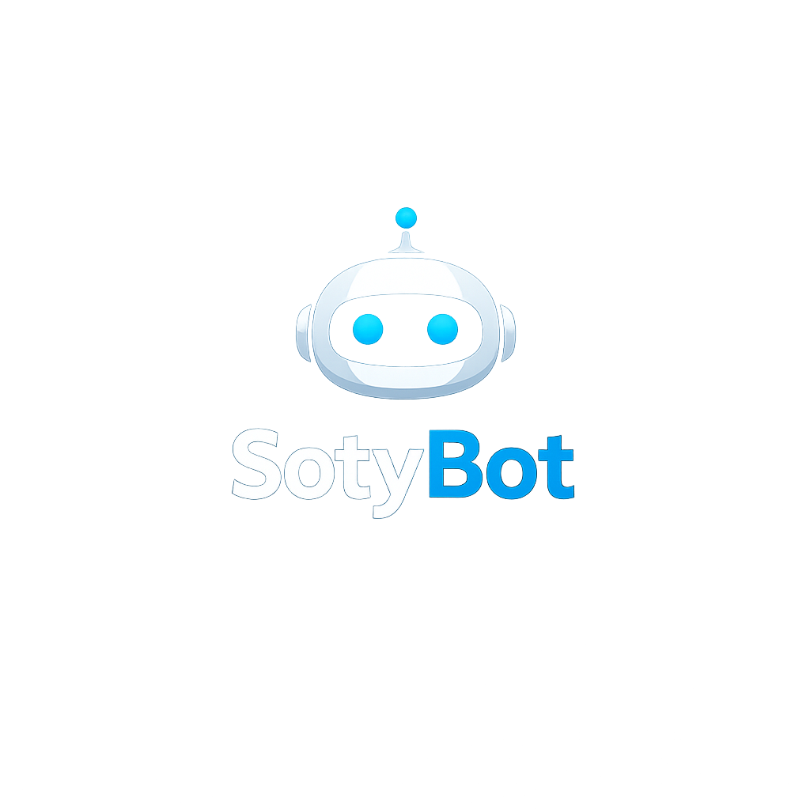

<div align="center">
  

  # SotyBot

  **Tu propio ejército de agentes autónomos.**

  [](https://opensource.org/licenses/Apache-2.0)
  [](https://www.python.org/downloads/)
  [](https://www.docker.com/)

  *Ni chatbots aburridos, ni asistentes que solo ponen alarmas.*  
  *Un motor open-source para correr agentes que realmente hacen cosas.*
</div>

---

## �‍☠️ ¿Qué es esto?

Olvídate del rollo corporativo. **SotyBot** es la consola; los agentes son los juegos.

SotyBot es un motor que instalas en tu máquina para correr agentes de IA. ¿Qué tipo de agentes? **Lo que tú quieras.**
- Un analista de cripto que te avisa cuando una shitcoin va a explotar.
- Un experto en seguridad que escanea archivos sospechosos antes de que los abras.
- Un redactor creativo que te saca ideas para posts cuando estás seco.
- Un loco de las apuestas deportivas que cruza datos de 5 webs distintas.

Nosotros te damos el motor (**SotyBot**). La comunidad en **[SotyHub](https://sotyhub.com)** crea y comparte los agentes.

---

## ⚡ Quick Start

No necesitas un doctorado. Si tienes Docker, tienes SotyBot.

### Opción A: Soy impaciente (Docker)

```bash
# 1. Clónate el repo
git clone https://github.com/sotyhub/sotybot.git
cd sotybot

# 2. Configura lo básico (keys y tal)
cp .env.example .env

# 3. Dale gas
docker-compose up --build

# Ya está. Tu motor está corriendo en http://localhost:8000
```

### Opción B: Me gusta ensuciarme las manos (Python local)

```bash
pip install -e ".[dev]"
python -m engine.core.app
```

---

## �️ ¿Cómo se usa?

Una vez corriendo, puedes instalar agentes o pedirles cosas. Imagina que tienes el agente de apuestas instalado:

```bash
# Oye, mírame este partido
sotybot exec betting_analyst "Analiza el partido Lakers vs Warriors de esta noche"
```

El agente se despertará, buscará stats, comparará cuotas y te escupirá una respuesta. **No es magia, es código.**

---

## 🧠 La Filosofía (SotyHub vs SotyBot)

Para que nos entendamos:

*   **SotyHub** es el **Club Social**. Es donde vas a ver qué ha inventado la peña, compartir tus locuras y encontrar el agente perfecto para ese problema que tienes.
*   **SotyBot** (esto de aquí) es tu **Herramienta**. Es el software que corre en tu PC/Server y hace el trabajo sucio.

Usamos la base "OpenClaw" porque inventar la rueda es de tontos, pero la hemos trucado para que acepte *cualquier cosa*.

---

## 🏗️ Para los Builders

¿Quieres crear tu propio agente? Es ridículamente fácil.

```python
from engine.agents.base import BaseAgent

class MiAgenteLoco(BaseAgent):
    async def execute(self, task, context=None):
        # Aquí pones tu lógica, llamadas a APIs, o lo que sea.
        return {"resultado": "He hecho lo que me has pedido, jefe."}
```

Echa un ojo a la carpeta `agents/` para ver ejemplos reales.

---

## 🗺️ El Plan de Dominación (Roadmap)

Estamos en la **v0.1.0** (MVP). Funciona, es estable, pero esto acaba de empezar.

*   [x] **El Motor**: Corre agentes, maneja permisos y no explota.
*   [x] **Agentes Ejemplo**: Cripto, Deportes, Seguridad, Creatividad.
*   [ ] **Dashboard Web**: Para que no tengas que usar la terminal si no quieres.
*   [ ] **Modo Enjambre**: Agentes hablando con otros agentes.

---

## 🤝 Únete a la fiesta

Esto es Open Source de verdad. Si tienes una idea, abre una PR. Si encuentras un bug, repórtalo. Si creas un agente brutal, súbelo a SotyHub.

**Licencia Apache 2.0.** Haz lo que quieras con el código, es tuyo.

---

<div align="center">

**Hecho con 🖤 por y para la comunidad**

[Web de SotyHub](https://sotyhub.com) • [Discord](https://discord.gg/sotyhub)

</div>
