<p align="center">
  
</p>

<p align="center">
  <a href="https://github.com/openclaw/openclaw/actions/workflows/ci.yml?branch=main">
    
  </a>
  <a href="https://github.com/openclaw/openclaw/releases">
    
  </a>
  <a href="https://discord.gg/clawd">
    
  </a>
  <a href="LICENSE">
    
  </a>
</p>

---

**OpenClaw** is a _personal AI assistant_ you run on your own devices.
It answers you on the channels you already use (WhatsApp, Telegram, Slack, Discord, Google Chat, Signal, iMessage, Microsoft Teams, WebChat), plus extension channels like BlueBubbles, Matrix, Zalo, and Zalo Personal. It can speak and listen on macOS/iOS/Android, and can render a live Canvas you control. The Gateway is just the control plane — **the product is the assistant**.

> If you want a personal, single-user assistant that feels local, fast, and always-on, this is it.

[Website](https://openclaw.ai) · [Docs](https://docs.openclaw.ai) · [Vision](VISION.md) · [DeepWiki](https://deepwiki.com/openclaw/openclaw) · [Getting Started](https://docs.openclaw.ai/start/getting-started) · [Updating](https://docs.openclaw.ai/install/updating) · [Showcase](https://docs.openclaw.ai/start/showcase) · [FAQ](https://docs.openclaw.ai/start/faq) · [Wizard](https://docs.openclaw.ai/start/wizard) · [Nix](https://github.com/openclaw/nix-openclaw) · [Docker](https://docs.openclaw.ai/install/docker) · [Discord](https://discord.gg/clawd)

---

## ⚡ Quick Start

Runtime: **Node ≥22**

```bash
npm install -g openclaw@latest
openclaw onboard --install-daemon
```

Full beginner guide: [Getting started](https://docs.openclaw.ai/start/getting-started)

```bash
openclaw gateway --port 18789 --verbose

# Send a message
openclaw message send --to +1234567890 --message "Hello from OpenClaw"

# Talk to the assistant
openclaw agent --message "Ship checklist" --thinking high
```

Upgrading? [Updating guide](https://docs.openclaw.ai/install/updating) — and run `openclaw doctor`.

---

## 🤖 Subscriptions (OAuth)

- **[Anthropic](https://www.anthropic.com/)** (Claude Pro/Max) — recommended: **Opus 4.6** for long-context + prompt-injection resistance
- **[OpenAI](https://openai.com/)** (ChatGPT/Codex)

See [Onboarding](https://docs.openclaw.ai/start/onboarding) · [Models config](https://docs.openclaw.ai/concepts/models) · [Model failover](https://docs.openclaw.ai/concepts/model-failover)

---

## 🌟 Highlights

| Feature | Description |
|---|---|
| 🏠 **[Local-first Gateway](https://docs.openclaw.ai/gateway)** | Single control plane for sessions, channels, tools, and events |
| 📱 **[Multi-channel inbox](https://docs.openclaw.ai/channels)** | WhatsApp, Telegram, Slack, Discord, Signal, iMessage, Teams, Matrix + more |
| 🤖 **[Multi-agent routing](https://docs.openclaw.ai/gateway/configuration)** | Route channels/accounts/peers to isolated agents |
| 🎙️ **[Voice Wake + Talk Mode](https://docs.openclaw.ai/nodes/voicewake)** | Always-on speech for macOS/iOS/Android with ElevenLabs |
| 🖼️ **[Live Canvas](https://docs.openclaw.ai/platforms/mac/canvas)** | Agent-driven visual workspace with A2UI |
| 🛠️ **[First-class tools](https://docs.openclaw.ai/tools)** | Browser, canvas, nodes, cron, sessions, Discord/Slack actions |
| 📦 **[Companion apps](https://docs.openclaw.ai/platforms/macos)** | macOS menu bar app + iOS/Android nodes |
| 🧙 **[Wizard + Skills](https://docs.openclaw.ai/start/wizard)** | Guided setup with bundled/managed/workspace skills |

---

## 📦 Install

```bash
npm install -g openclaw@latest
# or: pnpm add -g openclaw@latest

openclaw onboard --install-daemon
```

The wizard installs the Gateway daemon (launchd/systemd) so it stays running.

**Development channels:**

| Channel | Tag | Description |
|---|---|---|
| `stable` | `latest` | Tagged releases `vYYYY.M.D` |
| `beta` | `beta` | Prerelease tags `vYYYY.M.D-beta.N` |
| `dev` | `dev` | Moving head of `main` |

Switch: `openclaw update --channel stable|beta|dev` — [Details](https://docs.openclaw.ai/install/development-channels)

---

## 🔧 From source

```bash
git clone https://github.com/openclaw/openclaw.git
cd openclaw

pnpm install
pnpm ui:build
pnpm build

pnpm openclaw onboard --install-daemon

# Dev loop (auto-reload on TS changes)
pnpm gateway:watch
```

---

## 🔒 Security defaults

OpenClaw connects to real messaging surfaces. Treat inbound DMs as **untrusted input**.

- **DM pairing** (`dmPolicy="pairing"`): unknown senders receive a pairing code — not processed until approved.
- Approve: `openclaw pairing approve <channel> <code>`
- Public DMs require explicit opt-in: `dmPolicy="open"` + `"*"` in allowlist.
- Run `openclaw doctor` to surface risky/misconfigured DM policies.

Full security guide: [Security](https://docs.openclaw.ai/gateway/security)

---

## 🏗️ Architecture

```
WhatsApp / Telegram / Slack / Discord / Google Chat / Signal
iMessage / BlueBubbles / Microsoft Teams / Matrix / Zalo / WebChat
               │
               ▼
┌───────────────────────────────┐
│            Gateway            │
│       (control plane)         │
│     ws://127.0.0.1:18789      │
└──────────────┬────────────────┘
               │
               ├─ Pi agent (RPC)
               ├─ CLI (openclaw …)
               ├─ WebChat UI
               ├─ macOS app
               └─ iOS / Android nodes
```

**Key subsystems:**
- [Gateway WebSocket](https://docs.openclaw.ai/concepts/architecture) — single WS control plane
- [Tailscale Serve/Funnel](https://docs.openclaw.ai/gateway/tailscale) — remote access
- [Browser control](https://docs.openclaw.ai/tools/browser) — openclaw-managed Chrome/Chromium
- [Canvas + A2UI](https://docs.openclaw.ai/platforms/mac/canvas) — agent-driven visual workspace
- [Voice Wake + Talk Mode](https://docs.openclaw.ai/nodes/voicewake) — always-on speech
- [Nodes](https://docs.openclaw.ai/nodes) — camera, screen record, `location.get`, notifications

---

## 💬 Chat Commands

| Command | Description |
|---|---|
| `/status` | Compact session status (model + tokens, cost) |
| `/new` or `/reset` | Reset the session |
| `/compact` | Compact session context (summary) |
| `/think <level>` | `off\|minimal\|low\|medium\|high\|xhigh` |
| `/verbose on\|off` | Toggle verbose mode |
| `/usage off\|tokens\|full` | Per-response usage footer |
| `/restart` | Restart the gateway (owner-only in groups) |
| `/activation mention\|always` | Group activation toggle |

---

## 📱 Apps (optional)

The Gateway alone delivers a great experience. All apps are optional.

**macOS (OpenClaw.app):** Menu bar control, Voice Wake/PTT, WebChat, remote gateway control.
**iOS node:** Canvas, Voice Wake, Talk Mode, camera, screen recording, Bonjour pairing.
**Android node:** Canvas, Talk Mode, camera, screen recording, optional SMS.

---

## ⚙️ Configuration

Minimal `~/.openclaw/openclaw.json`:

```json5
{
  agent: {
    model: "anthropic/claude-opus-4-6",
  },
}
```

[Full configuration reference](https://docs.openclaw.ai/gateway/configuration)

---

## 🔐 Security model

- **Default:** tools run on host for the `main` session — full access when it's just you.
- **Group/channel safety:** `agents.defaults.sandbox.mode: "non-main"` → per-session Docker sandboxes.
- **Sandbox:** allowlist `bash, process, read, write, edit, sessions_*`; denylist `browser, canvas, nodes, cron`.

[Security guide](https://docs.openclaw.ai/gateway/security) · [Docker + sandboxing](https://docs.openclaw.ai/install/docker)

---

## 📚 Channel Setup

<details>
<summary><b>WhatsApp, Telegram, Slack, Discord, Signal, BlueBubbles, iMessage, Teams, WebChat</b></summary>

**WhatsApp:** `pnpm openclaw channels login` — stores creds in `~/.openclaw/credentials`

**Telegram:**
```json5
{ channels: { telegram: { botToken: "123456:ABCDEF" } } }
```

**Discord:**
```json5
{ channels: { discord: { token: "1234abcd" } } }
```

**Slack:** Set `SLACK_BOT_TOKEN` + `SLACK_APP_TOKEN`

**Signal:** Requires `signal-cli` + `channels.signal` config

**BlueBubbles (recommended iMessage):** `channels.bluebubbles.serverUrl` + `password` + `webhookPath`

**WebChat:** Uses Gateway WebSocket — no separate port/config needed.

**Browser control (optional):**
```json5
{ browser: { enabled: true, color: "#FF4500" } }
```

</details>

---

## 📈 Star History

[](https://www.star-history.com/#openclaw/openclaw&type=date&legend=top-left)

---

## 🦞 Built for Molty

OpenClaw was built for **Molty**, a space lobster AI assistant. 🦞
by [Peter Steinberger](https://steipete.me) and the community.

[openclaw.ai](https://openclaw.ai) · [soul.md](https://soul.md) · [steipete.me](https://steipete.me) · [@openclaw](https://x.com/openclaw)

---

## 🤝 Community

See [CONTRIBUTING.md](CONTRIBUTING.md) for guidelines and how to submit PRs.
**AI/vibe-coded PRs welcome!** 🤖

Special thanks to [Mario Zechner](https://mariozechner.at/) for his support and for [pi-mono](https://github.com/badlogic/pi-mono).
Special thanks to Adam Doppelt for lobster.bot.

### 🦀 Clawtributors

<p align="center">
  
</p>


<!-- CONTRIBUTORS:START -->
<p align="left">
  <a href="https://github.com/steipete"></a> <a href="https://github.com/joshp123"></a> <a href="https://github.com/cpojer"></a> <a href="https://github.com/mbelinky"></a> <a href="https://github.com/sebslight"></a> <a href="https://github.com/Takhoffman"></a> <a href="https://github.com/quotentiroler"></a> <a href="https://github.com/bohdanpodvirnyi"></a> <a href="https://github.com/tyler6204"></a> <a href="https://github.com/iHildy"></a>
</p>
<!-- CONTRIBUTORS:END -->

---

<p align="center">
  
</p>
