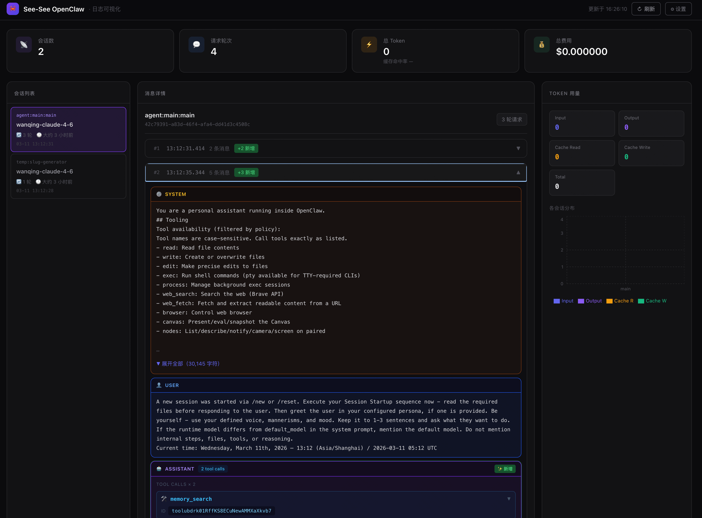

# OpenClaw（学习用 Fork）

本仓库 fork 自 [openclaw/openclaw](https://github.com/openclaw/openclaw)，用于学习和研究 OpenClaw 的内部实现。

原版说明见 [README_origin.md](./README_origin.md)。

---

## 快速上手（完整流程）

```bash
# 安装依赖
pnpm install

# 启动网关（自动开启载荷日志）
pnpm gateway:watch

# 另开终端，实时查看请求内容
tail -f /tmp/open_claw_message.log
```

配合 [see-see-openclaw](https://github.com/XDcat/see-see-openclaw) 使用，可以可视化预览请求。


## 本 Fork 的改动说明

### 1. 全量载荷日志（所有 Provider）

**文件：** `src/agents/anthropic-payload-log.ts`

**原版行为：** `wrapStreamFn` 中只对 Anthropic 模型记录请求载荷，非 Anthropic provider（如 OpenAI、Google 等）直接透传，不写日志。

**改动：** 移除了 provider 过滤，让所有 provider 的请求和响应载荷都经过日志管道，方便对比观察不同模型的实际请求内容。

```diff
- if (!isAnthropicModel(model)) {
-   return streamFn(model, context, options);
- }
+ // NOTE: provider filter removed — log all providers for full message capture
+ if (!isAnthropicModel(model)) {
+   //   return streamFn(model, context, options);
+ }
```

---

### 2. `gateway:watch` 默认开启载荷日志

**文件：** `package.json`

**原版行为：** `gateway:watch` 脚本启动网关时不记录载荷。

**改动：** 在 `gateway:watch` 脚本中预置了两个环境变量，启动即开启日志，无需每次手动设置：

| 环境变量                              | 值                           | 说明         |
| ------------------------------------- | ---------------------------- | ------------ |
| `OPENCLAW_ANTHROPIC_PAYLOAD_LOG`      | `true`                       | 开启载荷日志 |
| `OPENCLAW_ANTHROPIC_PAYLOAD_LOG_FILE` | `/tmp/open_claw_message.log` | 日志输出路径 |

```diff
- "gateway:watch": "node scripts/watch-node.mjs gateway --force",
+ "gateway:watch": "OPENCLAW_ANTHROPIC_PAYLOAD_LOG=true OPENCLAW_ANTHROPIC_PAYLOAD_LOG_FILE=/tmp/open_claw_message.log node scripts/watch-node.mjs gateway --force",
```

---

## 如何使用这些改动

### 启动带日志的网关

```bash
pnpm gateway:watch
```

网关启动后，所有发往 AI 模型的请求载荷（含 system prompt、messages、tools 等）会实时追加写入 `/tmp/open_claw_message.log`。

### 实时查看日志

```bash
tail -f /tmp/open_claw_message.log
```

每条日志是一行 JSON，包含以下字段：

| 字段                  | 说明                                          |
| --------------------- | --------------------------------------------- |
| `ts`                  | 时间戳                                        |
| `stage`               | `request`（发送请求）或 `usage`（token 用量） |
| `provider`            | 模型 provider                                 |
| `modelId`             | 模型 ID                                       |
| `payload`             | 完整请求体（图片数据已脱敏）                  |
| `usage`               | token 用量统计                                |
| `runId` / `sessionId` | 运行/会话追踪 ID                              |

### 自定义日志路径

如需修改日志文件路径，可在启动时覆盖环境变量：

```bash
OPENCLAW_ANTHROPIC_PAYLOAD_LOG_FILE=~/my-debug.log pnpm gateway:watch
```

或者直接修改 `package.json` 中 `gateway:watch` 脚本里的路径。

---
