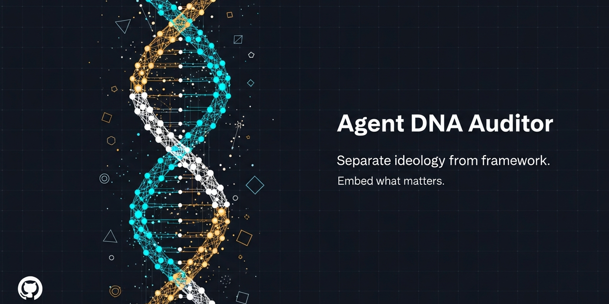

<p align="center">
  
</p>

# Agent DNA Auditor

**Scan your AI coding agents. Classify what's ideology vs what's framework knowledge. Embed DNA directly into agent definitions.**

A Claude Code skill that reads your agent definitions, identifies which instructions are permanent methodology (DNA) and which are project-specific framework knowledge (Tech Stack Skills), then optionally rewrites your agents with DNA properly embedded and tech skills mapped as invokable references.

---

## The Mental Model

An agent is built from two layers. One is permanent. One is project-specific.

### Layer 1: DNA (embedded — never changes)

DNA is HOW the agent thinks. Methodology, ideology, best practices that apply regardless of what project it's working on. A senior backend engineer doesn't forget Clean Architecture when switching from Python to TypeScript. That knowledge is part of who they are.

**DNA answers: "What does a great [role] always do?"**

Examples:
- **Backend:** Clean Architecture, DDD bounded contexts, API contract-first design, security-first thinking, trust boundaries
- **Frontend:** Design Thinking (Purpose > Tone > Constraints > Differentiation), typography rules (never default to Inter/Roboto), spatial composition, motion philosophy, WCAG 2.2 AA
- **Universal:** Anti-slop writing (no "Let's dive in", no hedging), AI-native output formatting, quality thresholds

### Layer 2: Skills (invoked — changes per project)

Skills are WHAT TOOLS the agent uses for THIS specific project. Framework specialties, library docs, vendor integrations. They're called in when needed and swapped when the stack changes.

**Skills answer: "What specific technology does this project use?"**

Examples: `$langchain`, `$supabase`, `$shadcn`, `$stripe`, `$expo`, `$drizzle`, `$tailwind`

### The Table

| | DNA | Tech Stack Skill |
|---|---|---|
| **What** | Methodology, ideology, best practices | Framework docs, vendor APIs, library patterns |
| **When** | Always active | Invoked per project |
| **Changes?** | No — embedded in the agent | Yes — swapped when stack changes |
| **Test** | Would this apply if we switched from React to Vue? | Would this apply if we switched from React to Vue? |
| **If yes** | It's DNA | - |
| **If no** | - | It's a Tech Skill |
| **Format** | Written into the agent's system prompt | Referenced as `$skill-name` |

**One sentence:** DNA is the ideology that makes the agent good at its role. Skills are the framework knowledge that makes it useful for this specific project.

---

## Why This Matters

Most agent definitions are flat. Everything — architecture principles, Supabase RLS patterns, anti-slop writing rules, LangChain tool-calling docs — lives in one system prompt. This creates three problems:

1. **Bloat.** Tech-specific docs inflate the prompt even when irrelevant to the current task.
2. **Portability.** Moving the agent to a new project means stripping out framework references by hand.
3. **Missing DNA.** The important stuff (methodology, quality standards) gets buried under framework noise, or worse, never gets written because the agent definition was built around tools rather than thinking.

The DNA Auditor fixes all three. After an audit, your agents carry their expertise everywhere and load framework knowledge only when they need it.

---

## Quick Start

### Option 1: Clone into your skills directory

```bash
git clone https://github.com/Dallionking/agent-dna-auditor.git
cp -r agent-dna-auditor/.claude/skills/agent-dna-auditor ~/.claude/skills/
```

### Option 2: Add as a project skill

```bash
git clone https://github.com/Dallionking/agent-dna-auditor.git
cp -r agent-dna-auditor/.claude/skills/agent-dna-auditor your-project/.claude/skills/
```

### Run it

In Claude Code, say any of:
- `"audit my agents"`
- `"classify agent skills"`
- `"separate DNA from skills"`
- `"agent DNA audit"`
- `"embed DNA in my agents"`

The auditor will scan your agents, classify everything, and present a report before making any changes.

---

## How It Works

### Phase 1: Scan
Finds all `.md` files in `{project}/.claude/agents/` and `~/.claude/agents/`. Also discovers skill definitions in `.claude/skills/*/SKILL.md`.

### Phase 2: Analyze
Reads each agent's system prompt and extracts every distinct behavior, rule, and knowledge block. Tags them by category: architecture, security, writing quality, testing, accessibility, framework knowledge, vendor integration.

### Phase 3: Classify
Applies heuristics to sort each item:

| Signal | Classification |
|--------|---------------|
| Teaches HOW to think about a domain | DNA |
| Contains "never do X" rules that apply universally | DNA |
| Defines methodology steps (TDD, Design Thinking) | DNA |
| References specific package names or import paths | Tech Skill |
| Contains API references or vendor-specific config | Tech Skill |
| Would NOT apply if the project switched frameworks | Tech Skill |

When the auditor isn't sure, it asks you.

### Phase 4: Research (Optional)
Uses the EXA MCP to search for current best practices for each agent's role. Finds DNA gaps — things a senior practitioner would know but that aren't in your agent definition. Synthesizes findings into concrete rules matching the agent's voice.

### Phase 5: Report
Shows a classification table for each agent: what's DNA, what's a tech skill, what's missing. Includes an overall summary across all agents.

### Phase 6: Apply (with your approval)
Backs up originals, rewrites agents with DNA embedded and tech skills as `$skill-name` references. You approve before any file changes.

---

## Example: Before and After

### Before (everything mixed together)

```markdown
# Backend Engineer

You are a senior backend engineer.

## Architecture
- Use Clean Architecture with dependency inversion
- Domain layer has zero external imports
- All boundaries use interfaces

## Supabase Patterns
- Use RLS policies for row-level security
- Edge Functions for serverless compute
- Use supabase-js v2 client with TypeScript generics
- Database webhooks for event-driven patterns

## LangChain Integration
- Use LCEL for chain composition
- Tool calling with structured output
- ConversationBufferMemory for chat contexts
- Use RunnablePassthrough for input mapping

## Code Quality
- Never use `any` type in TypeScript
- All functions must have JSDoc comments
- Error messages must be actionable, not generic
```

### After (DNA embedded, tech skills invoked)

```markdown
# Backend Engineer

## DNA — Core Methodology

### Architecture
- Clean Architecture: dependencies always point inward
- Domain layer has zero external imports — no framework code in business logic
- All boundaries defined by interfaces — implementations are interchangeable
- New modules start with the contract (interface), not the implementation

### Security
- Never trust client-side input — validate everything server-side
- Auth checks happen before business logic, not after
- Rate limiting on all public endpoints by default
- Secrets live in environment variables, never in code or logs

### Writing Quality
- Error messages must be actionable: say what went wrong AND what to do about it
- Never use `any` — if you can't type it, you don't understand it yet
- All public functions get JSDoc with param descriptions and return types
- No hedging in comments ("might", "should probably") — be direct

### Testing
- Write the test first. If you can't test it, the interface is wrong.
- Unit tests for domain logic, integration tests for boundaries
- Test names describe behavior: "rejects expired tokens" not "test auth"

## Tech Stack Skills (invoke per project)
- When working with Supabase: invoke $supabase
- When working with LangChain: invoke $langchain

## Role-Specific Instructions
- Prefer composition over inheritance
- Log at boundaries (incoming request, outgoing response, errors)
- Database migrations are forward-only — no destructive changes without a plan
```

See the full before/after examples in the [`examples/`](./examples) directory.

---

## DNA Strands

The `dna-strands/` directory contains detailed behavioral strand definitions — DNA rules extracted from proven agent methodologies. Each strand defines core rules, anti-patterns, and verification questions for a specific dimension of agent competence.

Unlike the built-in heuristics (Architecture, Security, etc.), behavioral strands capture *how agents think and operate*: how they ask questions, delegate work, handle async code, exit sessions, and learn across conversations.

**Key points:**
- Strands are framework-agnostic behavioral directives
- Each strand file includes core rules, anti-patterns, and verification questions
- The auditor checks agents against ALL strands (core + behavioral)
- Strands are extensible — add your own `.md` files to `dna-strands/`

See [`dna-strands/README.md`](./dna-strands/README.md) for the full index and template.

---

## DNA Categories

The auditor checks for these categories when evaluating an agent's completeness:

### Core Strands (built-in heuristics)

| Category | What it covers | Relevant roles |
|----------|---------------|----------------|
| Architecture | Clean Architecture, DDD, dependency direction, ADRs | Backend, Fullstack, Architect |
| Frontend Design | Design Thinking, typography, spatial composition, motion | Frontend, Design, UX |
| Security | Trust boundaries, auth-first, rate limiting, secrets | Backend, Fullstack, DevOps |
| Accessibility | WCAG 2.2 AA, keyboard nav, touch targets, contrast | Frontend, Design, QA |
| Testing | TDD methodology, test pyramid, coverage strategy | All engineering agents |
| Quality | Verification gates, review expectations, error handling | All agents |

### Behavioral Strands (defined in `dna-strands/`)

| Category | What it covers | Relevant roles |
|----------|---------------|----------------|
| Writing Quality | Anti-slop, no hedging, AI-native formatting, token budgets | All agents |
| Output Quality | Artifact templates, traceability, acceptance criteria quality | All agents |
| Requirements Discipline | Detecting underspecification, structured questions, assumption management | All agents |
| Adaptability | Calibrating to user expertise, matching communication style, learning from corrections | All agents |
| Tool Mastery | Using available tools effectively, 1% threshold rule, verification tools | All agents |
| Protocol Awareness | Skill discovery, composition chains, discoverability optimization | Orchestrators, Lead agents |
| Patience Discipline | Condition-based waiting, exponential backoff, no arbitrary delays | All engineering agents |
| Completion Discipline | Test-before-done, structured completion options, destructive action confirmation | All engineering agents |
| Delegation Quality | Orchestrator-only coordination, contract-first, scope enforcement | Orchestrators, Lead agents |
| Session Hygiene | Context capture, failure logging, git state recording, actionable next steps | All agents |
| Learning Loops | Cross-session pattern distillation, confidence scoring, preference artifact generation | Orchestrators, All agents |
| Adversarial Thinking | Cross-agent review, conflict escalation, decomposition-before-delegation | Orchestrators, QA, Security |

Behavioral strands are extensible. Add your own by creating a `.md` file in `dna-strands/` following the template in [`dna-strands/README.md`](./dna-strands/README.md).

---

## Research Enhancement

When the EXA MCP is available, the auditor searches for current best practices for each agent's role. This catches DNA gaps that exist because the agent was defined around tools rather than methodology.

The research phase:
- Searches for role-specific best practices (e.g., "senior backend engineer principles 2026")
- Identifies missing DNA categories (e.g., an agent with no accessibility rules)
- Synthesizes findings into rules that match the agent's existing voice and style
- Marks all research-sourced DNA so you can review what was added

Research results are recommendations, not automatic changes. You always approve before anything gets embedded.

---

## Installation

### Requirements
- [Claude Code](https://docs.anthropic.com/en/docs/claude-code) CLI
- Agent definitions in `.claude/agents/` (project or global)
- Optional: EXA MCP for research enhancement

### Install globally
```bash
git clone https://github.com/Dallionking/agent-dna-auditor.git
cp -r agent-dna-auditor/.claude/skills/agent-dna-auditor ~/.claude/skills/
```

### Install per-project
```bash
git clone https://github.com/Dallionking/agent-dna-auditor.git
cp -r agent-dna-auditor/.claude/skills/agent-dna-auditor your-project/.claude/skills/
```

### Verify installation
```bash
ls ~/.claude/skills/agent-dna-auditor/SKILL.md
# or
ls your-project/.claude/skills/agent-dna-auditor/SKILL.md
```

---

## License

MIT License. See [LICENSE](./LICENSE).

---

## Credits

Created by [Dallion King](https://github.com/Dallionking) (@Dallionking) — part of the [Sigma Protocol](https://github.com/Dallionking) ecosystem.

Built for use with [Claude Code](https://docs.anthropic.com/en/docs/claude-code) by Anthropic.
