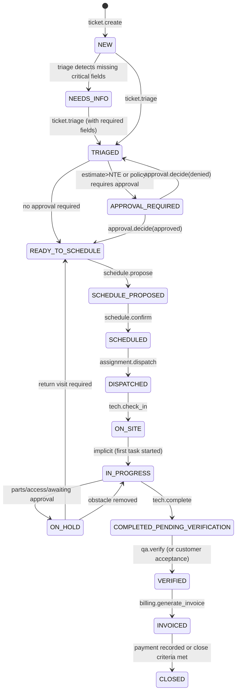

# Workflows and State Machine (Canonical Lifecycle + Edge Cases)

## 1) Canonical ticket/work order states

**Primary state machine (v0)**

### State meanings
- **NEW**: created but not triaged
- **NEEDS_INFO**: missing essential info (address, contact, access window, symptom clarity)
- **TRIAGED**: classified (incident type, priority, risk flags, SLA timers)
- **APPROVAL_REQUIRED**: change control required before scheduling (NTE/quote thresholds)
- **READY_TO_SCHEDULE**: cleared for appointment
- **SCHEDULE_PROPOSED**: 1–3 options proposed; awaiting confirmation
- **SCHEDULED**: appointment locked
- **DISPATCHED**: tech assigned + job packet sent
- **ON_SITE / IN_PROGRESS**: work underway
- **ON_HOLD**: blocked (parts, access, safety, approval)
- **COMPLETED_PENDING_VERIFICATION**: tech says done; evidence package submitted
- **VERIFIED**: QA/customer acceptance complete
- **INVOICED**: invoice generated and posted
- **CLOSED**: final closure

---

## 2) v0 deterministic rules (must)

### Priority classification (triage)
- Emergency if:
  - cannot secure premises, break-in risk
  - egress/ADA hazard
  - door prevents business operation (main entry stuck closed) *and* no alternate entrance
- Urgent if:
  - safety risk but mitigated (temporary closure, alternate route)
  - partial function degradation
- Routine otherwise

### Evidence requirements by incident type (examples)
- **Misalignment / won’t latch**:
  - before photo (door edge + strike)
  - after photo (latching)
  - note: hinge/strike adjustments
- **Closer leaking / slamming**:
  - before photo (closer body)
  - after photo (replacement/adjustment)
  - note: sweep/latch speed settings
- **Auto operator fault**:
  - before photo (operator label, sensors)
  - after photo
  - basic tests logged (cycles, sensor response)

> Evidence requirements live in `incident_type_templates` so they are versioned and testable.

### NTE and change control
- Every ticket has an NTE (even if 0 for “quote required”).
- Any expected cost > NTE triggers `APPROVAL_REQUIRED`.
- Tech may request NTE increase only via `tech.request_change`, which creates an Approval.

---

## 3) Edge case playbooks (SOP anchors)

### A) No access / no contact on site
- Tech attempts contact (call/SMS) at least X times
- If unsuccessful:
  - attach attempt log
  - transition to ON_HOLD with reason `ACCESS_FAILURE`
  - dispatch agent triggers escalation chain (site contact → regional → emergency contact)
  - reschedule automatically if customer confirms

### B) Parts required / return visit
- Tech documents required part(s), photos/measurements
- transition to ON_HOLD with reason `PARTS_ORDERED`
- system creates follow-up task + optional new linked ticket for return visit
- SLA timers pause or adjust per contract terms

### C) Multi-tech jobs
- ticket supports multiple assignments
- completion requires all assignments check-out
- QA can verify per assignment or as whole

### D) Customer reschedule
- reschedule is a first-class command with audit
- SLA timers may reset or track both “customer delay” vs “provider delay”

### E) Emergency dispatch (bypass scheduling proposal)
- Allows direct DISPATCHED from TRIAGED when emergency
- Requires explicit audit reason + on-call manager confirmation (configurable)

---

## 4) “Fail closed” policy (non-negotiable)
- Invalid transitions are rejected with a clear error
- Completion cannot proceed without required evidence for that incident type
- Tool calls without allowlist permission are rejected
- Any mutation without idempotency key is rejected (or auto-generated only by trusted gateway)

