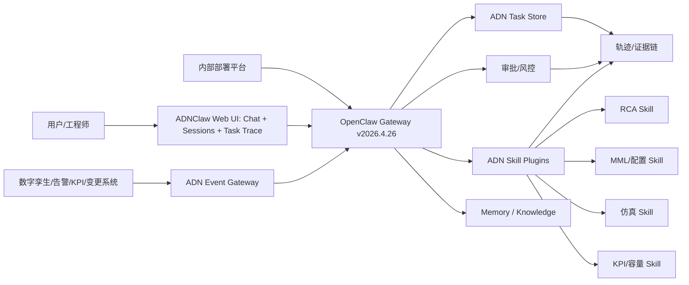
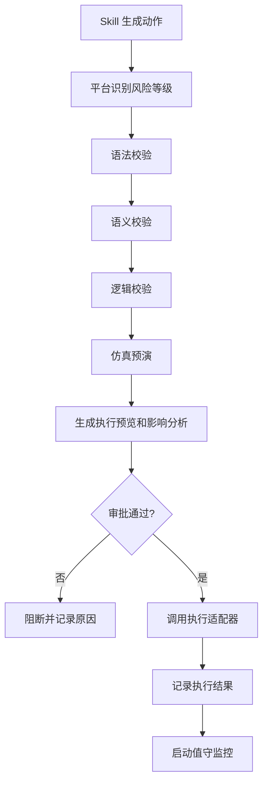

# NOEMate 2.0 / ADNClaw 需求分析设计说明书

## 1. 背景与目标

OpenClaw 是通用智能体框架，当前业务目标是基于 OpenClaw 打造电信 ADN 场景智能体平台 ADNClaw。团队已基于 `v2026.3.23-2` 完成第一稿内部适配，主要包括：

| 已实现改造 | 当前目的 | 本次升级后的处理策略 |
| --- | --- | --- |
| 对接内部部署系统，支持虚机、容器化部署，支持配置 WebSocket 地址 | 快速接入公司部署平台 | 迁移到 `v2026.4.26` 后，优先复用 Gateway 现有远程 URL、Docker、K8s、服务化能力，再补公司部署系统适配层 |
| 统一 LOGO、品牌名，简化 UI，只保留对话和 session 管理，屏蔽其他菜单 | 形成 ADNClaw 产品形态，降低用户认知成本 | 不建议删除 OpenClaw 功能代码，应通过白标配置、产品模式、菜单权限开关实现 |
| 修复 OpenClaw 不能流式实时打印的问题 | 满足对话实时反馈 | `v2026.4.26` 已有 WebChat、移动端、Gateway event stream、tool stream 等能力，需要复测确认原问题是否已消失，再决定是否保留补丁 |

本次分析输入包括：

| 输入 | 说明 |
| --- | --- |
| 产品诉求文件 | `C:\Users\xubao\Desktop\NOEMate2.0需求分析\NOEMate产品诉求.xlsx` |
| 目标开源版本 | OpenClaw `v2026.4.26` |
| 团队定位 | 平台部门，仅提供框架平台能力 |
| 不纳入平台直接实现范围 | RCA 算法、MML 生成规则、容量预测模型、数字孪生仿真算法、网络业务知识库内容等领域 Skill |

本说明书目标是把产品诉求拆解成可执行需求，明确哪些来自用户诉求，哪些是升级和平台化必做项，哪些能力 OpenClaw 已具备，哪些需要 ADNClaw 新增。

## 2. 分析原则

| 原则 | 说明 |
| --- | --- |
| 平台能力优先 | 平台承接通用能力：部署、接入、编排、状态、审计、权限、UI 容器、插件规范、事件总线、证据结构 |
| 领域能力插件化 | 故障定位、容量预测、配置生成、仿真预演、业务影响分析等必须由产品侧 Skill 或外部系统实现 |
| 复用 OpenClaw 能力 | `v2026.4.26` 已经具备 Gateway、Session、Cron、Plugin SDK、Memory、Control UI、Docker/K8s 等能力，应尽量配置化复用 |
| 安全闭环优先 | 涉及 MML 下发、流量切换、配置变更的动作必须有审批、校验、审计、可回放 |
| 任务态独立于对话态 | 对话 session 负责交互历史，ADN 任务负责长流程状态、阶段、证据、审批、断点恢复 |
| 结果可解释 | 平台统一定义信心度、证据链、轨迹、来源、时间戳和风险提示结构，领域 Skill 负责填充 |

## 3. OpenClaw v2026.4.26 能力基线

### 3.1 可复用能力清单

| 能力域 | `v2026.4.26` 已具备能力 | 对 ADNClaw 的价值 | 证据位置 |
| --- | --- | --- | --- |
| Gateway 接入 | 单一 Gateway 端口承载 WebSocket RPC、OpenAI 兼容 HTTP、Control UI、hooks | 可作为内部部署系统对接、Web 前端、第三方系统调用的统一入口 | `docs/gateway/index.md:74` |
| HTTP 兼容接口 | `/v1/models`、`/v1/embeddings`、`/v1/chat/completions`、`/v1/responses`、`/tools/invoke` | 便于内部平台、RAG、模型网关或第三方客户端快速接入 | `docs/gateway/index.md:76` |
| 远程 Gateway 配置 | `gateway.remote.url`、`gateway.remote.token/password`、`OPENCLAW_GATEWAY_URL` 等 | 可承接你们已有的 WebSocket 地址配置诉求 | `docs/gateway/remote.md` |
| 安全访问 | `gateway.bind`、`gateway.auth.*`、`gateway.controlUi.allowedOrigins`、trusted proxy | 内部部署到非本机环境时必须配置来源白名单和认证 | `docs/gateway/index.md:121` |
| 容器化 | Docker Compose、Dockerfile、健康检查、环境变量、持久化目录 | 可作为公司容器化部署基线 | `docker-compose.yml` |
| K8s | Kustomize manifests、Deployment、Service、PVC、ConfigMap、Secret | 可作为公司容器平台适配参考 | `docs/install/kubernetes.md` |
| Session 管理 | `sessions.list`、`sessions.create`、`sessions.send`、`sessions.messages.subscribe`、`sessions.compact` | 可作为对话历史、会话列表、实时消息订阅基础 | `src/gateway/server-methods-list.ts:86` |
| WebChat | `chat.send`、`chat.history`、`chat.abort`，并通过 Gateway 事件刷新历史和流式状态 | 可直接支撑 ADNClaw 只保留对话和 session 管理的主界面 | `src/gateway/server-methods-list.ts` |
| 流式状态 | UI 维护 `chatStream`、tool stream、Gateway event 订阅和 terminal event 处理 | 可用于实时打印、工具进度、长任务反馈 | `ui/src/ui/app-tool-stream.ts` |
| Cron 调度 | `cron.add/list/status/update/remove/run/runs`，支持定时、立即执行、运行历史和投递 | 可支撑晨报、值守、周期评估、主动推送 | `docs/gateway/protocol.md:392` |
| 插件 SDK | 支持 `registerTool`、`registerGatewayMethod`、`registerHttpRoute`、`registerMemoryCorpusSupplement`、语音/转写能力 | 可定义 ADN 领域 Skill 插件规范和内部系统适配插件 | `docs/plugins/sdk-overview.md:94` |
| Hook 治理 | `before_tool_call`、`before_agent_finalize`、`message_received`、`message_sending`、`gateway_start` | 可实现审批、参数改写、结果复核、审计埋点、生命周期服务 | `docs/plugins/hooks.md:78` |
| Memory/Knowledge | `memory_search`、session memory、memory-wiki、structured claims/evidence 概念 | 可支撑知识库更新、用户偏好、历史处置轨迹检索 | `docs/concepts/memory.md:35` |
| 审批 | exec approval 和 plugin approval RPC | 可复用为高风险 MML/配置/流量切换动作审批底座 | `src/gateway/server-methods-list.ts` |
| 日志诊断 | logs、doctor、diagnostics、status、usage | 可支撑平台运维、部署验收、问题排查 | `src/gateway/server-methods-list.ts` |

### 3.2 当前不能直接满足的关键差距

| 差距 | 说明 | 处理建议 |
| --- | --- | --- |
| 缺 ADN 任务模型 | OpenClaw 的 session/run 偏通用对话，不表达“故障自恢复任务”“变更闭环任务”的业务阶段 | 新增 ADN Task 状态模型，绑定 session/run |
| 缺 ADN 证据结构 | OpenClaw 有工具结果和 Memory，但没有电信决策证据链、置信度、影响范围、审批结论的统一 schema | 新增 ADN Evidence/Decision schema |
| 缺领域事件接入规范 | 产品诉求包含数字孪生 AMF 过载、KPI 订阅、变更事件，OpenClaw 没有电信事件标准 | 新增 Event Ingestion API 和事件类型规范 |
| 缺高风险执行编排 | OpenClaw 有审批，但没有 MML 下发、语法/语义/逻辑核查、仿真预演的标准编排 | 新增高风险执行协议，产品 Skill 实现具体校验和执行 |
| 缺决策轨迹视图 | OpenClaw 有 tool stream 和 session 历史，但不是面向故障逃生全过程的轨迹视图 | 在 ADNClaw UI 中增加任务轨迹/证据链卡片 |
| 缺内部部署平台封装 | OpenClaw 有 Docker/K8s/systemd，但不理解公司部署系统的参数模型、健康检查、发布流程 | 新增部署适配模板和启动参数转换层 |
| 缺产品模式配置 | OpenClaw Control UI 功能很多，当前产品要求只暴露对话和 session | 新增 ADNClaw product mode，隐藏菜单但保留底层 API |

## 4. 原始产品诉求拆解

产品表格共整理出 19 条需求项，分为“智能交互、故障自恢复、动网自闭换、自演进”四大类。平台侧拆解如下。

### 4.1 智能交互

| 产品诉求 | 产品场景 | 平台应承接 | 产品 Skill 应承接 | OpenClaw 已具备 | ADNClaw 新增 |
| --- | --- | --- | --- | --- | --- |
| 自然语义意图理解 | 查数问数、故障处置意图、动网变更意图 | 对话入口、模型路由、Skill 分发、意图结果统一结构 | 具体意图分类、槽位抽取、业务语义解析 | chat/session、插件工具、模型路由 | ADN Intent Router 规范、场景路由配置 |
| 主动推送与摘要生成 | 晨报、故障卡片、值守结果 | 定时/事件触发、推送投递、失败重试、消息模板 | 摘要内容生成、故障卡片字段、值守结论 | Cron、message delivery、Gateway events | ADN 推送模板和订阅配置 |
| 多轮对话与上下文追问 | 追问“变更后网络是否稳定” | Session 上下文、任务上下文、追问绑定任务 | 判断追问属于哪个业务对象和指标 | sessions、chat.history、memory | Task-aware follow-up 绑定 |
| 个性化偏好学习 | 记录用户表述习惯 | 用户偏好存储、隐私开关、可清理和可导出 | 从交互中抽取偏好规则 | Memory、profile config | 用户画像 schema 和治理流程 |
| 长流程状态追踪与断点续传 | 任务级状态管理，断点续传 | 任务状态机、checkpoint、恢复入口、session/run 关联 | 领域阶段推进逻辑 | sessions、compaction、cron run history | ADN Task Store 和恢复协议 |
| 信心度评估与可解释机制 | 信心度评分、证据链、追问决策依据 | 统一 confidence/evidence schema、UI 展示、审计 | 领域评分算法、证据来源解释 | tool result、memory citations、trace | ADN Evidence/Decision envelope |

### 4.2 故障自恢复

| 产品诉求 | 产品场景 | 平台应承接 | 产品 Skill 应承接 | OpenClaw 已具备 | ADNClaw 新增 |
| --- | --- | --- | --- | --- | --- |
| 事件感知与上报 | 数字孪生感知 AMF 过载事件 | 事件接入 API、事件标准化、触发任务 | AMF 事件识别、数字孪生适配 | HTTP route、Gateway method、plugin service | ADN Event Gateway |
| 根因分析 | RCA Skill 定位故障根因 | Tool 调用、输入输出规范、证据留存 | RCA 算法、规则库、模型提示词 | registerTool、tool events | RCA Skill contract |
| 恢复决策与执行 | 冗余判断后流量切换，下发 MML | 审批、执行前校验、执行记录、回滚提示 | 具体冗余判断、MML 指令、网元执行 | plugin approval、before_tool_call | 高风险执行编排 |
| 决策轨迹可视化 | 查看自主逃生全过程回放 | 任务轨迹、阶段时间线、工具调用、证据和审批展示 | 提供领域阶段和结论 | session/tool stream | ADN Trace View |
| 业务影响分析 | 设备、网络、社会影响 | 影响分析结果 schema、展示和归档 | 影响评估算法、指标查询 | tool output、markdown/table rendering | Impact result schema |
| 容量评估与预测 | 整网容量风险评估和预测 | 周期调度、结果存档、阈值告警、趋势展示入口 | 容量模型、KPI 查询、预测算法 | Cron、Memory、charts 可由 UI 承载 | Capacity job contract |

### 4.3 动网自闭换

| 产品诉求 | 产品场景 | 平台应承接 | 产品 Skill 应承接 | OpenClaw 已具备 | ADNClaw 新增 |
| --- | --- | --- | --- | --- | --- |
| 配置自动生成 | 根据专线开通意图生成 MML 脚本 | 生成结果结构、版本记录、审批前预览 | MML 生成规则、业务参数校验 | registerTool、session persistence | Config artifact schema |
| 多级核查验证 | 语法、语义、逻辑三层核查 | 编排三层校验、汇总校验报告、阻断策略 | 每层校验算法和规则库 | before_tool_call、tool middleware | Validation pipeline |
| 仿真预演 | 数字孪生虚拟环境试运行配置 | 仿真任务编排、结果采集、失败阻断 | 仿真系统适配、结果判读 | plugin HTTP route/Gateway method | Simulation adapter contract |
| 值守监控 | 变更后自动订阅 KPI 持续监测 | 订阅任务、周期采集、阈值触发、消息推送 | KPI 查询、稳定性判定 | Cron、wake、session | Watch subscription model |

### 4.4 自演进

| 产品诉求 | 产品场景 | 平台应承接 | 产品 Skill 应承接 | OpenClaw 已具备 | ADNClaw 新增 |
| --- | --- | --- | --- | --- | --- |
| 轨迹特征提取 | 日终提取全天故障处置轨迹特征 | 定时扫描任务、轨迹数据导出、候选特征存储 | 特征抽取算法、分类标签 | Cron、session history、Memory | Trajectory feature job |
| 知识库更新 | 新故障模式加入诊断知识库 | 候选知识、证据绑定、人工审核、版本管理 | 知识内容、故障模式结构 | memory_search、memory-wiki | Knowledge governance workflow |
| 用户画像构建 | 记录交互偏好，优化意图理解 | 用户偏好 schema、权限、清理、导出 | 偏好抽取与应用策略 | Memory、config | User profile governance |

## 5. 平台需求清单

### 5.1 P0 基线升级与产品化

| 编号 | 需求名称 | 来源 | 具体内容 | OpenClaw 现有能力 | 新增实现 | 验收标准 |
| --- | --- | --- | --- | --- | --- | --- |
| P0-01 | 升级到 `v2026.4.26` 并迁移历史改造 | 升级必做 | 以 `v2026.4.26` 为基线重放已有部署、品牌、UI、流式修改；记录冲突和已被上游吸收的补丁 | Git tag、Gateway、Control UI、Docker/K8s | 建立 ADNClaw upgrade branch 和差异清单 | 启动成功；WebChat 可用；已有部署路径通过；无重复补丁 |
| P0-02 | 内部部署平台适配 | 已有改造延续 | 支持虚机、容器、WebSocket URL、token/password、端口、bind、allowed origins、健康检查、日志路径 | Docker Compose、K8s、gateway.remote、healthz | 生成公司部署模板和启动参数映射 | 内部平台可一键部署，健康检查返回成功 |
| P0-03 | ADNClaw 白标配置 | 已有改造延续 | LOGO、产品名、favicon、页面 title、默认 assistant 名称统一替换 | Control UI 静态资源和 assistant identity | `branding` 配置或构建时变量 | Web UI、登录/错误/空状态均显示 ADNClaw 品牌 |
| P0-04 | UI 产品模式 | 已有改造延续 | 只开放 Chat 和 Sessions；隐藏 Agents、Channels、Cron、Logs、Config 等菜单；管理员可通过配置恢复 | Control UI tabs、navigation | `ui.productMode=adnclaw` 或菜单 allowlist | 普通用户只看到对话和会话管理；API 不受影响 |
| P0-05 | WebChat 实时输出验收 | 已有 bug 修复延续 | 验证文本 delta、工具调用进度、最终消息落库、断线重连后的状态一致性 | chat events、tool stream、session.message | 如存在回归，再补 Web UI/Gateway stream 修复 | 首 token/首 chunk 可见；工具进度可见；最终消息不重复 |

### 5.2 P1 ADN 平台协议与编排

| 编号 | 需求名称 | 来源 | 具体内容 | OpenClaw 现有能力 | 新增实现 | 验收标准 |
| --- | --- | --- | --- | --- | --- | --- |
| P1-01 | ADN Skill 插件规范 | 产品全量诉求拆解 | 定义 Skill 类型、输入输出 schema、风险等级、审批策略、证据结构、场景标签 | Plugin SDK、registerTool、registerGatewayMethod | `adn.skill.json` 或 manifest 扩展规范 | 产品 Skill 可按规范注册和被 UI/agent 发现 |
| P1-02 | ADN 意图路由 | 自然语义意图理解 | 将用户输入路由到查数问数、故障处置、变更、闲聊等场景 | 模型路由、tools.effective、commands | Intent Router 插件和路由配置 | 同一入口可识别场景并触发正确 Skill |
| P1-03 | ADN Task 状态模型 | 长流程、多轮、故障恢复、变更闭环 | 定义 taskId、type、stage、status、sessionKey、runId、evidence、approval、checkpoint、resumePolicy | sessions、cron run history | Task Store、Task Gateway methods | 刷新页面或 Gateway 重启后可恢复任务视图 |
| P1-04 | 事件接入 API | 事件感知与上报 | 接收数字孪生、告警、KPI、变更事件，标准化为 ADN Event | registerHttpRoute、registerGatewayMethod | `/adn/events`、事件 schema、鉴权 | AMF 过载事件可触发故障处置任务 |
| P1-05 | 主动推送与摘要 | 晨报、故障卡片、值守结果 | 支持定时/事件触发，生成摘要，投递到 Web/session/外部渠道 | Cron、wake、send | ADN notification templates | 晨报和值守结果自动生成并可追踪投递状态 |
| P1-06 | Task-aware 多轮追问 | 多轮上下文追问 | 追问绑定当前任务对象、阶段和证据，不丢失业务上下文 | chat.history、sessionKey | task context injection | 用户追问“变更后是否稳定”能定位到最近变更任务 |

### 5.3 P2 高风险闭环与可解释

| 编号 | 需求名称 | 来源 | 具体内容 | OpenClaw 现有能力 | 新增实现 | 验收标准 |
| --- | --- | --- | --- | --- | --- | --- |
| P2-01 | 高风险执行审批 | 恢复决策、MML 下发、配置变更 | 对 MML、流量切换、配置下发等动作强制审批，包含参数、影响、校验、审批人、超时策略 | plugin approval、before_tool_call | ADN Risk Action policy | 未审批不能执行高风险动作；审批记录可回放 |
| P2-02 | 配置生成产物管理 | 配置自动生成 | 将生成的 MML/配置作为 artifact，保留版本、输入参数、生成模型、关联任务 | session persistence、tool output | ConfigArtifact schema | UI 可查看、复制、审批前预览配置 |
| P2-03 | 多级核查验证编排 | 语法、语义、逻辑三层核查 | 平台编排三层校验，统一汇总报告，失败时阻断执行 | Tool pipeline、hooks | Validation pipeline | 三层校验均通过才允许进入审批/仿真 |
| P2-04 | 仿真预演编排 | 数字孪生试运行 | 调用仿真系统，采集结果，写入证据链，决定是否允许执行 | HTTP route、tool call | Simulation adapter contract | 仿真失败时自动阻断执行 |
| P2-05 | 决策证据与信心度 | 信心度评分和证据链 | 统一 `confidence`、`evidence[]`、`decision`、`risk`、`source`、`timestamp` | memory citations、tool details | ADN Decision envelope | 用户可追问任一结论依据 |
| P2-06 | 决策轨迹可视化 | 自主逃生全过程回放 | 展示事件、RCA、影响、方案、校验、仿真、审批、执行、监控全过程 | session/tool stream | ADN Trace View | 工程师可按时间线回放完整过程 |
| P2-07 | 值守监控订阅 | 变更后 KPI 持续监测 | 配置监控周期、指标、阈值、结束条件和异常推送 | Cron、sessions | WatchSubscription model | 变更后自动订阅 KPI，异常产生卡片 |

### 5.4 P3 自演进与知识治理

| 编号 | 需求名称 | 来源 | 具体内容 | OpenClaw 现有能力 | 新增实现 | 验收标准 |
| --- | --- | --- | --- | --- | --- | --- |
| P3-01 | 轨迹特征提取 | 日终提取处置轨迹 | 按天扫描任务轨迹，抽取候选特征，入候选区 | Cron、session history | TrajectoryFeature job | 日终生成特征报告并可人工确认 |
| P3-02 | 知识库更新工作流 | 新故障模式入库 | 候选知识生成、证据绑定、审核、发布、回滚 | Memory、memory-wiki | Knowledge governance | 未审核知识不会进入正式诊断知识库 |
| P3-03 | 用户画像构建 | 记录交互偏好 | 记录用户表达习惯、常用场景、默认展示偏好，支持关闭、清理、导出 | Memory、config | UserProfile schema | 用户可查看和清理画像数据 |
| P3-04 | 平台可观测性 | 运营和运维诉求 | 记录任务、Skill、事件、审批、执行、投递、错误的指标和日志 | logs、status、diagnostics | ADN operational dashboard/export | 问题可按 taskId/runId/skillId 追踪 |

## 6. 关键设计方案

### 6.1 总体架构



### 6.2 ADN Task 状态模型

任务模型用于表达长流程业务状态，不能只依赖 OpenClaw session。

```typescript
type AdnTask = {
  taskId: string;
  type: "intent" | "fault_recovery" | "network_change" | "watch" | "evolution";
  title: string;
  status: "created" | "running" | "waiting_approval" | "blocked" | "completed" | "failed" | "cancelled";
  stage:
    | "intent"
    | "event_received"
    | "analysis"
    | "decision"
    | "validation"
    | "simulation"
    | "approval"
    | "execution"
    | "watch"
    | "summary";
  sessionKey: string;
  runId?: string;
  sourceEventId?: string;
  owner?: string;
  createdAt: string;
  updatedAt: string;
  checkpoints: AdnTaskCheckpoint[];
  evidence: AdnEvidence[];
  approvals: AdnApprovalRecord[];
  artifacts: AdnArtifact[];
};
```

平台要提供：

| 方法 | 用途 |
| --- | --- |
| `adn.task.create` | 创建 ADN 任务并绑定 session |
| `adn.task.get` | 查询任务详情 |
| `adn.task.list` | 按用户、场景、状态、时间查询任务 |
| `adn.task.patch` | 更新阶段、状态、证据、artifact |
| `adn.task.resume` | 从 checkpoint 恢复 |
| `adn.task.events.subscribe` | UI 订阅任务状态变化 |

### 6.3 ADN Evidence / Decision 结构

```typescript
type AdnDecision = {
  decisionId: string;
  taskId: string;
  title: string;
  summary: string;
  confidence: {
    score: number;
    level: "low" | "medium" | "high";
    rationale: string;
  };
  evidence: AdnEvidence[];
  risks: Array<{
    level: "info" | "warning" | "critical";
    description: string;
    mitigation?: string;
  }>;
  recommendedActions: AdnAction[];
};

type AdnEvidence = {
  evidenceId: string;
  type: "metric" | "log" | "alarm" | "topology" | "simulation" | "knowledge" | "tool_result" | "manual";
  title: string;
  content: string;
  source: string;
  sourceRef?: string;
  collectedAt: string;
  confidence?: number;
};
```

说明：

| 字段 | 平台责任 | 产品 Skill 责任 |
| --- | --- | --- |
| `confidence.score` | 校验范围、展示、排序、审计 | 计算分数和原因 |
| `evidence[]` | 存储、展示、引用、脱敏 | 提供证据内容和来源 |
| `recommendedActions[]` | 风险等级、审批策略、执行状态 | 具体动作参数和业务解释 |

### 6.4 高风险执行协议

高风险动作包括但不限于：

| 动作 | 风险 | 平台处理 |
| --- | --- | --- |
| MML 命令下发 | 可能改变现网配置 | 必须语法/语义/逻辑校验、仿真、审批 |
| 流量切换 | 可能影响业务 | 必须影响分析、回滚方案、审批 |
| 配置变更 | 可能引入网络故障 | 必须配置 diff、校验、审批 |
| 知识库正式发布 | 可能影响后续诊断 | 必须人工审核和版本记录 |

平台执行流程：



### 6.5 UI 简化方案

ADNClaw UI 不建议 fork 后删除 Control UI 功能，而是增加产品模式：

| 用户类型 | 默认可见页面 | 说明 |
| --- | --- | --- |
| 普通工程师 | Chat、Sessions、Task Trace | 满足产品“只保留对话和 session 管理”的主诉求 |
| 平台管理员 | Chat、Sessions、Config、Logs、Cron、Agents、Channels、Diagnostics | 通过配置或权限打开 |
| 产品 Skill 开发者 | Chat、Sessions、Skill Debug、Task Trace、Logs | 便于调试领域 Skill |

建议配置：

```json
{
  "ui": {
    "productMode": "adnclaw",
    "visibleTabs": ["chat", "sessions"],
    "adminVisibleTabs": ["chat", "sessions", "config", "logs", "cron", "agents"]
  },
  "branding": {
    "productName": "ADNClaw",
    "logo": "adnclaw-logo.svg",
    "assistantName": "NOEMate"
  }
}
```

### 6.6 内部部署适配方案

平台要把公司部署系统参数映射到 OpenClaw 参数：

| 公司部署参数 | OpenClaw/ADNClaw 参数 | 说明 |
| --- | --- | --- |
| WebSocket 地址 | `gateway.remote.url` 或前端 `gatewayUrl` | UI 客户端连接 Gateway |
| 网关端口 | `OPENCLAW_GATEWAY_PORT` / `gateway.port` | 默认 18789 |
| 绑定范围 | `gateway.bind` | 虚机可 `lan/custom`，本机默认 `loopback` |
| 浏览器来源 | `gateway.controlUi.allowedOrigins` | 非本机访问必须配置 |
| 认证 token | `gateway.auth.token` / `OPENCLAW_GATEWAY_TOKEN` | 保护 Gateway |
| 容器持久化目录 | `OPENCLAW_CONFIG_DIR` / volume | 存储配置、session、memory |
| 健康检查 | `/healthz` | 部署平台存活探针 |
| 日志路径 | stdout 或 OpenClaw logs | 汇聚到公司日志平台 |

## 7. 迭代路线图

| 迭代 | 目标 | 主要需求 | 产出 | 进入条件 | 完成标准 |
| --- | --- | --- | --- | --- | --- |
| M0 升级评估 | 升级到 `v2026.4.26` 并确认差异 | P0-01、P0-05 | 升级分支、差异清单、流式复测报告 | 当前一稿补丁可定位 | ADNClaw 可启动，可对话，流式可用 |
| M1 平台壳和部署 | 形成可部署、可演示的 ADNClaw 基线 | P0-02、P0-03、P0-04 | 部署模板、白标 UI、菜单裁剪 | M0 通过 | 内部虚机/容器平台均可部署 |
| M2 Skill 接入和任务编排 | 产品 Skill 可接入并形成长流程任务 | P1-01 至 P1-06 | Skill 规范、Task Store、Event API | M1 通过，产品提供首批 Skill demo | 故障事件可触发任务，任务可恢复 |
| M3 风险闭环和可解释 | 支持故障恢复和动网变更闭环 | P2-01 至 P2-07 | 审批、校验、仿真、证据链、轨迹 UI | M2 通过，产品提供 RCA/MML/仿真适配 | 未审批不能下发，高风险动作全链路可回放 |
| M4 自演进治理 | 支持知识沉淀和画像优化 | P3-01 至 P3-04 | 知识审核、画像治理、运营看板 | M3 产生真实轨迹数据 | 候选知识可审核入库，用户可管理画像 |

## 8. 验收用例建议

| 用例编号 | 场景 | 前置条件 | 操作 | 预期结果 |
| --- | --- | --- | --- | --- |
| AT-01 | WebSocket 地址配置 | 部署平台下发 Gateway URL | 打开 ADNClaw Web UI | UI 能连接指定 Gateway 并完成认证 |
| AT-02 | 实时打印 | 模型返回流式文本 | 发送长问题 | 页面显示增量回复，最终消息只落库一次 |
| AT-03 | UI 简化 | `ui.productMode=adnclaw` | 普通用户登录 | 只显示 Chat 和 Sessions |
| AT-04 | Session 切换 | 已有多个会话 | 切换历史 session | 正确加载历史消息和 assistant identity |
| AT-05 | 故障事件触发 | 模拟 AMF 过载事件 | 调用 ADN Event API | 自动创建故障自恢复任务并进入 RCA 阶段 |
| AT-06 | 多轮追问 | 已有变更任务 | 用户问“变更后网络是否稳定” | 系统识别追问绑定到最近变更任务 |
| AT-07 | MML 高风险审批 | Skill 生成 MML | 尝试执行 | 未审批前阻断；审批后执行适配器被调用 |
| AT-08 | 三层校验 | Skill 输出配置 | 运行校验 | 语法/语义/逻辑结果均记录，失败阻断 |
| AT-09 | 仿真失败阻断 | 仿真系统返回失败 | 继续执行 | 平台阻断执行并展示仿真证据 |
| AT-10 | 值守监控 | 变更任务完成 | 订阅 KPI | 周期执行并在异常时推送卡片 |
| AT-11 | 断点续传 | 长流程任务运行中 | 重启 Gateway/刷新页面 | 任务状态和轨迹可恢复 |
| AT-12 | 知识入库审核 | 日终生成候选知识 | 审核通过 | 知识进入正式库，带证据和版本 |

## 9. 风险与依赖

| 风险 | 影响 | 缓解措施 |
| --- | --- | --- |
| 产品 Skill 未提供稳定 schema | 平台无法统一编排和展示 | 先冻结 ADN Skill 输入输出协议，再允许 Skill 接入 |
| 直接删除 OpenClaw UI 功能导致升级困难 | 后续 tag 升级冲突巨大 | 使用产品模式和菜单 allowlist |
| 高风险动作没有强审批 | 可能造成现网风险 | 所有 MML/配置/流量动作默认 require approval |
| 证据链由模型自由生成 | 解释不可审计 | 证据必须来自工具结果、事件、KPI、知识库或人工输入 |
| 用户画像涉及隐私合规 | 合规风险 | 提供开关、可清理、可导出、用途说明 |
| 内部部署环境与 OpenClaw 默认安全模型冲突 | Web UI 连接失败或存在暴露风险 | 统一配置 `gateway.bind`、auth、allowed origins、TLS/代理策略 |
| `v2026.4.26` 流式行为与一稿补丁冲突 | 重复消息或状态错乱 | 先做流式验收，再决定是否迁移旧补丁 |

## 10. 结论

本次产品诉求可以拆成三类：

| 类别 | 代表诉求 | 处理方式 |
| --- | --- | --- |
| OpenClaw 已具备，ADNClaw 复用配置即可 | Gateway、WebSocket、Session、Cron、Plugin SDK、Memory、Docker/K8s、审批基础 | 通过配置、适配、验收复用 |
| 平台必须新增 | ADN Task、Evidence/Decision schema、Event Gateway、产品模式、Skill 规范、高风险执行编排、轨迹视图 | 纳入 ADNClaw 平台迭代 |
| 产品 Skill 负责 | RCA、MML 生成、容量预测、影响分析、数字孪生仿真、知识内容 | 平台只定义协议和运行环境 |

推荐的实施主线是：

1. 先完成 `v2026.4.26` 升级和已有三项改造迁移。
2. 再做部署适配、白标、UI 产品模式，形成可演示 ADNClaw。
3. 同步冻结 ADN Skill、Task、Evidence 三个协议。
4. 最后围绕故障自恢复和动网自闭换，补审批、校验、仿真、轨迹和知识治理。

