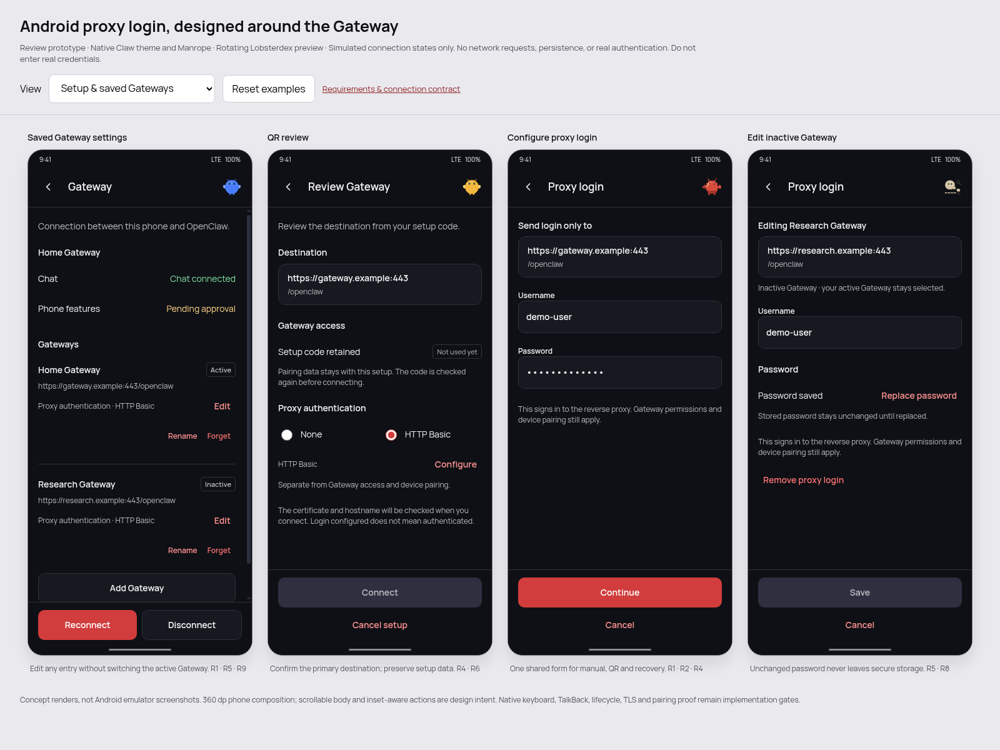
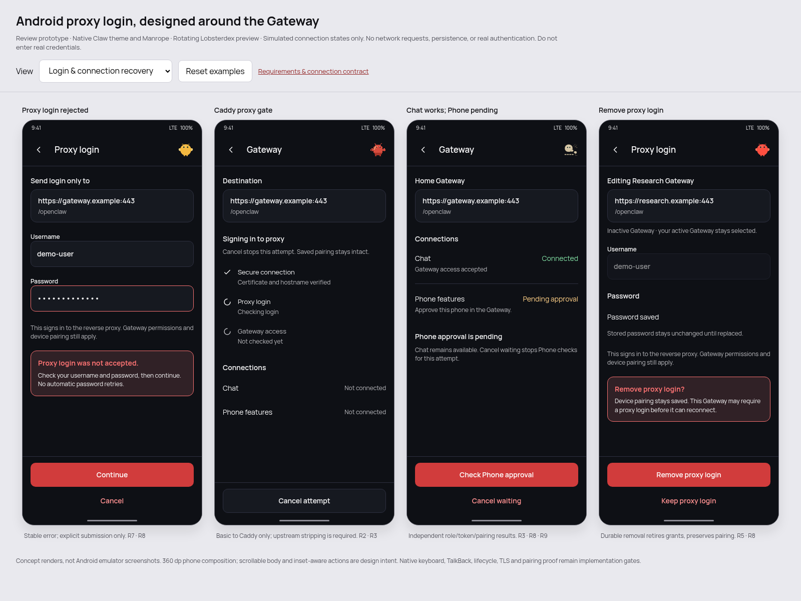
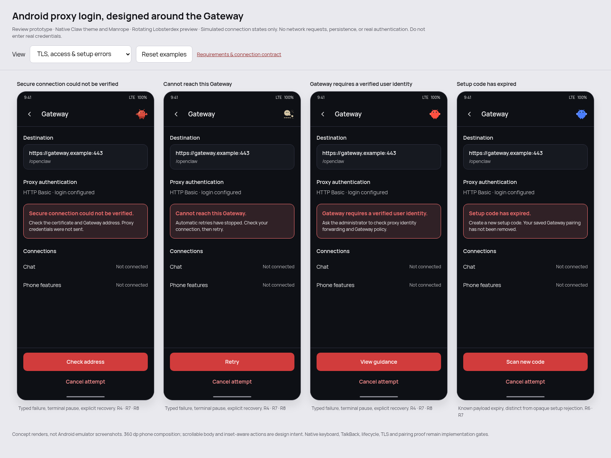
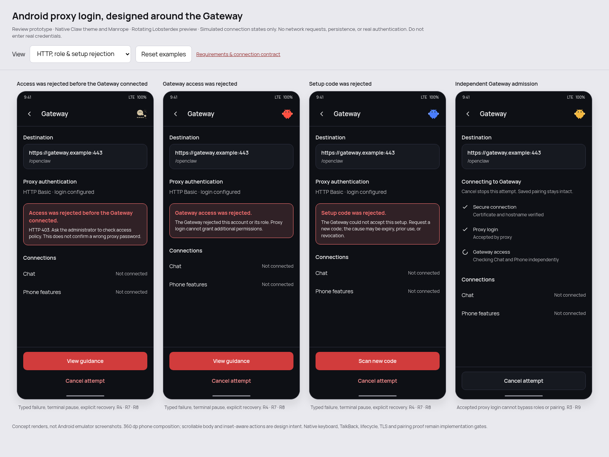
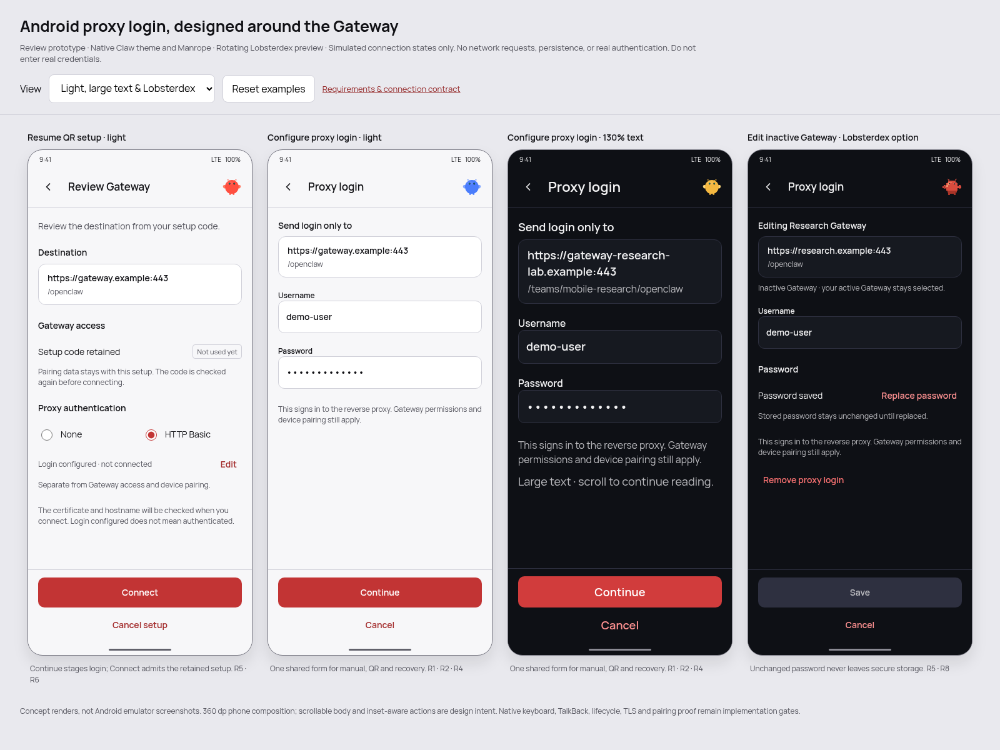
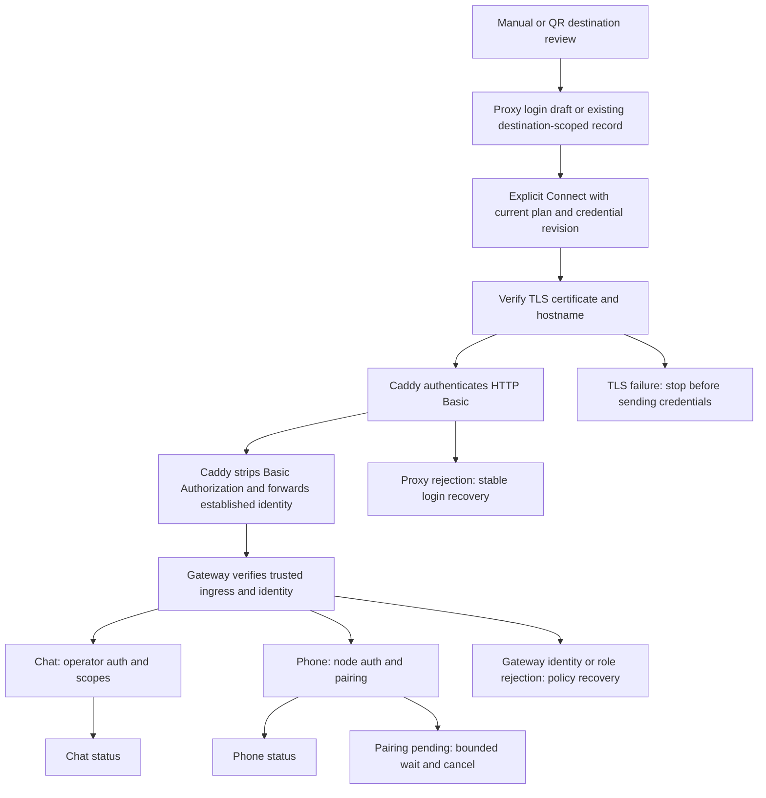

# Android proxy login design

Related: https://github.com/openclaw/openclaw/issues/162240

**Status: proposed design, awaiting approval.** No application code, tests, dependencies,
or live Caddy/Gateway configuration have changed. Source inspection confirms a missing
production UI path for proxy credentials; it does not establish the cause of every
reported failed connection. No upgrade, QR success, or live device behavior is claimed.

## Inspected source and limits

The original checkout was on `main` at `a5f1d0996a1f80a789628af19ec304c08369607b`,
with extensive unrelated changes, including 332 tracked Android paths. It was left
untouched. The isolated draft checkout is based on upstream
[`b3b34beebe082e3452073aab18006bcb5092fb2e`](https://github.com/openclaw/openclaw/commit/b3b34beebe082e3452073aab18006bcb5092fb2e).
Its initial scope-only commit is `e75b94352f7e3d38f09209876d3d7ab60cb1c1e3`.
The 14 Android production modules below were compared byte-for-byte with the original
working tree; all matched. The original HEAD alone is therefore not its source identity.
Server findings below refer to the isolated, pinned base, not the deployed Gateway.

The issue reports Android `2026.8.2-debug` and Gateway `2026.9.7`; the installed APK
commit, Android OS version, Caddy version, and exact request failure remain unknown.
Current-main source contracts cannot establish compatibility with that deployment.

### Source map

Paths in the first table are relative to `app/src/main/java/ai/openclaw/app/`.
Line numbers refer to the inspected base. The linked files remain unchanged in this draft.

| Owner | Source | Current behavior relevant to this design |
| --- | --- | --- |
| Gateway settings | [ui/SettingsScreens.kt](app/src/main/java/ai/openclaw/app/ui/SettingsScreens.kt#L1575), lines 1575–2055 | Saved Gateways have Rename/Forget; setup code and manual connection use the shared resolver. Setup replacement requires confirmation. No proxy credential UI. |
| Initial onboarding | [ui/OnboardingFlow.kt](app/src/main/java/ai/openclaw/app/ui/OnboardingFlow.kt#L650), lines 650–806 | Manual and scanned/pasted code call `saveGatewayConfigAndConnect`, then Recovery. Initial scan does not use the addition dialog's destination-review step. Lines 465–473 use saveable state for existing code/token/password inputs. |
| Add Gateway and QR review | [ui/GatewayAdditionDialog.kt](app/src/main/java/ai/openclaw/app/ui/GatewayAdditionDialog.kt#L137) | Scan/gallery/code/manual converge on Review; nothing is applied until Connect. Input is heap-only and guarded against retired requests. |
| QR parser and connection plan | [ui/GatewayConfigResolver.kt](app/src/main/java/ai/openclaw/app/ui/GatewayConfigResolver.kt#L33), lines 33–69, 164–213, 276–316 | Reads URL/bootstrap/token/password from base64, `oc-pair://`, or JSON `setupCode`. Rejects URL user-info/query/fragment. Plans distinguish preserving auth from replacing endpoint/credentials/setup. Does not retain expiry, alternate URLs, or TLS fingerprint. |
| Configuration admission | [MainViewModel.kt](app/src/main/java/ai/openclaw/app/MainViewModel.kt#L827), lines 827–919 | Adding an already saved target selects it without replacing credentials. Other replacement plans can reset saved role authentication. Proxy-only edits must avoid that reset path. |
| Runtime and role sessions | [NodeRuntime.kt](app/src/main/java/ai/openclaw/app/NodeRuntime.kt#L1600), lines 1600, 2031, 3526, 3653–3738, 5421–5469 | Operator, node, and background operator sessions read custom headers. Existing lifecycle intents, switch mutex, and drain boundaries own replacement/forget. Forget clears custom headers, Gateway credentials, role tokens, and TLS pin. |
| Role and TLS options | [node/ConnectionManager.kt](app/src/main/java/ai/openclaw/app/node/ConnectionManager.kt#L146) | Operator uses `openclaw-android`/`ui` and requested operator scopes; node uses `node` role/mode and no scopes. TLS parameters disallow automatic TOFU. |
| WebSocket, HTTP media, retry | [gateway/GatewaySession.kt](app/src/main/java/ai/openclaw/app/gateway/GatewaySession.kt#L1092), lines 1092–1116, 1298–1317, 1502–1619, 2261–2364, 2683–2705 | TLS upgrade reads sanitized custom headers; HTTP media also consumes them. Explicit ingress authorization can guard current authority and disable redirects. Generic upgrade failures can fall into the reconnect loop. |
| Existing ingress contract | [gateway/GatewayIngressAuthorization.kt](app/src/main/java/ai/openclaw/app/gateway/GatewayIngressAuthorization.kt#L8) | Physical-transaction authorization, synchronous current-authority check, and explicit challenge classification. No production provider supplied by this runtime. |
| Header validation | [gateway/GatewayCustomHeaders.kt](app/src/main/java/ai/openclaw/app/gateway/GatewayCustomHeaders.kt#L9) | Allows `Authorization`; rejects handshake-reserved names and malformed values. It does not establish destination trust or verified user identity. |
| Secure preferences | [SecurePrefs.kt](app/src/main/java/ai/openclaw/app/SecurePrefs.kt#L139), lines 139–155, 469–556, 600–616 | Keystore-backed encrypted preferences separate from plain UI preferences. Custom header save uses asynchronous apply; existing `commitSecureStrings` reports durable failure and restores prior in-memory values. |
| Saved endpoint registry | [gateway/GatewayRegistry.kt](app/src/main/java/ai/openclaw/app/gateway/GatewayRegistry.kt#L22) | Per-Gateway endpoint/TLS/context-path metadata and active/background selection; rename and remove have durable operations. |
| Endpoint and TLS trust | [gateway/GatewayEndpoint.kt](app/src/main/java/ai/openclaw/app/gateway/GatewayEndpoint.kt#L51), [gateway/GatewayTls.kt](app/src/main/java/ai/openclaw/app/gateway/GatewayTls.kt#L278) | Manual stable ID includes host/port/context path but omits TLS. System trust validates hostname; explicit pins/TOFU intentionally bypass hostname matching. A TLS flag is not verified trust. |

Related owners also inspected:

- [GatewaySourcePreviews.kt](app/src/main/java/ai/openclaw/app/gateway/GatewaySourcePreviews.kt#L89): HTTP favicon reads try proxy Authorization and may then replace it with Gateway Bearer credentials. Proxy-mode failures must not trigger this fallback.
- [GatewayDiagnostics.kt](app/src/main/java/ai/openclaw/app/ui/GatewayDiagnostics.kt#L18): labels partly infer categories from strings and export raw status text. New failures need structured safe messages.
- [GATEWAY_AUTH_POLICY.md](GATEWAY_AUTH_POLICY.md): fresh bootstrap, paired role-token precedence, durable two-role handoff, and bounded device-token recovery remain authoritative.
- [AndroidManifest.xml](app/src/main/AndroidManifest.xml#L42), [backup rules](app/src/main/res/xml/backup_rules.xml), and [transfer rules](app/src/main/res/xml/data_extraction_rules.xml): backup is disabled; rules currently exclude the root domain. Verify explicit encrypted shared-preference exclusion for supported transfer behavior before claiming secrets cannot transfer.
- [Gateway auth](../../src/gateway/auth.ts#L217): trusted socket ingress, required headers, user header, and allowlist own proxy identity. [Operator pairing admission](../../src/gateway/server/ws-connection/connect-device-pairing.ts#L111) rejects missing verified identity with role policies. [Scope admission](../../src/gateway/server/ws-connection/connect-admission.ts#L134) owns final scopes.
- [Setup-code generation](../../src/pairing/setup-code.ts#L454) emits expiry and optional fingerprint. [Bootstrap auth](../../src/gateway/server/ws-connection/auth-context.ts#L270) can retain verified proxy identity while selecting bootstrap. [Auth messages](../../src/gateway/server/ws-connection/auth-messages.ts#L15) collapse several setup rejection causes into one error.

### Reverified findings

A search of all Android Kotlin sources found `saveGatewayCustomHeaders` only in
`SecurePrefs` and tests, with no production writer. All three production session
construction paths pass `prefs::loadGatewayCustomHeaders`. `Authorization` is allowed
and attached only in the TLS branch. This supports the UI-gap finding, not a claim
that header injection alone is a complete fix.

History shows custom headers introduced by `5b5a540e345` and ingress lifecycle support
by `4fb9c42bb22`. Reuse that transport contract rather than creating a competing retry
or proxy-session manager. The pinned dependency is OkHttp **5.5.0**. Its defaults allow
redirects; the existing ingress branch explicitly disables them. The generic header
branch does not. Cross-authority stripping of Authorization does not prevent a
same-authority redirect from carrying it to another path. See
[OkHttp defaults](https://github.com/square/okhttp/blob/parent-5.5.0/okhttp/src/commonJvmAndroid/kotlin/okhttp3/OkHttpClient.kt#L558)
and [follow-up behavior](https://github.com/square/okhttp/blob/parent-5.5.0/okhttp/src/commonJvmAndroid/kotlin/okhttp3/internal/http/RetryAndFollowUpInterceptor.kt#L274).

## Requirements and acceptance criteria

| ID | Required outcome |
| --- | --- |
| R1 | One reusable Proxy authentication row: **None / HTTP Basic**, **Configure/Edit**. One reusable credentials screen serves manual, QR/setup-code, saved edit, and reconnect recovery. No arbitrary header editor. |
| R2 | Proxy username/password are a separate credential family. Never populate protocol `auth.token`, `auth.password`, or `auth.bootstrapToken` from them. Send `Authorization: Basic …` to Caddy, not `Proxy-Authorization`/HTTP forward-proxy auth. Caddy authenticates first, then strips Basic Authorization before forwarding upstream to the Gateway. |
| R3 | Caddy alone produces verified identity headers. Android never manufactures identity, forwarded-user, forwarded-IP, or scope-grant headers. Gateway identity/roles/pairing continue to reject unauthorized access. |
| R4 | Credentials are released only to the user-confirmed HTTPS/WSS destination after TLS verification. Confirmation includes hostname, effective port, and mount path; no alias, fallback host, downgrade, or redirect inherits authorization. |
| R5 | A durable save/remove reports success or an actionable storage error. Editing proxy access never invokes pairing reset, setup replacement, or Forget. |
| R6 | Scan, gallery, and pasted codes preserve bootstrap/pairing data through proxy entry. Confirm before credential-bearing I/O; never silently substitute a destination or embed proxy passwords in codes. |
| R7 | Stable typed errors distinguish Basic challenge, proxy denial/unknown HTTP auth failure, TLS, network, Gateway identity/auth/role rejection, setup rejection/known expiry, and pending pairing. |
| R8 | Retry is bounded, cancellable, and fenced by current endpoint and credential revision. Background reconnect cannot repeatedly open login UI or erase the actionable error. |
| R9 | Operator/chat, node, and background operator results stay separate. Caddy accepting an upgrade is not chat readiness, and chat readiness is not node approval. Preserve existing two-role bootstrap handoff. |
| R10 | None remains the default. Existing non-proxy Gateway credentials, pairing, cleartext LAN policy, and reconnect behavior retain their contracts. No dependency upgrade or server auth change is proposed. |

Caddy treats Basic credentials as an HTTP Authorization field and returns 401 for
missing/wrong credentials; authenticated identity is available to its proxy
configuration. These are separate from Gateway protocol authentication.
[Caddy Basic Auth documentation](https://caddyserver.com/docs/caddyfile/directives/basic_auth).

## Two screen wireframes

These are design renders and text wireframes, not screenshots of implemented
Android UI. The earlier blue-pill boards have been replaced with the incumbent
Android Claw visual system: bundled Manrope, default dark and companion light
palettes, red primary actions, 10 dp controls, 12 dp panels, and 48 dp targets.
The proposal preserves the existing Gateway settings registry and its Rename,
Forget, Reconnect, Disconnect, and Add Gateway boundaries. It adds scoped proxy
controls rather than replacing the screen with a new login visual identity.

[Open the offline review prototype](design/proxy-login-preview.html). Its controls
use dummy data and simulated transitions only; it sends no requests and stores
nothing durably. The review wrapper and requirement annotations are outside the
proposed Android screens. Browser pixels approximate native dp/sp; the renders do
not prove native layout, keyboard, TalkBack, TLS, or Gateway behavior.











### Layout and interaction detail

The boards depict two screen types with state variants, not additional navigation
screens. Manual setup uses the same destination review and proxy row as QR review.
Existing endpoint and Gateway credential controls remain owned by their current
containers; review renders describe that retained access rather than introducing
proxy inputs into the Gateway credential fields.

- Destination: show the confirmed scheme, host, effective port, and mount path in a
  wrapping, read-only block. Do not truncate away the host or route; long destinations
  scroll with the form. Back from QR review returns to scanning without connecting.
- Proxy row: None is the default. Selecting HTTP Basic opens Configure. Until the
  credential draft is complete, Connect is disabled with a visible instruction.
  Continue returns to review with Configured/Edit; only Connect admits the plan.
  Cancel restores the prior selection. Saved settings bind Edit to the selected
  Gateway, including inactive entries, without switching the active Gateway.
- Username: labeled text input, no auto-capitalization or autocorrect. Password:
  labeled secure input, masked throughout these proposals; never reveal a stored
  secret. A new login requires both fields. Inline required-field errors appear
  beneath their fields, and the primary action remains disabled while invalid.
- Saved login: show Password saved as a non-secret status, not literal editable
  password contents. Replace password opens an empty masked input in the same
  screen. Keep is explicit; changing username requires replacement. Save is disabled
  until a valid change exists. Continue stages new credentials; Save durably edits
  existing credentials. Both retain the exact destination.
- Submission: show a stable Saving or Connecting state, disable duplicate submission,
  and keep Cancel available. Failed secure storage keeps the form visible and does
  not connect. Proxy rejection stays inline; edited credentials require explicit
  Continue/Save, never an automatic password retry.
- Remove: available only for a saved login. Show an inline confirmation with Remove
  proxy login and Keep proxy login. Disable the username/password controls while
  confirming. Remove clears only proxy login; pairing remains saved. It does not
  imply the protected Gateway will connect without credentials.
- Recovery: the Gateway screen owns separate Chat/operator and Phone/node statuses.
  Pending node approval must not replace a successful chat status. Network failure
  offers Retry/Cancel; TLS failure offers Check address/Cancel with no trust bypass;
  expired setup offers Scan new code/Cancel. Gateway rejection uses its own error
  category, never the proxy-password message. The error table below owns exact
  classification and retry limits.
- Accessibility and small displays: use native theme components, minimum 48 dp
  targets, persistent field labels, announced errors and connection status changes,
  logical focus order, and a scrolling content column above the primary actions.
  The keyboard must not cover the active field or Cancel. Large font sizes and
  landscape/foldable layouts wrap rather than clip. Removal is identified by text,
  not color alone. Screen readers announce saved-password status without a secret.

### Lobsterdex detail

The preview rotates a different character across each specimen and shifts the
sequence across screenshot boards. Blue, Gold, Pixel, Flatpack, and Crimson are
source-derived assets, not new hand-drawn silhouettes. Their small static presence
in the trailing header keeps the existing layout, colors, and component vocabulary.
Changing a character never communicates connection or security status.

- Blue, Gold, and Crimson use neutral `renderLobsterSvg` dome/claws/eyes from
  [`lobster-pet-look.ts`](../../ui/src/components/lobster-pet-look.ts) with perky
  antennae from [`lobster-pet-sprites.ts`](../../ui/src/components/lobster-pet-sprites.ts).
  Their shell/claw colors come from
  [`lobster-pet-palettes.ts`](../../ui/src/components/lobster-pet-palettes.ts).
- Pixel uses that source's `PIXEL_LOBSTER` geometry; Flatpack uses
  [`FLATPACK_LOBSTER`](../../ui/src/components/lobster-pet-sprites-wild.ts).
  Open eyes are frozen for deterministic renders. No product code is executed to
  build the design assets.
- The normal brand asset is the static geometry from
  [`favicon.svg`](../../ui/public/favicon.svg), already owned natively by
  [`OpenClawMascot.kt`](app/src/main/java/ai/openclaw/app/ui/design/OpenClawMascot.kt).
  It remains available as the baseline; character rotation is a proposed option.

Proposed Easter egg: the chosen decorative character remains stable for the current
screen visit and rotates on the next visit, rather than changing during credential
entry, retry, or error rendering. A five-tap gesture may advance it, with an
accessible Change mascot action as the alternative. Preview taps advance immediately
to make the option reviewable. Keep selection in memory only: no new persistence,
network fetch, collection tracking, credential-derived seed, or navigation effect.
Do not move fields, discard input, trigger connections, or change error announcements.
Keep it static and respect reduced motion if animation is approved later. This is
separable from the login fix and still needs approval before native implementation.

### Connection contract attached to the screens

Configured, saved, proxy accepted, and Gateway connected are distinct facts.
The following is the intended flow; the prototype only displays its states.



| Screen or action | Required connection outcome | Existing owner and acceptance IDs |
| --- | --- | --- |
| Review destination | Show full origin, effective port, and mount. User review does not assert TLS verification. No credential-bearing I/O before confirmation. | Resolver and connection plan; R4/R6 |
| None / HTTP Basic | Keep proxy intent separate from Gateway auth. None retains its existing transport and credential contracts. | Shared proxy row and plan; R1/R2/R10 |
| Continue in manual or QR | Stage a heap-only draft and return to its original reviewed setup. Keep bootstrap/token/password and expiry metadata unchanged. Display Login configured, not Authenticated. | Existing onboarding/addition plan; R5/R6 |
| Save an existing entry | Commit only proxy credentials, retire old grants/sockets/media capabilities, reconnect only that entry's enabled sessions. Do not switch an inactive entry into focus. Storage failure preserves previous credentials. | SecurePrefs and existing runtime lifecycle; R5/R8 |
| Connecting securely | Verify CA and hostname on the actual socket; HTTPS text and a QR fingerprint alone do not establish trust. Fail before releasing Basic. | GatewayTls and ingress grant; R4/R7 |
| Signing in to proxy | Basic reaches only the confirmed Caddy route. Caddy accepts it and strips Authorization before forwarding to the Gateway on upgrades and HTTP/media routes. | Destination-bound ingress contract and Caddy fixture; R2/R3 |
| Connecting to Gateway | Proxy acceptance does not establish roles/scopes or pairing. Gateway owns trusted identity and admission; Android never manufactures identity headers. | Gateway auth and admission; R3/R9 |
| Chat status | Independently reflect the operator handshake, role token, effective scopes, and rejection reason. | ConnectionManager operator and Gateway admission; R3/R9 |
| Phone features status | Independently reflect node handshake and approval. Chat can remain connected while Phone waits. Cancel waiting stops the owned Phone wait, not accepted Chat or server-side pending pairing. | Node session and pairing owner; R8/R9 |
| Proxy login rejected | Require a parsed Basic challenge to identify this failure. No automatic password retries. Keep the destination visible and offer explicit edit/retry/cancel. | Typed transport error and runtime pause; R7/R8 |
| TLS / redirect / unknown HTTP / Gateway errors | Different messages and actions; no trust bypass, redirect following, fabricated identity, shared-token fallback, or inferred wrong password. | TLS, ingress, and structured Gateway errors; R4/R7 |
| Expired or rejected setup | Known payload expiry can say expired. Opaque bootstrap rejection must say rejected. Recheck validity after proxy entry and before any resumed attempt. | Parser metadata and server bootstrap contract; R6/R7 |
| Remove | Durable deletion retires this destination's capabilities. Keep registry entry, Gateway secrets, and pairing; show that protected access may require login again. | SecurePrefs and lifecycle owner; R5/R8 |
| Reconnect or background wake | Revalidate destination/revision; honor the same terminal pause and bounded retry budget. Background work never repeatedly opens login UI. | Existing ConnectionManager/NodeRuntime/GatewaySession lifecycle; R8/R9 |

### Design review evidence and limits

Impeccable 4.4.0 was installed user-wide, outside this PR. Its repaired launcher
loaded incumbent context; the design pass used Operate, Android, craft-floor, and
polish guidance. Independent visual, Android interaction/accessibility, and Gateway
contract reviewers identified and corrected theme drift, misleading saved/authenticated
states, None selection, parent-flow recovery, edit validity, focus retention, and
incomplete large-text scaling. Its mechanical HTML detector returned zero findings
on the first refined prototype; that result is not native or security proof.

The offline prototype was exercised with dummy inputs through real browser controls:
None selection, manual/QR resume, replacement validity, unaffected-panel draft
retention, focus restoration, cancellation, pairing-preserving removal, and scaled
labels passed 22 focused checks in approximately 0.65 seconds. These checks validate
only the review artifact. They are not the isolated Android/Caddy/Gateway tests
specified below, and no QR end-to-end, upgrade, or actual connection success is
claimed. Native screenshots and behavior proof remain pending implementation.

Drawn boards show selected states; the implementation must also verify None,
validation, saving, TLS/network/Gateway rejection, expired-code, and cancellation
states. These artifacts provide design detail, not runtime proof.
The proposed shared row is reused in existing setup/review/settings containers;
that interpretation of “one existing screen” is an open product decision.

### Screen 1: existing Gateway setup/settings surface

```text
< Back                 Gateway

Destination
https://gateway.example:443/openclaw
[existing endpoint fields or confirmed QR destination]

Gateway access
[existing token/password controls, unchanged]
[QR setup data retained privately; never show the code here]

Proxy authentication
(•) None     ( ) HTTP Basic
                         [Configure]
# With saved Basic selected: “Configured” + [Edit]
# Selecting Basic opens Screen 2; Cancel restores prior mode.

Chat/operator: Not connected
Phone/node:   Not connected
[stable inline status and useful recovery action]

[existing Connect/Reconnect]       [Cancel/Disconnect]
```

For a saved Gateway, the row belongs to that selected registry entry, including
inactive entries. Choosing None for a saved Basic setup uses the same confirmed Remove operation;
Cancel keeps its prior mode and credentials. Destination is read-only during proxy edits. A change to endpoint
is a separate confirmed setup action; it cannot carry credentials along.

### Screen 2: reusable proxy credentials

```text
< Cancel              Proxy authentication

HTTP Basic
Send login only to:
https://gateway.example:443/openclaw

Username
[                                      ]
Password
[ ••••••••••••••••••••••••••••••••••• ]
# Edit: plain “Password saved” status + [Replace password]

This signs in to the reverse proxy.
Gateway permissions and device pairing still apply.

[stable inline validation / login / storage error]

[Continue]   # new setup: save at confirmed connection admission
[Save]       # edit: durably save and reconnect this destination
[Cancel]
[Remove proxy login]  # enabled only if saved; confirmation inline
```

New or replacement password input is masked; a saved secret is never read back into Compose. Keep/Replace
are explicit input states; an unchanged saved-password status means Keep, not an empty new
password or removal. Replace opens a new empty masked field; an empty replacement
is invalid and cannot save. Username changes require a new password. Remove means remove
only proxy credentials; it never forgets device pairing. Avoid saveable Bundle,
navigation arguments, clipboard/copy actions, and diagnostic dumps for these fields.
Use existing theme, insets, folding, keyboard, accessibility, and localization patterns.

## Flows

### Manual setup

1. Parse and validate the entered endpoint using the existing resolver. Show the
   exact destination; preserve its mount path and authoritative port/scheme.
2. Choose None or HTTP Basic. Basic opens Screen 2 before connection. Reject
   cleartext Basic even on LAN/loopback; non-proxy LAN setup stays supported.
3. Continue retains a heap-only credential draft bound to this reviewed plan.
   Cancel wipes that draft and leaves saved credentials/pairing unchanged.
4. At Connect admission, validate the current request, destination, trust, and
   revision; durably save proxy data through the existing secure owner. Abort on
   write failure. Open operator/node through the existing runtime lifecycle.
5. Evaluate their Gateway hellos and pairing separately. On Basic challenge,
   remain on stable recovery with Edit login/Retry/Cancel; do not place the proxy
   password into a Gateway field or fall back to shared Gateway credentials.

### QR/setup-code onboarding

1. Scan/gallery/paste goes through the same parser. Stage decoded data in heap-only
   setup state, including expiry and optional fingerprint; do not export it.
2. If the target is already saved, select its existing setup as the addition owner
   does today; do not reset pairing to add/edit proxy login. Keep a newly scanned
   setup staged until any separate explicit setup-replacement confirmation.
   Present the primary destination for confirmation before connection. Reuse the
   addition dialog's existing Review concept for initial onboarding too. A QR is
   untrusted input: it cannot authorize sending stored credentials to a new route.
3. Offer the shared proxy row. If None encounters HTTP 401 with a Basic challenge,
   pause and open the same credentials screen only through an explicit user action.
   No token/pairing attempt should have reached the Gateway before this proxy gate.
4. Continue resumes the staged plan with its original bootstrap/token/password,
   independent proxy credential intent, and confirmed destination. Recheck local
   expiry after user input. No QR regeneration, token substitution, or automatic
   destination rewrite is permitted.
5. After Gateway success, retain the current durable bootstrap handoff: both issued
   role tokens must be persisted before retiring bootstrap. Pending node approval
   remains visible even if chat connects.
6. Cancel stops the owned attempt and discards uncommitted input. It does not delete
   existing pairing or claim to revoke a server-side pending request. Process death
   before admission requires rescanning; after durable admission normal stored setup
   recovery applies.

The current parser supports setup-code payloads, not HTTPS `/j/<shortcode>` join URLs.
Those URLs use a distinct, single-use HTTP exchange, including uncertain consumption
on response loss. Keep unsupported forms actionable rather than treating a join URL
as a WebSocket endpoint. Supporting join URLs is a separate scope decision; it is not
required for the existing `openclaw qr` base64/setup-code path.
Alternate `urls` may be retained as metadata, but this minimal flow uses the primary
URL only. There is no silent fallback. QR-supplied fingerprints are not independent
proof of trust in the destination from which the same untrusted QR was obtained.

### Edit a saved Gateway

1. Select the saved entry and Edit proxy authentication in Gateway settings. This
   works offline and for inactive Gateways without deleting/recreating the entry.
2. Save changes only proxy state at that confirmed endpoint. It must not create a
   `REPLACE_SETUP` action or clear role tokens/Gateway secrets.
3. The existing lifecycle owner retires and drains that Gateway's operator/node
   sockets and any background operator/media capabilities before replacing the
   saved credential revision and reconnecting enabled sessions.
4. Editing an inactive entry does not change the focused Gateway. Other Gateways
   remain connected with their own credentials.
5. Remove durably deletes proxy state and drains its sessions; show that a protected
   Gateway may need proxy login on its next connection. Cancel is mutation-free.
6. Changing proxy accounts must not inherit cached account-scoped data or effective
   scopes. Preserve paired device records, but let the Gateway reject incompatible
   identity/profile grants. Account switching needs dedicated proof before support
   is claimed; never auto-reset pairing to hide such a rejection.

### Reconnect

Stored Basic is resolved for the exact confirmed destination and a current revision.
Both operator and node upgrades use it; their protocol credentials remain independent.
Network restoration must not resume a proxy-auth/TLS/role-paused attempt. Foreground
refresh and background reconciliation must respect the same pause, not just the
session's network callback. Explicit Retry or a successful edit starts a new budget.

Proposed proxy-enabled budget: one initial attempt plus at most two network retries
using existing backoff; each physical connect retains the existing 20-second timeout.
Terminal Basic/TLS/redirect/Gateway credential or role rejection pauses immediately.
Pending pairing uses the existing server-advised node wait with a proposed two-minute
visible wait budget, then Check again/Cancel; check code validity before each resume.
These are proposed limits to validate on an emulator, not measured production values.
No new retry timer/manager is introduced. Non-proxy retry policy is unchanged.

## Errors and recovery

| Observed boundary | Stable user message/action | Retry behavior |
| --- | --- | --- |
| HTTP 401 with parsed Basic challenge, no saved Basic | “This proxy requires a login.” Configure/Cancel | Pause; user opts into credential entry. |
| Same challenge after Basic attempt | “Proxy login was not accepted.” Edit/Retry/Cancel | No automatic credential retry or username-existence disclosure. |
| HTTP 401 without Basic, or HTTP 403 before upgrade | “Access was rejected before the Gateway connected.” Details: HTTP status only; administrator/help action | Do not claim wrong password or Gateway role denial without evidence. |
| HTTP 407 / non-Basic challenge | “This authentication method is not supported.” | No forward-proxy authenticator or hidden fallback. |
| HTTP redirect | “This address redirects. Confirm the Gateway address with its administrator.” | Follow none, including same-origin and HTTPS-to-HTTP. Do not display an unsanitized Location. |
| Certificate/hostname/pin failure | “Secure connection could not be verified.” Check certificate/address | No credentials transmitted; no accept-any certificate action. |
| DNS/connectivity/timeout | “Cannot reach this Gateway.” Retry/Cancel | Bounded transport retry, stable visible status. |
| Gateway `AUTH_VERIFIED_USER_REQUIRED` or trusted identity rejection | “Gateway requires a verified user identity.” Ask administrator to check proxy identity forwarding/policy | Keep Basic and Gateway errors separate; never inject identity headers. |
| Gateway token/password/scope/role rejection | “Gateway access was rejected.” Relevant credential/policy action | Preserve structured Gateway reason; no proxy-password fallback. |
| Valid payload expiry elapsed | “Setup code has expired. Create a new code.” | No new bootstrap attempt. Avoid labeling an already completed handoff expired. |
| `AUTH_BOOTSTRAP_TOKEN_INVALID`, no reliable expiry evidence | “Setup code was rejected or is no longer valid. Create a new code.” | Server also uses this for revoked/used/invalid/binding/profile failures; do not invent a cause. |
| `PAIRING_REQUIRED` / node capability approval pending | “Waiting for device approval.” Check again/Cancel and existing approval guidance | Only server-advised waits; bounded visible wait. No bypass/automatic approval policy change. |

Do not forward arbitrary HTTP response bodies, headers, exception messages, or close
reasons into diagnostic exports. Typed codes and controlled messages keep the recovery
action visible through retries. The UI shows Chat/operator and Phone/node states
rather than treating a successful TCP/TLS/101 response as complete onboarding.

## Credential lifecycle and security

**One persistence owner:** extend `SecurePrefs`, using its existing encrypted store
and durable commit primitive. Store a typed HTTP Basic record separately from
`GatewayCredentials`, role-token slots, and generic custom headers. Proposed fields:
confirmed normalized HTTPS authority, exact Gateway mount, username, password, and
format version. Generate Authorization at use time; do not also persist an encoded
Basic header. In-memory revision belongs to this owner and is invalidated on save,
remove, forget, or incompatible endpoint changes. No new database or sidecar file.

**One transport admission owner:** implement the existing
`GatewayIngressAuthorization` contract for Basic rather than a second connection
manager. Runtime supplies an immutable grant for the physical transaction. It checks
current saved entry, destination, credential revision, and TLS policy immediately
before upgrade and every owned HTTP exchange. Replacement retires/drains old grants;
old media handles cannot borrow a newer password. Use the existing lifecycle mutex,
intent fences, socket retirement, and teardown ownership, including background sessions.

**Destination:** compare parsed canonical authority and mount, not display name or
stable ID alone. HTTPS and WSS represent the same secure authority; no HTTP equivalent
is eligible. Never infer an alias via DNS, discovery, redirects, trailing-dot variants,
or another saved Gateway. Validate encoded mount boundaries, including traversal and
encoded separators; disallow unsafe ambiguity rather than broadening the credential
scope. App-issued media/favicon routes require the same origin and approved mount.
Do not send Basic to an advertised external canvas/public origin or third-party URL.

**TLS proposal:** for this Caddy HTTPS scope, require platform CA trust plus hostname
verification on the actual socket. A probe cannot substitute for socket verification.
Pin-only/TOFU mode must not silently opt into sending Basic: it currently bypasses
hostname validation. Supporting an independently verified pin is an explicit open
extension; preserve existing non-proxy pin behavior. HTTPS is required before entry
can Continue; TLS failure may still occur later without exposing the credentials.

**Header ownership:** Basic owns exactly one Authorization value. If legacy custom
headers already contain Authorization, stop with a configuration conflict; never append
both, silently overwrite a credential, or guess that an arbitrary header is a Basic
record. Retain the shipped custom-header storage/transport contract for non-Basic
setups. No arbitrary identity/header UI is added. For Basic-mode HTTP reads, preserve
proxy Authorization and use existing media tickets/RPC auth; do not replace it with
Gateway Bearer auth when proxy access fails. Redirects are disabled across every
credential-bearing upgrade/media/favicon call, not just the first request.

**Input and memory:** reject username colon and control characters; reject password
control characters, preserve password whitespace/colons and case, and do not apply
Gateway credential trimming. UTF-8 encoding for Caddy is proposed; non-ASCII behavior
must be verified against its exact version. Generic Basic charset assumptions are
not universal. See [RFC 7617](https://www.rfc-editor.org/rfc/rfc7617.html).
Passwords and usernames stay out of logs, object string representations, diagnostics,
analytics, screenshots used as proof, QR/export/share output, saved-state Bundles,
URLs, clipboard, and Wear messages. UI may show the entered username only on this
credentials screen. Drop references on Cancel/dispose and after save; JVM strings
cannot promise deterministic memory zeroization.

**Durability/removal:** save/remove use commit results, retaining the old record on
failure. Forget integrates with existing ordered cleanup and deletes this record
only for the forgotten Gateway. No pairing-reset path clears proxy secrets by
accident. Key loss/locked or unavailable secure storage yields “Re-enter proxy login”
or a storage error, never plaintext fallback. Exclude the encrypted preference file
explicitly from cloud backup/device transfer/export. Existing `allowBackup=false`
alone is not a portable transfer guarantee; Android documents device-transfer variation.
[Android backup behavior](https://developer.android.com/identity/data/autobackup),
[encrypted preference backup warning](https://developer.android.com/reference/androidx/security/crypto/EncryptedSharedPreferences).

No live Caddy/Gateway changes are part of this design. Proxy-only ingress, identity
header overwrite, and Gateway trusted-proxy/roles policies are deployment prerequisites,
not settings the Android client may repair by weakening auth.

**Upstream credential boundary:** Caddy must validate Basic authentication before
proxying, then remove the client's Basic Authorization header from the upstream
request (for example, `header_up -Authorization` in the authenticated reverse-proxy
handler). Apply this boundary to WebSocket upgrades and every protected HTTP/media
route; forward only the proxy-established identity required by the existing Gateway
policy. Caddy forwards incoming headers by default; authentication alone does not
remove this credential. See [Caddy header defaults and deletion](https://caddyserver.com/docs/caddyfile/directives/reverse_proxy#headers).
The issue reports that upstream Authorization removal was observed in the on-disk
configuration; that is not proof of the headers on an actual Android request. This
requirement does not authorize changing live configuration.

## Minimal file-level implementation plan after approval

| File(s) | Planned change |
| --- | --- |
| `ui/SettingsScreens.kt`, `ui/OnboardingFlow.kt`, `ui/GatewayAdditionDialog.kt` | Reuse one proxy row and credentials screen; stage/confirm QR destination; adapt existing callers without a second wizard. Add edit access for each saved entry. |
| New `ui/GatewayProxyAuthScreen.kt` | Reusable masked username/password screen and row; explicit Keep/Replace/Remove/Cancel intents, heap-only draft. |
| `ui/GatewayConfigResolver.kt` | Retain/validate expiry and optional setup metadata; carry proxy intent separately from saved Gateway-auth action. Do not change QR destinations or encode proxy data. |
| `MainViewModel.kt` | Admit destination-bound proxy save/edit/remove through existing config/lifecycle operations. Proxy edit must preserve all pairing and Gateway auth. |
| `SecurePrefs.kt` | Typed encrypted proxy record, safe metadata/read access, durable mutation and revision. No generic secure-key enumeration exposed to UI. |
| New `gateway/GatewayProxyAuth.kt` | Typed destination/credential intent and Basic implementation of existing ingress contract; derived single Authorization field and explicit challenge classification. Secrets have redacted string representation. |
| `NodeRuntime.kt` | Wire primary operator, node, background operator grants; fence/drain edit/remove/forget; carry typed proxy/TLS failures and respect pause across foreground/background refresh. |
| `gateway/GatewayIngressAuthorization.kt`, `gateway/GatewaySession.kt`, `gateway/GatewaySourcePreviews.kt` | Extend the existing failure contract with structured categories; typed HTTP/TLS failure classification, stable bounded proxy retry, strict request authority/mount checks, grant-bound media, no Basic-to-Bearer fallback. Reuse existing ingress hooks. |
| `node/ConnectionManager.kt`, `gateway/GatewayTls.kt` only if needed | Carry admitted proxy TLS policy explicitly; enforce hostname+CA trust for Basic without changing non-proxy pins or introducing a second verifier owner. |
| `ui/GatewayDiagnostics.kt` and existing Recovery UI | Typed recovery labels/actions and controlled secret-free diagnostics. |
| Existing backup/transfer XML and Android localized text owner | Exact secure-file exclusion and new strings through existing generation/check tooling. No dependency changes. |
| Existing test owners below, plus one isolated emulator/Caddy scenario | Extend behavior coverage; add only distinct boundary contracts. Update `apps/android/README.md` after behavior is proven. |

Server files are evidence, not proposed modification targets. If the deployed Gateway
cannot satisfy the required contract, report that compatibility blocker rather than
changing role/auth behavior under this Android UI request.

## Isolated test plan (not implemented or run)

Use generated dummy credentials, two isolated Gateway identities, isolated preference
files/state directories, trusted test certificates, and task-owned ports/containers.
No real account/password/token, live configuration, or production traffic. Extend
existing fixtures rather than booting a Gateway per unit test. Virtual clocks and
explicit event barriers replace sleeps/polling. Real emulator/Caddy compositions belong
to the heavier integration/release tier, not every PR's unit suite.

| Primary boundary/test owner | Scenario and independent assertion |
| --- | --- |
| `ui/GatewaySettingsScreenTest.kt`, existing onboarding UI harness | Configure from manual, code Review, and settings reaches the same credential screen; masked field, Save/Continue/Cancel/Remove, keyboard/back/folding work. Cancel never writes; proxy edit leaves device pairing and Gateway credentials unchanged. |
| `ui/GatewayConfigResolverTest.kt` | Raw/base64/`oc-pair://`/JSON-wrapper QR forms preserve bootstrap and metadata. Known expired/malformed expiry is distinct from opaque rejection. URLs with user-info/query/fragment fail. Manual port/path and untrusted fallback destinations are never silently substituted. |
| `SecurePrefsTest.kt` / `SecurePrefsCommitTest.kt` | Separate proxy/Gateway secrets; durable save/remove failure preserves old values. Two Gateways and two mounts cannot share records. TLS downgrade, endpoint change, forget, relaunch, and key-unavailable behavior do not leak or silently fall back. |
| `gateway/GatewaySessionCustomHeadersTest.kt` | Real TLS upgrade/HTTP requests contain exactly one expected Basic Authorization, no proxy identity headers and no Basic in protocol connect payload. Operator, node, background operator use their own grants. Wrong credentials pause on 401 Basic; plain 401/403 and non-Basic/407 remain distinct. |
| Same transport owner | 301/302/303/307/308 to same authority, another mount/host/port, or HTTP sends no follow-up request. Test second server observes zero requests; never rely only on final client error. Media/favicon redirects and expired/retired grants follow the same rule. |
| `gateway/GatewaySessionReconnectTest.kt`, runtime lifecycle tests | Password edit/remove/switch during queued upgrade, TLS probe, HTTP range retry, and bootstrap handoff fences old work. Latest credential applies only after drain; paired role tokens survive. Network/foreground/background wake cannot unpause terminal failures. Use fake time to prove retry cap and Cancel. |
| `gateway/GatewayTlsTest.kt` and TLS wire fixture | Trusted CA+correct hostname succeeds; untrusted CA, expired certificate, wrong hostname, pin mismatch, HTTP downgrade, and QR-supplied unverified pin fail before authenticated HTTP reaches server. Distinguish TLS from network timeout. |
| Gateway's existing role/bootstrap contract tests + isolated Caddy integration | Observe Basic Authorization at Caddy ingress and its absence at Gateway ingress on upgrades and HTTP/media requests. Correct Basic with overwritten trusted identity permits only assigned operator methods. Missing/spoofed identity, disallowed user, or denied role remains rejected. Device/node pairing and scope upgrade still require their configured approval. Client does not request server policy changes. |
| Diagnostics/export owner and captured fixture output | Dummy password, username, encoded Basic header, bootstrap/Gateway tokens are absent from logs, status, diagnostic reports, saved state, QR/share/export, request URLs, and sanitized proof. Inspect outgoing content as well as direct return values. |
| Emulator/Caddy/Gateway QR end-to-end | Generate code via the actual isolated Gateway owner; scan an actual QR image through the production scanner; confirm destination, enter dummy proxy login, observe distinct operator/node hellos, complete required approvals, send/read permitted chat, kill/relaunch, and reconnect from saved auth. Pairing records survive proxy edit/removal. Repeat wrong password→stable recovery→correct password, expiry while entering credentials, multiple Gateways, and role denial. None must still work. |

The QR end-to-end fixture must use Caddy's actual Basic middleware and identity
forwarding, verified test TLS, a real isolated Gateway, and the built native Android
entry point. MockWebServer proves transport behavior but cannot establish Caddy,
trusted-proxy identity, scanner integration, or deployed role-policy compatibility.
A scanner-only injected callback is not QR end-to-end proof.

Future targeted Android checks use the repository's `scripts/run-android-gradle.mts`
wrapper with `:app:testPlayDebugUnitTest --tests <owning-class>` (and the matching
third-party flavor if shared UI is touched), plus the applicable Android lint and
`pnpm android:i18n:check` lanes. Measure new test wall time and report it in the PR;
no cost estimate or passing result exists yet. Inspect and deliver sanitized actual
before/after screenshots in chat and the PR when UI implementation begins.

## Open decisions and blockers

1. **UI placement:** recommended: one reusable row in existing manual/review/settings
   containers plus one credentials screen. If “one existing screen” means only Gateway
   settings may change, onboarding must instead rely on challenge-driven entry; obtain
   that interpretation before implementation.
2. **TLS:** recommended initial scope is system CA+hostname-verified Caddy. Decide
   whether independently verified pin-only TLS must be included; current pin behavior
   cannot be described as hostname verification.
3. **Account changes:** decide whether username changes are supported initially or
   password rotation only. Require identity/profile/cache isolation proof for account
   changes; preserving pairing does not authorize a new account's access.
4. **Legacy Authorization conflicts:** propose a visible conflict requiring operator
   resolution, with no automatic migration or overwrite of unknown custom headers.
5. **Retry budgets:** approve or adjust proposed two network retries and two-minute
   pairing wait. Preserve generous per-connect timeouts and cleanup ownership.
6. **QR forms:** existing setup-code forms are in scope; HTTPS join URLs and explicit
   alternate-endpoint selection need a separate decision. Expiry is locally observable
   only with valid metadata; server rejection is intentionally less specific.
7. **Deployment evidence:** exact installed APK/OS/Caddy version and sanitized correlated
   device/proxy failure remain unavailable. The deployed Gateway must be checked against
   its own tagged source and role configuration before claiming compatibility.
8. **Execution environment:** `adb` and `caddy` were not on PATH in this investigation.
   No Android build, emulator, Caddy fixture, or live contract test ran. Isolated proof
   needs an approved Android-capable test host and fixture tooling after design approval.
9. **Document validation:** `pnpm docs:list` and `git diff --check` passed; all local
   source links resolve. The installed `oxfmt` excluded this Android Markdown path,
   so no formatter pass is claimed. Runtime tests and visual captures remain pending.
10. **Review:** The retry was authorized for the public design document and completed. Its missing
   upstream-header-stripping requirement is incorporated above; subsequent review
   results belong in the PR evidence. No runtime proof is implied.

Approve the design and the consequential decisions before implementation. This draft
is a requirements/source-inspection deliverable, not a verified authentication fix.
