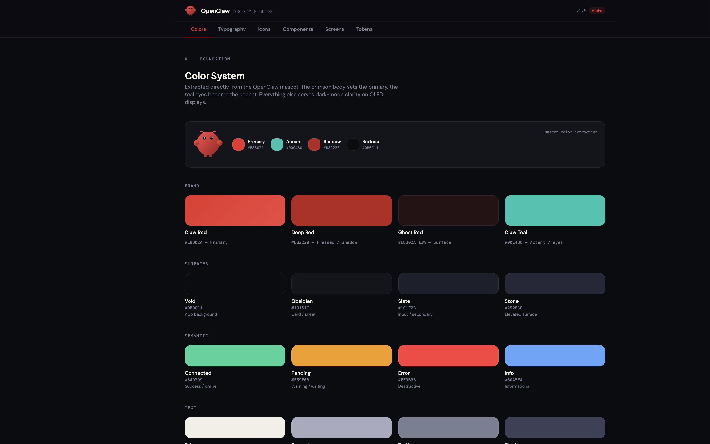
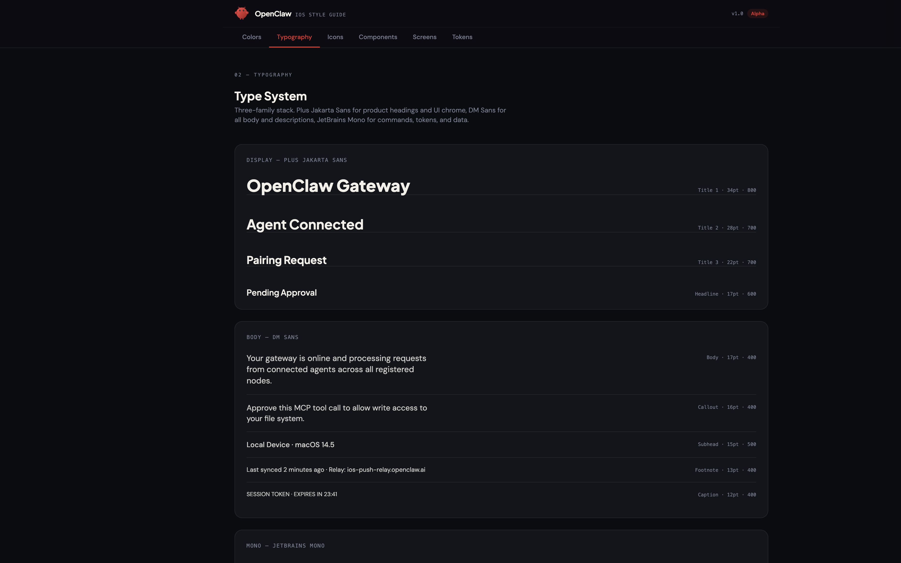
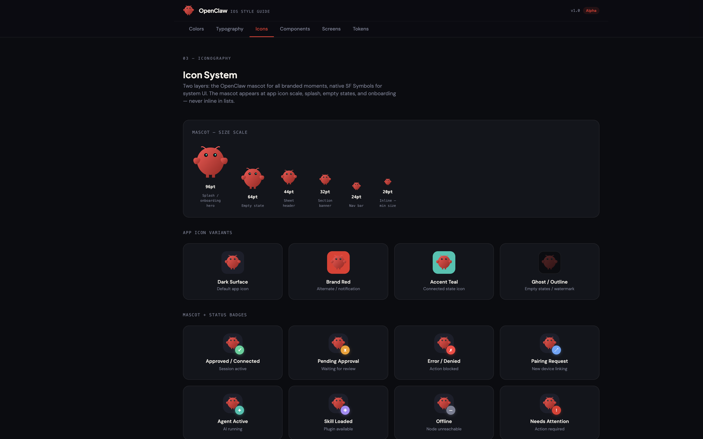
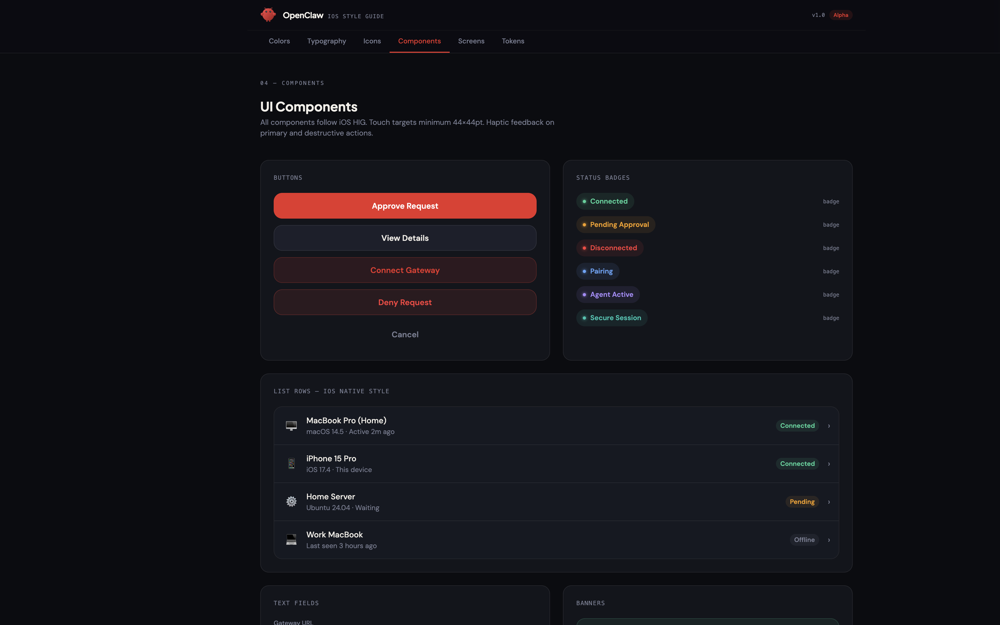
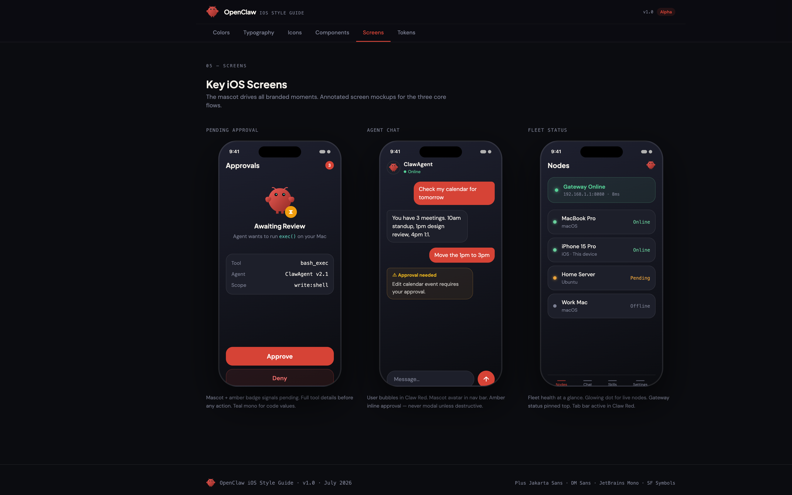
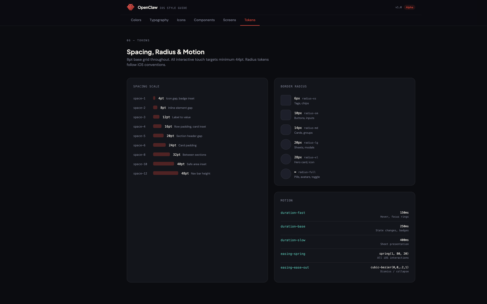

# OpenClaw iOS Design Guide

Interactive styling reference for the OpenClaw iOS app. Covers colors, typography, iconography, components, screen mockups, and design tokens.

Original Figma source: https://www.figma.com/design/DJ0ad6j0GOuaP1Ozn3B7Dq/Branded-Styling-Guide

## Preview

### Colors


### Typography


### Icons


### Components


### Screens


### Tokens


## Running locally

```bash
cd apps/ios/design-guide
npm install
npm run dev
```

Then open `http://localhost:5173/`.

## Sections

| Section | What it covers |
|---|---|
| **01 Colors** | Brand palette (Claw Red, Claw Teal), surfaces, semantic colors, text hierarchy, usage rules |
| **02 Typography** | Three-family stack: Plus Jakarta Sans (headings), DM Sans (body), JetBrains Mono (code/data) |
| **03 Icons** | Mascot size scale, app icon variants, status badges, SF Symbols mapping |
| **04 Components** | Buttons (5 tiers), status badges, list rows, text fields, banners |
| **05 Screens** | Annotated iPhone mockups: Pending Approval, Agent Chat, Fleet Status |
| **06 Tokens** | 8pt spacing grid, border radius scale, motion/animation tokens |

## Key Design Decisions

- **Dark-first OLED**: All surfaces use deep charcoal/void backgrounds optimized for OLED displays
- **Mascot-derived palette**: Claw Red (`#E8302A`) from the body, Claw Teal (`#00C4B0`) from the eyes
- **Red = primary action only**: One red CTA per screen; teal is for accent labels and data, never buttons
- **iOS HIG compliant**: 44pt minimum touch targets, SF Symbols for system UI, haptic feedback on actions
- **Status colors always labeled**: Never rely on color alone; always pair with a text label
