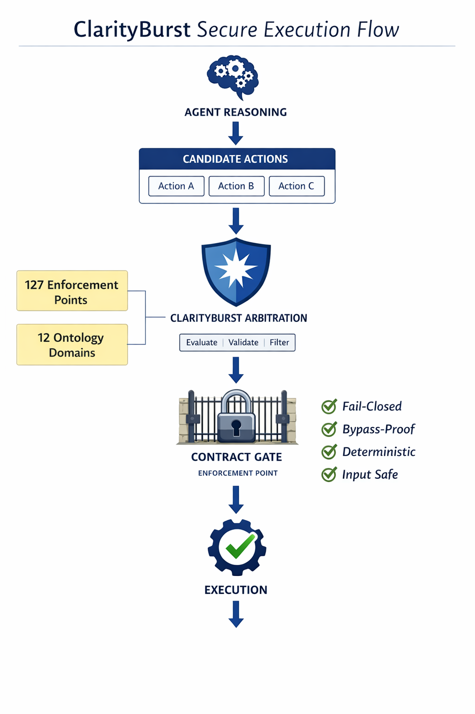

# ClarityBurst Documentation Hub

## What is ClarityBurst?

ClarityBurst is OpenClaw's **deterministic execution control plane** for autonomous agents.

It governs the authorization of side-effecting operations through **ontology-constrained routing** and **fail-closed arbitration**.

Agent systems first generate candidate actions through reasoning and planning.
ClarityBurst ensures that the authorization of those actions is deterministic rather than probabilistic.
Before any operation is executed, ClarityBurst evaluates the proposed action against explicit contracts defined in ontology packs.

Only operations that match a valid contract are authorized to proceed.

If contract validation cannot be completed or dominance cannot be established, execution is **blocked by default** (fail-closed).

This architecture ensures that all high-impact operations—such as shell execution, network I/O, file system changes, and sub-agent spawning—are evaluated deterministically before execution.

---

## How to Use This Documentation

This hub organizes ClarityBurst documentation by audience and purpose. Select the path that matches your role:

### For Engineers

- **Start with:** [`architecture/OPENCLAW_INTEGRATION.md`](architecture/OPENCLAW_INTEGRATION.md) for ClarityBurst integration into OpenClaw
- **Then read:** [`architecture/OVERVIEW.md`](architecture/OVERVIEW.md) for core architecture
- **Then read:** [`ontology/`](#ontology) to understand the contract model and packs
- **Reference:** [`reference/`](#reference) for API terminology and implementation status

### For Operators

- **Start with:** [`operations/`](#operations) for quick-start and production roadmap
- **Then read:** [`compliance/`](#compliance) for manifest and reachability validation
- **Consult:** [`security/`](#security) for hardening and threat intelligence

### For Security Reviewers

- **Start with:** [`security/`](#security) for architecture and configuration injection controls
- **Then read:** [`validation/`](#validation) for security audit results and test methodology
- **Reference:** [`reference/`](#reference) for terminology and known issues

### For Auditors

- **Start with:** [`compliance/`](#compliance) for manifest, reachability, and test results
- **Then read:** [`security/`](#security) for privilege escalation hardening
- **Reference:** [`archive/`](#archive) for historical phase completion and validation trails

---

## System Architecture

ClarityBurst operates as a deterministic execution control layer within the agent runtime.

Agent reasoning generates candidate actions which are evaluated by the ClarityBurst arbitration engine.
Each action must pass ontology validation and contract enforcement before execution is authorized.

If no valid contract exists, execution fails closed.

## Deterministic Authorization Model

ClarityBurst separates probabilistic reasoning from execution authorization.

Autonomous agents use language models and reasoning systems to generate candidate actions. However, language models are inherently probabilistic and cannot provide reliable guarantees for security-critical decisions.

ClarityBurst therefore moves execution authorization into a deterministic control layer.

At each contract point (decision inflection point before a side-effecting operation), the proposed action is routed through the ClarityBurst arbitration engine and evaluated against explicit ontology contracts.

Only actions that match a valid contract are authorized to proceed.

### Security Invariant

All contract points MUST invoke the ClarityBurst router before any side-effect occurs.

If the router is not invoked, the ClarityBurst control layer is not active.

### Execution Flow

Agent Runtime
      ↓
Decision Inflection Point (Contract Point)
      ↓
ClarityBurst Router
      ↓
Ontology Policy Check
      ↓
ALLOW → Execute
ABSTAIN_* → Block / Clarify

### Enforcement Rules

- Router invocation is mandatory at every contract point
- Router decisions are authoritative
- Execution may not continue after an `ABSTAIN_*` outcome
- Agents never self-authorize side effects
- Authorization decisions are deterministic and reproducible

---

## Folder Purposes

### `architecture/`

System design and boundary documentation:

- **OPENCLAW_INTEGRATION.md** – How ClarityBurst integrates with OpenClaw (12 gating stages, API contract, examples)
- **OVERVIEW.md** – High-level ClarityBurst architecture
- **ARCHITECTURE_BOUNDARIES.md** – Scope, trust model, and system boundaries
- **CONTROL_PLANE_ANALOGY.md** – Conceptual routing and arbitration model (why fail-closed matters)
- **NETWORK_IO_WIRING_PLAN.md** – Gateway integration and message flow
- **PRODUCTION_JOURNEY.md** – Deployment and operational lifecycle

### `validation/`

**Active test methodology and security validation results** (not for compliance checklists):

- Chaos testing frameworks (CHAOS_RUNNER_README, CHAOS_PHASES_SUMMARY)
- Security test execution (PHASE4_SECURITY_TEST_GUIDE, PROMPT_INJECTION_TEST_GUIDE)
- Audit results and findings (SECURITY_AUDIT_REPORT)
- Production readiness assessment (PRODUCTION_READINESS_REPORT)
- Verification harness and execution logs

**Purpose:** Demonstrates through testing that security controls are effective; captures test methodology, results, and defects found.

### `ontology/`

Contract model and authorization policy packs:

- **ONTOLOGY_OVERVIEW.md** – Concept of ontology-constrained routing and contract templates
- **COVERAGE_SUMMARY.md** – Which operations are covered by which packs
- **packs/** – References to individual ontology pack definitions (BROWSER_AUTOMATE, FILE_SYSTEM_OPS, etc.)

### `security/`

**Threat modeling, hardening, and configuration control** (not for compliance verification):

- **SECURITY_OVERVIEW.md** – Threat landscape and architectural response
- **SECURITY_ARCHITECTURE.md** – Fail-closed design, arbitration rules, routing constraints
- **CONFIG_INJECTION_VALIDATION.md** – Configuration injection threat and mitigation
- **CONFIGURATION_INJECTION.md** – Implementation details of injection prevention
- **PRIVILEGE_ESCALATION_HARDENING.md** – Exploit prevention and boundary enforcement
- **ENTERPRISE_SECURITY_SUMMARY.md** – Executive summary for enterprise deployments
- **THREAT_INTELLIGENCE.md** – Known attack vectors and response strategies
- **HARDENING_ROADMAP.md** – Future security enhancements

**Purpose:** Describes what threats exist, how ClarityBurst defends against them, and what hardening strategies are planned.

### `compliance/`

**Operational compliance and manifest validation** (not for security testing):

- **MANIFEST.json / MANIFEST.yaml** – Declarative definition of authorized operations, policies, and signatures
- **REACHABILITY_SCAN.md** – Verification that all declared operations are reachable and properly gated
- **test-results/** – Results of compliance checks and manifest validation

**Purpose:** Ensures the deployed configuration matches declared intent; verifies that all listed operations are enforced.

**Distinction from validation/:** Compliance is about *confirming the manifest is correct and enforced*; validation/ is about *demonstrating security controls work through testing*.

### `reference/`

**Index, terminology, and status** (not for deep design or testing):

- **TERMINOLOGY.md** – Glossary of ClarityBurst-specific concepts
- **DELIVERABLES_INDEX.md** – Complete index of deliverables and their locations
- **IMPLEMENTATION_STATUS.md** – Current feature coverage and maturity
- **REMAINING_ISSUES.md** – Known limitations and outstanding work

**Purpose:** Quick lookup for terms, implementation status, and high-level deliverable tracking.

**Distinction from validation/ and compliance/:** Reference/ is *read-only documentation*; validation/ is *active testing*; compliance/ is *operational verification*.

### `operations/`

Operator-focused deployment and runtime guidance:

- **QUICK_START.md** – Getting started with ClarityBurst
- **PRODUCTION_ROADMAP.md** – Deployment phases, scaling, and runbook priorities

### `patents/`

Patent and intellectual property documentation (currently reserved for future use).

### `archive/`

Historical documentation and phase completion records:

- Phase 1–4 completion summaries and validation trails
- Previous iteration reports and archived decision logs
- Legacy design documents and superseded specifications

**Note:** Archive content is preserved for historical reference and audit trails; it is not the current source of truth. Always consult current folders (architecture/, security/, validation/) for active guidance.

---

## What Remains Outside This Documentation

The following are **not** part of this documentation hub and remain in their original locations:

- **Source code:** `src/clarityburst/` (TypeScript implementation, types, errors, router, pack loader)
- **Ontology packs:** `ontology-packs/` (JSON-defined operation contracts and policies)
- **Tests and test runners:** `src/clarityburst/__tests__/` and `.test.ts` files (unit, tripwire, and chaos test suites)
- **Automation scripts:** `scripts/` (test execution, analysis, and deployment helpers)

These remain fully functional and unchanged; documentation here references them without moving or modifying them.

---

## Recommended Starting Points

### I want to understand ClarityBurst integration with OpenClaw

→ **Start:** [`architecture/OPENCLAW_INTEGRATION.md`](architecture/OPENCLAW_INTEGRATION.md) — How ClarityBurst gates all 12 OpenClaw capability stages  
→ **Then:** [`architecture/CONTROL_PLANE_ANALOGY.md`](architecture/CONTROL_PLANE_ANALOGY.md) — Why fail-closed architecture matters  
→ **Then:** [`security/ENTERPRISE_SECURITY_SUMMARY.md`](security/ENTERPRISE_SECURITY_SUMMARY.md) — Enterprise threat model

### I want to understand ClarityBurst at a glance

→ **Start:** [`architecture/OVERVIEW.md`](architecture/OVERVIEW.md)  
→ **Then:** [`ontology/ONTOLOGY_OVERVIEW.md`](ontology/ONTOLOGY_OVERVIEW.md)  
→ **Finally:** [`reference/TERMINOLOGY.md`](reference/TERMINOLOGY.md)

### I need to deploy ClarityBurst to production

→ **Start:** [`operations/QUICK_START.md`](operations/QUICK_START.md)  
→ **Then:** [`operations/PRODUCTION_ROADMAP.md`](operations/PRODUCTION_ROADMAP.md)  
→ **Then:** [`compliance/MANIFEST.md`](compliance/MANIFEST.yaml)  
→ **Finally:** [`security/ENTERPRISE_SECURITY_SUMMARY.md`](security/ENTERPRISE_SECURITY_SUMMARY.md)

### I need to audit ClarityBurst security

→ **Start:** [`security/SECURITY_ARCHITECTURE.md`](security/SECURITY_ARCHITECTURE.md)  
→ **Then:** [`validation/SECURITY_AUDIT_REPORT.md`](validation/SECURITY_AUDIT_REPORT.md)  
→ **Then:** [`compliance/REACHABILITY_SCAN.md`](compliance/REACHABILITY_SCAN.md)  
→ **Finally:** [`architecture/ARCHITECTURE_BOUNDARIES.md`](architecture/ARCHITECTURE_BOUNDARIES.md)

### I want to understand how configuration injection is prevented

→ **Start:** [`security/CONFIG_INJECTION_VALIDATION.md`](security/CONFIG_INJECTION_VALIDATION.md)  
→ **Then:** [`security/CONFIGURATION_INJECTION.md`](security/CONFIGURATION_INJECTION.md)  
→ **Then:** [`validation/PHASE4_SECURITY_TEST_GUIDE.md`](validation/PHASE4_SECURITY_TEST_GUIDE.md)

### I want to see the validation test methodology

→ **Start:** [`validation/SECURITY_AUDIT_REPORT.md`](validation/SECURITY_AUDIT_REPORT.md)  
→ **Then:** [`validation/CHAOS_RUNNER_README.md`](validation/CHAOS_RUNNER_README.md)  
→ **Then:** [`validation/PHASE4_SECURITY_TEST_GUIDE.md`](validation/PHASE4_SECURITY_TEST_GUIDE.md)

---

## Navigation

- [Architecture](architecture/) – System design and boundaries
- [Validation](validation/) – Test methodology and security audit results
- [Ontology](ontology/) – Contract model and operation packs
- [Security](security/) – Threat modeling and hardening
- [Compliance](compliance/) – Manifest validation and operational verification
- [Operations](operations/) – Deployment and production guidance
- [Reference](reference/) – Terminology and implementation status
- [Patents](patents/) – IP documentation
- [Archive](archive/) – Historical records and phase completion trails

---

**Last updated:** 2026-03-07  
**ClarityBurst Version:** Integrated in OpenClaw  
**Documentation Status:** Active – current source of truth for all ClarityBurst guidance
