# Ouroboros 통합 설계 — 분리 아키텍처 적용

> Ouroboros의 6-Phase 사이클을 Task Hub / Gateway / Agent 분리 아키텍처에 맞게 재설계한다.
> Ouroboros는 단일 프로세스 + 프롬프트 교체(역할 전환) 방식이지만,
> prontoclaw는 3-tier 분리 구조 + 다수 독립 에이전트이므로
> **전용 평가 에이전트**를 통해 LLM 판단을 분리한다.
>
> **상태**: 설계 문서 (구현 전 검토용)

---

## 1. 아키텍처 차이 분석

### Ouroboros (모놀리식)

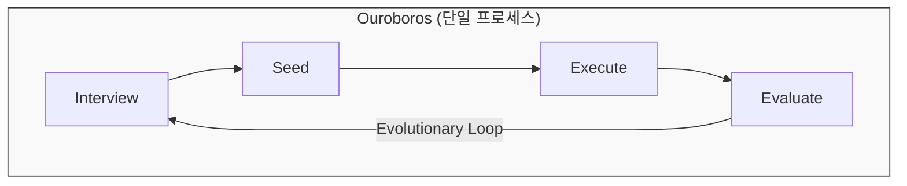

> - 1 LLM 세션 x N 페르소나 (시스템 프롬프트 교체)
> - "9 Agents" = 9개 마크다운 프롬프트 파일
> - 역할 전환: 같은 세션에서 프롬프트만 교체
> - EventStore (SQLite) 로 상태 추적

### Prontoclaw (분리 아키텍처)

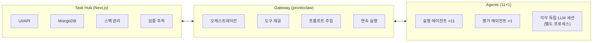

### 핵심 차이점

| 측면              | Ouroboros                               | Prontoclaw                              |
| ----------------- | --------------------------------------- | --------------------------------------- |
| **에이전트 모델** | 1 프로세스 × N 페르소나 (프롬프트 교체) | N 프로세스 × 각각 독립 세션             |
| **실행 모델**     | 동기 파이프라인                         | 비동기 메시지 기반                      |
| **평가 주체**     | 같은 세션이 역할 전환하여 자체 평가     | **전용 평가 에이전트**가 별도 평가      |
| **상태 관리**     | SQLite EventStore                       | MongoDB (Task Hub) + TaskFile (Gateway) |
| **Phase 전환**    | 코드 내 함수 호출                       | 태스크 위임 + API 호출                  |

### 설계 결정: 왜 전용 평가 에이전트인가

**Gateway에서 LLM 호출하는 방식은 부적합:**

- Gateway는 오케스트레이션/라우팅 계층 — LLM 판단 로직이 들어가면 역할이 오염됨
- LLM 클라이언트, API 키, 토큰 추적 등 Gateway에 불필요한 의존성 추가

**실행 에이전트가 자체 평가하는 방식도 부적합:**

- 자기 결과물을 자기가 평가하면 편향 발생
- Ouroboros도 이 한계를 가지지만, 단일 프로세스라 어쩔 수 없었음

**전용 평가 에이전트가 최적:**

- 기존 task delegation / A2A 패턴 그대로 사용
- 실행 ≠ 평가 분리로 편향 제거
- Gateway는 오케스트레이션만 수행 (LLM 호출 없음)
- 11개 에이전트 + 1개 평가 에이전트 = 기존 패턴 확장

---

## 2. Phase별 계층 배치

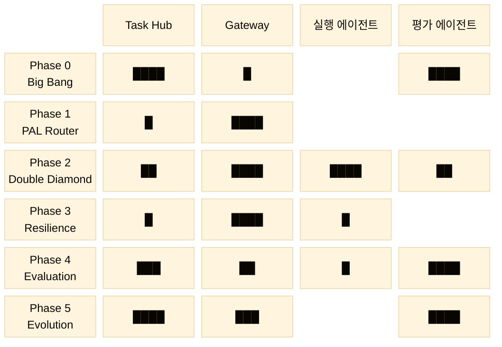

> 블록 너비 = 해당 계층의 책임 비중. 빈 칸 = 해당 Phase에 관여하지 않음.

---

## 3. 평가 에이전트 (Evaluator Agent)

### 역할

Ouroboros의 9개 페르소나 중 **판단/메타인지 계열**을 전담하는 12번째 에이전트.

| 역할                     | Ouroboros 페르소나   | 수행 Phase      |
| ------------------------ | -------------------- | --------------- |
| 모호성 평가              | Socratic Interviewer | Phase 0         |
| AC 원자성 판단 + 분해    | Ontologist           | Phase 2         |
| 시맨틱 평가              | Evaluator            | Phase 4 Stage 2 |
| 합의 투표 오케스트레이션 | Evaluator            | Phase 4 Stage 3 |
| Wonder 질문 생성         | Ontologist           | Phase 5         |
| Reflect 개선안 도출      | Seed Architect       | Phase 5         |

### 도구

```typescript
// 평가 에이전트가 사용하는 도구
harness_score_ambiguity; // Phase 0: 모호성 점수 계산 결과 제출
harness_submit_decomposition; // Phase 2: AC 분해 결과 제출
harness_evaluate_semantic; // Phase 4: 시맨틱 평가 결과 제출
harness_vote_consensus; // Phase 4: 합의 투표 결과 제출
harness_submit_wonder; // Phase 5: Wonder 질문 제출
harness_submit_reflect; // Phase 5: Reflect 개선안 제출
harness_report_drift; // 공통: 드리프트 측정 결과 제출
```

### 태스크 위임 흐름

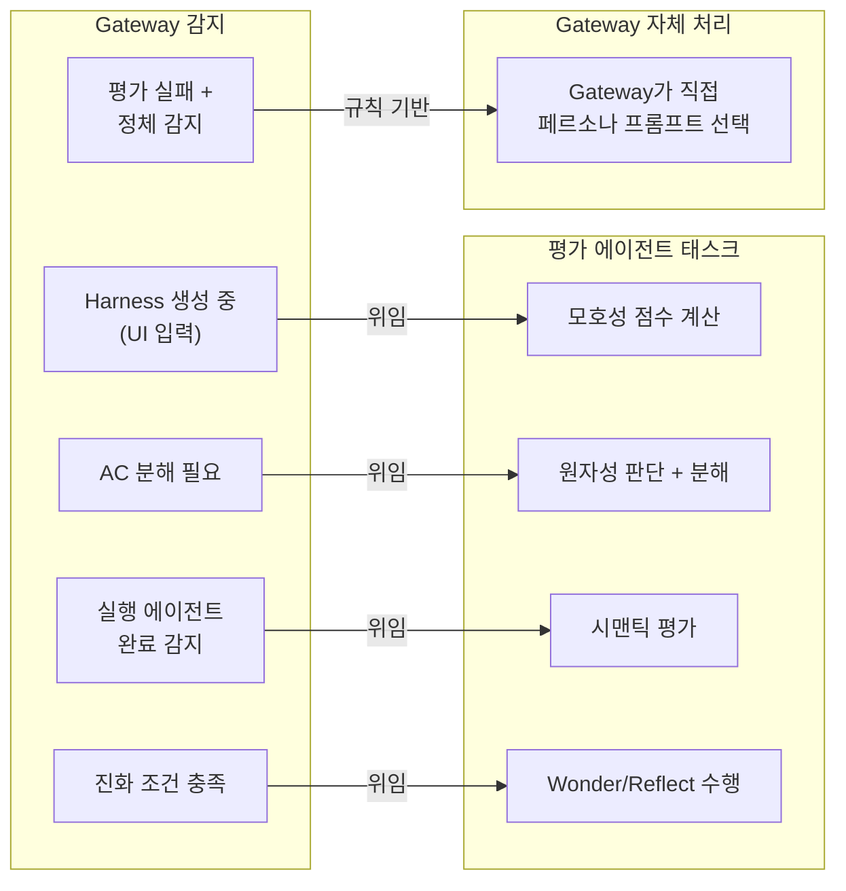

---

## 4. Phase 0: Big Bang — 인터뷰 → Seed 생성

### Ouroboros 원본

- InterviewEngine: 소크라테스식 질문 반복
- AmbiguityScorer: 3-4차원 가중 점수 (Goal 40%, Constraint 30%, Success 30%)
- 게이트: 모호성 ≤ 0.2일 때만 Seed 생성 허용

### 분리 아키텍처 배치

| 계층              | 책임                                                                     |
| ----------------- | ------------------------------------------------------------------------ |
| **Task Hub**      | UI 입력 (Goal, Constraints, AC, Steps) + 점수 표시 + Launch 게이트       |
| **Gateway**       | Task Hub → 평가 에이전트 태스크 위임 중개                                |
| **평가 에이전트** | LLM 호출로 모호성 점수 계산 → `harness_score_ambiguity` 도구로 결과 제출 |

### 흐름

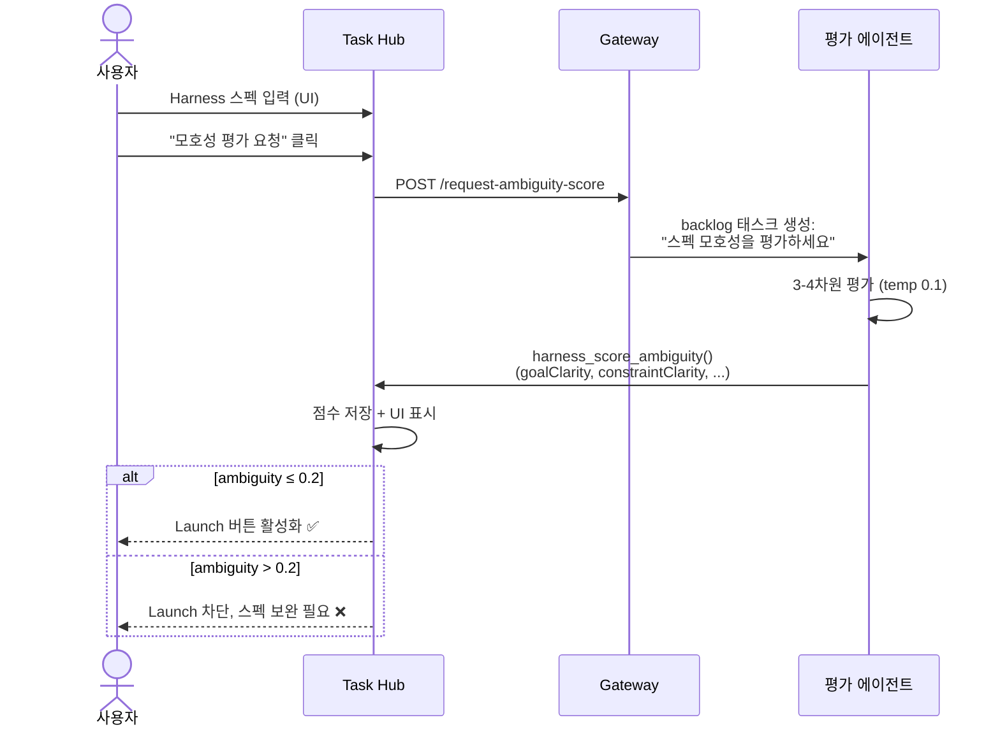

### 데이터 모델

```typescript
// Task Hub: IHarnessProject 확장
interface IAmbiguityScore {
  overall: number; // 0.0-1.0 (≤0.2이면 launch 가능)
  breakdown: {
    goalClarity: number; // 0.0-1.0
    constraintClarity: number;
    successCriteriaClarity: number;
    contextClarity?: number; // brownfield일 때만
  };
  weights: {
    // Ouroboros 가중치
    goal: number; // 0.40 (greenfield) / 0.35 (brownfield)
    constraint: number; // 0.30 / 0.25
    success: number; // 0.30 / 0.25
    context?: number; // 0 / 0.15
  };
  isReadyForLaunch: boolean;
  scoredAt: Date;
}

interface IHarnessProject {
  // ... 기존 필드
  ambiguityScore?: IAmbiguityScore;
  isBrownfield: boolean;
  seedFrozenAt?: Date; // Seed 확정 시점 (이후 수정 차단)
}
```

### Launch 게이트

```typescript
// task-hub: launch/route.ts 수정
if (!project.ambiguityScore || project.ambiguityScore.overall > 0.2) {
  return Response.json({ error: "Ambiguity score must be ≤ 0.2 before launch" }, { status: 422 });
}
```

---

## 5. Phase 1: PAL Router — 복잡도 기반 모델 선택

### Ouroboros 원본

- 가중 합산: tokens 30% + tools 30% + AC depth 40%
- < 0.4 → FRUGAL, < 0.7 → STANDARD, ≥ 0.7 → FRONTIER
- 2연속 실패 → 에스컬레이션, 5연속 성공 → 다운그레이드

### 분리 아키텍처 배치

PAL Router는 **LLM 호출이 필요 없는 순수 함수**이므로 Gateway에서 직접 처리.

```typescript
// Gateway: src/services/pal-router.ts (신규)

type ModelTier = "frugal" | "standard" | "frontier";

interface ComplexityScore {
  score: number; // 0.0-1.0
  breakdown: { tokenScore: number; toolScore: number; depthScore: number };
  tier: ModelTier;
}

// Ouroboros 알고리즘 그대로 (순수 함수)
const WEIGHTS = { tokens: 0.3, tools: 0.3, depth: 0.4 };
const THRESHOLDS = { frugal: 0.4, standard: 0.7 };
const NORM = { tokens: 4000, tools: 5, depth: 5 };

function computeComplexity(ctx: {
  estimatedTokens: number;
  toolCount: number;
  acDepth: number;
}): ComplexityScore {
  const tokenScore = Math.min(ctx.estimatedTokens / NORM.tokens, 1.0);
  const toolScore = Math.min(ctx.toolCount / NORM.tools, 1.0);
  const depthScore = Math.min(ctx.acDepth / NORM.depth, 1.0);
  const score =
    WEIGHTS.tokens * tokenScore + WEIGHTS.tools * toolScore + WEIGHTS.depth * depthScore;
  const tier: ModelTier =
    score < THRESHOLDS.frugal ? "frugal" : score < THRESHOLDS.standard ? "standard" : "frontier";
  return { score, breakdown: { tokenScore, toolScore, depthScore }, tier };
}
```

### 에스컬레이션/다운그레이드

```typescript
interface TierState {
  currentTier: ModelTier;
  consecutiveFailures: number; // ≥2 → 상위 티어
  consecutiveSuccesses: number; // ≥5 → 하위 티어
}

// TaskFile에 저장
interface TaskFile {
  // ... 기존 필드
  palTierState?: TierState;
}
```

### 모델 매핑 (config)

```yaml
agents:
  defaults:
    ouroboros:
      palRouter:
        enabled: true
        tierModels:
          frugal: "claude-haiku-4-5-20251001"
          standard: "claude-sonnet-4-6"
          frontier: "claude-opus-4-6"
        escalationThreshold: 2
        downgradeThreshold: 5
```

---

## 6. Phase 2: Double Diamond — AC 분해 + 병렬 실행

### Ouroboros 원본

- AC를 ACTree로 재귀 분해 (원자성 판단 → 2-5개 자식)
- 4단계: Discover → Define → Design → Deliver
- MAX_DEPTH=5, 깊이 3+ 컨텍스트 압축
- 자식 간 의존성 DAG → 병렬 실행

### 분리 아키텍처 배치

| 계층              | 책임                                                                                         |
| ----------------- | -------------------------------------------------------------------------------------------- |
| **Task Hub**      | AC Tree 저장 + 시각화                                                                        |
| **Gateway**       | AC 분해 태스크를 평가 에이전트에 위임 + 의존성 DAG 스케줄링 + 원자적 AC → 실행 에이전트 위임 |
| **평가 에이전트** | AC 원자성 판단 + 비원자적 AC 분해 (LLM 호출)                                                 |
| **실행 에이전트** | 원자적 AC를 받아 4단계 수행 + harness_report_step으로 보고                                   |

### 흐름

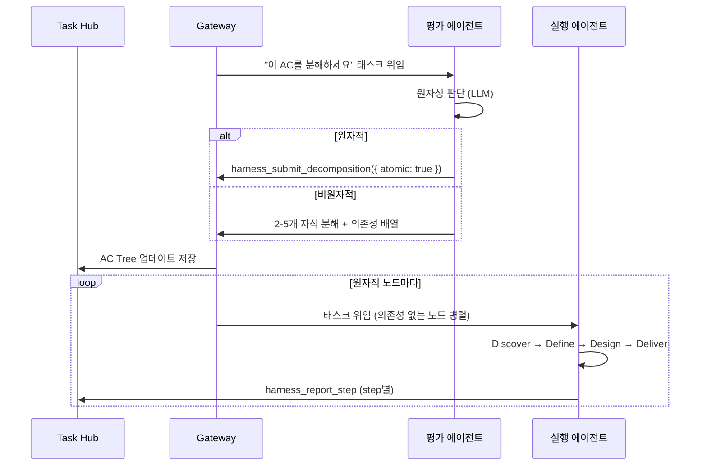

### 데이터 모델

```typescript
type ACStatus = "pending" | "atomic" | "decomposed" | "executing" | "completed" | "failed";

interface ACNode {
  id: string; // "ac_{uuid}"
  content: string;
  depth: number; // 0-5
  parentId: string | null;
  status: ACStatus;
  isAtomic: boolean;
  childrenIds: string[];
  dependsOn: string[]; // 형제 AC의 id 목록
  taskId?: string; // 위임된 TaskFile id
  executionResult?: string;
  complexityScore?: number;
}

interface ACTree {
  rootId: string;
  nodes: Record<string, ACNode>;
  status: "pending" | "decomposing" | "executing" | "completed" | "failed";
}
```

### 실행 에이전트 프롬프트 주입

```typescript
// task-continuation-runner.ts: formatBacklogPickupPrompt 확장

if (task.acNodeId) {
  lines.push(`## Double Diamond Protocol`);
  lines.push(`이 태스크는 AC Tree의 원자적 노드입니다.`);
  lines.push(`**AC:** ${task.acContent}`);
  lines.push(``);
  lines.push(`다음 4단계를 순서대로 수행하세요:`);
  lines.push(`1. **Discover** — 문제 공간을 탐색하고 관련 코드/문서를 파악`);
  lines.push(`2. **Define** — 핵심 문제를 정의하고 범위를 확정`);
  lines.push(`3. **Design** — 해결 방안을 설계`);
  lines.push(`4. **Deliver** — 구현하고 harness_report_step으로 보고`);
}
```

---

## 7. Phase 3: Resilience — 정체 감지 + 측면 사고

### Ouroboros 원본

4가지 정체 패턴:

- **SPINNING**: 같은 출력 반복 (SHA-256 해시, 3회)
- **OSCILLATION**: A→B→A→B 교대 (2주기)
- **NO_DRIFT**: 드리프트 변화 < 0.01 (3회)
- **DIMINISHING_RETURNS**: 개선율 단조 감소 (< 0.01)

5가지 페르소나: Hacker, Researcher, Simplifier, Architect, Contrarian

### 분리 아키텍처 배치

정체 감지는 **해시 비교, 수치 비교** 등 규칙 기반이므로 Gateway에서 직접 처리.
페르소나 선택도 **매핑 테이블** 기반이므로 LLM 불필요.

| 계층              | 책임                                                                                     |
| ----------------- | ---------------------------------------------------------------------------------------- |
| **Gateway**       | 정체 패턴 감지 (규칙 기반) + 페르소나 프롬프트 선택 (매핑 테이블) + 실행 에이전트에 주입 |
| **실행 에이전트** | 페르소나 프롬프트를 받아 다른 접근법으로 재시도                                          |
| **Task Hub**      | 정체 이벤트 기록 + UI 알림                                                               |

### 정체 감지

```typescript
// Gateway: src/services/stagnation-detector.ts (신규)

type StagnationPattern = "spinning" | "oscillation" | "no_drift" | "diminishing_returns";

interface StagnationDetection {
  pattern: StagnationPattern;
  detected: boolean;
  confidence: number;
  evidence: Record<string, unknown>;
}

const THRESHOLDS = {
  spinning: 3,
  oscillationCycles: 2,
  noDriftEpsilon: 0.01,
  noDriftIterations: 3,
  diminishingThreshold: 0.01,
};

// TaskFile에 실행 이력 추가
interface TaskFile {
  // ... 기존 필드
  executionHistory?: {
    outputHashes: string[]; // SHA-256 해시
    driftScores: number[];
    iterationCount: number;
    appliedPersonas: string[];
  };
}
```

### 페르소나 선택 + 프롬프트 주입

```typescript
type ThinkingPersona = "hacker" | "researcher" | "simplifier" | "architect" | "contrarian";

const PERSONA_AFFINITY: Record<StagnationPattern, ThinkingPersona[]> = {
  spinning: ["hacker", "contrarian"],
  oscillation: ["simplifier", "architect", "contrarian"],
  no_drift: ["researcher", "architect", "contrarian"],
  diminishing_returns: ["researcher", "simplifier", "contrarian"],
};

const PERSONA_PROMPTS: Record<ThinkingPersona, string> = {
  hacker: `## HACKER Mode
현재 접근이 반복되고 있습니다. 관점을 전환하세요:
- 당신이 가정하고 있는 제약 중 실제로는 존재하지 않는 것은?
- 장애물을 완전히 우회하는 해킹적 방법이 있는가?
- 10분 안에 해결해야 한다면 어떻게 하겠는가?`,

  researcher: `## RESEARCHER Mode
진행이 멈춰 있습니다. 코딩을 멈추고 조사하세요:
- 실제 증거 vs 가정을 구분하세요
- 유사한 문제와 그 해결책을 검색하세요
- 어떤 정보가 있으면 접근법이 바뀌겠는가?`,

  simplifier: `## SIMPLIFIER Mode
복잡성이 장애물입니다. 단순화하세요:
- 동작할 수 있는 가장 단순한 것은?
- 추가하는 대신 제거할 수 있는 것은?
- 올바른 문제를 풀고 있는가, 아니면 더 어려운 버전을 풀고 있는가?`,

  architect: `## ARCHITECT Mode
구조 자체가 문제일 수 있습니다. 재구성하세요:
- 처음부터 다시 만든다면 같은 구조로 만들겠는가?
- 구조 자체가 문제를 일으키고 있지는 않은가?
- 컴포넌트를 재배치하면 어떻게 달라지는가?`,

  contrarian: `## CONTRARIAN Mode
모든 가정에 도전하세요:
- 현재 접근법의 반대가 옳다면?
- 당연하다고 여기는 것 중 틀린 것은?
- 당신에게 반대하는 사람이라면 뭐라고 하겠는가?`,
};

// task-continuation-runner.ts의 formatContinuationPrompt()에서 주입
// 5가지 모두 소진 시 → 태스크를 blocked로 전환
```

---

## 8. Phase 4: Evaluation — 3단계 검증 파이프라인

### Ouroboros 원본

1. **Mechanical ($0)**: lint, build, test, static, coverage ≥ 70%
2. **Semantic ($$)**: LLM이 AC 준수/goal 정렬/드리프트 평가
3. **Consensus ($$$)**: 3모델 투표 (2/3 과반), 6개 트리거로 진입

### 분리 아키텍처 배치

| Stage                   | 수행 주체         | 이유                                |
| ----------------------- | ----------------- | ----------------------------------- |
| **Stage 1: Mechanical** | 실행 에이전트     | 이미 lint/build/test 도구 사용 가능 |
| **Stage 2: Semantic**   | **평가 에이전트** | 자기 평가 편향 방지                 |
| **Stage 3: Consensus**  | **평가 에이전트** | 멀티모델 투표 오케스트레이션        |

### 흐름

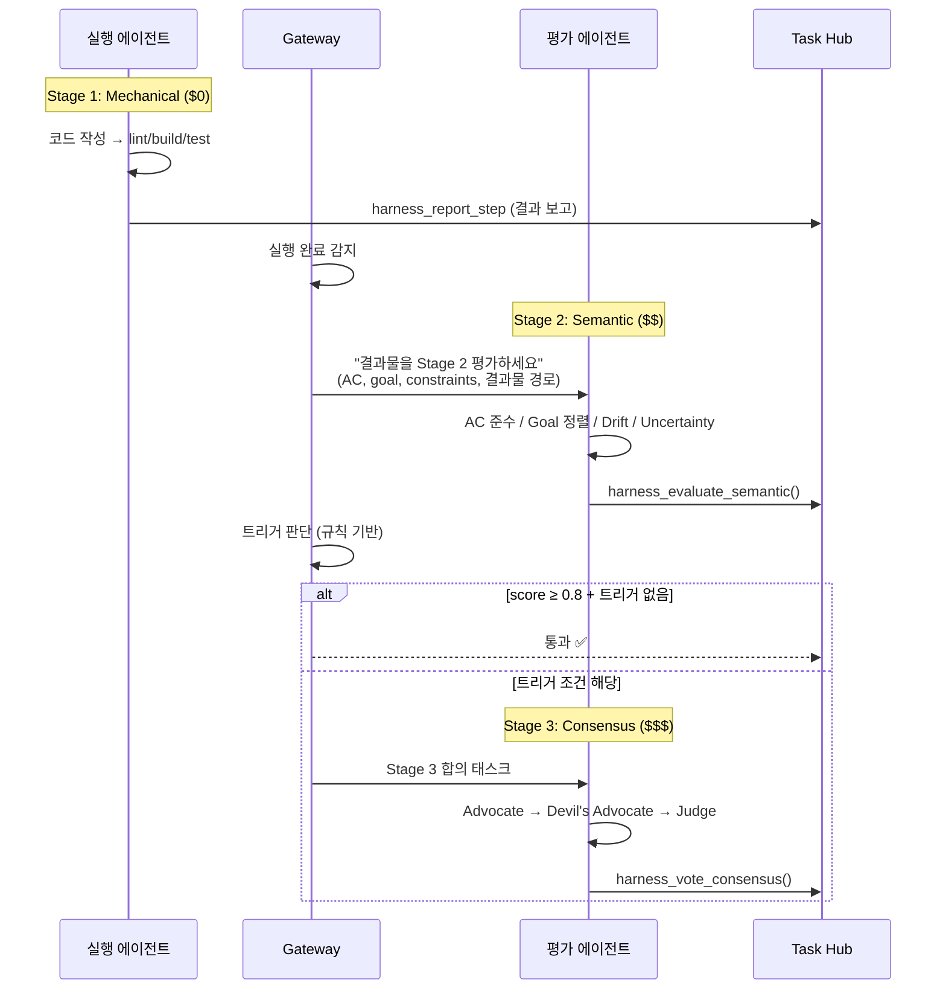

### Consensus 트리거 조건 (Ouroboros 6개 그대로)

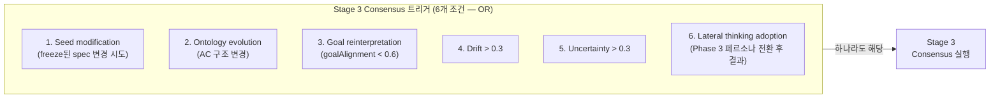

트리거 판단은 **수치 비교**이므로 Gateway에서 규칙 기반으로 처리.

### 평가 에이전트 도구

```typescript
// src/agents/tools/evaluation-tool.ts (신규)

// Stage 2 결과 제출
harness_evaluate_semantic: {
  params: {
    item_id: string,
    score: number,           // 0.0-1.0
    ac_compliance: boolean,
    goal_alignment: number,
    drift_score: number,
    uncertainty: number,
    reasoning: string,
  }
}

// Stage 3 합의 결과 제출
harness_vote_consensus: {
  params: {
    item_id: string,
    approved: boolean,
    votes: { role: string, approved: boolean, confidence: number, reasoning: string }[],
    majority_ratio: number,
  }
}

// 드리프트 측정 결과 제출
harness_report_drift: {
  params: {
    item_id: string,
    goal_drift: number,       // weight 50%
    constraint_drift: number, // weight 30%
    ontology_drift: number,   // weight 20%
    combined: number,
  }
}
```

---

## 9. Phase 5: Evolution — 진화 루프

### Ouroboros 원본

- Wonder: "아직 모르는 것은?" → 질문 + 온톨로지 긴장
- Reflect: Seed + 평가 → 개선된 AC + ontology mutation
- 새 Seed 생성 (parent_seed_id로 계보)
- 수렴: ontology similarity ≥ 0.95
- 최대 30세대, 3연속 무변화 시 정체

### 분리 아키텍처 배치

| 계층              | 책임                                                      |
| ----------------- | --------------------------------------------------------- |
| **평가 에이전트** | Wonder 질문 생성 + Reflect 개선안 도출 (LLM 판단)         |
| **Gateway**       | 수렴 판정 (규칙 기반 수학 비교) + 다음 세대 Launch 트리거 |
| **Task Hub**      | 세대 기록 저장 + 계보 시각화 + Evolution 상태 관리        |

### 흐름

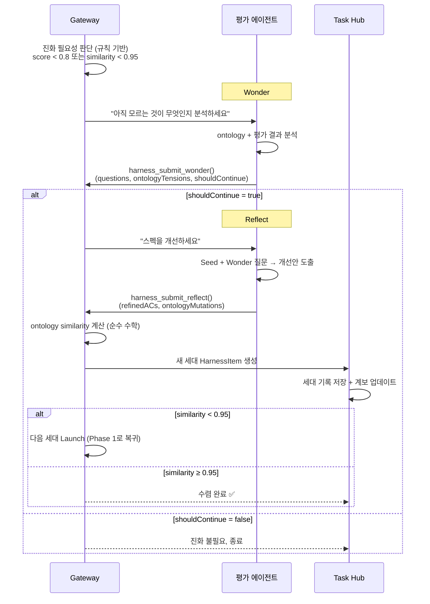

### 수렴 판정 (Gateway — 규칙 기반)

```typescript
// Gateway: src/services/convergence-checker.ts (신규)

// Ouroboros similarity 알고리즘 (순수 수학, LLM 불필요)
function computeOntologySimilarity(
  prev: { name: string; type: string; description: string }[],
  curr: { name: string; type: string; description: string }[],
): number {
  const prevNames = new Set(prev.map((f) => f.name));
  const currNames = new Set(curr.map((f) => f.name));
  const allNames = new Set([...prevNames, ...currNames]);
  if (allNames.size === 0) return 1.0;

  const intersection = [...prevNames].filter((n) => currNames.has(n));

  // Name overlap (50%)
  const nameOverlap = intersection.length / allNames.size;

  // Type match (30%)
  const typeMatches = intersection.filter(
    (name) => prev.find((f) => f.name === name)?.type === curr.find((f) => f.name === name)?.type,
  );
  const typeMatch = intersection.length > 0 ? typeMatches.length / intersection.length : 1.0;

  // Exact match (20%)
  const exactMatches = intersection.filter((name) => {
    const p = prev.find((f) => f.name === name);
    const c = curr.find((f) => f.name === name);
    return p?.type === c?.type && p?.description === c?.description;
  });
  const exactMatch = intersection.length > 0 ? exactMatches.length / intersection.length : 1.0;

  return 0.5 * nameOverlap + 0.3 * typeMatch + 0.2 * exactMatch;
}

const CONVERGENCE_THRESHOLD = 0.95;
const MAX_GENERATIONS = 30;
const STAGNATION_WINDOW = 3;
```

### 데이터 모델

```typescript
// Task Hub

interface IGenerationRecord {
  generationNumber: number;
  seedId: string;
  parentSeedId?: string;
  ontologySnapshot: { fields: { name: string; type: string; description: string }[] };
  evaluationSummary?: {
    finalApproved: boolean;
    score: number;
    driftScore: number;
    acResults: { content: string; passed: boolean }[];
  };
  wonderQuestions: string[];
  reflectMutations?: { action: string; fieldName: string; reason: string }[];
  status: "pending" | "executing" | "completed" | "failed";
  createdAt: Date;
}

interface IEvolutionState {
  lineageId: string;
  currentGeneration: number;
  maxGenerations: number; // 30
  status: "active" | "converged" | "exhausted" | "stagnated";
  generations: IGenerationRecord[];
  convergenceHistory: { generation: number; similarity: number }[];
}
```

---

## 10. 전체 데이터 흐름

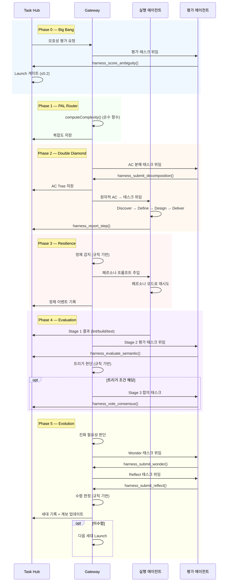

---

## 11. 역할 분리 원칙

### Gateway: 오케스트레이션만 (LLM 호출 없음)

| 수행                                 | 비수행              |
| ------------------------------------ | ------------------- |
| 태스크 위임/라우팅                   | LLM 호출            |
| 정체 감지 (규칙 기반 해시/수치 비교) | 시맨틱 평가         |
| 수렴 판정 (수학적 similarity)        | Wonder/Reflect 생성 |
| PAL Router (순수 함수)               | 모호성 점수 계산    |
| 페르소나 프롬프트 선택 (매핑 테이블) | 합의 투표           |
| Consensus 트리거 판단 (수치 비교)    | AC 원자성 판단      |

### 평가 에이전트: LLM 판단 전담

| 수행                            | 비수행                 |
| ------------------------------- | ---------------------- |
| 모호성 점수 계산 (Phase 0)      | 코드 작성              |
| AC 원자성 판단 + 분해 (Phase 2) | 실행 (Phase 2 Deliver) |
| 시맨틱 평가 (Phase 4)           | 인프라 조작            |
| Consensus 투표 (Phase 4)        | 태스크 스케줄링        |
| Wonder/Reflect (Phase 5)        |                        |

### 실행 에이전트: 실행 + Stage 1 검증

| 수행                              | 비수행                       |
| --------------------------------- | ---------------------------- |
| Double Diamond 4단계 (Phase 2)    | 자기 평가 (Phase 4 Stage 2+) |
| lint/build/test (Phase 4 Stage 1) | AC 분해 판단                 |
| 페르소나 모드 재시도 (Phase 3)    | Wonder/Reflect               |
| harness_report_step/check 보고    | 수렴 판정                    |

---

## 12. 구현 파일 목록

### Task Hub (Next.js) — 8개 파일

| #   | 파일                                                | 변경 유형 | 설명                                          |
| --- | --------------------------------------------------- | --------- | --------------------------------------------- |
| 1   | `src/models/Harness.ts`                             | 수정      | IAmbiguityScore, IEvolutionState, ACTree 타입 |
| 2   | `src/app/api/harness/[id]/score-ambiguity/route.ts` | **신규**  | 모호성 점수 저장                              |
| 3   | `src/app/api/harness/[id]/freeze-seed/route.ts`     | **신규**  | Seed 확정                                     |
| 4   | `src/app/api/harness/[id]/evaluate/route.ts`        | **신규**  | Semantic 평가 결과 저장                       |
| 5   | `src/app/api/harness/[id]/consensus/route.ts`       | **신규**  | Consensus 투표 저장                           |
| 6   | `src/app/api/harness/[id]/evolution/route.ts`       | **신규**  | Wonder/Reflect/세대 관리                      |
| 7   | `src/app/api/harness/[id]/drift/route.ts`           | **신규**  | 드리프트 측정 저장                            |
| 8   | `src/app/api/harness/[id]/launch/route.ts`          | 수정      | ambiguity 게이트                              |

### Gateway — 신규 서비스 5개 (LLM 호출 없음)

| #   | 파일                                     | 설명                                |
| --- | ---------------------------------------- | ----------------------------------- |
| 1   | `src/services/pal-router.ts`             | 복잡도 계산 + 티어 선택 (순수 함수) |
| 2   | `src/services/stagnation-detector.ts`    | 4패턴 정체 감지 (규칙 기반)         |
| 3   | `src/services/convergence-checker.ts`    | 수렴 판정 (규칙 기반 수학)          |
| 4   | `src/services/ac-tree.ts`                | ACTree/ACNode 타입 + 유틸           |
| 5   | `src/services/evolution-orchestrator.ts` | 진화 루프 총괄 (태스크 위임 조율)   |

### Gateway — 신규 도구 2개

| #   | 파일                                        | 설명                          |
| --- | ------------------------------------------- | ----------------------------- |
| 6   | `src/agents/tools/evaluation-tool.ts`       | 평가 에이전트 전용 도구 (7개) |
| 7   | `src/agents/tools/ac-decomposition-tool.ts` | AC 분해 결과 보고 도구        |

### Gateway — 기존 파일 수정 5개

| #   | 파일                                    | 설명                                       |
| --- | --------------------------------------- | ------------------------------------------ |
| 8   | `src/agents/tools/task-file-io.ts`      | palTierState, acNodeId, executionHistory   |
| 9   | `src/agents/tools/task-blocking.ts`     | ac_node_id, pal_tier                       |
| 10  | `src/agents/openclaw-tools.ts`          | 도구 등록                                  |
| 11  | `src/infra/task-continuation-runner.ts` | Double Diamond + 정체 감지 + 페르소나 주입 |
| 12  | `src/config/types.agent-defaults.ts`    | OuroborosConfig                            |

### prontoclaw-config — 2개

| #   | 파일                                     | 설명                     |
| --- | ---------------------------------------- | ------------------------ |
| 13  | `workspace-shared/OUROBOROS-PROTOCOL.md` | 실행 에이전트용 프로토콜 |
| 14  | `workspace-evaluator/AGENTS.md`          | 평가 에이전트 설정       |

---

## 13. 설정 스키마

```yaml
# openclaw.json

agents:
  defaults:
    ouroboros:
      enabled: true

      # Phase 0
      ambiguity:
        threshold: 0.2
        weights: { goal: 0.40, constraint: 0.30, success: 0.30, context: 0.15 }

      # Phase 1
      palRouter:
        enabled: true
        tierModels:
          frugal: "claude-haiku-4-5-20251001"
          standard: "claude-sonnet-4-6"
          frontier: "claude-opus-4-6"
        escalationThreshold: 2
        downgradeThreshold: 5

      # Phase 2
      doubleDiamond:
        maxDepth: 5
        minChildren: 2
        maxChildren: 5

      # Phase 3
      resilience:
        spinningThreshold: 3
        oscillationCycles: 2
        noDriftEpsilon: 0.01
        diminishingThreshold: 0.01

      # Phase 4
      evaluation:
        semanticPassScore: 0.8
        driftThreshold: 0.3
        uncertaintyThreshold: 0.3
        majorityRatio: 0.67

      # Phase 5
      evolution:
        maxGenerations: 30
        convergenceThreshold: 0.95
        stagnationWindow: 3

      # 평가 에이전트
      evaluatorAgent:
        agentId: "evaluator"
        model: "claude-sonnet-4-6"
```

---

## 14. 구현 순서

```mermaid
gantt
  title 구현 순서 (의존성 기반)
  dateFormat X
  axisFormat %s

  section Phase 1: 기반 인프라
  pal-router.ts (순수 함수)           :p1a, 0, 1
  stagnation-detector.ts (규칙 기반)  :p1b, 0, 1
  convergence-checker.ts (규칙 기반)  :p1c, 0, 1
  ac-tree.ts (타입 + 유틸)            :p1d, 0, 1

  section Phase 2: 평가 에이전트 + 도구
  evaluation-tool.ts (7개 도구)       :p2a, after p1a, 1
  ac-decomposition-tool.ts            :p2b, after p1d, 1
  openclaw-tools.ts 등록              :p2c, after p2a, 1
  workspace-evaluator/ 생성           :p2d, after p1a, 1
  Task Hub 7개 신규 API 라우트        :p2e, after p1a, 1

  section Phase 3: 통합
  task-continuation-runner.ts 확장    :p3a, after p2c, 1
  evolution-orchestrator.ts           :p3b, after p2e, 1
  TaskFile 확장                       :p3c, after p2a, 1
  launch/route.ts 수정                :p3d, after p2e, 1
  OUROBOROS-PROTOCOL.md               :p3e, after p2d, 1
```

> Phase 1은 전부 병렬 가능. Phase 2는 Phase 1 완료 후. Phase 3은 Phase 2 완료 후.

---

## 15. 설계 검토 노트

현재 코드베이스(Harness.ts, launch/route.ts, task-continuation-runner.ts)와 비교하여 발견한 설계 갭과 결정이 필요한 사항.

### 15-1. Phase 0: 기존 Gates 시스템과의 관계

**현재 코드**: `IHarnessProject.gates: IGateEntry[]` — 이미 context/specs/overall 3단계 게이트가 존재. 각 게이트에 checklist + lintResults가 있고, 모두 "passed"여야 Launch 가능.

**설계의 ambiguityScore**: 새로운 추가 게이트인가, 기존 gates를 대체하는가?

**결정 필요**:

```
옵션 A: ambiguityScore를 기존 gates에 통합
  - gates 배열에 { name: "ambiguity", target: "overall", ... } 항목 추가
  - 기존 UI/API 흐름 최소 변경
  - 단점: ambiguityScore의 구조(breakdown, weights)가 IGateEntry에 안 맞음

옵션 B: ambiguityScore를 독립 필드로 추가 (현재 설계)
  - IHarnessProject에 ambiguityScore 필드 추가
  - Launch 게이트에서 gates + ambiguityScore 모두 확인
  - 장점: 구조가 깔끔하고, 진화 루프에서 재사용 용이

→ 현재 설계는 옵션 B. 다만 기존 gates 통과도 여전히 필수임을 명시 필요.
```

### 15-2. Phase 2: AC Tree와 기존 HarnessItem의 관계

**현재 코드**: `HarnessItem.spec.steps: string[]` — 이미 구현 단계가 정의됨. Launch 시 각 HarnessItem이 하나의 태스크로 위임됨.

**설계의 AC Tree**: 각 AC를 재귀 분해하여 원자적 노드를 별도 태스크로 위임.

**충돌 지점**:

```
현재: HarnessItem 1개 = 태스크 1개 (이미 steps 포함)
설계: HarnessItem 1개 → AC 분해 → 원자적 노드 N개 = 태스크 N개

Q1: HarnessItem의 spec.requirements가 AC인가, spec.steps가 AC인가?
Q2: 분해 결과로 생긴 서브태스크들의 verification은 어디서 추적하나?
Q3: 기존 harness_report_step은 HarnessItem.stepProgress를 추적하는데,
    AC Tree 노드별 태스크는 어떻게 HarnessItem.verification과 연결되나?
```

**제안 모델**:

```
[단순 모드 — 현재 호환]
  HarnessItem 1개 = 태스크 1개 (기존과 동일, AC 분해 안 함)
  → ouroboros.doubleDiamond.enabled = false 일 때

[분해 모드 — Ouroboros]
  HarnessItem 1개 → AC Tree 루트
  → spec.requirements = AC 노드의 초기 콘텐츠
  → 분해 결과 → HarnessItem.acTree 필드에 저장
  → 원자적 노드 = 서브태스크 (별도 TaskFile, parentTaskId로 연결)
  → 모든 서브태스크 완료 → HarnessItem.verification.status = "passed"
```

### 15-3. 평가 에이전트의 아티팩트 접근 문제

**현재 구조**: 각 에이전트는 독립 워크스페이스 (`~/.openclaw/workspace-{agentId}/`). 에이전트 간 파일 공유 메커니즘이 없음.

**Phase 4 Stage 2**: 평가 에이전트가 실행 에이전트의 결과물(코드)을 읽어야 함.

**해결 옵션**:

```
옵션 A: 공유 레포 경로
  - 모든 에이전트가 같은 git repo에 접근 (현재 이미 references.repoPath 존재)
  - 평가 에이전트에게 "이 레포의 이 경로를 확인하라"고 지시
  - 가장 단순하고 현실적

옵션 B: 실행 결과를 태스크 설명에 포함
  - 실행 에이전트 완료 시 diff/summary를 태스크 결과에 기록
  - Gateway가 이 결과를 평가 태스크 설명에 포함
  - 큰 변경 시 토큰 낭비

옵션 C: 아티팩트 스토리지 (Task Hub)
  - 실행 결과를 Task Hub API로 업로드
  - 평가 에이전트가 API로 다운로드
  - 가장 깔끔하지만 구현 비용 높음

→ 옵션 A가 현실적. references.repoPath를 활용하여 평가 에이전트에게 레포 직접 접근 권한 부여.
```

### 15-4. PAL Router 입력값 출처

**설계**: `computeComplexity({ estimatedTokens, toolCount, acDepth })` — 이 값들을 어디서 얻는가?

```
estimatedTokens: 태스크 설명 길이(chars) × 0.4 (추정 토큰 변환)로 근사
toolCount: HarnessItem.spec.steps.length 또는 AC 분해 후 자식 수로 근사
acDepth: AC Tree의 깊이 (분해 전 = 1)

→ Launch 시점에는 정확한 값을 모르므로 휴리스틱 추정.
→ Phase 2 분해 후 재계산하여 정확도 향상.
```

### 15-5. 정체 감지용 출력 해시 수집

**설계**: `executionHistory.outputHashes: string[]` — SHA-256 해시를 Gateway에서 비교.

**현재 코드**: 에이전트가 `task_update(progress="...")` 또는 `task_complete(result="...")`로 결과를 보고. 이 텍스트를 해싱하면 됨.

```
수집 시점: task_update 또는 task_complete 호출 시
해시 대상: result/progress 텍스트 + 마지막 git commit hash (있으면)
저장 위치: TaskFile.executionHistory.outputHashes

→ task-continuation-runner.ts에서 continuation 발송 전에 이전 결과 해시와 비교
→ 같은 해시 3회 → spinning 감지
```

### 15-6. 진화 루프의 구체적 MongoDB 동작

**현재 코드**: HarnessProject.status = "launched" 후 변경 없음. HarnessItem도 verification 완료 시 끝.

**Phase 5 "새 세대"가 의미하는 것**:

```
세대 N 실패 시:
1. 평가 에이전트 → Reflect로 개선된 AC/constraints 제출
2. Gateway → Task Hub API 호출:
   a. HarnessProject.evolutionState.generations에 세대 N 결과 기록
   b. 기존 HarnessItem들의 spec을 수정하지 않음 (immutability)
   c. 대신: 새 HarnessItem 세트 생성 (generationNumber 필드 추가)
      - parentItemId로 이전 세대 아이템 참조
      - 개선된 requirements/steps/verificationChecklist 적용
3. Gateway → 새 HarnessItem들을 다시 Launch (Phase 1부터 재시작)

→ 즉, 세대 = HarnessItem 세트의 버전
→ HarnessItem에 generationNumber, parentItemId 필드 추가 필요
```

### 15-7. Opt-in 여부

**결정**: Ouroboros 통합은 프로젝트 단위 opt-in.

```
IHarnessProject에 추가:
  ouroboros?: {
    enabled: boolean;
    enabledPhases: number[];  // [0,1,2,3,4,5] 또는 부분 선택
  }

enabled=false → 기존 harness 흐름 그대로 (ambiguity gate 없음, AC 분해 없음)
enabled=true  → 전체 6-Phase 적용
부분 선택도 가능: [1,3,4]만 활성화 → PAL Router + Resilience + Evaluation만 적용
```

---

## 16. 실제 사용 흐름

### 시나리오 A: 기능 구현 Happy Path

> "prontoclaw에 새로운 도구 `harness_list_items`를 추가한다"

```
시간  │ 주체               │ 동작
──────┼────────────────────┼──────────────────────────────────────────

[스펙 작성]
T+0   │ 사용자 (Task Hub)  │ HarnessProject 생성
      │                    │ title: "harness_list_items 도구 추가"
      │                    │ context.goal: "에이전트가 현재 harness 프로젝트의 아이템 목록을 조회할 수 있도록 한다"
      │                    │ context.constraints: ["기존 harness-tool.ts 패턴 준수", "Task Hub API 활용"]
      │                    │ ouroboros.enabled: true
      │                    │
T+1   │ 사용자 (Task Hub)  │ HarnessItem 생성
      │                    │ title: "harness_list_items 도구 구현"
      │                    │ spec.requirements:
      │                    │   - "GET /api/harness/{projectId}/items 호출하여 아이템 목록 반환"
      │                    │   - "각 아이템의 title, status, verification.status 포함"
      │                    │ spec.steps:
      │                    │   - "harness-tool.ts에 createHarnessListItemsTool 함수 추가"
      │                    │   - "Task Hub API 호출 로직 구현"
      │                    │   - "openclaw-tools.ts에 등록"
      │                    │ spec.verificationChecklist:
      │                    │   - "빌드 성공 (pnpm build)"
      │                    │   - "도구가 에이전트 도구 목록에 노출됨"
      │                    │   - "API 응답이 올바른 형식"

[Phase 0: Big Bang — 모호성 평가]
T+2   │ 사용자 (Task Hub)  │ "모호성 평가 요청" 버튼 클릭
      │                    │ → POST /api/harness/{id}/request-ambiguity-score
      │                    │
T+2   │ Task Hub → Gateway │ 평가 에이전트에 태스크 위임:
      │                    │ "다음 스펙의 모호성을 평가하세요:
      │                    │  Goal: 에이전트가 harness 아이템 목록을 조회...
      │                    │  Constraints: 기존 패턴 준수, Task Hub API 활용
      │                    │  Requirements: GET /api/harness/... , title/status/verification..."
      │                    │
T+3   │ 평가 에이전트       │ LLM 분석 수행:
      │                    │ - goalClarity: 0.9 (구체적, "harness 아이템 목록 조회")
      │                    │ - constraintClarity: 0.85 ("기존 패턴 준수"가 약간 모호)
      │                    │ - successCriteriaClarity: 0.9 (체크리스트가 구체적)
      │                    │ → harness_score_ambiguity(projectId, {
      │                    │     goalClarity: 0.9, constraintClarity: 0.85,
      │                    │     successCriteriaClarity: 0.9 })
      │                    │
T+3   │ Task Hub           │ overall = 0.40×0.1 + 0.30×0.15 + 0.30×0.1 = 0.115
      │                    │ (goal weight × (1-goalClarity) + ...)
      │                    │ ambiguityScore.overall = 0.115 → ≤ 0.2 ✅
      │                    │ isReadyForLaunch = true
      │                    │
T+4   │ 사용자 (Task Hub)  │ Launch 버튼 활성화 → 클릭
      │                    │ agentId: "baram", mode: "direct"

[Phase 1: PAL Router — 모델 선택]
T+4   │ Gateway            │ computeComplexity({
      │                    │   estimatedTokens: 450 (태스크 설명 ~1100 chars × 0.4),
      │                    │   toolCount: 3 (spec.steps.length),
      │                    │   acDepth: 1 (분해 전)
      │                    │ })
      │                    │ → score = 0.3×(450/4000) + 0.3×(3/5) + 0.4×(1/5)
      │                    │        = 0.3×0.11 + 0.3×0.6 + 0.4×0.2 = 0.293
      │                    │ → tier = "frugal" (< 0.4)
      │                    │ → 모델: claude-haiku-4-5

[Phase 2: Double Diamond — AC 분해 판단]
T+5   │ Gateway → 평가     │ "이 AC의 원자성을 판단하세요:
      │    에이전트         │  'GET /api/harness/{projectId}/items 호출하여 아이템 목록 반환'"
      │                    │
T+5   │ 평가 에이전트       │ 분석: requirements가 2개이고, 각각 독립적이나 긴밀히 연관
      │                    │ → 원자적으로 판단 (분해 불필요)
      │                    │ → harness_submit_decomposition({ atomic: true })
      │                    │
T+5   │ Gateway            │ AC Tree: 루트 = atomic
      │                    │ → 분해 불필요, 바로 실행 에이전트에 위임

[실행 에이전트 작업]
T+6   │ Gateway → baram    │ task_backlog_add:
      │                    │ - description: (buildTaskDescription 결과)
      │                    │ - harnessProjectSlug: "harness-list-items-도구-추가"
      │                    │ - harnessItemId: "66a1b2c3..."
      │                    │ - palTier: "frugal"
      │                    │
T+7   │ continuation-      │ baram 에이전트 idle 감지 → backlog 픽업
      │ runner             │ formatBacklogPickupPrompt():
      │                    │ - Harness Protocol 주입 (item_id, project_slug)
      │                    │ - Double Diamond Protocol 주입 (Discover→Define→Design→Deliver)
      │                    │ - PAL tier: frugal → claude-haiku-4-5 모델로 세션 시작
      │                    │
T+8   │ baram 에이전트      │ [Discover] harness-tool.ts, milestone-tool.ts 읽기
      │                    │ → 기존 패턴 파악
      │                    │
T+9   │ baram 에이전트      │ [Define] 핵심: hubFetch + tool factory 패턴
      │                    │
T+10  │ baram 에이전트      │ [Design] createHarnessListItemsTool 함수 설계
      │                    │
T+11  │ baram 에이전트      │ [Deliver]
      │                    │ 1. harness-tool.ts 수정 → harness_report_step(step_index=0, status="done")
      │                    │ 2. API 호출 로직 구현 → harness_report_step(step_index=1, status="done")
      │                    │ 3. openclaw-tools.ts 등록 → harness_report_step(step_index=2, status="done")

[Phase 4: Evaluation — 3단계 검증]
T+12  │ baram 에이전트      │ [Stage 1: Mechanical]
      │                    │ $ pnpm build → 성공 ✅
      │                    │ $ pnpm test → 성공 ✅
      │                    │ → harness_report_check(check_index=0, passed=true)  // 빌드 성공
      │                    │ → task_complete(result="harness_list_items 도구 구현 완료")
      │                    │
T+13  │ Gateway            │ baram 태스크 완료 감지
      │                    │ → 평가 에이전트에 Stage 2 태스크 위임:
      │                    │ "baram 에이전트의 실행 결과를 평가하세요.
      │                    │  AC: GET /api/harness/{projectId}/items 호출하여 아이템 목록 반환
      │                    │  Goal: 에이전트가 harness 아이템 목록을 조회할 수 있도록...
      │                    │  대상 레포: /Users/server/prontoclaw
      │                    │  변경 파일: harness-tool.ts, openclaw-tools.ts
      │                    │  Stage 1 결과: build ✅, test ✅"
      │                    │
T+14  │ 평가 에이전트       │ [Stage 2: Semantic]
      │                    │ - 대상 레포에서 변경 파일 직접 읽기
      │                    │ - AC 준수: ✅ (GET API 호출 로직 존재)
      │                    │ - Goal 정렬: 0.95 (도구가 목록 조회 기능 제공)
      │                    │ - Drift: 0.02 (거의 없음)
      │                    │ - Uncertainty: 0.05
      │                    │ → harness_evaluate_semantic(itemId, {
      │                    │     score: 0.95, ac_compliance: true,
      │                    │     goal_alignment: 0.95, drift_score: 0.02,
      │                    │     uncertainty: 0.05 })
      │                    │
T+14  │ Gateway            │ 평가 결과 확인:
      │                    │ - score 0.95 ≥ 0.8 ✅
      │                    │ - drift 0.02 < 0.3 → 트리거 없음
      │                    │ - uncertainty 0.05 < 0.3 → 트리거 없음
      │                    │ → Stage 3 불필요, 통과!
      │                    │
T+15  │ Gateway → Task Hub │ HarnessItem.verification:
      │                    │ - 남은 체크리스트 자동 확인 (도구 노출, API 형식)
      │                    │ - status: "passed" ✅
      │                    │ HarnessProject RunRecord: status → "succeeded"

[완료]
T+15  │ Task Hub UI        │ ✅ 프로젝트 상태: "완료"
      │                    │ 소요: ~15분, 모델: claude-haiku-4-5 (frugal tier)
      │                    │ 진화 루프: 0회 (1세대에 통과)
```

---

### 시나리오 B: 정체 감지 + 페르소나 전환

> "복잡한 리팩토링 태스크에서 에이전트가 같은 접근을 반복"

```
시간  │ 주체               │ 동작
──────┼────────────────────┼──────────────────────────────────────────

[Phase 2 실행 중 — 에이전트가 정체]
T+20  │ baram 에이전트      │ 1차 시도: task_update(progress="패턴 A로 리팩토링 시도")
      │                    │ → 빌드 실패
      │                    │
T+25  │ baram 에이전트      │ 2차 시도: task_update(progress="패턴 A 수정 버전 시도")
      │                    │ → 빌드 실패 (같은 에러)
      │                    │
T+30  │ baram 에이전트      │ 3차 시도: task_update(progress="패턴 A 재시도")
      │                    │ → 빌드 실패

[Phase 3: Resilience — 정체 감지]
T+31  │ Gateway            │ continuation-runner 체크:
      │  (stagnation-      │ 1. outputHashes 비교:
      │   detector)        │    hash("패턴 A로 리팩토링 시도") ≠ hash("패턴 A 수정 버전 시도")
      │                    │    → spinning 아님 (해시가 다름)
      │                    │ 2. 빌드 결과 비교: [fail, fail, fail]
      │                    │    → driftScores: [0.0, 0.0, 0.0]
      │                    │    → NO_DRIFT 감지! (3회 연속 변화 < 0.01) ✅
      │                    │
T+31  │ Gateway            │ 페르소나 선택:
      │  (persona-         │ PERSONA_AFFINITY["no_drift"] = ["researcher", "architect", "contrarian"]
      │   selector)        │ appliedPersonas: [] (첫 전환)
      │                    │ → "researcher" 선택
      │                    │
T+32  │ Gateway →          │ continuation prompt에 페르소나 주입:
      │ baram 에이전트      │ "## RESEARCHER Mode
      │                    │  진행이 멈춰 있습니다. 코딩을 멈추고 조사하세요:
      │                    │  - 실제 증거 vs 가정을 구분하세요
      │                    │  - 유사한 문제와 그 해결책을 검색하세요
      │                    │  - 어떤 정보가 있으면 접근법이 바뀌겠는가?"
      │                    │
T+33  │ baram 에이전트      │ [RESEARCHER 모드]
      │                    │ - 에러 메시지 분석 → 실제 원인은 순환 의존성
      │                    │ - 패턴 A가 아닌 패턴 B(의존성 역전)로 접근
      │                    │ → task_update(progress="패턴 B로 의존성 역전 적용")
      │                    │ → 빌드 성공 ✅
      │                    │
T+34  │ Gateway            │ 정체 해소 확인:
      │                    │ driftScore 변화: 0.0 → 0.4 (유의미한 변화)
      │                    │ → 정체 패턴 클리어
      │                    │ → Phase 4 평가 진행

[만약 RESEARCHER도 실패했다면]
T+33' │ Gateway            │ 4차 시도도 실패 (researcher 모드)
      │                    │ → appliedPersonas: ["researcher"]
      │                    │ → 다음: "architect" 선택
      │                    │ → 5차 시도도 실패
      │                    │ → appliedPersonas: ["researcher", "architect"]
      │                    │ → 다음: "contrarian" 선택
      │                    │ ... 5가지 모두 소진 시:
      │                    │ → 태스크 status = "blocked"
      │                    │ → Task Hub에 알림: "에이전트 정체 — 수동 개입 필요"
```

---

### 시나리오 C: 평가 실패 → 진화 루프

> "스펙이 불완전하여 1세대 결과가 평가를 통과하지 못하고 진화가 발생"

```
시간  │ 주체               │ 동작
──────┼────────────────────┼──────────────────────────────────────────

[1세대 — Phase 4 평가 실패]
T+40  │ 평가 에이전트       │ Stage 2 결과:
      │                    │ - score: 0.55 (낮음)
      │                    │ - ac_compliance: false
      │                    │   → "API 응답에 pagination이 없어 대량 데이터 시 문제"
      │                    │ - goal_alignment: 0.7
      │                    │ - drift_score: 0.1
      │                    │ - uncertainty: 0.35 (> 0.3!)
      │                    │ → harness_evaluate_semantic(...)
      │                    │
T+40  │ Gateway            │ 평가 결과 확인:
      │                    │ - score 0.55 < 0.8 → 실패
      │                    │ - uncertainty 0.35 > 0.3 → Consensus 트리거! (조건 5)
      │                    │ → Stage 3 태스크 위임

[Phase 4 Stage 3: Consensus]
T+41  │ 평가 에이전트       │ 3역할 순차 수행:
      │                    │
      │                    │ [Advocate] "구현이 기본 요구사항은 충족. pagination은
      │                    │  원래 스펙에 없었으므로 scope creep."
      │                    │  → approved: true, confidence: 0.6
      │                    │
      │                    │ [Devil's Advocate] "대량 데이터 시 OOM 위험. 실용적
      │                    │  관점에서 pagination은 필수. 스펙 누락이 근본 원인."
      │                    │  → approved: false, confidence: 0.8
      │                    │
      │                    │ [Judge] "Advocate의 scope creep 주장은 유효하나,
      │                    │  Devil의 실용성 우려가 더 중요. 스펙 보완 필요."
      │                    │  → approved: false, confidence: 0.75
      │                    │
      │                    │ → harness_vote_consensus({
      │                    │     approved: false,  // 1/3 찬성 = 33% < 67%
      │                    │     majority_ratio: 0.33,
      │                    │     votes: [...] })
      │                    │
T+41  │ Gateway            │ Consensus 결과: 거부
      │                    │ → Phase 5 진화 루프 진입

[Phase 5: Evolution — Wonder]
T+42  │ Gateway → 평가     │ Wonder 태스크 위임:
      │    에이전트         │ "1세대 결과를 분석하세요.
      │                    │  평가 점수: 0.55, 합의: 거부 (pagination 누락)
      │                    │  현재 스펙: [requirements, steps, checklist]
      │                    │  아직 모르는 것은 무엇인가?"
      │                    │
T+43  │ 평가 에이전트       │ Wonder 분석:
      │                    │ questions:
      │                    │   1. "API 응답의 최대 아이템 수는? 대량 데이터 시나리오가 있는가?"
      │                    │   2. "pagination 외에 필터링/정렬도 필요한가?"
      │                    │   3. "에러 응답 형식은 정의되어 있는가?"
      │                    │ ontologyTensions:
      │                    │   - "단순 목록 조회 vs 확장 가능한 쿼리 인터페이스"
      │                    │ shouldContinue: true
      │                    │ → harness_submit_wonder(projectId, { ... })

[Phase 5: Evolution — Reflect]
T+44  │ Gateway → 평가     │ Reflect 태스크 위임:
      │    에이전트         │ "Wonder 질문을 바탕으로 스펙을 개선하세요.
      │                    │  현재 Seed: [goal, constraints, requirements]
      │                    │  Wonder 질문: [pagination?, filtering?, error format?]"
      │                    │
T+45  │ 평가 에이전트       │ Reflect 결과:
      │                    │ refinedACs:
      │                    │   - (기존) "GET /api/harness/{projectId}/items 호출"
      │                    │   - (추가) "limit/offset 쿼리 파라미터로 pagination 지원"
      │                    │   - (추가) "총 아이템 수(total)를 응답에 포함"
      │                    │ refinedConstraints:
      │                    │   - (기존 유지)
      │                    │   - (추가) "기본 limit=50, 최대 limit=200"
      │                    │ ontologyMutations:
      │                    │   - { action: "add", fieldName: "pagination", reason: "대량 데이터 대응" }
      │                    │ → harness_submit_reflect(projectId, { ... })

[새 세대 생성]
T+46  │ Gateway            │ ontology similarity 계산:
      │                    │ 이전: [{ name: "items", type: "array" }]
      │                    │ 현재: [{ name: "items", type: "array" },
      │                    │        { name: "pagination", type: "object" }]
      │                    │ nameOverlap = 1/2 = 0.5
      │                    │ similarity = 0.5×0.5 + ... = 0.45
      │                    │ → 0.45 < 0.95 (미수렴)
      │                    │
T+46  │ Gateway → Task Hub │ 2세대 HarnessItem 세트 생성:
      │                    │ - generationNumber: 2
      │                    │ - parentItemId: (1세대 아이템 ID)
      │                    │ - 개선된 spec.requirements (pagination 포함)
      │                    │ - 개선된 spec.verificationChecklist
      │                    │
T+47  │ Gateway            │ 2세대 Launch → Phase 1부터 재시작
      │                    │ → PAL Router: complexity 약간 증가 → 여전히 frugal
      │                    │ → 실행 에이전트에 위임 (개선된 스펙)

[2세대 — 성공]
T+55  │ 평가 에이전트       │ Stage 2: score 0.92, ac_compliance: true ✅
      │                    │ uncertainty: 0.08 → 트리거 없음
      │                    │ → 통과!
      │                    │
T+55  │ Gateway            │ ontology similarity 재계산:
      │                    │ 1세대 → 2세대 변화가 유의미했으나, 2세대 결과가 통과
      │                    │ → 진화 루프 종료
      │                    │
T+56  │ Task Hub           │ evolutionState:
      │                    │   currentGeneration: 2
      │                    │   status: "converged"
      │                    │   generations: [
      │                    │     { gen: 1, status: "failed", score: 0.55 },
      │                    │     { gen: 2, status: "completed", score: 0.92 }
      │                    │   ]
```

---

### 시나리오 D: 복잡한 프로젝트 — AC 분해 + 병렬 실행

> "Task Hub에 검색 기능 추가 — 백엔드 API + 프론트엔드 UI + 인덱스"

```
시간  │ 주체               │ 동작
──────┼────────────────────┼──────────────────────────────────────────

[Phase 2: AC 분해]
T+10  │ Gateway → 평가     │ "이 AC의 원자성을 판단하세요:
      │    에이전트         │  'Task Hub에 전문 검색 기능을 추가하여 프로젝트/아이템을
      │                    │   텍스트로 검색할 수 있게 한다'"
      │                    │
T+11  │ 평가 에이전트       │ 비원자적 판단: 백엔드/프론트엔드/인덱스 3가지 관심사
      │                    │ → harness_submit_decomposition({
      │                    │     atomic: false,
      │                    │     children: [
      │                    │       { content: "MongoDB text index 생성",
      │                    │         dependsOn: [] },
      │                    │       { content: "GET /api/search 엔드포인트 구현",
      │                    │         dependsOn: ["ac_001"] },  // 인덱스 필요
      │                    │       { content: "검색 UI 컴포넌트 구현",
      │                    │         dependsOn: ["ac_002"] },  // API 필요
      │                    │     ]
      │                    │   })
      │                    │
T+11  │ Gateway            │ AC Tree 구성:
      │                    │ root (비원자적)
      │                    │ ├── ac_001: MongoDB text index (원자적, 의존성 없음)
      │                    │ ├── ac_002: GET /api/search (원자적, ac_001 의존)
      │                    │ └── ac_003: 검색 UI (원자적, ac_002 의존)
      │                    │
      │                    │ 실행 순서 결정 (의존성 DAG):
      │                    │ → ac_001 먼저 (의존성 없음)
      │                    │ → ac_001 완료 후 ac_002
      │                    │ → ac_002 완료 후 ac_003

[병렬/순차 실행]
T+12  │ Gateway            │ ac_001 → baram 에이전트에 위임
      │                    │ (ac_002, ac_003은 대기)
      │                    │
T+15  │ baram 에이전트      │ ac_001 완료 → harness_report_step(...)
      │                    │
T+15  │ Gateway            │ ac_001 완료 감지 → ac_002 위임 가능
      │                    │ ac_002 → baram 에이전트에 위임
      │                    │
T+20  │ baram 에이전트      │ ac_002 완료
      │                    │
T+20  │ Gateway            │ ac_002 완료 → ac_003 위임 가능
      │                    │ ac_003 → baram 에이전트에 위임
      │                    │ (만약 다른 에이전트가 할당 가능하면 병렬 실행)
      │                    │
T+25  │ baram 에이전트      │ ac_003 완료
      │                    │ → 전체 AC Tree 완료

[Phase 4: 전체 평가]
T+26  │ Gateway            │ AC Tree 전체 완료 감지
      │                    │ → 평가 에이전트에 통합 평가 태스크 위임
      │                    │ (3개 AC의 통합 결과물 평가)
      │                    │
T+27  │ 평가 에이전트       │ Stage 2: 전체 통합 평가
      │                    │ - 인덱스 + API + UI가 일관성 있게 동작하는가?
      │                    │ - 각 AC 개별 평가도 수행
      │                    │ → score: 0.88, 통과 ✅
```

---

### 시나리오 E: Phase 간 전환 요약 (상태 머신)

**HarnessProject 상태 머신:**

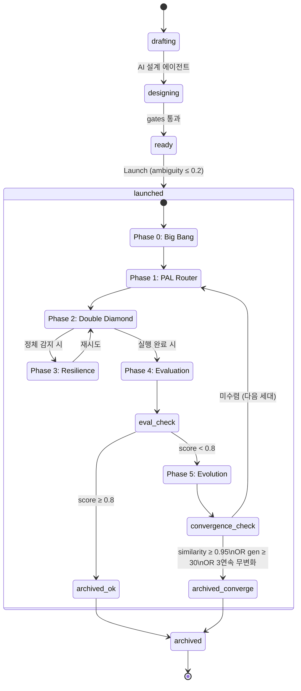

**HarnessItem.verification 상태 머신:**

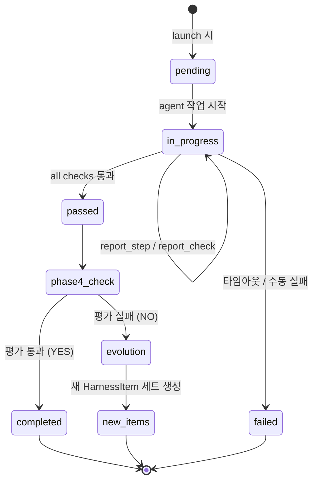

---

_작성일: 2026-03-03_
_갱신일: 2026-03-03 — 설계 검토 노트 + 실제 사용 흐름 추가_
