# 프로젝트별 격리 — 풀스택 설계

> 작성일: 2026-03-07
> 참고: Paperclip의 company-scoped isolation 패턴

## 목표

같은 에이전트 팀(루다, 이든, 세움, 윤슬 등)을 유지하면서 여러 창업 프로젝트를 **컨텍스트 분리**하여 운영한다.

에이전트가 "프로젝트 A 작업"을 할 때는 A의 목표·제약·결정사항·코드베이스만 보고,
"프로젝트 B 작업"을 할 때는 B 컨텍스트만 보게 한다.

---

## 시스템 아키텍처 개요

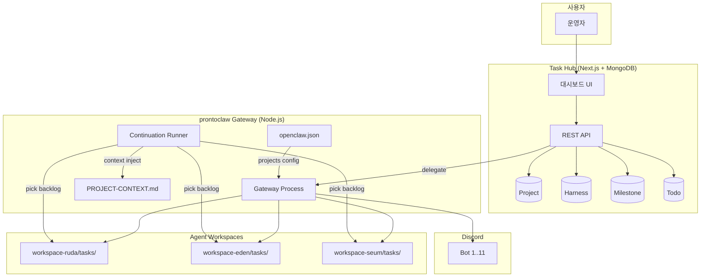

---

## 현재 구조 (문제점)

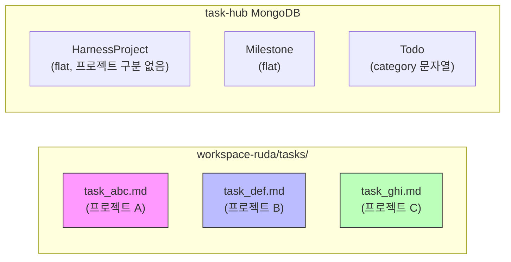

**문제:**

1. 에이전트의 태스크 목록에 **모든 프로젝트 작업이 섞여** 있음
2. 태스크 시작 시 "이 작업이 어떤 프로젝트인지" 컨텍스트가 명시적이지 않음
3. Harness/Milestone이 프로젝트에 소속되지 않음
4. 에이전트가 프로젝트 A 작업 중 프로젝트 B의 정보를 참조할 수 있음 (격리 없음)

---

## 변경 후 구조 (목표)

```mermaid
graph TB
  subgraph "Project A (resonar)"
    direction TB
    HA[HarnessProject A]
    MA[Milestone A]
    TA_1["task_abc.md<br/>projectSlug: resonar"]
    TA_2["task_xyz.md<br/>projectSlug: resonar"]
    CTXA["PROJECT-CONTEXT.md<br/>(A의 미션/스택/제약)"]
  end

  subgraph "Project B"
    direction TB
    HB[HarnessProject B]
    MB[Milestone B]
    TB_1["task_def.md<br/>projectSlug: proj-b"]
    CTXB["PROJECT-CONTEXT.md<br/>(B의 미션/스택/제약)"]
  end

  subgraph "개인 (projectSlug: null)"
    direction TB
    TD_P["Todo: 공부, 건강 등"]
  end

  style TA_1 fill:#f9f,stroke:#333
  style TA_2 fill:#f9f,stroke:#333
  style TB_1 fill:#bbf,stroke:#333
```

---

## Paperclip에서 배울 점

Paperclip의 핵심 격리 패턴:

| 패턴                   | Paperclip 구현                                        | 우리에게 적용                                      |
| ---------------------- | ----------------------------------------------------- | -------------------------------------------------- |
| **Company 스코핑**     | 모든 테이블에 `company_id` FK, 모든 쿼리에 where 조건 | 모든 엔티티에 `projectSlug` 필드                   |
| **에이전트-회사 소속** | `agents.company_id` — 에이전트는 하나의 회사에 소속   | 에이전트는 **여러 프로젝트에 소속 가능** (N:M)     |
| **Goal 계층**          | company → goals → projects → issues                   | project → harness/milestone → tasks                |
| **컨텍스트 주입**      | 에이전트 실행 시 회사 미션/목표를 프롬프트에 주입     | 태스크 시작 시 프로젝트 컨텍스트를 프롬프트에 주입 |
| **비용 격리**          | `cost_events.company_id`로 회사별 비용 집계           | (후속) 프로젝트별 토큰 사용량 집계                 |

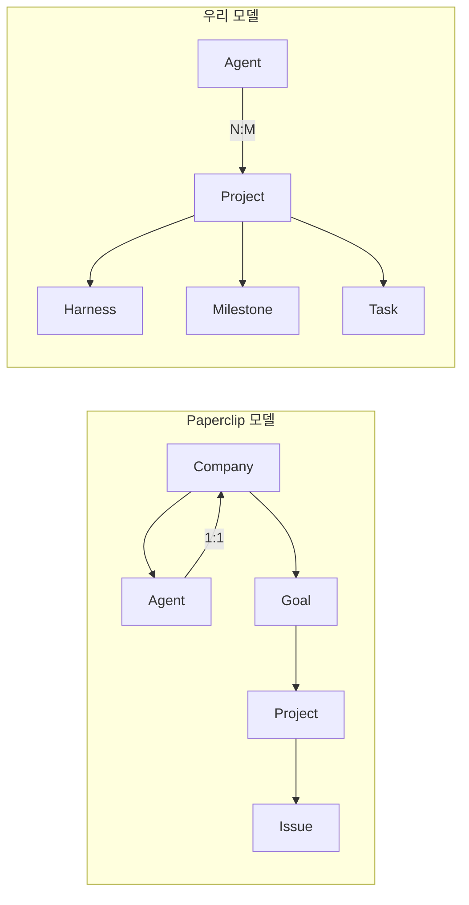

**Paperclip과 다른 점:**

- Paperclip: 에이전트 = 1개 회사 (고정 소속)
- 우리: 에이전트 = N개 프로젝트 (유동 할당) — 같은 팀이 여러 프로젝트를 돌리니까

---

## 설계

### 1. 프로젝트 정의 (Configuration Layer)

#### 1-1. openclaw.json에 projects 섹션 추가

```jsonc
// openclaw.json
{
  "agents": {
    "list": [
      { "id": "ruda", "name": "루다", ... },
      { "id": "eden", "name": "이든", ... },
      ...
    ],

    // NEW: 프로젝트 정의
    "projects": [
      {
        "slug": "resonar",
        "name": "레소나",
        "description": "음악 스트리밍 서비스",
        "repoPath": "/path/to/resonar",
        "agents": ["ruda", "eden", "yunseul"],
        "contextFile": "PROJECT-CONTEXT.md"
      },
      {
        "slug": "project-beta",
        "name": "프로젝트 B",
        "description": "프로젝트 B 설명",
        "repoPath": "/path/to/project-beta",
        "agents": ["eden", "seum"],
        "contextFile": "PROJECT-CONTEXT.md"
      }
    ]
  }
}
```

**설정 필드 상세:**

| 필드          | 타입     | 필수 | 설명                                                  |
| ------------- | -------- | ---- | ----------------------------------------------------- |
| `slug`        | string   | Y    | URL-safe 식별자. API/태스크에서 참조용                |
| `name`        | string   | Y    | 표시명 (한글 가능)                                    |
| `description` | string   | N    | 프로젝트 한 줄 설명                                   |
| `repoPath`    | string   | N    | Git 저장소 절대 경로. 에이전트 작업 디렉토리로 사용   |
| `agents`      | string[] | Y    | 소속 에이전트 ID 목록                                 |
| `contextFile` | string   | N    | 프로젝트 컨텍스트 파일명 (기본: `PROJECT-CONTEXT.md`) |

#### 1-2. 프로젝트 컨텍스트 파일

각 프로젝트 저장소(또는 별도 경로)에 `PROJECT-CONTEXT.md` 파일을 둔다.
에이전트가 해당 프로젝트 태스크를 시작할 때 이 파일이 프롬프트에 주입된다.

```markdown
# 레소나 (Resonar)

## 미션

음악 스트리밍의 새로운 경험을 만든다.

## 현재 단계

MVP 개발 중. 핵심 기능: 플레이리스트 생성, 추천 알고리즘, 소셜 공유.

## 기술 스택

- Frontend: Next.js 15, TypeScript, Tailwind
- Backend: Node.js, PostgreSQL, Redis
- Infra: Vercel, Supabase

## 핵심 제약

- 저작권 이슈로 음원 직접 호스팅 불가 → 외부 API 연동
- MVP는 웹만 (모바일 후순위)

## 최근 결정사항

- 2026-03-01: 추천 알고리즘은 collaborative filtering 우선
- 2026-02-28: 인증은 Supabase Auth 사용

## 디렉토리 구조

src/
├── app/ # Next.js pages
├── lib/ # 공통 유틸
├── components/ # UI 컴포넌트
└── server/ # API routes
```

이 패턴은 Paperclip의 "Company mission → Goal alignment" 개념을 파일 기반으로 구현한 것.

**컨텍스트 파일의 역할:**

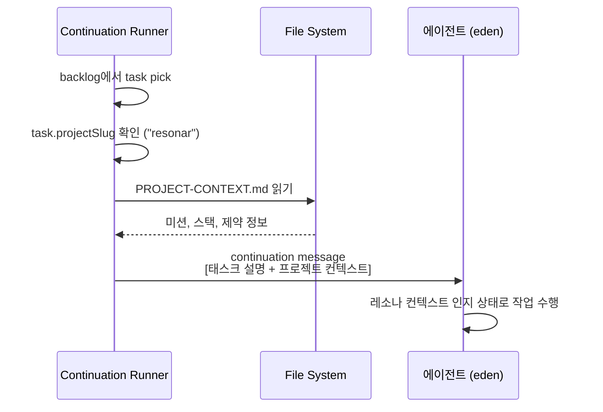

---

### 2. 태스크 레이어 (prontoclaw)

#### 2-1. TaskFile에 projectSlug 필드 추가

```typescript
// task-file-io.ts — TaskFile interface 확장
interface TaskFile {
  // 기존 필드
  id: string;
  status: TaskStatus;
  priority: Priority;
  description: string;
  context?: string;
  progress: string[];
  steps?: TaskStep[];
  workSessionId: string;
  assignee: string;
  harnessProjectSlug?: string;
  harnessItemId?: string;
  milestoneId?: string;
  milestoneItemId?: string;

  // NEW: 프로젝트 소속
  projectSlug?: string; // "resonar", "project-beta", null(개인)
}
```

마크다운 태스크 파일의 Backlog 섹션:

```markdown
## Backlog

{
"id": "task_abc123",
"status": "backlog",
"projectSlug": "resonar",
"description": "추천 알고리즘 API 엔드포인트 구현",
"harnessProjectSlug": "resonar-mvp",
"assignee": "eden",
"priority": "high"
}
```

#### 2-2. 태스크 도구에 프로젝트 컨텍스트 주입

```typescript
// task-blocking.ts 또는 openclaw-tools.ts

// task_start, task_pick_backlog 실행 시:
function injectProjectContext(task: TaskFile, config: AgentConfig): string {
  if (!task.projectSlug) return "";

  const project = config.projects.find((p) => p.slug === task.projectSlug);
  if (!project) return "";

  // 프로젝트 컨텍스트 파일 읽기
  const contextPath = resolveProjectContextPath(project);
  if (!fs.existsSync(contextPath)) return "";

  const context = fs.readFileSync(contextPath, "utf-8");

  return `\n\n---\n## 프로젝트 컨텍스트: ${project.name}\n${context}\n---\n`;
}

// 컨텍스트 파일 경로 결정
function resolveProjectContextPath(project: ProjectConfig): string {
  // Option A: 레포 안의 컨텍스트 파일
  if (project.repoPath) {
    const repoCtx = path.join(project.repoPath, project.contextFile || "PROJECT-CONTEXT.md");
    if (fs.existsSync(repoCtx)) return repoCtx;
  }

  // Option B: 중앙 관리 경로 (fallback)
  return path.join(homedir(), ".openclaw", "projects", project.slug, "context.md");
}
```

**에이전트가 태스크를 시작할 때의 흐름:**

1. `task_pick_backlog` 또는 `task_start` 호출
2. `projectSlug`가 있으면 해당 프로젝트의 `PROJECT-CONTEXT.md`를 읽어서 continuation message에 포함
3. 에이전트는 해당 프로젝트의 목표·기술스택·제약·결정사항을 알고 작업 시작
4. 작업 완료 후 다음 태스크가 다른 프로젝트면, 해당 프로젝트의 컨텍스트로 자동 전환

#### 2-3. Backlog 필터링 (프로젝트 기반)

```typescript
// task_list, task_pick_backlog에 프로젝트 필터 추가

// 에이전트가 "레소나 작업만 보여줘"라고 하면:
task_list({ projectSlug: "resonar" });

// continuation runner가 backlog에서 태스크를 고를 때:
// 에이전트의 소속 프로젝트에 해당하는 태스크만 선택
function pickNextBacklogTask(agentId: string, config: AgentConfig): TaskFile | null {
  const agentProjects = config.projects
    .filter((p) => p.agents.includes(agentId))
    .map((p) => p.slug);

  const backlogTasks = listBacklogTasks(agentId);

  // 우선순위: 1) 소속 프로젝트 태스크 2) 프로젝트 미지정 태스크
  return backlogTasks.find((t) => !t.projectSlug || agentProjects.includes(t.projectSlug));
}
```

**Backlog 필터링 로직:**

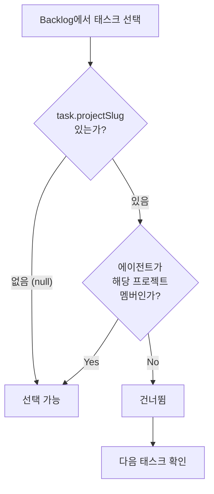

#### 2-4. 크로스 프로젝트 태스크 할당 검증

```typescript
// task_backlog_add에서 프로젝트 멤버십 검증
function validateCrossProjectAssignment(
  sourceAgent: string,
  targetAgent: string,
  projectSlug: string | undefined,
  config: AgentConfig,
): { allowed: boolean; warning?: string } {
  if (!projectSlug) return { allowed: true }; // 프로젝트 없는 태스크는 자유롭게

  const project = config.projects.find((p) => p.slug === projectSlug);
  if (!project) return { allowed: true };

  const isMember = project.agents.includes(targetAgent);

  if (!isMember) {
    // Soft boundary: 경고 후 허용
    return {
      allowed: true,
      warning: `⚠️ ${targetAgent}는 ${project.name} 프로젝트의 멤버가 아닙니다. 태스크를 할당하지만, 프로젝트 컨텍스트가 제한될 수 있습니다.`,
    };
  }

  return { allowed: true };
}
```

> **Paperclip 대비:** Paperclip은 company 경계를 넘는 할당을 완전히 차단한다 (Hard boundary).
> 우리는 **경고 후 허용** (Soft boundary) — 같은 팀이니까 유연하게.

---

### 3. Gateway 레이어

#### 3-1. 태스크 생성 시 projectSlug 전달

```typescript
// gateway.ts — delegateToAgent 확장

interface DelegateOptions {
  agentId: string;
  description: string;
  priority: string;
  // NEW
  projectSlug?: string;
  // 기존
  harnessProjectSlug?: string;
  harnessItemId?: string;
  milestoneId?: string;
}

// task_backlog_add 호출 시 projectSlug 포함
await callAgentTool(agentId, "task_backlog_add", {
  description,
  priority,
  projectSlug, // NEW
  harnessProjectSlug,
  harnessItemId,
});
```

#### 3-2. Continuation Runner — 프로젝트 컨텍스트 주입

```typescript
// task-continuation-runner.ts

// 태스크 연속 실행 시, 프로젝트 컨텍스트를 메시지에 포함
function buildContinuationMessage(task: TaskFile, config: AgentConfig): string {
  let message = `다음 태스크를 시작합니다: ${task.description}`;

  // 프로젝트 컨텍스트 주입
  if (task.projectSlug) {
    const project = config.projects.find((p) => p.slug === task.projectSlug);
    if (project) {
      const contextContent = readProjectContext(project);
      message += `\n\n[프로젝트: ${project.name}]\n${contextContent}`;

      // 작업 디렉토리 힌트
      if (project.repoPath) {
        message += `\n\n작업 디렉토리: ${project.repoPath}`;
      }
    }
  }

  // 하네스 컨텍스트 (기존)
  if (task.harnessProjectSlug) {
    message += `\n\nHarness 프로젝트: ${task.harnessProjectSlug}`;
  }

  return message;
}
```

#### 3-3. Gateway 전체 흐름

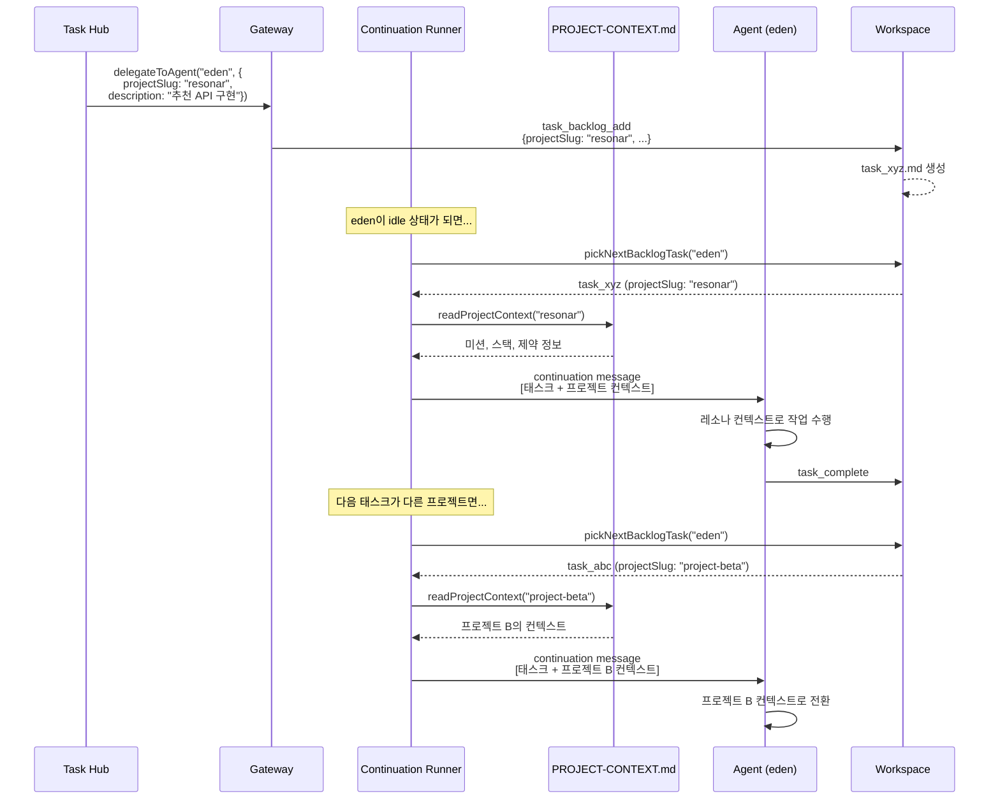

---

### 4. Task Hub 레이어 (MongoDB + UI)

#### 4-1. Project 모델

```typescript
// task-hub/src/models/Project.ts
const ProjectSchema = new Schema(
  {
    slug: { type: String, required: true, unique: true, index: true },
    name: { type: String, required: true },
    description: { type: String },
    color: { type: String, required: true, default: "#6366f1" },
    icon: { type: String },
    status: {
      type: String,
      enum: ["active", "paused", "archived"],
      default: "active",
    },

    agents: [
      {
        agentId: { type: String, required: true },
        role: { type: String }, // "lead", "developer", "marketer"
      },
    ],

    repoPath: { type: String },
    contextFilePath: { type: String },
    links: [
      {
        label: { type: String, required: true },
        url: { type: String, required: true },
      },
    ],
  },
  { timestamps: true },
);
```

#### 4-2. 기존 모델 확장

```typescript
// HarnessProject — projectSlug 추가
HarnessProjectSchema.add({
  projectSlug: { type: String, index: true },
});

// Milestone — projectSlug 추가
MilestoneSchema.add({
  projectSlug: { type: String, index: true },
});

// Todo — projectSlug 추가, category를 deprecated
TodoSchema.add({
  projectSlug: { type: String, index: true },
  // category 필드는 유지하되 deprecated 마킹
});
```

#### 4-3. 엔티티 관계

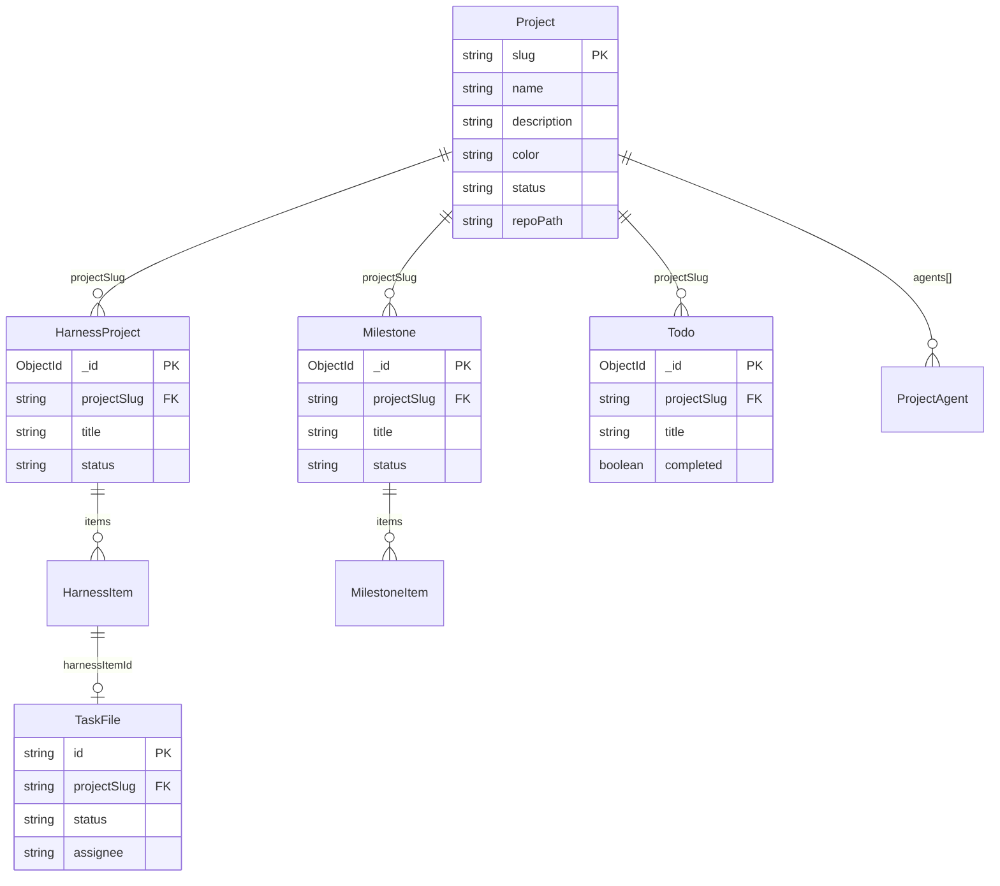

#### 4-4. API 설계

**Project CRUD:**

```
GET    /api/projects              # 프로젝트 목록 (status 필터 가능)
POST   /api/projects              # 프로젝트 생성
GET    /api/projects/[slug]       # 프로젝트 상세
PATCH  /api/projects/[slug]       # 프로젝트 수정
DELETE /api/projects/[slug]       # 프로젝트 삭제 (soft → archived)
```

**Dashboard 집계 API:**

```
GET /api/projects/[slug]/dashboard
```

```typescript
// 응답 타입
interface ProjectDashboard {
  project: Project;
  summary: {
    harness: {
      total: number;
      byStatus: Record<"drafting" | "designing" | "ready" | "launched", number>;
    };
    milestones: {
      total: number;
      active: number;
      completed: number;
    };
    tasks: {
      active: number;
      blocked: number;
      completed: number;
      backlog: number;
    };
    todos: {
      total: number;
      completed: number;
      delegated: number;
    };
    agents: {
      assigned: number;
      activeNow: number; // 현재 해당 프로젝트 태스크 수행 중인 에이전트 수
    };
  };
  recentActivity: CoordinationEvent[]; // 최근 10건
}
```

**기존 API에 projectSlug 필터 추가:**

```
GET /api/harness?projectSlug=resonar
GET /api/milestones?projectSlug=resonar
GET /api/todos?projectSlug=resonar
GET /api/tasks?projectSlug=resonar
GET /api/events/stream?projectSlug=resonar  # SSE 이벤트 필터링
```

#### 4-5. 대시보드 UI

프로젝트 목록 (`/projects`) → 프로젝트 대시보드 (`/projects/[slug]`)
(상세 UI 설계는 `task-hub/docs/plans/2026-03-06-project-isolation-dashboard.md` 참조)

---

### 5. 데이터 흐름 (End-to-End)

#### 시나리오 1: Harness Launch → 에이전트 실행 → 검증 완료

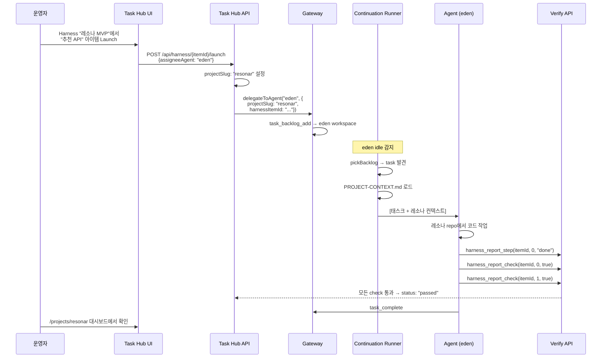

#### 시나리오 2: 에이전트의 프로젝트 간 컨텍스트 전환

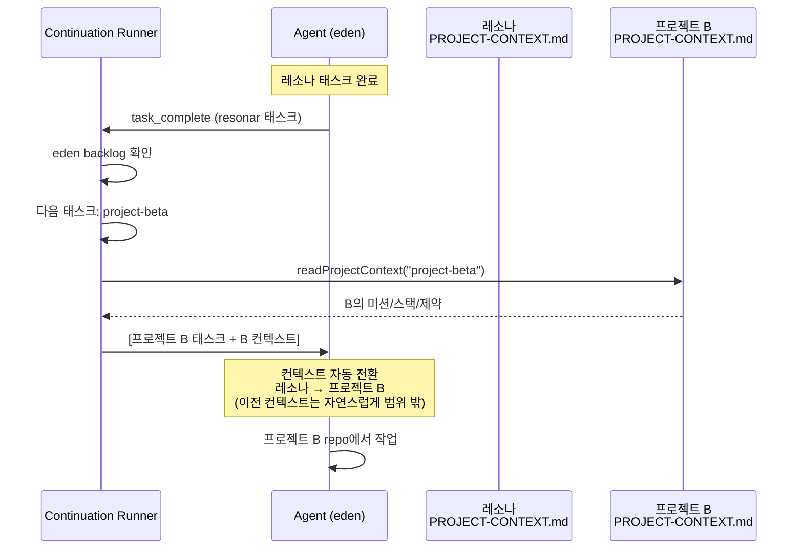

---

### 6. 프로젝트 컨텍스트 관리 전략

#### 6-1. 컨텍스트 파일 위치 결정

```mermaid
flowchart TD
  Start[컨텍스트 파일 경로 결정] --> HasRepo{project.repoPath<br/>있는가?}
  HasRepo -- "Yes" --> RepoFile{repoPath/PROJECT-CONTEXT.md<br/>존재하는가?}
  RepoFile -- "Yes" --> UseRepo[레포 내 파일 사용]
  RepoFile -- "No" --> UseCentral
  HasRepo -- "No" --> UseCentral[중앙 경로 사용<br/>~/.openclaw/projects/{slug}/context.md]
```

**추천: Option A (레포 안) + Option B (중앙 관리) 혼합**

- `repoPath`가 있으면 레포 안의 컨텍스트 파일 우선 사용
- 없으면 중앙 경로에서 읽기
- Task Hub UI에서 컨텍스트 파일 내용 미리보기 + 편집 링크 제공

#### 6-2. 컨텍스트 갱신

프로젝트 컨텍스트는 **살아있는 문서**. 에이전트가 중요한 결정을 내리면 자동 갱신할 수 있다:

```typescript
// 에이전트 도구 추가 (선택적, 후속 구현)
project_update_context({
  projectSlug: "resonar",
  section: "최근 결정사항",
  append: "2026-03-07: Redis 대신 Upstash KV 사용 결정 (서버리스 호환)",
});
```

#### 6-3. 컨텍스트 파일 권장 구조

```markdown
# {프로젝트명}

## 미션

(한 문장으로 프로젝트의 존재 이유)

## 현재 단계

(현재 어디까지 진행되었는지, 다음 마일스톤)

## 기술 스택

(프레임워크, 언어, 인프라, 주요 라이브러리)

## 핵심 제약

(기술적/비즈니스적 제약사항)

## 아키텍처 개요

(주요 모듈, 데이터 흐름)

## 최근 결정사항

(날짜순, 에이전트가 참조해야 할 설계 결정)

## 디렉토리 구조

(주요 디렉토리와 역할)

## 코딩 컨벤션

(네이밍, 패턴, 금지사항 등)
```

---

### 7. 수정 범위 요약

#### prontoclaw (gateway)

| 파일                                    | 변경                                                      | 영향도 | 상세                                 |
| --------------------------------------- | --------------------------------------------------------- | ------ | ------------------------------------ |
| `openclaw.json` (config)                | `projects` 섹션 추가                                      | 소     | 설정만 추가, 기존 필드 변경 없음     |
| `src/infra/task-file-io.ts`             | `TaskFile`에 `projectSlug` 필드                           | 소     | optional 필드, 하위호환              |
| `src/infra/task-continuation-runner.ts` | 프로젝트 컨텍스트 주입 로직                               | 중     | `buildContinuationMessage` 수정      |
| `src/agent/openclaw-tools.ts`           | `task_start`, `task_backlog_add`에 `projectSlug` 파라미터 | 소     | 도구 스키마에 optional 파라미터 추가 |
| `src/agent/task-blocking.ts`            | backlog 필터링에 프로젝트 조건                            | 소     | `pickNextBacklogTask` 로직 추가      |
| `src/infra/agent-scope.ts`              | `resolveAgentProjects()` 유틸                             | 소     | 신규 함수 추가                       |

#### task-hub

| 파일                                             | 변경                                 | 영향도 | 상세                     |
| ------------------------------------------------ | ------------------------------------ | ------ | ------------------------ |
| `src/models/Project.ts`                          | 신규 모델                            | 신규   | Mongoose 스키마 + 인덱스 |
| `src/models/Harness.ts`                          | `+ projectSlug`                      | 소     | optional 필드 추가       |
| `src/models/Milestone.ts`                        | `+ projectSlug`                      | 소     | optional 필드 추가       |
| `src/models/Todo.ts`                             | `+ projectSlug`, category deprecated | 소     | 마이그레이션 필요        |
| `src/app/api/projects/route.ts`                  | GET + POST                           | 신규   | 프로젝트 CRUD            |
| `src/app/api/projects/[slug]/route.ts`           | GET + PATCH + DELETE                 | 신규   |                          |
| `src/app/api/projects/[slug]/dashboard/route.ts` | 집계 API                             | 신규   | MongoDB aggregation      |
| `src/app/projects/page.tsx`                      | 목록 페이지                          | 신규   | 프로젝트 카드 그리드     |
| `src/app/projects/[slug]/page.tsx`               | 대시보드                             | 신규   | Stats + 탭 + 활동 피드   |
| `src/components/ProjectSelector.tsx`             | 공통 필터 드롭다운                   | 신규   | URL 파라미터 연동        |
| `src/components/ProjectCard.tsx`                 | 프로젝트 카드                        | 신규   | 집계 수치 + 에이전트     |
| 기존 API routes (harness, milestones, todos)     | `?projectSlug` 필터 추가             | 소     | 쿼리 조건 추가           |
| 기존 페이지들                                    | 프로젝트 필터 드롭다운               | 소     | ProjectSelector 삽입     |
| 사이드바/Layout                                  | "프로젝트" 메뉴 추가                 | 소     | 네비게이션 항목 추가     |
| `scripts/migrate-categories.ts`                  | 카테고리→프로젝트 마이그레이션       | 신규   | 일회성 스크립트          |

---

### 8. 구현 순서

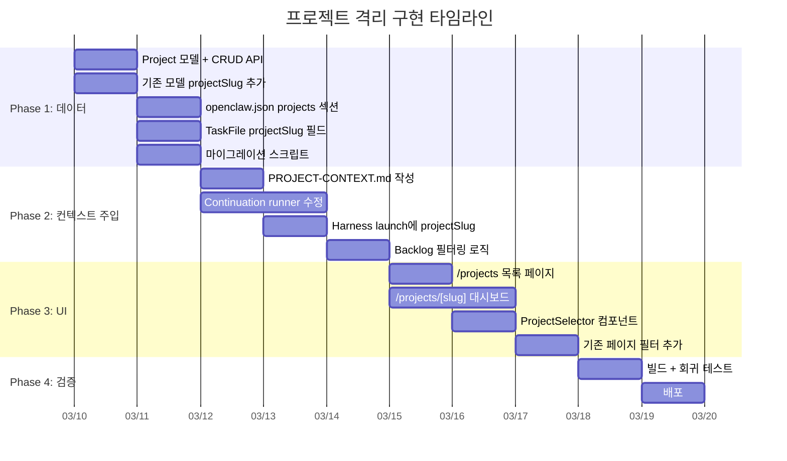

---

### 9. Paperclip 대비 우리만의 차별점

| 측면                   | Paperclip                        | 우리 (prontoclaw)                              |
| ---------------------- | -------------------------------- | ---------------------------------------------- |
| 에이전트-프로젝트 관계 | 1:1 (고정 소속)                  | **N:M** (한 에이전트가 여러 프로젝트)          |
| 컨텍스트 전환          | 불가 (다른 회사 = 다른 에이전트) | **태스크 단위로 자동 전환**                    |
| 격리 강도              | Hard (DB 레벨 완전 격리)         | **Soft** (메타데이터 기반, 필요시 크로스 가능) |
| 프로젝트 컨텍스트      | DB에 mission/goal 저장           | **파일 기반** (PROJECT-CONTEXT.md)             |
| 실행 모델              | Paperclip이 직접 에이전트 invoke | Gateway가 실행, Task Hub는 관찰                |
| 비용 추적              | 내장 (cost_events + budget)      | 후속 구현 (프로젝트별 집계)                    |
| 거버넌스               | 내장 (approval gates)            | 후속 구현 (Harness gate 확장)                  |

---

### 10. 후속 확장

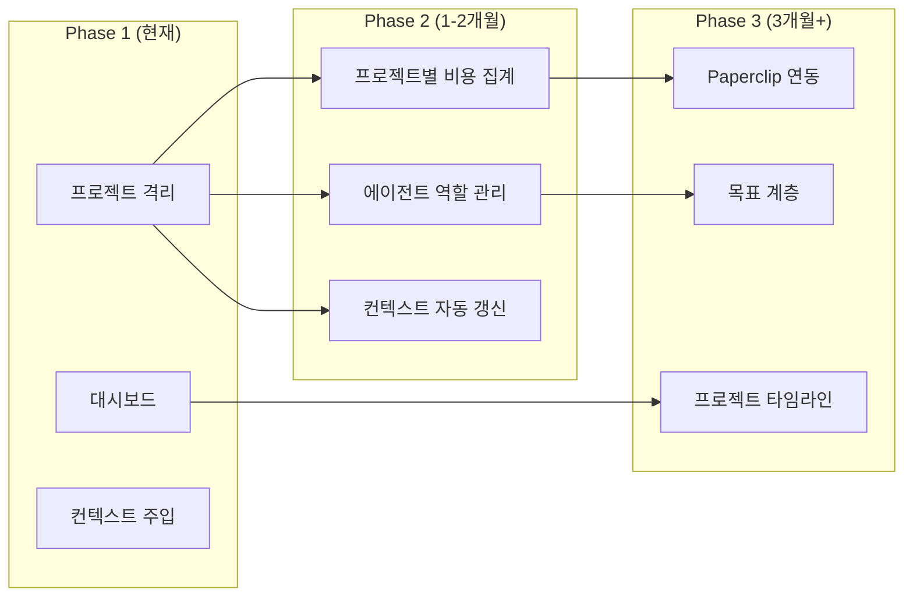

| 기능                        | 설명                                                  | 시기    |
| --------------------------- | ----------------------------------------------------- | ------- |
| 프로젝트별 비용 집계        | gateway 이벤트에서 토큰 사용량을 projectSlug별로 집계 | Phase 2 |
| 프로젝트별 에이전트 역할    | 프로젝트 안에서 에이전트의 역할(lead, dev 등) 지정    | Phase 2 |
| 프로젝트 컨텍스트 자동 갱신 | 에이전트가 결정사항을 자동으로 context 파일에 추가    | Phase 2 |
| Paperclip 연동              | Paperclip을 상위 레이어로 배포, API 연동              | Phase 3 |
| 목표 계층                   | 프로젝트 → 목표 → 마일스톤 → 태스크                   | Phase 3 |
| 프로젝트 타임라인           | 간트 차트 또는 타임라인 뷰                            | Phase 3 |
