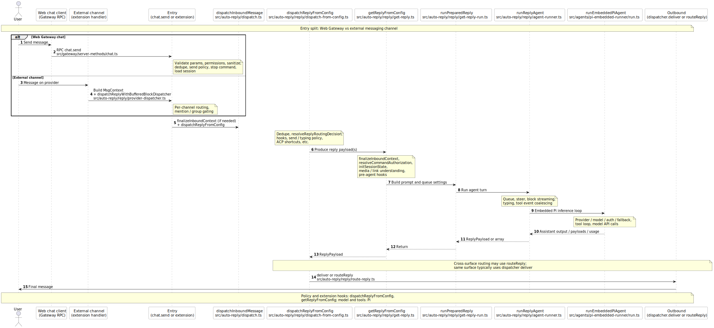

# Inbound chat reply sequence

This diagram shows the main code path when a user sends a message that should trigger an OpenClaw
reply. Two entry points converge on the same auto-reply pipeline: **Gateway Web Chat** (`chat.send`)
and **external messaging channels** (bundled extensions and similar handlers).

For the embedded model loop and stream semantics in more detail, see [Agent Loop](/concepts/agent-loop).

**Note:** The CLI `openclaw agent` path runs a different command-oriented pipeline; it still uses
`runEmbeddedPiAgent` for the model run but does not go through `dispatchReplyFromConfig` /
`getReplyFromConfig` shown here.

## Sequence diagram

Source file: [`chat-inbound-reply-sequence.puml`](./chat-inbound-reply-sequence.puml)

To regenerate the SVG after editing the `.puml` file, run `scripts/render-docs-umls.sh` from the
repo root (see `docs/UMLs/README.md`).

## Key source files (quick index)

| Stage                              | Primary modules                                                                |
| ---------------------------------- | ------------------------------------------------------------------------------ |
| Gateway chat RPC                   | `src/gateway/server-methods/chat.ts` (`chat.send`)                             |
| Buffered dispatch wrapper          | `src/auto-reply/reply/provider-dispatcher.ts`, `src/auto-reply/dispatch.ts`    |
| Inbound policy and hooks           | `src/auto-reply/reply/dispatch-from-config.ts`                                 |
| Session and reply assembly         | `src/auto-reply/reply/get-reply.ts`, `src/auto-reply/reply/get-reply-run.ts`   |
| Agent turn orchestration           | `src/auto-reply/reply/agent-runner.ts`                                         |
| Model and tool execution           | `src/agents/pi-embedded-runner/run.ts`                                         |
| Cross-channel send                 | `src/auto-reply/reply/route-reply.ts`, `src/infra/outbound/deliver-runtime.ts` |
| Plugin pattern (record + dispatch) | `src/plugin-sdk/inbound-reply-dispatch.ts`                                     |
