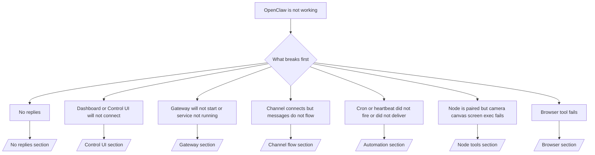

# استكشاف الأخطاء وإصلاحها

إذا كان لديك دقيقتان فقط، فاستخدم هذه الصفحة كنقطة دخول لفرز المشكلة بسرعة.

## أول 60 ثانية

قم بتشغيل هذا السلم بالضبط بالترتيب:

```bash
openclaw status
openclaw status --all
openclaw gateway probe
openclaw gateway status
openclaw doctor
openclaw channels status --probe
openclaw logs --follow
```

المخرجات الجيدة في سطر واحد:

- `openclaw status` → يعرض القنوات المُهيّأة ولا توجد أخطاء مصادقة واضحة.
- `openclaw status --all` → التقرير الكامل موجود وقابل للمشاركة.
- `openclaw gateway probe` → هدف Gateway المتوقع قابل للوصول.
- `openclaw gateway status` → `Runtime: running` و `RPC probe: ok`.
- `openclaw doctor` → لا توجد أخطاء تهيئة/خدمة مُعيقة.
- `openclaw channels status --probe` → القنوات تُبلِغ عن `connected` أو `ready`.
- `openclaw logs --follow` → نشاط مستقر، بلا أخطاء فادحة متكررة.

## شجرة القرار



<AccordionGroup>
  <Accordion title="No replies">
    ```bash
    openclaw status
    openclaw gateway status
    openclaw channels status --probe
    openclaw pairing list <channel>
    openclaw logs --follow
    ```

    ```
    تبدو المخرجات الجيدة كما يلي:
    
    - `Runtime: running`
    - `RPC probe: ok`
    - تظهر قناتك على أنها متصلة/جاهزة في `channels status --probe`
    - يبدو أن المُرسِل مُعتمد (أو أن سياسة الرسائل الخاصة مفتوحة/قائمة السماح)
    
    تواقيع السجلات الشائعة:
    
    - `drop guild message (mention required` → حظر التحكّم في الإشارات الرسالة في Discord.
    - `pairing request` → المُرسِل غير مُعتمد وينتظر موافقة إقران الرسائل الخاصة.
    - `blocked` / `allowlist` في سجلات القناة → تمت تصفية المُرسِل أو الغرفة أو المجموعة.
    
    صفحات متعمقة:
    
    - [/gateway/troubleshooting#no-replies](/gateway/troubleshooting#no-replies)
    - [/channels/troubleshooting](/channels/troubleshooting)
    - [/channels/pairing](/channels/pairing)
    ```

  </Accordion>

  <Accordion title="Dashboard or Control UI will not connect">
    ```bash
    openclaw status
    openclaw gateway status
    openclaw logs --follow
    openclaw doctor
    openclaw channels status --probe
    ```

    ```
    تبدو المخرجات الجيدة كما يلي:
    
    - يظهر `Dashboard: http://...` في `openclaw gateway status`
    - `RPC probe: ok`
    - لا توجد حلقة مصادقة في السجلات
    
    تواقيع السجلات الشائعة:
    
    - `device identity required` → سياق HTTP/غير آمن لا يمكنه إكمال مصادقة الجهاز.
    - `unauthorized` / حلقة إعادة الاتصال → رمز/كلمة مرور خاطئة أو عدم تطابق وضع المصادقة.
    - `gateway connect failed:` → الواجهة تستهدف عنوان URL/منفذًا خاطئًا أو أن Gateway غير قابل للوصول.
    
    صفحات متعمقة:
    
    - [/gateway/troubleshooting#dashboard-control-ui-connectivity](/gateway/troubleshooting#dashboard-control-ui-connectivity)
    - [/web/control-ui](/web/control-ui)
    - [/gateway/authentication](/gateway/authentication)
    ```

  </Accordion>

  <Accordion title="Gateway will not start or service installed but not running">
    ```bash
    openclaw status
    openclaw gateway status
    openclaw logs --follow
    openclaw doctor
    openclaw channels status --probe
    ```

    ```
    تبدو المخرجات الجيدة كما يلي:
    
    - `Service: ... (loaded)`
    - `Runtime: running`
    - `RPC probe: ok`
    
    تواقيع السجلات الشائعة:
    
    - `Gateway start blocked: set gateway.mode=local` → وضع Gateway غير مُعيّن/بعيد.
    - `refusing to bind gateway ... without auth` → ربط غير local loopback دون رمز/كلمة مرور.
    - `another gateway instance is already listening` أو `EADDRINUSE` → المنفذ مستخدم بالفعل.
    
    صفحات متعمقة:
    
    - [/gateway/troubleshooting#gateway-service-not-running](/gateway/troubleshooting#gateway-service-not-running)
    - [/gateway/background-process](/gateway/background-process)
    - [/gateway/configuration](/gateway/configuration)
    ```

  </Accordion>

  <Accordion title="Channel connects but messages do not flow">
    ```bash
    openclaw status
    openclaw gateway status
    openclaw logs --follow
    openclaw doctor
    openclaw channels status --probe
    ```

    ```
    تبدو المخرجات الجيدة كما يلي:
    
    - نقل القناة متصل.
    - اجتياز فحوصات الإقران/قائمة السماح.
    - اكتشاف الإشارات حيثما كان مطلوبًا.
    
    تواقيع السجلات الشائعة:
    
    - `mention required` → حظر التحكّم في إشارات المجموعة المعالجة.
    - `pairing` / `pending` → مُرسِل الرسائل الخاصة غير مُعتمد بعد.
    - `not_in_channel`، `missing_scope`، `Forbidden`، `401/403` → مشكلة رمز أذونات القناة.
    
    صفحات متعمقة:
    
    - [/gateway/troubleshooting#channel-connected-messages-not-flowing](/gateway/troubleshooting#channel-connected-messages-not-flowing)
    - [/channels/troubleshooting](/channels/troubleshooting)
    ```

  </Accordion>

  <Accordion title="Cron or heartbeat did not fire or did not deliver">
    ```bash
    openclaw status
    openclaw gateway status
    openclaw cron status
    openclaw cron list
    openclaw cron runs --id <jobId> --limit 20
    openclaw logs --follow
    ```

    ```
    تبدو المخرجات الجيدة كما يلي:
    
    - يُظهر `cron.status` أنه مُمكّن مع وقت إيقاظ تالٍ.
    - يُظهر `cron runs` إدخالات `ok` حديثة.
    - النبض مُمكّن وليس خارج ساعات النشاط.
    
    تواقيع السجلات الشائعة:
    
    - `cron: scheduler disabled; jobs will not run automatically` → تم تعطيل cron.
    - `heartbeat skipped` مع `reason=quiet-hours` → خارج ساعات النشاط المُهيّأة.
    - `requests-in-flight` → المسار الرئيسي مشغول؛ تم تأجيل إيقاظ النبض.
    - `unknown accountId` → حساب هدف تسليم النبض غير موجود.
    
    صفحات متعمقة:
    
    - [/gateway/troubleshooting#cron-and-heartbeat-delivery](/gateway/troubleshooting#cron-and-heartbeat-delivery)
    - [/automation/troubleshooting](/automation/troubleshooting)
    - [/gateway/heartbeat](/gateway/heartbeat)
    ```

  </Accordion>

  <Accordion title="Node is paired but tool fails camera canvas screen exec">
    ```bash
    openclaw status
    openclaw gateway status
    openclaw nodes status
    openclaw nodes describe --node <idOrNameOrIp>
    openclaw logs --follow
    ```

    ```
    تبدو المخرجات الجيدة كما يلي:
    
    - العُقدة مُدرجة على أنها متصلة ومقترنة للدور `node`.
    - توجد إمكانية للأمر الذي تستدعيه.
    - حالة الأذونات ممنوحة للأداة.
    
    تواقيع السجلات الشائعة:
    
    - `NODE_BACKGROUND_UNAVAILABLE` → إحضار تطبيق العُقدة إلى الواجهة الأمامية.
    - `*_PERMISSION_REQUIRED` → تم رفض/فقدان إذن نظام التشغيل.
    - `SYSTEM_RUN_DENIED: approval required` → موافقة التنفيذ معلّقة.
    - `SYSTEM_RUN_DENIED: allowlist miss` → الأمر غير موجود في قائمة السماح للتنفيذ.
    
    صفحات متعمقة:
    
    - [/gateway/troubleshooting#node-paired-tool-fails](/gateway/troubleshooting#node-paired-tool-fails)
    - [/nodes/troubleshooting](/nodes/troubleshooting)
    - [/tools/exec-approvals](/tools/exec-approvals)
    ```

  </Accordion>

  <Accordion title="Browser tool fails">
    ```bash
    openclaw status
    openclaw gateway status
    openclaw browser status
    openclaw logs --follow
    openclaw doctor
    ```

    ```
    تبدو المخرجات الجيدة كما يلي:
    
    - تُظهر حالة المتصفح `running: true` ومتصفحًا/ملفًا شخصيًا مُختارًا.
    - يبدأ ملف `openclaw` الشخصي أو يحتوي مُرحّل `chrome` على علامة تبويب مرفقة.
    
    تواقيع السجلات الشائعة:
    
    - `Failed to start Chrome CDP on port` → فشل تشغيل المتصفح المحلي.
    - `browser.executablePath not found` → مسار الملف التنفيذي المُهيّأ غير صحيح.
    - `Chrome extension relay is running, but no tab is connected` → الامتداد غير مرفق.
    - `Browser attachOnly is enabled ... not reachable` → ملف «attach-only» لا يحتوي على هدف CDP نشط.
    
    صفحات متعمقة:
    
    - [/gateway/troubleshooting#browser-tool-fails](/gateway/troubleshooting#browser-tool-fails)
    - [/tools/browser-linux-troubleshooting](/tools/browser-linux-troubleshooting)
    - [/tools/chrome-extension](/tools/chrome-extension)
    ```

  </Accordion>
</AccordionGroup>
