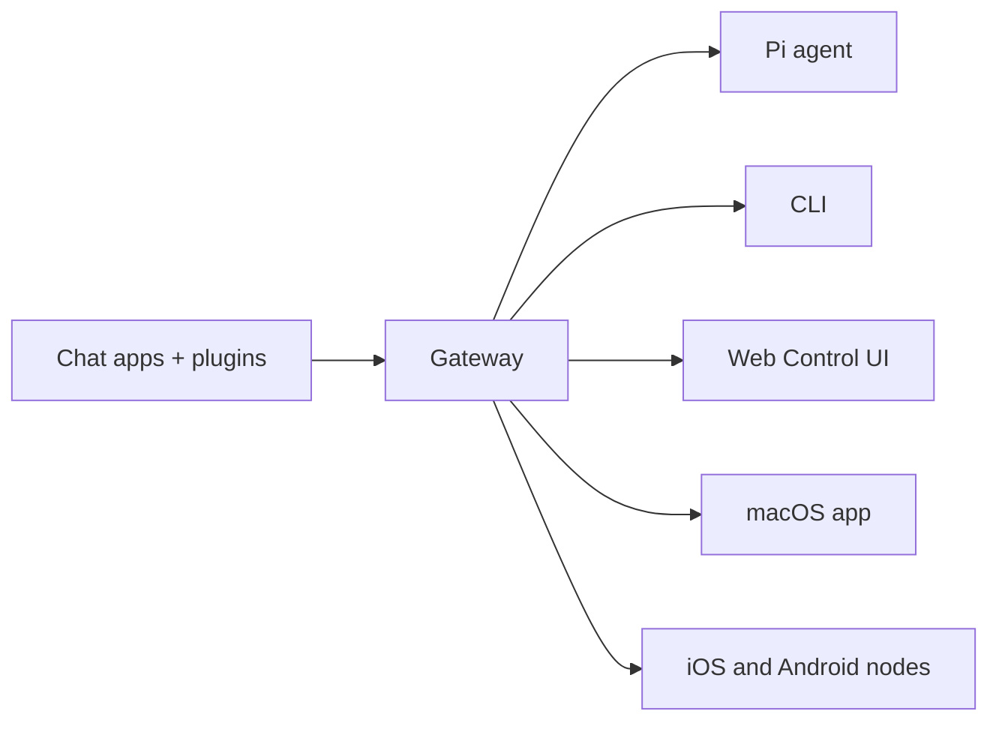

# OpenClaw 🦞

<p align="center">
    
    
</p>

> _«قَشِّر! قَشِّر!»_ — جراد بحر فضائي، على الأرجح

<p align="center"><strong>بوابة تعمل على أي نظام تشغيل لوكلاء الذكاء الاصطناعي عبر WhatsApp وTelegram وDiscord وiMessage وغيرها.</strong><br />
  أرسل رسالة، واحصل على رد من وكيل مباشرة من جيبك. تضيف الإضافات دعم Mattermost وغيرها.
</p>

<Columns>
  <Card title="Get Started" href="/start/getting-started" icon="rocket">
    ثبّت OpenClaw وشغّل Gateway خلال دقائق.
  </Card>
  <Card title="Run the Wizard" href="/start/wizard" icon="sparkles">
    إعداد موجّه باستخدام `openclaw onboard` وتدفّقات الاقتران.
  </Card>
  <Card title="Open the Control UI" href="/web/control-ui" icon="layout-dashboard">
    شغّل لوحة التحكم في المتصفح للدردشة والتهيئة والجلسات.
  </Card>
</Columns>

## ما هو OpenClaw؟

OpenClaw هو **Gateway مُستضاف ذاتيًا** يربط تطبيقات الدردشة المفضلة لديك — WhatsApp وTelegram وDiscord وiMessage وغيرها — بوكلاء ذكاء اصطناعي للبرمجة مثل Pi. تقوم بتشغيل عملية Gateway واحدة على جهازك (أو على خادم)، لتصبح الجسر بين تطبيقات المراسلة ومساعد ذكاء اصطناعي متاح دائمًا.

**لمن هو؟** للمطوّرين والمستخدمين المتقدمين الذين يريدون مساعد ذكاء اصطناعي شخصيًا يمكن مراسلته من أي مكان — من دون التخلّي عن التحكم في بياناتهم أو الاعتماد على خدمة مُستضافة.

**ما الذي يجعله مختلفًا؟**

- **استضافة ذاتية**: يعمل على عتادك، وفق قواعدك
- **تعدد القنوات**: Gateway واحد يخدم WhatsApp وTelegram وDiscord وغيرها في الوقت نفسه
- **مُهيّأ للوكلاء**: مبني لوكلاء البرمجة مع استخدام الأدوات والجلسات والذاكرة والتوجيه متعدد الوكلاء
- **مفتوح المصدر**: بترخيص MIT ومدفوع بالمجتمع

**ما الذي تحتاجه؟** Node 22+، ومفتاح API (يوصى بـ Anthropic)، و5 دقائق.

## كيف يعمل



Gateway هو مصدر الحقيقة الوحيد للجلسات والتوجيه واتصالات القنوات.

## القدرات الرئيسية

<Columns>
  <Card title="Multi-channel gateway" icon="network">
    WhatsApp وTelegram وDiscord وiMessage باستخدام عملية Gateway واحدة.
  </Card>
  <Card title="Plugin channels" icon="plug">
    أضف Mattermost وغيرها عبر حزم التوسعة.
  </Card>
  <Card title="Multi-agent routing" icon="route">
    جلسات معزولة لكل وكيل أو مساحة عمل أو مُرسِل.
  </Card>
  <Card title="Media support" icon="image">
    إرسال واستقبال الصور والصوتيات والمستندات.
  </Card>
  <Card title="Web Control UI" icon="monitor">
    لوحة تحكم في المتصفح للدردشة والتهيئة والجلسات والعُقد.
  </Card>
  <Card title="Mobile nodes" icon="smartphone">
    إقران عُقد iOS وAndroid مع دعم Canvas.
  </Card>
</Columns>

## البدء السريع

<Steps>
  <Step title="Install OpenClaw">
    ```bash
    npm install -g openclaw@latest
    ```
  </Step>
  <Step title="Onboard and install the service">
    ```bash
    openclaw onboard --install-daemon
    ```
  </Step>
  <Step title="Pair WhatsApp and start the Gateway">
    ```bash
    openclaw channels login
    openclaw gateway --port 18789
    ```
  </Step>
</Steps>

هل تحتاج إلى التثبيت الكامل وإعداد التطوير؟ راجع [البدء السريع](/start/quickstart). انظر [البداية السريعة](/start/quickstart).

## لوحة التحكم

افتح واجهة التحكّم في المتصفح بعد بدء Gateway.

- الإعداد الافتراضي المحلي: [http://127.0.0.1:18789/](http://127.0.0.1:18789/)
- الوصول عن بُعد: [واجهات الويب](/web) و[Tailscale](/gateway/tailscale)

<p align="center">
  
</p>

## التهيئة (اختياري)

توجد التهيئة في `~/.openclaw/openclaw.json`.

- إذا **لم تفعل شيئًا**، يستخدم OpenClaw ملف Pi التنفيذي المضمّن في وضع RPC مع جلسات لكل مُرسِل.
- إذا أردت تقييد الإعدادات، فابدأ بـ `channels.whatsapp.allowFrom` ومع (للمجموعات) قواعد الذِكر.

مثال:

```json5
{
  channels: {
    whatsapp: {
      allowFrom: ["+15555550123"],
      groups: { "*": { requireMention: true } },
    },
  },
  messages: { groupChat: { mentionPatterns: ["@openclaw"] } },
}
```

## ابدأ من هنا

<Columns>
  <Card title="Docs hubs" href="/start/hubs" icon="book-open">
    جميع المستندات والأدلة، منظّمة حسب حالة الاستخدام.
  </Card>
  <Card title="Configuration" href="/gateway/configuration" icon="settings">
    إعدادات Gateway الأساسية والرموز وتهيئة الموفّرين.
  </Card>
  <Card title="Remote access" href="/gateway/remote" icon="globe">
    أنماط الوصول عبر SSH وtailnet.
  </Card>
  <Card title="Channels" href="/channels/telegram" icon="message-square">
    إعدادات خاصة بالقنوات لـ WhatsApp وTelegram وDiscord وغيرها.
  </Card>
  <Card title="Nodes" href="/nodes" icon="smartphone">
    عُقد iOS وAndroid مع الاقتران وCanvas.
  </Card>
  <Card title="Help" href="/help" icon="life-buoy">
    حلول شائعة ونقطة بدء لاستكشاف الأخطاء وإصلاحها.
  </Card>
</Columns>

## تعرّف على المزيد

<Columns>
  <Card title="Full feature list" href="/concepts/features" icon="list">
    قدرات القنوات والتوجيه والوسائط بالكامل.
  </Card>
  <Card title="Multi-agent routing" href="/concepts/multi-agent" icon="route">
    عزل مساحات العمل والجلسات لكل وكيل.
  </Card>
  <Card title="Security" href="/gateway/security" icon="shield">
    الرموز وقوائم السماح وضوابط السلامة.
  </Card>
  <Card title="Troubleshooting" href="/gateway/troubleshooting" icon="wrench">
    تشخيص Gateway والأخطاء الشائعة.
  </Card>
  <Card title="About and credits" href="/reference/credits" icon="info">
    أصول المشروع والمساهمون والترخيص.
  </Card>
</Columns>
