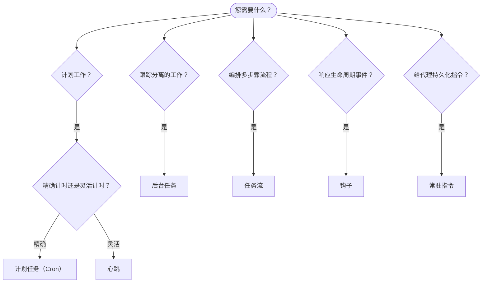

# 自动化与任务

OpenClaw 通过任务、计划作业、事件钩子和常驻指令在后台运行工作。本页面帮助您选择正确的机制并了解它们如何协同工作。

## 快速决策指南

| 使用场景                                | 推荐机制            | 原因                                              |
| --------------------------------------- | ------------------ | ------------------------------------------------ |
| 每天上午 9 点准时发送报告               | 计划任务（Cron）    | 精确计时，隔离执行                               |
| 20 分钟后提醒我                         | 计划任务（Cron）    | 一次性任务，精确计时（`--at`）                    |
| 每周运行深度分析                        | 计划任务（Cron）    | 独立任务，可以使用不同模型                       |
| 每 30 分钟检查收件箱                    | 心跳                | 与其他检查批量处理，上下文感知                   |
| 监控日历中的即将到来的事件              | 心跳                | 自然适合周期性检查                               |
| 检查子代理或 ACP 运行的状态             | 后台任务            | 任务 ledger 跟踪所有分离的工作                   |
| 审计什么时间运行了什么                  | 后台任务            | `openclaw tasks list` 和 `openclaw tasks audit` |
| 多步骤研究然后总结                      | 任务流              | 具有版本跟踪的持久编排                           |
| 在会话重置时运行脚本                    | 钩子                | 事件驱动，在生命周期事件时触发                  |
| 在每次工具调用时执行代码                | 钩子                | 钩子可以按事件类型过滤                           |
| 在回复前始终检查合规性                  | 常驻指令            | 自动注入到每个会话中                            |

### 计划任务（Cron）与心跳

| 维度           | 计划任务（Cron）                    | 心跳                                 |
| ------------- | ----------------------------------- | ------------------------------------- |
| 计时          | 精确（cron 表达式，一次性）         | 近似（默认每 30 分钟）                |
| 会话上下文     | 新鲜（隔离）或共享                  | 完整的主会话上下文                     |
| 任务记录       | 始终创建                            | 从不创建                               |
| 交付方式       | 频道、webhook 或静默                | 内联在主会话中                         |
| 最适合         | 报告、提醒、后台作业                 | 收件箱检查、日历、通知                 |

当您需要精确计时或隔离执行时，使用计划任务（Cron）。当工作受益于完整会话上下文且近似计时足够时，使用心跳。

## 核心概念

### 计划任务（cron）

Cron 是网关内置的精确计时调度器。它持久化作业，在正确的时间唤醒代理，并可以将输出传递到聊天频道或 webhook 端点。支持一次性提醒、重复表达式和入站 webhook 触发器。

参见 [计划任务](/automation/cron-jobs)。

### 任务

后台任务 ledger 跟踪所有分离的工作：ACP 运行、子代理生成、隔离的 cron 执行和 CLI 操作。任务是记录，不是调度器。使用 `openclaw tasks list` 和 `openclaw tasks audit` 检查它们。

参见 [后台任务](/automation/tasks)。

### 任务流

任务流是后台任务之上的流编排基础。它管理具有托管和镜像同步模式、版本跟踪的持久多步骤流，以及用于检查的 `openclaw tasks flow list|show|cancel`。

参见 [任务流](/automation/taskflow)。

### 常驻指令

常驻指令授予代理对已定义程序的永久操作权限。它们存在于工作区文件中（通常是 `AGENTS.md`），并自动注入到每个会话中。与 cron 结合使用以进行基于时间的强制执行。

参见 [常驻指令](/automation/standing-orders)。

### 钩子

钩子是由代理生命周期事件（`/new`、`/reset`、`/stop`）、会话压缩、网关启动、消息流和工具调用触发的事件驱动脚本。钩子会从目录中自动发现，并可以通过 `openclaw hooks` 进行管理。

参见 [钩子](/automation/hooks)。

### 心跳

心跳是定期的主会话轮次（默认每 30 分钟）。它在一个代理轮次中批量处理多个检查（收件箱、日历、通知），具有完整的会话上下文。心跳轮次不会创建任务记录。使用 `HEARTBEAT.md` 作为小清单，或者当您希望在心跳本身内进行仅到期的定期检查时使用 `tasks:` 块。空心跳文件会被跳过为 `empty-heartbeat-file`；仅到期任务模式会被跳过为 `no-tasks-due`。

参见 [心跳](/gateway/heartbeat)。

## 它们如何协同工作

- **Cron** 处理精确的调度（每日报告、每周审查）和一次性提醒。所有 cron 执行都会创建任务记录。
- **心跳** 每 30 分钟在一个批处理轮次中处理例行监控（收件箱、日历、通知）。
- **钩子** 使用自定义脚本响应特定事件（工具调用、会话重置、压缩）。
- **常驻指令** 为代理提供持久上下文和权限边界。
- **任务流** 协调单个任务之上的多步骤流。
- **任务** 自动跟踪所有分离的工作，以便您可以检查和审计它。

## 相关

- [计划任务](/automation/cron-jobs) — 精确调度和一次性提醒
- [后台任务](/automation/tasks) — 所有分离工作的任务 ledger
- [任务流](/automation/taskflow) — 持久多步骤流编排
- [钩子](/automation/hooks) — 事件驱动的生命周期脚本
- [常驻指令](/automation/standing-orders) — 持久代理指令
- [心跳](/gateway/heartbeat) — 定期主会话轮次
- [配置参考](/gateway/configuration-reference) — 所有配置键