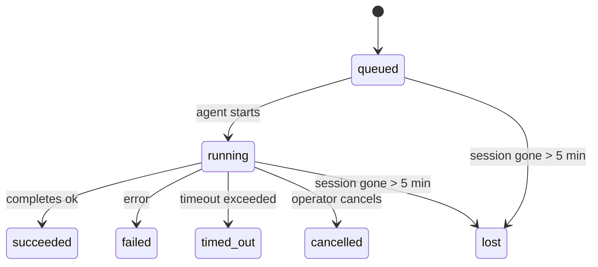

# 后台任务

> **寻找调度？** 请参阅 [自动化与任务](/automation) 以选择正确的机制。本页面涵盖 **跟踪** 后台工作，而不是调度它。

后台任务跟踪在 **主对话会话之外** 运行的工作：
ACP 运行、子代理生成、隔离 cron 作业执行和 CLI 启动的操作。

任务 **不** 替代会话、cron 作业或心跳 — 它们是 **活动 ledger**，记录发生了什么分离的工作、何时发生以及是否成功。

<Note>
并非每个代理运行都会创建任务。心跳轮次和正常的交互式聊天不会。所有 cron 执行、ACP 生成、子代理生成和 CLI 代理命令都会。
</Note>

## 快速概览

- 任务是 **记录**，不是调度器 — cron 和心跳决定 _何时_ 运行工作，任务跟踪 _发生了什么_。
- ACP、子代理、所有 cron 作业和 CLI 操作都会创建任务。心跳轮次不会。
- 每个任务都会经历 `queued → running → terminal`（成功、失败、超时、取消或丢失）。
- Cron 任务在 cron 运行时仍拥有作业时保持活跃；聊天支持的 CLI 任务仅在其拥有的运行上下文仍活跃时保持活跃。
- 完成是推送驱动的：分离的工作可以在完成时直接通知或唤醒请求者会话/心跳，因此状态轮询循环通常是错误的形式。
- 隔离的 cron 运行和子代理完成会在最终清理记账前尽力清理其子会话的跟踪浏览器选项卡/进程。
- 隔离的 cron 交付会在后代子代理工作仍在耗尽时抑制过时的临时父回复，并在交付前到达时优先选择最终的后代输出。
- 完成通知直接传递到频道或排队等待下一次心跳。
- `openclaw tasks list` 显示所有任务；`openclaw tasks audit` 显示问题。
- 终端记录保留 7 天，然后自动修剪。

## 快速开始

```bash
# 列出所有任务（最新优先）
openclaw tasks list

# 按运行时或状态过滤
openclaw tasks list --runtime acp
openclaw tasks list --status running

# 显示特定任务的详细信息（按 ID、运行 ID 或会话键）
openclaw tasks show <lookup>

# 取消正在运行的任务（杀死子会话）
openclaw tasks cancel <lookup>

# 更改任务的通知策略
openclaw tasks notify <lookup> state_changes

# 运行健康审计
openclaw tasks audit

# 预览或应用维护
openclaw tasks maintenance
openclaw tasks maintenance --apply

# 检查 TaskFlow 状态
openclaw tasks flow list
openclaw tasks flow show <lookup>
openclaw tasks flow cancel <lookup>
```

## 什么会创建任务

| 来源                 | 运行时类型 | 任务记录创建时间                          | 默认通知策略 |
| ---------------------- | ------------ | ------------------------------------------------------ | --------------------- |
| ACP 后台运行    | `acp`        | 生成子 ACP 会话                           | `done_only`           |
| 子代理编排 | `subagent`   | 通过 `sessions_spawn` 生成子代理               | `done_only`           |
| Cron 作业（所有类型）  | `cron`       | 每次 cron 执行（主会话和隔离）       | `silent`              |
| CLI 操作         | `cli`        | 通过网关运行的 `openclaw agent` 命令 | `silent`              |
| 代理媒体作业       | `cli`        | 会话支持的 `video_generate` 运行                   | `silent`              |

主会话 cron 任务默认使用 `silent` 通知策略 — 它们创建跟踪记录但不生成通知。隔离的 cron 任务也默认为 `silent`，但更可见，因为它们在自己的会话中运行。

会话支持的 `video_generate` 运行也使用 `silent` 通知策略。它们仍然创建任务记录，但完成会作为内部唤醒交还给原始代理会话，以便代理可以编写后续消息并附上完成的视频本身。如果您选择 `tools.media.asyncCompletion.directSend`，异步 `music_generate` 和 `video_generate` 完成会首先尝试直接频道交付，然后再回退到请求者会话唤醒路径。

当会话支持的 `video_generate` 任务仍处于活动状态时，该工具还充当护栏：在同一会话中重复的 `video_generate` 调用会返回活动任务状态，而不是启动第二个并发生成。当您希望从代理端进行显式进度/状态查找时，使用 `action: "status"`。

**什么不会创建任务：**

- 心跳轮次 — 主会话；请参阅 [心跳](/gateway/heartbeat)
- 正常的交互式聊天轮次
- 直接 `/command` 响应

## 任务生命周期



| 状态      | 含义                                                              |
| ----------- | -------------------------------------------------------------------------- |
| `queued`    | 创建，等待代理启动                                    |
| `running`   | 代理轮次正在积极执行                                           |
| `succeeded` | 成功完成                                                     |
| `failed`    | 完成时出现错误                                                    |
| `timed_out` | 超过配置的超时                                            |
| `cancelled` | 操作员通过 `openclaw tasks cancel` 停止                        |
| `lost`      | 运行时在 5 分钟宽限期后失去权威支持状态 |

转换自动发生 — 当关联的代理运行结束时，任务状态会更新以匹配。

`lost` 是运行时感知的：

- ACP 任务：支持 ACP 子会话元数据消失。
- 子代理任务：支持子会话从目标代理存储中消失。
- Cron 任务：cron 运行时不再将作业跟踪为活动。
- CLI 任务：隔离的子会话任务使用子会话；聊天支持的 CLI 任务使用实时运行上下文，因此挥之不去的频道/群组/直接会话行不会使它们保持活跃。

## 交付和通知

当任务达到终端状态时，OpenClaw 会通知您。有两条交付路径：

**直接交付** — 如果任务有频道目标（`requesterOrigin`），完成消息会直接发送到该频道（Telegram、Discord、Slack 等）。对于子代理完成，OpenClaw 还会在可用时保留绑定的线程/主题路由，并可以从请求者会话的存储路由（`lastChannel` / `lastTo` / `lastAccountId`）中填充缺失的 `to` / 账户，然后放弃直接交付。

**会话排队交付** — 如果直接交付失败或未设置源，更新会作为系统事件排队到请求者的会话中，并在下一次心跳时显示。

<Tip>
任务完成会触发立即心跳唤醒，因此您可以快速看到结果 — 不必等待下一个计划的心跳 tick。
</Tip>

这意味着通常的工作流程是基于推送的：启动一次分离的工作，然后让运行时在完成时唤醒或通知您。仅在需要调试、干预或显式审计时轮询任务状态。

### 通知策略

控制您对每个任务的了解程度：

| 策略                | 交付内容                                                       |
| --------------------- | ----------------------------------------------------------------------- |
| `done_only` (默认) | 仅终端状态（成功、失败等） — **这是默认值** |
| `state_changes`       | 每次状态转换和进度更新                              |
| `silent`              | 完全没有                                                          |

在任务运行时更改策略：

```bash
openclaw tasks notify <lookup> state_changes
```

## CLI 参考

### `tasks list`

```bash
openclaw tasks list [--runtime <acp|subagent|cron|cli>] [--status <status>] [--json]
```

输出列：任务 ID、类型、状态、交付、运行 ID、子会话、摘要。

### `tasks show`

```bash
openclaw tasks show <lookup>
```

查找令牌接受任务 ID、运行 ID 或会话键。显示完整记录，包括时间、交付状态、错误和终端摘要。

### `tasks cancel`

```bash
openclaw tasks cancel <lookup>
```

对于 ACP 和子代理任务，这会杀死子会话。对于 CLI 跟踪的任务，取消会记录在任务注册表中（没有单独的子运行时句柄）。状态转换为 `cancelled`，并在适用时发送交付通知。

### `tasks notify`

```bash
openclaw tasks notify <lookup> <done_only|state_changes|silent>
```

### `tasks audit`

```bash
openclaw tasks audit [--json]
```

显示操作问题。当检测到问题时，结果也会出现在 `openclaw status` 中。

| 发现                   | 严重性 | 触发器                                               |
| ------------------------- | -------- | ----------------------------------------------------- |
| `stale_queued`            | 警告     | 排队超过 10 分钟                       |
| `stale_running`           | 错误    | 运行超过 30 分钟                      |
| `lost`                    | 错误    | 运行时支持的任务所有权消失             |
| `delivery_failed`         | 警告     | 交付失败且通知策略不是 `silent`     |
| `missing_cleanup`         | 警告     | 没有清理时间戳的终端任务               |
| `inconsistent_timestamps` | 警告     | 时间线违规（例如结束时间早于开始时间） |

### `tasks maintenance`

```bash
openclaw tasks maintenance [--json]
openclaw tasks maintenance --apply [--json]
```

使用此命令预览或应用任务和 Task Flow 状态的协调、清理标记和修剪。

协调是运行时感知的：

- ACP/子代理任务检查其支持的子会话。
- Cron 任务检查 cron 运行时是否仍拥有作业。
- 聊天支持的 CLI 任务检查拥有的实时运行上下文，而不仅仅是聊天会话行。

完成清理也是运行时感知的：

- 子代理完成会在通知清理继续之前尽力关闭子会话的跟踪浏览器选项卡/进程。
- 隔离的 cron 完成会在运行完全拆除之前尽力关闭 cron 会话的跟踪浏览器选项卡/进程。
- 隔离的 cron 交付在需要时等待后代子代理后续操作，并抑制过时的父确认文本而不是宣布它。
- 子代理完成交付优先选择最新的可见助手文本；如果为空，它会回退到清理的最新工具/工具结果文本，仅超时的工具调用运行可以折叠为简短的部分进度摘要。
- 清理失败不会掩盖真实的任务结果。

### `tasks flow list|show|cancel`

```bash
openclaw tasks flow list [--status <status>] [--json]
openclaw tasks flow show <lookup> [--json]
openclaw tasks flow cancel <lookup>
```

当您关心的是编排 Task Flow 而不是单个后台任务记录时，请使用这些命令。

## 聊天任务板 (`/tasks`)

在任何聊天会话中使用 `/tasks` 查看链接到该会话的后台任务。该板显示活动和最近完成的任务，包括运行时、状态、时间和进度或错误详细信息。

当当前会话没有可见的链接任务时，`/tasks` 会回退到代理本地任务计数，因此您仍然可以获得概述而不会泄露其他会话的详细信息。

有关完整的操作员 ledger，请使用 CLI：`openclaw tasks list`。

## 状态集成（任务压力）

`openclaw status` 包含任务的一目了然摘要：

```
Tasks: 3 queued · 2 running · 1 issues
```

摘要报告：

- **active** — `queued` + `running` 的计数
- **failures** — `failed` + `timed_out` + `lost` 的计数
- **byRuntime** — 按 `acp`、`subagent`、`cron`、`cli` 分解

`/status` 和 `session_status` 工具都使用清理感知的任务快照：优先显示活动任务，隐藏过时的已完成行，并且仅当没有活动工作时才显示最近的失败。这使状态卡专注于当前重要的内容。

## 存储和维护

### 任务存储位置

任务记录持久化在 SQLite 中：

```
$OPENCLAW_STATE_DIR/tasks/runs.sqlite
```

注册表在网关启动时加载到内存中，并将写入同步到 SQLite 以在重启期间保持持久性。

### 自动维护

清理器每 **60 秒** 运行一次，处理三件事：

1. **协调** — 检查活动任务是否仍有权威的运行时支持。ACP/子代理任务使用子会话状态，cron 任务使用活动作业所有权，聊天支持的 CLI 任务使用拥有的运行上下文。如果该支持状态消失超过 5 分钟，任务会被标记为 `lost`。
2. **清理标记** — 在终端任务上设置 `cleanupAfter` 时间戳（endedAt + 7 天）。
3. **修剪** — 删除超过 `cleanupAfter` 日期的记录。

**保留**：终端任务记录保留 **7 天**，然后自动修剪。无需配置。

## 任务如何与其他系统相关

### 任务和 Task Flow

[Task Flow](/automation/taskflow) 是后台任务之上的流编排层。单个流可能在其生命周期内使用托管或镜像同步模式协调多个任务。使用 `openclaw tasks` 检查单个任务记录，使用 `openclaw tasks flow` 检查编排流。

请参阅 [Task Flow](/automation/taskflow) 了解详情。

### 任务和 cron

cron 作业 **定义** 存在于 `~/.openclaw/cron/jobs.json` 中。**每次** cron 执行都会创建任务记录 — 包括主会话和隔离。主会话 cron 任务默认使用 `silent` 通知策略，因此它们在不生成通知的情况下进行跟踪。

请参阅 [Cron 作业](/automation/cron-jobs)。

### 任务和心跳

心跳运行是主会话轮次 — 它们不会创建任务记录。当任务完成时，它可以触发心跳唤醒，以便您及时看到结果。

请参阅 [心跳](/gateway/heartbeat)。

### 任务和会话

任务可能引用 `childSessionKey`（工作运行的地方）和 `requesterSessionKey`（谁启动了它）。会话是对话上下文；任务是在此之上的活动跟踪。

### 任务和代理运行

任务的 `runId` 链接到执行工作的代理运行。代理生命周期事件（开始、结束、错误）会自动更新任务状态 — 您不需要手动管理生命周期。

## 相关

- [自动化与任务](/automation) — 所有自动化机制一览
- [Task Flow](/automation/taskflow) — 任务之上的流编排
- [计划任务](/automation/cron-jobs) — 调度后台工作
- [心跳](/gateway/heartbeat) — 定期主会话轮次
- [CLI: 任务](/cli/index#tasks) — CLI 命令参考