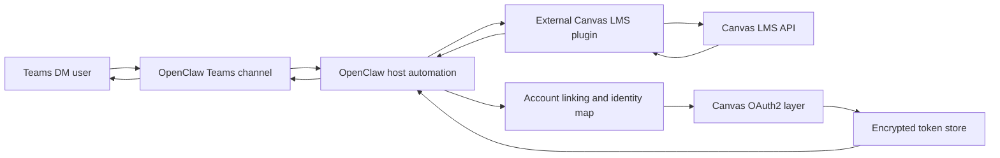

# Teams Academic Chat Canvas MVP (host-side pattern)

## Purpose

Provide a practical host-side pattern to implement a **Teams DM academic assistant MVP** in OpenClaw using an external Canvas LMS community plugin.

## When to use this pattern

Use this pattern when you need:

- Teams DM interactions for students and staff.
- Read-only academic assistance (deadlines, announcements, calendar, submission status).
- Host-controlled automation that consumes plugin output and sends final responses to Teams.

## Non-goals

- No changes to OpenClaw gateway runtime behavior.
- No changes to Microsoft Teams channel semantics.
- No Canvas LMS logic in OpenClaw core.
- No direct publishing from Canvas digest tools in the external plugin.

## MVP scope

- DM-only rollout in Teams.
- Read-only intents.
- Account linking between Teams identity and Canvas identity.
- Host-side orchestration for tool invocation and response delivery.

## Architecture overview

OpenClaw provides Teams channel support and host automation surfaces. Canvas-specific data access is provided by an external community plugin (for example `@kansodata/openclaw-canvas-lms`, plugin id `canvas-lms`).

## Components

### Microsoft Teams DM

- User entrypoint for the MVP.
- Keep the initial rollout in direct messages only.

### OpenClaw host and gateway

- Receives Teams messages through the configured Teams channel.
- Runs host-side orchestration and policy checks.

### Host-side automation

- Resolves intent.
- Verifies account link and authorization context.
- Calls Canvas-facing tools from the external plugin.
- Formats and sends response back to Teams DM.

### External Canvas LMS plugin

- Community plugin outside OpenClaw core.
- Owns Canvas-specific tools/digest logic.
- Returns structured data or digest payloads.

### Canvas OAuth and account linking layer

- Maps Teams user identity to institution-scoped Canvas identity.
- Stores user tokens securely in host infrastructure.

## End-to-end flow

1. User sends a DM in Teams (for example: "What is due today?").
2. Host automation validates sender policy and checks linked account state.
3. Host invokes the Canvas plugin tool/digest action.
4. Host normalizes/filters the plugin output.
5. Host sends a concise Teams DM response.
6. Host writes minimal audit metadata (without secret/token leakage).

## Security guidance

- Start with **DM-only**. Do not roll out to channels/groups initially.
- Use **minimum OAuth scopes** required for read-only intents.
- Store access and refresh tokens **encrypted at rest**.
- Apply **safe logging**: redact tokens, identifiers, and sensitive payload fields.
- Add **rate limiting** on DM request handling and plugin calls.
- Enforce **institution boundaries** and user-to-tenant ownership checks.
- Keep host automation deterministic and avoid implicit cross-user context reuse.

## External plugin boundary statement

Canvas-specific logic is not part of OpenClaw core in this pattern. It is supplied by an external/community plugin and consumed by host-side automation.

## Suggested MVP intents

- Today digest
- Week digest
- Announcements
- Calendar events
- Submission or assignment status

## Rollout guidance

### Prototype

- Single institution test tenant.
- Small DM-only user set.
- Read-only intents only.

### Pilot

- Limited cohort by program or department.
- Monitor request volume and response quality.
- Tighten policy, logging redaction, and rate limits.

### Institutional rollout

- Formal ownership model and support process.
- Tenant boundary enforcement and key rotation policy.
- Operational dashboards and alerting for abuse and failures.
