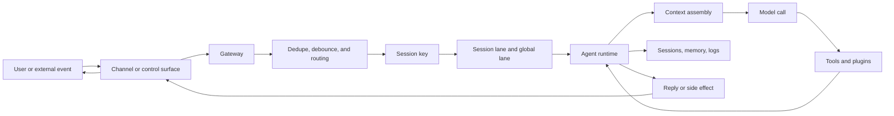
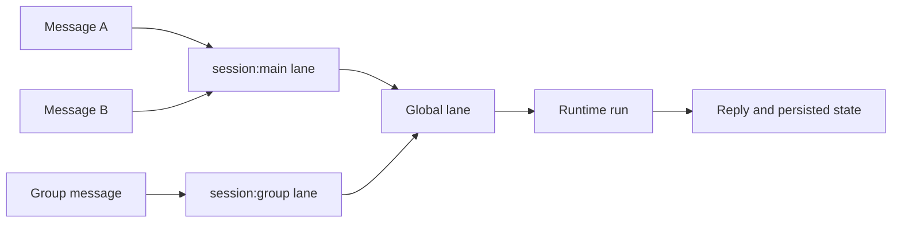

# Architecture Guide

OpenClaw is a self-hosted agent gateway.

At a high level, the system has two main responsibilities:

1. The **Gateway** owns routing, sessions, channel connections, protocol access, and operator-facing control.
2. The **agent runtime** executes a turn by assembling context, calling the model, invoking tools, streaming output, and persisting state.

This page gives you the system map. It does not replace the deeper reference pages. Use it as the starting point before reading the detailed docs for [Gateway Architecture](/concepts/architecture), [Agent Loop](/concepts/agent-loop), [Messages](/concepts/messages), [Session Management](/concepts/session), [Command Queue](/concepts/queue), [Memory](/concepts/memory), [Security](/gateway/security), and [Tools and Plugins](/tools).

## System map

OpenClaw turns messages, scheduled events, hooks, webhooks, and control-plane requests into routed agent runs.



The important idea is that the model is inside the loop. It is not the system boundary.

The Gateway decides which session a run belongs to, which policy applies, which tools are reachable, and which events are emitted. The runtime spends that authority during the turn.

## Ingress and delivery

OpenClaw treats inbound delivery as a systems problem before it becomes a model problem.

Channels can redeliver the same message after reconnects. OpenClaw keeps a short-lived inbound dedupe cache so the same channel message does not trigger another agent run. Rapid text messages from the same sender can also be debounced into one turn before they enter the queue.

Outbound delivery has its own retry boundary. Retries apply to the current provider request, such as a message send or media upload, not to the entire multi-step agent flow. Completed steps are not replayed as part of a composite retry.

This keeps three ideas separate:

- **Dedupe** prevents repeated inbound delivery from creating duplicate turns.
- **Debounce** combines bursty same-sender input before the run starts.
- **Retry** handles transient provider failures without pretending the whole turn can be replayed.

See [Messages](/concepts/messages) and [Retry Policy](/concepts/retry).

## Gateway and runtime

The **Gateway** is the long-lived process at the center of OpenClaw.

It maintains channel connections, exposes a typed WebSocket API, validates inbound protocol frames, emits events, and owns session state. Clients such as the CLI, Control UI, desktop app, automations, and nodes connect to the Gateway rather than directly owning session files or channel state.

The **agent runtime** is the execution path for one run. A run typically follows this shape:

1. Intake
2. Session resolution
3. Context assembly
4. Model inference
5. Tool execution
6. Streaming replies
7. Persistence

The Gateway is the control point. The runtime is the worker that performs the turn.

See [Gateway Architecture](/concepts/architecture) and [Agent Loop](/concepts/agent-loop) for the detailed lifecycle.

## Sessions isolate context

A session is the unit of conversational continuity.

Every inbound message is routed to a session based on where it came from: direct message, group chat, room, channel, cron job, webhook, or another source. The **session key** decides which transcript and working state the run should use.

By default, direct messages share one main session for continuity. That is convenient for a single-user setup. If multiple people can message the same agent, enable per-sender DM isolation with `session.dmScope`.

```json5
{
  session: {
    dmScope: "per-channel-peer",
  },
}
```

A useful rule:

- Session keys isolate context.
- Session keys do not authorize users.
- Session keys do not reduce tool authority.

If several people can message one tool-enabled agent, they may still be steering the same delegated capability surface. Use separate gateways, separate agents, separate credentials, or separate hosts when you need a stronger trust boundary.

See [Session Management](/concepts/session) and [Security](/gateway/security).

## The queue keeps state consistent

OpenClaw uses queueing to prevent concurrent agent runs from colliding.

The core invariant is:

> Only one active run should touch a given session at a time.

OpenClaw enforces this with a lane-aware queue:

1. Each session run enters a per-session lane.
2. The session run then passes through a global lane.
3. The global lane caps overall concurrency across sessions.



This prevents common state races:

- two runs appending to the same transcript at once
- tool calls interleaving in the wrong order
- one run continuing a plan after a newer message changed the task
- duplicate replies from repeated inbound delivery

The queue is also where OpenClaw decides how to handle new input during an active run. Queue modes such as `collect`, `followup`, and `steer` trade off determinism, responsiveness, and mid-run correction behavior.

Serialization is necessary, but it does not make side effects safe by itself. Two different sessions can still mutate the same external resource, and a long-running tool call can finish with stale assumptions. Use global concurrency caps, tool policy, approvals, idempotency where available, and narrow execution targets to bound those risks.

See [Command Queue](/concepts/queue), [Messages](/concepts/messages), and [Retry Policy](/concepts/retry).

## Memory is durable state

OpenClaw memory is explicit durable state.

The model does not remember by changing its weights. It remembers only when useful information is written to durable storage and later reloaded into context.

The default memory model uses plain Markdown files in the agent workspace:

- `MEMORY.md` for durable long-term facts, preferences, and decisions
- `memory/YYYY-MM-DD.md` for daily notes
- `DREAMS.md` for optional review and consolidation output

The workspace is the agent home and the default working directory for file tools. It is not a hard sandbox. If the agent needs isolation, enable sandboxing and make sure the memory surface that should persist remains writable.

The main distinction is:

| Concept      | Purpose                                        |
| ------------ | ---------------------------------------------- |
| Session      | Hot working set for the current conversation   |
| Memory       | Durable state that survives across sessions    |
| Search index | Derived state used to retrieve relevant memory |
| Context      | The assembled payload sent into a model call   |

A good memory system needs three properties:

1. A durable source of truth
2. A clear write policy
3. A rehydration path

OpenClaw exposes memory through tools such as `memory_search` and `memory_get`. This keeps recall explicit and targeted instead of dumping all memory into every prompt.

The memory search index is derived state. Memory files are the durable source of truth; the index is rebuildable and can use hybrid retrieval so exact identifiers, code symbols, and fuzzy semantic matches can all be found.

Before compaction summarizes long conversation history, OpenClaw can run a silent memory flush so important details are written before older context is discarded. A memory system should preserve that invariant: persist what must survive before discarding old context.

See [Memory Overview](/concepts/memory), [Memory Search](/concepts/memory-search), [Compaction](/concepts/compaction), [Dreaming](/concepts/dreaming), and [Agent Workspace](/concepts/agent-workspace).

## Tools turn text into action

A model response stays inside the transcript.

A tool call can affect systems outside the transcript.

Tools are how OpenClaw reads files, runs commands, controls a browser, sends messages, queries the web, works with sessions, uses memory, and interacts with paired nodes.

That means tool configuration is capability design.

Start with the smallest tool profile that works, then widen it deliberately.

```json5
{
  tools: {
    profile: "messaging",
    deny: ["exec", "browser", "sessions_send", "sessions_spawn"],
  },
}
```

Important distinctions:

- A browser tool attached to a managed profile is different from one attached to an existing signed-in browser.
- An exec tool running in a sandbox is different from one running on the gateway host or a paired node.
- Session tools can expose read and write access across session boundaries depending on visibility.
- Node tools can extend action to paired devices.

The same tool label can have a different consequence depending on execution target, credentials, and configuration.

See [Tools and Plugins](/tools), [Browser](/tools/browser), [Exec](/tools/exec), [Exec Approvals](/tools/exec-approvals), and [Session Tools](/concepts/session-tool).

## Plugins extend trust

Plugins extend OpenClaw with new capabilities: channels, model providers, tools, skills, speech, transcription, media understanding, web fetch, web search, background services, routes, and more.

A native plugin has two important phases:

1. Discovery, manifest reading, enablement, and validation
2. Runtime loading and capability registration

That separation lets OpenClaw inspect and validate plugin metadata before activating runtime behavior.

Once a native plugin is loaded, treat it as trusted Gateway code. A plugin can register tools, hooks, HTTP routes, Gateway methods, commands, services, context engines, skills, and other surfaces.

Use plugin allowlists and review third-party code before enabling it.

```json5
{
  plugins: {
    allow: ["voice-call"],
    deny: ["untrusted-plugin"],
  },
}
```

A plugin is not just a feature toggle. It is a decision about what code and capabilities live inside the OpenClaw control plane.

See [Plugins](/tools/plugin), [Plugin Internals](/plugins/architecture), [Building Plugins](/plugins/building-plugins), and [Plugin Manifest](/plugins/manifest).

## Security is boundary management

OpenClaw is designed around a personal assistant trust model: one trusted operator boundary per gateway.

Do not treat one shared gateway as a hostile multi-tenant security boundary.

The practical security questions are:

1. Who can trigger the agent?
2. Which session does the trigger reach?
3. Which tools are visible to the runtime?
4. Which credentials and browser profiles are attached?
5. Which host, node, or sandbox will execute the action?
6. What evidence will exist after the action completes?

Prompt guidance is useful, but prompt text is not the enforcement boundary. Enforcement belongs in Gateway auth, pairing, allowlists, secure DM scoping, tool policy, sandboxing, approvals, dedicated accounts, dedicated hosts, and audit.

For a hardened starting point:

- keep the Gateway on loopback or behind a private network
- require Gateway auth for non-local access
- use `session.dmScope: "per-channel-peer"` when more than one person can DM the agent
- use the smallest tool profile that still works
- deny broad runtime tools unless needed
- run shared agents with dedicated accounts and dedicated browser profiles
- run `openclaw security audit` after changing config or exposing surfaces

See [Security](/gateway/security), [Sandboxing](/gateway/sandboxing), [Security Audit](/cli/security), and [Formal Verification](/security/formal-verification).

## Observability and recovery

A production system needs more than a transcript.

A transcript can show what the model saw and said. It may not show whether a duplicate inbound message was dropped, whether a run waited in a queue, whether the Gateway restarted, whether a sequence gap occurred, or whether a reply was delivered by the channel.

Use the operator surfaces together:

```bash
openclaw status
openclaw gateway status
openclaw health
openclaw logs --follow
openclaw doctor
openclaw channels status --probe
```

OpenClaw file logs are JSON lines. The Control UI can tail log output through the Gateway, and the CLI can follow the same log stream.

For incident review, collect:

- session id or session key
- triggering message or event
- queue behavior
- transcript
- tool events
- approvals or denials
- logs
- health and diagnostics
- durable side effects

When you need a shareable support artifact, use a diagnostics export. It combines sanitized Gateway status, health, logs, config shape, and recent payload-free stability events.

Recovery should be based on durable artifacts: session store, transcripts, memory files, logs, diagnostics, and channel or provider state. Do not assume every transient protocol event can be replayed. Gateway events are not replayed across gaps; clients should refresh state and continue from durable sources.

See [Gateway Logging](/gateway/logging), [Logging Overview](/logging), [Diagnostics Export](/gateway/diagnostics), [Health Checks](/gateway/health), and [Gateway Troubleshooting](/gateway/troubleshooting).

## Evaluation closes the loop

Reliability is not only uptime. A production agent needs failures to become repeatable checks.

Use transcripts, logs, diagnostics, and health snapshots to explain what happened. Then turn recurring failures into targeted tests, QA scenarios, live checks, or regression fixtures. The exact proof depends on the surface:

- message routing and queueing should have behavior tests
- provider and model behavior may need live or mocked provider tests
- channel delivery should have channel-specific or QA-lab coverage
- security and tool-policy changes should have explicit boundary checks
- release-risk surfaces should run the relevant changed gate before handoff

This keeps the system from relying on anecdotal review of model output. The goal is to prove the routing, state, capability, and delivery contracts that made the output possible.

See [Tests](/reference/test), [Testing](/help/testing), and [CI](/ci).

## Common pitfalls

### Treating routing as authorization

A `sessionKey` selects context. It is not a user authorization token.

Use Gateway auth, pairing, allowlists, DM scoping, separate agents, separate credentials, and separate gateways for stronger boundaries.

### Sharing one tool surface across many users

Per-user session isolation helps with context privacy. It does not automatically give each user a separate permission set.

If multiple users can steer one tool-enabled agent, keep the tool surface narrow or split the trust boundary.

### Enabling tools before choosing execution targets

Do not only ask whether the browser or exec tool is enabled.

Ask where it executes, which profile or host it uses, and what credentials are available there.

### Treating plugins like simple toggles

A plugin can add runtime behavior inside the Gateway. Review plugin source, use allowlists, and prefer trusted plugins.

### Assuming memory is automatic truth

Memory is durable state, not perfect recall.

If something must survive, make sure it is written to the right memory surface and can be retrieved later.

### Debugging from the transcript alone

Use transcripts, logs, queue evidence, health checks, diagnostics, and channel status together. Many production failures are transport, routing, queueing, or policy failures, not model failures.

### Treating recovery like replay

OpenClaw has durable session, memory, log, and diagnostic artifacts. It does not guarantee perfect replay of every transient Gateway event. Recover from the durable sources of truth and refresh client state after gaps.

### Shipping from anecdotes

A successful manual run does not prove the architecture contract. Convert ambiguous incidents and recurring failures into regression tests, QA scenarios, or live checks.

## Architecture checklist

Use this checklist when configuring or extending OpenClaw:

1. Define the Gateway trust boundary.
2. Decide who can trigger each agent.
3. Choose the session scope for DMs, groups, channels, cron, and webhooks.
4. Keep the single-writer session lane invariant intact.
5. Cap global concurrency.
6. Choose queue behavior for mid-run messages.
7. Separate dedupe, debounce, retry, and replay assumptions.
8. Decide what memory should be written, where it lives, and how it is retrieved.
9. Start with the smallest tool profile that works.
10. Treat plugins as trusted Gateway code.
11. Keep logs, transcripts, diagnostics, and tests close to the surfaces they validate.

## Related docs

- [Gateway Architecture](/concepts/architecture)
- [Agent loop](/concepts/agent-loop)
- [Messages](/concepts/messages)
- [Session Management](/concepts/session)
- [Command Queue](/concepts/queue)
- [Memory Overview](/concepts/memory)
- [Compaction](/concepts/compaction)
- [Tools and Plugins](/tools)
- [Plugin Internals](/plugins/architecture)
- [Security](/gateway/security)
- [Gateway Logging](/gateway/logging)
- [Diagnostics Export](/gateway/diagnostics)
- [Tests](/reference/test)
