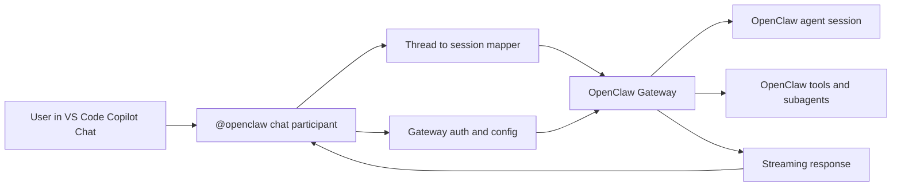
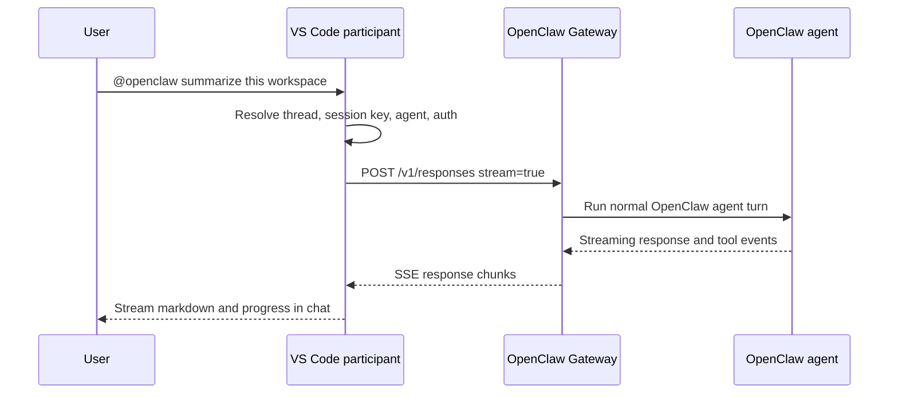

# VS Code Copilot Chat Agent

Goal: expose OpenClaw as a first-class chat agent inside the GitHub Copilot chat experience in VS Code.

## Recommendation

The recommended first implementation is a **VS Code extension** that registers an `@openclaw` chat participant and forwards requests to the OpenClaw Gateway over HTTP.

Why this is the right first step:

- It creates an actual chat agent in the current VS Code Copilot UI.
- It fits the official VS Code Chat Participant API.
- It lets OpenClaw keep owning sessions, routing, tools, and memory.
- It can add MCP-backed tools later without redesigning the integration.

## Integration options

### Option 1: VS Code chat participant

Build a VS Code extension that registers `@openclaw` and streams responses from the Gateway into Copilot Chat.

Use this when:

- You want `@openclaw` to appear as a named participant in VS Code.
- You want OpenClaw to control the full request and response flow.
- You want stable OpenClaw session continuity across chat turns.

Pros:

- Best fit for the user-facing goal.
- Direct streaming into the chat UI.
- Can add slash commands and participant detection.
- Can reuse existing OpenClaw Gateway APIs.

Cons:

- VS Code-specific surface.
- Requires extension packaging, auth UX, and session mapping logic.

### Option 2: MCP server

Expose OpenClaw capabilities as MCP tools, prompts, and resources.

Use this when:

- You want Copilot agent mode to call OpenClaw capabilities automatically.
- You want a reusable integration surface across editors.
- You want to expose session inspection or subagent operations as tools.

Pros:

- Reusable beyond VS Code.
- Good fit for OpenClaw session and tool primitives.
- Lets Copilot agent mode invoke OpenClaw actions with confirmation.

Cons:

- Does not create a first-class `@openclaw` participant by itself.
- Better as a complement to a participant than as the first milestone.

### Option 3: GitHub App Copilot Extension

Build a GitHub App-backed Copilot extension for cross-surface availability.

Use this when:

- You want the same OpenClaw-backed agent on github.com and other Copilot surfaces.
- You are willing to take on a larger auth and product integration surface.

Pros:

- Cross-surface reach.
- Strategic long-term path if OpenClaw becomes a broader Copilot integration.

Cons:

- Higher effort than a VS Code-only extension.
- Less direct access to local editor and workspace APIs.

## Recommended architecture

### Components

#### VS Code extension

- Registers one chat participant: `@openclaw`
- Optionally adds slash commands such as `/agent`, `/reset`, `/status`, and `/sessions`
- Streams partial output into Copilot Chat
- Stores local metadata that maps a VS Code chat thread to an OpenClaw session key

#### OpenClaw Gateway

- Executes the request as a normal OpenClaw run
- Owns routing, provider selection, memory, tools, subagents, and policy
- Streams the assistant response back to the extension

Relevant existing surfaces:

- [OpenResponses API](/gateway/openresponses-http-api)
- [OpenAI HTTP API](/gateway/openai-http-api)
- [Session Tools](/concepts/session-tool)

#### Session mapper

The extension should treat one VS Code chat thread as one OpenClaw session by default.

Recommended mapping:

- VS Code chat thread id -> OpenClaw session key
- Workspace folder -> default OpenClaw agent id
- Slash command override -> temporary agent selection for the active thread

This keeps session continuity simple and lets OpenClaw remain the source of truth for transcript and memory.

## Request flow

## Recommended v1 scope

Ship the smallest version that proves the integration works well:

- `@openclaw` chat participant
- Gateway URL and token configuration
- Stable thread-to-session mapping
- Streaming responses via the Gateway HTTP API
- Agent selection with a simple slash command or extension setting
- Reset session command
- Basic status surface for the active OpenClaw session

## Recommended v2 scope

After the participant works reliably, add richer OpenClaw semantics:

- `/sessions` backed by session listing
- `/history` backed by transcript history
- `/spawn` backed by `sessions_spawn`
- `/handoff` backed by `sessions_send`
- richer references to session logs, transcripts, or Gateway URLs

## MCP follow-up

The same project can later expose OpenClaw as an MCP server for agent mode.

Good MCP candidates:

- session inspection
- transcript fetch
- agent-to-agent send
- subagent spawn
- session status

This should be treated as a second integration surface, not as a replacement for the chat participant.

## Security and auth

The extension should not bypass Gateway auth. It should reuse the same Gateway token or remote auth the user already manages for other OpenClaw clients.

Recommended guardrails:

- store tokens in VS Code secret storage, not plain settings
- make the target Gateway explicit in settings
- keep one participant per extension
- require explicit user action for destructive follow-up commands
- keep local workspace context opt-in when sending extra file contents to OpenClaw

## Non-goals for v1

- replacing the built-in Copilot participant
- cross-surface GitHub App support
- full MCP coverage for every OpenClaw tool
- complete parity with the browser Control UI

## Decision summary

- Build a **VS Code chat participant first**
- Use the **OpenClaw Gateway HTTP API** as the execution backend
- Map **one VS Code conversation to one OpenClaw session**
- Add **MCP** after the participant proves useful
- Revisit a **GitHub App** only if cross-surface support becomes a product goal
