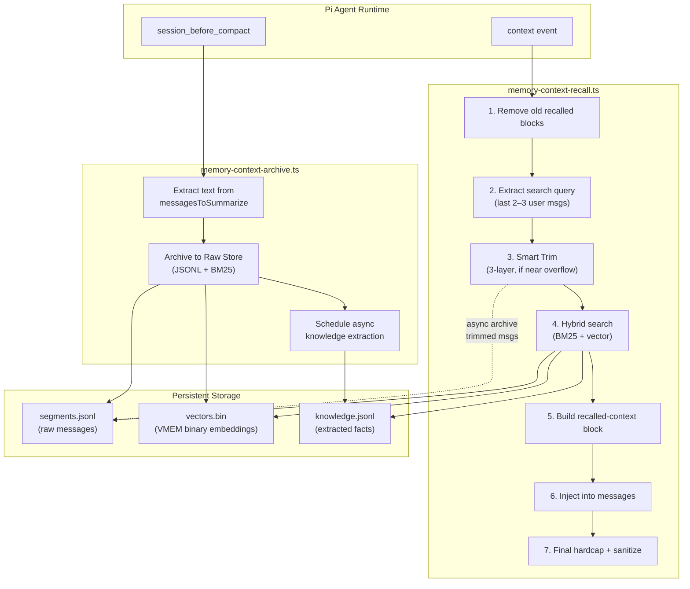
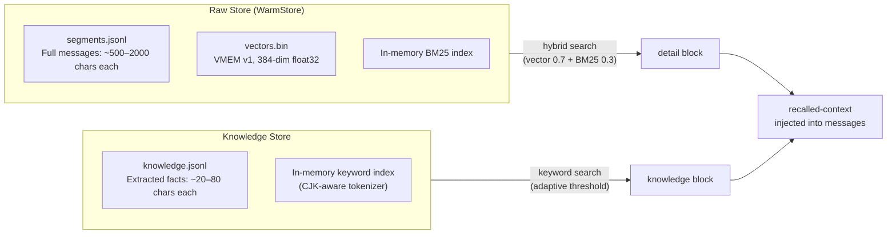
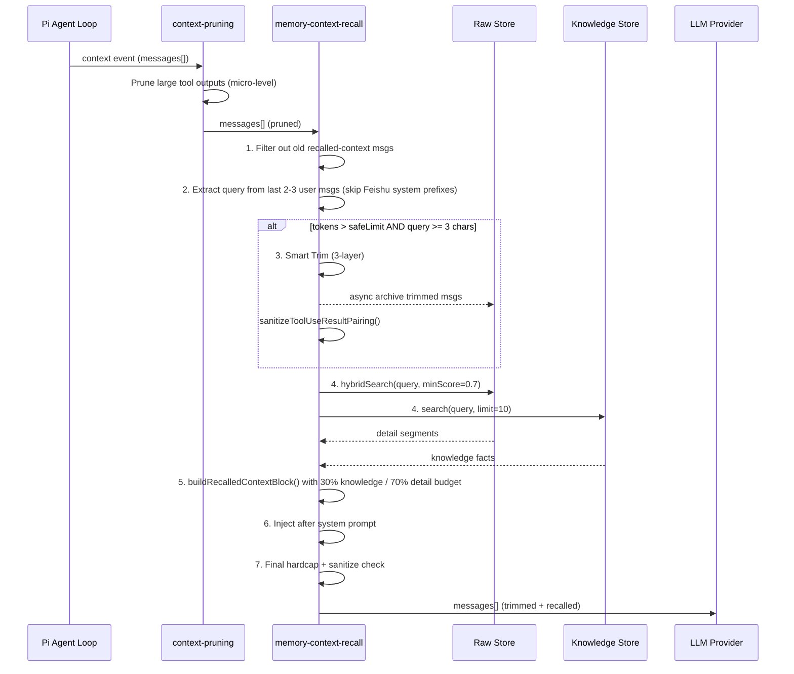
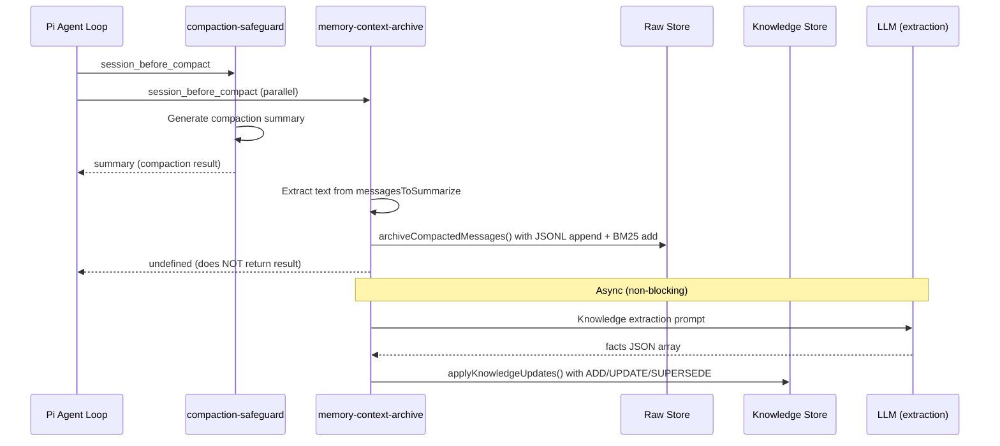
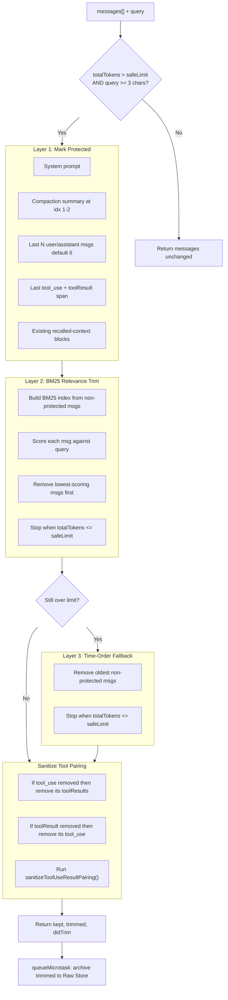
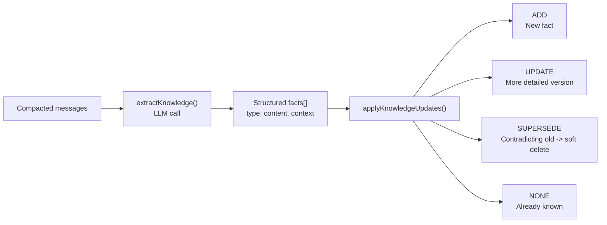
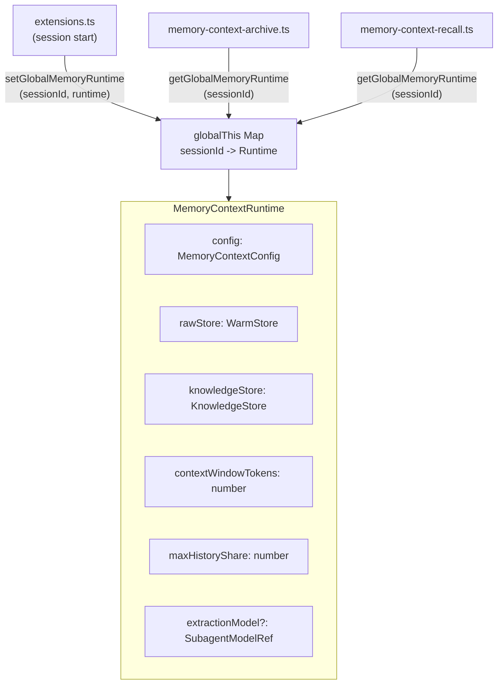
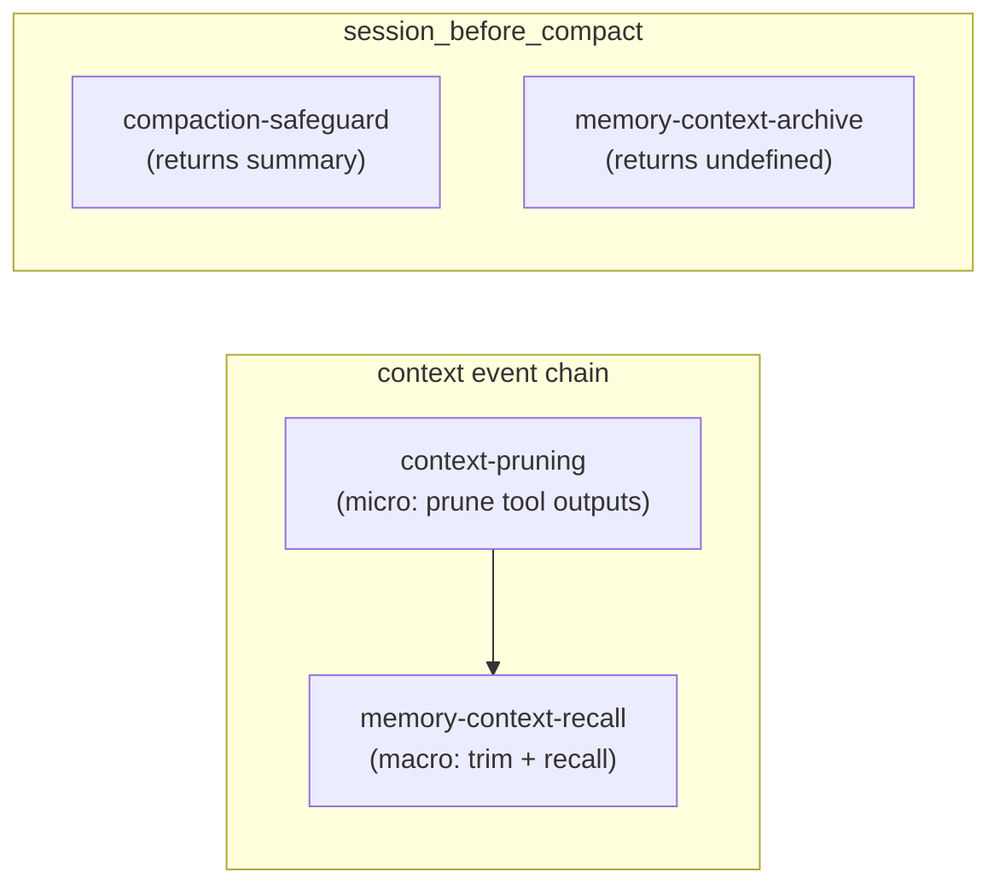

# Memory-Enhanced Compaction

> Dual-layer conversation memory with Mem0-style knowledge extraction, MemGPT-inspired hybrid recall, and proactive smart trimming. Preserves compacted context into a searchable memory layer so that earlier decisions, implementations, and facts remain accessible even after the LLM context window overflows.

---

## Architecture Overview



### Design Principles

| Principle                     | Implementation                                                                    |
| ----------------------------- | --------------------------------------------------------------------------------- |
| **Zero information loss**     | Raw messages archived verbatim to JSONL before compaction                         |
| **Automatic, not tool-based** | Recall injects via `context` event — no agent tool calls needed                   |
| **Non-blocking**              | Knowledge extraction and embedding run async via `queueMicrotask`                 |
| **Error isolation**           | All memory ops wrapped in try-catch; failure never blocks compaction or LLM calls |
| **Hard token cap**            | Recalled content never exceeds `min(hardCapTokens, contextWindow × 10%)`          |
| **Tool pairing safety**       | Two-layer sanitization after every trim (custom + `sanitizeToolUseResultPairing`) |

---

## Dual-Layer Storage



### Raw Store (`store.ts` — WarmStore)

| Property             | Value                                                                                                  |
| -------------------- | ------------------------------------------------------------------------------------------------------ |
| Format               | JSONL (`segments.jsonl`) + binary vectors (`vectors.bin`)                                              |
| Fields               | `id, sessionId, timestamp, role, content, tokens, metadata{topics, entities}`                          |
| Search               | Hybrid: cosine similarity (vector, weight 0.7) + BM25 keyword (weight 0.3) + time decay (0.995)        |
| Dedup                | `sha256(sessionId + role + content)` — no duplicate segments                                           |
| Capacity             | `maxSegments` (default 20,000); evicts oldest when exceeded                                            |
| Cold store           | Streaming JSONL read via `readline` (never `readFile` + split)                                         |
| Vector persistence   | `VMEM` binary format: 16-byte header (magic + version + dim + count) + entries (UUID + float32 vector) |
| Topic/entity tagging | Rule-based extraction on add (Chinese + English keywords)                                              |

### Knowledge Store (`knowledge-store.ts`)

| Property   | Value                                                                                                   |
| ---------- | ------------------------------------------------------------------------------------------------------- |
| Format     | JSONL (`knowledge.jsonl`)                                                                               |
| Fact types | `decision`, `implementation`, `config`, `issue`, `task_state`, `architecture`                           |
| Fields     | `id, type, content, context, timestamp, supersededBy?`                                                  |
| Search     | CJK-aware tokenizer + adaptive match threshold (≤2 tokens → all must match, ≤8 → 50%, >8 → min(30%, 6)) |
| Updates    | Mem0-style: ADD / UPDATE / SUPERSEDE / NONE. DELETE disabled by default                                 |
| Extraction | Async LLM call after compaction (coding-agent specialized prompt)                                       |

---

## Event Flow

### Context Event (every LLM turn)



### Compaction Event (on context overflow)



---

## Smart Trim (Three-Layer)

When the context is near overflow, smart trim proactively removes low-value messages before the LLM call. This prevents Pi's native compaction from firing (which is blocking and slower).



### Key Behaviors

- **Short queries skipped**: If `query.length < 3` (e.g. "y", "ok"), trimming is skipped entirely to avoid destructive trimming without recall compensation
- **Idempotent**: Running smart trim twice on the same messages produces no additional trimming
- **Recalled blocks excluded from archive**: Messages containing `<recalled-context` are never written to the Raw Store
- **Tool call formats**: Recognizes `tool_use`, `toolUse`, `toolCall`, and `functionCall` block types for pairing

### Safe Limit Formula

```
safeLimit = contextWindowTokens - reserveTokens - hardCapTokens
```

Where:

- `contextWindowTokens`: from model config (e.g. 200K for Claude Sonnet)
- `reserveTokens`: from `compaction-safeguard-runtime` (dynamic, default ~4000)
- `hardCapTokens`: from `memoryContext` config (default 4000)

---

## Recall Injection Format

The recalled content is injected as a single `role: "user"` message positioned after the system prompt and compaction summary, before recent conversation messages.

```xml
<recalled-context source="memory-context">

<knowledge>
- [decision] Use Stripe for payment processing with webhook signature verification
- [task_state] Refund logic not yet implemented
- [config] API endpoint is /api/v1/data, server port 3000
</knowledge>

<detail>
[2026-02-10 14:31 assistant] Added signature verification in src/payment/webhook.ts:
const sig = req.headers['stripe-signature'];
const event = stripe.webhooks.constructEvent(body, sig, endpointSecret);

[2026-02-10 15:02 user] The webhook test passes locally but SSL cert error in staging
</detail>

</recalled-context>
```

### Budget Allocation

| Block         | Budget share   | Content                                           |
| ------------- | -------------- | ------------------------------------------------- |
| `<knowledge>` | 30% of hardCap | Extracted facts — compact, low-token              |
| `<detail>`    | 70% of hardCap | Raw message fragments — preserves code/formatting |

The `buildRecalledContextBlock()` function enforces the hard cap by iteratively removing lowest-score detail segments until the block fits. If still over budget after removing all details, it tries knowledge-only. If still over, nothing is injected.

---

## Knowledge Extraction Pipeline



### Extraction Prompt (Coding-Agent Specialized)

The LLM prompt extracts six fact types from conversation:

| Type             | Example                                   |
| ---------------- | ----------------------------------------- |
| `decision`       | "Use PostgreSQL instead of MySQL"         |
| `implementation` | "Webhook endpoint is /api/stripe/webhook" |
| `config`         | "Deploy to 168.119.x.x via Docker"        |
| `issue`          | "SSL cert error in staging environment"   |
| `task_state`     | "Refund logic not yet implemented"        |
| `architecture`   | "Event-driven with Redis pub/sub"         |

**Exclusions**: Greetings, small talk, temporary debug steps, speculative ideas, raw file content (decisions about it are extracted, not the content itself). Secrets and API keys are never extracted.

### Update Logic

- **ADD**: New fact not in store — append
- **UPDATE**: More detailed version of existing fact — update in place
- **SUPERSEDE**: Contradicts existing — mark old as `supersededBy`, add new
- **DELETE**: Disabled by default (risk of LLM hallucination deleting valid facts)
- **NONE**: Duplicate or already known — skip

---

## Singleton Runtime

Both Pi extensions (archive and recall) must share the same `WarmStore` and `KnowledgeStore` instances per session. This is achieved via a `globalThis`-based registry:



**Why `globalThis` instead of `WeakMap`?** Pi extensions are loaded by jiti in an isolated context and cannot hold object references to `SessionManager`. The `globalThis` map uses session ID strings as keys. A `WeakMap`-based version also exists in `runtime.ts` for environments where object references are available.

---

## Configuration

Configured via `openclaw.json` under `agents.defaults.memoryContext`:

```json
{
  "agents": {
    "defaults": {
      "memoryContext": {
        "enabled": true,
        "hardCapTokens": 4000,
        "embeddingModel": "hash",
        "redaction": true,
        "knowledgeExtraction": true,
        "autoRecallMinScore": 0.7,
        "maxSegments": 20000
      }
    }
  }
}
```

| Field                 | Type                        | Default  | Description                                                                  |
| --------------------- | --------------------------- | -------- | ---------------------------------------------------------------------------- |
| `enabled`             | boolean                     | `false`  | Opt-in: does not affect existing users                                       |
| `hardCapTokens`       | number                      | `4000`   | Max tokens for recalled context injection                                    |
| `embeddingModel`      | `"hash"` or `"transformer"` | `"hash"` | Hash is fast and zero-cost; transformer is more accurate but slower          |
| `redaction`           | boolean                     | `true`   | Mask secrets (Authorization, Bearer, apiKey, hex strings) before persistence |
| `knowledgeExtraction` | boolean                     | `true`   | Enable LLM-based fact extraction on compaction                               |
| `autoRecallMinScore`  | number                      | `0.7`    | Minimum hybrid search score for raw detail recall                            |
| `maxSegments`         | number                      | `20000`  | Warm store capacity; evicts oldest when exceeded                             |
| `crossSession`        | boolean                     | `false`  | Search across all sessions vs. current only                                  |
| `evictionDays`        | number                      | `90`     | Days after which segments are evicted from warm store                        |

Validated by Zod schema with `.strict()` — unknown fields are rejected.

---

## Extension Execution Order



- **context chain**: `context-pruning` runs first (prunes large tool outputs), then `memory-context-recall` (trims whole messages + injects recall). Order matters: micro before macro.
- **compaction**: Both handlers fire on `session_before_compact`. Archive returns `undefined` and does NOT produce a compaction result — `compaction-safeguard` handles summarization.

---

## Safety Guardrails

### Redaction (`redaction.ts`)

Default patterns masked before disk persistence:

- `Authorization: Bearer ...`
- `apiKey`, `api_key`, `token` values
- Long hex/base64 strings (≥32 chars) that look like secrets

### Token Budget (`runtime.ts`)

```
hardCap = min(hardCapTokens, floor(contextWindowTokens * 0.10))
```

Recalled content is trimmed by relevance score (lowest first) until within budget. The `enforceHardCap()` function sorts by score descending and greedily includes until the budget is exhausted.

### Tool Pairing (`smart-trim.ts` + `session-transcript-repair.ts`)

Two-layer defense:

1. **smart-trim**: During trim, if a `tool_use` is removed, its paired `toolResult` messages are also removed (and vice versa). Recognizes all variants: `tool_use`, `toolUse`, `toolCall`, `functionCall`.
2. **sanitizeToolUseResultPairing**: Post-trim defensive repair. Scans for orphaned `toolResult` messages and removes them. Prevents provider 400 errors.

### Embedding Fallback

If transformer embedding fails to initialize, the system automatically degrades to hash-based embedding. The vector index dimension stays consistent. BM25 search continues to work regardless.

### Cold Start

- `WarmStore.init()` is lazy: only triggered on first `context` or `session_before_compact` event
- `vectors.bin` provides fast restart (no re-embedding needed)
- `knowledge.jsonl` is small and loads in milliseconds

---

## File Structure

```
src/agents/memory-context/              # Core library (22 files)
├── store.ts                            # WarmStore: segments, dedup, hybrid search
├── cold-store.ts                       # Streaming JSONL reader
├── knowledge-store.ts                  # KnowledgeFact CRUD + CJK-aware search
├── knowledge-extractor.ts              # LLM prompt for fact extraction
├── knowledge-updater.ts                # ADD/UPDATE/SUPERSEDE/NONE pipeline
├── smart-trim.ts                       # Three-layer context trimming
├── recall-format.ts                    # <recalled-context> block builder
├── compaction-bridge.ts                # Archive + schedule extraction bridge
├── bm25.ts                            # BM25 keyword search
├── search.ts                          # Hybrid search (vector + BM25 + time decay)
├── embedding.ts                       # Hash and transformer embedding providers
├── vector-index.ts                    # Cosine similarity vector search
├── vector-persist.ts                  # VMEM binary format read/write
├── budget.ts                          # Token budget manager
├── eviction.ts                        # Old segment eviction
├── entity.ts                          # Named entity extraction (regex-based)
├── topic.ts                           # Topic auto-tagging (rule-based)
├── redaction.ts                       # Secret masking
├── config.ts                          # Configuration types and defaults
├── runtime.ts                         # WeakMap-based singleton per session
├── global-runtime.ts                  # globalThis-based singleton for jiti context
└── shared.ts                          # Common constants and utilities

src/agents/pi-extensions/               # Pi extension entry points (2 files)
├── memory-context-archive.ts           # session_before_compact handler
└── memory-context-recall.ts            # context event handler (trim + recall)

src/agents/pi-embedded-runner/
└── extensions.ts                       # Mount point (reads memoryContext.enabled)

src/config/
├── types.agent-defaults.ts             # MemoryContextAgentConfig type
└── zod-schema.agent-defaults.ts        # Zod validation schema (.strict())

extensions/memory-context/              # Test suite (11 test files)
└── src/__tests__/
    ├── cold-store-streaming.test.ts
    ├── compaction-archive.test.ts
    ├── e2e-compaction-recall.test.ts
    ├── embedding-fallback.test.ts
    ├── knowledge.test.ts
    ├── prepend-hardcap.test.ts
    ├── recall.test.ts
    ├── redaction.test.ts
    ├── smart-trim-e2e.test.ts
    ├── smart-trim.test.ts
    └── store-infra.test.ts
```

### Persistent Data Layout

```
~/.openclaw/memory/context/
├── segments.jsonl          # Raw archived messages (JSONL)
├── knowledge.jsonl         # Extracted knowledge facts (JSONL)
└── vectors.bin             # VMEM v1 binary embedding cache
```

---

## Token Estimation

A single `estimateTokens()` function is the source of truth (`runtime.ts`):

```
tokens = ceil(text.length / 3)
```

Rationale: English averages ~4 chars/token, Chinese ~1.5 chars/token. Using 3 as a conservative middle ground for mixed CJK/English codebases. Intentionally overestimates for pure English (safer: trims more aggressively rather than risking overflow).

---

## Known Limitations and Trade-offs

| Limitation                                                  | Rationale / Mitigation                                                                              |
| ----------------------------------------------------------- | --------------------------------------------------------------------------------------------------- |
| BM25 ineffective on short queries ("ok", "y")               | Mitigated by concatenating last 2–3 user messages as query; degrades to time-order trim             |
| Trimmed messages not immediately recallable                 | Async archive means trimmed content earliest recalled next turn. Accepted for non-blocking goal     |
| Hash embedding less accurate than transformer               | Default for speed and zero external deps; transformer available as opt-in                           |
| No graph-based memory (Mem0 graph mode)                     | Complexity vs. benefit trade-off; keyword + vector search sufficient for coding agent use case      |
| Knowledge DELETE disabled                                   | LLM may hallucinate deletions; SUPERSEDE (soft delete) is safer default                             |
| `globalThis` runtime map (string keys)                      | Pi extensions loaded by jiti cannot hold object references; `WeakMap` version exists for direct use |
| `evictionDays` mostly irrelevant when `crossSession: false` | Single sessions don't last 90 days; only meaningful with `crossSession: true`                       |
