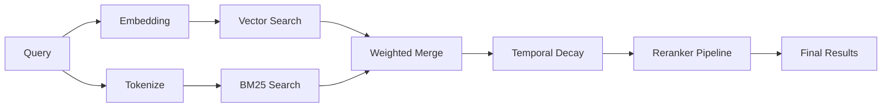

Memory rerankers sit between the initial hybrid retrieval (vector + keyword) and the final results returned to the agent. They take the merged candidate pool and re-rank it using a more sophisticated signal — either diversity-aware MMR or an external model reranker.

## The reranking pipeline



1. **Hybrid merge** combines vector and keyword scores.
2. **Temporal decay** applies a recency multiplier to each candidate.
3. **Reranker pipeline** reorders the decayed candidates using one or more reranker stages.

## Reranker types

### MMR (Maximal Marginal Relevance)

The bundled `memory-mmr` reranker uses a mathematical diversity signal to spread results across different topics. Reference it as a stage with `provider: "memory-mmr"`.

- **lambda = 1.0**: relevance-only (keeps the highest-scoring candidates)
- **lambda = 0.0**: diversity-only (spreads results as far apart as possible)
- **lambda = 0.7** (default): balanced relevance and diversity

### External rerankers

The `memory-external-reranker` plugin proxies reranking requests to any Cohere-compatible `/v1/rerank` endpoint. This includes cloud services (Cohere, Jina, Voyage AI) and local servers (llama.cpp, vLLM).

External rerankers use a learned relevance model rather than a mathematical diversity signal, which can produce more nuanced rankings when the query intent is complex.

### Staged reranking

The pipeline is an ordered list of `rerank.stages`. Each stage reranks the output of the previous stage with one plugin, then its `topK` filter narrows the survivors before the next stage runs. Putting a fast, lower-precision reranker first and a slow, higher-precision reranker later keeps the expensive stage from ever scoring the full candidate pool. Stages whose plugin is not installed are skipped, and a stage that fails keeps the previous stage's ordering.

```json5
{
  agents: {
    defaults: {
      memorySearch: {
        query: {
          hybrid: {
            rerank: {
              enabled: true,
              stages: [
                // Fast local diversity pass narrows 1000s of candidates to 50…
                { provider: "memory-mmr", lambda: 0.5, topK: 50 },
                // …then the slow, precise external reranker only scores those 50.
                { provider: "memory-external-reranker", lambda: 0.8 },
              ],
            },
          },
        },
      },
    },
  },
}
```

## Temporal decay and reranking

When temporal decay is enabled, the hybrid pipeline multiplies each candidate's numeric score by an exponential decay factor before the reranker pipeline runs. The decay factor is computed from the file's modification time or its date-encoded path (`memory/YYYY-MM-DD.md`) and the configured `temporalDecay.halfLifeDays`.

The reranker pipeline therefore receives candidates that already reflect recency in their scores. Evergreen files (`MEMORY.md` and non-dated `memory/**/*.md` topic files) are exempt from decay and pass through with their original scores.

## Fallback behavior

Reranking is best-effort. If a stage throws an error or returns no usable results:

1. The pipeline logs the failure and keeps the previous stage's ordering.
2. Remaining stages still run on that ordering.
3. If every stage is skipped or fails, the merged (and temporally decayed) results are returned in score order.

This ensures memory search always returns results, even when reranking is unavailable.

## Configuration

| Key                        | Type      | Default | Description                                                           |
| -------------------------- | --------- | ------- | --------------------------------------------------------------------- |
| `rerank.enabled`           | `boolean` | `false` | Enable the staged reranking pipeline                                  |
| `rerank.stages[]`          | `array`   | `[]`    | Ordered list of reranker stages                                       |
| `rerank.stages[].provider` | `string`  | —       | Reranker plugin ID (e.g. `memory-mmr`, `memory-external-reranker`)    |
| `rerank.stages[].topK`     | `number`  | —       | Top-K survivors passed to the next stage (ignored on the final stage) |
| `rerank.stages[].lambda`   | `number`  | `0.7`   | Stage-specific relevance/diversity balance (MMR-only)                 |

For full configuration details, see the [Memory configuration reference](/reference/memory-config).

## Further reading

- [Memory search](/concepts/memory-search): search pipeline and tuning.
- [External reranker plugin](/plugins/memory-external-reranker): Cohere-compatible reranking setup.
- [Memory MMR plugin](/plugins/reference/memory-mmr): bundled diversity reranker.
- [Memory External Reranker plugin](/plugins/reference/memory-external-reranker): external reranker plugin reference.
- [Memory configuration reference](/reference/memory-config): all config knobs.
