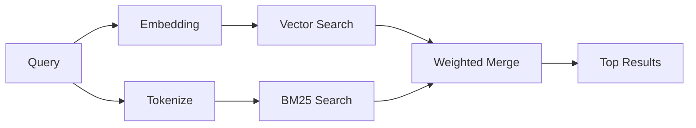

# 记忆搜索

`memory_search` 从你的记忆文件中找到相关笔记，即使措辞与原始文本不同。它通过将记忆索引为小块并使用嵌入、关键词或两者搜索它们来工作。

## 快速开始

如果你配置了GitHub Copilot订阅、OpenAI、Gemini、Voyage或Mistral API密钥，记忆搜索会自动工作。要明确设置提供者：

```json5
{
  agents: {
    defaults: {
      memorySearch: {
        provider: "openai", // 或 "gemini", "local", "ollama" 等
      },
    },
  },
}
```

对于没有API密钥的本地嵌入，使用 `provider: "local"`（需要node-llama-cpp）。

## 支持的提供者

| 提供者         | ID               | 需要API密钥 | 备注                      |
| -------------- | ---------------- | ----------- | ------------------------- |
| Bedrock        | `bedrock`        | 否          | 当AWS凭证链解析时自动检测 |
| Gemini         | `gemini`         | 是          | 支持图像/音频索引         |
| GitHub Copilot | `github-copilot` | 否          | 自动检测，使用Copilot订阅 |
| 本地           | `local`          | 否          | GGUF模型，~0.6 GB下载     |
| Mistral        | `mistral`        | 是          | 自动检测                  |
| Ollama         | `ollama`         | 否          | 本地，必须明确设置        |
| OpenAI         | `openai`         | 是          | 自动检测，快速            |
| Voyage         | `voyage`         | 是          | 自动检测                  |

## 搜索如何工作

OpenClaw并行运行两个检索路径并合并结果：



- **向量搜索**找到含义相似的笔记（"gateway host" 匹配 "运行OpenClaw的机器"）。
- **BM25关键词搜索**找到精确匹配（ID、错误字符串、配置键）。

如果只有一个路径可用（没有嵌入或没有FTS），另一个路径单独运行。

当嵌入不可用时，OpenClaw仍然对FTS结果使用词法排序，而不是仅回退到原始精确匹配排序。这种降级模式会提升具有更强查询词覆盖和相关文件路径的块，即使没有`sqlite-vec`或嵌入提供者，也能保持回忆有用。

## 提高搜索质量

当你有大量笔记历史时，两个可选功能会有所帮助：

### 时间衰减

旧笔记逐渐失去排名权重，因此最近的信息首先显示。默认半衰期为30天，上个月的笔记得分是其原始权重的50%。像`MEMORY.md`这样的常青文件永远不会衰减。

<Tip>
如果你的代理有几个月的日常笔记，并且过时信息持续超过最近的上下文，请启用时间衰减。
</Tip>

### MMR（多样性）

减少冗余结果。如果五个笔记都提到相同的路由器配置，MMR确保顶部结果覆盖不同的主题，而不是重复。

<Tip>
如果`memory_search`不断从不同的日常笔记中返回几乎重复的片段，请启用MMR。
</Tip>

### 同时启用两者

```json5
{
  agents: {
    defaults: {
      memorySearch: {
        query: {
          hybrid: {
            mmr: { enabled: true },
            temporalDecay: { enabled: true },
          },
        },
      },
    },
  },
}
```

## 多模态记忆

使用Gemini Embedding 2，你可以将图像和音频文件与Markdown一起索引。搜索查询仍然是文本，但它们会与视觉和音频内容匹配。有关设置，请参阅[记忆配置参考](/reference/memory-config)。

## 会话记忆搜索

你可以选择索引会话记录，以便`memory_search`可以回忆早期对话。这是通过`memorySearch.experimental.sessionMemory`选择加入的。有关详细信息，请参阅[配置参考](/reference/memory-config)。

## 故障排除

**没有结果？** 运行`openclaw memory status`检查索引。如果为空，运行`openclaw memory index --force`。

**只有关键词匹配？** 你的嵌入提供者可能未配置。检查`openclaw memory status --deep`。

**找不到CJK文本？** 使用`openclaw memory index --force`重建FTS索引。

## 进一步阅读

- [主动记忆](/concepts/active-memory) -- 交互式聊天会话的子代理记忆
- [记忆](/concepts/memory) -- 文件布局、后端、工具
- [记忆配置参考](/reference/memory-config) -- 所有配置旋钮
