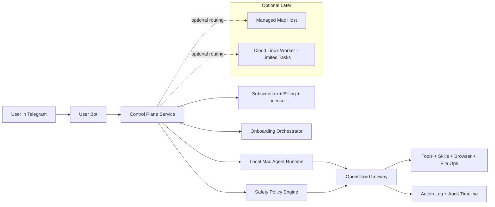

# OpenClaw Consumer Wrapper — Architecture, MVP, Pricing, Launch Plan

## 0) Positioning (the one-liner)

**“Your personal AI operator in Telegram, running on your own Mac.”**

Not a generic chatbot. Not “another agent framework.”
A practical operator with real-world reliability and trust controls.

---

## 1) Product architecture (v1)

### Core components

1. **Client layer (Telegram-first)**
   - User talks to personal bot.
   - Bot identity is user-owned.

2. **Control plane (your SaaS layer)**
   - Onboarding orchestration
   - Subscription/licensing
   - Device registration and health status
   - Remote pause/revoke

3. **Execution plane (local-first)**
   - OpenClaw runtime on user Mac
   - Full local capability (browser sessions, files, desktop apps)

4. **Safety layer (not approval spam)**
   - Policy profiles: Safe / Balanced / Power
   - Irreversible action gate only
   - Panic pause + session kill

5. **Observability layer**
   - Human-readable timeline (“what happened”)
   - Action replay metadata for debugging and trust

---

## 2) Security model for MVP (minimal but real)

### Action classes

- **Class A — Low risk (auto-allow)**
  - Read files, summarize, research, draft text, navigate pages

- **Class B — Medium risk (policy-driven)**
  - Edit local files, post drafts, create calendar drafts

- **Class C — Irreversible/high risk (must confirm)**
  - External send (email/message)
  - Payments/checkout/booking final submit
  - Deletes/destructive commands
  - Account/security settings changes

### Default profile recommendation

- Start users on **Balanced**.
- Let advanced users flip to **Power**.
- Don’t default to Safe unless user explicitly wants high friction.

---

## 3) MVP scope (P0)

## Must ship (P0)

1. **Installer + setup wizard on macOS**
2. **Telegram channel setup (guided BotFather flow, manual step)**
3. **Runtime health checks + auto-reconnect**
4. **Safety profiles (Safe/Balanced/Power)**
5. **Irreversible action confirmation gate**
6. **Activity timeline UI/log view**
7. **Panic pause button**
8. **Basic billing + license enforcement**

## Nice-to-have but can wait (P1)

1. WhatsApp channel
2. Managed Mac hosting tier
3. Cloud worker for limited tasks
4. Team/shared mode
5. Mobile controller app

---

## 4) Pricing model (recommended)

## Tier structure

1. **Starter (Local)** — $29/mo
   - 1 device
   - Telegram
   - Balanced/Power modes
   - Community support

2. **Pro (Local+)** — $79/mo
   - 2–3 devices
   - Priority queue for heavy tasks
   - Advanced policy customization
   - Faster support

3. **Concierge (Managed Mac)** — $249–$499/mo
   - You host/operate managed Mac environment
   - White-glove onboarding
   - SLA + premium support

## Why this pricing works

- Starter low enough to validate demand quickly.
- Pro captures power users with higher willingness to pay.
- Concierge becomes high-margin service moat.

---

## 5) 30-day launch plan

## Week 1 — Foundations

- Lock architecture and safety policy contract
- Implement policy engine + action classifier
- Build onboarding flow copy and screens
- Set up billing skeleton

## Week 2 — Core product

- Telegram-first end-to-end working path
- Activity timeline + panic pause
- Health monitor + reconnect/restart handlers

## Week 3 — Private beta

- 15–30 design partners
- Daily bug triage + onboarding friction fixes
- Collect time-to-value and retention signals

## Week 4 — Public launch v1

- Public landing page and waitlist conversion
- Founder-led demos
- Weekly shipping cadence + changelog marketing

---

## 6) Launch metrics (what matters)

1. **Activation rate**: install → first successful delegated task
2. **Time to first value**: target under 10 minutes
3. **7-day retention**: users running at least 3 delegated tasks/week
4. **Autonomy success rate**: tasks completed without manual rescue
5. **Trust incidents**: accidental unsafe actions (target near zero)

If these are healthy, scale. If not, fix onboarding + reliability first.

---

## 7) Open questions to resolve now

1. **Bot identity strategy**
   - User-owned bot token vs shared bot + tenant routing
2. **Policy explainability UX**
   - How to clearly explain why an action was blocked/requested
3. **Local app UX**
   - Menu bar only vs full desktop shell
4. **Model routing**
   - Single default provider vs user-owned API keys
5. **Support model**
   - Product-led vs concierge-heavy
6. **Legal boundaries**
   - Terms around autonomous actions and user liability boundaries

---

## 8) Clear recommendation

Start **narrow and brutal**:

- macOS local runtime
- Telegram only
- Balanced safety default
- one killer promise: **“delegate real digital work from chat, safely, on your own machine.”**

Everything else is phase 2.

---

## 9) Artifact format recommendation

Use **one artifact document with embedded visual architecture diagram** (like this file).

Why:

- Easy to share with builders + investors
- One source of truth
- You can export to pitch deck later without rewriting
