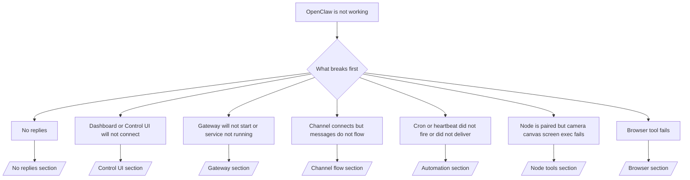

# Fejlfinding

Hvis du kun har 2 minutter, så brug denne side som en triage-indgang.

## Første 60 sekunder

Kør denne præcise trappe i rækkefølge:

```bash
openclaw status
openclaw status --all
openclaw gateway probe
openclaw gateway status
openclaw doctor
openclaw channels status --probe
openclaw logs --follow
```

Godt output på én linje:

- `openclaw status` → viser konfigurerede kanaler og ingen åbenlyse auth-fejl.
- `openclaw status --all` → fuld rapport er til stede og kan deles.
- `openclaw gateway probe` → forventet gateway-mål er tilgængeligt.
- `openclaw gateway status` → `Runtime: running` og `RPC probe: ok`.
- `openclaw doctor` → ingen blokerende konfigurations-/servicefejl.
- `openclaw channels status --probe` → kanaler rapporterer `connected` eller `ready`.
- `openclaw logs --follow` → stabil aktivitet, ingen gentagne fatale fejl.

## Beslutningstræ



<AccordionGroup>
  <Accordion title="No replies">
    ```bash
    openclaw status
    openclaw gateway status
    openclaw channels status --probe
    openclaw pairing list <channel>
    openclaw logs --follow
    ```

    ```
    Godt output ser sådan ud:
    
    - `Runtime: running`
    - `RPC probe: ok`
    - Din kanal viser forbundet/klar i `channels status --probe`
    - Afsenderen fremstår godkendt (eller DM-politikken er åben/tilladelsesliste)
    
    Almindelige logsignaturer:
    
    - `drop guild message (mention required` → mention-gating blokerede beskeden i Discord.
    - `pairing request` → afsender er ikke godkendt og afventer DM-parringsgodkendelse.
    - `blocked` / `allowlist` i kanallogs → afsender, rum eller gruppe er filtreret.
    
    Dybdegående sider:
    
    - [/gateway/troubleshooting#no-replies](/gateway/troubleshooting#no-replies)
    - [/channels/troubleshooting](/channels/troubleshooting)
    - [/channels/pairing](/channels/pairing)
    ```

  </Accordion>

  <Accordion title="Dashboard or Control UI will not connect">
    ```bash
    openclaw status
    openclaw gateway status
    openclaw logs --follow
    openclaw doctor
    openclaw channels status --probe
    ```

    ```
    Godt output ser sådan ud:
    
    - `Dashboard: http://...` vises i `openclaw gateway status`
    - `RPC probe: ok`
    - Ingen auth-loop i logs
    
    Almindelige logsignaturer:
    
    - `device identity required` → HTTP/ikke-sikker kontekst kan ikke fuldføre enhedsautentificering.
    - `unauthorized` / genforbindelses-loop → forkert token/adgangskode eller mismatch i auth-tilstand.
    - `gateway connect failed:` → UI’et peger på forkert URL/port eller en utilgængelig gateway.
    
    Dybdegående sider:
    
    - [/gateway/troubleshooting#dashboard-control-ui-connectivity](/gateway/troubleshooting#dashboard-control-ui-connectivity)
    - [/web/control-ui](/web/control-ui)
    - [/gateway/authentication](/gateway/authentication)
    ```

  </Accordion>

  <Accordion title="Gateway will not start or service installed but not running">
    ```bash
    openclaw status
    openclaw gateway status
    openclaw logs --follow
    openclaw doctor
    openclaw channels status --probe
    ```

    ```
    Godt output ser sådan ud:
    
    - `Service: ... (loaded)`
    - `Runtime: running`
    - `RPC probe: ok`
    
    Almindelige logsignaturer:
    
    - `Gateway start blocked: set gateway.mode=local` → gateway-tilstand er ikke sat/er remote.
    - `refusing to bind gateway ... without auth` → ikke-loopback binding uden token/adgangskode.
    - `another gateway instance is already listening` eller `EADDRINUSE` → porten er allerede i brug.
    
    Dybdegående sider:
    
    - [/gateway/troubleshooting#gateway-service-not-running](/gateway/troubleshooting#gateway-service-not-running)
    - [/gateway/background-process](/gateway/background-process)
    - [/gateway/configuration](/gateway/configuration)
    ```

  </Accordion>

  <Accordion title="Channel connects but messages do not flow">
    ```bash
    openclaw status
    openclaw gateway status
    openclaw logs --follow
    openclaw doctor
    openclaw channels status --probe
    ```

    ```
    Godt output ser sådan ud:
    
    - Kanaltransporten er forbundet.
    - Parrings-/tilladelseslistekontroller består.
    - Mentions registreres, hvor det kræves.
    
    Almindelige logsignaturer:
    
    - `mention required` → gruppemention-gating blokerede behandlingen.
    - `pairing` / `pending` → DM-afsender er endnu ikke godkendt.
    - `not_in_channel`, `missing_scope`, `Forbidden`, `401/403` → problem med kanalens tilladelsestoken.
    
    Dybdegående sider:
    
    - [/gateway/troubleshooting#channel-connected-messages-not-flowing](/gateway/troubleshooting#channel-connected-messages-not-flowing)
    - [/channels/troubleshooting](/channels/troubleshooting)
    ```

  </Accordion>

  <Accordion title="Cron or heartbeat did not fire or did not deliver">
    ```bash
    openclaw status
    openclaw gateway status
    openclaw cron status
    openclaw cron list
    openclaw cron runs --id <jobId> --limit 20
    openclaw logs --follow
    ```

    ```
    Godt output ser sådan ud:
    
    - `cron.status` vises som aktiveret med næste opvågning.
    - `cron runs` viser nylige `ok`-poster.
    - Heartbeat er aktiveret og ikke uden for aktive timer.
    
    Almindelige logsignaturer:
    
    - `cron: scheduler disabled; jobs will not run automatically` → cron er deaktiveret.
    - `heartbeat skipped` med `reason=quiet-hours` → uden for konfigurerede aktive timer.
    - `requests-in-flight` → hovedbanen er optaget; heartbeat-opvågning blev udskudt.
    - `unknown accountId` → mål-kontoen for heartbeat-levering findes ikke.
    
    Dybdegående sider:
    
    - [/gateway/troubleshooting#cron-and-heartbeat-delivery](/gateway/troubleshooting#cron-and-heartbeat-delivery)
    - [/automation/troubleshooting](/automation/troubleshooting)
    - [/gateway/heartbeat](/gateway/heartbeat)
    ```

  </Accordion>

  <Accordion title="Node is paired but tool fails camera canvas screen exec">
    ```bash
    openclaw status
    openclaw gateway status
    openclaw nodes status
    openclaw nodes describe --node <idOrNameOrIp>
    openclaw logs --follow
    ```

    ```
    Godt output ser sådan ud:
    
    - Node er listet som forbundet og parret til rollen `node`.
    - Kapabilitet findes for den kommando, du kalder.
    - Tilladelsestilstanden er givet for værktøjet.
    
    Almindelige logsignaturer:
    
    - `NODE_BACKGROUND_UNAVAILABLE` → bring node-appen i forgrunden.
    - `*_PERMISSION_REQUIRED` → OS-tilladelse blev afvist/mangler.
    - `SYSTEM_RUN_DENIED: approval required` → exec-godkendelse afventer.
    - `SYSTEM_RUN_DENIED: allowlist miss` → kommandoen er ikke på exec-tilladelseslisten.
    
    Dybdegående sider:
    
    - [/gateway/troubleshooting#node-paired-tool-fails](/gateway/troubleshooting#node-paired-tool-fails)
    - [/nodes/troubleshooting](/nodes/troubleshooting)
    - [/tools/exec-approvals](/tools/exec-approvals)
    ```

  </Accordion>

  <Accordion title="Browser tool fails">
    ```bash
    openclaw status
    openclaw gateway status
    openclaw browser status
    openclaw logs --follow
    openclaw doctor
    ```

    ```
    Godt output ser sådan ud:
    
    - Browserstatus viser `running: true` og en valgt browser/profil.
    - `openclaw`-profil starter, eller `chrome`-relay har en tilknyttet fane.
    
    Almindelige logsignaturer:
    
    - `Failed to start Chrome CDP on port` → lokal browserstart mislykkedes.
    - `browser.executablePath not found` → konfigureret binær sti er forkert.
    - `Chrome extension relay is running, but no tab is connected` → udvidelse er ikke tilknyttet.
    - `Browser attachOnly is enabled ... not reachable` → attach-only-profil har intet live CDP-mål.
    
    Dybdegående sider:
    
    - [/gateway/troubleshooting#browser-tool-fails](/gateway/troubleshooting#browser-tool-fails)
    - [/tools/browser-linux-troubleshooting](/tools/browser-linux-troubleshooting)
    - [/tools/chrome-extension](/tools/chrome-extension)
    ```

  </Accordion>
</AccordionGroup>
