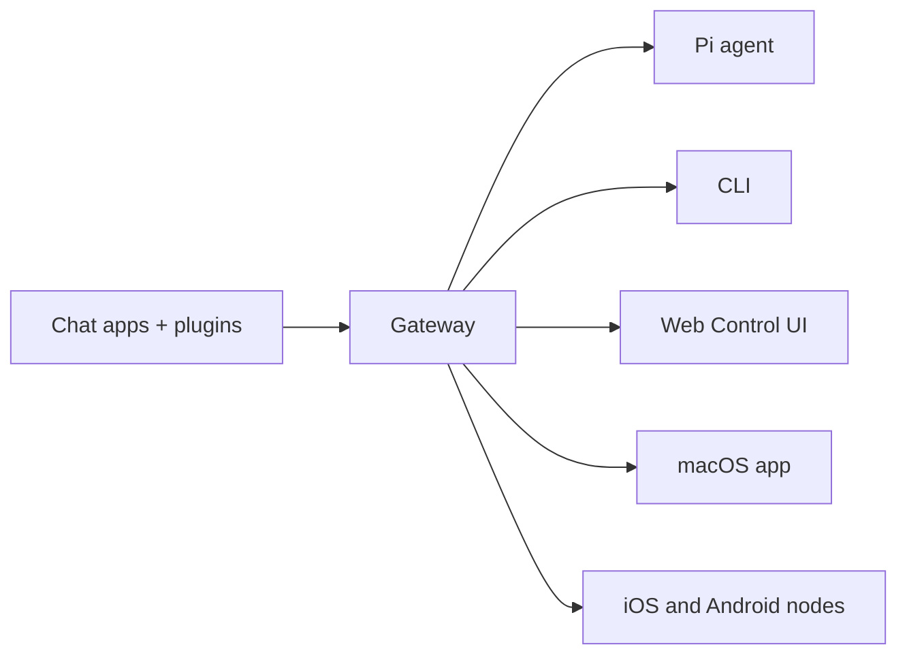

# OpenClaw 🦞

<p align="center">
    
    
</p>

> _"EXFOLIATE! EKFOLIATE!"_ — En rumhummer, sandsynligvis

<p align="center"><strong>Enhver OS gateway for AI agenter på tværs WhatsApp, Telegram, Discord, iMessage og meget mere.</strong><br />
  Send en besked, få et agent svar fra din lomme. Plugins tilføjer mest og meget mere.
</p>

<Columns>
  <Card title="Get Started" href="/start/getting-started" icon="rocket">
    Installér OpenClaw og få Gateway op at køre på få minutter.
  </Card>
  <Card title="Run the Wizard" href="/start/wizard" icon="sparkles">
    Guidet opsætning med `openclaw onboard` og parringsflows.
  </Card>
  <Card title="Open the Control UI" href="/web/control-ui" icon="layout-dashboard">
    Start browser-dashboardet til chat, konfiguration og sessioner.
  </Card>
</Columns>

## Hvad er OpenClaw?

OpenClaw er en \*\* self-hosted gateway\*\* der forbinder dine foretrukne chat apps — WhatsApp, Telegram, Discord, iMessage og mere — til AI kodning agenter som Pi. Du kører en enkelt Gateway proces på din egen maskine (eller en server), og det bliver broen mellem dine beskedapps og en altid-tilgængelig AI-assistent.

**Hvem er det til?** Udviklere og power users, der vil have en personlig AI-assistent, som de kan skrive til hvor som helst — uden at give afkald på kontrollen over deres data eller være afhængige af en hosted tjeneste.

**Hvad gør det anderledes?**

- **Self-hosted**: kører på dit hardware, efter dine regler
- **Multikanal**: én Gateway betjener WhatsApp, Telegram, Discord og mere samtidigt
- **Agent-native**: bygget til kodeagenter med værktøjsbrug, sessioner, hukommelse og multi-agent-routing
- **Open source**: MIT-licens, community-drevet

**Hvad har du brug for?** Node 22+, en API-nøgle (Anthropic anbefales) og 5 minutter.

## Sådan virker det



Gateway er den eneste sandhedskilde for sessioner, routing og kanalfobindelser.

## Centrale funktioner

<Columns>
  <Card title="Multi-channel gateway" icon="network">
    WhatsApp, Telegram, Discord og iMessage med én Gateway-proces.
  </Card>
  <Card title="Plugin channels" icon="plug">
    Tilføj Mattermost og mere med udvidelsespakker.
  </Card>
  <Card title="Multi-agent routing" icon="route">
    Isolerede sessioner pr. agent, workspace eller afsender.
  </Card>
  <Card title="Media support" icon="image">
    Send og modtag billeder, lyd og dokumenter.
  </Card>
  <Card title="Web Control UI" icon="monitor">
    Browser-dashboard til chat, konfiguration, sessioner og noder.
  </Card>
  <Card title="Mobile nodes" icon="smartphone">
    Par iOS- og Android-noder med Canvas-understøttelse.
  </Card>
</Columns>

## Hurtig start

<Steps>
  <Step title="Install OpenClaw">
    ```bash
    npm install -g openclaw@latest
    ```
  </Step>
  <Step title="Onboard and install the service">
    ```bash
    openclaw onboard --install-daemon
    ```
  </Step>
  <Step title="Pair WhatsApp and start the Gateway">
    ```bash
    openclaw channels login
    openclaw gateway --port 18789
    ```
  </Step>
</Steps>

Har du brug for den fulde installation og dev opsætning? Se [Hurtig start](/start/quickstart).

## Dashboard

Åbn Control UI i browseren, efter Gateway er startet.

- Lokal standard: [http://127.0.0.1:18789/](http://127.0.0.1:18789/)
- Fjernadgang: [Web surfaces](/web) og [Tailscale](/gateway/tailscale)

<p align="center">
  
</p>

## Konfiguration (valgfrit)

Konfigurationen findes på `~/.openclaw/openclaw.json`.

- Hvis du **ikke gør noget**, bruger OpenClaw den medfølgende Pi-binary i RPC-tilstand med sessioner pr. afsender.
- Hvis du vil låse det ned, så start med `channels.whatsapp.allowFrom` og (for grupper) nævneregler.

Eksempel:

```json5
{
  channels: {
    whatsapp: {
      allowFrom: ["+15555550123"],
      groups: { "*": { requireMention: true } },
    },
  },
  messages: { groupChat: { mentionPatterns: ["@openclaw"] } },
}
```

## Start her

<Columns>
  <Card title="Docs hubs" href="/start/hubs" icon="book-open">
    Al dokumentation og guides, organiseret efter brugsscenarie.
  </Card>
  <Card title="Configuration" href="/gateway/configuration" icon="settings">
    Centrale Gateway-indstillinger, tokens og udbyderkonfiguration.
  </Card>
  <Card title="Remote access" href="/gateway/remote" icon="globe">
    SSH- og tailnet-adgangsmønstre.
  </Card>
  <Card title="Channels" href="/channels/telegram" icon="message-square">
    Kanal-specifik opsætning for WhatsApp, Telegram, Discord og mere.
  </Card>
  <Card title="Nodes" href="/nodes" icon="smartphone">
    iOS- og Android-noder med parring og Canvas.
  </Card>
  <Card title="Help" href="/help" icon="life-buoy">
    Almindelige løsninger og indgang til fejlfinding.
  </Card>
</Columns>

## Lær mere

<Columns>
  <Card title="Full feature list" href="/concepts/features" icon="list">
    Komplette kanal-, routing- og mediefunktioner.
  </Card>
  <Card title="Multi-agent routing" href="/concepts/multi-agent" icon="route">
    Workspace-isolation og sessioner pr. agent.
  </Card>
  <Card title="Security" href="/gateway/security" icon="shield">
    Tokens, tilladelseslister og sikkerhedskontroller.
  </Card>
  <Card title="Troubleshooting" href="/gateway/troubleshooting" icon="wrench">
    Gateway-diagnostik og almindelige fejl.
  </Card>
  <Card title="About and credits" href="/reference/credits" icon="info">
    Projektets oprindelse, bidragydere og licens.
  </Card>
</Columns>
