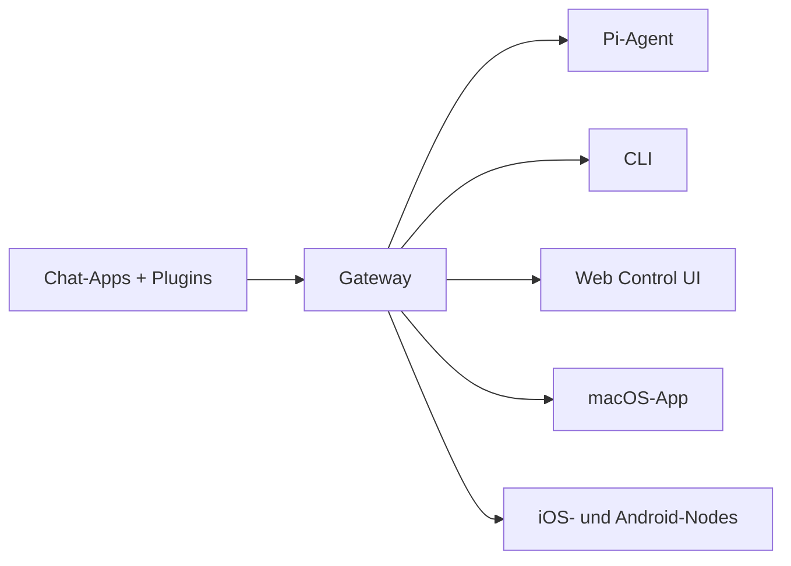

# OpenClaw 🦞

<p align="center">
    
    
</p>

> _"EXFOLIATE! EXFOLIATE!"_ — Wahrscheinlich ein Weltraumhummer

<p align="center">
  <strong>Gateway für KI-Agenten auf jedem Betriebssystem, mit WhatsApp, Telegram, Discord, iMessage und mehr.</strong><br />
  Sende eine Nachricht und erhalte Antworten vom Agenten aus der Hosentasche. Plugins bringen Mattermost und weitere Kanäle dazu.
</p>

<Columns>
  <Card title="Loslegen" href="/start/getting-started" icon="rocket">
    Installiere OpenClaw und starte das Gateway in wenigen Minuten.
  </Card>
  <Card title="Wizard starten" href="/start/wizard" icon="sparkles">
    Geführtes Setup mit `openclaw onboard` und Pairing-Flows.
  </Card>
  <Card title="Control UI öffnen" href="/web/control-ui" icon="layout-dashboard">
    Starte das Browser-Dashboard für Chat, Konfiguration und Sessions.
  </Card>
</Columns>

## Was ist OpenClaw?

OpenClaw ist ein **selbst gehostetes Gateway**, das deine bevorzugten Chat-Apps — WhatsApp, Telegram, Discord, iMessage und mehr — mit KI-Coding-Agents wie Pi verbindet. Du betreibst einen einzigen Gateway-Prozess auf deiner eigenen Maschine (oder einem Server), der zur Brücke zwischen deinen Messaging-Apps und einem jederzeit verfügbaren KI-Assistenten wird.

**Für wen ist das?** Für Entwicklerinnen und Power-User, die einen persönlichen KI-Assistenten wollen, den sie von überall aus anschreiben können — ohne die Kontrolle über ihre Daten aufzugeben oder sich auf einen gehosteten Dienst zu verlassen.

**Was macht es anders?**

- **Selbst gehostet**: läuft auf deiner Hardware, nach deinen Regeln
- **Multi-Channel**: ein Gateway bedient WhatsApp, Telegram, Discord und mehr gleichzeitig
- **Agenten-nativ**: gebaut für Coding-Agents mit Tool-Use, Sessions, Memory und Multi-Agent-Routing
- **Open Source**: MIT-Lizenz, von der Community getragen

**Was brauchst du?** Node 22+, einen API-Key (Anthropic empfohlen) und 5 Minuten.

## Wie es funktioniert



Das Gateway ist die zentrale Quelle für Sessions, Routing und Channel-Verbindungen.

## Zentrale Fähigkeiten

<Columns>
  <Card title="Multi-Channel-Gateway" icon="network">
    WhatsApp, Telegram, Discord und iMessage über einen einzigen Gateway-Prozess.
  </Card>
  <Card title="Plugin-Channels" icon="plug">
    Ergänze Mattermost und weitere Kanäle über Erweiterungspakete.
  </Card>
  <Card title="Multi-Agent-Routing" icon="route">
    Getrennte Sessions pro Agent, Workspace oder Absender.
  </Card>
  <Card title="Medienunterstützung" icon="image">
    Sende und empfange Bilder, Audio und Dokumente.
  </Card>
  <Card title="Web Control UI" icon="monitor">
    Browser-Dashboard für Chat, Konfiguration, Sessions und Nodes.
  </Card>
  <Card title="Mobile Nodes" icon="smartphone">
    iOS- und Android-Nodes mit Canvas-Unterstützung koppeln.
  </Card>
</Columns>

## Schnellstart

<Steps>
  <Step title="OpenClaw installieren">
    ```bash
    npm install -g openclaw@latest
    ```
  </Step>
  <Step title="Onboarding und Dienst installieren">
    ```bash
    openclaw onboard --install-daemon
    ```
  </Step>
  <Step title="WhatsApp koppeln und Gateway starten">
    ```bash
    openclaw channels login
    openclaw gateway --port 18789
    ```
  </Step>
</Steps>

Brauchst du das vollständige Installations- und Dev-Setup? Sieh dir [Quick start](/start/quickstart) an.

## Dashboard

Öffne das Control UI im Browser, nachdem das Gateway gestartet ist.

- Lokaler Standard: [http://127.0.0.1:18789/](http://127.0.0.1:18789/)
- Remote-Zugriff: [Web surfaces](/web) und [Tailscale](/gateway/tailscale)

<p align="center">
  
</p>

## Konfiguration (optional)

Die Konfiguration liegt unter `~/.openclaw/openclaw.json`.

- Wenn du **nichts machst**, nutzt OpenClaw das gebündelte Pi-Binary im RPC-Modus mit Sessions pro Absender.
- Wenn du es einschränken möchtest, starte mit `channels.whatsapp.allowFrom` und (für Gruppen) mit Mention-Regeln.

Beispiel:

```json5
{
  channels: {
    whatsapp: {
      allowFrom: ["+15555550123"],
      groups: { "*": { requireMention: true } },
    },
  },
  messages: { groupChat: { mentionPatterns: ["@openclaw"] } },
}
```

## Starte hier

<Columns>
  <Card title="Dokumentations-Hubs" href="/start/hubs" icon="book-open">
    Alle Dokus und Guides, nach Anwendungsfällen sortiert.
  </Card>
  <Card title="Konfiguration" href="/gateway/configuration" icon="settings">
    Kern-Gateway-Einstellungen, Tokens und Provider-Konfiguration.
  </Card>
  <Card title="Remote-Zugriff" href="/gateway/remote" icon="globe">
    SSH- und Tailnet-Zugriffsmuster.
  </Card>
  <Card title="Channels" href="/channels/telegram" icon="message-square">
    Channel-spezifisches Setup für WhatsApp, Telegram, Discord und mehr.
  </Card>
  <Card title="Nodes" href="/nodes" icon="smartphone">
    iOS- und Android-Nodes mit Pairing und Canvas.
  </Card>
  <Card title="Hilfe" href="/help" icon="life-buoy">
    Einstiegspunkt für häufige Fixes und Troubleshooting.
  </Card>
</Columns>

## Mehr erfahren

<Columns>
  <Card title="Komplette Feature-Liste" href="/concepts/features" icon="list">
    Vollständige Übersicht über Channel-, Routing- und Medienfunktionen.
  </Card>
  <Card title="Multi-Agent-Routing" href="/concepts/multi-agent" icon="route">
    Workspace-Isolation und Sessions pro Agent.
  </Card>
  <Card title="Sicherheit" href="/gateway/security" icon="shield">
    Tokens, Allowlists und Sicherheitskontrollen.
  </Card>
  <Card title="Troubleshooting" href="/gateway/troubleshooting" icon="wrench">
    Gateway-Diagnosen und häufige Fehler.
  </Card>
  <Card title="Überblick und Credits" href="/reference/credits" icon="info">
    Ursprung des Projekts, Mitwirkende und Lizenz.
  </Card>
</Columns>
