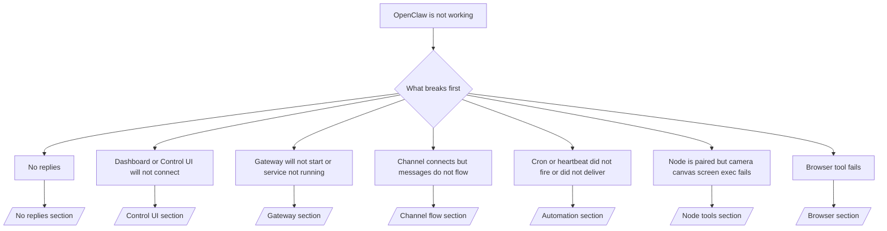

# Fehlerbehebung

Wenn Sie nur 2 Minuten haben, nutzen Sie diese Seite als Triage-Einstieg.

## Die ersten 60 Sekunden

Führen Sie diese exakte Abfolge der Reihe nach aus:

```bash
openclaw status
openclaw status --all
openclaw gateway probe
openclaw gateway status
openclaw doctor
openclaw channels status --probe
openclaw logs --follow
```

Gute Ausgabe in einer Zeile:

- `openclaw status` → zeigt konfigurierte Kanäle und keine offensichtlichen Authentifizierungsfehler.
- `openclaw status --all` → vollständiger Bericht ist vorhanden und teilbar.
- `openclaw gateway probe` → erwartetes Gateway-Ziel ist erreichbar.
- `openclaw gateway status` → `Runtime: running` und `RPC probe: ok`.
- `openclaw doctor` → keine blockierenden Konfigurations-/Servicefehler.
- `openclaw channels status --probe` → Kanäle melden `connected` oder `ready`.
- `openclaw logs --follow` → stetige Aktivität, keine sich wiederholenden fatalen Fehler.

## Entscheidungsbaum



<AccordionGroup>
  <Accordion title="No replies">
    ```bash
    openclaw status
    openclaw gateway status
    openclaw channels status --probe
    openclaw pairing list <channel>
    openclaw logs --follow
    ```

    ```
    Gute Ausgabe sieht so aus:
    
    - `Runtime: running`
    - `RPC probe: ok`
    - Ihr Kanal wird in `channels status --probe` als verbunden/bereit angezeigt
    - Absender erscheint genehmigt (oder DM-Richtlinie ist offen/Allowlist)
    
    Häufige Log-Signaturen:
    
    - `drop guild message (mention required` → Mention-Gating hat die Nachricht in Discord blockiert.
    - `pairing request` → Absender ist nicht genehmigt und wartet auf DM-Pairing-Freigabe.
    - `blocked` / `allowlist` in Kanal-Logs → Absender, Raum oder Gruppe wird gefiltert.
    
    Vertiefende Seiten:
    
    - [/gateway/troubleshooting#no-replies](/gateway/troubleshooting#no-replies)
    - [/channels/troubleshooting](/channels/troubleshooting)
    - [/channels/pairing](/channels/pairing)
    ```

  </Accordion>

  <Accordion title="Dashboard or Control UI will not connect">
    ```bash
    openclaw status
    openclaw gateway status
    openclaw logs --follow
    openclaw doctor
    openclaw channels status --probe
    ```

    ```
    Gute Ausgabe sieht so aus:
    
    - `Dashboard: http://...` wird in `openclaw gateway status` angezeigt
    - `RPC probe: ok`
    - Keine Auth-Schleife in den Logs
    
    Häufige Log-Signaturen:
    
    - `device identity required` → HTTP/nicht-sicherer Kontext kann die Geräteauthentifizierung nicht abschließen.
    - `unauthorized` / Wiederverbindungs-Schleife → falsches Token/Passwort oder Auth-Modus stimmt nicht überein.
    - `gateway connect failed:` → UI zielt auf die falsche URL/Port oder Gateway ist nicht erreichbar.
    
    Vertiefende Seiten:
    
    - [/gateway/troubleshooting#dashboard-control-ui-connectivity](/gateway/troubleshooting#dashboard-control-ui-connectivity)
    - [/web/control-ui](/web/control-ui)
    - [/gateway/authentication](/gateway/authentication)
    ```

  </Accordion>

  <Accordion title="Gateway will not start or service installed but not running">
    ```bash
    openclaw status
    openclaw gateway status
    openclaw logs --follow
    openclaw doctor
    openclaw channels status --probe
    ```

    ```
    Gute Ausgabe sieht so aus:
    
    - `Service: ... (loaded)`
    - `Runtime: running`
    - `RPC probe: ok`
    
    Häufige Log-Signaturen:
    
    - `Gateway start blocked: set gateway.mode=local` → Gateway-Modus ist nicht gesetzt/remote.
    - `refusing to bind gateway ... without auth` → Nicht-Loopback-Bind ohne Token/Passwort.
    - `another gateway instance is already listening` oder `EADDRINUSE` → Port bereits belegt.
    
    Vertiefende Seiten:
    
    - [/gateway/troubleshooting#gateway-service-not-running](/gateway/troubleshooting#gateway-service-not-running)
    - [/gateway/background-process](/gateway/background-process)
    - [/gateway/configuration](/gateway/configuration)
    ```

  </Accordion>

  <Accordion title="Channel connects but messages do not flow">
    ```bash
    openclaw status
    openclaw gateway status
    openclaw logs --follow
    openclaw doctor
    openclaw channels status --probe
    ```

    ```
    Gute Ausgabe sieht so aus:
    
    - Kanal-Transport ist verbunden.
    - Pairing-/Allowlist-Prüfungen bestehen.
    - Erwähnungen werden erkannt, wo erforderlich.
    
    Häufige Log-Signaturen:
    
    - `mention required` → Gruppen-Mention-Gating hat die Verarbeitung blockiert.
    - `pairing` / `pending` → DM-Absender ist noch nicht genehmigt.
    - `not_in_channel`, `missing_scope`, `Forbidden`, `401/403` → Problem mit Kanal-Berechtigungstoken.
    
    Vertiefende Seiten:
    
    - [/gateway/troubleshooting#channel-connected-messages-not-flowing](/gateway/troubleshooting#channel-connected-messages-not-flowing)
    - [/channels/troubleshooting](/channels/troubleshooting)
    ```

  </Accordion>

  <Accordion title="Cron or heartbeat did not fire or did not deliver">
    ```bash
    openclaw status
    openclaw gateway status
    openclaw cron status
    openclaw cron list
    openclaw cron runs --id <jobId> --limit 20
    openclaw logs --follow
    ```

    ```
    Gute Ausgabe sieht so aus:
    
    - `cron.status` zeigt aktiviert mit nächstem Aufwachen.
    - `cron runs` zeigt aktuelle `ok`-Einträge.
    - Heartbeat ist aktiviert und nicht außerhalb der aktiven Zeiten.
    
    Häufige Log-Signaturen:
    
    - `cron: scheduler disabled; jobs will not run automatically` → Cron ist deaktiviert.
    - `heartbeat skipped` mit `reason=quiet-hours` → außerhalb der konfigurierten aktiven Zeiten.
    - `requests-in-flight` → Hauptspur ausgelastet; Heartbeat-Aufwachen wurde verschoben.
    - `unknown accountId` → Zielkonto für Heartbeat-Zustellung existiert nicht.
    
    Vertiefende Seiten:
    
    - [/gateway/troubleshooting#cron-and-heartbeat-delivery](/gateway/troubleshooting#cron-and-heartbeat-delivery)
    - [/automation/troubleshooting](/automation/troubleshooting)
    - [/gateway/heartbeat](/gateway/heartbeat)
    ```

  </Accordion>

  <Accordion title="Node is paired but tool fails camera canvas screen exec">
    ```bash
    openclaw status
    openclaw gateway status
    openclaw nodes status
    openclaw nodes describe --node <idOrNameOrIp>
    openclaw logs --follow
    ```

    ```
    Gute Ausgabe sieht so aus:
    
    - Node ist als verbunden und gepaart für die Rolle `node` gelistet.
    - Fähigkeit für den aufgerufenen Befehl ist vorhanden.
    - Berechtigungsstatus ist für das Werkzeug erteilt.
    
    Häufige Log-Signaturen:
    
    - `NODE_BACKGROUND_UNAVAILABLE` → Node-App in den Vordergrund bringen.
    - `*_PERMISSION_REQUIRED` → OS-Berechtigung wurde verweigert/fehlt.
    - `SYSTEM_RUN_DENIED: approval required` → Exec-Freigabe steht noch aus.
    - `SYSTEM_RUN_DENIED: allowlist miss` → Befehl nicht auf der Exec-Allowlist.
    
    Vertiefende Seiten:
    
    - [/gateway/troubleshooting#node-paired-tool-fails](/gateway/troubleshooting#node-paired-tool-fails)
    - [/nodes/troubleshooting](/nodes/troubleshooting)
    - [/tools/exec-approvals](/tools/exec-approvals)
    ```

  </Accordion>

  <Accordion title="Browser tool fails">
    ```bash
    openclaw status
    openclaw gateway status
    openclaw browser status
    openclaw logs --follow
    openclaw doctor
    ```

    ```
    Gute Ausgabe sieht so aus:
    
    - Browser-Status zeigt `running: true` und einen gewählten Browser/Profil.
    - `openclaw`-Profil startet oder `chrome`-Relay hat einen angehängten Tab.
    
    Häufige Log-Signaturen:
    
    - `Failed to start Chrome CDP on port` → lokaler Browser-Start fehlgeschlagen.
    - `browser.executablePath not found` → konfigurierter Binärpfad ist falsch.
    - `Chrome extension relay is running, but no tab is connected` → Erweiterung nicht angehängt.
    - `Browser attachOnly is enabled ... not reachable` → Attach-only-Profil hat kein aktives CDP-Ziel.
    
    Vertiefende Seiten:
    
    - [/gateway/troubleshooting#browser-tool-fails](/gateway/troubleshooting#browser-tool-fails)
    - [/tools/browser-linux-troubleshooting](/tools/browser-linux-troubleshooting)
    - [/tools/chrome-extension](/tools/chrome-extension)
    ```

  </Accordion>
</AccordionGroup>
