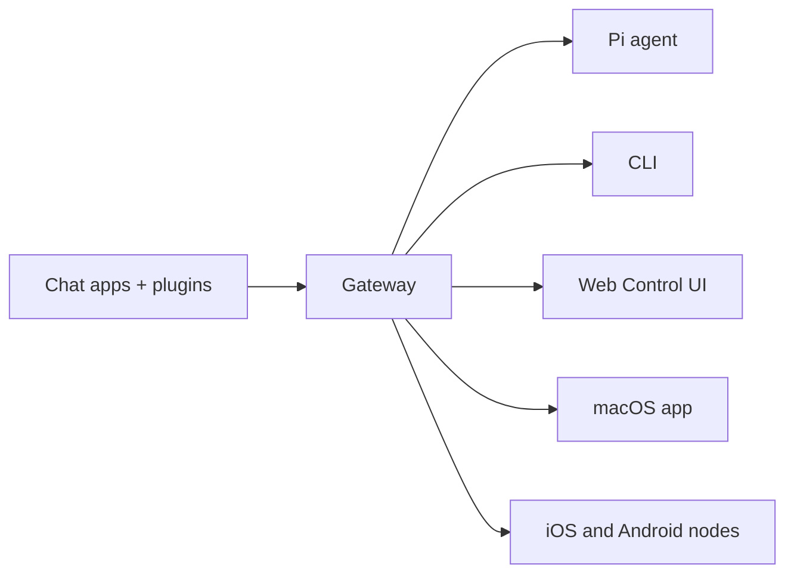

# OpenClaw 🦞

<p align="center">
    
    
</p>

> _„EXFOLIATE! EXFOLIATE!“_ — ein Weltraum-Hummer, vermutlich

<p align="center"><strong>Gateway für KI-Agenten auf jedem Betriebssystem – über WhatsApp, Telegram, Discord, iMessage und mehr.</strong><br />
  Senden Sie eine Nachricht und erhalten Sie eine Agentenantwort direkt aus Ihrer Tasche. Plugins fügen Mattermost und mehr hinzu.
</p>

<Columns>
  <Card title="Get Started" href="/start/getting-started" icon="rocket">
    Installieren Sie OpenClaw und bringen Sie das Gateway in Minuten zum Laufen.
  </Card>
  <Card title="Run the Wizard" href="/start/wizard" icon="sparkles">
    Geführte Einrichtung mit `openclaw onboard` und Kopplungsabläufen.
  </Card>
  <Card title="Open the Control UI" href="/web/control-ui" icon="layout-dashboard">
    Starten Sie das Browser-Dashboard für Chat, Konfiguration und Sitzungen.
  </Card>
</Columns>

## Was ist OpenClaw?

OpenClaw ist ein **selbst gehostetes Gateway**, das Ihre bevorzugten Chat-Apps – WhatsApp, Telegram, Discord, iMessage und mehr – mit KI-Coding-Agenten wie Pi verbindet. Sie führen einen einzelnen Gateway-Prozess auf Ihrer eigenen Maschine (oder einem Server) aus, der als Brücke zwischen Ihren Messaging-Apps und einem jederzeit verfügbaren KI-Assistenten dient.

**Für wen ist es gedacht?** Entwickler und Power-User, die einen persönlichen KI-Assistenten möchten, den sie von überall aus anschreiben können – ohne die Kontrolle über ihre Daten aufzugeben oder sich auf einen gehosteten Dienst zu verlassen.

**Was macht es anders?**

- **Selbst gehostet**: läuft auf Ihrer Hardware, nach Ihren Regeln
- **Multi-Kanal**: Ein Gateway bedient WhatsApp, Telegram, Discord und mehr gleichzeitig
- **Agent-nativ**: entwickelt für Coding-Agenten mit Werkzeugnutzung, Sitzungen, Speicher und Multi-Agent-Routing
- **Open Source**: MIT-lizenziert, community-getrieben

**Was benötigen Sie?** Node 22+, einen API-Schlüssel (Anthropic empfohlen) und 5 Minuten.

## So funktioniert es



Das Gateway ist die zentrale Quelle der Wahrheit für Sitzungen, Routing und Kanalverbindungen.

## Schlüsselfähigkeiten

<Columns>
  <Card title="Multi-channel gateway" icon="network">
    WhatsApp, Telegram, Discord und iMessage mit einem einzigen Gateway-Prozess.
  </Card>
  <Card title="Plugin channels" icon="plug">
    Fügen Sie Mattermost und mehr mit Erweiterungspaketen hinzu.
  </Card>
  <Card title="Multi-agent routing" icon="route">
    Isolierte Sitzungen pro Agent, Workspace oder Absender.
  </Card>
  <Card title="Media support" icon="image">
    Senden und empfangen Sie Bilder, Audio und Dokumente.
  </Card>
  <Card title="Web Control UI" icon="monitor">
    Browser-Dashboard für Chat, Konfiguration, Sitzungen und Nodes.
  </Card>
  <Card title="Mobile nodes" icon="smartphone">
    Koppeln Sie iOS- und Android-Nodes mit Canvas-Unterstützung.
  </Card>
</Columns>

## Schnellstart

<Steps>
  <Step title="Install OpenClaw">
    ```bash
    npm install -g openclaw@latest
    ```
  </Step>
  <Step title="Onboard and install the service">
    ```bash
    openclaw onboard --install-daemon
    ```
  </Step>
  <Step title="Pair WhatsApp and start the Gateway">
    ```bash
    openclaw channels login
    openclaw gateway --port 18789
    ```
  </Step>
</Steps>

Benötigen Sie die vollständige Installation und das Dev-Setup? Siehe [Schnellstart](/start/quickstart).

## Dashboard

Öffnen Sie die browserbasierte Control UI, nachdem das Gateway gestartet ist.

- Lokal (Standard): [http://127.0.0.1:18789/](http://127.0.0.1:18789/)
- Remote-Zugriff: [Web surfaces](/web) und [Tailscale](/gateway/tailscale)

<p align="center">
  
</p>

## Konfiguration (optional)

Die Konfiguration befindet sich unter `~/.openclaw/openclaw.json`.

- Wenn Sie **nichts tun**, verwendet OpenClaw das mitgelieferte Pi-Binary im RPC-Modus mit Sitzungen pro Absender.
- Wenn Sie es absichern möchten, beginnen Sie mit `channels.whatsapp.allowFrom` und (für Gruppen) mit Erwähnungsregeln.

Beispiel:

```json5
{
  channels: {
    whatsapp: {
      allowFrom: ["+15555550123"],
      groups: { "*": { requireMention: true } },
    },
  },
  messages: { groupChat: { mentionPatterns: ["@openclaw"] } },
}
```

## Starten Sie hier

<Columns>
  <Card title="Docs hubs" href="/start/hubs" icon="book-open">
    Alle Dokumente und Leitfäden, nach Anwendungsfall organisiert.
  </Card>
  <Card title="Configuration" href="/gateway/configuration" icon="settings">
    Zentrale Gateway-Einstellungen, Tokens und Anbieter-Konfiguration.
  </Card>
  <Card title="Remote access" href="/gateway/remote" icon="globe">
    SSH- und Tailnet-Zugriffsmuster.
  </Card>
  <Card title="Channels" href="/channels/telegram" icon="message-square">
    Kanalspezifische Einrichtung für WhatsApp, Telegram, Discord und mehr.
  </Card>
  <Card title="Nodes" href="/nodes" icon="smartphone">
    iOS- und Android-Nodes mit Kopplung und Canvas.
  </Card>
  <Card title="Help" href="/help" icon="life-buoy">
    Häufige Lösungen und Einstiegspunkt zur Fehlerbehebung.
  </Card>
</Columns>

## Mehr erfahren

<Columns>
  <Card title="Full feature list" href="/concepts/features" icon="list">
    Umfassende Kanal-, Routing- und Medienfunktionen.
  </Card>
  <Card title="Multi-agent routing" href="/concepts/multi-agent" icon="route">
    Workspace-Isolierung und Sitzungen pro Agent.
  </Card>
  <Card title="Security" href="/gateway/security" icon="shield">
    Tokens, Allowlists und Sicherheitskontrollen.
  </Card>
  <Card title="Troubleshooting" href="/gateway/troubleshooting" icon="wrench">
    Gateway-Diagnose und häufige Fehler.
  </Card>
  <Card title="About and credits" href="/reference/credits" icon="info">
    Projektursprünge, Mitwirkende und Lizenz.
  </Card>
</Columns>
