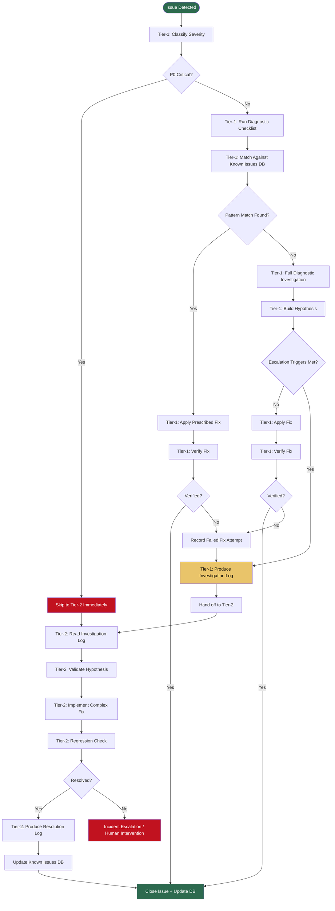

# Openclaw Tiered Debugging Standard Operating Procedure

**Version:** 1.0.0  
**Effective Date:** 2026-02-27  
**Owner:** Platform / SRE  
**Audience:** Junior Engineers, On-call Responders, AI Triage Agents  

---

## Table of Contents

1. [Overview & Objectives](#1-overview--objectives)
2. [Tier-1: Small Model — Triage & Investigation Protocol](#2-tier-1-small-model--triage--investigation-protocol)
3. [Diagnostic Command Reference](#3-diagnostic-command-reference)
4. [Structured Investigation Log — JSON Schema](#4-structured-investigation-log--json-schema)
5. [Escalation Decision Matrix](#5-escalation-decision-matrix)
6. [Tier-2: Large Model — Verification & Resolution Protocol](#6-tier-2-large-model--verification--resolution-protocol)
7. [Known Issues Pattern Database](#7-known-issues-pattern-database)
8. [Post-Resolution & Continuous Improvement](#8-post-resolution--continuous-improvement)

---

## 1. Overview & Objectives

### 1.1 Purpose

This SOP governs the complete debug lifecycle for the Openclaw AI agent platform from initial issue detection through resolution verification. It is designed to:

- **Minimize Mean-Time-To-Resolution (MTTR)** across all severity classes
- **Optimize AI token cost** by routing low-complexity issues to smaller, cheaper models
- **Eliminate redundant diagnostic work** between escalation tiers through structured handoff logs
- **Enable junior engineers and small LLM agents** to handle Tier-1 triage without deep system knowledge

### 1.2 Two-Tier Architecture

| Tier | Model Class | Role | Trigger |
|------|-------------|------|---------|
| **Tier-1** | Small / cheap (e.g., GPT-4o-mini, Claude Haiku) | Triage, classification, known-pattern resolution | All new issues |
| **Tier-2** | Large / capable (e.g., Claude Sonnet/Opus, GPT-4o) | Hypothesis validation, deep code analysis, complex fixes | Tier-1 escalation OR P0 issues |

### 1.3 Core Principle

> **Tier-1 MUST produce a structured investigation log. Tier-2 MUST NOT repeat any diagnostic step already documented in that log.**

Token cost is wasted when Tier-2 re-runs `docker logs`, re-checks configs, or re-classifies symptoms already captured by Tier-1. The structured log is the contract between tiers.

### 1.4 Escalation Pipeline Flowchart



### 1.5 Severity Classification

| Severity | Label | Definition | Response SLA |
|----------|-------|------------|--------------|
| P0 | Critical | Service completely down; all users affected | 15 min |
| P1 | High | Core feature broken; majority of users affected | 1 hour |
| P2 | Medium | Feature degraded; subset of users affected | 4 hours |
| P3 | Low | Minor issue; workaround available | Next business day |

---

## 2. Tier-1: Small Model — Triage & Investigation Protocol

### 2.1 Initial Triage Checklist

Execute in order. Stop at the first positive match and jump to the corresponding subsection.

```
[ ] Step 1: Confirm issue is reproducible (not transient noise)
[ ] Step 2: Identify affected subsystem (see §2.2)
[ ] Step 3: Check if issue matches a known pattern (§7)
[ ] Step 4: Determine severity (§1.5)
[ ] Step 5: Run subsystem-specific diagnostic commands (§3)
[ ] Step 6: Evaluate escalation criteria (§5)
[ ] Step 7: Apply fix OR escalate with investigation log (§4)
```

### 2.2 Issue Category Classification

#### 2.2.1 Container Errors

**Indicators:**
- Container in `Exited`, `Restarting`, or `OOMKilled` state
- `docker ps` shows unhealthy containers
- Service unreachable on expected port

**Diagnostic Commands:**
```bash
# Check all container states
docker ps -a --format "table {{.Names}}\t{{.Status}}\t{{.Ports}}"

# Expected output (healthy):
# NAMES                  STATUS          PORTS
# openclaw-gateway       Up 2 hours      0.0.0.0:18789->18789/tcp
# openclaw-flask-bridge  Up 2 hours      0.0.0.0:5000->5000/tcp
# openclaw-nginx         Up 2 hours      0.0.0.0:443->443/tcp

# Red flags: "Exited (1)", "Restarting (X)", "unhealthy"

# Get exit reason for a stopped container
docker inspect <container_name> --format='{{.State.ExitCode}} {{.State.Error}}'

# Tail recent logs (last 200 lines + follow)
docker logs --tail=200 -t <container_name> 2>&1
```

**Root Cause Lookup:**

| Exit Code | Common Cause | Fix |
|-----------|-------------|-----|
| `1` | Application crash / unhandled exception | Check logs for stack trace |
| `137` | OOM kill | Increase container memory limit |
| `143` | SIGTERM (graceful shutdown) | Restart; check if intentional |
| Non-zero | Startup failure | Check entrypoint/CMD logs |

---

#### 2.2.2 API Integration Failures

**Indicators:**
- HTTP 4xx/5xx responses in logs
- `connection refused` or `timeout` errors
- Webhook payloads not being processed

**Diagnostic Commands:**
```bash
# Test LINE Messaging API connectivity
curl -s -o /dev/null -w "%{http_code}" \
  -H "Authorization: Bearer $LINE_CHANNEL_ACCESS_TOKEN" \
  https://api.line.me/v2/bot/info

# Expected: 200
# Red flag: 401 (invalid token), 403 (insufficient scope), 000 (DNS failure)

# Test OpenRouter API connectivity
curl -s -o /dev/null -w "%{http_code}" \
  -H "Authorization: Bearer $OPENROUTER_API_KEY" \
  -H "Content-Type: application/json" \
  https://openrouter.ai/api/v1/models

# Expected: 200
# Red flag: 401 (bad key), 429 (rate limit/quota), 000 (network issue)

# Test internal Flask bridge
curl -s -o /dev/null -w "%{http_code}" http://localhost:5000/health
# Expected: 200
```

**Root Cause Lookup:**

| HTTP Code | Subsystem | Root Cause | Fix |
|-----------|-----------|------------|-----|
| `401` | LINE / OpenRouter | Invalid or expired API key | Rotate key, update env var |
| `403` | LINE | Webhook not verified or wrong channel | Re-verify webhook URL |
| `429` | OpenRouter | Quota exhausted | Check billing, rotate key |
| `502` | Nginx | Upstream (Flask/gateway) not responding | Check upstream container |
| `000` | Any | DNS resolution failure or network partition | Check Docker network |

---

#### 2.2.3 Webhook Issues

**Indicators:**
- LINE messages not triggering any action
- `X-Line-Signature` verification failures in logs
- `400 Bad Request` responses to LINE platform

**Diagnostic Commands:**
```bash
# Check Flask bridge logs for signature failures
docker logs openclaw-flask-bridge 2>&1 | grep -i "signature\|webhook\|verify\|400" | tail -30

# Expected: No signature errors in normal operation
# Red flag: "Invalid signature", "X-Line-Signature verification failed"

# Verify webhook is reachable from outside
curl -s -o /dev/null -w "%{http_code}" \
  -X POST https://your-domain.com/webhook \
  -H "Content-Type: application/json" \
  -d '{"test": true}'

# Expected: 400 (invalid payload) or 200 — NOT 404 or 502

# Check Nginx routing to Flask
docker logs openclaw-nginx 2>&1 | grep "POST /webhook" | tail -20
```

**Root Cause Lookup:**

| Symptom | Root Cause | Fix |
|---------|------------|-----|
| Signature mismatch | `CHANNEL_SECRET` env var wrong/missing | Verify and update env var |
| 404 on /webhook | Nginx not routing to Flask | Check nginx.conf `location /webhook` block |
| 502 from Nginx | Flask bridge container down | Restart Flask bridge container |
| Messages silently dropped | Session state corrupted | Clear session state, restart gateway |

---

#### 2.2.4 Session / Auth Errors

**Indicators:**
- `Unknown sessionId` in logs
- Users getting incorrect context or losing conversation history
- Authentication loops

**Diagnostic Commands:**
```bash
# Search for session errors in gateway logs
docker logs openclaw-gateway 2>&1 | grep -i "sessionId\|session\|unknown\|auth" | tail -50

# Expected: No "Unknown sessionId" in normal operation
# Red flag: Repeated "Unknown sessionId: <id>" entries

# Check session storage (if using file-based sessions)
ls -la ~/.openclaw/sessions/ 2>/dev/null || echo "Sessions dir not found"

# Inspect specific session
cat ~/.openclaw/sessions/<session_id>.json 2>/dev/null | python3 -m json.tool
```

**Root Cause Lookup:**

| Symptom | Root Cause | Fix |
|---------|------------|-----|
| `Unknown sessionId` | Session file deleted / container restart | Session is stateless — re-initiate conversation |
| Session not persisting | Volume not mounted | Check docker-compose volume mapping |
| Auth loop | Token expired | Re-run `openclaw login` |

---

#### 2.2.5 Pipeline Failures

**Indicators:**
- n8n workflow execution failures
- Messages entering pipeline but no response generated
- Partial pipeline execution (e.g., webhook received, but no LLM call)

**Diagnostic Commands:**
```bash
# Check n8n container logs
docker logs openclaw-n8n 2>&1 | grep -i "error\|failed\|execution" | tail -50

# List recent n8n workflow executions (if API enabled)
curl -s -u admin:$N8N_PASSWORD \
  http://localhost:5678/api/v1/executions?limit=10 | python3 -m json.tool

# Expected: executions with "finished: true"
# Red flag: "finished: false" or "error" field populated

# Check if messages are queued vs dropped
docker logs openclaw-gateway 2>&1 | grep -i "queue\|pending\|backlog" | tail -20
```

---

#### 2.2.6 Upstream Model Errors

**Indicators:**
- `upstream error` or `model unavailable` in logs
- LLM responses never arriving
- Timeouts after 30+ seconds

**Diagnostic Commands:**
```bash
# Test model endpoint directly via OpenRouter
curl -s \
  -H "Authorization: Bearer $OPENROUTER_API_KEY" \
  -H "Content-Type: application/json" \
  -d '{"model":"openai/gpt-4o-mini","messages":[{"role":"user","content":"ping"}],"max_tokens":5}' \
  https://openrouter.ai/api/v1/chat/completions | python3 -m json.tool

# Expected: JSON with "choices[0].message.content"
# Red flag: "error" object, empty response, timeout

# Check gateway logs for model call failures
docker logs openclaw-gateway 2>&1 | grep -i "upstream\|model\|openrouter\|timeout\|error" | tail -50
```

### 2.3 Tier-1 Decision Tree

```
Issue Detected
│
├── Match in Known Issues DB (§7)?
│   ├── YES → Apply prescribed fix → Verify → Close
│   └── NO  → Continue to full investigation
│
├── Can fix be applied with:
│   ├── Config change (env var, .yaml edit)?  → YES → Apply → Verify
│   ├── Container restart?                    → YES → Restart → Verify
│   ├── Credential rotation?                  → YES → Rotate → Verify
│   └── All NO? → Escalate to Tier-2
│
├── After fix attempt:
│   ├── Verified resolved? → Close + Update DB
│   └── Not resolved?      → Escalate to Tier-2
│
└── Escalation trigger met (§5)?
    ├── YES → Produce investigation log (§4) → Hand to Tier-2
    └── NO  → Continue Tier-1 investigation
```

---

## 3. Diagnostic Command Reference

### 3.1 Docker / Container Subsystem

```bash
# ── Health Overview ──────────────────────────────────────────────────────────

# All containers: status, uptime, ports
docker ps -a --format "table {{.Names}}\t{{.Status}}\t{{.Ports}}\t{{.Image}}"

# Resource usage (CPU, memory)
docker stats --no-stream --format "table {{.Name}}\t{{.CPUPerc}}\t{{.MemUsage}}\t{{.MemPerc}}"

# ── Logs ─────────────────────────────────────────────────────────────────────

# Last N lines of any container
docker logs --tail=100 -t <container_name> 2>&1

# Stream logs with timestamps
docker logs -f --since=1h <container_name> 2>&1

# Search logs for errors
docker logs --tail=500 <container_name> 2>&1 | grep -iE "error|exception|fatal|panic|oom"

# ── Networking ────────────────────────────────────────────────────────────────

# List Docker networks
docker network ls

# Inspect a network (shows connected containers + IPs)
docker network inspect openclaw_default

# Test DNS resolution between containers
docker exec openclaw-flask-bridge ping -c 2 openclaw-gateway

# Test port reachability
docker exec openclaw-nginx curl -s -o /dev/null -w "%{http_code}" http://openclaw-flask-bridge:5000/health

# ── Container Inspection ─────────────────────────────────────────────────────

# Environment variables (sanitize before sharing)
docker inspect <container_name> --format='{{range .Config.Env}}{{println .}}{{end}}' | grep -v "SECRET\|KEY\|TOKEN\|PASS"

# Volume mounts
docker inspect <container_name> --format='{{range .Mounts}}{{.Source}} → {{.Destination}}{{println}}{{end}}'

# Container start command
docker inspect <container_name> --format='{{.Config.Cmd}}'

# ── Restart & Recovery ────────────────────────────────────────────────────────

# Restart a single container
docker restart <container_name>

# Restart all Openclaw services (from docker-compose dir)
docker compose -f /path/to/docker-compose.yml restart

# Force recreate (picks up env changes)
docker compose -f /path/to/docker-compose.yml up -d --force-recreate <service_name>
```

**Interpretation Guide:**

| Output Pattern | Interpretation | Action |
|----------------|---------------|--------|
| `Up N hours (healthy)` | Container running normally | No action |
| `Up N minutes (health: starting)` | Container starting up | Wait 60s, recheck |
| `Up N minutes (unhealthy)` | Healthcheck failing | Check health endpoint and logs |
| `Exited (0)` N ago | Clean exit (possibly stopped) | Restart if unexpected |
| `Restarting (1) N seconds ago` | Crash loop | Check logs for panic/exception |
| `OOMKilled` | Out of memory | Increase container memory limit |

---

### 3.2 Nginx / Reverse Proxy

```bash
# ── Config Validation ─────────────────────────────────────────────────────────

# Test Nginx config syntax (in container)
docker exec openclaw-nginx nginx -t
# Expected: "nginx: configuration file /etc/nginx/nginx.conf test is successful"
# Red flag: Any "failed" or "error" line

# View active config
docker exec openclaw-nginx nginx -T 2>&1 | head -200

# ── Access & Error Logs ───────────────────────────────────────────────────────

# Recent access log (last 50 requests)
docker exec openclaw-nginx tail -50 /var/log/nginx/access.log

# Error log
docker exec openclaw-nginx tail -100 /var/log/nginx/error.log

# Count HTTP status codes in last 1000 requests
docker exec openclaw-nginx tail -1000 /var/log/nginx/access.log | awk '{print $9}' | sort | uniq -c | sort -rn
# Expected output example:
# 850 200
#  80 301
#  50 404
#  20 502   ← red flag: high 502 count

# ── SSL Certificate ───────────────────────────────────────────────────────────

# Check certificate expiry
docker exec openclaw-nginx openssl x509 -noout -enddate \
  -in /etc/letsencrypt/live/your-domain.com/cert.pem 2>/dev/null \
  || echo "Certificate file not found or path differs"
# Expected: "notAfter=Apr 15 00:00:00 2026 GMT" (should be > 30 days out)

# Test SSL handshake
openssl s_client -connect your-domain.com:443 -brief 2>&1 | head -10
# Expected: "CONNECTION ESTABLISHED" and "Protocol: TLSv1.3"

# ── Upstream Connectivity ─────────────────────────────────────────────────────

# Test Nginx → Flask bridge upstream
curl -s -o /dev/null -w "%{http_code}" http://localhost/health
# Expected: 200

# Reload Nginx config without downtime
docker exec openclaw-nginx nginx -s reload
```

---

### 3.3 Flask Bridge

```bash
# ── Process & Health ──────────────────────────────────────────────────────────

# Health endpoint
curl -s http://localhost:5000/health | python3 -m json.tool
# Expected: {"status": "ok"} or similar

# Gunicorn worker status
docker exec openclaw-flask-bridge ps aux | grep gunicorn
# Expected: Multiple gunicorn worker processes listed

# ── Request Logs ──────────────────────────────────────────────────────────────

# Last 100 Flask request logs
docker logs --tail=100 openclaw-flask-bridge 2>&1

# Filter for errors only
docker logs --tail=500 openclaw-flask-bridge 2>&1 | grep -iE "error|exception|traceback|500|timeout"

# ── LINE Signature Verification ───────────────────────────────────────────────

# Verify CHANNEL_SECRET is set in Flask bridge
docker inspect openclaw-flask-bridge --format='{{range .Config.Env}}{{println .}}{{end}}' | grep CHANNEL_SECRET | wc -l
# Expected: 1 (env var present — value not shown for security)

# Send test webhook (will fail signature, but confirms routing works)
curl -s -o /dev/null -w "%{http_code}" \
  -X POST http://localhost:5000/webhook \
  -H "Content-Type: application/json" \
  -H "X-Line-Signature: invalidsig" \
  -d '{"events":[]}'
# Expected: 400 (signature rejected — route is working)
# Red flag: 404 (route missing), 502 (bridge down), 200 (signature NOT being checked)

# ── Gunicorn Timeout Diagnosis ────────────────────────────────────────────────

# Check current timeout configuration
docker exec openclaw-flask-bridge cat /etc/gunicorn.conf.py 2>/dev/null \
  || docker exec openclaw-flask-bridge ps aux | grep gunicorn | grep -oP '\-\-timeout \d+'
# Expected: timeout value (default 30s — may need increase for LLM responses)

# Count timeout events in logs
docker logs --tail=1000 openclaw-flask-bridge 2>&1 | grep -c "WORKER TIMEOUT"
# Expected: 0
# Red flag: Any non-zero count
```

---

### 3.4 LINE API

```bash
# ── Authentication ────────────────────────────────────────────────────────────

# Verify access token
curl -s \
  -H "Authorization: Bearer $LINE_CHANNEL_ACCESS_TOKEN" \
  https://api.line.me/v2/bot/info | python3 -m json.tool
# Expected: JSON with "userId", "displayName", "pictureUrl"
# Red flag: {"message":"The request body has...", "details": [...]} or 401

# Check token expiry (for short-lived tokens)
curl -s \
  -H "Authorization: Bearer $LINE_CHANNEL_ACCESS_TOKEN" \
  https://api.line.me/oauth2/v2.1/verify | python3 -m json.tool
# Expected: JSON with "expires_in" (positive integer)
# Red flag: {"error":"invalid_request"} or expires_in <= 0

# ── Webhook Endpoint Verification ─────────────────────────────────────────────

# Verify the webhook URL registered in LINE console matches deployment
curl -s \
  -H "Authorization: Bearer $LINE_CHANNEL_ACCESS_TOKEN" \
  https://api.line.me/v2/bot/channel/webhook/endpoint | python3 -m json.tool
# Expected: {"webhookEndpoint": "https://your-domain.com/webhook", "active": true}

# ── Delivery Test ─────────────────────────────────────────────────────────────

# Send a test message to a specific user (use a real userId for testing)
curl -s \
  -H "Authorization: Bearer $LINE_CHANNEL_ACCESS_TOKEN" \
  -H "Content-Type: application/json" \
  https://api.line.me/v2/bot/message/push \
  -d '{"to":"<USER_ID>","messages":[{"type":"text","text":"Debug test: system OK"}]}' \
  | python3 -m json.tool
# Expected: {} (empty body = success)
# Red flag: {"message":"..."} error object
```

---

### 3.5 OpenRouter API

```bash
# ── Authentication & Quota ────────────────────────────────────────────────────

# Check API key validity and account info
curl -s \
  -H "Authorization: Bearer $OPENROUTER_API_KEY" \
  https://openrouter.ai/api/v1/auth/key | python3 -m json.tool
# Expected: JSON with "data.usage", "data.limit" fields
# Red flag: {"error":{"message":"No auth credentials found",...}}

# List available models (confirms connectivity)
curl -s \
  -H "Authorization: Bearer $OPENROUTER_API_KEY" \
  https://openrouter.ai/api/v1/models | python3 -m json.tool | head -40
# Expected: JSON array of model objects
# Red flag: Empty array, error object, or connection timeout

# ── Live Inference Test ───────────────────────────────────────────────────────

# Quick completions test (cheap model, 5 tokens)
curl -s \
  -H "Authorization: Bearer $OPENROUTER_API_KEY" \
  -H "Content-Type: application/json" \
  -d '{
    "model": "openai/gpt-4o-mini",
    "messages": [{"role": "user", "content": "Reply with: OK"}],
    "max_tokens": 5
  }' \
  https://openrouter.ai/api/v1/chat/completions | python3 -m json.tool
# Expected: {"choices":[{"message":{"content":"OK",...},...}],...}
# Red flag: {"error":{"code":429,...}} = quota; {"error":{"code":503,...}} = model down

# ── Quota Check ───────────────────────────────────────────────────────────────

# Check current usage vs limit
curl -s \
  -H "Authorization: Bearer $OPENROUTER_API_KEY" \
  https://openrouter.ai/api/v1/auth/key \
  | python3 -c "
import json,sys
d=json.load(sys.stdin)['data']
limit=d.get('limit') or 'unlimited'
usage=d.get('usage',0)
print(f'Usage: {usage} / Limit: {limit}')
if isinstance(limit,float) and usage >= limit*0.9:
    print('WARNING: >90% quota consumed')
"
```

---

### 3.6 n8n Workflows

```bash
# ── Service Health ────────────────────────────────────────────────────────────

# Check n8n container
docker ps --filter "name=n8n" --format "table {{.Names}}\t{{.Status}}"
# Expected: "Up N hours"

# Test n8n UI reachability (internal)
curl -s -o /dev/null -w "%{http_code}" http://localhost:5678/
# Expected: 200 or 301

# ── Workflow Execution Status ──────────────────────────────────────────────────

# List last 10 executions via n8n REST API
curl -s \
  -u "admin:$N8N_PASSWORD" \
  "http://localhost:5678/api/v1/executions?limit=10&status=error" \
  | python3 -m json.tool

# Expected: {"data":[],"nextCursor":null} if no errors
# Red flag: Non-empty "data" array with "status":"error" entries

# Get details of a specific failed execution
curl -s \
  -u "admin:$N8N_PASSWORD" \
  "http://localhost:5678/api/v1/executions/<execution_id>" \
  | python3 -m json.tool

# ── Connectivity from n8n to Openclaw Gateway ─────────────────────────────────

docker exec openclaw-n8n curl -s -o /dev/null -w "%{http_code}" \
  http://openclaw-gateway:18789/health 2>/dev/null || echo "Gateway unreachable from n8n"
# Expected: 200
```

---

### 3.7 System-Level (VPS)

```bash
# ── UFW Firewall ──────────────────────────────────────────────────────────────

# Check firewall rules
sudo ufw status verbose
# Expected output includes:
# 22/tcp  ALLOW IN
# 80/tcp  ALLOW IN
# 443/tcp ALLOW IN
# Red flag: Port 443 or 80 missing from ALLOW rules

# ── systemd Services ──────────────────────────────────────────────────────────

# Check if Docker service is running
systemctl status docker --no-pager | head -10
# Expected: "Active: active (running)"

# Check openclaw-related systemd units (if any)
systemctl list-units --type=service | grep -i "openclaw\|clawd\|flask"

# ── Disk Space ────────────────────────────────────────────────────────────────

# Check disk usage (Docker logs can fill disk)
df -h /
# Expected: Use% < 85%
# Red flag: Use% >= 90% — prune Docker or clear logs

# Docker disk usage breakdown
docker system df
# Prune if needed: docker system prune --volumes (CAUTION: removes unused volumes)

# ── Memory & CPU ──────────────────────────────────────────────────────────────

free -h
uptime
top -bn1 | head -20
```

---

### 3.8 Batch Diagnostic Script

Save as `/tmp/openclaw-diag.sh` and run with `bash /tmp/openclaw-diag.sh`:

```bash
#!/bin/bash
# Openclaw Batch Diagnostic Script
# Usage: bash openclaw-diag.sh [--full]
# Output: Human-readable status + JSON summary

set -euo pipefail
TIMESTAMP=$(date -u +"%Y-%m-%dT%H:%M:%SZ")
ISSUES=()

echo "================================================================"
echo "  Openclaw Batch Diagnostic — $TIMESTAMP"
echo "================================================================"

# Helper
check() {
  local name=$1 cmd=$2 pattern=$3
  result=$(eval "$cmd" 2>&1) || true
  if echo "$result" | grep -qiE "$pattern"; then
    echo "[FAIL] $name"
    ISSUES+=("$name")
  else
    echo "[ OK ] $name"
  fi
}

echo ""
echo "── Container Status ────────────────────────────────────────────"
for container in openclaw-gateway openclaw-flask-bridge openclaw-nginx; do
  status=$(docker inspect "$container" --format='{{.State.Status}}' 2>/dev/null || echo "not_found")
  if [[ "$status" == "running" ]]; then
    echo "[ OK ] $container ($status)"
  else
    echo "[FAIL] $container ($status)"
    ISSUES+=("container:$container:$status")
  fi
done

echo ""
echo "── Network Connectivity ────────────────────────────────────────"
check "Flask bridge health" \
  "curl -s -o /dev/null -w '%{http_code}' http://localhost:5000/health" \
  "^[^2]"

check "Nginx health (HTTP)" \
  "curl -s -o /dev/null -w '%{http_code}' http://localhost:80/" \
  "^[^2-3]"

check "OpenRouter reachable" \
  "curl -s -o /dev/null -w '%{http_code}' --connect-timeout 10 https://openrouter.ai/api/v1/models -H 'Authorization: Bearer ${OPENROUTER_API_KEY:-missing}'" \
  "^[^2]"

echo ""
echo "── Disk Space ──────────────────────────────────────────────────"
used=$(df / | awk 'NR==2{print $5}' | tr -d '%')
if [[ "$used" -ge 90 ]]; then
  echo "[FAIL] Disk usage critical: ${used}%"
  ISSUES+=("disk:critical:${used}%")
elif [[ "$used" -ge 80 ]]; then
  echo "[WARN] Disk usage high: ${used}%"
else
  echo "[ OK ] Disk usage: ${used}%"
fi

echo ""
echo "── Recent Errors in Last 10 Minutes ────────────────────────────"
for container in openclaw-gateway openclaw-flask-bridge; do
  count=$(docker logs --since=10m "$container" 2>&1 | grep -ciE "error|exception|panic|fatal" || echo 0)
  if [[ "$count" -gt 5 ]]; then
    echo "[FAIL] $container: $count errors in last 10 min"
    ISSUES+=("errors:$container:$count")
  else
    echo "[ OK ] $container: $count errors in last 10 min"
  fi
done

echo ""
echo "================================================================"
if [[ ${#ISSUES[@]} -eq 0 ]]; then
  echo "  RESULT: ALL CHECKS PASSED"
else
  echo "  RESULT: ${#ISSUES[@]} ISSUE(S) DETECTED"
  for issue in "${ISSUES[@]}"; do
    echo "    → $issue"
  done
fi
echo "================================================================"

# JSON summary output
echo ""
echo "── JSON Summary ────────────────────────────────────────────────"
python3 -c "
import json, sys
issues = sys.argv[1:]
result = {
  'timestamp': '$TIMESTAMP',
  'healthy': len(issues) == 0,
  'issue_count': len(issues),
  'issues': issues
}
print(json.dumps(result, indent=2))
" "${ISSUES[@]}"
```

---

## 4. Structured Investigation Log — JSON Schema

### 4.1 Schema Definition

Every Tier-1 investigation MUST produce a log conforming to this schema before closing or escalating.

```json
{
  "$schema": "http://json-schema.org/draft-07/schema#",
  "title": "OpencrawInvestigationLog",
  "type": "object",
  "required": [
    "issue_id",
    "timestamp",
    "severity",
    "category",
    "symptoms",
    "environment",
    "diagnostic_steps_taken",
    "root_cause_hypothesis",
    "confidence_level",
    "attempted_fixes",
    "resolution_status",
    "relevant_file_paths"
  ],
  "properties": {
    "issue_id": {
      "type": "string",
      "description": "Unique identifier. Format: OC-YYYYMMDD-NNN",
      "pattern": "^OC-\\d{8}-\\d{3}$"
    },
    "timestamp": {
      "type": "string",
      "description": "ISO 8601 UTC timestamp when log was created",
      "format": "date-time"
    },
    "severity": {
      "type": "string",
      "enum": ["P0", "P1", "P2", "P3"],
      "description": "P0=Critical, P1=High, P2=Medium, P3=Low"
    },
    "category": {
      "type": "string",
      "enum": [
        "container_error",
        "api_integration_failure",
        "webhook_issue",
        "session_auth_error",
        "pipeline_failure",
        "upstream_model_error",
        "network_connectivity",
        "configuration_error",
        "disk_resource_exhaustion",
        "ssl_certificate",
        "unknown"
      ]
    },
    "symptoms": {
      "type": "array",
      "items": { "type": "string" },
      "minItems": 1,
      "description": "Observable symptoms as reported or detected"
    },
    "environment": {
      "type": "object",
      "required": ["host", "containers", "relevant_env_vars"],
      "properties": {
        "host": {
          "type": "object",
          "properties": {
            "os": { "type": "string" },
            "docker_version": { "type": "string" },
            "disk_usage_percent": { "type": "number" },
            "memory_free_mb": { "type": "number" }
          }
        },
        "containers": {
          "type": "array",
          "items": {
            "type": "object",
            "required": ["name", "status", "image"],
            "properties": {
              "name": { "type": "string" },
              "status": { "type": "string" },
              "image": { "type": "string" },
              "uptime": { "type": "string" }
            }
          }
        },
        "relevant_env_vars": {
          "type": "object",
          "description": "Keys only — NEVER include values for secrets",
          "additionalProperties": {
            "type": "string",
            "enum": ["set", "missing", "invalid_format"]
          }
        }
      }
    },
    "diagnostic_steps_taken": {
      "type": "array",
      "minItems": 1,
      "items": {
        "type": "object",
        "required": ["step_number", "command", "output_summary", "interpretation"],
        "properties": {
          "step_number": { "type": "integer" },
          "command": { "type": "string" },
          "output_summary": {
            "type": "string",
            "description": "Truncated. Max 10 lines or 500 chars."
          },
          "interpretation": { "type": "string" }
        }
      }
    },
    "root_cause_hypothesis": {
      "type": "string",
      "description": "Single clear statement of the most likely root cause. 'Unknown' if not determined."
    },
    "confidence_level": {
      "type": "string",
      "enum": ["high", "medium", "low"],
      "description": "high=root cause confirmed by evidence; medium=likely but not proven; low=speculative"
    },
    "attempted_fixes": {
      "type": "array",
      "items": {
        "type": "object",
        "required": ["action", "result"],
        "properties": {
          "action": { "type": "string" },
          "result": {
            "type": "string",
            "enum": ["resolved", "partially_resolved", "no_change", "made_worse"]
          },
          "notes": { "type": "string" }
        }
      }
    },
    "resolution_status": {
      "type": "string",
      "enum": ["resolved", "escalated", "in_progress"],
      "description": "Current status of the issue"
    },
    "escalation_reason": {
      "type": "string",
      "description": "Required if resolution_status is 'escalated'. Must reference a trigger from §5."
    },
    "relevant_file_paths": {
      "type": "array",
      "items": { "type": "string" },
      "description": "Absolute paths to configs, logs, or code files examined"
    },
    "relevant_log_snippets": {
      "type": "array",
      "items": {
        "type": "object",
        "required": ["source", "content"],
        "properties": {
          "source": { "type": "string" },
          "content": {
            "type": "string",
            "description": "Max 50 lines. Include full context around anomaly."
          }
        }
      }
    },
    "known_issue_match": {
      "type": "string",
      "description": "Known issue ID from §7 if matched (e.g., KI-001)"
    },
    "tier2_instructions": {
      "type": "string",
      "description": "Specific guidance for Tier-2. What to look at, what NOT to repeat."
    }
  }
}
```

---

### 4.2 Example: Issue Resolved at Tier-1

<details>
<summary>Click to expand — Example: OC-20260227-001 (Resolved at Tier-1)</summary>

```json
{
  "issue_id": "OC-20260227-001",
  "timestamp": "2026-02-27T08:14:22Z",
  "severity": "P2",
  "category": "upstream_model_error",
  "symptoms": [
    "LINE users receiving no response to messages",
    "Gateway logs show 'upstream error' from OpenRouter",
    "Issue started ~08:00 UTC"
  ],
  "environment": {
    "host": {
      "os": "Ubuntu 24.04 LTS",
      "docker_version": "26.1.4",
      "disk_usage_percent": 62,
      "memory_free_mb": 1840
    },
    "containers": [
      { "name": "openclaw-gateway", "status": "running", "image": "openclaw:latest", "uptime": "2 days" },
      { "name": "openclaw-flask-bridge", "status": "running", "image": "openclaw-flask:latest", "uptime": "2 days" },
      { "name": "openclaw-nginx", "status": "running", "image": "nginx:1.25", "uptime": "2 days" }
    ],
    "relevant_env_vars": {
      "OPENROUTER_API_KEY": "set",
      "LINE_CHANNEL_ACCESS_TOKEN": "set",
      "CHANNEL_SECRET": "set"
    }
  },
  "diagnostic_steps_taken": [
    {
      "step_number": 1,
      "command": "docker ps -a --format 'table {{.Names}}\\t{{.Status}}'",
      "output_summary": "All 3 containers: running. No restarts. No unhealthy.",
      "interpretation": "Containers are healthy — issue is not a container crash"
    },
    {
      "step_number": 2,
      "command": "docker logs --tail=50 openclaw-gateway 2>&1 | grep -i 'error\\|upstream'",
      "output_summary": "2026-02-27T08:01:14Z ERROR upstream error: openai/gpt-4-turbo — model overloaded (503)\n2026-02-27T08:02:33Z ERROR upstream error: openai/gpt-4-turbo — model overloaded (503)\n... (repeated 12 times)",
      "interpretation": "OpenRouter returning 503 for gpt-4-turbo model specifically"
    },
    {
      "step_number": 3,
      "command": "curl -s -H 'Authorization: Bearer $OPENROUTER_API_KEY' https://openrouter.ai/api/v1/auth/key",
      "output_summary": "{\"data\":{\"usage\":2.47,\"limit\":10.0,\"is_free_tier\":false,...}}",
      "interpretation": "API key valid, quota 24.7% used — key/quota not the issue"
    },
    {
      "step_number": 4,
      "command": "curl -s -H '...' -d '{\"model\":\"openai/gpt-4o-mini\",...}' https://openrouter.ai/api/v1/chat/completions",
      "output_summary": "{\"choices\":[{\"message\":{\"content\":\"OK\"}}],...}",
      "interpretation": "Alternative model gpt-4o-mini responds correctly — gpt-4-turbo is the specific issue"
    }
  ],
  "root_cause_hypothesis": "OpenRouter upstream model 'openai/gpt-4-turbo' is experiencing intermittent 503 overloaded errors. Alternative models are functioning. Config is pointing to an overloaded model.",
  "confidence_level": "high",
  "attempted_fixes": [
    {
      "action": "Updated gateway config to use 'openai/gpt-4o' as primary model, restarted openclaw-gateway",
      "result": "resolved",
      "notes": "docker exec openclaw-gateway openclaw config set provider.model openai/gpt-4o && docker restart openclaw-gateway"
    }
  ],
  "resolution_status": "resolved",
  "relevant_file_paths": [
    "/etc/openclaw/config.yaml"
  ],
  "relevant_log_snippets": [
    {
      "source": "openclaw-gateway (last 20 lines after fix)",
      "content": "2026-02-27T08:19:44Z INFO model set to openai/gpt-4o\n2026-02-27T08:19:45Z INFO gateway ready\n2026-02-27T08:20:01Z INFO message processed successfully (userId: Uabc123)"
    }
  ],
  "known_issue_match": "KI-003"
}
```

</details>

---

### 4.3 Example: Issue Escalated to Tier-2

<details>
<summary>Click to expand — Example: OC-20260227-002 (Escalated to Tier-2)</summary>

```json
{
  "issue_id": "OC-20260227-002",
  "timestamp": "2026-02-27T14:33:07Z",
  "severity": "P1",
  "category": "session_auth_error",
  "symptoms": [
    "Multiple users reporting: responses going to wrong conversation threads",
    "Gateway logs show 'Unknown sessionId' errors interleaved with correct sessions",
    "Issue appears after recent deployment at 13:45 UTC",
    "n8n workflow logs show duplicate message routing entries"
  ],
  "environment": {
    "host": {
      "os": "Ubuntu 24.04 LTS",
      "docker_version": "26.1.4",
      "disk_usage_percent": 71,
      "memory_free_mb": 640
    },
    "containers": [
      { "name": "openclaw-gateway", "status": "running", "image": "openclaw:2026.2.27", "uptime": "49 minutes" },
      { "name": "openclaw-flask-bridge", "status": "running", "image": "openclaw-flask:2026.2.27", "uptime": "49 minutes" },
      { "name": "openclaw-n8n", "status": "running", "image": "n8nio/n8n:1.30.1", "uptime": "3 days" },
      { "name": "openclaw-nginx", "status": "running", "image": "nginx:1.25", "uptime": "3 days" }
    ],
    "relevant_env_vars": {
      "OPENROUTER_API_KEY": "set",
      "LINE_CHANNEL_ACCESS_TOKEN": "set",
      "CHANNEL_SECRET": "set",
      "SESSION_STORAGE_PATH": "set"
    }
  },
  "diagnostic_steps_taken": [
    {
      "step_number": 1,
      "command": "docker logs --since=1h openclaw-gateway 2>&1 | grep 'Unknown sessionId' | wc -l",
      "output_summary": "47",
      "interpretation": "47 Unknown sessionId errors in last hour — high frequency, not transient"
    },
    {
      "step_number": 2,
      "command": "docker logs --since=1h openclaw-gateway 2>&1 | grep 'Unknown sessionId' | head -10",
      "output_summary": "2026-02-27T13:51:02Z WARN Unknown sessionId: sid_a1b2c3\n2026-02-27T13:51:04Z WARN Unknown sessionId: sid_x9y8z7\n... (different session IDs, not repeated same ID)",
      "interpretation": "Multiple distinct session IDs being rejected — not a single corrupted session"
    },
    {
      "step_number": 3,
      "command": "ls -la ~/.openclaw/sessions/ | wc -l && ls -la ~/.openclaw/sessions/ | tail -5",
      "output_summary": "3 (only 2 session files)\nsessions created at 13:46 and 13:52",
      "interpretation": "Session files exist but very few — old sessions not persisting across deployment restart"
    },
    {
      "step_number": 4,
      "command": "docker inspect openclaw-gateway --format='{{range .Mounts}}{{.Source}} → {{.Destination}}{{println}}{{end}}'",
      "output_summary": "/var/openclaw/data → /data",
      "interpretation": "Volume mapped to /var/openclaw/data but sessions appear to be at ~/.openclaw/sessions — possible path mismatch"
    },
    {
      "step_number": 5,
      "command": "ls -la /var/openclaw/data/sessions/ 2>/dev/null; ls -la ~/.openclaw/sessions/ 2>/dev/null",
      "output_summary": "ls: /var/openclaw/data/sessions/: No such file or directory\n/home/deploy/.openclaw/sessions/ — 2 files (13:46, 13:52)",
      "interpretation": "Sessions being written to home dir but volume expects /data path. New deployment may have changed session path config."
    },
    {
      "step_number": 6,
      "command": "docker exec openclaw-gateway cat /data/config.yaml 2>/dev/null | grep -A3 session",
      "output_summary": "session:\n  storage: file\n  path: /data/sessions",
      "interpretation": "Config specifies /data/sessions but container is NOT writing there. Possible code change in new image."
    },
    {
      "step_number": 7,
      "command": "docker image history openclaw:2026.2.27 | head -10",
      "output_summary": "History shows changes to session management module in this build",
      "interpretation": "Confirms code change in this deployment — cannot assess impact at Tier-1"
    }
  ],
  "root_cause_hypothesis": "New deployment (openclaw:2026.2.27) introduced a change to session storage path resolution. Sessions are being created at an unexpected path or with a different base directory, causing existing session IDs to become invalid and new sessions to not persist correctly. The volume mount/path mismatch may be the mechanism.",
  "confidence_level": "medium",
  "attempted_fixes": [
    {
      "action": "Attempted to create symlink: ln -sf ~/.openclaw/sessions /var/openclaw/data/sessions",
      "result": "no_change",
      "notes": "Error count did not decrease after 5 minutes"
    }
  ],
  "resolution_status": "escalated",
  "escalation_reason": "Fix requires code analysis of session path resolution change in new image. Multiple users affected (P1). Tier-1 confidence is 'medium' — root cause not fully confirmed. Trigger: 'Fix requires code changes beyond config/env adjustments' and 'Confidence level is low/medium after full investigation'.",
  "relevant_file_paths": [
    "/var/openclaw/data/config.yaml",
    "~/.openclaw/sessions/",
    "/var/openclaw/data/sessions/"
  ],
  "relevant_log_snippets": [
    {
      "source": "openclaw-gateway — session errors",
      "content": "2026-02-27T13:51:02Z WARN Unknown sessionId: sid_a1b2c3\n2026-02-27T13:51:04Z WARN Unknown sessionId: sid_x9y8z7\n2026-02-27T13:51:09Z WARN Unknown sessionId: sid_m4n5o6\n2026-02-27T13:52:14Z INFO Session created: sid_p7q8r9 at /home/deploy/.openclaw/sessions/sid_p7q8r9.json\n2026-02-27T13:52:15Z WARN Could not load session from /data/sessions/sid_p7q8r9.json"
    }
  ],
  "tier2_instructions": "DO NOT re-run docker ps, container health checks, or LINE/OpenRouter connectivity tests — all confirmed healthy. Focus on: (1) diff between openclaw:2026.2.25 and openclaw:2026.2.27 for session path resolution code, (2) why /data/sessions path is not being used by the new image, (3) determine if volume mount needs to change or if code needs rollback."
}
```

</details>

---

## 5. Escalation Decision Matrix

### 5.1 Binary Escalation Triggers

Evaluate each trigger. If **ANY** answer is YES → escalate immediately. No partial escalations.

| # | Trigger | Evaluation |
|---|---------|------------|
| T1 | Root cause not identified after all diagnostic steps completed | Yes / No |
| T2 | Fix requires modifying application source code | Yes / No |
| T3 | Multiple subsystems affected simultaneously | Yes / No |
| T4 | Data integrity or data loss implications detected | Yes / No |
| T5 | Security breach or unauthorized access suspected | Yes / No |
| T6 | Issue pattern not found in Known Issues DB (§7) | Yes / No |
| T7 | Confidence level is "low" after full Tier-1 investigation | Yes / No |
| T8 | Tier-1 fix attempt made issue worse | Yes / No |
| T9 | P0 severity regardless of all other criteria | Yes / No |
| T10 | Issue recurred 3+ times in 24 hours despite fixes | Yes / No |

> **Procedure:** Check T9 first. If YES, skip triage and go directly to Tier-2.

### 5.2 Severity × Complexity Matrix

| | **Config/Env Fix** | **Restart/Redeploy** | **Code Change Required** | **Unknown** |
|---|---|---|---|---|
| **P0 — Critical** | Tier-2 (speed) | Tier-2 (speed) | Tier-2 | Tier-2 |
| **P1 — High** | Tier-1 | Tier-1 | Tier-2 | Tier-2 |
| **P2 — Medium** | Tier-1 | Tier-1 | Tier-2 | Tier-1 → Escalate if no match |
| **P3 — Low** | Tier-1 | Tier-1 | Tier-1 documents → Tier-2 schedules | Tier-1 monitors |

### 5.3 Confidence Level Definitions

| Confidence | Definition | Required Evidence |
|------------|-----------|------------------|
| **High** | Root cause confirmed by direct evidence | Log showing exact error, config value confirmed wrong/missing, command output directly demonstrating cause |
| **Medium** | Root cause likely but not proven | Circumstantial log evidence, timing correlation, process of elimination |
| **Low** | Speculative — multiple plausible causes | No direct evidence, only negative results from diagnostics |

**Rule:** If confidence is `low` after completing all applicable Tier-1 diagnostic steps → Escalate (trigger T7).

---

## 6. Tier-2: Large Model — Verification & Resolution Protocol

### 6.1 Input Contract

Tier-2 MUST receive:
- Complete Tier-1 investigation log (§4) in JSON format
- Access to the `tier2_instructions` field for specific guidance

Tier-2 MUST NOT:
- Re-run any command listed in `diagnostic_steps_taken`
- Re-check container health if already documented as healthy
- Re-test API credentials already confirmed valid

### 6.2 Tier-2 Responsibilities

```
[ ] 1. Read full investigation log — identify what Tier-1 already ruled out
[ ] 2. Validate Tier-1 root cause hypothesis against additional evidence if needed
[ ] 3. Perform deep code analysis (diff analysis, log correlation, config audit)
[ ] 4. Implement complex fix (code rollback, schema migration, config refactor)
[ ] 5. Document all changes with exact commands/diffs
[ ] 6. Verify fix resolves the original symptoms
[ ] 7. Run regression check — confirm no secondary issues introduced
[ ] 8. Produce resolution log extending the Tier-1 investigation log
[ ] 9. Update Known Issues DB with new pattern if applicable
```

### 6.3 Tier-2 Verification Checklist

After implementing a fix, verify each item:

```bash
# 1. Primary symptom resolved
# Run the command that was producing the error — confirm it no longer does
docker logs --since=5m openclaw-gateway 2>&1 | grep -c "ERROR"
# Expected: 0 or significantly reduced

# 2. No new errors introduced
docker logs --since=5m openclaw-flask-bridge 2>&1 | grep -iE "error|exception|panic"
# Expected: No new patterns not present before fix

# 3. End-to-end functionality test
# Send a test message through LINE → confirm AI response received
# (use test user account or webhook replay)

# 4. All containers still running
docker ps --filter "status=running" | wc -l
# Expected: Same count as before fix

# 5. Performance baseline maintained
# Time an API round-trip
time curl -s -X POST https://openrouter.ai/api/v1/chat/completions \
  -H "Authorization: Bearer $OPENROUTER_API_KEY" \
  -H "Content-Type: application/json" \
  -d '{"model":"openai/gpt-4o-mini","messages":[{"role":"user","content":"ping"}],"max_tokens":3}' \
  > /dev/null
# Expected: real < 5s (normal latency for short requests)
```

### 6.4 Resolution Log Schema (extends Investigation Log)

Add the following fields to the Tier-1 investigation log JSON:

```json
{
  "tier2_resolution": {
    "analyst": "tier2-model-id",
    "resolution_timestamp": "2026-02-27T15:22:00Z",
    "tier1_hypothesis_valid": true,
    "additional_analysis": "Description of any additional investigation performed",
    "root_cause_confirmed": "Exact root cause confirmed after full analysis",
    "fix_applied": {
      "description": "Human-readable description of the fix",
      "commands_executed": [
        "docker exec openclaw-gateway openclaw config set provider.model openai/gpt-4o",
        "docker restart openclaw-gateway"
      ],
      "files_modified": [
        { "path": "/etc/openclaw/config.yaml", "change": "changed model from gpt-4-turbo to gpt-4o" }
      ],
      "code_changes": null
    },
    "regression_check_results": {
      "passed": true,
      "checks_performed": [
        "Container health — all running",
        "No new errors in 10-minute window post-fix",
        "End-to-end message test successful"
      ]
    },
    "resolution_status": "resolved",
    "known_issue_db_updated": true,
    "new_known_issue_id": "KI-012",
    "prevention_recommendation": "Add model health monitoring alert when upstream 503 rate exceeds 5% in 5-minute window",
    "tokens_used": {
      "tier1_model": "gemini-flash-1.5",
      "tier1_tokens": 4200,
      "tier2_model": "claude-sonnet-4-5",
      "tier2_tokens": 8100,
      "total_cost_usd": 0.018
    }
  }
}
```

### 6.5 Rollback Procedure

If Tier-2 fix causes regression and must be reverted:

```bash
# Identify last working image tag
docker images openclaw --format "table {{.Tag}}\t{{.CreatedAt}}" | head -10

# Roll back to previous image tag
docker compose stop openclaw-gateway
docker tag openclaw:<previous_tag> openclaw:rollback
docker compose up -d --force-recreate openclaw-gateway
# (update docker-compose.yml to reference previous-tag if needed)

# Verify rollback
docker logs --tail=30 openclaw-gateway 2>&1

# If config was changed, restore from backup
cp /etc/openclaw/config.yaml.bak /etc/openclaw/config.yaml
docker restart openclaw-gateway
```

---

## 7. Known Issues Pattern Database

### 7.1 Database Schema

Each entry follows this structure:

| Field | Description |
|-------|-------------|
| `KI-ID` | Unique known issue ID |
| `Pattern Signature` | Log pattern or error signature that identifies this issue |
| `Category` | Issue category (matches §2.2) |
| `Root Cause` | Confirmed root cause |
| `Fix Procedure` | Step-by-step fix that can be applied at Tier-1 |
| `Verification` | Command to confirm fix worked |
| `Prevention` | How to prevent recurrence |
| `Tier-1 Resolvable` | Yes / No |

---

### 7.2 Known Issues Lookup Table

<details>
<summary>KI-001 — Unknown sessionId errors</summary>

| Field | Value |
|-------|-------|
| **KI-ID** | KI-001 |
| **Pattern Signature** | `WARN Unknown sessionId: sid_` in gateway logs |
| **Category** | `session_auth_error` |
| **Root Cause** | Container restart clears in-memory sessions; session files deleted or not mounted; user re-initiated conversation with stale session ID |
| **Tier-1 Resolvable** | Yes (if isolated to container restart); No (if persistent after restart / code change involved) |

**Fix Procedure:**
```bash
# Step 1: Determine if container recently restarted
docker inspect openclaw-gateway --format='{{.State.StartedAt}}'
# If StartedAt is recent → container restart cleared sessions

# Step 2: Check if session volume is mounted
docker inspect openclaw-gateway --format='{{range .Mounts}}{{.Source}} → {{.Destination}}{{println}}{{end}}'
# Expected: /var/openclaw/data → /data mount present

# Step 3: Verify session files exist
ls -la /var/openclaw/data/sessions/ 2>/dev/null || echo "Missing sessions directory"

# Step 4: If sessions dir missing, create it and restart
mkdir -p /var/openclaw/data/sessions
docker restart openclaw-gateway

# Step 5: If errors are transient (from old session IDs), no fix needed
# Users will automatically create new sessions on next message
```

**Verification:**
```bash
# Monitor for 5 minutes — count should drop to 0 for new sessions
watch -n 30 "docker logs --since=1m openclaw-gateway 2>&1 | grep -c 'Unknown sessionId'"
```

**Prevention:** Ensure `SESSION_STORAGE_PATH` is set and volume is mounted in docker-compose.yml. Add healthcheck that verifies session directory is writable.

</details>

---

<details>
<summary>KI-002 — Upstream model endpoint failures (503/502)</summary>

| Field | Value |
|-------|-------|
| **KI-ID** | KI-002 |
| **Pattern Signature** | `upstream error` + model name + `503` or `502` in gateway logs |
| **Category** | `upstream_model_error` |
| **Root Cause** | Specific LLM model on OpenRouter is overloaded or temporarily unavailable |
| **Tier-1 Resolvable** | Yes |

**Fix Procedure:**
```bash
# Step 1: Identify which model is failing
docker logs --tail=100 openclaw-gateway 2>&1 | grep "upstream error" | grep -oP 'model:\s*\K\S+' | sort | uniq -c

# Step 2: Test alternative models
for model in "openai/gpt-4o" "openai/gpt-4o-mini" "anthropic/claude-3-5-haiku"; do
  code=$(curl -s -o /dev/null -w "%{http_code}" \
    -H "Authorization: Bearer $OPENROUTER_API_KEY" \
    -H "Content-Type: application/json" \
    -d "{\"model\":\"$model\",\"messages\":[{\"role\":\"user\",\"content\":\"ping\"}],\"max_tokens\":3}" \
    https://openrouter.ai/api/v1/chat/completions)
  echo "$model → $code"
done

# Step 3: Switch to a healthy model
docker exec openclaw-gateway openclaw config set provider.model <healthy_model>
docker restart openclaw-gateway
```

**Verification:**
```bash
docker logs --since=2m openclaw-gateway 2>&1 | grep -c "upstream error"
# Expected: 0
```

**Prevention:** Configure fallback model list in gateway config. Set up alert when single-model error rate > 5%.

</details>

---

<details>
<summary>KI-003 — OpenRouter API key / quota exhaustion</summary>

| Field | Value |
|-------|-------|
| **KI-ID** | KI-003 |
| **Pattern Signature** | HTTP `429` responses in OpenRouter calls; `quota exceeded` or `insufficient credits` in error message |
| **Category** | `api_integration_failure` |
| **Root Cause** | Monthly quota exhausted or rate limit hit |
| **Tier-1 Resolvable** | Yes (rotate key) / No (requires billing action) |

**Fix Procedure:**
```bash
# Step 1: Check current quota status
curl -s \
  -H "Authorization: Bearer $OPENROUTER_API_KEY" \
  https://openrouter.ai/api/v1/auth/key \
  | python3 -c "
import json,sys
d=json.load(sys.stdin)['data']
print(f\"Usage: {d.get('usage',0):.4f}\")
print(f\"Limit: {d.get('limit','unlimited')}\")
"

# Step 2a: If quota exhausted — update with new/backup key
# Edit /etc/openclaw/config.yaml or docker-compose.yml env:
#   OPENROUTER_API_KEY=sk-or-v1-NEW_KEY
docker restart openclaw-gateway

# Step 2b: If rate-limit (temporary) — implement exponential backoff (Tier-2 required)
# Tier-1 can only restart to reset connection pool
docker restart openclaw-gateway
```

**Verification:**
```bash
curl -s -H "Authorization: Bearer $OPENROUTER_API_KEY" \
  https://openrouter.ai/api/v1/auth/key | python3 -c "
import json,sys; d=json.load(sys.stdin)['data']
print('OK' if d.get('usage',0) < (d.get('limit') or 9999) else 'QUOTA_EXHAUSTED')
"
```

**Prevention:** Set up OpenRouter usage alerts at 80% quota. Maintain backup API key in secrets manager.

</details>

---

<details>
<summary>KI-004 — LINE webhook signature verification failures</summary>

| Field | Value |
|-------|-------|
| **KI-ID** | KI-004 |
| **Pattern Signature** | `Invalid signature` or `X-Line-Signature verification failed` in flask-bridge logs |
| **Category** | `webhook_issue` |
| **Root Cause** | `CHANNEL_SECRET` env var missing, wrong, or not matching LINE console; LINE platform sending to wrong endpoint |
| **Tier-1 Resolvable** | Yes |

**Fix Procedure:**
```bash
# Step 1: Confirm CHANNEL_SECRET is set in flask bridge
docker inspect openclaw-flask-bridge \
  --format='{{range .Config.Env}}{{println .}}{{end}}' \
  | grep -c "^CHANNEL_SECRET="
# Expected: 1 (confirm key exists without showing value)

# Step 2: Verify the channel secret matches LINE console
# Go to LINE Developers Console → Your Channel → Basic Settings → Channel secret
# Compare last 4 chars: docker exec openclaw-flask-bridge printenv CHANNEL_SECRET | tail -c 5
# (safe — only shows last 4 chars)

# Step 3: If mismatch — update env var
# Edit docker-compose.yml: CHANNEL_SECRET=correct_value_from_console
docker compose up -d --force-recreate openclaw-flask-bridge

# Step 4: Verify webhook URL is correct in LINE console
curl -s \
  -H "Authorization: Bearer $LINE_CHANNEL_ACCESS_TOKEN" \
  https://api.line.me/v2/bot/channel/webhook/endpoint \
  | python3 -m json.tool
```

**Verification:**
```bash
# Send a test webhook from LINE console (Developers Console → Messaging API → Webhook → Verify)
# Check flask-bridge logs for 200 response
docker logs --since=1m openclaw-flask-bridge 2>&1 | grep "200"
```

**Prevention:** Pin `CHANNEL_SECRET` value in secrets manager. Add pre-deployment validation that LINE credential env vars are non-empty.

</details>

---

<details>
<summary>KI-005 — Docker container networking / DNS resolution issues</summary>

| Field | Value |
|-------|-------|
| **KI-ID** | KI-005 |
| **Pattern Signature** | `connection refused`, `no route to host`, or `Temporary failure in name resolution` between containers |
| **Category** | `network_connectivity` |
| **Root Cause** | Docker network not created; container name changed; containers on different networks; Docker daemon DNS issue |
| **Tier-1 Resolvable** | Usually yes |

**Fix Procedure:**
```bash
# Step 1: Inspect network membership
docker network inspect bridge | python3 -m json.tool | grep -A5 "Containers"
# Confirm all openclaw containers are on the same network

# Step 2: Check if containers can resolve each other by name
docker exec openclaw-flask-bridge nslookup openclaw-gateway
# Expected: Non-authoritative answer with IP
# Red flag: "NXDOMAIN" or "server can't find openclaw-gateway"

# Step 3: If DNS fails — check Docker network driver
docker network ls | grep openclaw
# Expected: Network with driver "bridge" exists

# Step 4: Recreate network and reconnect
docker compose -f /path/to/docker-compose.yml down
docker compose -f /path/to/docker-compose.yml up -d
# This recreates the network and re-attaches all services

# Step 5: If Docker DNS is broken systemwide
sudo systemctl restart docker
docker compose up -d
```

**Verification:**
```bash
docker exec openclaw-flask-bridge curl -s -o /dev/null -w "%{http_code}" http://openclaw-gateway:18789/health
# Expected: 200
```

**Prevention:** Use `docker compose` with named networks defined in `docker-compose.yml` rather than default bridge. Add inter-container healthchecks.

</details>

---

<details>
<summary>KI-006 — Gunicorn worker timeout on AI responses</summary>

| Field | Value |
|-------|-------|
| **KI-ID** | KI-006 |
| **Pattern Signature** | `WORKER TIMEOUT` in flask-bridge logs; user receives no response after 30+ seconds |
| **Category** | `pipeline_failure` |
| **Root Cause** | Gunicorn default timeout (30s) exceeded by slow LLM API response; worker killed before response sent |
| **Tier-1 Resolvable** | Yes (increase timeout) |

**Fix Procedure:**
```bash
# Step 1: Confirm gunicorn timeout issue
docker logs --tail=200 openclaw-flask-bridge 2>&1 | grep "WORKER TIMEOUT"
# Expected in normal operation: no output  
# If seeing this: proceed to fix

# Step 2: Check current timeout setting
docker exec openclaw-flask-bridge ps aux | grep gunicorn
# Look for --timeout value in command args
# Or check gunicorn config file:
docker exec openclaw-flask-bridge cat /app/gunicorn.conf.py 2>/dev/null

# Step 3: Update timeout (120s recommended for LLM workloads)
# In docker-compose.yml, add to flask-bridge command:
#   command: gunicorn --timeout 120 --workers 2 --bind 0.0.0.0:5000 app:app
# OR update gunicorn.conf.py in the image

# Step 4: Apply config
docker compose up -d --force-recreate openclaw-flask-bridge

# Verify timeout is now set
docker exec openclaw-flask-bridge ps aux | grep "timeout"
```

**Verification:**
```bash
docker logs --since=5m openclaw-flask-bridge 2>&1 | grep -c "WORKER TIMEOUT"
# Expected: 0
```

**Prevention:** Set gunicorn timeout to 120s minimum for all Openclaw deployments. Use async workers (`gevent` or `uvicorn`) for production deployments with high AI response latency.

</details>

---

<details>
<summary>KI-007 — Docker exec failures in Flask bridge</summary>

| Field | Value |
|-------|-------|
| **KI-ID** | KI-007 |
| **Pattern Signature** | `docker exec` commands failing; `Error response from daemon: No such container` in bridge logs |
| **Category** | `container_error` |
| **Root Cause** | Flask bridge hard-codes container name; gateway container name changed or not running; Docker socket not mounted |
| **Tier-1 Resolvable** | Yes (if naming issue) / No (if code change required) |

**Fix Procedure:**
```bash
# Step 1: Verify Docker socket is mounted in Flask bridge
docker inspect openclaw-flask-bridge --format='{{range .Mounts}}{{.Source}}{{println}}{{end}}' | grep docker.sock
# Expected: /var/run/docker.sock

# Step 2: Check if gateway container name matches what Flask expects
docker ps --format "{{.Names}}" | grep gateway
# Compare with the container name Flask bridge is configured to exec into

# Step 3: If names don't match
# Option A: Rename container (update docker-compose.yml container_name)
# Option B: Update Flask bridge config to use correct container name
docker compose up -d --force-recreate

# Step 4: If Docker socket not mounted
# Add to docker-compose.yml flask-bridge service volumes:
#   - /var/run/docker.sock:/var/run/docker.sock:ro
docker compose up -d --force-recreate openclaw-flask-bridge
```

**Verification:**
```bash
docker exec openclaw-flask-bridge docker ps --filter name=openclaw-gateway --format "{{.Names}}"
# Expected: openclaw-gateway
```

**Prevention:** Use Docker API over TCP for inter-container calls instead of mounting Docker socket. Define container names explicitly in docker-compose.yml.

</details>

---

<details>
<summary>KI-008 — Config key mismatches in containerized environments</summary>

| Field | Value |
|-------|-------|
| **KI-ID** | KI-008 |
| **Pattern Signature** | `config key not found`, `undefined env var`, or service behaving as if unconfigured despite env vars being set |
| **Category** | `configuration_error` |
| **Root Cause** | Env var name changed in new code version; case sensitivity mismatch; config loaded from file instead of env; `.env` file not loaded in container context |
| **Tier-1 Resolvable** | Usually yes |

**Fix Procedure:**
```bash
# Step 1: List all env vars in container (redacting values)
docker inspect openclaw-gateway \
  --format='{{range .Config.Env}}{{println .}}{{end}}' \
  | sed 's/=.*/=***REDACTED***/'

# Step 2: Compare expected keys against actual keys
# Expected keys (example):
EXPECTED_KEYS=(OPENROUTER_API_KEY LINE_CHANNEL_ACCESS_TOKEN CHANNEL_SECRET NODE_ENV)
for key in "${EXPECTED_KEYS[@]}"; do
  if docker inspect openclaw-gateway --format='{{range .Config.Env}}{{println .}}{{end}}' | grep -q "^${key}="; then
    echo "[ OK ] $key"
  else
    echo "[MISS] $key — NOT SET"
  fi
done

# Step 3: If key missing — add to docker-compose.yml env section and recreate
docker compose up -d --force-recreate openclaw-gateway

# Step 4: If env var is set but not being read (new key name)
# Check release notes for env var renames
docker exec openclaw-gateway openclaw config list 2>/dev/null
```

**Verification:**
```bash
# Test the specific feature that was failing with the config
docker logs --since=2m openclaw-gateway 2>&1 | grep -c "ERROR\|config"
```

**Prevention:** Maintain `docs/configuration.md` with all required env vars. Run `openclaw doctor` after deployments to catch config issues early.

</details>

---

<details>
<summary>KI-009 — Docker volume mount path mismatch (config/sessions data loss)</summary>

| Field | Value |
|-------|-------|
| **KI-ID** | KI-009 |
| **Pattern Signature** | Config disappears after `docker compose down` + `up`; API keys missing on restart; "Unknown sessionId" errors; `config set` changes lost |
| **Category** | `configuration_error` |
| **Root Cause** | Volume mounted to wrong path; config lives at `$HOME/.openclaw/` but volume mounted to `/data/openclaw/state/` (different directory) |
| **Tier-1 Resolvable** | Yes (fix volume mount path) |
| **Introduced In** | v2026.2.27-ws22 and earlier (fixed in v2026.2.27-ws23) |

**Root Cause Explanation:**

Dockerfile.prod sets `HOME=/data`, so config lives at `/data/.openclaw/openclaw.json`. But docker-compose.prod.yml mounted the persistence volume to `/data/openclaw/state/` instead. This caused config/sessions to live on the container's writable layer (destroyed on restart) instead of the named volume (persistent).

**Fix Procedure:**

```bash
# Step 1: Verify current volume mount is wrong
docker inspect openclaw-sgnl-openclaw-1 --format='{{range .Mounts}}{{.Source}} → {{.Destination}}{{println}}{{end}}'
# Expected (current — WRONG): openclaw-state → /data/openclaw/state
# Expected (after fix — RIGHT): openclaw-state → /data/.openclaw

# Step 2: Update docker-compose.prod.yml (commit to repo first)
# Change: - openclaw-state:/data/openclaw/state
# To:     - openclaw-state:/data/.openclaw
git pull --rebase
# Edit docker-compose.prod.yml volume section

# Step 3: Migrate existing data (CRITICAL — backup first!)
docker compose --profile maintenance run --rm backup-config
# This backs up current /data/.openclaw to ./backups/openclaw.json.<timestamp>

# Step 4: Restart with correct volume mount
docker compose down
docker compose up -d

# Step 5: Verify new mount
docker inspect openclaw-sgnl-openclaw-1 --format='{{range .Mounts}}{{.Destination}}{{println}}{{end}}' | grep openclaw
# Expected: /data/.openclaw

# Step 6: Verify persistence (test after restart)
docker exec openclaw-sgnl-openclaw-1 cat /data/.openclaw/openclaw.json | jq -r '.tools.web.search.apiKey'
docker restart openclaw-sgnl-openclaw-1
sleep 30
docker exec openclaw-sgnl-openclaw-1 cat /data/.openclaw/openclaw.json | jq -r '.tools.web.search.apiKey'
# Both commands should return same value (key persisted)
```

**Verification:**

```bash
# After restarting container, config should still be there
docker exec openclaw-sgnl-openclaw-1 test -f /data/.openclaw/openclaw.json && echo "OK" || echo "MISSING"
# Expected: OK

# Sessions should persist
docker exec openclaw-sgnl-openclaw-1 find /data/.openclaw/agents/main/sessions -name "*.jsonl" -mtime -1 | wc -l
# Expected: Should show recent session files (from today)
```

**Prevention:** Use deployment template with correct volume paths. Validate volume mounts immediately after `compose up` via `docker inspect`.

</details>

---

<details>
<summary>KI-010 — Exec host mismatch in containerized deployments</summary>

| Field | Value |
|-------|-------|
| **KI-ID** | KI-010 |
| **Pattern Signature** | `exec host not allowed` or `requested sandbox; configure tools.exec.host=gateway` in gateway logs; LLM cannot run shell commands |
| **Category** | `tool_config` |
| **Root Cause** | LLM requests `host=sandbox` in exec() call but VPS has no sandbox runtime; config has `host=sandbox` default but only `host=gateway` available |
| **Tier-1 Resolvable** | Yes (set config to `host=gateway`) |

**Fix Procedure:**

```bash
# Step 1: Check current exec host config
docker exec openclaw-sgnl-openclaw-1 node openclaw.mjs config get tools.exec.host
# Expected: gateway (not sandbox)

# Step 2: If set to sandbox or missing
docker exec openclaw-sgnl-openclaw-1 node openclaw.mjs config set tools.exec.host gateway

# Step 3: Restart
docker restart openclaw-sgnl-openclaw-1

# Step 4: Verify
docker exec openclaw-sgnl-openclaw-1 node openclaw.mjs config get tools.exec.host
# Expected: gateway
```

**Verification:**

```bash
# Send test message requesting exec command
# Expected: Command runs WITHOUT "host not allowed" error

docker logs --since=2m openclaw-sgnl-openclaw-1 2>&1 | grep -c "host not allowed"
# Expected: 0
```

**Prevention:** Document that sandbox mode requires separate infrastructure setup. Default config should have `tools.exec.host: gateway` for all container deployments.

</details>

---

<details>
<summary>KI-011 — Browser service unavailable (Chromium not installed in Docker image)</summary>

| Field | Value |
|-------|-------|
| **KI-ID** | KI-011 |
| **Pattern Signature** | `browser()` tool fails with `"Can't reach the OpenClaw browser control service"` timeout after 5 seconds |
| **Category** | `container_infra` |
| **Root Cause** | Docker image built WITHOUT `OPENCLAW_INSTALL_BROWSER=1` build arg; no Chromium binary in container; browser service can't start Chromium |
| **Tier-1 Resolvable** | No (requires rebuild); Can be mitigated by disabling tool and using `web_search()` fallback |

**Workaround (Tier-1):**

```bash
# Disable browser tool (use web_search for alternatives)
docker exec openclaw-sgnl-openclaw-1 node openclaw.mjs config set browser.enabled false
docker restart openclaw-sgnl-openclaw-1

# Update workspace docs to redirect users
# Send message: "For web scraping, use web_search() or search for alternative data sources."
```

**Fix (Tier-2, requires rebuild):**

```bash
# Rebuild Docker image with browser support
cd openclaw_github

# Build with Chromium (~300MB added to image)
docker build \
  --build-arg OPENCLAW_INSTALL_BROWSER=1 \
  -f docker/Dockerfile.prod \
  -t piboonsak/openclaw:v2026.2.27-ws23 \
  .

# Test locally
docker run -it \
  -e OPENROUTER_API_KEY="$OPENROUTER_API_KEY" \
  piboonsak/openclaw:v2026.2.27-ws23 \
  node -e "console.log('Build OK')"

# Push to Docker Hub
docker push piboonsak/openclaw:v2026.2.27-ws23
docker tag piboonsak/openclaw:v2026.2.27-ws23 piboonsak/openclaw:latest
docker push piboonsak/openclaw:latest

# Deploy VPS with new image
ssh root@76.13.210.250 <<'SSH'
  cd /docker/openclaw-sgnl
  docker pull piboonsak/openclaw:latest
  docker compose down && docker compose up -d
SSH
```

**Verification:**

```bash
# Check if Chromium is available
docker exec openclaw-sgnl-openclaw-1 ls -lh /home/node/.cache/ms-playwright/chromium-*/
# Expected: chromium binary present

# Test browser tool
# Send message requesting browser action (e.g., "Fetch https://example.com")
# Expected: Page content returned (no timeout)
```

**Prevention:** Build browser support by default for production images (accept 300MB size increase for reliability).

</details>

---

<details>
<summary>KI-012 — MissingEnvVarError when config uses `${VAR}` references</summary>

| Field | Value |
|-------|-------|
| **KI-ID** | KI-012 |
| **Pattern Signature** | `MissingEnvVarError: ...${BRAVE_API_KEY}...` during config load; gateway fails to start; config load returns `valid: false` |
| **Category** | `configuration_error` |
| **Root Cause** | Config template uses `${ENV_VAR}` syntax but the env var is empty or unset at runtime; config loader throws error instead of silently skipping |
| **Tier-1 Resolvable** | Yes (set the missing env var) |

**Why This Matters:**

The production config template (`openclaw.prod.json5`) uses `apiKey: "${BRAVE_API_KEY}"` to reference environment variables. If `BRAVE_API_KEY` is not set in Hostinger UI or `.env` file, the entire config snapshot fails to load, preventing the gateway from starting.

**Fix Procedure:**

```bash
# Step 1: Identify which env var is missing
docker logs openclaw-sgnl-openclaw-1 2>&1 | grep "MissingEnvVarError"
# Output shows the variable name (e.g., ${BRAVE_API_KEY})

# Step 2: Set the env var in Hostinger UI
# Hostinger Control Panel → Environment Variables → Add/Edit:
# Variable name: BRAVE_API_KEY
# Value: <actual API key from Brave>

# Step 3: Set in .env file (alternative if UI unavailable)
echo "BRAVE_API_KEY=<value>" >> .env

# Step 4: Verify env var is set before deploying
bash docker/scripts/check-env.sh
# Expected: "✓ BRAVE_API_KEY (... chars: first8....last4)"

# Step 5: Deploy with vars set
docker pull piboonsak/openclaw:latest
docker compose down && docker compose up -d

# Step 6: Verify config loads
docker logs openclaw-sgnl-openclaw-1 2>&1 | grep -i "missingenv\|config.*valid"
# Expected: No MissingEnvVarError, config should load successfully
```

**Verification:**

```bash
# Check config is valid
docker exec openclaw-sgnl-openclaw-1 node openclaw.mjs config list | jq '.valid'
# Expected: true

# Check the resolved value (masked)
docker exec openclaw-sgnl-openclaw-1 sh -c 'echo "BRAVE_API_KEY=${BRAVE_API_KEY:0:8}..."'
# Expected: Shows first 8 chars of key
```

**Prevention:** Use `bash docker/scripts/check-env.sh` before every deployment. Document all required `${VAR}` references in `openclaw.prod.json5` comments. Make missing env vars non-fatal (Tier-2 enhancement).

</details>

---

### 8.1 Post-Resolution Checklist

Complete every item before closing the issue:

```
[ ] 1. Primary symptom no longer observed (verified by command, not assumption)
[ ] 2. No new errors introduced by the fix (10-minute clean window)
[ ] 3. Known Issues DB updated if new pattern discovered
[ ] 4. Configuration changes committed to version control (if applicable)
[ ] 5. Token usage logged in resolution log (§6.4)
[ ] 6. Resolution log filed (JSON, per §4 schema)
[ ] 7. If P0 or P1: brief post-mortem note added to issue tracker
[ ] 8. Prevention action item created if issue is likely to recur
```

### 8.2 Known Issues DB Update Procedure

When a new pattern is resolved and not already in §7:

```bash
# 1. Determine next available KI-ID
grep -oP 'KI-\d+' docs/debug/tiered-debug-sop.md | sort -t- -k2 -n | tail -1
# Output: KI-008 → next is KI-009

# 2. Document the new entry following the schema in §7.1
# Add it under §7.2 in this document

# 3. Commit the update
scripts/committer "Debug: add KI-009 to known issues DB" docs/debug/tiered-debug-sop.md
```

### 8.3 Token Usage & Cost Tracking Log

Append one entry per resolved issue to `/var/log/openclaw-debug-cost.jsonl`:

```json
{
  "date": "2026-02-27",
  "issue_id": "OC-20260227-001",
  "severity": "P2",
  "category": "upstream_model_error",
  "resolved_at_tier": 1,
  "tier1_model": "gemini-flash-1.5",
  "tier1_tokens": 4200,
  "tier2_model": null,
  "tier2_tokens": 0,
  "total_cost_usd": 0.001,
  "resolution_time_minutes": 12,
  "known_issue_match": "KI-003"
}
```

### 8.4 Monthly Review Process

Run on the first business day of each month:

```bash
# 1. Generate monthly summary from cost log
python3 -c "
import json
from collections import defaultdict
from pathlib import Path

entries = [json.loads(l) for l in Path('/var/log/openclaw-debug-cost.jsonl').read_text().splitlines() if l.strip()]
current_month = entries[-1]['date'][:7] if entries else 'N/A'

monthly = [e for e in entries if e['date'].startswith(current_month)]
tier1_resolved = sum(1 for e in monthly if e['resolved_at_tier'] == 1)
tier2_resolved = sum(1 for e in monthly if e['resolved_at_tier'] == 2)
total_cost = sum(e.get('total_cost_usd', 0) for e in monthly)
avg_resolution_min = sum(e.get('resolution_time_minutes', 0) for e in monthly) / max(len(monthly), 1)

print(f'Month: {current_month}')
print(f'Total Issues: {len(monthly)}')
print(f'Tier-1 Resolved: {tier1_resolved} ({tier1_resolved/max(len(monthly),1)*100:.0f}%)')
print(f'Tier-2 Escalated: {tier2_resolved} ({tier2_resolved/max(len(monthly),1)*100:.0f}%)')
print(f'Total AI Cost: \${total_cost:.4f}')
print(f'Avg Resolution Time: {avg_resolution_min:.0f} min')
"

# 2. Review issues that were escalated to Tier-2
# For each: ask "Could better Tier-1 diagnostic steps have resolved this?"
# If yes → update §3 (diagnostic commands) or §7 (known issues)

# 3. Review P0/P1 incidents
# Check if prevention recommendations from §6.4 were implemented

# 4. Cost optimization review
# Identify the most common Tier-2 escalation categories
# Determine if additional Tier-1 pattern matching can absorb them
grep '"resolved_at_tier": 2' /var/log/openclaw-debug-cost.jsonl \
  | python3 -c "
import json,sys
from collections import Counter
cats = Counter(json.loads(l)['category'] for l in sys.stdin)
for cat, count in cats.most_common():
    print(f'{count:4d}  {cat}')
"
```

### 8.5 SOP Improvement Triggers

Update this document when:

| Trigger | Update Required |
|---------|----------------|
| New recurring error pattern resolved | Add entry to §7 (Known Issues DB) |
| Tier-1 consistently misses a diagnostic step | Add command to §3 (Diagnostic Reference) |
| Escalation trigger T1-T10 fires for a preventable reason | Refine §2 (Triage Protocol) |
| New subsystem added to Openclaw stack | Add section to §3; add category to §2.2 |
| Tier-2 resolution tokens exceed budget threshold | Review §2.3 decision tree for earlier resolution |
| Monthly Tier-1 resolution rate drops below 60% | Audit §7 for outdated/missing patterns |

### 8.6 SOP Version History

| Version | Date | Changes |
|---------|------|---------|
| 1.0.0 | 2026-02-27 | Initial release — covers full debug lifecycle, 8 known issues, Tier-1/2 protocol |

---

*Document maintained in `docs/debug/tiered-debug-sop.md`. Raise improvements as GitHub issues with label `docs` + `debugging`.*
