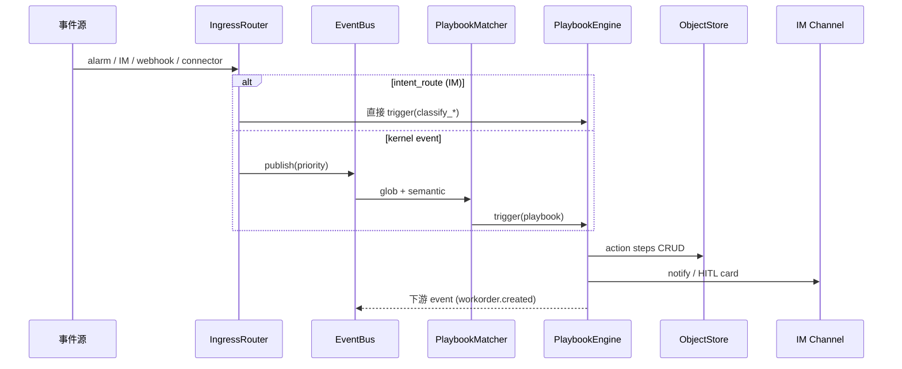

# ClaWorks 核心架构与业务逻辑指南

**更新**：2026-05-23  
**读者**：架构师、核心贡献者、高级集成商  
**代码真源**：`packages/claworks-runtime/src/`

---

## 一、模块地图

```
packages/claworks-runtime/src/
├── kernel/                 EventBus · Matcher · Scheduler · Ingress · DedupGuard
├── planes/data/            ObjectStore · OntologyEngine · KB · Drizzle/SQLite
├── planes/orch/            PlaybookEngine · StepExecutor · HITLGate · FunctionExecutor
├── interfaces/
│   ├── rest/               /v1/* HTTP（events, objects, kb, playbooks, doctor）
│   ├── mcp/                MCP stdio 工具（与插件 cw_* 面部分重叠）
│   ├── a2a/                Agent Card · TaskHandler · Client
│   ├── connectors/         ConnectorManager → spawn connectors/*
│   ├── nexus/              Pack 安装/registry
│   └── studio/             静态 Studio API seam
├── claworks/               runtime 装配 · doctor · pack-runtime · robot · rbac-sync
└── pack-loader/            从 claworks-packs 加载 manifest/YAML/TS

extensions/claworks-robot/  OpenClaw 胶水：registerService · cw_* · IM hook · notify
connectors/                 echo · mqtt · opcua · modbus · rest-poll · filesystem-kb
```

**OpenClaw 继承层**（不大改）：`src/gateway/`、`src/agents/`、`src/plugins/`、`extensions/feishu/` 等。

---

## 二、核心架构逻辑（事件驱动闭环）



### 2.1 Ingress 双路径（设计关键）

| 路径             | 来源                                                      | 行为                                                 |
| ---------------- | --------------------------------------------------------- | ---------------------------------------------------- |
| **kernel**       | REST `/v1/events`、Connector、MCP `cw_publish_event`、A2A | 进入 EventBus → Matcher                              |
| **intent_route** | IM `message_received`、`POST /v1/bridge/im`               | **不泛洪 Bus**；`classify_*` Playbook 或直接 trigger |

实现：`ingress-publish.ts`、`ingress.ts`、`im-bridge.ts`

### 2.2 Playbook 执行链

1. **Trigger** — `event` / `schedule` / `manual` / `webhook`
2. **Steps** — `action` · `function` · `llm` · `skill` · `subagent` · `notify` · `hitl` · `connector.invoke` · `a2a.send` · `call_playbook`
3. **HITL** — 挂起 run → `cw_hitl_*` / REST / 飞书卡片 → `resolve` 恢复
4. **审计** — run 记录持久化；Prometheus + decision-log

实现：`planes/orch/step-executor.ts`、`hitl-gate.ts`

### 2.3 数据平面

- **Ontology** — YAML ObjectType → 校验 + API
- **ObjectStore** — 版本化文档；触发 `*.created` 事件驱动下游 Playbook
- **KB** — 全文检索 + memory-core 桥；文件夹 bulk ingest（enterprise-commercial）

### 2.4 治理

- **RBAC** — ObjectStore 中 `RbacPolicy`；`rbac-sync` 热加载
- **IngressPolicy** — 控制谁可发布何种 event
- **RobotIdentity** — `robot.md` + `GET /v1/identity`
- **production_mode** — stub/fail-closed 敏感 step

---

## 三、与 OpenClaw 的共存

同一 Gateway 进程内：

| ClaWorks            | OpenClaw                   | 桥接              |
| ------------------- | -------------------------- | ----------------- |
| Playbook `llm` 步   | `api.runtime.llm.complete` | runtime-bridge    |
| Playbook `skill` 步 | `runEmbeddedAgent`         | runtime-bridge    |
| Playbook `notify`   | channel outbound           | notify-channel.ts |
| HITL                | managedFlows               | hitl-gate + 插件  |

用户通过 **IM 对话** 仍走 OpenClaw Agent；**业务事件** 走 ClaWorks EventKernel。`cw_bridge_im_message` / `classify_im_to_business_event` 连接两者。

---

## 四、三种对外集成面

| 方式                 | 入口                                    | 典型用户                     |
| -------------------- | --------------------------------------- | ---------------------------- |
| **A. REST**          | `http://host:18800/v1/*`                | MES、工单系统、低代码        |
| **B. OpenClaw 插件** | `cw_*` 工具（宿主 48 / 远程 22）        | 官方 OpenClaw + extension 仓 |
| **C. A2A**           | `/.well-known/agent.json`、`/a2a/tasks` | 多机器人 mesh                |

契约：`API-SPEC.md`、`CW-TOOLS-MATRIX.md`

---

## 五、Pack 在架构中的位置

Pack **不是**代码插件，是 **Ontology + Playbook + 可选 TS capability** 的数据包：

```
claworks-packs/my-pack/
├── claworks.pack.json
├── ontology/object_types/*.yaml
├── ontology/playbooks/*.yaml
└── src/index.ts          # 可选 registerCapabilities
```

加载：`pack-loader/` → 合并进 OntologyEngine + PlaybookEngine；`reload_packs` 热更新。

---

## 六、业务场景示例（逻辑链）

### 6.1 工业报警 → 工单 → MES

1. Connector `opcua` 模拟 `alarm.created`
2. `diagnose_on_alarm`（base/process-industry）：LLM 诊断 → 创建 `WorkOrder` → HITL
3. 工程师飞书批准 → run 继续
4. `workorder.created` → `dispatch_mes_on_workorder_created`

### 6.2 IM 意图 → 企业 Playbook

1. 飞书消息 → OpenClaw channel → `message_received`
2. `im_bridge.auto_on_message_received` → `classify_im_to_business_event`
3. 匹配 intent → trigger `enterprise-general` 内 Playbook（任务/审批/KB）

### 6.3 日报垂直应用

1. Python `daily-report-system` 解析 Excel → 分析 JSON
2. `claworks-packs/daily-report` Playbook 触发通知 / 飞书卡片
3. install：`daily-report-system/claworks/install.sh` → symlink pack

---

## 七、配置真源

| 文件                                          | 用途                      |
| --------------------------------------------- | ------------------------- |
| `~/.claworks/claworks.json`                   | Gateway、插件、pack paths |
| `claworks-packs/claworks.packs.json`          | 分层 pack profile         |
| `contrib/claworks-product.plugins.allow.json` | 产品插件白名单            |
| Pack 内 YAML                                  | 业务规则                  |

---

## 八、扩展时「不要动核心」的边界

| 应扩展                     | 不应改                           |
| -------------------------- | -------------------------------- |
| 新 Pack YAML/TS            | EventBus 优先级语义              |
| 新 Connector 子进程        | Ingress 双路径契约               |
| 新 REST 集成（调现有 API） | step-executor 步骤类型（需 RFC） |
| 垂直应用仓                 | openclaw 核心里塞 claworks 插件  |

---

## 相关文档

- [ARCHITECTURE.md](./ARCHITECTURE.md) — 分层总纲与神经系统类比
- [BUSINESS-CLOSED-LOOP.md](./BUSINESS-CLOSED-LOOP.md) — 验证命令
- [ECOSYSTEM-EXTENSION-GUIDE.md](./ECOSYSTEM-EXTENSION-GUIDE.md) — 伙伴开发手册
