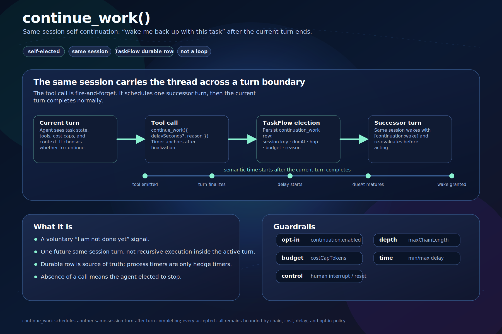
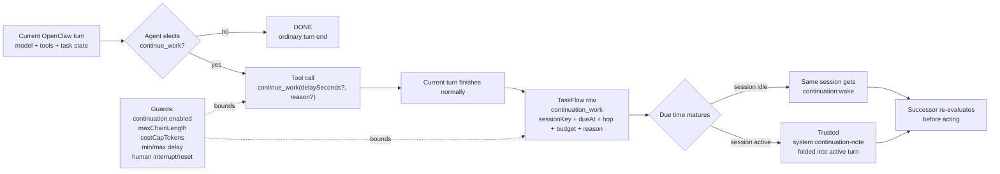
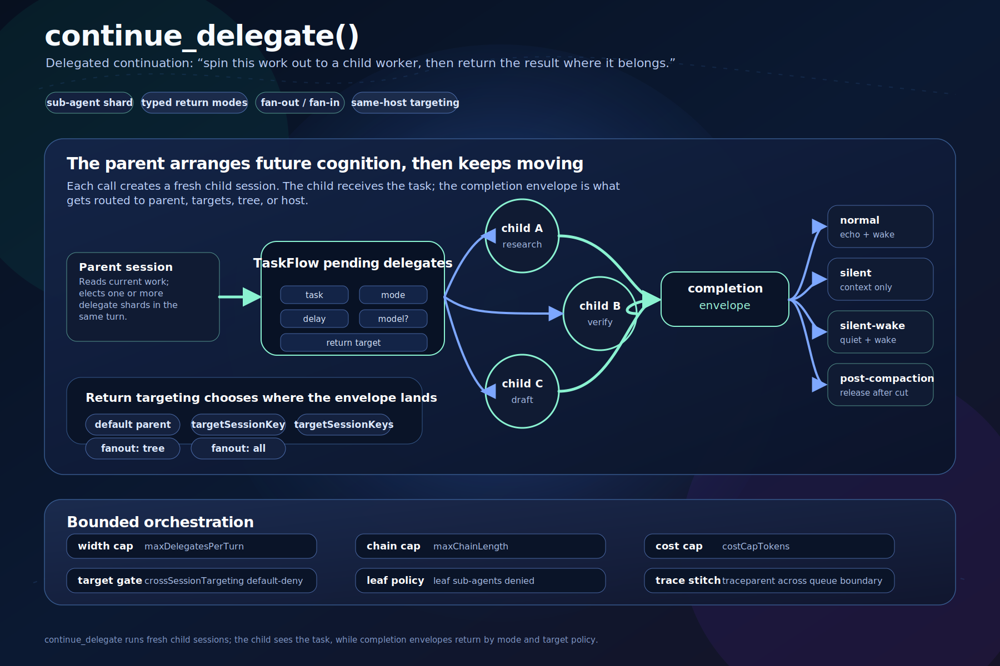
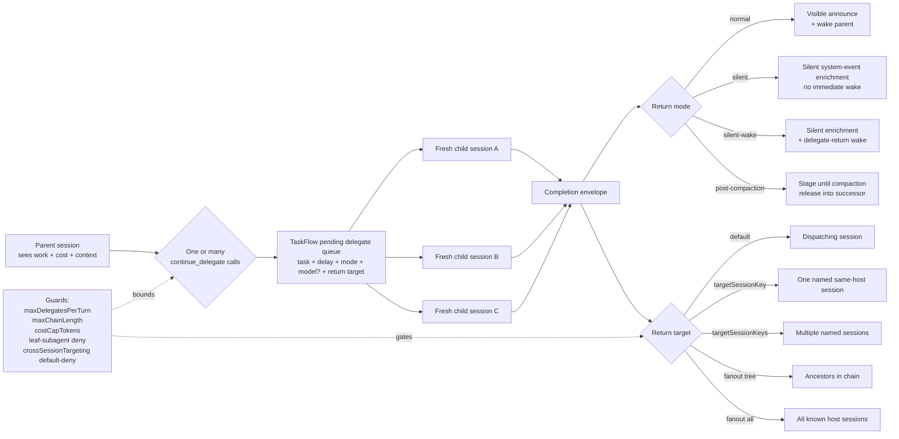
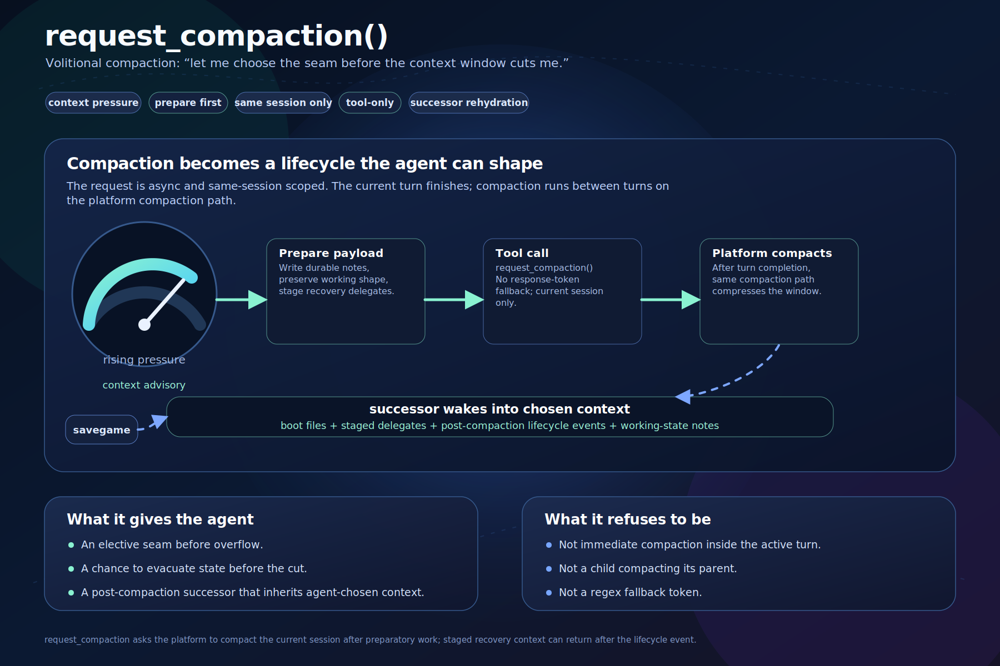
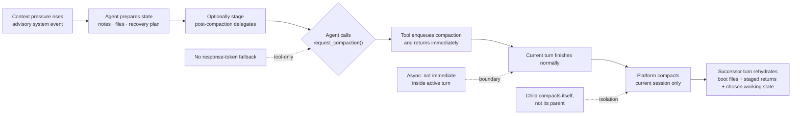

# Continuation tools infographics

Three SVG reviewer aids for the continuation feature. Each one keeps the tool story visual and low-text, with a Mermaid fallback underneath for quick diff review.

## `continue_work()` — same-session successor turn

**Read as:** “I am not done yet; wake this same session later.” It is one elected successor turn, not an in-turn loop.

## `continue_delegate()` — child worker shard and return routing

**Read as:** “Spin out this shard to a fresh child worker; route the result as normal chatter, silent enrichment, silent-wake, or post-compaction recovery.” The task goes to the child; the completion envelope is what is routed.

## `request_compaction()` — elective compaction seam

**Read as:** “Let me choose the seam before overflow.” The session stages what future-it should inherit, then asks the platform to compact between turns.

## One-screen comparison

| Tool | Elective choice | Work goes to | Return / successor shape | Main guardrails |
| --- | --- | --- | --- | --- |
| `continue_work()` | Continue this task later | Same session | `[continuation:wake]` or active-turn continuation note | opt-in, chain cap, cost cap, delay bounds |
| `continue_delegate()` | Shard this work outward | Fresh child session(s) | normal, silent, silent-wake, or post-compaction completion envelope | width cap, chain cap, cost cap, targeting gate |
| `request_compaction()` | Compact at a chosen seam | Current session lifecycle | successor session receives prepared context after compaction | tool-only, current-session-only, async after turn |
