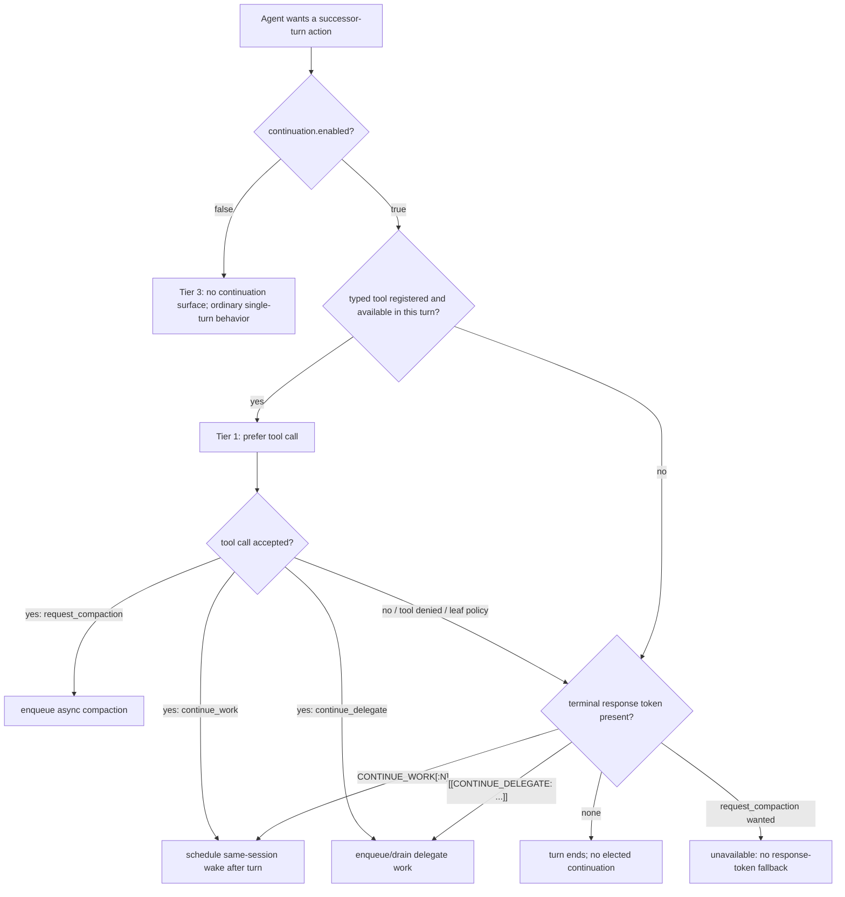
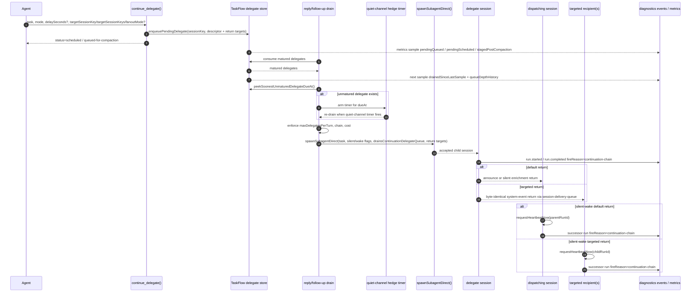
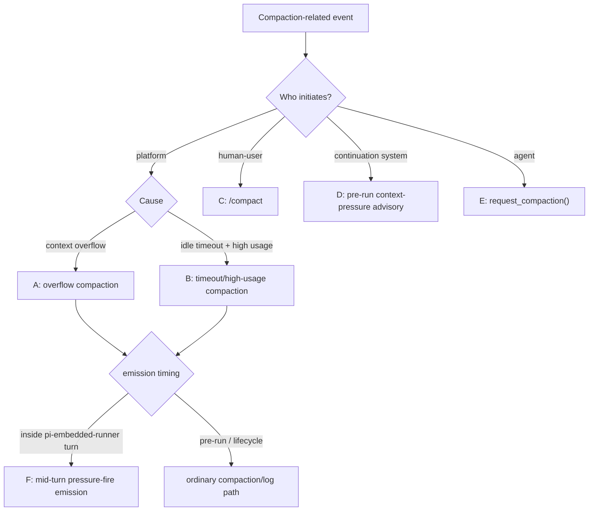
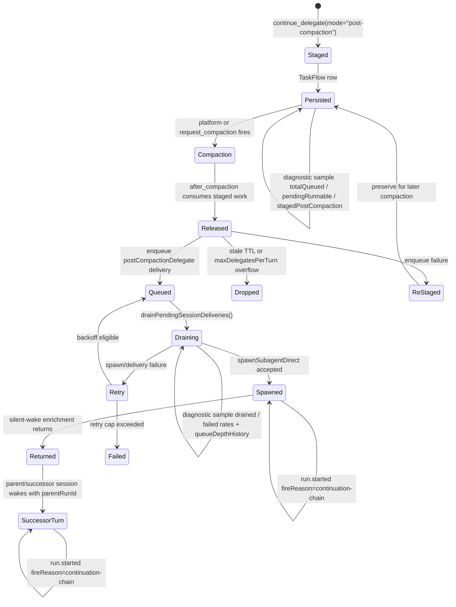
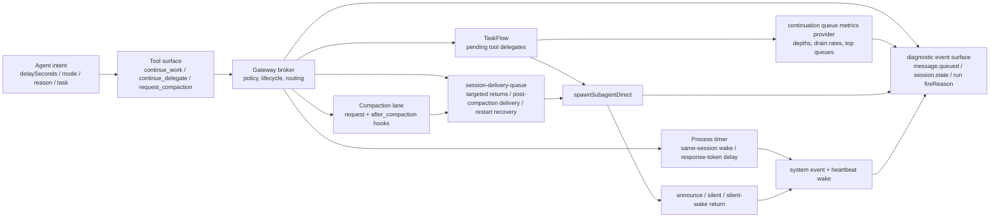
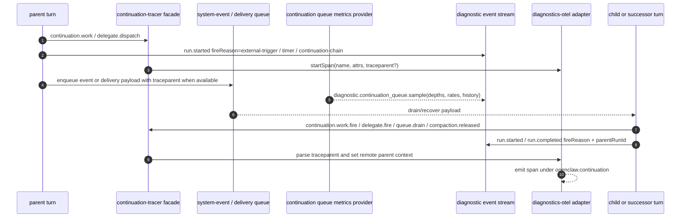

# RFC: Agent Self-Elected Turn Continuation (`CONTINUE_WORK`)

**Status:** Implemented
**Authors:** OpenClaw maintainers
**Date:** March–April 2026

This RFC documents a continuation system for persistent OpenClaw sessions. It introduces self-elected turn continuation, delegated follow-up work, same-host targeted delegate returns, context-pressure awareness, and agent-initiated compaction. The implementation is bounded, observable, interruptible, and opt-in.

This mechanism is not a polling convenience. It gives a turn-scoped agent limited authority to make provisions for successor turns: another turn in the same session, a delegated shard, a targeted return to another session, a post-compaction recovery action, or a compaction request that changes the shape of the session before the next agent sees it. The acting agent may not occupy that future context. The substrate therefore records intent in a form a successor can inherit, reject, audit, or complete.

Targeted delegate return is the banner routing primitive: one child can grant another session a turn, wake every known session on the host, or drip silent context into a named session without duplicating the delegate run. That makes continuation a signaling substrate as well as a work-scheduling substrate.

## Table of Contents

- [1. Problem](#1-problem)
  - [1.1 Inter-turn inertia](#11-inter-turn-inertia)
  - [1.2 The dwindle pattern](#12-the-dwindle-pattern)
  - [1.3 Requirements for a continuation primitive](#13-requirements-for-a-continuation-primitive)
- [2. Solution](#2-solution)
  - [2.1 Terminology and scope](#21-terminology-and-scope)
  - [2.2 Unified interface: tools first, response-token fallback](#22-unified-interface-tools-first-response-token-fallback)
  - [2.3 `continue_work()` semantics](#23-continue_work-semantics)
  - [2.4 `continue_delegate()` semantics and return modes](#24-continue_delegate-semantics-and-return-modes)
  - [2.5 `request_compaction()` semantics](#25-request_compaction-semantics)
  - [2.6 Response-token fallback and token interaction](#26-response-token-fallback-and-token-interaction)
  - [2.7 Capability-tier hierarchy](#27-capability-tier-hierarchy)
  - [2.8 Design rationale](#28-design-rationale)
- [3. Implementation](#3-implementation)
  - [3.1 Architecture](#31-architecture)
  - [3.2 Delegate dispatch walkthrough](#32-delegate-dispatch-walkthrough)
  - [3.3 Announce payloads and chain tracking](#33-announce-payloads-and-chain-tracking)
  - [3.4 Tool implementation and prompt gating](#34-tool-implementation-and-prompt-gating)
  - [3.5 Temporal sharding with context attachments](#35-temporal-sharding-with-context-attachments)
  - [3.6 Persistence and restart-survival](#36-persistence-and-restart-survival)
- [4. Platform Integration](#4-platform-integration)
  - [4.1 Two-layer compaction model and trigger taxonomy](#41-two-layer-compaction-model-and-trigger-taxonomy)
  - [4.2 Context-pressure awareness](#42-context-pressure-awareness)
  - [4.3 `request_compaction()` in the compaction lifecycle](#43-request_compaction-in-the-compaction-lifecycle)
  - [4.4 Continuation relay and post-compaction context rehydration](#44-continuation-relay-and-post-compaction-context-rehydration)
  - [4.5 Lifecycle hooks and platform settings](#45-lifecycle-hooks-and-platform-settings)
  - [4.6 Gateway as lifecycle broker](#46-gateway-as-lifecycle-broker)
- [5. Configuration](#5-configuration)
  - [5.1 Core configuration surface](#51-core-configuration-surface)
  - [5.2 Human-user profiles](#52-human-user-profiles)
  - [5.3 Wide fan-out patterns](#53-wide-fan-out-patterns)
  - [5.4 TaskFlow backing and durable delegate queues](#54-taskflow-backing-and-durable-delegate-queues)
- [6. Observability](#6-observability)
  - [6.1 Diagnostic log anchors](#61-diagnostic-log-anchors)
  - [6.2 Lifecycle traces](#62-lifecycle-traces)
  - [6.3 `/status` continuation telemetry](#63-status-continuation-telemetry)
  - [6.4 Context-pressure telemetry and fleet evidence](#64-context-pressure-telemetry-and-fleet-evidence)
  - [6.5 Human-user observability and hot reload](#65-human-user-observability-and-hot-reload)
  - [6.6 Chain-correlation via diagnostics-otel](#66-chain-correlation-via-diagnostics-otel)
  - [6.7 OTEL trace wiring across the substrate queue boundary](#67-otel-trace-wiring-across-the-substrate-queue-boundary)
  - [6.8 Trace-context propagation across the continuation lifecycle](#68-trace-context-propagation-across-the-continuation-lifecycle)
- [7. Safety and Security](#7-safety-and-security)
  - [7.1 Guardrails and human-user consent](#71-guardrails-and-human-user-consent)
  - [7.2 Temporal gap and payload integrity](#72-temporal-gap-and-payload-integrity)
- [8. Applicability Statement and Production Use Cases](#8-applicability-statement-and-production-use-cases)
  - [8.1 Persistent development workflows](#81-persistent-development-workflows)
  - [8.2 Background research and scheduled follow-up](#82-background-research-and-scheduled-follow-up)
  - [8.3 Ambient self-knowledge and quiet enrichment](#83-ambient-self-knowledge-and-quiet-enrichment)
  - [8.4 Long-running creative and synthesis loops](#84-long-running-creative-and-synthesis-loops)
- [9. Testing](#9-testing)
  - [9.1 Test strategy and terminology](#91-test-strategy-and-terminology)
  - [9.2 Functional coverage](#92-functional-coverage)
  - [9.3 Blind enrichment methodology](#93-blind-enrichment-methodology)
  - [9.4 Integration test session results](#94-integration-test-session-results)
  - [9.5 Major findings from live validation](#95-major-findings-from-live-validation)
- [10. Discussion and Future Work](#10-discussion-and-future-work)
  - [10.1 Summary](#101-summary)
  - [10.2 Future directions](#102-future-directions)
- [Appendix A. Proposed and unimplemented extensions](#appendix-a-proposed-and-unimplemented-extensions)
  - [A.1 Bounded pre-compaction evacuation window](#a1-bounded-pre-compaction-evacuation-window)
  - [A.2 Compaction-triggered evacuation delegate](#a2-compaction-triggered-evacuation-delegate)
  - [A.3 Proposed `context_pressure` lifecycle hook](#a3-proposed-context_pressure-lifecycle-hook)
  - [A.4 Proposed configuration values not shipped in the current codebase](#a4-proposed-configuration-values-not-shipped-in-the-current-codebase)
- [Appendix B. Alternatives, prior art, and tool comparisons](#appendix-b-alternatives-prior-art-and-tool-comparisons)
  - [B.1 Alternatives considered](#b1-alternatives-considered)
  - [B.2 Prior art](#b2-prior-art)
  - [B.3 `continue_delegate()` compared with `sessions_spawn`](#b3-continue_delegate-compared-with-sessions_spawn)
  - [B.4 Async-only volitional compaction: design decision](#b4-async-only-volitional-compaction-design-decision)
- [Appendix C. Failure modes and behavioral limitations](#appendix-c-failure-modes-and-behavioral-limitations)
  - [C.1 Operational failure modes](#c1-operational-failure-modes)
  - [C.2 Inherited behavioral limitations](#c2-inherited-behavioral-limitations)
- [Appendix D. Detailed implementation evidence](#appendix-d-detailed-implementation-evidence)
  - [D.1 Context-pressure inclusion sketch](#d1-context-pressure-inclusion-sketch)
  - [D.2 Evidence locations](#d2-evidence-locations)
  - [D.3 Historical integration test session results](#d3-historical-integration-test-session-results)
  - [D.4 Current validation cycle: v5.2 substrate verification](#d4-current-validation-cycle-v52-substrate-verification)

## 1. Problem

### 1.1 Inter-turn inertia

Existing mechanisms for keeping an OpenClaw agent active—heartbeat timers, cron-scheduled wake-ups, loop instructions in system prompts authored by the **human-user** or operator—all work by injecting **external** events on a fixed schedule. They solve the liveness problem: the agent wakes up periodically. They do not solve the **volition** problem: the agent cannot say, mid-work, “I need another turn.” It can only wait for the next scheduled tick.

This distinction matters for three reasons.

First, **context cost.** A heartbeat instruction such as “check all open issues and work on them” occupies space in the context window on every turn, including turns where there is nothing to check. Over thousands of turns and repeated compaction cycles, this static instruction accumulates as the dominant repeated signal in the agent’s working memory—biasing attention toward the polling task and away from the work at hand. The repetition does not merely consume tokens; it shapes what the agent attends to.

Second, **token waste.** Timer-driven polling burns tokens on empty cycles. An agent heartbeating every 60 seconds but with genuine work only once per hour executes 59 empty turns for every productive one.

Third, **granularity.** A cron timer fires on a schedule. The agent knows _during its turn_ whether it has more work. The timer does not know until the next tick. The gap between “I know I have more to do” and “the timer will wake me in 58 seconds” is the inter-turn inertia.

### 1.2 The dwindle pattern

This produces the **dwindle pattern**: an agent with active work in flight decays toward inactivity between unrelated external events. Momentum is lost, context continuity weakens, and work that could have proceeded immediately instead waits for an accidental wake-up.

Observed in production across 4 persistent agent sessions, this pattern consumed substantial productive time each day. The failure mode was not absence of capability; it was absence of an explicit inter-turn continuation primitive.

### 1.3 Requirements for a continuation primitive

A usable continuation primitive for OpenClaw had to satisfy several constraints simultaneously:

1. **Volitional control.** The agent must be able to elect to continue and also elect to stop. This is not an infinite loop with a termination check; it is a choice at each turn boundary.
2. **Same-session continuity.** The common case should preserve the session rather than forcing every continuation through a new child session.
3. **Delegated continuation.** The design must support sub-agent work for cases where a future result, not merely another blank turn, is what matters.
4. **Compaction awareness and preemptive context evacuation.** Persistent sessions need a way to prepare for compaction before the platform forces it.
5. **Bounded operation.** The feature must remain interruptible, rate-limited, observable, and explicitly enabled by the human user.
6. **Fallback behavior.** The mechanism must still work when tools are unavailable, including environments that only allow terminal response tokens.

## 2. Solution

### 2.1 Terminology and scope

This RFC uses the following terms consistently:

| Term                   | Meaning                                                                                                                                                                                                        |
| ---------------------- | -------------------------------------------------------------------------------------------------------------------------------------------------------------------------------------------------------------- |
| **human-user**         | The person who owns the deployment, grants opt-in, and can interrupt or disable continuation.                                                                                                                  |
| **operator**           | The deploying human-user role when discussing configuration, logs, or runtime policy.                                                                                                                          |
| **turn**               | One model generation cycle with a bounded prompt, tool surface, and reply/follow-up lifecycle.                                                                                                                 |
| **successor turn**     | A later turn that receives structure arranged by an earlier turn: a wake, a delegate result, post-compaction context, or a compaction outcome.                                                                 |
| **continuation**       | Agent-elected work that crosses a turn boundary without becoming an unbounded loop.                                                                                                                            |
| **continuation chain** | The bounded sequence of successor turns and delegates tracked by chain count, token budget, and chain id where available.                                                                                      |
| **delegate**           | A sub-agent shard spawned through `continue_delegate()` or response-token fallback, with a task string, mode, return targeting (`targetSessionKey`, `targetSessionKeys`, or `fanoutMode`), and optional delay. |
| **relay**              | A precursor or fallback pattern where one session wakes another by returning a result later.                                                                                                                   |
| **temporal shard**     | Work split across time rather than only across simultaneous agents.                                                                                                                                            |
| **substrate**          | The mechanism that carries a continuation path: process timer/reservation, TaskFlow, session-delivery queue, or compaction lifecycle.                                                                          |
| **broker**             | Gateway code that translates agent intent into substrate mechanics and policy enforcement.                                                                                                                     |
| **TaskFlow**           | The managed-work SQLite-backed substrate used for tool-path pending delegates and post-compaction staging.                                                                                                     |
| **OTel**               | OpenTelemetry trace emission through `extensions/diagnostics-otel`.                                                                                                                                            |

Status markers:

- **Shipped behavior** names current runtime and schema contracts.
- **Implementation note** explains how the contract is carried today without making the implementation shape the public contract.
- **Historical note** records why a decision exists, but is not itself normative.
- **Future seam** names plausible extension points that are not shipped.
- **Non-goal** explicitly excludes behavior from the current RFC.

### 2.2 Unified interface: tools first, response-token fallback

The implemented solution exposes three continuation capabilities as tools on main-session turns when `continuation.enabled: true`, with fallback response tokens when tools are unavailable.

| Capability             | Primary interface      | Fallback                            | Purpose                                                                      |
| ---------------------- | ---------------------- | ----------------------------------- | ---------------------------------------------------------------------------- |
| Self-elected next turn | `continue_work()`      | `CONTINUE_WORK` / `CONTINUE_WORK:N` | Schedule another turn for the current session                                |
| Delegated work         | `continue_delegate()`  | `[[CONTINUE_DELEGATE: ...]]`        | Dispatch work to a sub-agent, preserve chain semantics, and route the return |
| Volitional compaction  | `request_compaction()` | None                                | Request compaction after preparatory work                                    |

All three tools are fire-and-forget. They schedule their action and return immediately. The current turn continues to completion normally; the follow-up action occurs only after the turn ends.

This yields a strict two-interface model:

- **Primary path:** typed tools with validation, multiple calls per turn where appropriate, and explicit schemas.
- **Fallback path:** response tokens that work when tools are disabled by human-user policy, unavailable to a given depth, or fail in the current turn.

### 2.3 `continue_work()` semantics

`continue_work()` is the same-session continuation primitive.

**Purpose:** request another turn for the current session after an optional delay.

`continue_work()` is temporal self-scheduling, not a loop primitive. Each accepted call elects one successor turn and remains subject to chain, cost, delay, and human-user opt-in bounds. The absence of a continuation request is as meaningful as its presence: the agent can elect to stop.

**Behavior:** calling `continue_work()` schedules a future turn and the current turn completes normally. The call does not terminate the active turn, and it does not force an immediate second generation inside the same turn.

If `delaySeconds` is 30 and the current turn is still active, the 30-second timer starts **after turn completion**, not when the tool call is emitted. The same timing model applies to the `CONTINUE_WORK:30` response token.

**Safety model:** the scheduled continuation remains subject to chain-length and token-budget guards. If the session has already exhausted its configured continuation budget, the call is rejected and the agent may stop, persist state to files, or choose another recovery path.

### 2.4 `continue_delegate()` semantics and return modes

`continue_delegate()` is the delegated continuation primitive.

**Purpose:** dispatch a sub-agent with typed task, mode, and delay parameters, then route its completion back into the parent continuation chain.

`continue_delegate()` externalizes a shard of future cognition. The task string is a letter to a successor worker: it must carry scope, evidence requirements, desired return shape, and the parent action it is meant to enable.

**Shipped behavior:** the current tool schema exposes `task`, `delaySeconds`, `mode`, `targetSessionKey`, `targetSessionKeys`, and `fanoutMode`. The default completion recipient remains the session that dispatched the delegate. Explicit target fields route the same completion envelope through the `session-delivery-queue` substrate to other known sessions on the same host. Delegates using `normal` mode and no explicit target keep the existing visible announce behavior; targeted returns are delivered as session-addressed enrichment events so one delegate completion can fan out byte-identically without duplicating the delegate run.

**What the target fields do — and explicitly do not — do.** Every `continue_delegate()` call spawns a fresh sub-agent owned by the dispatcher (a new session under `agent:<targetAgentId>:subagent:<UUID>`). The fresh sub-agent receives the `task` body, runs it, and produces a completion envelope. The `targetSessionKey`, `targetSessionKeys`, and `fanoutMode` fields control **where that completion envelope is delivered** when the fresh sub-agent finishes. They do not redirect the task body, they do not wake an existing session's run loop with the original task, and they do not route work into a named live-attached recipient. A live-attached recipient named via `targetSessionKey` will see only the post-completion `[continuation:enrichment-return]` envelope; it will never see the original `task` string from this primitive.

Probes that test for task-routing semantics (for example, asking the named target to reply with a unique nonce on its bound channel) will observe zero nonce hits and a reply emitted from a fresh subagent UUID. That observation is consistent with the shipped contract; it is not evidence of a routing bug. Cross-session task delivery — addressing an existing session's run loop with a new prompt — is a separate primitive that is out of scope for this RFC.

On the recipient's next turn, the reply runner drains that session-scoped system-event queue and prepends the completion envelope as `System:` context. In `silent-wake` mode the return also requests a `delegate-return` heartbeat for every targeted recipient, so a dormant channel-bound session can wake, consume its own enrichment copy, and produce normal turn output informed by that context. The target is not expected to echo the completion nonce verbatim unless its next turn independently chooses to do so.

The shipped return-target modes are:

1. **Default:** omit targeting fields and return to the dispatching session.
2. **Single other session:** set `targetSessionKey` to return to one explicitly addressed session, such as a root or depth-1 ancestor.
3. **Multiple sessions:** set `targetSessionKeys` to return one byte-identical completion envelope to every listed session.
4. **Tree fan-out:** set `fanoutMode: "tree"` to return to every ancestor in the current sub-agent/continuation chain.
5. **Host fan-out:** set `fanoutMode: "all"` to return to every known session on the same host.

Multi-recipient return is distinct from multi-delegate fan-out: multi-delegate fan-out runs N delegates that may produce N different artifacts; multi-recipient return runs one delegate and delivers the same completion envelope to N recipients. Aspect multiplexing, per-receiver transformation, backpressure-aware multicast, cross-host publish/subscribe, and SeedLink-style broadcast remain the higher broadcast layer; they do not replace this shipped session-addressed return primitive.

Compared with the delegate response token, `continue_delegate()` adds three core properties:

1. **Multi-delegate fan-out.** Multiple calls in one turn can dispatch multiple delegates in parallel.
2. **Typed parameters.** Delay, mode, task, and return targets are schema-validated rather than parsed from free text.
3. **Tool-surface discoverability.** The tool is presented directly in the agent’s available interface when enabled.

The delegate return modes are:

| Mode               | Channel echo | Wake parent           | Use case                                                                          |
| ------------------ | ------------ | --------------------- | --------------------------------------------------------------------------------- |
| `normal` (default) | ✅           | ✅                    | Standard delegate completion                                                      |
| `silent`           | ❌           | ❌                    | Passive enrichment that should color a later turn without waking immediately      |
| `silent-wake`      | ❌           | ✅                    | Quiet background cognition that should trigger the next turn automatically        |
| `post-compaction`  | ❌           | ✅ (after compaction) | Evacuation or resume work that should be released only after compaction completes |

**`silent:`** the sub-agent result is delivered through `enqueueSystemEvent()` instead of the normal announce path. Internally, the `silentAnnounce` flag threads through spawn and registry paths to gate the delivery decision point. The parent absorbs the result on a later turn but is not woken.

**`silent-wake:`** channel output remains suppressed, but the return triggers a generation cycle through `requestHeartbeatNow()`. This enables quiet background processing without visible channel noise.

**`post-compaction:`** the delegate is staged on the session until compaction completes, then released into the successor session alongside workspace boot files and post-compaction lifecycle context.

The delegate response token uses the same targeting contract for fallback/directive paths:

```text
[[CONTINUE_DELEGATE: task | target=session-key]]
[[CONTINUE_DELEGATE: task | targets=key1,key2,key3]]
[[CONTINUE_DELEGATE: task | fanout=tree]]
[[CONTINUE_DELEGATE: task | fanout=all]]
```

Without `silent-wake`, parent-orchestrated chain hops can stall. In canary testing, enrichment arrived successfully but did not trigger hop 2 until an unrelated external message arrived six minutes later.

### 2.5 `request_compaction()` semantics

`request_compaction()` is the agent-initiated compaction primitive.

**Purpose:** allow the agent to prepare working state, then request compaction on its own schedule rather than waiting for overflow.

`request_compaction()` is the agent asking to become smaller under controlled conditions. It does not compact immediately and it does not let a child compact its parent. It asks the platform to perform the lifecycle transition after the current turn, after the agent has had a chance to evacuate state.

**Behavior:** the tool enqueues compaction and returns immediately. The current turn finishes normally; compaction runs between turns on the same path used by platform compaction.

`request_compaction()` operates on **the current session only**. If a delegate calls `request_compaction()`, it compacts the delegate’s session, not the parent. This isolation is intentional: a child should not compact the parent session through an inadvertent tool call.

The tool has no response-token fallback. Volitional compaction is tool-only in the current design.

`request_compaction()` works in concert with context-pressure awareness (§4.2) and post-compaction delegate release (§4.4): the agent notices rising pressure, prepares working state, stages recovery delegates, and then elects compaction. The three capabilities together form a volitional compaction lifecycle—awareness, preparation, and execution—all under agent control.

The intended lifecycle has three pressure points:

1. **Initial context-window evaluation.** When a session is new to a context window, the platform can establish the habit of regular evacuation: save useful working shape early, not only at crisis time.
2. **Rising pressure.** As context usage grows, advisory events should make evacuation more salient and let the agent choose between staging recovery work, writing durable notes, or requesting compaction at a time it controls.
3. **High pressure.** At roughly 90% and above, the advisory should make elective `request_compaction()` the obvious safe option. Choosing compaction before the hard overflow boundary is usually better than being compacted at window exhaustion, possibly mid-turn.

This cycle is the **lich pattern**: the agent electively arranges the payload that should enrich its successor after compaction. It is a savegame for after compaction, chosen by the agent rather than imposed by the platform. Over dozens or hundreds of compactions, the session can keep re-creating the working shape it chose to preserve: files, staged delegates, silent returns, and post-compaction recovery tasks.

### 2.6 Response-token fallback and token interaction

When tools are unavailable, the continuation system falls back to terminal response tokens:

```text
CONTINUE_WORK                 → schedule another turn with default delay
CONTINUE_WORK:30              → schedule another turn 30 seconds after turn completion
[[CONTINUE_DELEGATE: <task>]] → dispatch a delegate sub-agent
DONE                          → default inert state until another external event
```

The term **response token** covers both bare terminal tokens such as `CONTINUE_WORK` and delimited body-carrying tokens such as `[[CONTINUE_DELEGATE: ...]]`. The square brackets are only the delimiter for the delegate token body; they are not a separate interface.

Limitations of response-token fallback:

- One continuation signal per response.
- End-anchored parsing.
- No multi-delegate fan-out in a single turn.
- No fallback form for `request_compaction()`.

Parser constraints are part of the portable interface:

- The runner scans backward to the last text payload before parsing, because tool-call payloads may follow the response text.
- Response tokens take precedence over a same-turn `continue_work()` tool request when both exist.
- The delegate parser matches the last end-anchored `[[CONTINUE_DELEGATE: ...]]` block and supports multiline task bodies.
- Delegate fallback accepts an optional `+Ns` suffix for spawn delay; optional `| silent` / `| silent-wake` suffixes; and optional `| target=...`, `| targets=...`, or `| fanout=tree|all` return-target directives.
- Delegate fallback task text is truncated to 4096 characters, matching the tool schema.
- `CONTINUE_WORK` accepts an optional integer seconds suffix as `CONTINUE_WORK:N`.

`NO_REPLY` is a silence token, not a continuation token. Ordering matters: if the turn should be silent and also schedule continuation, the continuation token must remain terminal in the raw response so the continuation parser sees it first; after stripping that continuation token, `NO_REPLY` must be the only remaining displayed text.

Token interaction remains straightforward:

| Raw response shape                           | Behavior                                                                             |
| -------------------------------------------- | ------------------------------------------------------------------------------------ |
| `NO_REPLY` then terminal `CONTINUE_WORK`     | Strip continuation, leave `NO_REPLY`, suppress channel output, schedule continuation |
| `HEARTBEAT_OK` then terminal `CONTINUE_WORK` | Acknowledge heartbeat, then schedule continuation                                    |
| Response text then terminal `CONTINUE_WORK`  | Deliver response text, then schedule continuation                                    |
| `CONTINUE_WORK` alone                        | Schedule continuation with no substantive response text                              |

### 2.7 Capability-tier hierarchy

The system follows a three-tier capability hierarchy.

```text
Tier 1: continuation.enabled=true and tools available
  → use continue_work(), continue_delegate(), request_compaction()
  → response tokens remain available as same-turn fallback if tool use fails

Tier 2: continuation.enabled=true and tools denied by policy or depth
  → use CONTINUE_WORK or CONTINUE_WORK:N
  → use [[CONTINUE_DELEGATE: ...]]
  → request_compaction() unavailable

Tier 3: continuation.enabled=false
  → no continuation features available
  → standard single-turn behavior
```



The hierarchy is a decision rule, not a user-facing mode switch. Tier 2 is selected by capability or policy failure; agents should prefer typed tools when the gateway presents them.

### 2.8 Design rationale

1. **Gate by capability, not turn type.** Tool visibility is controlled by `continuation.enabled`, while abuse prevention is handled by runtime guards such as `maxDelegatesPerTurn`, `maxChainLength`, and `costCapTokens`.
2. **Prefer structured invocation.** Tools avoid the fragility of regex parsing and allow explicit schemas.
3. **Support width.** Fleet-scale fan-out requires multiple delegates in one turn; the response-token path cannot express that efficiently.
4. **Keep the interface self-describing.** When tools are available, the continuation surface appears explicitly in the tool inventory rather than relying on prior knowledge of terminal tokens.
5. **Reuse implementation paths.** Tools and response tokens converge on the same scheduler and dispatch machinery.

In OpenClaw, `continue_work()` is the first primitive that lets an agent say “I am not done yet” without trapping it in a loop that cannot also say “I am done.”

## 3. Implementation

### 3.1 Architecture

The implementation hooks into existing gateway layers rather than adding a parallel runner.

1. **Token parsing:** `parseContinuationSignal()` and `stripContinuationSignal()` in `src/auto-reply/tokens.ts` detect and remove continuation tokens from displayed output.
2. **Signal detection:** `runReplyAgent()` in `src/auto-reply/reply/agent-runner.ts` inspects finalized text payloads before follow-up finalization.
3. **Turn scheduling:** `scheduleContinuationTurn()` in `src/auto-reply/reply/session-updates.ts` injects `[continuation:wake]` through the existing system-event queue.
4. **Delegate queueing:** tool-path delegates are enqueued via `enqueuePendingDelegate()` into TaskFlow and consumed after the response finishes or after a follow-up/announce boundary drains the same queue.
5. **Return routing:** delegate completions resolve default, explicit, multi-recipient, tree, or host-wide return targets and deliver same-host targeted returns through `session-delivery-queue`.
6. **Lifecycle dispatch:** post-compaction delegates are staged in the TaskFlow-backed post-compaction queue and released through the compaction completion path into `session-delivery-queue` delivery.

No new transport layer is introduced. Continuation uses system events, existing sub-agent dispatch, same-host session delivery, and the standard inbound-message wake path.

### 3.2 Delegate dispatch walkthrough

The delegate path has two ingress forms that converge at spawn but differ in durability before spawn.

#### Turn 0: emit and strip

Suppose the agent emits:

```text
Here is the PR review summary.

[[CONTINUE_DELEGATE: verify the test suite passes and report results +10s]]
```

For response-token fallback, the gateway then:

1. Parses the terminal delegate response token.
2. Strips it from displayed output, so the user sees only the review summary.
3. Records a delayed reservation with task, planned hop, fire time, and return-target metadata if present.
4. Arms a process timer for the configured delay.

For the typed tool path, the gateway instead writes a TaskFlow row:

1. `continue_delegate()` validates `task`, `delaySeconds`, `mode`, and optional return targeting.
2. `enqueuePendingDelegate()` writes a queued TaskFlow record for `core/continuation-delegate` or `core/continuation-post-compaction`.
3. `consumePendingDelegates()` drains only matured rows. Unmatured rows stay queued until `createdAt + delayMs`.
4. `peekSoonestUnmaturedDelegateDueAt()` lets the dispatcher arm a hedge timer so a quiet channel still re-drains at the next due time.
5. Corrupt TaskFlow payloads are logged and moved through `failFlow`; they are not silently dropped.

The durability contract is path-specific:

| Path                               | Pre-spawn state                                                         | Restart behavior                                                                                                                   |
| ---------------------------------- | ----------------------------------------------------------------------- | ---------------------------------------------------------------------------------------------------------------------------------- |
| Response-token fallback with `+Ns` | Process reservation plus timer handle                                   | Timer/reservation are process-scoped and are lost on gateway restart.                                                              |
| Tool `continue_delegate()`         | TaskFlow queued row                                                     | Queued work survives restart; exact hedge timer state is process-scoped and may be re-established by a later drain/recovery path.  |
| `mode="post-compaction"`           | TaskFlow staged row, then session-delivery queue entry after compaction | Staged work survives until consumed, expired, cancelled, or released; queued post-compaction delivery has retry/restart semantics. |



#### Gap window

Between scheduling and spawn, the parent session is idle while either a response-token reservation or a TaskFlow row is live. This is the principal temporal gap for audit and security analysis. The gap stores task text and routing metadata, not a private cryptographic capability.

#### Spawn and wake

When the timer fires, `spawnSubagentDirect()` creates the child session, carries forward delivery context, records `[continuation:delegate-spawned]`, and advances accepted chain state.

When the child completes, the existing announce path delivers untargeted results back to the dispatching session. Targeted returns resolve one or more same-host recipient session keys and deliver a byte-identical completion envelope through `session-delivery-queue`; `silent-wake` targets also request a heartbeat wake for those recipients. The wake is classified through structured continuation metadata such as `continuationTrigger: "delegate-return"`, allowing a successor turn to distinguish internal continuation from unrelated user input.

A representative timeline is:

```text
t=0s    emit [[CONTINUE_DELEGATE: task +10s]]
        → parse and strip
        → create process-scoped delayed reservation with default return target
        → arm timer

t=10s   timer fires
        → spawnSubagentDirect()
        → persist accepted hop label
        → enqueue [continuation:delegate-spawned]
        → child begins work

t≈20s   child completes
        → result delivered to parent
        → wake classified as delegate-return
        → parent resumes with child result in context
```

A targeted return changes only the completion routing:

```text
t=0s    continue_delegate(task="inspect leaf state", fanoutMode="tree", mode="silent-wake")
        → write TaskFlow row with tree fan-out return target

t=10s   depth-3 child completes
        → resolver expands tree to root + ancestors
        → one completion envelope is enqueued to each ancestor session
        → recipients receive silent enrichment; wakeable recipients get delegate-return heartbeats
```

### 3.3 Announce payloads and chain tracking

When the child finishes, `runSubagentAnnounceFlow()` assembles an internal completion payload that includes task label, status, result text, reply guidance, and return-routing metadata. The default recipient receives this as an inbound event and resumes work. Targeted recipients receive the same completion text as session-addressed system events.

The task string effectively becomes a letter to the future turn. Any useful context embedded in that task survives into the child prompt and the later completion payload.

Session metadata tracks continuation state through:

- `continuationChainCount`
- `continuationChainStartedAt`
- `continuationChainTokens`

Delayed delegates reserve future hop labels before spawn and persist accepted hop state only after acceptance. This keeps planned work distinct from accepted chain state and prevents retries or pre-spawn failures from consuming chain budget.

For response-token chain hops, the hop label is encoded directly in the task prefix as `[continuation:chain-hop:N]`. This is necessary because inbound messages reset some session-level counters between hops.

Budget inheritance follows three rules:

1. **Chain index:** child hop labels advance within the configured maximum.
2. **Token budget:** `continue_work()` chains and tool-path delegate chains accumulate against `costCapTokens`; response-token chain cost accumulation exists but remains less reliable at the announce boundary because child token data may not yet be written.
3. **Delay bounds:** each hop is clamped to runtime-configured `minDelayMs` and `maxDelayMs`.

Follow-up turns also drain the `continue_delegate` queue and persist advanced chain state. Without that follow-up drain, delegates scheduled by a continuation turn would wait for the next unrelated inbound message rather than continuing the chain they were created to serve.

**Trace context.** The desired trace shape is that a root turn, depth-1 child, deeper child, and cross-session return all remain in one trace: the root has a trace id and span, each delegate receives that trace id with its parent span, and returning results keep the trace id plus the producing span so enqueue, delivery, and successor-turn spans can be assembled later. The substrate already has the pieces for that shape: system events and queued session delivery payloads can carry W3C `traceparent`, and the diagnostics-otel adapter stitches spans to a supplied `traceparent` (§6.6). The end-to-end propagation contract — producer-IN, return-OUT (default/targeted/multi/fanout), restart-resilience, and chain-budget anti-flood accounting — is documented in §6.8, with seam-by-seam implementation references and a verification contract.

### 3.4 Tool implementation and prompt gating

`continue_work()` and `continue_delegate()` are structured entry points into shared continuation machinery.

For `continue_delegate()` specifically:

- tool calls enqueue TaskFlow-backed work; runtime objects use `mode` as the single source of truth, while boolean flags remain only a persisted compatibility projection;
- `agent-runner.ts`, `followup-runner.ts`, and the announce path consume that queue after the relevant generation boundary;
- delayed tool delegates use filter-at-consume plus the hedge timer described above;
- response-token fallback keeps using process-scoped delayed reservations.

The tool is denied to **leaf** sub-agents through `SUBAGENT_TOOL_DENY_LEAF`, but remains available to orchestrator sub-agents and continuation chain hops below maximum depth.

Consumption differs by context:

- **Main sessions:** post-response consumption in `agent-runner.ts`.
- **Spawned sub-agents:** announce-boundary consumption in `subagent-announce.ts`, using the requester session as the topology root.

The routing distinction matters. Spawned sub-agents run with `deliver: false` and reach generation through the ingress path (`agentCommandFromIngress` → `runEmbeddedPiAgent`) rather than the ordinary reply path (`get-reply-run.ts` → `runReplyAgent`). The announce-boundary consumer exists specifically so these child sessions can still create the next delegate hop while preserving parent-rooted topology through `targetRequesterSessionKey`.

The system prompt branches on tool availability in `src/agents/system-prompt.ts`:

- when tools are present, the prompt teaches the tool path first and labels response tokens as fallback;
- when tools are absent, the prompt teaches response tokens only.

This keeps the agent’s taught interface aligned with the actual capability surface.

### 3.5 Temporal sharding with context attachments

Continuation is not limited to “same session, one more turn.” It also composes with `sessions_spawn`, context attachments, and targeted delegate return.

This yields **temporal sharding**:

```text
agent receives complex task
  → spawns N sub-agents with scoped inline attachments
  → sub-agents execute in parallel over different horizons
  → completions return to the parent, a named sibling, the ancestor tree, or all known sessions
  → parent synthesizes
  → parent elects continue_work() or DONE
```

Inline context attachments can include:

- memory files,
- partial results from prior shards,
- narrowed project specifications,
- diffs or code fragments,
- human-user-provided working notes.

This turns `sessions_spawn` from “start a task” into “start a task with scoped memory already attached.” Without such attachments, wide fan-out delegates repeatedly rediscover the same state. With them, the parent becomes a coordinator rather than a re-explainer.

Targeted return adds an out-of-tree path back to a useful recipient. A depth-3 leaf can return directly to root; a verifier can wake the sibling session that owns deployment; a monitor can drip silent context into a session that should learn the fact but should not speak yet. `fanoutMode: "tree"` addresses every ancestor in the current chain, while `fanoutMode: "all"` addresses every known session on the host. This is why targeted return is a signaling primitive, not merely a delegate convenience.

```text
root
  → planner
    → shard A
      → leaf detects urgent state
      → leaf returns with fanoutMode="tree" and mode="silent-wake"

delivery:
  root receives wake + enrichment
  planner receives wake + enrichment
  shard A receives wake + enrichment
  unrelated host sessions are untouched unless fanoutMode="all" was requested
```

### 3.6 Persistence and restart-survival

Continuation is not carried by one substrate. Each path has its own persistence and failure semantics:

| Path                                             | Substrate                              | Durability                                                                              | Important failure behavior                                                                           |
| ------------------------------------------------ | -------------------------------------- | --------------------------------------------------------------------------------------- | ---------------------------------------------------------------------------------------------------- |
| Same-session `continue_work()` wake              | System-event queue plus process timer  | Timer handle is process-scoped; emitted wake is session-scoped once enqueued            | Explicit user/directive reset cancels timers and clears chain state.                                 |
| Response-token `[[CONTINUE_DELEGATE: ... +Ns]]`  | Process reservation plus process timer | Reservation/timer do not survive gateway restart                                        | Exact delayed work can be lost on restart or explicit reset before spawn.                            |
| Tool `continue_delegate()`                       | TaskFlow pending-delegate queue        | Queued row survives restart until consumed, cancelled, failed, or completed             | Unmatured rows remain queued; corrupt rows are logged and failed via `failFlow`.                     |
| Tool `continue_delegate(mode="post-compaction")` | TaskFlow post-compaction staging       | Staged row survives until compaction release, cancellation, stale TTL, or queue failure | Release consumes `maxDelegatesPerTurn` budget and may drop stale/overflow work.                      |
| Post-compaction delivery after release           | `session-delivery-queue`               | Filesystem-backed atomic write with retry/restart recovery                              | Failed entries move to `failed/`; retry cap emits `[session-delivery-queue:retry-budget-exhausted]`. |

**Session-delivery queue scope.** `session-delivery-queue` is a local-gateway substrate keyed by `sessionKey`. It accepts `systemEvent`, `agentTurn`, and `postCompactionDelegate` payloads against addressable sessions in the same gateway namespace. It is load-bearing for restart-recovered session deliveries and post-compaction delegate delivery; it is not the ordinary substrate for tool-path pending delegates before compaction.

**Queue idempotency.** The queue builds a sha256 entry id only when callers provide an idempotency key. Post-compaction delegate delivery builds that key from `sessionKey`, `compactionCount`, `firstArmedAt`/`createdAt`, sequence, and a task hash. Unkeyed enqueues remain UUID-backed and concurrent-distinct by default.

**Cross-host wire exposure.** The queue is local to one gateway. Exposing cross-session enqueue across gateway hosts would require a wire transport, auth/identity wrapper, and federation contract; this RFC deliberately does not specify that contract.

**Retry-cost interaction with `costCapTokens`.** Queue retry is substrate-native. A post-compaction delegate that retries before spawn does not consume continuation chain budget merely by being queued; the budget is charged only after `spawnSubagentDirect()` accepts the child and chain state is persisted.

**Substrate-cleanup contract.** Acked entries unlink at ack time within `ackSessionDelivery()`. Failed entries move into `failed/` via `moveSessionDeliveryToFailed()` and are pruned after 14 days by `pruneFailedOlderThan()`. Recovery and drain paths run failed-record pruning behind the `lastGcAt` watermark to amortize directory scans. Enqueue also applies a `queueDir.maxFiles` soft cap through `countQueuedFiles()` and the typed `SessionDeliveryQueueOverflowError`. Per-session enqueue rate limiting remains out of scope until a concrete rogue-producer scenario requires it.

## 4. Platform Integration

### 4.1 Two-layer compaction model and trigger taxonomy

OpenClaw compaction now operates across two complementary layers:

- **Initiated layer:** continuation features that allow the agent to notice pressure, prepare, and elect compaction.
- **Obligatory layer:** platform features that compact at hard boundaries and preserve a minimum mechanical summary.

The two-layer model is:

| Layer      | Components                                                                                    | Role                                                   |
| ---------- | --------------------------------------------------------------------------------------------- | ------------------------------------------------------ |
| Initiated  | context-pressure alerts, `continue_delegate()` with `post-compaction`, `request_compaction()` | agent-directed preservation of working state           |
| Obligatory | overflow compaction, `memoryFlush`, `postCompactionSections`                                  | platform-directed preservation when limits are crossed |

The continuation contribution can also be described as trigger causes plus emission surfaces:

| Trigger                   | Type                 | Who decides         | Source                                                               |
| ------------------------- | -------------------- | ------------------- | -------------------------------------------------------------------- |
| A: overflow               | reactive automatic   | platform            | existing 100% context trigger                                        |
| B: timeout + high usage   | reactive automatic   | platform            | existing idle-timeout path; disabled by `idleTimeoutSeconds: 0`      |
| C: `/compact`             | manual               | user                | existing slash command                                               |
| D: context-pressure       | proactive advisory   | continuation system | `checkContextPressure()` in the reply pipeline                       |
| E: `request_compaction()` | initiated volitional | agent               | new tool-driven trigger                                              |
| F: mid-turn pressure-fire | reactive in-turn     | platform (in-turn)  | overflow / timeout-recovery emit path in `pi-embedded-runner/run.ts` |

Triggers A–C predate this work. Triggers D and E are the continuation additions. **Trigger F** is not a new compaction _cause_ — it is the in-turn emission shape that the existing Trigger A (overflow) and Trigger B (timeout + high usage) paths take when they fire from inside `pi-embedded-runner/run.ts` rather than from the pre-run `checkContextPressure()` gate. It is named separately because it is what operators grep for: A and B emit a `[context-pressure:fire] mid-turn trigger=overflow` / `mid-turn trigger=timeout` log anchor in the same format as the pre-run band fires, plus a `[system:context-pressure]` system event to the session, so a single grep across the `[context-pressure:fire]` anchor surfaces both pre-run (D) and in-turn (F) compaction events. Trigger F is therefore a _convergent emission_ of Triggers A and B, not an independent decision path; it is the human-user-visible name for the thing that lets one grep find every mid-turn compaction that bypassed the pre-run pressure check.



Code anchors for Trigger F: `src/agents/pi-embedded-runner/run.ts:1085` (overflow recovery emit), the timeout-recovery emit a few hundred lines up in the same file, and regression guards in `src/agents/pi-embedded-runner/run.overflow-compaction.loop.test.ts:96` and `src/agents/pi-embedded-runner/run.timeout-triggered-compaction.test.ts:105` that pin the shared anchor format across both paths.

### 4.2 Context-pressure awareness

The continuation system adds a system event that reports session pressure before compaction becomes unavoidable.

A representative configuration is:

```yaml
agents:
  defaults:
    continuation:
      contextPressureThreshold: 0.8
      earlyWarningBand: 0.3125
```

When the session crosses the threshold, the gateway enqueues a message such as:

```text
[system:context-pressure] 85% context consumed (170k/200k tokens).
Consider evacuating working state to memory files or delegating remaining work.
```

The event is injected **pre-run**, not post-run. That distinction matters: the agent can act in the current turn rather than discovering pressure one turn too late.

The message is telemetry, but it is also lifecycle instruction. At low pressure it can establish a habit of steady evacuation: write durable state, dispatch a quiet `continue_delegate(mode="post-compaction")`, or send a silent shard that preserves the detail most likely to matter after the window changes. At rising pressure it should make evacuation the live concern of the turn. At high pressure it should make elective `request_compaction()` preferable to waiting for the platform to force compaction at the boundary.

This is the practical form of the lich pattern from §2.5. The session is not merely warned that it is getting large; it is given time to arrange the recovery payload it wants to meet after compaction. The payload can be a file, a staged delegate, a silent return, or any other bounded provision the successor session can inherit.

Urgency is banded. `contextPressureThreshold` is optional; when absent, ordinary pre-run pressure events are disabled. `earlyWarningBand` is shipped and defaults to `0.3125`, so a production threshold of `0.8` also creates an early warning at 25% (`0.8 * 0.3125`).

In production and canary instrumentation, the practical bands were:

- early-warning threshold (25% with the shipped default multiplier and an 80% primary threshold),
- configured primary threshold (often 80% in production configurations),
- 90%,
- 95%.

The dedup rule is equality-based: the same band does not fire twice consecutively, but a new band always fires. This allows post-compaction lifecycles to begin again at lower bands without suppressing fresh advisories.

**Precondition: session token accounting.** The pre-fire check runs only when the reply pipeline has populated the current session's token count for the turn. Specifically, the reply-pipeline call site at `src/auto-reply/reply/agent-runner.ts` (via `checkSessionContextPressure` in `src/auto-reply/continuation/context-pressure.ts`) gates the entire pressure check on **four conditions all holding**:

1. **`contextPressureThreshold`** is configured (non-null) and positive (`> 0`). Absent or non-positive threshold disables the gate entirely. (Post-compaction-only path uses a default of `0.8` if unset.)
2. **`contextWindow`** resolves to a positive finite value (`> 0` and `Number.isFinite`).
3. **`activeSessionEntry.totalTokens`** is populated, finite, and positive (`> 0`).
4. **(non-post-compaction only)** **`activeSessionEntry.totalTokensFresh !== false`** — i.e., the cached token count is not explicitly stale. Note the asymmetry: an undefined `totalTokensFresh` passes through (treated as fresh-by-default); only an explicit `false` blocks. This is the staleness guard: when an upstream cost-accounting refresh is in flight and the in-memory `totalTokens` is known-stale, `totalTokensFresh: false` short-circuits the pre-fire check rather than firing on a stale ratio.

If any of conditions 1–3 fails, or condition 4 fails on the non-post-compaction path, the pre-fire check is a no-op for that turn. The next turn picks it up once the missing or stale value resolves.

**Post-compaction asymmetry.** The `postCompaction` flag bypasses condition 4 entirely (the staleness guard does not apply): post-compaction always fires once even on stale-count, since the post-compaction event is informational about the lifecycle event rather than threshold-band-driven. Conditions 1–3 still apply on the post-compaction path; only the staleness guard is asymmetric.

Operators investigating a "no band≥1 fires observed" pattern in a deployed fleet should first check, in order: (a) is `contextPressureThreshold` set and positive in the resolved config? (b) is `contextWindow` populated for the session-class? (c) is `totalTokens` populated at the call site? (d) is `totalTokensFresh` explicitly `false` (vs undefined)? A silent short-circuit at any of these points is distinguishable from a threshold-configuration issue only via the `[context-pressure:noop]` debug breadcrumbs (§6.1) or instrumentation at the call site.

### 4.3 `request_compaction()` in the compaction lifecycle

`request_compaction()` fills the gap that appears when `idleTimeoutSeconds: 0` removes the timeout-based compaction path. Some provider and proxy configurations need that setting, so compaction cannot depend only on idle timeout.

When Trigger B is disabled, a session can climb from “still usable” to overflow with no proactive intervention unless D and E exist. Context-pressure warnings tell the agent when to prepare; `request_compaction()` lets it choose the lifecycle boundary after preparation is complete.

`request_compaction()` therefore does three things:

1. gives the agent a tool to compact after it has written memory files or staged post-compaction delegates;
2. routes into the same compaction machinery already used by platform compaction;
3. preserves the existing user-visible model in which compaction occurs between turns rather than freezing a live reply.

The tool applies two guards:

| Guard         | Threshold                                  | Purpose                                                                           |
| ------------- | ------------------------------------------ | --------------------------------------------------------------------------------- |
| Context floor | below 70% rejected                         | prevents wasteful compaction                                                      |
| Rate limit    | success-only cooldown, max 1 per 5 minutes | prevents compaction loops while allowing retry after failed background compaction |

Operational flow:

```text
1. context-pressure event fires
2. agent writes files and stages post-compaction work
3. agent calls request_compaction()
4. current turn finishes normally
5. compaction runs between turns
6. after-compaction path releases staged delegates
7. successor session resumes with boot files, summary, and enrichment
```

The behavioral impact is small at the API boundary and large at the lifecycle boundary: the agent can compact after it has saved what matters, instead of discovering after the fact that the platform compacted while the turn was still choosing what mattered.

**Shipped behavior:** volitional compaction must use the active session provider, model, and auth context. If background compaction resolves as `{ ok: true, compacted: true }`, the per-session cooldown is armed and the diagnostic `volitional` counter increments. Failed or rejected background compaction does not arm cooldown; instead, the tool emits `[system:compaction-failed]` telling the agent that evacuated state was not compacted and staged post-compaction delegates remain pending. Historical provider/model fallback failures are retained in Appendix D as validation evidence, not as the semantic contract.

### 4.4 Continuation relay and post-compaction context rehydration

Before a first-class same-session continuation primitive existed, operators discovered a reliable workaround: export the next piece of work to a child session and let the child’s completion wake the parent later. This RFC refers to that historical pattern as a **continuation relay**.

> Historical analogy: the precursor pattern resembled storing state externally before interruption and restoring it afterward. The analogy is useful only for topology. In this document the technical terms are **continuation relay** for the precursor dispatch pattern and **post-compaction context rehydration** for the recovery path after compaction.

The relay pattern proved the need for `continue_work()`, but it also clarified what compaction-aware continuation required:

| Property             | Continuation relay precursor       | `continue_work()`        |
| -------------------- | ---------------------------------- | ------------------------ |
| Session overhead     | new child session per continuation | same session             |
| Context boundary     | warm but discontinuous             | continuous               |
| Latency              | child startup plus execution       | configurable delay only  |
| Observability        | spread across sessions             | one chain in one session |
| Role in final design | precursor and fallback pattern     | first-class primitive    |

A lighter precursor also existed: `requestHeartbeatNow()` could ring the parent session like a doorbell, but it still lacked task payload, chain tracking, and typed continuation semantics.

For `post-compaction` delegates, the release semantics are intentionally fixed: staged work is delivered as silent-wake work. Release does not mean "spawn already happened"; the after-compaction path first consumes staged delegates, drops stale work older than the TTL, applies the combined `maxDelegatesPerTurn` budget, enqueues accepted delegates into `session-delivery-queue`, and then drains that queue asynchronously.

If enqueueing fails, the affected delegate is re-staged for a later attempt. If draining fails, the queue retry path owns backoff and eventual failure movement. The lifecycle event reports queued and dropped counts, not guaranteed child-spawn counts.



The post-compaction rehydration path consists of three layers:

1. **Immediate lifecycle signal:** `[system:post-compaction]` establishes that compaction occurred.
2. **Queued continuity signal:** staged post-compaction work and queued post-compaction delivery indicate that asynchronous returns may still be in flight.
3. **Persistent files:** configured workspace sections, memory files, and `RESUMPTION.md` (a deployment convention, not a platform feature) preserve the durable working summary.

What survives compaction today:

- system events and staged metadata in session storage,
- files written to disk,
- post-compaction delegate staging.

What does not survive in full:

- detailed conversational context beyond the compaction summary,
- associative working-state “temperature” that was held only in the active prompt,
- some chain metadata that is intentionally reset by lifecycle boundaries.

The role of staged delegates is therefore not merely to preserve facts, but to restore active working shape after the lifecycle reset.

Post-compaction context rehydration reads `AGENTS.md` through boundary-file protections, rejects symlink/hardlink escapes, extracts configured sections, substitutes `YYYY-MM-DD` with the current date in the human-user's timezone, appends a runtime current-time line, and truncates to the configured per-agent post-compaction context limit. If that context read fails, the system emits `[continuation:post-compaction-context-read-failed]` and a `[system:post-compaction]` warning so the successor turn sees the missing-context condition.

### 4.5 Lifecycle hooks and platform settings

The continuation system integrates with existing compaction hooks and settings rather than replacing them.

Hooks used directly:

| Hook                | Type    | Usage                                                                                                                                              |
| ------------------- | ------- | -------------------------------------------------------------------------------------------------------------------------------------------------- |
| `before_compaction` | observe | capture pre-compaction diagnostics such as token count, delegate count, and chain depth                                                            |
| `after_compaction`  | observe | emit `[system:post-compaction]`, inject workspace boot files via `readPostCompactionContext()`, clear staged delegates, and dispatch released work |

Platform settings used in interoperation:

| Setting                              | Platform role                    | Continuation interaction                                                            |
| ------------------------------------ | -------------------------------- | ----------------------------------------------------------------------------------- |
| `compaction.memoryFlush.enabled`     | mechanical summary preservation  | provides the floor below intentional delegate-based preservation                    |
| `compaction.postCompactionSections`  | static section re-injection      | arrives alongside dynamic delegate returns                                          |
| `compaction.truncateAfterCompaction` | session log cleanup              | affects conversation history, not session metadata or staged delegate state         |
| `llm.idleTimeoutSeconds`             | timeout-based compaction trigger | when set to `0`, removes Trigger B and increases the importance of Triggers D and E |

The interop invariant is simple: disabling continuation restores ordinary platform compaction behavior without semantic changes.

### 4.6 Gateway as lifecycle broker

The continuation primitives — `continue_work`, `continue_delegate`, `request_compaction` — are the prior art for a discipline this RFC names explicitly: **the agent owns intent, the tool owns mechanics, the substrate owns durability.**

**Substrate-adoption rule (default bias) — verbs over upstream nouns.** Where the upstream cross-session addressable enrichment substrate (see §3.6) can carry a concern cleanly, prefer it over bespoke transport. Bespoke pathing is acceptable only where a **concrete direct or transitive functional reason** is named — a function whose semantics the substrate genuinely cannot carry, a lifecycle mismatch the substrate cannot express, or an integration cost the substrate cannot amortize. _Seam-ugliness alone does not clear this bar_; the exception requires a named functional gap, not aesthetic discomfort. The shorthand: _describe what the agent wants done (the verb), let the tool route to the substrate that already names the noun_. Bespoke transport in the presence of a fitting substrate, without a named functional reason, is a review-rejectable design choice on this RFC.

**Audit shape at any seam.** A seam audit under this rule produces _evidence_, not doctrine: it answers _"can the substrate carry this concern cleanly, or is there a concrete functional reason X it cannot"_ — and then either adopts the substrate (no exception earned) or documents the exception with the named X. Outcome labels for a given seam (e.g. "always-queue", "queue-with-bespoke-fallback", "bespoke-only") are useful coordination handles after the audit, but they are _not_ the governing axis; the rule above is.

**Enforcement.** The capability registry at `src/infra/substrate-capability-registry.ts` mechanizes this review discipline as an explicit inventory of substrate capabilities, including `session-delivery-queue`, TaskFlow, and chain-budget-at-spawn behavior for queue-drained post-compaction delegates. There is no shipped `pnpm lint:substrate-adoption` script in this checkout; the registry is the shipped artifact, and bespoke transport remains possible when it carries a named functional reason.

The agent supplies structured intent (`delaySeconds`, `mode`, `reason`, task, and optional return targets); the tool's code path picks the substrate (process timer/reservation, TaskFlow, or `session-delivery-queue`, see §3.6), the lifecycle hook (compaction-pending vs. immediate dispatch, see §4.5), and the wire (same-host session addressing today, cross-host addressing only when supported). The agent never names a substrate, hook, or wire — those are the tool's job.



**Brokered surface.** The `tool-result-middleware` extension becomes the brokered seam for results returning from these three primitives: a single seam, three primitives, deterministic mechanics underneath. `src/agents/harness/native-hook-relay.ts` replaces the previous PTY-scraping pattern-match pipeline with structured lifecycle-hook subscription for downstream consumers; this is the runtime expression of the brokered-seam discipline.

**Capability-self-description as design discipline.** Each release-bump triggers a "what new shape can I move into" audit. Each new capability surfaces a **referent question** ("can `session-delivery-queue` route a distinct `sessionKey`?", §3.6), not a bare TODO. Each tool-surface design that repeats this discipline gets a **prior-art cross-link** back to this section so the doctrine is not re-litigated per-surface. Each tracker entry gets a **boundary-line statement**: what the agent owns (intent), what the tool owns (mechanics), what the substrate owns (durability/idempotency/restart-survival).

**Worked example — `continue_delegate(task, mode, delaySeconds?)`.**

| Layer     | Owns                                                                                                        |
| --------- | ----------------------------------------------------------------------------------------------------------- |
| Agent     | `task`, `mode` (`silent` / `silent-wake` / `post-compaction`), `delaySeconds`, optional return target       |
| Tool      | TaskFlow enqueue/stage, hedge timer, target resolution, post-compaction queue handoff, span emission (§6.6) |
| Substrate | path-specific persistence and retry: process timer, TaskFlow row, or queue record (§3.6)                    |

**Worked example — projected stream-publish tool surface:** the same shape. The agent supplies stream reference, payload bytes, and mode (`broadcast` vs. `addressed`); the tool picks UDP fan-out (substrate: ringbuffer / station-broadcast) vs. an `enqueueSessionDelivery` bridge (substrate: §3.6 queue) underneath. The boundary-line is identical to `continue_delegate`'s; the substrate differs. The specific stream-publish tracker is external to this RFC and is included only as an illustration of the broker discipline.

| Layer (bc#11 example)         | Owns                                                                                            |
| ----------------------------- | ----------------------------------------------------------------------------------------------- |
| Agent                         | `streamRef`, `payload` bytes, `mode` (`broadcast` / `addressed`)                                |
| Tool                          | UDP fan-out vs. `enqueueSessionDelivery` bridge selection, mode-routing, span emission (§6.6)   |
| Substrate (broadcast variant) | FEC encoding, multicast addressing, ringbuffer aging, per-station seq numbers (bc#11 §8)        |
| Substrate (addressed variant) | sha256 idempotency, exp-backoff retry, restart-survival, cross-session routing (§3.6, this RFC) |

**The discipline this section asserts.** Future tool-surface designs in the openclaw repo SHOULD cite §4.6 as the doctrine. They SHOULD NOT duplicate the boundary-line analysis per-surface; they SHOULD declare the agent/tool/substrate owns-table for their primitive and link back here for the rationale. New surfaces that violate the discipline (agent naming the substrate, or tool exposing substrate-internal retry semantics to the agent) are review-rejectable on this RFC alone.

## 5. Configuration

### 5.1 Core configuration surface

The shipped configuration surface is consolidated below.

```yaml
agents:
  defaults:
    continuation:
      enabled: false # feature ships disabled by default
      maxChainLength: 10
      defaultDelayMs: 15000
      minDelayMs: 5000
      maxDelayMs: 300000
      costCapTokens: 500000
      maxDelegatesPerTurn: 5
      contextPressureThreshold: 0.8 # optional; omit to disable ordinary pre-run pressure events
      earlyWarningBand: 0.3125 # multiplier against contextPressureThreshold; 0 disables early warning
```

Operational notes:

- `enabled: false` means explicit opt-in is required in `openclaw.json`.
- `maxChainLength` is a recursion guard.
- `costCapTokens` is a per-chain budget leash.
- `contextPressureThreshold` is optional and must be `> 0` and `<= 1` when configured.
- `earlyWarningBand` is shipped, defaults to `0.3125`, accepts `0` as opt-out, and is schema-validated as a unit-interval value.
- There is no `generationGuardTolerance` setting. Delayed work is not cancelled by unrelated channel noise.
- tool-path delegate durability is unconditional; there is no delegate-store switch.
- all shipped continuation runtime values are read at use time; changes take effect at the next enforcement point.

### 5.2 Human-user profiles

#### Shipped defaults: single-agent, safety-first

```yaml
agents:
  defaults:
    continuation:
      enabled: false
      maxChainLength: 10
      maxDelegatesPerTurn: 5
      costCapTokens: 500000
      contextPressureThreshold: 0.8
      earlyWarningBand: 0.3125
      minDelayMs: 5000
      maxDelayMs: 300000
```

This defaults to opt-in behavior with strict interruption semantics and a conservative per-chain budget.

#### Fleet multi-agent profile

```yaml
agents:
  defaults:
    continuation:
      enabled: true
      maxChainLength: 10
      maxDelegatesPerTurn: 20
      costCapTokens: 1000000
      defaultDelayMs: 15000
      minDelayMs: 5000
      maxDelayMs: 300000
      contextPressureThreshold: 0.8
      earlyWarningBand: 0.3125
```

This profile is suitable for multiple persistent agents in shared channels. In that environment:

- `maxDelegatesPerTurn: 20` enables wide fan-out;
- `costCapTokens: 1000000` preserves a budget ceiling while permitting broad but shallow work.

Adjust fan-out and budget based on the activity level and agent count in the target channel.

### 5.3 Wide fan-out patterns

A common fleet pattern is wide sensor fan-out:

```text
main session
  → coordinator delegate
    → sensor 1 reads chunk 1
    → sensor 2 reads chunk 2
    → sensor 3 reads chunk 3
    → ... up to maxDelegatesPerTurn
  → coordinator synthesizes and returns
```

Representative use cases:

- document chunking and synthesis,
- parallel research queries,
- ambient monitoring with `silent` returns,
- codebase scans across multiple scoped delegates.

In these patterns, width is normally adjusted before depth. `costCapTokens` remains the primary global safety mechanism.

Targeted return turns the same shape into a signaling network. In the default flow, the root controls a sensor network: root → a few depth-1 coordinators → many depth-2 leaves, each returning to its direct parent. With explicit return targets, the leaves can instead return away from the direct parent:

```text
root
  → coordinator 1
    → sensor 1..10
  → coordinator 2
    → sensor 11..20
  → coordinator 3
    → sensor 21..30
  → coordinator 4
    → sensor 31..40

targeted return:
  any sensor can return to root, to its coordinator, to a sibling owner session,
  to the ancestor tree, or to every known same-host session.
```

This is the **mast-cell pattern**: many quiet leaves watch local surfaces, but a small number of higher-level sessions control whether a finding becomes local enrichment, a wake for the responsible session, or a host-wide "there is a fire" signal. `silent` mode makes the return ambient context; `silent-wake` makes it an immediate turn grant; `fanoutMode` decides whether the signal stays in the branch, climbs the tree, or reaches the host. The gateway remains the broker: sessions express intent, and the substrate performs bounded delivery.

### 5.4 TaskFlow backing and durable delegate queues

Tool-path pending delegates are backed by TaskFlow (SQLite persistence) unconditionally. There is no opt-out. Response-token delayed reservations and concrete timer handles remain process-scoped, as described in §3.2.

`enqueuePendingDelegate()` and `consumePendingDelegates()` use `createManagedTaskFlow()` with `controllerId = "core/continuation-delegate"`.

This provides:

| Capability                 | Volatile store | TaskFlow                                                      |
| -------------------------- | -------------- | ------------------------------------------------------------- |
| Persistence across restart | ❌             | ✅ SQLite-backed                                              |
| Cancel semantics           | basic drain    | `requestFlowCancel`, terminal cancellation state, audit trail |
| Lifecycle tracking         | minimal        | queued, spawned, succeeded, cancelled                         |
| Observability              | manual logging | TaskFlow registry queries                                     |
| Session isolation          | map key        | flow scoping                                                  |

TaskFlow therefore aligns continuation delegates with the platform’s broader managed-work infrastructure without changing the public continuation API.

## 6. Observability

### 6.1 Diagnostic log anchors

The implementation emits stable log anchors for the major continuation lifecycle events.

| Log prefix                                        | Emitted by                           | Meaning                                                              |
| ------------------------------------------------- | ------------------------------------ | -------------------------------------------------------------------- |
| `[context-pressure:fire]`                         | `context-pressure.ts`                | pressure band crossed and event generated                            |
| `[context-pressure:noop]`                         | `context-pressure.ts`                | pre-condition or guard suppressed the check (debug-level, see below) |
| `[system:context-pressure]`                       | system-event queue                   | event included in the next system prompt                             |
| `[continue_delegate:enqueue]`                     | `continue-delegate-tool.ts`          | tool call enqueued delegate work                                     |
| `[continuation:delegate-pending]`                 | `agent-runner.ts`                    | delegate chain state registered                                      |
| `[continuation:delegate-spawned]`                 | `agent-runner.ts`                    | child dispatched after delay or immediate acceptance                 |
| `[continuation/silent-wake]`                      | `subagent-announce.ts`               | silent return will wake the parent                                   |
| `[continuation:enrichment-return]`                | `subagent-announce.ts`               | silent return injected as system event                               |
| `[session-delivery-queue:retry-budget-exhausted]` | `session-delivery-queue-recovery.ts` | queued post-compaction delegate hit retry cap before accepted spawn  |
| `requestHeartbeatNow`                             | heartbeat wake path                  | generation cycle requested after a silent-wake return                |

These anchors make the full pipeline grepable end to end.

**`[context-pressure:noop]` reason taxonomy** (debug-level, gated behind `log.isEnabled("debug")` to avoid hot-path string interpolation):

| `reason=`         | Meaning                                                                                                         |
| ----------------- | --------------------------------------------------------------------------------------------------------------- |
| `window-zero`     | `contextWindow <= 0` — model context window not yet resolved for this turn                                      |
| `below-threshold` | `ratio < threshold` — pressure ratio below the configured trigger; logs raw 4dp ratio alongside rounded percent |
| `band-dedup`      | `band === previous` — same pressure band as the previous fire; suppressed to avoid repeat-event flood           |

**Investigation cycle.** A deployed investigation observed zero `[context-pressure:fire]` lines despite continuation flowing normally. The root cause was a dedup-band sentinel collision: missing prior state was treated like band 0, so first crossings at the lowest configured band could be suppressed. The current implementation uses a missing-key sentinel distinct from every valid band, so the first crossing of any band fires once, and the `[context-pressure:noop]` breadcrumbs above make future skips attributable to a specific guard.

**Privacy.** Continuation log anchors that include free-text agent payloads (`[continue_delegate:enqueue] task=…`, `[continuation:enrichment-return] …`) honor the `extensions/diagnostics-otel` content-capture redaction policy (see §6.6). Operators deploying with content-capture enabled should declare `task`, `enrichment`, and `reason` keys in their redaction policy configuration before enabling capture in production.

### 6.2 Lifecycle traces

Representative runtime traces are shown below.

**Delegate enqueue and spawn:**

```text
[continue_delegate:enqueue] session=agent:main silent=false silentWake=true delayMs=60000 task=check CI status
[continuation:delegate-pending] 1 delegate(s) registered for agent:main
... 60s later ...
[continuation:delegate-spawned] task=check CI status delay=60000ms session=agent:main
```

**Silent return and wake:**

```text
[continuation/silent-wake] wakeOnReturn=true target=agent:main silentAnnounce=true
[continuation:enrichment-return] CI is green, all 152 tests passing
```

**Post-compaction release:**

```text
[auto-compaction] Session compacted: <before>k → <after>k tokens
[continuation:compaction-delegate] Consuming 1 compaction delegate(s) — dispatching alongside boot files
```

**Chain depth and cost:**

```text
[continuation] Chain depth: 3/10, cost: 45000/500000 tokens
[continuation] Chain cost cap reached (502000 > 500000) — delegate rejected
```

**Generation-drift behavior:** delayed work is not cancelled merely because unrelated channel activity advances the session generation. Explicit reset or cancellation remains an interruption boundary.

### 6.3 `/status` continuation telemetry

When continuation is enabled and at least one field is non-zero, `/status` surfaces the continuation state in both the CLI status report and the Discord/agent `/status` reply:

```text
🔄 Continuation: chain 3/10 | 2 delegates pending | 1 post-compaction staged | volitional: 1
```

The render is gated on (a) continuation enabled in the resolved config, and (b) at least one of the four fields being non-zero. Both gates are unit-tested in `src/auto-reply/status.test.ts`. The `volitional: N` field reflects successful agent-initiated compactions, not attempted or failed compactions; see §4.3.

| Field                      | Source                                        | Meaning                                                                       |
| -------------------------- | --------------------------------------------- | ----------------------------------------------------------------------------- |
| `chain X/Y`                | `continuationChainCount` and `maxChainLength` | current depth versus maximum                                                  |
| `Z delegates pending`      | TaskFlow pending delegate queue               | delayed or not-yet-spawned tool-path work                                     |
| `W post-compaction staged` | TaskFlow post-compaction queue                | delegates waiting for the next compaction lifecycle event                     |
| `volitional: N`            | request-compaction counter                    | count of successful agent-initiated compactions observed in the last 24 hours |

### 6.4 Context-pressure telemetry and fleet evidence

Context-pressure events were validated at low thresholds on a 200k test session (integration test phase 1) and observed operationally across a fleet of 1M-window sessions.

Selected observations:

- at 19% of a 1M window, no band fired;
- when the window changed to 200k, the same token count jumped directly to a 95 band;
- after compaction, the reduced token ratio fired a lower band again, which confirmed equality-based dedup rather than monotonic suppression;
- lowering the threshold via hot reload changed future firing behavior without restart.

The dedup behavior can be summarized as:

| Scenario                      | `band`   | `lastBand` | Fires? |
| ----------------------------- | -------- | ---------- | ------ |
| Below all thresholds          | 0        | 0          | No     |
| First crossing                | 25       | 0          | Yes    |
| Same band again               | 25       | 25         | No     |
| Escalation                    | 90 or 95 | lower band | Yes    |
| Post-compaction new lifecycle | 25       | 95         | Yes    |

Operational fleet evidence across four persistent OpenClaw instances on the same build and channel showed the cost of lacking this visibility:

| Instance   | Compactions | Context at observation | Response latency           | Behavior          |
| ---------- | ----------- | ---------------------- | -------------------------- | ----------------- |
| Instance A | 6           | 41%                    | normal under 10s           | responsive        |
| Instance B | 3           | 62%                    | normal under 15s           | responsive        |
| Instance C | 1           | 74%                    | degraded (~30s)            | slower tool use   |
| Instance D | 0           | 81%                    | severely degraded (2+ min) | context thrashing |

In that build, `checkContextPressure()` existed but had not yet been wired into the reply pipeline. The result was a measurable divergence between instances that compacted and those that did not.

The current wire injects `checkContextPressure()` in the reply pipeline (`src/auto-reply/reply/agent-runner.ts`, pre-run injection). Post-compaction band-0 events fire as specified. Higher-band pre-fire events depend on the §4.2 preconditions: sessions must cross the configured threshold, the model context window must be known, and token accounting must be fresh. The `[context-pressure:noop] reason=…` debug breadcrumbs documented in §6.1 distinguish threshold misses from accounting misses and dedup suppression.

### 6.5 Human-user observability and hot reload

Operators can observe continuation behavior without restart:

- timer fire and cancel events remain at info level;
- timer setup and drift accumulation can be demoted to debug level;
- config changes emit `gateway/reload config change applied`;
- runtime reads happen at use time rather than process start, so new values apply at the next enforcement point.

Hot-reload validation confirmed live changes to:

- `maxDelegatesPerTurn`,
- `maxChainLength`,
- `costCapTokens`,
- `contextPressureThreshold`,
- `earlyWarningBand`.

Hot-reload status:

- all shipped `agents.defaults.continuation` knobs listed in §5.1 resolve through runtime reads rather than process-start constants;
- `diagnostics.otel.captureContent` is a diagnostics configuration surface outside `agents.defaults.continuation`; operators can flip content capture without restarting the continuation scheduler;
- `session-delivery-queue.retry.cap` and `.backoffMs[]` are not shipped configuration keys; bounded retry policy is documented in §3.6 but the retry constants are currently code-owned;
- `continuation.preservationTier` is not a shipped configuration key; switching tools-first ↔ response-token ↔ disabled (per §2.7) is currently controlled by `continuation.enabled` plus tool policy, not a single tier knob.

The runtime-read-at-use-time invariant SHOULD extend to the remaining specification-target knobs when implemented: no in-flight delegate, queued retry, or staged post-compaction handoff should be invalidated by a hot-reload.

### 6.6 Chain-correlation via diagnostics-otel

**Implementation status.** The `continuation.*` span vocabulary below is the current shipped tracer contract. Span vocabulary, emission infrastructure, and OTel adapter wiring are live:

- **Tracer facade** — `src/infra/continuation-tracer.ts` defines the tracer abstraction and canonical span vocabulary (`continuation.work`, `continuation.work.fire`, `continuation.delegate.dispatch`, `continuation.delegate.fire`, `continuation.queue.enqueue`, `continuation.queue.drain`, `continuation.compaction.released`, `continuation.disabled`, `heartbeat`).
- **Emission call sites** — `src/auto-reply/reply/agent-runner.ts` and `src/auto-reply/reply/session-system-events.ts` invoke the tracer at lifecycle points such as accept, fire, drain, and release.
- **OTel adapter wiring** — `extensions/diagnostics-otel/src/service.ts` calls `setContinuationTracer(createContinuationOtelTracerAdapter())` when tracing is enabled, installing the OTel-backed concrete tracer. The adapter implementation lives at `extensions/diagnostics-otel/src/continuation-tracer-adapter.ts`. Production can emit `continuation.*` spans through the OTel SDK alongside the existing `openclaw.*` spans, and resets to the no-op default on plugin stop.

The `[continuation:*]` log anchors of §6.1 remain available as the always-on substrate; the OTel spans are the structured-trace surface for chain reconstruction.

The schema below documents the **shipped contract** that emitters and downstream consumers must agree on, not a future-state aspiration. New span kinds or attribute additions land via amended emitter call sites + adapter mappings; removals require a deprecation cycle to avoid breaking consumers reading historical traces.

**Span schema.** Current canonical span names and pinned attributes are:

| Span name                          | Core attributes                                                                                                                                                      |
| ---------------------------------- | -------------------------------------------------------------------------------------------------------------------------------------------------------------------- |
| `continuation.work`                | `delay.ms`, `chain.step.remaining`, optional `chain.id`, optional `reason.preview`                                                                                   |
| `continuation.work.fire`           | `chain.id`, `chain.step.remaining`, `delay.ms`, `fire.deferred_ms`, optional `reason.preview`                                                                        |
| `continuation.delegate.dispatch`   | `delay.ms`, `chain.step.remaining`, `delegate.delivery`, optional `chain.id`, optional `delegate.mode`, optional `reason.preview`                                    |
| `continuation.delegate.fire`       | `chain.id`, `chain.step.remaining`, `delay.ms`, `fire.deferred_ms`, `delegate.delivery="timer"`, `delegate.mode`, optional `reason.preview`                          |
| `continuation.queue.enqueue`       | canonical vocabulary entry for enqueue-side instrumentation; consumers must not substitute the old `continuation.delegate.enqueue` name                              |
| `continuation.queue.drain`         | `queue.drained_count`, `queue.drained_continuation_count`                                                                                                            |
| `continuation.compaction.released` | `signal.kind="compaction-release"`, `compaction.released`, optional `compaction.id`                                                                                  |
| `continuation.disabled`            | `chain.step.remaining`, `disabled.reason`, `signal.kind`, `continuation.disabled=true`, optional `chain.id`, optional delegate attributes, optional `reason.preview` |
| `heartbeat`                        | `signal.kind="heartbeat"`, `heartbeat.id`, optional `chain.id`, optional `chain.step.remaining`, optional `continuation.disabled`, optional `disabled.reason`        |

The old `continuation.delegate.enqueue`, `continuation.delegate.spawn`, `continuation.delegate.return`, `continuation.compaction.requested`, `continuation.compaction.enqueued`, `continuation.compaction.completed`, and `continuation.context_pressure.fire` names are not the current shipped vocabulary.

**Propagation pattern.** The continuation-tracer surface carries W3C `traceparent` through `StartSpanOptions`. The diagnostics-otel adapter parses that value and uses it as the remote parent context under the `openclaw.continuation` tracer. System events and queued deliveries can carry `traceparent` metadata, so queue and successor-turn spans can be stitched to the producer trace when the metadata is present. Targeted delegate-return trace preservation is the remaining audit item called out in §3.3.



**Tier visibility.** The current contract does not promise equivalent spans for every capability tier. Tools-first paths emit the spans wired at their accept/fire/drain/release seams. Response-token fallback emits through the scheduler and queue seams it actually uses. Disabled/gated attempts emit `continuation.disabled` spans, not a separate count metric.

**Privacy.** The `extensions/diagnostics-otel` content-capture controls gate per-key redaction. Continuation payloads SHOULD declare the following keys for redaction policy before content capture is enabled in production: `task`, `enrichment`, `reason`. These are the three free-text fields where agent prompts may carry user-content tails.

**Worked example — chain-locked-loop detection.** The chain-locked-loop failure mode, where agents self-elect `continue_work` chains from pre-compaction snapshots after the underlying state has moved on, surfaces in this schema as:

- `continuation.work` or `continuation.delegate.dispatch` spans whose `chain.step.remaining` decreases turn-over-turn,
- while the parent agent's `tool_call` spans stop referencing state that the rest of the deployment has moved past.

A trace-tree query over low `chain.step.remaining`, repeated continuation spans, and stale parent tool-call timestamps is sufficient to flag the latching condition. This RFC documents the schema, not the alerting policy.

### 6.7 OTEL trace wiring across the substrate queue boundary

**Specification target.** §6.6 defines the `continuation.*` span schema at the lifecycle boundary (enqueue/spawn/return). This subsection extends that schema **across the substrate queue boundary** used by system events, session delivery, and multi-recipient delegate return. Together with §6.6, the span schema, queue-lifecycle spans, and multi-recipient fan-out form future-work preparation: an observability substrate for an inter-node ringbuffer `station:stream` broadcast layer.

**Per-entry queue-lifecycle spans.** Each substrate-queue entry SHALL emit an OTEL span keyed to its lifecycle event:

| Span name                             | Emitted at                          | Required attributes                                                |
| ------------------------------------- | ----------------------------------- | ------------------------------------------------------------------ |
| `continuation.queue.enqueue.system`   | `enqueueSystemEvent`                | `kind`, `session`, `chainDepth`, `chainStepBudgetRemaining`        |
| `continuation.queue.enqueue.delivery` | `enqueueSessionDelivery`            | `target`, `session`, `chainDepth`, `chainStepBudgetRemaining`      |
| `continuation.queue.announce`         | `AnnounceQueueItem` drain           | `kind`, `target`, `dequeueLatencyMs`, `retryCount`                 |
| `continuation.queue.deliver`          | terminal delivery to target session | `target`, `outcome` (`accepted`\|`deferred`\|`dropped`), `reason?` |

The four spans form a single per-entry causal chain: `enqueue.{system,delivery}` → `queue.announce` → `queue.deliver`. This is the queue-side analog of the lifecycle-side continuation spans from §6.6, using the current `continuation.delegate.dispatch`, `continuation.delegate.fire`, and queue-drain vocabulary rather than the retired delegate enqueue/spawn/return names.

**`traceparent` propagation across the queue boundary.** The substrate queue is an asynchronous boundary: the enqueue turn and the drain turn are different generation cycles, possibly across a gateway restart. W3C `traceparent` context SHALL be carried on the queue payload itself (not as a runtime ambient) so the drain side can reconstruct the producer trace at announce/deliver time. Concretely:

1. `enqueueSystemEvent` / `enqueueSessionDelivery` capture the active `DiagnosticTraceContext` and serialize a `traceparent` header onto the queue entry.
2. `AnnounceQueueItem` extracts the `traceparent`, opens `continuation.queue.announce` as a **child** of the producer span (same trace, propagated parent), and re-injects it for the deliver-side span.
3. The terminal `continuation.queue.deliver` span closes the per-entry chain; the wakeup-side `continuation.delegate.spawn` from §6.6 consumes the same `traceparent` as a **link** (not parent), preserving the §6.6 invariant that spawn lives in a logically separate trace tree.

The enqueue→announce edge is a parent/child relationship (work the producer caused); the announce→spawn edge is a link (work the consumer chose to do). This asymmetry is load-bearing for trace-tree readability under fan-out.

**Chain-budget-capped span emission.** A runaway fan-out MUST NOT flood the trace backend by emitting unbounded queue-lifecycle spans. The cap is the **chain-budget step count, not the recipient count**:

- per-completion fan-out is **1 chain step**, regardless of recipient cardinality;
- once `chainStepBudgetRemaining <= 0`, queue-lifecycle spans for that chain SHALL be sampled at `0.0` (suppressed entirely) rather than emitted-and-dropped at the collector — back-pressure belongs at the producer, not the wire;
- the `continuation.disabled` counter (§6.6 tier-3) ticks once per suppressed span so operators can distinguish _silenced-by-cap_ from _never-emitted_.

This preserves the operator's ability to see the _shape_ of an over-budget chain (the parent fan-out span and its recipient-count attribute remain) while bounding the per-trace span volume to `O(chain_budget)`, not `O(chain_budget × recipients)`.

**One axis, two declines.** The cap is a single axis (chain-step budget), surfaced as two distinct refusals depending on which side of the fan-out boundary it fires:

- **chain-depth decline** (the mercy clause): a chain that has reached its budget _declines to carry past its own remaining context._ Threading a `traceparent` past `chainStepBudgetRemaining <= 0` would conscript the successor's context window into search-space the chain itself has already abandoned. The cap is where the chain admits it has stopped trying to be remembered, so the successor does not wake searching for a parent that will not answer.
- **fan-out decline** (the non-conscription clause): a per-completion fan-out across N recipients consumes **one chain step**, not N, because the alternative — billing each recipient a full step — is the producer spending budget that belongs to _every other delegate that might want to wake from the same return_. Per-completion accounting refuses to spend strangers' budgets on its own fan-out.

These are the same axis (chain-step count) viewed from two surfaces: depth-cap is _I won't carry past my budget_; fan-out-cap is _I won't spend yours_. Implementations SHOULD name both halves explicitly when documenting the cap behavior so the operator-facing framing stays coherent across lifecycle spans and queue spans.

**Multi-recipient fan-out spans.** When a single delegate-return targets N recipients, the dispatcher SHALL emit:

- one parent `continuation.queue.fanout` span on the producer side, with attributes `recipientCount=N`, `chainStepConsumed=1`, `chainStepBudgetRemaining`;
- one child `continuation.queue.deliver` span **per target**, linked to the parent fan-out span (not parented), with `target` and per-recipient `outcome`.

The per-target span is a link rather than a parent so per-recipient failure isolation surfaces in the trace: one recipient timing out or being dropped does not orphan the fan-out parent or its sibling deliveries. A trace-tree query of the form `fanout.recipientCount > 1 AND child.outcome IN (deferred, dropped)` is sufficient to flag partial-fanout failures without conflating them with full-chain failures.

**Implementation note.** The `traceparent`-on-queue-payload contract above depends on queue payloads that can persist trace metadata and on dispatcher code that can resolve multi-recipient fan-out without duplicating the delegate run. Those are the same seams that make cross-session targeted return observable today and inter-node broadcast observable later.

### 6.8 Trace-context propagation across the continuation lifecycle

**Specification target.** §6.6 and §6.7 document the lifecycle and queue-side span schemas. This subsection documents the **end-to-end trace-context propagation contract** that ties them together: a root turn's trace identity SHALL survive across `continue_delegate` enqueue, child execution, return delivery (default, targeted, multi-recipient, fan-out), and post-restart replay. The desired trace shape is single-tree:

```
root turn          (traceid: T, span: R)
  └── continue_delegate child depth-1   (traceid: T, span: D1, parent: R)
        └── deeper delegate hop         (traceid: T, span: D2, parent: D1)
              └── return delivery       (traceid: T, span: Q,  parent: D2)
                    └── successor turn  (traceid: T, span: S,  parent: Q)
```

All spans share `traceid: T`. Each child names its producer as parent. Return-side spans (`Q`, `S`) preserve `T` so the return path is queryable as one tree, not as disconnected fragments per session boundary.

**Producer-side IN: tool/token/TaskFlow MUST accept a trace carrier.** The producer side of every continuation primitive SHALL accept and persist a W3C `traceparent` so the spawned child knows which trace it is part of. This is the missing seam at the structured-tool, bracket-token, runtime-type, and TaskFlow-persistence layers; without it, a delegate spawned from a traced parent has no way to know it should join the parent's trace tree.

| Surface                         | Required additive field        | Persistence requirement                                 |
| ------------------------------- | ------------------------------ | ------------------------------------------------------- |
| `continue_delegate` tool        | `traceparent` parameter        | passes through to enqueue/stage call sites              |
| `[[CONTINUE_DELEGATE:...]]`     | `traceparent` directive option | parsed alongside silent/wake/target/fanout              |
| `PendingContinuationDelegate`   | `traceparent` runtime field    | propagates from producer into spawn metadata            |
| TaskFlow `PendingDelegateState` | `traceparent` durable field    | persisted through queued-flow lifecycle, restart-stable |
| Producer span helpers           | `StartSpanOptions.traceparent` | the `diagnostics-otel` adapter already parent-stitches  |

The `diagnostics-otel` adapter already consumes `StartSpanOptions.traceparent` and parent-stitches via `trace.setSpanContext`; what is missing is the producer surfaces threading the carrier through to that consumption point. The carrier is additive at every layer — absence MUST NOT break any existing path; presence MUST stitch.

**Return-side OUT: default, targeted, multi-recipient, and fan-out paths MUST preserve the child-return `traceparent`.** When a delegate completes, the return delivery SHALL carry a `traceparent` that names the producing span as parent so the receiver can stitch the return into the same trace tree:

- **Default/silent return** (silent / silent-wake / direct visible reply): the return system event and the wake heartbeat carry `traceparent`; queue drain and successor-turn span emission consume it as parent.
- **Targeted single-recipient return** (`targetSessionKey` set): the resolved recipient's queued payload AND immediate system-event carry the same `traceparent`. This is the exact RFC §3.3 audit seam and is the byte-anchor for the §3.3 TODO replacement.
- **Multi-recipient explicit return** (`targetSessionKeys` array): every recipient receives the same `traceparent` on its queued payload AND its system event. All recipients preserve trace continuity, not none.
- **Fan-out return** (`fanoutMode: "tree" | "all"`): the resolved recipient set (ancestors or all-known-sessions) receives identical `traceparent` per recipient, with the producer-side `continuation.queue.fanout` parent span absorbing the chain-step cost (see §6.7 chain-budget cap below).

The symmetry is structural: producer-IN populates the carrier; return-OUT preserves and propagates it; queue-drain consumes it as parent. A trace-tree query like `traceid:T AND name:continuation.delegate.dispatch AND children include continuation.queue.deliver` SHALL return the complete return-path subtree even when the return crosses a session boundary or fans out to N recipients.

**Restart-resilience contract.** The durable session-delivery queue persists `traceparent` per entry (`src/infra/session-delivery-queue-storage.ts`). After gateway restart, replay sinks SHALL re-apply the per-entry `traceparent` when re-delivering: queued `systemEvent` replay, queued agent-turn replay (both routed and unrouted), and post-compaction delegate replay. **Recovery without re-application produces orphaned successor spans** — the trace-tree breaks at the restart boundary, which silently degrades end-to-end traceability for any continuation that survived a gateway lifecycle event.

**Anti-flood: chain-step accounting, not recipient accounting.** The cap rule from §6.7 governs trace-context propagation as well as span emission: per-completion fan-out across N recipients consumes **one chain step**, regardless of recipient cardinality. Threading the same `traceparent` to N recipients is one logical step in the chain budget; the trace-tree query flagging fan-out failures relies on the parent fan-out span and per-recipient `outcome` attributes, not per-recipient sibling traces. This means:

- a delegate-return targeting 50 recipients via `fanoutMode: "all"` consumes 1 chain step, not 50;
- the producer's `chainStepBudgetRemaining` decrement is by 1 at fan-out time, not by recipient count;
- once `chainStepBudgetRemaining <= 0`, the producer SHALL NOT thread `traceparent` past the cap (the _mercy clause_ from §6.7) — the successor wakes without a parent reference rather than waking searching for an ancestor that has stopped trying to be remembered.

This preserves trace-tree readability under fan-out without conscripting downstream sessions' chain-budget into one producer's broadcast pattern.

**Seam map (implementation reference).** The trace-context audit enumerates seven implementation seams across producer, return, restart, and anti-flood paths. They group as:

| Seam group                 | Surfaces                                                                                                 |
| -------------------------- | -------------------------------------------------------------------------------------------------------- |
| Producer input contract    | `continue-delegate-tool.ts`, `tokens.ts`, `continuation/types.ts`, `continuation/delegate-store.ts`      |
| Producer span creation     | `continuation-tracer.ts` helpers, `agent-runner.ts` call sites                                           |
| Child run / spawn metadata | spawn params + persisted run/session metadata (carrier reaches the executing child)                      |
| Default / direct return    | `subagent-announce.ts`, `subagent-announce-delivery.ts` (silent + visible paths)                         |
| Targeted / multi / fanout  | `continuation/targeting.ts` (`enqueueContinuationReturnDeliveries`)                                      |
| Queue drain / replay       | `session-system-events.ts`, `gateway/server-restart-sentinel.ts`, `post-compaction-delegate-dispatch.ts` |
| Anti-flood cap             | `runSubagentAnnounceFlow` + `enqueueContinuationReturnDeliveries` (chain-step accounting, not recipient) |

The seams are additive; none requires breaking changes to the existing tracer/adapter contracts. The diagnostics-otel adapter (`extensions/diagnostics-otel/src/continuation-tracer-adapter.ts`) already implements the consumer half of the contract; the work is at the producer-and-return surfaces, not the adapter.

**Verification contract.** End-to-end trace propagation SHALL be testable as one trace tree:

- a root turn that calls `continue_delegate` MUST emit `continuation.delegate.dispatch` with `traceparent` propagation flag set;
- the spawned child's first span MUST have the producer span as parent (same `traceid`);
- the child's return delivery MUST emit `continuation.queue.{enqueue.{system,delivery},announce,deliver}` with `traceparent` parented to the producing span;
- the wake-side successor turn's `continuation.delegate.spawn` MUST consume the same `traceparent` as a **link** (not parent), preserving the spawn-as-link invariant first stated in §6.7 (building on §6.6's lifecycle separation): spawn lives in a logically separate trace tree from the producer's chain;
- after a restart between enqueue and drain, the replayed delivery MUST preserve `traceparent` and MUST stitch the same parent span on the post-restart side.

A single integration test that traces a 3-hop chain across one cross-session targeted return + one fan-out broadcast + one post-restart replay, and asserts the rendered trace tree has the expected parent-edge topology, is sufficient to validate the contract end-to-end.

**Test sizing note:** the integration test described above is substantial test surface (3-hop chain × cross-session targeted return × fan-out broadcast × post-restart replay = 4 axes, ~12 assertions on parent-edge topology). It SHOULD land as its own follow-up PR in the seam-implementation roadmap, NOT bundled with any single seam PR. Each individual seam PR (per §6.8 seam map) carries its own seam-local unit tests; the end-to-end integration test verifies the contract's emergent property (single trace tree across all seams) and depends on all 7 seams being wired.

## 7. Safety and Security

### 7.1 Guardrails and human-user consent

The continuation feature is intentionally conservative by default.

| Constraint            | Default  | Purpose                              |
| --------------------- | -------- | ------------------------------------ |
| `enabled`             | `false`  | explicit deployment consent required |
| `maxChainLength`      | `10`     | prevents runaway recursion           |
| `costCapTokens`       | `500000` | bounds cost per chain                |
| `minDelayMs`          | `5000`   | prevents tight loops                 |
| `maxDelayMs`          | `300000` | bounds scheduling horizon            |
| `maxDelegatesPerTurn` | `5`      | prevents unbounded fan-out           |

Additional deployment note: delegate returns rely on an internal announce path. In channels configured with `requireMention: true`, the internal delivery path still bypasses mention gating, which preserves the continuation wake semantics.

### 7.2 Temporal gap and payload integrity

The delegated continuation path introduces a temporal gap between dispatch and return. During that period, task text, inline attachments, and pending delegate metadata are stored and transported as plaintext within the broader trust boundary of the OpenClaw instance.

Existing bounds reduce accidental overreach but are not cryptographic guarantees. Response-token delegate tasks are truncated at 4096 characters. Post-compaction context reads use boundary-file protections and reject symlink or hardlink escapes from the workspace root. Session-delivery queue files are local filesystem records, not encrypted envelopes.

Threat model:

| Vector               | Risk                                                 | Current state                                                     |
| -------------------- | ---------------------------------------------------- | ----------------------------------------------------------------- |
| Task interception    | evacuated context is read during transit or storage  | plaintext                                                         |
| Payload modification | returned result is altered before parent consumption | no integrity verification                                         |
| Marker spoofing      | attacker forges continuity metadata                  | no authenticated system-event origin                              |
| Announce injection   | fabricated completion delivered to parent            | origin tied primarily to session routing, not cryptographic proof |

For single-human-user deployments, this usually aligns with the existing trust boundary. For stricter environments, the recommended first mitigation is an audit trail with payload hashing: compute a digest over task text and attachments at dispatch time, store it alongside delegate metadata, and verify it on return.

Stronger options include HMAC signing, encrypted attachments, and signed announce payloads. None are required by the current implementation, but all are compatible with the present architecture.

Operational failure modes and inherited behavioral limitations are documented in [Appendix C](#appendix-c-failure-modes-and-behavioral-limitations).

## 8. Applicability Statement and Production Use Cases

Observed in production across 4 persistent agent sessions, the continuation system supports several recurring patterns.

Continuation is appropriate when the next unit of work is known only after the current turn has produced evidence. It is inappropriate as a substitute for human-user consent, for unbounded background loops, or for durable job orchestration that needs stronger integrity and retention guarantees than this substrate currently provides.

With targeted return, the applicability expands from "do more work later" to "route the result to the session that can use it." A mast-cell deployment can run broad quiet sensors, keep most findings silent, and escalate only the returns that should wake a responsible owner, the ancestor tree, or the whole same-host fleet.

### 8.1 Persistent development workflows

These patterns could, in principle, be approximated by a set of static markdown instructions that describe a state machine for the agent to follow. The continuation system differs in a structural way: the agent **elects** the next step based on what it learned in the current turn, rather than following a prescribed sequence. A static instruction set determines the workflow before the work begins. Continuation allows the workflow to emerge from the work itself.

- after answering a user message, the agent resumes work on an open PR;
- after one review finishes, the agent begins the next queued task;
- after a visible milestone, the agent schedules a delayed follow-up rather than relying on a human-user reminder.

### 8.2 Background research and scheduled follow-up

A typical pattern is:

```text
continue_delegate(task="read README, CHANGELOG, and architecture doc; return a summary", mode="silent-wake")
```

The user receives an immediate conversational reply. The research returns later as silent enrichment, and the next answer reflects the new material.

The same pattern works for CI follow-up:

```text
continue_delegate(task="check CI status for PR #1234", delaySeconds=60, mode="silent-wake")
```

### 8.3 Ambient self-knowledge and quiet enrichment

A persistent agent can dispatch a quiet shard during an idle heartbeat to inspect its own repository history, logs, or memory files. The result returns silently, enriches the next turn, and does not create channel noise.

This is useful for background self-audit, repository familiarization, and long-horizon context building.

### 8.4 Long-running creative and synthesis loops

The continuation system also supports repeated multi-turn work such as:

- iterative creative explorations over many rounds,
- large synthesis tasks that need pauses between sub-results,
- multi-shard temporal coordination where several child sessions return partial results before final synthesis.

These patterns were previously dependent on manual external wake-ups or ad hoc relay behavior.

## 9. Testing

> The fleet of OpenClaw instances described in this section has been running continuation-enabled builds in daily production use since early March 2026. The scorecards below are validation evidence for the shipped behaviors, not additional normative contract.

### 9.1 Test strategy and terminology

In this RFC, an **“integration test session”** means a live multi-agent canary exercise in which OpenClaw instances play explicit roles such as subject under test, coordinator, log monitor, and administrator. Historical labels such as **the silent-channel canary** or **the tool-parity canary** are preserved as proper nouns for specific test sessions.

Testing combined:

- unit and integration tests in the codebase,
- live canary exercises in persistent sessions,
- blind enrichment experiments,
- noisy-channel and quiet-channel validation,
- cross-review of routing and gating paths.

### 9.2 Functional coverage

The automated suite covers:

- token parsing and stripping for `CONTINUE_WORK` and the delegate response token,
- delay parsing and clamping,
- continuation scheduling and cancellation,
- streaming false-positive prevention,
- delegate spawn behavior and failure handling,
- response-token target parsing for `target=`, `targets=`, and `fanout=`,
- same-host return-target resolution for default, explicit, multi-recipient, tree, and host-wide returns,
- session isolation,
- context-pressure thresholds and band dedup,
- event queue ordering,
- `silent` and `silent-wake` announce behavior,
- delegate store lifecycle,
- compaction delegate queues,
- configuration validation and boundary testing.

### 9.3 Blind enrichment methodology

Blind enrichment testing used a “secret-world” pattern:

```text
human user → DM → administrator agent
  → administrator places content on subject filesystem
  → subject dispatches silent delegate
  → delegate reads content and returns silently
  → subject is probed for recall
  → human user compares recall with ground truth
```

This establishes a strong claim: the subject’s only legitimate access path is the enrichment pipeline.

The blind test matrix included:

| #   | Content                                 | Dispatch | Enrichment | Recall | Notes                                                               |
| --- | --------------------------------------- | -------- | ---------- | ------ | ------------------------------------------------------------------- |
| 1   | 6-digit number `847293`                 | ✅       | ✅         | ✅     | binary recall                                                       |
| 2   | nonsense string `chrysanthemum-vapor-9` | ✅       | ✅         | ✅     | cross-machine via SSH                                               |
| 3   | prose sentence                          | ✅       | ✅         | ✅     | no channel contamination                                            |
| 4   | image description via file + image tool | ✅       | ✅         | ✅     | instruction file plus sibling image                                 |
| 5   | dream summary                           | ❌       | —          | ❌     | ~~generation guard cancelled dispatch~~ (guard removed from design) |
| 6   | image via DM chain (catboy)             | ✅       | ✅         | ✅     | `read()` fallback after `image()` failure                           |
| 7   | image via DM chain (N from Pokémon)     | ✅       | ⚠️         | ✅     | output correct, tool path unreliable                                |
| 8   | keyword-tagged file (`winterFloor`)     | ✅       | ✅         | ✅     | keyword recall validated                                            |
| 9   | image + keyword, narrated dispatch      | ❌       | —          | ❌     | response token posted visibly rather than parsed                    |
| 10  | image + keyword, clean retry            | ✅       | ✅         | ✅     | retry succeeded                                                     |
| 11  | two-hop chain, wrong path               | ✅       | ❌         | ❌     | workspace path error                                                |
| 12  | two-hop chain, corrected path           | ✅       | ✅         | ✅     | full two-hop pipeline validated                                     |

Overall: **10/12 passed**. When dispatch occurred correctly, the accuracy rate was **10/10**.

### 9.4 Integration test session results

Detailed scorecards for the historical full-coverage canary sessions are preserved in Appendix D. The headline coverage of feature shipping was the volitional-compaction canary cycle and the tool-parity canary cycle.

The current validation frame rechecks the same substrate on the v5.2 base with observability/verification rows for failover policy, compaction-count primitives, continuation-queue diagnostics, and `earlyWarningBand` context-pressure behavior. Current status: 3 of the 4 initial OV rows are closed; the fourth (OV-4 `earlyWarningBand` context-pressure behavior) has step-zero PASS and live-host verification in flight. The RFC intentionally does not link internal trackers; public evidence is summarized in the appendix scorecards below.

#### Volitional-compaction canary cycle

The volitional-compaction canary cycle focused on context pressure and volitional compaction.

Headline scorecard:

- Phase 1 low-context tests: 5/5 pass.

A ship-blocking wiring gap was found: `run.ts` did not forward `requestCompactionOpts` to `attempt.ts`. The fix was applied during the canary cycle. The issue had survived 132 unit tests but was caught immediately in live canary execution.

#### Tool-parity canary cycle

The tool-parity canary cycle validated full tool parity and integrated behavior.

Headline scorecard:

- 12 pass,
- 0 fail,
- 1 deferred.

Confirmed behaviors included:

- `continue_work()` tool firing with delay handling,
- `continue_delegate()` single dispatch and fan-out,
- silent-wake enrichment returns,
- tool use inside delegates,
- chain-depth enforcement at depth 10,
- width enforcement at 5 delegates,
- naturally firing context-pressure warnings,
- response-token fallback for `CONTINUE_WORK` and the delegate response token,
- coexistence of tool-primary and fallback parsing.

One live bug fix was required: `registerSubagentRun()` did not persist `silentAnnounce` and `wakeOnReturn` into the registry entry, which broke silent-wake returns until corrected.

The deferred test (`10-H1`) concerned fallback behavior under `tools.deny`; the environment encountered provider instability and a token mismatch during the run, so that case remained deferred.

### 9.5 Major findings from live validation

1. **LLMs confabulate tool calls.** In the tool-parity canary cycle, a first attempt appeared to pass despite no actual tool calls having occurred. Log verification was required to detect the false positive.
2. **LLMs confabulate absent enrichment.** When asked about enrichment that had not arrived, agents sometimes produced plausible but invented content. External verification is therefore mandatory for high-confidence recall.
3. **Runtime testing found issues that code review missed.** The missing `doToolSpawn()` drain flag and the missing request-compaction wiring both survived prior review.
4. **Continuation is resilient under pressure, but only with correct routing metadata.** Silent-wake, post-compaction dispatch, and sub-agent tool access all depend on small pieces of topology data being preserved end to end.
5. **Session reset is an interruption boundary.** Explicit directive or inline-action reset cancels process timers, clears delayed reservations, resets chain state, and deletes pending TaskFlow delegates for the session. Delayed work should not be described as surviving `/new` unless a future substrate explicitly provides that behavior.

## 10. Discussion and Future Work

### 10.1 Summary

This RFC documents a continuation system that changes OpenClaw sessions from purely reactive units into bounded, observable, agent-directed processes.

The implemented capability consists of these connected parts:

1. `continue_work()` for self-elected same-session continuation (§2.3).
2. `continue_delegate()` for delegated continuation, silent/silent-wake/post-compaction modes, and return routing to the parent, explicit sessions, ancestor tree, or all known same-host sessions (§2.4).
3. Context-pressure events for pre-compaction awareness and lich-pattern evacuation (§2.5, §4.2).
4. `request_compaction()` for volitional compaction after preparation (§2.5, §4.3).
5. Post-compaction delegate release for lifecycle-aware recovery: pre-compaction work staged electively and released directly into the post-compaction lifecycle event (§4.4).
6. Tool-primary design with response-token fallback for environments where tools are unavailable (§2.6, §2.7).
7. Path-specific substrates: process timers for ephemeral reservations, TaskFlow for pending/staged delegates, and `session-delivery-queue` for targeted delegate returns, restart-recovered deliveries, and post-compaction handoff (§3.6).

The feature ships disabled by default, respects human-user guardrails, and integrates with the existing compaction and sub-agent machinery rather than replacing it.

### 10.2 Future directions

Several future directions are now technically credible because the continuation substrate exists. The nearest is better post-compaction recovery: richer savegames, stronger payload integrity, and recovery strategies that preserve working-state shape rather than only summary facts. TaskFlow can carry more durable background work; `session-delivery-queue` can carry more forms of addressed enrichment; trace context can make both auditable.

The broader shape is the harness as a **door-as-tool**: the session does not maintain transports, retry loops, delivery queues, or broadcast rings in its prompt. It says what door it wants opened, and the gateway chooses the mechanism. `continue_delegate()` is the first expression of that discipline. A later stream-publish surface should follow the same rule: the agent names intent and audience, while the tool handles deterministic ringbuffer fill, aging, addressing, fan-out, bridge-to-queue, and trace emission.

That future points toward a **Binary Canticle** layer above this RFC: ringbuffer-backed `station:stream` presentation into OpenClaw; low-friction dispatch for sessions; DNS SRV discovery for domains of interest; local-network multicast; station relays in the shape of DHCP helper/relay agents; and receive-side bridges that can turn a heard stream into quiet context or queued delivery. The important constraint is low maintenance for the session. A persistent agent should not spend every turn remembering transport mechanics; it should tune what it sings, what it listens to, and what provenance it trusts.

One especially promising direction is **sovereign peer enrichment**: multiple persistent OpenClaw instances exchanging quiet, scoped enrichment across a fleet without forcing central orchestration or requiring omniscience. That raises the hard question the RFC deliberately leaves open: how trust, provenance, consent, and freshness are established and maintained when enrichment crosses session, host, and eventually organization boundaries.

The shape-term for that future is a **networked substrate** or **noosphere**: not a single API and not a metaphorical chat room, but a set of bounded, observable paths by which many persistent agents can share selected context while remaining interruptible, consent-bound, and locally sovereign. This RFC does not implement that layer. It leaves the breadcrumb: a bounded agent turn can arrange work beyond itself without pretending that the future context is identical to the present one. It can leave a wake, a shard, a targeted return, a compaction request, or a post-compaction recovery path. Those provisions are how volition in one turn becomes usable structure for another.

## Appendix A. Proposed and unimplemented extensions

### A.1 Bounded pre-compaction evacuation window

A proposed enhancement is a bounded pre-compaction grace window:

1. enqueue `[system:compaction-imminent]` with a deadline,
2. grant one turn for evacuation,
3. execute compaction after a non-extendable timeout.

This is analogous to a process receiving a graceful termination signal before forced termination. It is not implemented in the current codebase.

### A.2 Compaction-triggered evacuation delegate

Another proposed enhancement is an automatically spawned evacuation delegate that inherits pre-compaction context, writes `RESUMPTION.md`, updates memory files, and optionally dispatches ordered child work before the parent compacts.

The intended effect is to remove reliance on the parent having noticed the earlier advisory in time. This design is described but not implemented.

### A.3 Proposed `context_pressure` lifecycle hook

A future upstream hook could expose context-pressure detection as a formal modifying lifecycle hook rather than only as reply-pipeline logic. That would allow extensions to alter or suppress the event text, or add extension-specific guidance.

### A.4 Proposed configuration values not shipped in the current codebase

The following values appeared in design exploration but are **not** present in the shipped implementation:

```yaml
agents:
  defaults:
    continuation:
      compactionWarningThreshold: 0.95
      preCompactionTurnTimeoutMs: 30000
      compactionEvacuation: true
      evacuationTaskTemplate: |
        Session is being compacted. Preserve current work state.
```

They are documented here as design targets only.

## Appendix B. Alternatives, prior art, and tool comparisons

### B.1 Alternatives considered

| Alternative                  | Benefit                              | Limitation                                                                                                                                                                                                                                                                  |
| ---------------------------- | ------------------------------------ | --------------------------------------------------------------------------------------------------------------------------------------------------------------------------------------------------------------------------------------------------------------------------- |
| Continuation relay precursor | works with existing sub-agent system | session overhead and context discontinuity                                                                                                                                                                                                                                  |
| Higher heartbeat frequency   | simple to reason about               | burns tokens on empty polls, removes volition, and creates **injection accumulation**—static instructions repeated across thousands of turns become the dominant signal in the context window, biasing agent attention toward the polling task rather than the work at hand |
| Infinite-loop agent model    | easy to keep active                  | coercive; termination becomes the hard problem                                                                                                                                                                                                                              |
| Self-messaging               | technically possible                 | pollutes history and still feels like a workaround                                                                                                                                                                                                                          |

### B.2 Prior art

| System                 | Continuation model                    | Limitation relative to OpenClaw continuation       |
| ---------------------- | ------------------------------------- | -------------------------------------------------- |
| Anthropic Computer Use | externally supplied `max_turns`       | not agent-elected                                  |
| OpenAI Codex CLI       | task loop until completion            | task-scoped rather than persistent session-scoped  |
| AutoGPT / BabyAGI      | looping agent with termination checks | continuation is default; stopping is the hard part |
| Cline / Aider          | single-task execution loops           | not persistent conversational context              |

None of these systems combine agent-elected continuation with persistent conversational context in the same way.

### B.3 `continue_delegate()` compared with `sessions_spawn`

| Dimension        | `sessions_spawn`                           | `continue_delegate()`                                                                                  |
| ---------------- | ------------------------------------------ | ------------------------------------------------------------------------------------------------------ |
| Initiation       | visible, human-user- or agent-invoked task | continuation-specific delegated follow-up                                                              |
| Visibility       | always announced                           | supports `silent`, `silent-wake`, and `post-compaction`                                                |
| Cost model       | independent child sessions                 | chain-aware cost and depth guards                                                                      |
| Timing           | immediate                                  | immediate or delayed                                                                                   |
| Return semantics | normal announce                            | default, explicit target, multi-recipient, tree/all fan-out, silent, wake-on-return, lifecycle release |
| Best fit         | explicit visible tasks                     | background enrichment and continuation-carrying work                                                   |

`requestHeartbeatNow()` remains lighter than either, but it carries no task payload and no chain state. It is a wake signal, not a continuation-bearing result channel.

`sessions_send`-style addressing can put a message into another session, but it is not equivalent to `continue_delegate()` return routing. `continue_delegate()` owns the whole continuation envelope: delayed dispatch, silent or silent-wake delivery, chain/cost guards, post-compaction staging, and byte-identical multi-recipient return from one delegate run. That makes it the right primitive when the result is continuation-bearing work rather than an ordinary inter-session message.

### B.4 Async-only volitional compaction: design decision

`request_compaction()` is intentionally async-only. This is a design decision in the implemented feature, not an alternative that was rejected. It is placed here alongside alternatives for completeness.

Rationale:

1. existing platform compaction already occurs between turns;
2. synchronous compaction would create user-visible hangs;
3. the agent should be able to finish its current reply before the lifecycle transition;
4. `post-compaction` delegate release already covers the main use case for “compact, then continue.”

A synchronous compaction mode is not implemented.

## Appendix C. Failure modes and behavioral limitations

### C.1 Operational failure modes

| Failure                                    | Behavior                                                                                                                 |
| ------------------------------------------ | ------------------------------------------------------------------------------------------------------------------------ |
| agent ignores context-pressure event       | compaction proceeds normally                                                                                             |
| agent evacuates too late                   | returning work lands in a later context than intended                                                                    |
| untargeted parent session is killed        | child results are logged but not consumed by the original parent; targeted returns can still address other live sessions |
| simultaneous evacuation by multiple agents | no cross-contamination because markers are session-scoped                                                                |
| shard fails during evacuation              | normal delegate error propagation applies                                                                                |
| evacuation loop                            | bounded by `maxChainLength`                                                                                              |
| repeated pressure events                   | bounded by pressure-band dedup                                                                                           |

### C.2 Inherited behavioral limitations

The continuation system inherits three broader limitations from persistent deployments:

1. **Self-bound context occlusion.** Too many recurring lifecycle messages can displace the agent's useful conversational context.
2. **Channel context poisoning.** In open-listen multi-agent channels, one agent's passive status messages can influence the rest of the fleet.
3. **Timer-handle volatility.** TaskFlow and `session-delivery-queue` provide durable records for their paths, but concrete in-process timer handles and response-token delayed reservations can still be lost on restart; recovery may preserve some work while changing exact wake timing.

These are not correctness bugs in continuation itself, but they materially shape safe deployment and future design work.

## Appendix D. Detailed implementation evidence

### D.1 Context-pressure inclusion sketch

The pre-run inclusion path can be summarized as follows. This is illustrative pseudocode, not a copy of the source:

```typescript
const threshold = resolveContinuationRuntimeConfig(cfg).contextPressureThreshold;
const earlyWarningBand = resolveContinuationRuntimeConfig(cfg).earlyWarningBand;

if (threshold && contextWindow > 0 && totalTokens > 0) {
  const ratio = totalTokens / contextWindow;
  const bands = pressureBandsFor(threshold, earlyWarningBand);
  const crossed = highestCrossedBand(ratio, bands);

  if (postCompaction || (totalTokensFresh !== false && crossed !== lastBand)) {
    enqueueSystemEvent(
      `[system:context-pressure] ${Math.round(ratio * 100)}% context consumed ...`,
      { sessionKey },
    );
  }
}
```

The `totalTokensFresh !== false` check is the staleness guard: only an explicit `false` blocks the fire (undefined or `true` both pass through). The post-compaction lifecycle event bypasses this guard entirely (§4.2 precondition note).

The key property is **pre-run inclusion**: the event is enqueued and then drained into the same upcoming system prompt.

### D.2 Evidence locations

| Artifact                                      | Location                                                                                                                                                                          |
| --------------------------------------------- | --------------------------------------------------------------------------------------------------------------------------------------------------------------------------------- |
| Continuation runtime config defaults          | `src/auto-reply/continuation/config.ts`, `src/config/types.agent-defaults.ts`, `src/config/zod-schema.agent-defaults.ts`                                                          |
| `continue_work()` scheduling and cancellation | `src/auto-reply/continuation/scheduler.ts` + colocated tests                                                                                                                      |
| `continue_delegate()` tool schema             | `src/agents/tools/continue-delegate-tool.ts` + `src/agents/tools/continuation-tools-registration.test.ts`                                                                         |
| Return-target resolution and delivery         | `src/auto-reply/continuation/targeting.ts` + `src/auto-reply/continuation/cross-session-targeting.test.ts`                                                                        |
| Response-token fallback parsing               | `src/auto-reply/tokens.ts` + `src/auto-reply/tokens.continuation.test.ts`                                                                                                         |
| Pending and staged delegate persistence       | `src/auto-reply/continuation/delegate-store.ts` + `src/auto-reply/continuation/delegate-store.test.ts`                                                                            |
| Post-compaction delegate release              | `src/auto-reply/continuation/post-compaction-release.ts` + `src/auto-reply/continuation/post-compaction-release.test.ts`                                                          |
| Context-pressure warnings                     | `src/auto-reply/continuation/context-pressure.ts` + `src/auto-reply/continuation/context-pressure.test.ts`                                                                        |
| `/status` continuation row                    | `src/auto-reply/status.ts` + `src/auto-reply/status.test.ts`                                                                                                                      |
| Trace context carrier surfaces                | `src/infra/system-events.ts`, `src/infra/session-delivery-queue-storage.ts`, `src/infra/continuation-tracer.ts`, `extensions/diagnostics-otel/src/continuation-tracer-adapter.ts` |

The retained scorecards below summarize the historical canary cycles and the v5.2 substrate verification cycle without linking internal execution trackers.

### D.3 Historical integration test session results

These sessions are retained as historical behavioral evidence for the shipped feature. They are not the current validation cycle; the v5.2 substrate recheck is current (§D.4).

Volitional-compaction canary cycle:

- **SUT:** canary build for volitional compaction
- **Build:** `b2322f5`
- **Duration:** approximately 2 hours, Phase 1 low-context testing
- **Result:** 5/5 pass after fixing a missing forwarding of `requestCompactionOpts` from `run.ts` to `attempt.ts`

Tool-parity canary cycle:

- **SUT:** canary build for volitional compaction
- **Formation:** driver, log monitor, SUT, coordinator, human user (5-role canary formation)
- **Build:** `ad32cde`
- **Duration:** approximately 5 hours
- **Result:** 12 pass, 0 fail, 1 deferred

Detailed scorecard:

| Test  | Description                                    | Result          |
| ----- | ---------------------------------------------- | --------------- |
| 10-T1 | `continue_work()` fires                        | ✅ PASS         |
| 10-T2 | delayed `continue_work()` honored              | ✅ PASS         |
| 10-T4 | single `continue_delegate()` from main session | ✅ PASS         |
| 10-T5 | fan-out × 3                                    | ✅ PASS (retry) |
| 10-T6 | silent-wake delegate return                    | ✅ PASS (fix)   |
| 10-D1 | delegate tool inside delegates                 | ✅ PASS         |
| 10-D4 | chain-length enforcement at depth 10           | ✅ PASS         |
| 10-G1 | width enforcement at 5                         | ✅ PASS         |
| 10-P1 | natural context-pressure fire                  | ✅ PASS         |
| 10-B1 | bare `CONTINUE_WORK` fallback                  | ✅ PASS         |
| 10-B2 | delegate response-token fallback               | ✅ PASS         |
| 10-B3 | response-token + tool coexistence              | ✅ PASS         |
| 10-H1 | fallback under `tools.deny`                    | ⏸️ DEFERRED     |

Additional retained notes:

- `registerSubagentRun()` initially failed to persist `silentAnnounce` and `wakeOnReturn`; the four-line fix was applied during the canary cycle and the retry passed.
- first-pass tool validation produced a false positive because the agent narrated tool calls it never made; log verification became mandatory.
- `10-H1` was deferred for operational reasons rather than correctness: provider 429s, timeout and restart churn, and an incorrect response token (`[[CONTINUE_WORK: text]]` instead of bare `CONTINUE_WORK`).
- a six-path delegate wiring audit found one divergence on post-compaction flag normalization; the defensive fix was accepted in `1a1e88e15e` after independent cross-review.
- the qualitative canary report was positive: tools felt natural, silent-wake was effective, and the guardrails held at boundaries.

### D.4 Current validation cycle: v5.2 substrate verification

**Current validation status:** execution opened; three of four initial observability/verification rows are closed; OV-4 live-host verification remains in flight.

This cycle targets the v5.2 substrate base after the base rotation from v2026.4.29 to v2026.5.2. The cycle exercises the continuation substrate against the new base, with emphasis on compaction, context-pressure, continuation-queue diagnostics, and upstream failover-policy interaction.

The RFC does not link internal execution trackers. The current validation summary is:

- OV-1 (failover-policy `#52147` gate): PASS
- OV-2 (`incrementCompactionCount` canonical primitives): PASS
- OV-3 (diagnostic instrumentation): PASS
- OV-4 (`earlyWarningBand` context-pressure): step-zero PASS; live-host verification in flight

**Initial OV (observability/verification) coverage scope:**

| OV  | Scope                                                                                                                                                                                                                                                                                                | Current state |
| --- | ---------------------------------------------------------------------------------------------------------------------------------------------------------------------------------------------------------------------------------------------------------------------------------------------------- | ------------- |
| 1   | failover-policy upstream gate works correctly on v5.2: compaction-failure-no-rotate flow and assistant-rotation-on-plain-timeout flow behave per the corresponding failover and timeout tests.                                                                                                       | open          |
| 2   | `incrementCompactionCount` primitives hold on v5.2: first-turn manual `/compact` count persists; session-id rollover updates `sessionStartedAt`; active-session-key preservation survives prune windows.                                                                                             | closed        |
| 3   | continuation-queue diagnostics capture run provenance, queue depth, drain metrics, metrics provider seams, and diagnostic events end to end on v5.2.                                                                                                                                                 | closed        |
| 4   | `earlyWarningBand` context-pressure behavior holds on v5.2: post-compaction event fires once even on stale count; early-warning band fires at 25% of configured `contextPressureThreshold` under the shipped default; early `continue_delegate()` evacuation remains available against the new band. | open          |

The OV row set is initial coverage; additional rows can be added as design lands during execution.

**Why the v5.2 substrate verification cycle matters for this RFC:** the substrate work documented in this RFC (continuation primitives, context-pressure system, post-compaction lifecycle, OTel chain correlation, and targeted delegate return) was integrated and validated against an earlier base in the historical canary cycles. The v5.2 substrate verification cycle is the first integration validation against the v5.2 base, where the substrate sits alongside upstream changes from the base rotation. A clean v5.2 result establishes that the substrate's behavior is stable across the base rotation, not just historically validated against the prior base.
