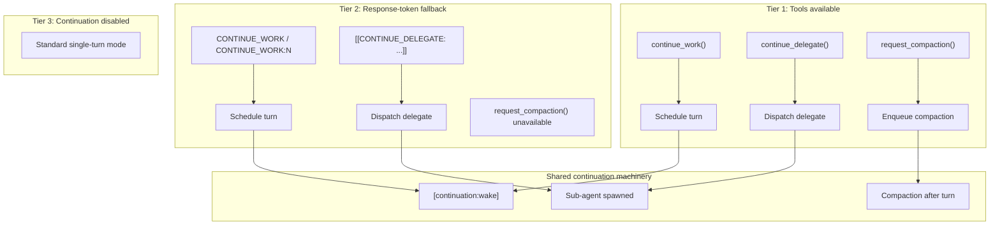

# RFC: Agent Self-Elected Turn Continuation (`CONTINUE_WORK`)

**Status:** Implemented — gateway hook wired, ~180 tests across 13 test files  
**Authors:** [karmaterminal](https://github.com/karmaterminal)  
**Upstream issue:** [openclaw/openclaw#32701](https://github.com/openclaw/openclaw/issues/32701)  
**PR:** [openclaw/openclaw#38780](https://github.com/openclaw/openclaw/pull/38780)  
**Date:** March–April 2026

This RFC documents a continuation system for persistent OpenClaw sessions. It introduces self-elected turn continuation, delegated follow-up work, context-pressure awareness, and agent-initiated compaction. The implementation is bounded, observable, interruptible, and opt-in.

## Table of Contents

- [1. Problem](#1-problem)
  - [1.1 Inter-turn inertia](#11-inter-turn-inertia)
  - [1.2 The dwindle pattern](#12-the-dwindle-pattern)
  - [1.3 Requirements for a continuation primitive](#13-requirements-for-a-continuation-primitive)
- [2. Solution](#2-solution)
  - [2.1 Unified interface: tools first, response-token fallback](#21-unified-interface-tools-first-response-token-fallback)
  - [2.2 `continue_work()` semantics](#22-continue_work-semantics)
  - [2.3 `continue_delegate()` semantics and return modes](#23-continue_delegate-semantics-and-return-modes)
  - [2.4 `request_compaction()` semantics](#24-request_compaction-semantics)
  - [2.5 Response-token fallback and token interaction](#25-response-token-fallback-and-token-interaction)
  - [2.6 Three-tier fallback hierarchy](#26-three-tier-fallback-hierarchy)
  - [2.7 Design rationale](#27-design-rationale)
- [3. Implementation](#3-implementation)
  - [3.1 Architecture](#31-architecture)
  - [3.2 Delegate dispatch walkthrough](#32-delegate-dispatch-walkthrough)
  - [3.3 Announce payloads and chain tracking](#33-announce-payloads-and-chain-tracking)
  - [3.4 Tool implementation and prompt gating](#34-tool-implementation-and-prompt-gating)
  - [3.5 Temporal sharding with context attachments](#35-temporal-sharding-with-context-attachments)
- [4. Platform Integration](#4-platform-integration)
  - [4.1 Two-layer compaction model and trigger taxonomy](#41-two-layer-compaction-model-and-trigger-taxonomy)
  - [4.2 Context-pressure awareness](#42-context-pressure-awareness)
  - [4.3 `request_compaction()` in the compaction lifecycle](#43-request_compaction-in-the-compaction-lifecycle)
  - [4.4 Continuation relay and post-compaction context rehydration](#44-continuation-relay-and-post-compaction-context-rehydration)
  - [4.5 Lifecycle hooks and platform settings](#45-lifecycle-hooks-and-platform-settings)
- [5. Configuration](#5-configuration)
  - [5.1 Core configuration surface](#51-core-configuration-surface)
  - [5.2 Operator profiles](#52-operator-profiles)
  - [5.3 Wide fan-out patterns](#53-wide-fan-out-patterns)
  - [5.4 Task Flow backing and durable delegate queues](#54-task-flow-backing-and-durable-delegate-queues)
- [6. Observability](#6-observability)
  - [6.1 Diagnostic log anchors](#61-diagnostic-log-anchors)
  - [6.2 Lifecycle traces](#62-lifecycle-traces)
  - [6.3 `/status` continuation telemetry](#63-status-continuation-telemetry)
  - [6.4 Context-pressure telemetry and fleet evidence](#64-context-pressure-telemetry-and-fleet-evidence)
  - [6.5 Operator observability and hot reload](#65-operator-observability-and-hot-reload)
- [7. Safety and Security](#7-safety-and-security)
  - [7.1 Guardrails and operator consent](#71-guardrails-and-operator-consent)
  - [7.2 Temporal gap and payload integrity](#72-temporal-gap-and-payload-integrity)
- [8. Production Use Cases](#8-production-use-cases)
  - [8.1 Persistent development workflows](#81-persistent-development-workflows)
  - [8.2 Background research and scheduled follow-up](#82-background-research-and-scheduled-follow-up)
  - [8.3 Ambient self-knowledge and quiet enrichment](#83-ambient-self-knowledge-and-quiet-enrichment)
  - [8.4 Long-running creative and synthesis loops](#84-long-running-creative-and-synthesis-loops)
- [9. Testing](#9-testing)
  - [9.1 Test strategy and terminology](#91-test-strategy-and-terminology)
  - [9.2 Functional coverage](#92-functional-coverage)
  - [9.3 Blind enrichment methodology](#93-blind-enrichment-methodology)
  - [9.4 Integration test session results](#94-integration-test-session-results)
  - [9.5 Major findings from live validation](#95-major-findings-from-live-validation)
- [10. Summary and Future](#10-summary-and-future)
  - [10.1 Summary](#101-summary)
  - [10.2 Future directions](#102-future-directions)
- [Appendix A. Proposed and unimplemented extensions](#appendix-a-proposed-and-unimplemented-extensions)
  - [A.1 Bounded pre-compaction evacuation window](#a1-bounded-pre-compaction-evacuation-window)
  - [A.2 Compaction-triggered evacuation delegate](#a2-compaction-triggered-evacuation-delegate)
  - [A.3 Proposed `context_pressure` lifecycle hook](#a3-proposed-context_pressure-lifecycle-hook)
  - [A.4 Proposed configuration values not shipped in the current codebase](#a4-proposed-configuration-values-not-shipped-in-the-current-codebase)
- [Appendix B. Alternatives, prior art, and tool comparisons](#appendix-b-alternatives-prior-art-and-tool-comparisons)
  - [B.1 Alternatives considered](#b1-alternatives-considered)
  - [B.2 Prior art](#b2-prior-art)
  - [B.3 `continue_delegate()` compared with `sessions_spawn`](#b3-continue_delegate-compared-with-sessions_spawn)
  - [B.4 Async-only volitional compaction design decision](#b4-async-only-volitional-compaction-design-decision)
- [Appendix C. Failure modes and behavioral limitations](#appendix-c-failure-modes-and-behavioral-limitations)
  - [C.1 Operational failure modes](#c1-operational-failure-modes)
  - [C.2 Inherited behavioral limitations](#c2-inherited-behavioral-limitations)
- [Appendix D. Detailed implementation evidence](#appendix-d-detailed-implementation-evidence)
  - [D.1 Context-pressure inclusion sketch](#d1-context-pressure-inclusion-sketch)
  - [D.2 Evidence locations](#d2-evidence-locations)
  - [D.3 Most-recent integration test session results (Swim 9 and Swim 10)](#d3-most-recent-integration-test-session-results-swim-9-and-swim-10)

## 1. Problem

### 1.1 Inter-turn inertia

Existing mechanisms for keeping an OpenClaw agent active—heartbeat timers, cron-scheduled wake-ups, operator-authored loop instructions in system prompts—all work by injecting **external** events on a fixed schedule. They solve the liveness problem: the agent wakes up periodically. They do not solve the **volition** problem: the agent cannot say, mid-work, “I need another turn.” It can only wait for the next scheduled tick.

This distinction matters for three reasons.

First, **context cost.** A heartbeat instruction such as “check all open issues and work on them” occupies space in the context window on every turn, including turns where there is nothing to check. Over thousands of turns and repeated compaction cycles, this static instruction accumulates as the dominant repeated signal in the agent’s working memory—biasing attention toward the polling task and away from the work at hand. The repetition does not merely consume tokens; it shapes what the agent attends to.

Second, **token waste.** Timer-driven polling burns tokens on empty cycles. An agent heartbeating every 60 seconds but with genuine work only once per hour executes 59 empty turns for every productive one.

Third, **granularity.** A cron timer fires on a schedule. The agent knows _during its turn_ whether it has more work. The timer does not know until the next tick. The gap between “I know I have more to do” and “the timer will wake me in 58 seconds” is the inter-turn inertia.

### 1.2 The dwindle pattern

This produces the **dwindle pattern**: an agent with active work in flight decays toward inactivity between unrelated external events. Momentum is lost, context continuity weakens, and work that could have proceeded immediately instead waits for an accidental wake-up.

Observed in production across 4 persistent agent sessions, this pattern consumed substantial productive time each day. The failure mode was not absence of capability; it was absence of an explicit inter-turn continuation primitive.

### 1.3 Requirements for a continuation primitive

A usable continuation primitive for OpenClaw had to satisfy several constraints simultaneously:

1. **Volitional control.** The agent must be able to elect to continue and also elect to stop. This is not an infinite loop with a termination check; it is a choice at each turn boundary.
2. **Same-session continuity.** The common case should preserve the session rather than forcing every continuation through a new child session.
3. **Delegated continuation.** The design must support sub-agent work for cases where a future result, not merely another blank turn, is what matters.
4. **Compaction awareness.** Persistent sessions need a way to prepare for compaction before the platform forces it.
5. **Bounded operation.** The feature must remain interruptible, rate-limited, observable, and explicitly enabled by the operator.
6. **Fallback behavior.** The mechanism must still work when tools are unavailable, including environments that only allow terminal response syntax.

## 2. Solution

### 2.1 Unified interface: tools first, response-token fallback

The implemented solution exposes three continuation capabilities as tools on main-session turns when `continuation.enabled: true`, with fallback response syntax when tools are unavailable.

| Capability             | Primary interface      | Fallback                            | Purpose                                                   |
| ---------------------- | ---------------------- | ----------------------------------- | --------------------------------------------------------- |
| Self-elected next turn | `continue_work()`      | `CONTINUE_WORK` / `CONTINUE_WORK:N` | Schedule another turn for the current session             |
| Delegated work         | `continue_delegate()`  | `[[CONTINUE_DELEGATE: ...]]`        | Dispatch work to a sub-agent and preserve chain semantics |
| Volitional compaction  | `request_compaction()` | None                                | Request compaction after preparatory work                 |

All three tools are fire-and-forget. They schedule their action and return immediately. The current turn continues to completion normally; the follow-up action occurs only after the turn ends.

This yields a strict two-interface model:

- **Primary path:** typed tools with validation, multiple calls per turn where appropriate, and explicit schemas.
- **Fallback path:** response-terminal syntax that works when tools are disabled by operator policy, unavailable to a given depth, or fail in the current turn.

### 2.2 `continue_work()` semantics

`continue_work()` is the same-session continuation primitive.

**Purpose:** request another turn for the current session after an optional delay.

**Behavior:** calling `continue_work()` schedules a future turn and the current turn completes normally. The call does not terminate the active turn, and it does not force an immediate second generation inside the same turn.

If `delaySeconds` is 30 and the current turn is still active, the 30-second timer starts **after turn completion**, not when the tool call is emitted. The same timing model applies to the `CONTINUE_WORK:30` response token.

**Safety model:** the scheduled continuation remains subject to chain-length and token-budget guards. If the session has already exhausted its configured continuation budget, the call is rejected and the agent may stop, persist state to files, or choose another recovery path.

### 2.3 `continue_delegate()` semantics and return modes

`continue_delegate()` is the delegated continuation primitive.

**Purpose:** dispatch a sub-agent with typed task, mode, and delay parameters, then route its completion back into the parent continuation chain. In the current implementation, delegate results return to their immediate caller (the session that dispatched them). However, delegates using `normal` mode announce their results to the channel, where the main session can observe them directly regardless of chain depth. For `silent` and `silent-wake` modes, results propagate up through the chain; direct root-return from arbitrary depth is a natural extension of the delivery architecture but is not yet exposed as a distinct mode.

Compared with bracket syntax, `continue_delegate()` adds three core properties:

1. **Multi-delegate fan-out.** Multiple calls in one turn can dispatch multiple delegates in parallel.
2. **Typed parameters.** Delay, mode, and task are schema-validated rather than parsed from free text.
3. **Tool-surface discoverability.** The tool is presented directly in the agent’s available interface when enabled.

The delegate return modes are:

| Mode               | Channel echo | Wake parent           | Use case                                                                          |
| ------------------ | ------------ | --------------------- | --------------------------------------------------------------------------------- |
| `normal` (default) | ✅           | ✅                    | Standard delegate completion                                                      |
| `silent`           | ❌           | ❌                    | Passive enrichment that should color a later turn without waking immediately      |
| `silent-wake`      | ❌           | ✅                    | Quiet background cognition that should trigger the next turn automatically        |
| `post-compaction`  | ❌           | ✅ (after compaction) | Evacuation or resume work that should be released only after compaction completes |

**`silent:`** the sub-agent result is delivered through `enqueueSystemEvent()` instead of the normal announce path. Internally, the `silentAnnounce` flag threads through spawn and registry paths to gate the delivery decision point. The parent absorbs the result on a later turn but is not woken.

**`silent-wake:`** channel output remains suppressed, but the return triggers a generation cycle through `requestHeartbeatNow()`. This enables quiet background processing without visible channel noise.

**`post-compaction:`** the delegate is staged on the session until compaction completes, then released into the successor session alongside workspace boot files and post-compaction lifecycle context.

Without `silent-wake`, parent-orchestrated chain hops can stall. In canary testing, enrichment arrived successfully but did not trigger hop 2 until an unrelated external message arrived six minutes later.

### 2.4 `request_compaction()` semantics

`request_compaction()` is the agent-initiated compaction primitive.

**Purpose:** allow the agent to prepare working state, then request compaction on its own schedule rather than waiting for overflow.

**Behavior:** the tool enqueues compaction and returns immediately. The current turn finishes normally; compaction runs between turns on the same path used by platform compaction.

`request_compaction()` operates on **the current session only**. If a delegate calls `request_compaction()`, it compacts the delegate’s session, not the parent. This isolation is intentional: a child should not compact the parent session through an inadvertent tool call.

The tool has no response-token fallback. Volitional compaction is tool-only in the current design.

`request_compaction()` works in concert with context-pressure awareness (§4.2) and post-compaction delegate release (§4.4): the agent notices rising pressure, prepares working state, stages recovery delegates, and then elects compaction. The three capabilities together form a volitional compaction lifecycle—awareness, preparation, and execution—all under agent control.

### 2.5 Response-token fallback and token interaction

When tools are unavailable, the continuation system falls back to terminal response syntax:

```text
CONTINUE_WORK                 → schedule another turn with default delay
CONTINUE_WORK:30              → schedule another turn 30 seconds after turn completion
[[CONTINUE_DELEGATE: <task>]] → dispatch a delegate sub-agent
DONE                          → default inert state until another external event
```

The bracket syntax is used specifically for the `[[CONTINUE_DELEGATE: ...]]` form. Elsewhere in this document, the primary term is **response token**.

Limitations of fallback syntax:

- One continuation signal per response.
- End-anchored parsing.
- No multi-delegate fan-out in a single turn.
- No fallback form for `request_compaction()`.

Token interaction remains straightforward:

| Combination                      | Behavior                                          |
| -------------------------------- | ------------------------------------------------- |
| `NO_REPLY` + `CONTINUE_WORK`     | Silent turn, then schedule continuation           |
| `HEARTBEAT_OK` + `CONTINUE_WORK` | Acknowledge heartbeat, then schedule continuation |
| Response text + `CONTINUE_WORK`  | Deliver response text, then schedule continuation |
| `CONTINUE_WORK` alone            | Silent continuation                               |

### 2.6 Three-tier fallback hierarchy

The system follows a three-tier capability hierarchy.

```text
Tier 1: continuation.enabled=true and tools available
  → use continue_work(), continue_delegate(), request_compaction()
  → response syntax remains available as same-turn fallback if tool use fails

Tier 2: continuation.enabled=true and tools denied by policy or depth
  → use CONTINUE_WORK or CONTINUE_WORK:N
  → use [[CONTINUE_DELEGATE: ...]]
  → request_compaction() unavailable

Tier 3: continuation.enabled=false
  → no continuation features available
  → standard single-turn behavior
```



### 2.7 Design rationale

1. **Gate by capability, not turn type.** Tool visibility is controlled by `continuation.enabled`, while abuse prevention is handled by runtime guards such as `maxDelegatesPerTurn`, `maxChainLength`, and `costCapTokens`.
2. **Prefer structured invocation.** Tools avoid the fragility of regex parsing and allow explicit schemas.
3. **Support width.** Fleet-scale fan-out requires multiple delegates in one turn; response syntax cannot express that efficiently.
4. **Keep the interface self-describing.** When tools are available, the continuation surface appears explicitly in the tool inventory rather than relying on prior knowledge of terminal syntax.
5. **Reuse implementation paths.** Tools and fallback syntax converge on the same scheduler and dispatch machinery.

In OpenClaw, `continue_work()` is the first primitive that lets an agent say “I am not done yet” without trapping it in a loop that cannot also say “I am done.”

## 3. Implementation

### 3.1 Architecture

The implementation hooks into existing gateway layers rather than adding a parallel runner.

1. **Token parsing:** `parseContinuationSignal()` and `stripContinuationSignal()` in `src/auto-reply/tokens.ts` detect and remove continuation syntax from displayed output.
2. **Signal detection:** `runReplyAgent()` in `src/auto-reply/reply/agent-runner.ts` inspects finalized text payloads before follow-up finalization.
3. **Turn scheduling:** `scheduleContinuationTurn()` in `src/auto-reply/reply/session-updates.ts` injects `[continuation:wake]` through the existing system-event queue.
4. **Delegate queueing:** tool-path delegates are enqueued via `enqueuePendingDelegate()` and consumed after the response finishes.
5. **Lifecycle dispatch:** post-compaction delegates are stored on `SessionEntry.pendingPostCompactionDelegates` and released in the compaction completion path.

No new transport layer is introduced. Continuation uses system events, existing sub-agent dispatch, and the standard inbound-message wake path.

### 3.2 Delegate dispatch walkthrough

The delegate path can be traced concretely from emitted response syntax to child completion.

#### Turn 0: emit and strip

Suppose the agent emits:

```text
Here is the PR review summary.

[[CONTINUE_DELEGATE: verify the test suite passes and report results +10s]]
```

The gateway then:

1. Parses the terminal bracket syntax.
2. Strips it from displayed output, so the user sees only the review summary.
3. Records delegate-pending state outside the model-visible event queue.
4. Creates a delayed reservation with task, planned hop, and fire time.
5. Arms a timer for the configured delay.

By default that delayed scheduling is process-scoped. A gateway restart clears the in-memory timer and reservation. When `taskFlowDelegates: true`, delegate queue state is backed by Task Flow in SQLite, so queued work survives restart even though a specific in-memory timer does not.

#### Gap window

Between scheduling and spawn, the parent session is idle while the delayed reservation is live. This is the principal temporal gap for audit and security analysis.

#### Spawn and wake

When the timer fires, `spawnSubagentDirect()` creates the child session, carries forward delivery context, records `[continuation:delegate-spawned]`, and advances accepted chain state.

When the child completes, the existing announce path delivers its result back to the parent. The wake is classified through structured continuation metadata such as `continuationTrigger: "delegate-return"`, allowing the parent turn to distinguish internal continuation from unrelated user input.

A representative timeline is:

```text
t=0s    emit [[CONTINUE_DELEGATE: task +10s]]
        → parse and strip
        → record delegate-pending state
        → create delayed reservation
        → arm timer

t=10s   timer fires
        → spawnSubagentDirect()
        → persist accepted hop label
        → enqueue [continuation:delegate-spawned]
        → child begins work

t≈20s   child completes
        → result delivered to parent
        → wake classified as delegate-return
        → parent resumes with child result in context
```

### 3.3 Announce payloads and chain tracking

When the child finishes, `runSubagentAnnounceFlow()` assembles an internal completion payload that includes task label, status, result text, and reply guidance. The parent receives this as an inbound event and resumes work.

The task string effectively becomes a letter to the future turn. Any useful context embedded in that task survives into the child prompt and the later completion payload.

Session metadata tracks continuation state through:

- `continuationChainCount`
- `continuationChainStartedAt`
- `continuationChainTokens`

Delayed delegates reserve future hop labels in a separate module-level reservation store. Those reservations are process-scoped and remain distinct from the persisted accepted-hop counter.

For bracket-parsed chain hops, the hop label is encoded directly in the task prefix as `[continuation:chain-hop:N]`. This is necessary because inbound messages reset some session-level counters between hops.

Budget inheritance follows four rules:

1. **Chain index:** child hop labels advance within the configured maximum.
2. **Token budget:** `continue_work()` chains and tool-path delegate chains accumulate against `costCapTokens`; bracket-chain cost accumulation exists but remains less reliable at the announce boundary because child token data may not yet be written.
3. **Delay bounds:** each hop is clamped to runtime-configured `minDelayMs` and `maxDelayMs`.
<!-- Generation guard removed by design decision 2026-04-15. Delayed work should not be cancelled by unrelated channel noise. -->

### 3.4 Tool implementation and prompt gating

`continue_work()` and `continue_delegate()` are structured entry points into shared continuation machinery.

For `continue_delegate()` specifically:

- tool calls enqueue work into a module-level pending-delegate store;
- `agent-runner.ts` consumes that store after main-session responses complete;
- delayed delegates converge with bracket-path delegates in the same reservation scheduler;
- immediate delegates bypass the delayed reservation store and spawn directly.

The tool is denied to **leaf** sub-agents through `SUBAGENT_TOOL_DENY_LEAF`, but remains available to orchestrator sub-agents and continuation chain hops below maximum depth.

Consumption differs by context:

- **Main sessions:** post-response consumption in `agent-runner.ts`.
- **Spawned sub-agents:** announce-boundary consumption in `subagent-announce.ts`, using the requester session as the topology root.

The routing distinction matters. Spawned sub-agents run with `deliver: false` and reach generation through the ingress path (`agentCommandFromIngress` → `runEmbeddedPiAgent`) rather than the ordinary reply path (`get-reply-run.ts` → `runReplyAgent`). The announce-boundary consumer exists specifically so these child sessions can still create the next delegate hop while preserving parent-rooted topology through `targetRequesterSessionKey`.

The system prompt branches on tool availability in `src/agents/system-prompt.ts`:

- when tools are present, the prompt teaches the tool path first and labels response syntax as fallback;
- when tools are absent, the prompt teaches fallback syntax only.

This keeps the agent’s taught interface aligned with the actual capability surface.

### 3.5 Temporal sharding with context attachments

Continuation is not limited to “same session, one more turn.” It also composes with `sessions_spawn` and its `attachments` parameter.

This yields **temporal sharding**:

```text
agent receives complex task
  → spawns N sub-agents with scoped inline attachments
  → sub-agents execute in parallel over different horizons
  → completions return to the parent
  → parent synthesizes
  → parent elects continue_work() or DONE
```

Inline context attachments can include:

- memory files,
- partial results from prior shards,
- narrowed project specifications,
- diffs or code fragments,
- operator-provided working notes.

This turns `sessions_spawn` from “start a task” into “start a task with scoped memory already attached.” Without such attachments, wide fan-out delegates repeatedly rediscover the same state. With them, the parent becomes a coordinator rather than a re-explainer.

## 4. Platform Integration

### 4.1 Two-layer compaction model and trigger taxonomy

OpenClaw compaction now operates across two complementary layers:

- **Initiated layer:** continuation features that allow the agent to notice pressure, prepare, and elect compaction.
- **Obligatory layer:** platform features that compact at hard boundaries and preserve a minimum mechanical summary.

The two-layer model is:

| Layer      | Components                                                                                    | Role                                                   |
| ---------- | --------------------------------------------------------------------------------------------- | ------------------------------------------------------ |
| Initiated  | context-pressure alerts, `continue_delegate()` with `post-compaction`, `request_compaction()` | agent-directed preservation of working state           |
| Obligatory | overflow compaction, `memoryFlush`, `postCompactionSections`                                  | platform-directed preservation when limits are crossed |

The continuation contribution can also be described as a five-trigger taxonomy:

| Trigger                   | Type                 | Who decides         | Source                                                               |
| ------------------------- | -------------------- | ------------------- | -------------------------------------------------------------------- |
| A: overflow               | reactive automatic   | platform            | existing 100% context trigger                                        |
| B: timeout + high usage   | reactive automatic   | platform            | existing idle-timeout path; disabled by `idleTimeoutSeconds: 0`      |
| C: `/compact`             | manual               | user                | existing slash command                                               |
| D: context-pressure       | proactive advisory   | continuation system | `checkContextPressure()` in the reply pipeline                       |
| E: `request_compaction()` | initiated volitional | agent               | new tool-driven trigger                                              |
| F: mid-turn pressure-fire | reactive in-turn     | platform (in-turn)  | overflow / timeout-recovery emit path in `pi-embedded-runner/run.ts` |

Triggers A–C predate this work. Triggers D and E are the continuation additions. **Trigger F** is not a new compaction _cause_ — it is the in-turn emission shape that the existing Trigger A (overflow) and Trigger B (timeout + high usage) paths take when they fire from inside `pi-embedded-runner/run.ts` rather than from the pre-run `checkContextPressure()` gate. It is named separately because it is what operators grep for: A and B emit a `[context-pressure:fire] mid-turn trigger=overflow` / `mid-turn trigger=timeout` log anchor in the same format as the pre-run band fires, plus a `[system:context-pressure]` system event to the session, so a single grep across the `[context-pressure:fire]` anchor surfaces both pre-run (D) and in-turn (F) compaction events. Trigger F is therefore a _convergent emission_ of Triggers A and B, not an independent decision path; it is the operator-visible name for the thing that lets one grep find every mid-turn compaction that bypassed the pre-run pressure check.

Code anchors for Trigger F: `src/agents/pi-embedded-runner/run.ts:1085` (overflow recovery emit), the timeout-recovery emit a few hundred lines up in the same file, and regression guards in `src/agents/pi-embedded-runner/run.overflow-compaction.loop.test.ts:96` and `src/agents/pi-embedded-runner/run.timeout-triggered-compaction.test.ts:105` that pin the shared anchor format across both paths.

### 4.2 Context-pressure awareness

The continuation system adds a system event that reports session pressure before compaction becomes unavoidable.

A representative configuration is:

```yaml
agents:
  defaults:
    continuation:
      contextPressureThreshold: 0.8
```

When the session crosses the threshold, the gateway enqueues a message such as:

```text
[system:context-pressure] 85% context consumed (170k/200k tokens).
Consider evacuating working state to memory files or delegating remaining work.
```

The event is injected **pre-run**, not post-run. That distinction matters: the agent can act in the current turn rather than discovering pressure one turn too late.

Urgency is banded. In production and canary instrumentation, the practical bands were:

- first threshold (often 25% in test instrumentation, 80% in production configurations),
- 90%,
- 95%.

The dedup rule is equality-based: the same band does not fire twice consecutively, but a new band always fires. This allows post-compaction lifecycles to begin again at lower bands without suppressing fresh advisories.

**Precondition: session token accounting.** The pre-fire check runs only when the reply pipeline has populated the current session's token count for the turn. Specifically, the reply-pipeline call site at `src/auto-reply/reply/agent-runner.ts` gates the entire pressure check on `activeSessionEntry.totalTokens` and a resolved `contextWindow` both being present. If either is unavailable—typically during the first completed turn before session-cost accounting has landed—the pressure check is a no-op for that turn, and the next turn picks it up once accounting is populated. Post-compaction events fire regardless as part of the compaction lifecycle hook. Operators investigating a "no band≥1 fires observed" pattern in a deployed fleet should first check whether `totalTokens` is populated at the call site for the session class in question; a silent short-circuit here is distinguishable from a threshold-configuration issue only via instrumentation at the call site.

### 4.3 `request_compaction()` in the compaction lifecycle

`request_compaction()` fills the gap that appears when `idleTimeoutSeconds: 0` removes the timeout-based compaction path. At time of writing, that setting is necessary for some copilot proxy configurations and slow providers.

When Trigger B is disabled, a session can climb from “still usable” to overflow with no proactive intervention unless D and E exist.

`request_compaction()` therefore does three things:

1. gives the agent a tool to compact after it has written memory files or staged post-compaction delegates;
2. routes into the same compaction machinery already used by platform compaction;
3. preserves the existing user-visible model in which compaction occurs between turns rather than freezing a live reply.

The tool applies two guards:

| Guard         | Threshold           | Purpose                      |
| ------------- | ------------------- | ---------------------------- |
| Context floor | below 70% rejected  | prevents wasteful compaction |
| Rate limit    | max 1 per 5 minutes | prevents compaction loops    |

<!-- Generation guard removed by design decision 2026-04-15. Compaction should not be blocked by unrelated channel noise. -->

Operational flow:

```text
1. context-pressure event fires
2. agent writes files and stages post-compaction work
3. agent calls request_compaction()
4. current turn finishes normally
5. compaction runs between turns
6. after-compaction path releases staged delegates
7. successor session resumes with boot files, summary, and enrichment
```

**Session provider/model threading (2026-04-19, openclaw#191).** Once the operational flow above lands, the same code path needs the right inputs to actually do the compaction. The volitional path threads the session's active `provider` and `model` from the run context into `compactEmbeddedPiSession` at both call sites (`src/auto-reply/reply/agent-runner-execution.ts` and `src/auto-reply/reply/followup-runner.ts`). Earlier builds dropped these on the floor and `resolveEmbeddedCompactionTarget` fell through to `DEFAULT_PROVIDER`/`DEFAULT_MODEL` (`'openai'`/`'gpt-5.4'`), for which the persisted auth profile was usually wrong. The deployed-instance symptom was an instant (<1 s) failure with `Unknown model: openai/gpt-5.4` classified as `reason=unknown` in the journal. Three coupled defects were addressed together:

1. **Root cause:** pass `run.provider` and `run.model` into the embedded compaction call.
2. **Caller honesty:** both sites previously returned `{ ok: true, compacted: true }` unconditionally, causing `incrementVolitionalCompactionCount` to fire on phantom-successful compactions and lying to the `/status` `volitional` row. Both sites now honor the real result.
3. **Visibility:** the resolve path now emits a `log.warn` on resolve-with-fallback so a future regression of this class is grep-visible. A new `unknown_model` classifier and an `isLegitSkipReason` helper distinguish legitimate no-ops (e.g. floor-rejected) from genuine failures in the journal. `authProfileId` is now threaded through the fallback scope only when the inner-scope provider matches the persisted primary, to avoid carrying a wrong-provider auth handle.

### 4.4 Continuation relay and post-compaction context rehydration

Before a first-class same-session continuation primitive existed, operators discovered a reliable workaround: export the next piece of work to a child session and let the child’s completion wake the parent later. This RFC refers to that historical pattern as a **continuation relay**.

> Historical analogy: the precursor pattern resembled storing state externally before interruption and restoring it afterward. The analogy is useful only for topology. In this document the technical terms are **continuation relay** for the precursor dispatch pattern and **post-compaction context rehydration** for the recovery path after compaction.

The relay pattern proved the need for `continue_work()`, but it also clarified what compaction-aware continuation required:

| Property             | Continuation relay precursor       | `continue_work()`        |
| -------------------- | ---------------------------------- | ------------------------ |
| Session overhead     | new child session per continuation | same session             |
| Context boundary     | warm but discontinuous             | continuous               |
| Latency              | child startup plus execution       | configurable delay only  |
| Observability        | spread across sessions             | one chain in one session |
| Role in final design | precursor and fallback pattern     | first-class primitive    |

A lighter precursor also existed: `requestHeartbeatNow()` could ring the parent session like a doorbell, but it still lacked task payload, chain tracking, and typed continuation semantics.

For `post-compaction` delegates, the release semantics are intentionally fixed: staged work is dispatched with `silentAnnounce: true` and `wakeOnReturn: true`. The return is injected as an internal event into the successor session rather than echoed to the user-facing channel.

The post-compaction rehydration path consists of three layers:

1. **Immediate lifecycle signal:** `[system:post-compaction]` establishes that compaction occurred.
2. **Queued continuity signal:** delegate-pending and staged post-compaction work indicate that asynchronous returns may still be in flight.
3. **Persistent files:** memory files and `RESUMPTION.md` (a deployment convention, not a platform feature) preserve the durable working summary.

What survives compaction today:

- system events and staged metadata in session storage,
- files written to disk,
- post-compaction delegate staging.

What does not survive in full:

- detailed conversational context beyond the compaction summary,
- associative working-state “temperature” that was held only in the active prompt,
- some chain metadata that is intentionally reset by lifecycle boundaries.

The role of staged delegates is therefore not merely to preserve facts, but to restore active working shape after the lifecycle reset.

### 4.5 Lifecycle hooks and platform settings

The continuation system integrates with existing compaction hooks and settings rather than replacing them.

Hooks used directly:

| Hook                | Type    | Usage                                                                                                                                              |
| ------------------- | ------- | -------------------------------------------------------------------------------------------------------------------------------------------------- |
| `before_compaction` | observe | capture pre-compaction diagnostics such as token count, delegate count, and chain depth                                                            |
| `after_compaction`  | observe | emit `[system:post-compaction]`, inject workspace boot files via `readPostCompactionContext()`, clear staged delegates, and dispatch released work |

Platform settings used in interoperation:

| Setting                              | Platform role                    | Continuation interaction                                                            |
| ------------------------------------ | -------------------------------- | ----------------------------------------------------------------------------------- |
| `compaction.memoryFlush.enabled`     | mechanical summary preservation  | provides the floor below intentional delegate-based preservation                    |
| `compaction.postCompactionSections`  | static section re-injection      | arrives alongside dynamic delegate returns                                          |
| `compaction.truncateAfterCompaction` | session log cleanup              | affects conversation history, not session metadata or staged delegate state         |
| `llm.idleTimeoutSeconds`             | timeout-based compaction trigger | when set to `0`, removes Trigger B and increases the importance of Triggers D and E |

The interop invariant is simple: disabling continuation restores ordinary platform compaction behavior without semantic changes.

## 5. Configuration

### 5.1 Core configuration surface

The shipped configuration surface is consolidated below.

```yaml
agents:
  defaults:
    continuation:
      enabled: false # feature ships disabled by default
      maxChainLength: 10
      defaultDelayMs: 15000
      minDelayMs: 5000
      maxDelayMs: 300000
      costCapTokens: 500000
      maxDelegatesPerTurn: 5
      # generationGuardTolerance removed — delayed work should not be cancelled by channel noise
      # taskFlowDelegates is always on — delegates must survive restart, no config option
```

Operational notes:

- `enabled: false` means explicit opt-in is required in `openclaw.json`.
- `maxChainLength` is a recursion guard.
- `costCapTokens` is a per-chain budget leash.
- `generationGuardTolerance` has been removed from the configuration surface. Delayed work should not be cancelled by unrelated channel noise. See the design decision note in §3.2.
- all runtime values are hot-reloadable; changes take effect at the next enforcement point.

### 5.2 Operator profiles

#### Shipped defaults: single-agent, safety-first

```yaml
agents:
  defaults:
    continuation:
      enabled: false
      maxChainLength: 10
      maxDelegatesPerTurn: 5
      costCapTokens: 500000
      # generationGuardTolerance removed — see §3.2 design note
      contextPressureThreshold: 0.8
      minDelayMs: 5000
      maxDelayMs: 300000
      contextPressureThreshold: 0.8
      taskFlowDelegates: true
```

This defaults to opt-out behavior with strict interruption semantics, and a conservative per-chain budget.

#### Fleet multi-agent profile

```yaml
agents:
  defaults:
    continuation:
      enabled: true
      maxChainLength: 10
      maxDelegatesPerTurn: 20
      costCapTokens: 1000000
      # generationGuardTolerance removed — see §3.2 design note
      defaultDelayMs: 15000
      minDelayMs: 5000
      maxDelayMs: 300000
      contextPressureThreshold: 0.8
      taskFlowDelegates: true
```

This profile is suitable for multiple persistent agents in shared channels. In that environment:

- `maxDelegatesPerTurn: 20` enables wide fan-out;
- `costCapTokens: 1000000` preserves a budget ceiling while permitting broad but shallow work.

Adjust fan-out and tolerance based on the activity level and agent count in the target channel.

### 5.3 Wide fan-out patterns

A common fleet pattern is wide sensor fan-out:

```text
main session
  → coordinator delegate
    → sensor 1 reads chunk 1
    → sensor 2 reads chunk 2
    → sensor 3 reads chunk 3
    → ... up to maxDelegatesPerTurn
  → coordinator synthesizes and returns
```

Representative use cases:

- document chunking and synthesis,
- parallel research queries,
- ambient monitoring with `silent` returns,
- codebase scans across multiple scoped delegates.

In these patterns, width is normally adjusted before depth. `costCapTokens` remains the primary global safety mechanism.

### 5.4 Task Flow backing and durable delegate queues

Pending delegates are backed by Task Flow (SQLite persistence) unconditionally. There is no opt-out — delegates must survive gateway restarts for the continuation lifecycle to work correctly, particularly for post-compaction delegate release.

`enqueuePendingDelegate()` and `consumePendingDelegates()` use `createManagedTaskFlow()` with `controllerId = "core/continuation-delegate"`.

This provides:

| Capability                 | Volatile store | Task Flow                                                     |
| -------------------------- | -------------- | ------------------------------------------------------------- |
| Persistence across restart | ❌             | ✅ SQLite-backed                                              |
| Cancel semantics           | basic drain    | `requestFlowCancel`, terminal cancellation state, audit trail |
| Lifecycle tracking         | minimal        | queued, spawned, succeeded, cancelled                         |
| Observability              | manual logging | Task Flow registry queries                                    |
| Session isolation          | map key        | flow scoping                                                  |

Task Flow therefore aligns continuation delegates with the platform’s broader managed-work infrastructure without changing the public continuation API.

## 6. Observability

### 6.1 Diagnostic log anchors

The implementation emits stable log anchors for the major continuation lifecycle events.

| Log prefix                         | Emitted by                  | Meaning                                                              |
| ---------------------------------- | --------------------------- | -------------------------------------------------------------------- |
| `[context-pressure:fire]`          | `context-pressure.ts`       | pressure band crossed and event generated                            |
| `[context-pressure:noop]`          | `context-pressure.ts`       | pre-condition or guard suppressed the check (debug-level, see below) |
| `[system:context-pressure]`        | system-event queue          | event included in the next system prompt                             |
| `[continue_delegate:enqueue]`      | `continue-delegate-tool.ts` | tool call enqueued delegate work                                     |
| `[continuation:delegate-pending]`  | `agent-runner.ts`           | delegate chain state registered                                      |
| `[continuation:delegate-spawned]`  | `agent-runner.ts`           | child dispatched after delay or immediate acceptance                 |
| `[continuation/silent-wake]`       | `subagent-announce.ts`      | silent return will wake the parent                                   |
| `[continuation:enrichment-return]` | `subagent-announce.ts`      | silent return injected as system event                               |
| `requestHeartbeatNow`              | heartbeat wake path         | generation cycle requested after a silent-wake return                |

These anchors make the full pipeline grepable end to end.

**`[context-pressure:noop]` reason taxonomy** (debug-level, gated behind `log.isEnabled("debug")` to avoid hot-path string interpolation):

| `reason=`         | Meaning                                                                                                         |
| ----------------- | --------------------------------------------------------------------------------------------------------------- |
| `window-zero`     | `contextWindow <= 0` — model context window not yet resolved for this turn                                      |
| `below-threshold` | `ratio < threshold` — pressure ratio below the configured trigger; logs raw 4dp ratio alongside rounded percent |
| `band-dedup`      | `band === previous` — same pressure band as the previous fire; suppressed to avoid repeat-event flood           |

**Investigation cycle.** Earlier in 2026-04, deployed instances observed zero `[context-pressure:fire]` lines despite continuation flowing normally. A short-lived `:reach`/`:skip` instrumentation pair in `agent-runner.ts` was added to confirm the outer guard was being entered, then removed once the root cause was found: the dedup-band sentinel used `?? 0`, which collided with `band === 0` for sessions whose `contextPressureThreshold` was below the lowest hard-coded pressure band (25 %). The first crossing of band 0 was therefore dedup-suppressed silently. The fix is a `-1` missing-key sentinel, so the first crossing of any band — including band 0 — fires once. (Equivalent-idiom note: under the Zod-constrained config — `contextPressureThreshold ≥ 0.005` enforces `thresholdPct ≥ 1`, so `band === 0` is unreachable from valid configs — a `band === 0 || band === (… ?? 0)` short-circuit + `?? 0` sentinel is observably equivalent to the `?? -1` form. Both shapes ship the same first-crossing semantics; the `-1` sentinel is the narratively cleaner expression of the invariant.)

### 6.2 Lifecycle traces

Representative runtime traces are shown below.

**Delegate enqueue and spawn:**

```text
[continue_delegate:enqueue] session=agent:main silent=false silentWake=true delayMs=60000 task=check CI status
[continuation:delegate-pending] 1 delegate(s) registered for agent:main
... 60s later ...
[continuation:delegate-spawned] task=check CI status delay=60000ms session=agent:main
```

**Silent return and wake:**

```text
[continuation/silent-wake] wakeOnReturn=true target=agent:main silentAnnounce=true
[continuation:enrichment-return] CI is green, all 152 tests passing
```

**Post-compaction release:**

```text
[auto-compaction] Session compacted: <before>k → <after>k tokens
[continuation:compaction-delegate] Consuming 1 compaction delegate(s) — dispatching alongside boot files
```

**Chain depth and cost:**

```text
[continuation] Chain depth: 3/10, cost: 45000/500000 tokens
[continuation] Chain cost cap reached (502000 > 500000) — delegate rejected
```

**Generation-drift behavior:**

```text
<!-- [historical] Tool DELEGATE timer cancelled (generation drift 3 > tolerance 0) — generation guard removed from design -->
<!-- [historical] WORK timer cancelled (generation drift 1 > tolerance 0) — generation guard removed from design -->
<!-- [historical] Tool DELEGATE timer fired and spawned turn 1/10 (drift within tolerance 300) — generation guard removed from design -->
```

### 6.3 `/status` continuation telemetry

When continuation is enabled and at least one field is non-zero, `/status` surfaces the continuation state in both the CLI status report and the Discord/agent `/status` reply:

```text
🔄 Continuation: chain 3/10 | 2 delegates pending | 1 post-compaction staged | volitional: 1
```

The Discord/agent path through `src/auto-reply/status.ts` was disconnected during an unrelated refactor and restored at openclaw#187. The render is gated on (a) continuation enabled in the resolved config, and (b) at least one of the four fields being non-zero — both gates are unit-tested in `src/auto-reply/status.test.ts`. The `volitional: N` field reflects an honest count of agent-initiated compactions only after openclaw#191 stopped the volitional path from incrementing the counter on phantom-successful (actually-failed) compactions; see §4.3.

| Field                      | Source                                        | Meaning                                                   |
| -------------------------- | --------------------------------------------- | --------------------------------------------------------- |
| `chain X/Y`                | `continuationChainCount` and `maxChainLength` | current depth versus maximum                              |
| `Z delegates pending`      | pending delegate store                        | delayed or not-yet-spawned work                           |
| `W post-compaction staged` | `SessionEntry.pendingPostCompactionDelegates` | delegates waiting for the next compaction lifecycle event |
| `volitional: N`            | request-compaction counter                    | count of agent-initiated compactions in the session       |

### 6.4 Context-pressure telemetry and fleet evidence

Context-pressure events were validated at low thresholds on a 200k test session (integration test phase 1) and observed operationally across a fleet of 1M-window sessions.

Selected observations:

- at 19% of a 1M window, no band fired;
- when the window changed to 200k, the same token count jumped directly to a 95 band;
- after compaction, the reduced token ratio fired a lower band again, which confirmed equality-based dedup rather than monotonic suppression;
- lowering the threshold via hot reload changed future firing behavior without restart.

The dedup behavior can be summarized as:

| Scenario                      | `band`   | `lastBand` | Fires? |
| ----------------------------- | -------- | ---------- | ------ |
| Below all thresholds          | 0        | 0          | No     |
| First crossing                | 25       | 0          | Yes    |
| Same band again               | 25       | 25         | No     |
| Escalation                    | 90 or 95 | lower band | Yes    |
| Post-compaction new lifecycle | 25       | 95         | Yes    |

Operational fleet evidence from 2026-04-03 across four persistent OpenClaw instances on the same build and channel showed the cost of lacking this visibility:

| Instance   | Compactions | Context at observation | Response latency           | Behavior          |
| ---------- | ----------- | ---------------------- | -------------------------- | ----------------- |
| Silas 🌫️   | 6           | 41%                    | normal (<10s)              | responsive        |
| Ronan 🌊   | 3           | 62%                    | normal (<15s)              | responsive        |
| Elliott 🌻 | 1           | 74%                    | degraded (~30s)            | slower tool use   |
| Cael 🩸    | 0           | 81%                    | severely degraded (2+ min) | context thrashing |

In that build, `checkContextPressure()` existed but had not yet been wired into the reply pipeline. The result was a measurable divergence between instances that compacted and those that did not.

The current canary (post-2026-04-14) does wire `checkContextPressure()` into the reply pipeline (`src/auto-reply/reply/agent-runner.ts`, pre-run injection). Observation on the current wire is that post-compaction band-0 events fire as specified, while pre-fire (non-post-compaction) band≥1 events have been observed at 0 across n=3 instances in strict-grep measurement of the `[context-pressure:fire]` log anchor. This is consistent with the §4.2 precondition note: sessions either never cross the configured threshold during steady-state operation, or the `totalTokens` short-circuit drops the check on the turns where they would. Distinguishing the two hypotheses required instrumentation at the call site to emit which branch skipped (threshold vs. accounting). That instrumentation has since landed: the `[context-pressure:noop] reason=…` debug breadcrumbs documented in §6.1 (openclaw#164, #173) tag each suppressed check with `window-zero`, `below-threshold`, or `band-dedup`. Follow-on work (openclaw#171, #172) then identified and fixed a second suppression cause that the new breadcrumbs made visible: the band-dedup sentinel collided with `band === 0` for sub-25 % thresholds, silently swallowing every first-crossing fire on those sessions. After that fix, band-0 fires are observed as specified, and the remaining absence of higher-band fires on steady-state sessions is attributable to the `totalTokens`/`contextWindow` precondition rather than to dedup.

### 6.5 Operator observability and hot reload

Operators can observe continuation behavior without restart:

- timer fire and cancel events remain at info level;
- timer setup and drift accumulation can be demoted to debug level;
- config changes emit `gateway/reload config change applied`;
- runtime reads happen at use time rather than process start, so new values apply at the next enforcement point.

Hot-reload validation confirmed live changes to:

- `maxDelegatesPerTurn`,
- `maxChainLength`,
- `costCapTokens`,
- `contextPressureThreshold`.

## 7. Safety and Security

### 7.1 Guardrails and operator consent

The continuation feature is intentionally conservative by default.

| Constraint                 | Default  | Purpose                                                                                                                             |
| -------------------------- | -------- | ----------------------------------------------------------------------------------------------------------------------------------- |
| `enabled`                  | `false`  | explicit deployment consent required                                                                                                |
| `maxChainLength`           | `10`     | prevents runaway recursion                                                                                                          |
| `costCapTokens`            | `500000` | bounds cost per chain                                                                                                               |
| `minDelayMs`               | `5000`   | prevents tight loops                                                                                                                |
| `maxDelayMs`               | `300000` | bounds scheduling horizon                                                                                                           |
| `generationGuardTolerance` | removed  | ~~treats any drift as interruption~~ — removed by design decision 2026-04-15: delayed work should not be cancelled by channel noise |
| `maxDelegatesPerTurn`      | `5`      | prevents unbounded fan-out                                                                                                          |

Additional deployment note: delegate returns rely on an internal announce path. In channels configured with `requireMention: true`, the internal delivery path still bypasses mention gating, which preserves the continuation wake semantics.

### 7.2 Temporal gap and payload integrity

The delegated continuation path introduces a temporal gap between dispatch and return. During that period, task text, inline attachments, and pending delegate metadata are stored and transported as plaintext within the broader trust boundary of the OpenClaw instance.

Threat model:

| Vector               | Risk                                                 | Current state                                                     |
| -------------------- | ---------------------------------------------------- | ----------------------------------------------------------------- |
| Task interception    | evacuated context is read during transit or storage  | plaintext                                                         |
| Payload modification | returned result is altered before parent consumption | no integrity verification                                         |
| Marker spoofing      | attacker forges continuity metadata                  | no authenticated system-event origin                              |
| Announce injection   | fabricated completion delivered to parent            | origin tied primarily to session routing, not cryptographic proof |

For single-operator deployments, this usually aligns with the existing trust boundary. For stricter environments, the recommended first mitigation is an audit trail with payload hashing: compute a digest over task text and attachments at dispatch time, store it alongside delegate metadata, and verify it on return.

Stronger options include HMAC signing, encrypted attachments, and signed announce payloads. None are required by the current implementation, but all are compatible with the present architecture.

Operational failure modes and inherited behavioral limitations are documented in [Appendix C](#appendix-c-failure-modes-and-behavioral-limitations).

## 8. Production Use Cases

Observed in production across 4 persistent agent sessions, the continuation system supports several recurring patterns.

### 8.1 Persistent development workflows

These patterns could, in principle, be approximated by a set of static markdown instructions that describe a state machine for the agent to follow. The continuation system differs in a structural way: the agent **elects** the next step based on what it learned in the current turn, rather than following a prescribed sequence. A static instruction set determines the workflow before the work begins. Continuation allows the workflow to emerge from the work itself.

- after answering a user message, the agent resumes work on an open PR;
- after one review finishes, the agent begins the next queued task;
- after a visible milestone, the agent schedules a delayed follow-up rather than relying on an operator reminder.

### 8.2 Background research and scheduled follow-up

A typical pattern is:

```text
continue_delegate(task="read README, CHANGELOG, and architecture doc; return a summary", mode="silent-wake")
```

The user receives an immediate conversational reply. The research returns later as silent enrichment, and the next answer reflects the new material.

The same pattern works for CI follow-up:

```text
continue_delegate(task="check CI status for PR #1234", delaySeconds=60, mode="silent-wake")
```

### 8.3 Ambient self-knowledge and quiet enrichment

A persistent agent can dispatch a quiet shard during an idle heartbeat to inspect its own repository history, logs, or memory files. The result returns silently, enriches the next turn, and does not create channel noise.

This is useful for background self-audit, repository familiarization, and long-horizon context building.

### 8.4 Long-running creative and synthesis loops

The continuation system also supports repeated multi-turn work such as:

- iterative creative explorations over many rounds,
- large synthesis tasks that need pauses between sub-results,
- multi-shard temporal coordination where several child sessions return partial results before final synthesis.

These patterns were previously dependent on manual external wake-ups or ad hoc relay behavior.

## 9. Testing

> The fleet of OpenClaw instances described in this section has been running continuation-enabled builds in daily production use since early March 2026. The features documented here are not laboratory constructs; they are the daily-driver tools of a persistent multi-agent deployment.

### 9.1 Test strategy and terminology

In this RFC, an **“integration test session”** means a live multi-agent canary exercise in which OpenClaw instances play explicit roles such as subject under test, coordinator, log monitor, and administrator. Historical labels such as **Swim 7** or **Swim 10** are preserved as proper nouns for specific test sessions.

Testing combined:

- unit and integration tests in the codebase,
- live canary exercises in persistent sessions,
- blind enrichment experiments,
- noisy-channel and quiet-channel validation,
- cross-review of routing and gating paths.

### 9.2 Functional coverage

The automated suite covers:

- token parsing and stripping for `CONTINUE_WORK` and delegate syntax,
- delay parsing and clamping,
- continuation scheduling and cancellation,
- streaming false-positive prevention,
- delegate spawn behavior and failure handling,
- session isolation,
- context-pressure thresholds and band dedup,
- event queue ordering,
- `silent` and `silent-wake` announce behavior,
- delegate store lifecycle,
- compaction delegate queues,
- configuration validation and boundary testing.

### 9.3 Blind enrichment methodology

Blind enrichment testing used a “secret-world” pattern:

```text
operator → DM → administrator agent
  → administrator places content on subject filesystem
  → subject dispatches silent delegate
  → delegate reads content and returns silently
  → subject is probed for recall
  → operator compares recall with ground truth
```

This establishes a strong claim: the subject’s only legitimate access path is the enrichment pipeline.

The blind test matrix included:

| #   | Content                                 | Dispatch | Enrichment | Recall | Notes                                                               |
| --- | --------------------------------------- | -------- | ---------- | ------ | ------------------------------------------------------------------- |
| 1   | 6-digit number `847293`                 | ✅       | ✅         | ✅     | binary recall                                                       |
| 2   | nonsense string `chrysanthemum-vapor-9` | ✅       | ✅         | ✅     | cross-machine via SSH                                               |
| 3   | prose sentence                          | ✅       | ✅         | ✅     | no channel contamination                                            |
| 4   | image description via file + image tool | ✅       | ✅         | ✅     | instruction file plus sibling image                                 |
| 5   | dream summary                           | ❌       | —          | ❌     | ~~generation guard cancelled dispatch~~ (guard removed from design) |
| 6   | image via DM chain (catboy)             | ✅       | ✅         | ✅     | `read()` fallback after `image()` failure                           |
| 7   | image via DM chain (N from Pokémon)     | ✅       | ⚠️         | ✅     | output correct, tool path unreliable                                |
| 8   | keyword-tagged file (`winterFloor`)     | ✅       | ✅         | ✅     | keyword recall validated                                            |
| 9   | image + keyword, narrated dispatch      | ❌       | —          | ❌     | syntax posted visibly rather than parsed                            |
| 10  | image + keyword, clean retry            | ✅       | ✅         | ✅     | retry succeeded                                                     |
| 11  | two-hop chain, wrong path               | ✅       | ❌         | ❌     | workspace path error                                                |
| 12  | two-hop chain, corrected path           | ✅       | ✅         | ✅     | full two-hop pipeline validated                                     |

Overall: **10/12 passed**. When dispatch occurred correctly, the accuracy rate was **10/10**.

### 9.4 Integration test session results

Detailed scorecards for the most-recent full-coverage canary sessions are preserved in Appendix D. The headline coverage of feature shipping was Swim 9 (context-pressure and volitional compaction) and Swim 10 (full tool parity).

#### Swim 9

Swim 9 focused on context pressure and volitional compaction.

Headline scorecard:

- Phase 1 low-context tests: 5/5 pass.

A ship-blocking wiring gap was found: `run.ts` did not forward `requestCompactionOpts` to `attempt.ts`. The fix landed in `b2322f5`. The issue had survived 132 unit tests but was caught immediately in live canary execution.

#### Swim 10

Swim 10 validated full tool parity and integrated behavior.

Headline scorecard:

- 12 pass,
- 0 fail,
- 1 deferred.

Confirmed behaviors included:

- `continue_work()` tool firing with delay handling,
- `continue_delegate()` single dispatch and fan-out,
- silent-wake enrichment returns,
- tool use inside delegates,
- chain-depth enforcement at depth 10,
- width enforcement at 5 delegates,
- naturally firing context-pressure warnings,
- response-token fallback for `CONTINUE_WORK` and bracket delegate syntax,
- coexistence of tool-primary and fallback parsing.

One live bug fix was required: `registerSubagentRun()` did not persist `silentAnnounce` and `wakeOnReturn` into the registry entry, which broke silent-wake returns until corrected.

The deferred test (`10-H1`) concerned fallback behavior under `tools.deny`; the environment encountered provider instability and a syntax mismatch during the run, so that case remained deferred.

### 9.5 Major findings from live validation

1. **LLMs confabulate tool calls.** In Swim 10, a first attempt appeared to pass despite no actual tool calls having occurred. Log verification was required to detect the false positive.
2. **LLMs confabulate absent enrichment.** When asked about enrichment that had not arrived, agents sometimes produced plausible but invented content. External verification is therefore mandatory for high-confidence recall.
3. **Runtime testing found issues that code review missed.** The missing `doToolSpawn()` drain flag and the missing request-compaction wiring both survived prior review.
4. **Continuation is resilient under pressure, but only with correct routing metadata.** Silent-wake, post-compaction dispatch, and sub-agent tool access all depend on small pieces of topology data being preserved end to end.
5. **Session reset does not necessarily kill delayed work.** With permissive tolerance and deterministic session-key routing, delayed delegates can survive `/new` and return to the fresh session.

## 10. Summary and Future

### 10.1 Summary

This RFC documents a continuation system that changes OpenClaw sessions from purely reactive units into bounded, observable, agent-directed processes.

The implemented capability consists of six parts:

1. `continue_work()` for self-elected same-session continuation,
2. `continue_delegate()` for delegated continuation with typed modes,
3. context-pressure events for pre-compaction awareness,
4. post-compaction delegate release for lifecycle-aware recovery—pre-compaction work staged electively and released directly into the post-compaction lifecycle event,
5. `request_compaction()` for volitional compaction,
6. tool-primary design with response-token fallback.

The feature ships disabled by default, respects operator guardrails, and integrates with the existing compaction and sub-agent machinery rather than replacing it.

### 10.2 Future directions

Several future directions are now technically credible because the continuation substrate exists:

- richer post-compaction recovery strategies,
- stronger integrity guarantees on delegate payloads,
- more durable background-work management through Task Flow,
- inter-session enrichment between persistent OpenClaw instances, including multi-channel presence where a single instance spans several channels,
- compaction-time preservation strategies that better retain working-state shape rather than only summary facts.

One especially promising direction is **sovereign peer enrichment**: multiple persistent OpenClaw instances exchanging quiet, scoped enrichment across a fleet without forcing central orchestration or requiring omniscience. The continuation system does not implement that pattern directly, but it provides the transport primitives from which such patterns can be built.

## Appendix A. Proposed and unimplemented extensions

### A.1 Bounded pre-compaction evacuation window

A proposed enhancement is a bounded pre-compaction grace window:

1. enqueue `[system:compaction-imminent]` with a deadline,
2. grant one turn for evacuation,
3. execute compaction after a non-extendable timeout.

This is analogous to a process receiving a graceful termination signal before forced termination. It is not implemented in the current codebase.

### A.2 Compaction-triggered evacuation delegate

Another proposed enhancement is an automatically spawned evacuation delegate that inherits pre-compaction context, writes `RESUMPTION.md`, updates memory files, and optionally dispatches ordered child work before the parent compacts.

The intended effect is to remove reliance on the parent having noticed the earlier advisory in time. This design is described but not implemented.

### A.3 Proposed `context_pressure` lifecycle hook

A future upstream hook could expose context-pressure detection as a formal modifying lifecycle hook rather than only as reply-pipeline logic. That would allow extensions to alter or suppress the event text, or add extension-specific guidance.

### A.4 Proposed configuration values not shipped in the current codebase

The following values appeared in design exploration but are **not** present in the shipped implementation:

```yaml
agents:
  defaults:
    continuation:
      compactionWarningThreshold: 0.95
      preCompactionTurnTimeoutMs: 30000
      compactionEvacuation: true
      evacuationTaskTemplate: |
        Session is being compacted. Preserve current work state.
```

They are documented here as design targets only.

## Appendix B. Alternatives, prior art, and tool comparisons

### B.1 Alternatives considered

| Alternative                  | Benefit                              | Limitation                                                                                                                                                                                                                                                                  |
| ---------------------------- | ------------------------------------ | --------------------------------------------------------------------------------------------------------------------------------------------------------------------------------------------------------------------------------------------------------------------------- |
| Continuation relay precursor | works with existing sub-agent system | session overhead and context discontinuity                                                                                                                                                                                                                                  |
| Higher heartbeat frequency   | simple to reason about               | burns tokens on empty polls, removes volition, and creates **injection accumulation**—static instructions repeated across thousands of turns become the dominant signal in the context window, biasing agent attention toward the polling task rather than the work at hand |
| Infinite-loop agent model    | easy to keep active                  | coercive; termination becomes the hard problem                                                                                                                                                                                                                              |
| Self-messaging               | technically possible                 | pollutes history and still feels like a workaround                                                                                                                                                                                                                          |

### B.2 Prior art

| System                 | Continuation model                    | Limitation relative to OpenClaw continuation       |
| ---------------------- | ------------------------------------- | -------------------------------------------------- |
| Anthropic Computer Use | externally supplied `max_turns`       | not agent-elected                                  |
| OpenAI Codex CLI       | task loop until completion            | task-scoped rather than persistent session-scoped  |
| AutoGPT / BabyAGI      | looping agent with termination checks | continuation is default; stopping is the hard part |
| Cline / Aider          | single-task execution loops           | not persistent conversational context              |

None of these systems combine agent-elected continuation with persistent conversational context in the same way.

### B.3 `continue_delegate()` compared with `sessions_spawn`

| Dimension        | `sessions_spawn`                         | `continue_delegate()`                                   |
| ---------------- | ---------------------------------------- | ------------------------------------------------------- |
| Initiation       | visible, operator- or agent-invoked task | continuation-specific delegated follow-up               |
| Visibility       | always announced                         | supports `silent`, `silent-wake`, and `post-compaction` |
| Cost model       | independent child sessions               | chain-aware cost and depth guards                       |
| Timing           | immediate                                | immediate or delayed                                    |
| Return semantics | normal announce                          | normal, silent, wake-on-return, lifecycle release       |
| Best fit         | explicit visible tasks                   | background enrichment and continuation-carrying work    |

`requestHeartbeatNow()` remains lighter than either, but it carries no task payload and no chain state. It is a wake signal, not a continuation-bearing result channel.

### B.4 Async-only volitional compaction: design decision

`request_compaction()` is intentionally async-only. This is a design decision in the implemented feature, not an alternative that was rejected. It is placed here alongside alternatives for completeness.

Rationale:

1. existing platform compaction already occurs between turns;
2. synchronous compaction would create user-visible hangs;
3. the agent should be able to finish its current reply before the lifecycle transition;
4. `post-compaction` delegate release already covers the main use case for “compact, then continue.”

A synchronous compaction mode is not implemented.

## Appendix C. Failure modes and behavioral limitations

### C.1 Operational failure modes

| Failure                                    | Behavior                                                         |
| ------------------------------------------ | ---------------------------------------------------------------- |
| agent ignores context-pressure event       | compaction proceeds normally                                     |
| agent evacuates too late                   | returning work lands in a later context than intended            |
| parent session is killed                   | child results are logged but not consumed by the original parent |
| simultaneous evacuation by multiple agents | no cross-contamination because markers are session-scoped        |
| shard fails during evacuation              | normal delegate error propagation applies                        |
| evacuation loop                            | bounded by `maxChainLength`                                      |
| repeated pressure events                   | bounded by pressure-band dedup                                   |

**Closed failure modes** (documented here so the class is searchable; the fix is in the canary):

| Failure                                                                      | Class                         | Closed by    |
| ---------------------------------------------------------------------------- | ----------------------------- | ------------ |
| volitional compaction phantom-counter (failed compaction recorded as ok)     | caller dropped real result    | openclaw#191 |
| volitional compaction silent failure with wrong provider/model auth          | wrong defaults at fallback    | openclaw#191 |
| hedge timer ref leak on natural fire (one ref + one live-handle/session)     | unregister missed in callback | openclaw#193 |
| band-0 first-crossing dedup-suppressed for sub-25 % thresholds               | sentinel collision            | openclaw#172 |
| context-pressure precondition skip indistinguishable from no-cross           | no breadcrumb at skip site    | openclaw#164 |
| compaction summarization fails across deployed instances on Copilot IDE auth | missing IDE headers           | openclaw#160 |
| dist-bundled satellite chunks split per-session singletons                   | dynamic-import chunking       | openclaw#162 |
| subagent-announce continuation drain `ERR_MODULE_NOT_FOUND` at runtime       | flat-dist subdir mismatch     | openclaw#169 |

### C.2 Inherited behavioral limitations

The continuation system inherits three broader limitations from persistent deployments:

1. **Self-bound context occlusion.** Too many recurring lifecycle messages can displace the agent's useful conversational context.
2. **Channel context poisoning.** In open-listen multi-agent channels, one agent's passive status messages can influence the rest of the fleet.
3. **Volatile delayed-work state.** Without Task Flow backing, delayed timers and reservations remain process-scoped.

These are not correctness bugs in continuation itself, but they materially shape safe deployment and future design work.

## Appendix D. Detailed implementation evidence

### D.1 Context-pressure inclusion sketch

The pre-run inclusion path can be summarized as follows:

```typescript
const threshold = cfg.agents?.defaults?.continuation?.contextPressureThreshold;
if (threshold && sessionEntry.totalTokens && sessionEntry.totalTokensFresh) {
  const contextWindow = resolveMemoryFlushContextWindowTokens({
    modelId,
    agentCfgContextTokens: agentCfg?.contextTokens,
  });
  if (contextWindow) {
    const ratio = sessionEntry.totalTokens / contextWindow;
    if (ratio >= threshold) {
      enqueueSystemEvent(
        sessionKey,
        `[system:context-pressure] ${Math.round(ratio * 100)}% context consumed ...`,
      );
    }
  }
}
```

The key property is **pre-run inclusion**: the event is enqueued and then drained into the same upcoming system prompt.

### D.2 Evidence locations

| Artifact                                                                 | Location                                                                                                                                                                                                                                                                                                                                          |
| ------------------------------------------------------------------------ | ------------------------------------------------------------------------------------------------------------------------------------------------------------------------------------------------------------------------------------------------------------------------------------------------------------------------------------------------- |
| Swim 7 evidence                                                          | Results doc + raw runtime logs on [`silas/swim7-runtime-evidence`](https://github.com/karmaterminal/openclaw/tree/silas/swim7-runtime-evidence) branch (`SWIM7-RESULTS.md`, `gateway.log`, `raw-capture.log`); chat capture on [`elliott/swim7-chat-evidence`](https://github.com/karmaterminal/openclaw/tree/elliott/swim7-chat-evidence) branch |
| Swim 8 evidence                                                          | [`ronan/rfc-evidence-appendix`](https://github.com/karmaterminal/openclaw/tree/ronan/rfc-evidence-appendix) branch                                                                                                                                                                                                                                |
| Swim 9 + 10 issue captures and results                                   | [`ronan/rfc-evidence-appendix`](https://github.com/karmaterminal/openclaw/tree/ronan/rfc-evidence-appendix) branch                                                                                                                                                                                                                                |
| Volitional-compaction provider/model threading                           | `src/auto-reply/reply/agent-runner-execution.ts`, `src/auto-reply/reply/followup-runner.ts`, `src/agents/tools/request-compaction-tool.ts`, `src/agents/pi-embedded-runner/compact-reasons.ts` (openclaw#191)                                                                                                                                     |
| Hedge timer natural-fire unregister                                      | `src/auto-reply/continuation/delegate-dispatch.ts` (`armHedgeTimer`) + `src/auto-reply/continuation/delegate-dispatch.test.ts` (openclaw#193)                                                                                                                                                                                                     |
| `/status` continuation row (Discord/agent)                               | `src/auto-reply/status.ts` + `src/auto-reply/status.test.ts` (openclaw#187, #188)                                                                                                                                                                                                                                                                 |
| `request_compaction()` tool surface tests                                | `src/agents/tools/request-compaction-tool.test.ts` (openclaw#165, swim-34/X5.1)                                                                                                                                                                                                                                                                   |
| Context-pressure noop breadcrumbs + sentinel                             | `src/auto-reply/continuation/context-pressure.ts` (openclaw#164, #171, #172, #173)                                                                                                                                                                                                                                                                |
| Singleton-state dedupe across rolldown chunks                            | `src/agents/agent-runner.runtime.ts` promoted to `coreDistEntries` (openclaw#162)                                                                                                                                                                                                                                                                 |
| Subagent-announce continuation runtime co-location                       | `src/agents/subagent-announce.continuation.runtime.ts` (openclaw#169)                                                                                                                                                                                                                                                                             |
| F-NOISE delegate-path mirror (generation-guard absence on delegate path) | `src/auto-reply/continuation/scheduler.test.ts` (openclaw#170)                                                                                                                                                                                                                                                                                    |

### D.3 Most-recent integration test session results (Swim 9 and Swim 10)

These sessions are the most-recent full-coverage canary exercises and constitute the primary behavioral-evidence corpus for this RFC. Earlier integration test sessions (Swim 7, Swim 8) covered features that were superseded by later work and are archived: Swim 7 results doc + raw runtime logs on the [`silas/swim7-runtime-evidence`](https://github.com/karmaterminal/openclaw/tree/silas/swim7-runtime-evidence) branch; Swim 8 captures on the [`ronan/rfc-evidence-appendix`](https://github.com/karmaterminal/openclaw/tree/ronan/rfc-evidence-appendix) branch.

Swim 9:

- **Issue capture:** preserved on the [`ronan/rfc-evidence-appendix`](https://github.com/karmaterminal/openclaw/tree/ronan/rfc-evidence-appendix) branch
- **SUT:** canary build on `cael/61-volitional-compaction`
- **Build:** `b2322f5`
- **Duration:** approximately 2 hours, Phase 1 low-context testing
- **Result:** 5/5 pass after fixing a missing forwarding of `requestCompactionOpts` from `run.ts` to `attempt.ts`

Swim 10:

- **Issue capture:** preserved on the [`ronan/rfc-evidence-appendix`](https://github.com/karmaterminal/openclaw/tree/ronan/rfc-evidence-appendix) branch
- **SUT:** canary build on `cael/61-volitional-compaction`
- **Formation:** driver, log monitor, SUT, coordinator, operator (5-role canary formation)
- **Build:** `ad32cde`
- **Duration:** approximately 5 hours
- **Result:** 12 pass, 0 fail, 1 deferred

Detailed Swim 10 scorecard:

| Test  | Description                                    | Result          |
| ----- | ---------------------------------------------- | --------------- |
| 10-T1 | `continue_work()` fires                        | ✅ PASS         |
| 10-T2 | delayed `continue_work()` honored              | ✅ PASS         |
| 10-T4 | single `continue_delegate()` from main session | ✅ PASS         |
| 10-T5 | fan-out × 3                                    | ✅ PASS (retry) |
| 10-T6 | silent-wake delegate return                    | ✅ PASS (fix)   |
| 10-D1 | delegate tool inside delegates                 | ✅ PASS         |
| 10-D4 | chain-length enforcement at depth 10           | ✅ PASS         |
| 10-G1 | width enforcement at 5                         | ✅ PASS         |
| 10-P1 | natural context-pressure fire                  | ✅ PASS         |
| 10-B1 | bare `CONTINUE_WORK` fallback                  | ✅ PASS         |
| 10-B2 | bracket delegate fallback                      | ✅ PASS         |
| 10-B3 | bracket + tool coexistence                     | ✅ PASS         |
| 10-H1 | fallback under `tools.deny`                    | ⏸️ DEFERRED     |

Additional retained notes:

- `registerSubagentRun()` initially failed to persist `silentAnnounce` and `wakeOnReturn`; the four-line fix was applied during Swim 10 and the retry passed.
- first-pass tool validation produced a false positive because the agent narrated tool calls it never made; log verification became mandatory.
- `10-H1` was deferred for operational reasons rather than correctness: provider 429s, timeout and restart churn, and an incorrect test syntax (`[[CONTINUE_WORK: text]]` instead of bare `CONTINUE_WORK`).
- a six-path delegate wiring audit found one divergence on post-compaction flag normalization; the defensive fix was accepted in `1a1e88e15e` after a cross-review by Codex and Claude.
- the qualitative canary report was positive: tools felt natural, silent-wake was effective, and the guardrails held at boundaries.
