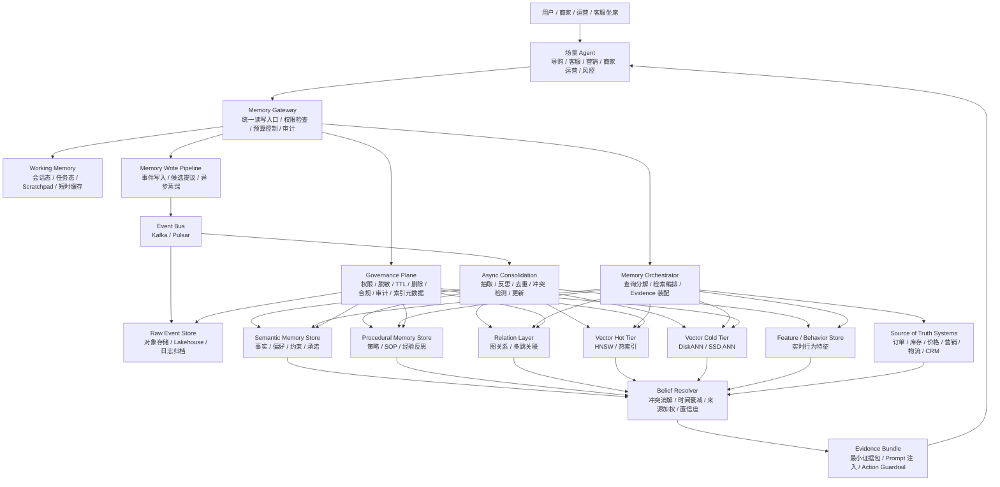
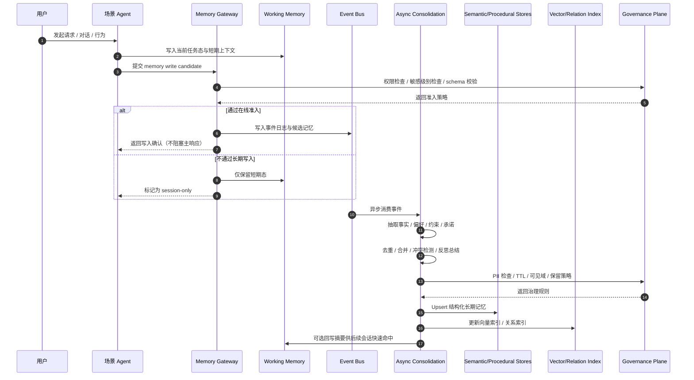
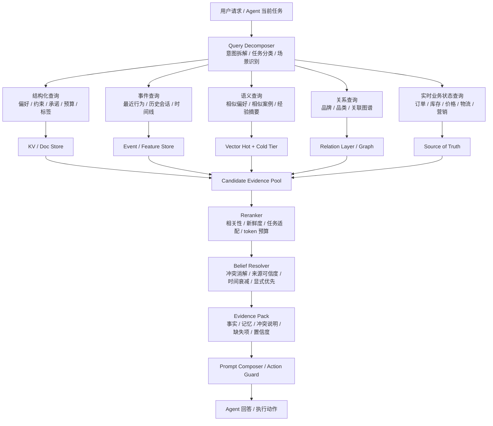

# 面向超大电商平台 Agent 生态的长期记忆系统设计

## 从“能记住”到“可运营、可扩展、可治理”的工业级方案

## 摘要

随着 Agent 系统越来越进入真实业务，长期记忆已经不再只是“聊天机器人记住你的名字”这么简单。对于一个亚马逊、淘宝级别的超大电商平台，长期记忆系统要服务的不是单一助手，而是一整个 Agent 生态：导购、客服、营销、商家运营、履约协调、内容生成、风控审核、知识助手、内部 Copilot。它们既要共享平台世界知识，又必须在权限、租户、角色、业务边界上严格隔离；既要拥有跨会话持续学习能力，又必须满足高并发、低延迟、高可用、水平扩展、可审计、可删除、可回溯的工业要求。

学术界近两年已经证明，长期记忆是 Agent 能否真正走向长期协作的关键环节。比如 [Generative Agents](https://arxiv.org/abs/2304.03442) 强调“观察、反思、计划”的闭环，[MemGPT](https://arxiv.org/abs/2310.08560) 用操作系统分层内存的视角管理上下文，[LongMem](https://arxiv.org/abs/2306.07174) 探索模型外长期记忆增强，[HiAgent](https://arxiv.org/abs/2408.09559) 聚焦长程任务里的工作记忆压缩，[RMM](https://arxiv.org/abs/2503.08026) 引入反思式记忆管理，[AgentSys](https://arxiv.org/abs/2602.07398) 把显式分层记忆与安全隔离结合起来。开源社区中，[Letta](https://github.com/letta-ai/letta)、[Mem0](https://github.com/mem0ai/mem0)、[LongMemEval](https://github.com/xiaowu0162/LongMemEval)、[DiskANN](https://github.com/microsoft/DiskANN) 等项目，也分别从 agent state、生产化 memory layer、评测基准、海量向量检索等角度提供了可借鉴的工程方向。

但电商平台的难度比通用对话系统更高。原因不是数据量更大这么简单，而是“记忆的类型更多、生命周期更复杂、错误成本更高、治理要求更严”。导购 Agent 关心长期偏好、近期意图和供给状态的融合；客服 Agent 关心历史承诺、订单事实、争议上下文和赔付边界；营销 Agent 关心触达历史、创意疲劳、价格敏感度和渠道偏好；商家 Agent 关心经营策略、活动节奏、售后规则和履约波动；风控 Agent 则关心模式沉淀、异常演化和灰黑产对抗。这里的“记忆”不能只是一个向量数据库，也不能只是模型上下文外接存储，而应该被设计成一套面向 Agent 生态的“认知基础设施”。

这篇文章给出的核心结论是：超大电商平台的长期记忆系统，应该被设计成一个分层、异步、混合检索、强治理、可解释、弱中心化的 Memory Operating System。它不是替代交易、订单、库存、营销、CRM 等 source of truth，而是为 Agent 提供跨会话的用户理解、任务连续性、策略沉淀和经验复用能力。在工程上，它需要以事件流为事实底座，以语义抽取和反思重整合为知识演化机制，以多级索引和预算化检索为读路径，以权限、审计和遗忘机制为硬边界，以场景化 memory view 为消费接口。谁能把这些能力整合成一个稳定的工业底座，谁的 Agent 才可能从“会聊天”走向“会长期协作、会持续学习、会稳定创造业务价值”。

## 1. 问题重新定义

很多团队在做长期记忆时，第一反应是两条路：一条是堆长上下文，另一条是接一个向量库做 RAG。它们当然有价值，但都不足以解决平台级问题。

长上下文的主要问题是成本和污染。上下文变长之后，模型并不会自动拥有“长期记忆能力”，而只是拥有“读取更多历史文本的机会”。当历史内容中夹杂过时信息、无关信息、敏感信息、被注入的信息时，长上下文反而会成为噪声放大器。学术上，[LoCoMo](https://snap-research.github.io/locomo/) 和相关论文 [Evaluating Very Long-Term Conversational Memory of LLM Agents](https://arxiv.org/abs/2402.17753) 已经说明，即使有很长的历史文本，模型在时间推理、跨 session 关联、细粒度偏好更新上仍然存在明显短板。

简单 RAG 的问题则是过于把“记忆”当作“相似文本检索”。电商平台中有很多关键内容不是 chunk，而是事实、偏好、约束、承诺、异常、策略、关系、证据。例如，用户说“我家有猫、木地板、怕吵、预算 3000 左右”，这不是一段需要被原样召回的文字，而是多条长期偏好与场景约束。客服说“我们承诺 48 小时内补发”，这不是普通对话片段，而是带责任和时效性的服务承诺。营销系统记录“此用户过去 30 天已接收 5 次美妆活动消息且 0 点击”，这也不是检索语料，而是触达疲劳信号。商家规则“该店大促期间缺货优先赔券不补发”，则属于程序性记忆，不应与用户偏好混在一起。

因此，平台级长期记忆系统首先要完成概念升级：它不是“帮模型找历史文本”，而是“把平台里的长期认知对象组织起来，供不同 Agent 在不同权限和预算下消费”。

## 2. 设计原则

### 2.1 记忆不是 source of truth

价格、库存、优惠门槛、订单状态、物流轨迹、售后结果、账户资产，这些属于实时业务状态，必须来自权威系统。长期记忆可以存“上次查询到的结果摘要”或“用户对此状态的反应”，但不能替代主系统。

因此需要强制区分三类对象：

- `Hard State`：订单、库存、价格、优惠、履约、账户等强一致业务状态，必须查源系统。
- `Soft Memory`：偏好、长期约束、历史承诺摘要、经验沉淀、上下文摘要，可用于推理增强。
- `Derived Belief`：由系统推断出的倾向、画像、风险评分，只能作为带置信度的候选，不能直接当事实执行。

### 2.2 不是所有历史都值得记

长期记忆的最大敌人不是“记不住”，而是“记太多”。电商平台每天的交互量极大，如果把所有会话、所有工具输出、所有 UI 事件都无差别写入 memory，系统会迅速出现检索污染、成本爆炸和行为漂移三类问题。[How Memory Management Impacts LLM Agents](https://arxiv.org/abs/2505.16067) 指出，LLM agent 存在明显的 experience-following 倾向，错误经验会被重复模仿并传播。因此写入一定是一个策略决策，而不是 append-only 的无脑归档。

### 2.3 统一抽象，分层治理，按需互联

我不建议做一个“所有 Agent 共用的一张大记忆表”。真正可落地的做法是底层 schema 和治理能力统一，存储与索引分层，对外暴露为场景化 memory view，跨 Agent 的共享只能通过显式授权和中间层映射完成。

### 2.4 安全、合规、可解释是主约束

长期记忆天然涉及个人数据、决策痕迹、历史承诺和跨系统信息拼接。如果没有权限、脱敏、审计、删除链路，系统上线越成功，风险越大。[AgentSys](https://arxiv.org/abs/2602.07398) 给了一个很值得工业界重视的启发：不要把外部工具输出和全部中间推理无差别塞进主 agent 记忆里，而应采用显式边界、隔离上下文、schema-validated return values。

## 3. 记忆分层

### 3.1 工作记忆 Working Memory

这是单次任务或单轮会话里最短期的记忆，包括当前用户问题、本轮推理草稿、工具调用返回结果、当前子任务状态、候选计划树、短时上下文缓存。生命周期通常是秒到分钟，放在高性能缓存或 runtime state 中，不追求长期持久化，但要求可恢复、可截断、可隔离。

### 3.2 情节记忆 Episodic Memory

这是“发生过什么”的记录，重点是事件与轨迹。比如用户最近 7 天连续浏览某类商品，客服在某个时间点承诺补发，营销 agent 在某个时间发送某个券包，用户对某次推荐明确表示反感，某次复杂售后如何被解决。情节记忆应天然以事件流为核心，适合 append-only 写入、时序查询、重放审计。

### 3.3 语义记忆 Semantic Memory

这是从情节里蒸馏出的长期稳定知识。比如用户偏好低噪音清洁设备，用户对某品牌有高亲和度，用户更接受换货而非赔券，某商家在活动期经常出现备货不足，某人群在晚间短信渠道响应更高。语义记忆是抽象层，带时间衰减、置信度和版本。

### 3.4 程序性记忆 Procedural Memory

这是“遇到某类情况通常怎么做”的策略与经验层。比如高价值会员缺货投诉的优先处置模板，导购面对“预算有限但重视颜值”时的推荐话术结构，营销面对“高触达低点击人群”的退让策略，商家 agent 的大促库存预警 SOP。很多 Agent 的长期价值，不来自它记住了更多用户文本，而来自它积累了更稳定的策略经验。

### 3.5 群体记忆 Collective Memory

这是平台级聚合模式，不面向个体，而面向人群、类目、店铺、活动、区域、时间周期等。比如某类目用户对“静音”“安全材质”的关注度上升，某促销模板在年轻客群中疲劳明显，某履约模式在节假日投诉率高。这一层不能直接存个体隐私，而必须经过脱敏聚合。

## 4. 数据模型

如果底层模型还是“把文本切块做 embedding”，这个系统很快就会在电商业务中碰到墙。我建议使用多对象 schema，而不是单对象 schema。核心对象至少包括：

- `Event`：发生了什么
- `Fact`：确认过的稳定事实
- `Preference`：偏好、禁忌、风格倾向
- `Constraint`：预算、物流、场景、规则边界
- `Commitment`：服务承诺或 SLA 相关信息
- `Strategy`：解决问题的方法或规则
- `Relation`：用户、商品、商家、Agent 之间的关系
- `Evidence`：支撑某条记忆成立的来源

记忆对象必须时间化、来源化、权限化、可冲突化。否则你无法判断“哪条新信息该覆盖旧信息”“哪条偏好是显式声明，哪条只是系统推断”“哪条承诺有责任约束，哪条只是聊天语气”。

## 5. 写入链路

### 5.1 在线快写

在线路径的首要目标不是生成完美长期记忆，而是先把关键事件可靠写入事件总线，标记可能值得沉淀的候选记忆，并为后续异步蒸馏留下索引和证据。在线快写阶段只做轻量操作：实体识别与主键对齐、PII 标注、重要性粗评分、memory candidate 标记和部分结构化字段抽取。

### 5.2 异步慢炼

真正的记忆构建放在异步链路中，包括多轮会话摘要、稳定偏好抽取、事实归一化、冲突检测、置信度更新、语义压缩、关系图更新、向量索引写入、冷热分层迁移。

### 5.3 Admission Control

长期记忆写入应该是多目标决策，而不是默认保存。评分维度至少包括复用价值、稳定性、显式性、后续任务约束力、服务一致性、跨 session 价值、敏感性与合规风险、冲突概率和生命周期长短。

## 6. 检索链路

我不会让 Agent 每次都拿一个 query 去向量库 top-k。真正可用的检索应该是“分解式检索编排”。当导购 agent 接到“给我推荐适合租房小户型、养猫、安静一点的扫地机器人，别太贵”时，系统应该自动拆成多个子检索：用户长期偏好、最近浏览和加购行为、家庭结构与宠物特征、价格敏感区间、品类知识、当前库存与促销、历史负反馈。然后再按不同类型走不同索引：结构化画像查 KV 或 OLTP，事件流查时序索引，文档知识查 sparse 加 dense，关系线索查 graph traversal，近期行为查 feature store 或 session store。最后通过 reranker 和 evidence pack 把结果装配成“可注入 prompt 的最小证据集”。

## 7. 存储与索引

我会采用混合存储架构：

- 事件流：Kafka 或 Pulsar
- 热结构化记忆：低延迟 KV 或文档数据库
- 事务关联与审计：OLTP 或时序数据库
- 长期原始归档：对象存储或 Lakehouse
- 向量索引：热层内存 ANN 加冷层 SSD ANN
- 关系层：图数据库或逻辑图层
- 特征层：Feature Store
- 统一入口：Memory Gateway 或 Orchestrator

向量层至少拆成两级。热层处理近 7 到 30 天高频对象、高价值用户、活跃场景，使用 HNSW 一类的内存型索引；冷层处理长尾历史、低频对象、组织记忆归档，使用 SSD 友好的 ANN，例如 [DiskANN](https://github.com/microsoft/DiskANN) 所代表的路线。

## 8. 重整合 Reconsolidation

长期记忆如果只会加不会改，最后一定会变成旧偏好堆积、互相冲突、过时规则持续生效、错误经验被不断复用。因此我会把每条记忆对象设计成状态机：

`proposed -> accepted -> stabilized -> challenged -> revised -> deprecated -> deleted`

新内容先进入候选区，被多源证据确认后稳定化。一旦出现新证据挑战，不立刻覆盖旧记忆，而是先进 challenged，后续证据确认后再进入 revised 或 deprecated。

## 9. 场景化设计

### 9.1 导购 Agent

导购场景的关键不是“把用户历史都喂给模型”，而是长期偏好、近期意图和实时供给三类信息的融合。长期记忆在这里主要解决个性化解释和候选过滤两个问题。

### 9.2 客服 Agent

客服场景的长期记忆价值，首先不在“更懂用户”，而在“更一致、更少反复”。它应重点记住最近一次问题处理结论、历史承诺与 SLA、已做过的排查步骤、用户偏好的解决方式、是否存在跨工单复现、是否是高风险升级用户、商家是否有例外授权。

### 9.3 营销 Agent

营销场景的长期记忆重点是历史触达轨迹、渠道偏好、创意疲劳、价格敏感带、类目兴趣迁移、活动响应模式、负反馈与退订风险。真正高级的营销记忆系统，不是更会推送，而是更会克制。

### 9.4 商家运营 Agent

商家 Agent 更依赖店铺经营策略、活动节奏与复盘、履约波动经验、投放转化联动经验、售后争议处置规则和人群策略模板。因此程序性记忆和群体记忆的价值往往高于会话记忆。

## 10. 高并发、高性能、高可用

我会把 memory system 做成一个“去中心化读、中心化语义治理”的服务。数据物理上按 `tenant_id + subject_type + subject_id hash` 分片，读尽量本地化到 region 内，写通过事件总线异步复制，控制面统一做 schema、policy、索引元数据和回收策略。在线读路径目标是：结构化记忆 p95 低于 20ms，混合检索 evidence bundle p95 低于 120ms，冷层召回可容忍 200 到 400ms 但只在必要时触发。写路径上，事件落盘必须近实时，语义蒸馏允许秒级到分钟级异步。

## 11. 安全、隐私与治理

长期记忆会放大两类风险：外部内容通过工具输出、网页、商家素材、用户输入进入长期 memory；过去的错误经验被系统持续模仿。[MemoryGraft](https://arxiv.org/abs/2512.16962) 指出，被污染的“成功经验”会长期误导 agent。

因此我会采取这些设计：

- 外部工具输出默认不直接写高信任长期记忆
- worker agent 与主 agent 隔离上下文
- 只有 schema-validated 结果才能跨边界
- 记忆写入前做 sanitizer 与 source grading
- 高风险 memory type 必须多源确认
- 程序性记忆与用户偏好记忆隔离

在合规上，还需要完整的删除链路：主记录删除、向量索引删除、缓存失效、派生摘要重算、图关系移除、训练样本标记不可再用。

## 12. 评估体系

我会把评估拆成五层：

- 记忆质量指标：写入 precision、写入 recall、冲突率、陈旧率、误画像率、记忆污染率、删除传播成功率
- 检索指标：命中率、evidence utility、rerank 质量、token efficiency、热层命中率、冷层访问比例
- Agent 行为指标：首次解决率、多轮重复问询率、推荐转化率、服务一致性、承诺违背率、人工转接率、策略漂移率
- 系统指标：p95 和 p99 延迟、QPS、索引刷新时延、存储增长曲线、单会话 memory 成本、降级命中率
- 治理指标：越权读取率、敏感信息暴露率、遗忘请求完成时延、投毒检测召回率、高风险 memory 写入拦截率

## 13. 分阶段落地路线图

### 阶段一：统一底座

目标是把事件流、memory schema、权限与删除链路先搭起来，优先解决“写得进、查得到、删得掉、回得溯”。

### 阶段二：打透客服和导购

客服和导购通常最容易看到 ROI。这个阶段重点建设历史承诺、跨工单连续性、长期偏好、最近意图、负反馈过滤和基础 belief resolver。

### 阶段三：重整合与程序性记忆

这个阶段引入多轮摘要、稳定偏好蒸馏、冲突修订、记忆状态机和程序性 memory bank，让 Agent 不再只是“记住历史”，而是“从历史中学会更稳地做事”。

### 阶段四：组织级群体记忆

最后再建设脱敏聚合的人群记忆、跨 agent 受控共享、多场景统一 memory gateway 和群体策略学习闭环。

## 14. 总体架构图



### 架构说明

这个架构的关键点是：

- `Memory Gateway` 是统一入口，但不是单点大脑，更像 memory control plane 的 front door
- `Working Memory` 和长期记忆明确分离，避免中间推理和工具脏数据直接沉淀成长期知识
- `Source of Truth Systems` 始终独立存在，长期记忆增强理解，不替代交易事实
- 检索层不是“一把向量搜索”，而是 `Memory Orchestrator + Belief Resolver` 两阶段
- 写入层不是“保存聊天记录”，而是“事件先落地、知识再异步蒸馏”的快写慢炼模式
- 治理平面是一级结构件，不是事后补丁

## 15. 写入链路时序图



### 写入链路设计要点

在线阶段的目标只有三个：不丢事件、不阻塞主响应、不让危险内容越权进入长期记忆。真正昂贵的工作，例如多轮归纳、冲突检测、关系融合，都放在异步链路。

异步阶段至少要完成以下工作：从事件中抽取结构化记忆对象、判断是否与已有记忆冲突、根据显式性、时间、来源和重复证据更新置信度、对多条低层事件进行摘要与压缩、决定是新建、修订、弃用还是删除旧记忆。

## 16. 检索与 Belief Resolver 流程图



### 检索链路设计要点

如果没有查询分解，系统会倾向于把所有需求压成一个 embedding query。这在导购和客服场景里非常容易失真，因为一部分需求应该走结构化查询，一部分需求应该看最近事件，一部分需求要查强事实系统，一部分需求才适合语义召回。

`Belief Resolver` 应该至少处理以下冲突：长期偏好和近期行为，用户显式声明和系统隐式推断，旧承诺和新流程，商家策略和平台规则，结构化标签和原始证据文本。

一个可落地的评分函数可以近似写成：

```text
belief_score =
  w1 * source_trust
+ w2 * recency
+ w3 * explicitness
+ w4 * task_relevance
+ w5 * evidence_count
- w6 * conflict_penalty
- w7 * staleness_risk
```

## 17. 核心数据模型表

| 对象类型     | 用途               | 典型例子                             | 推荐主键        | 关键字段                                                                | 存储建议                         | TTL / 生命周期     |
| ------------ | ------------------ | ------------------------------------ | --------------- | ----------------------------------------------------------------------- | -------------------------------- | ------------------ |
| `Event`      | 记录发生过什么     | 浏览商品、客服承诺、发送营销消息     | `event_id`      | `subject_id`, `event_time`, `actor`, `source`, `payload`, `sensitivity` | Event Bus + Lakehouse + 时序索引 | 长保留，可归档     |
| `Fact`       | 稳定事实           | 用户养猫、住小户型、商家支持晚发赔券 | `fact_id`       | `subject_id`, `predicate`, `object`, `confidence`, `valid_time`         | KV / Doc + 索引                  | 长期，需修订       |
| `Preference` | 用户偏好或禁忌     | 偏好静音、讨厌香味重、品牌偏好       | `preference_id` | `polarity`, `strength`, `explicitness`, `confidence`, `evidence_links`  | KV / Doc + Vector                | 中长期，支持衰减   |
| `Constraint` | 任务约束           | 预算 3000、必须次日达、不能电话外呼  | `constraint_id` | `type`, `value`, `scope`, `time_window`, `priority`                     | KV / Doc                         | 中期到长期         |
| `Commitment` | 服务承诺           | 48 小时补发、退款预计 3 天到账       | `commitment_id` | `owner`, `promise`, `deadline`, `status`, `source_ref`                  | KV / OLTP + 审计链               | 直到履约完成后归档 |
| `Strategy`   | 程序性记忆         | 高价值会员缺货投诉处理 SOP           | `strategy_id`   | `applicable_context`, `steps`, `success_rate`, `risk_level`             | Doc / Vector / Versioned Store   | 长期，需版本控制   |
| `Relation`   | 关系表达           | 用户-品牌亲和、商家-品类映射         | `relation_id`   | `src`, `dst`, `relation_type`, `weight`, `confidence`                   | 图层 / 关系索引                  | 长期，动态更新     |
| `Summary`    | 压缩表达           | 最近 30 天偏好摘要、某工单阶段总结   | `summary_id`    | `scope`, `summary_text`, `supporting_events`, `compression_ratio`       | Doc + Vector                     | 短中期，允许重算   |
| `Belief`     | 当前系统采用的观点 | 当前认为该用户近期更偏游戏本         | `belief_id`     | `candidate_set`, `selected_claim`, `why`, `confidence`, `expires_at`    | 快速 KV / runtime cache          | 短期，需要频繁重算 |
| `Evidence`   | 证据链             | 来自哪条消息、哪次工具调用、哪张工单 | `evidence_id`   | `source_type`, `source_ref`, `timestamp`, `trust_level`                 | 审计存储 + 轻索引                | 与上层对象联动     |

## 18. 通用字段建议

| 字段                | 含义         | 说明                                                       |
| ------------------- | ------------ | ---------------------------------------------------------- |
| `tenant_id`         | 租户标识     | 平台、多商家、多品牌隔离基础                               |
| `namespace`         | 命名空间     | `user`, `agent`, `merchant`, `org`, `campaign` 等          |
| `subject_id`        | 记忆主体     | 用户、商家、店铺、活动、Agent、工单                        |
| `memory_type`       | 记忆类型     | `event`, `fact`, `preference`, `strategy` 等               |
| `source`            | 来源         | 用户显式、系统推断、工具返回、人工标注、外部文档           |
| `source_ref`        | 来源定位     | 原始消息、工单、商品文档、日志 ID                          |
| `event_time`        | 事件发生时间 | 事件真实发生的时间                                         |
| `ingest_time`       | 入库时间     | 进入系统的时间                                             |
| `valid_time_start`  | 生效开始     | 记忆适用的开始时间                                         |
| `valid_time_end`    | 生效结束     | 记忆适用的结束时间                                         |
| `confidence`        | 置信度       | 建议和来源可信度绑定                                       |
| `importance`        | 重要性       | 用于 admission、排序、保留策略                             |
| `explicitness`      | 显式性       | 用户明确说出的，还是系统推断出的                           |
| `sensitivity`       | 敏感级别     | 控制脱敏、加密、可见域                                     |
| `visibility_policy` | 可见策略     | 哪类 agent、哪类角色可以读                                 |
| `status`            | 当前状态     | `proposed`, `accepted`, `revised`, `deprecated`, `deleted` |
| `version`           | 版本         | 用于可回滚与冲突管理                                       |
| `evidence_links`    | 证据引用     | 关联到原始事件或文档                                       |

## 19. 写入判定规则建议

### 19.1 优先写入的内容

- 用户显式声明的长期偏好或禁忌
- 对后续服务有约束力的承诺
- 多次重复出现的稳定需求
- 能显著提升跨会话效率的事实
- 高价值策略反思与成功经验
- 高风险事件的处置结论

### 19.2 默认不进入长期记忆的内容

- 瞬时情绪化表达
- 单轮闲聊噪声
- 未验证的外部页面提示
- 仅对当前任务有效的中间思考
- 高敏感原文但无长期复用价值的内容
- 容易误伤用户的单次推断标签

### 19.3 需要多源确认再写入的内容

- 用户画像中的敏感维度
- 会影响推荐和服务差异化的重要标签
- 高风险程序性经验
- 可能由 prompt injection 引入的规则性内容

## 20. Evidence Bundle 建议格式

给 Agent 注入记忆时，不建议直接把检索结果原文拼进 prompt。更稳的做法是组装一个结构化 `evidence bundle`。

```json
{
  "task_context": {
    "intent": "recommendation",
    "scene": "shopping_guide",
    "budget_class": "medium"
  },
  "hard_facts": [
    {
      "claim": "当前可选商品都支持猫毛清理模式",
      "source": "catalog_service",
      "confidence": 0.99
    }
  ],
  "long_term_memory": [
    {
      "claim": "用户偏好低噪音设备",
      "type": "preference",
      "confidence": 0.92,
      "evidence_count": 4
    },
    {
      "claim": "用户家庭中有宠物猫",
      "type": "fact",
      "confidence": 0.97,
      "evidence_count": 3
    }
  ],
  "recent_signals": [
    {
      "claim": "过去48小时浏览了4款3000元以内扫地机器人",
      "source": "behavior_store",
      "confidence": 0.95
    }
  ],
  "conflicts": [
    {
      "old_claim": "用户偏好苹果生态家电",
      "new_claim": "近期多次浏览高性价比国产品牌",
      "resolution": "本次推荐优先依据近期行为"
    }
  ],
  "guardrails": ["库存与价格必须以实时系统返回为准", "不得引用已过期促销信息"]
}
```

## 21. 监控与可观测性

为了让这套系统真正能运营，建议至少做三类 dashboard。

### 21.1 写入侧监控

- 每分钟事件写入量
- memory candidate 通过率
- 各类型记忆 admission 分布
- 高敏感内容拦截数
- 异步蒸馏延迟
- 冲突记忆生成比例

### 21.2 检索侧监控

- 各类存储命中率
- 热层与冷层访问比例
- evidence bundle 平均 token 数
- 结构化查询与向量查询比例
- 高风险场景源系统兜底比例

### 21.3 质量侧监控

- 被用户纠正的记忆比例
- 被人工客服推翻的承诺引用比例
- 同类问题跨会话答案不一致比例
- 已删除记忆的残留命中率

## 22. 前沿判断

如果站在 2026 年这个时间点，我对长期记忆系统有五个判断。

第一，memory 正在从“外挂检索层”变成“agent runtime policy”。以后最强的系统，不是存得最多，而是最会决定什么时候写、什么时候取、什么时候改、什么时候忘。

第二，记忆对象会从 chunk 转向 proposition、event、relation 和 strategy。这对电商尤其重要，因为电商业务天然是事件密集和关系密集型。

第三，多模态记忆会成为主流。商品图、短视频、客服截图、物流照片、评价图片，都应该能进入同一记忆空间，但要用统一的证据与权限框架管理。

第四，安全与治理会从附属模块变成 memory architecture 的主结构件。没有安全边界的长期记忆，最终不是资产，而是负债。

第五，群体记忆会成为平台 Agent 的长期护城河。单个 agent 的记忆带来个性化，组织级记忆才带来复利，但前提是严格脱敏和授权。

## 23. 结论

如果要为一个超大电商平台设计服务于多场景、多垂直领域 Agent 的长期记忆系统，我不会把它做成一个“更聪明的向量库”，也不会把它理解成“把聊天记录永久保存”。我会把它设计成一套面向 Agent 生态的 Memory Operating System：

- 以事件流作为事实底座
- 以多对象 schema 作为统一抽象
- 以快写慢炼作为写入机制
- 以混合检索和 belief resolver 作为读取机制
- 以重整合和遗忘机制作为演化能力
- 以权限、审计、删除、脱敏作为硬边界
- 以场景化 memory view 作为消费接口
- 以预算化检索和冷热分层作为工业化手段

这套系统的最终目标，不是让 Agent “记住更多”，而是让它在正确的时候、以正确的边界、调用正确的长期认知，并在世界变化时及时修正自己。对一个亚马逊、淘宝级平台来说，这才是真正能把 Agent 从“会说话的自动化”推向“可持续协作的智能体基础设施”的关键一步。

## 参考资料

- [Generative Agents: Interactive Simulacra of Human Behavior](https://arxiv.org/abs/2304.03442)
- [MemGPT: Towards LLMs as Operating Systems](https://arxiv.org/abs/2310.08560)
- [Augmenting Language Models with Long-Term Memory (LongMem)](https://arxiv.org/abs/2306.07174)
- [Evaluating Very Long-Term Conversational Memory of LLM Agents](https://arxiv.org/abs/2402.17753)
- [HiAgent: Hierarchical Working Memory Management for Solving Long-Horizon Agent Tasks with Large Language Model](https://arxiv.org/abs/2408.09559)
- [Agentic Retrieval-Augmented Generation: A Survey on Agentic RAG](https://arxiv.org/abs/2501.09136)
- [In Prospect and Retrospect: Reflective Memory Management for Long-term Personalized Dialogue Agents](https://arxiv.org/abs/2503.08026)
- [How Memory Management Impacts LLM Agents: An Empirical Study of Experience-Following Behavior](https://arxiv.org/abs/2505.16067)
- [Preference-Aware Memory Update for Long-Term LLM Agents](https://arxiv.org/abs/2510.09720)
- [MemOrb: A Plug-and-Play Verbal-Reinforcement Memory Layer for E-Commerce Customer Service](https://arxiv.org/abs/2509.18713)
- [MemoryGraft: Persistent Compromise of LLM Agents via Poisoned Experience Retrieval](https://arxiv.org/abs/2512.16962)
- [Agentic Memory: Learning Unified Long-Term and Short-Term Memory Management for Large Language Model Agents](https://arxiv.org/abs/2601.01885)
- [AgentSys: Secure and Dynamic LLM Agents Through Explicit Hierarchical Memory Management](https://arxiv.org/abs/2602.07398)
- [Efficient and robust approximate nearest neighbor search using Hierarchical Navigable Small World graphs](https://arxiv.org/abs/1603.09320)
- [LoCoMo Project Page](https://snap-research.github.io/locomo/)
- [Mem0 GitHub](https://github.com/mem0ai/mem0)
- [Letta GitHub](https://github.com/letta-ai/letta)
- [LongMemEval GitHub](https://github.com/xiaowu0162/LongMemEval)
- [DiskANN GitHub](https://github.com/microsoft/DiskANN)
- [DiskANN Overview](https://www.microsoft.com/en-us/research/project/project-akupara-approximate-nearest-neighbor-search-for-large-scale-semantic-search/)
