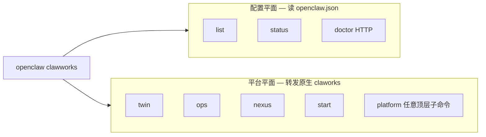

# ClaWorks × OpenClaw：生产接线规范（唯一路径）

按 **OpenClaw 仓库实现** 对齐：命令分两平面、插件唯一、工具名与 manifest 一致。

| 权威来源                  | 路径                                                      |
| ------------------------- | --------------------------------------------------------- |
| CLI                       | `src/cli/clawworks-cli.ts`、`src/cli/clawworks-config.ts` |
| 插件与 `cw_*`             | `extensions/claworks/openclaw.plugin.json`                |
| Doctor 遗留插件           | `src/commands/doctor/shared/claworks-legacy-plugins.ts`   |
| 集成指南（英文 Mintlify） | `docs/plugins/claworks-integration.md`                    |

---

## 1. 命令模型（与 OpenClaw 其它子命令一致）



| 平面         | 需要本机 `claworks` 二进制？ | 示例                                                                       |
| ------------ | ---------------------------- | -------------------------------------------------------------------------- |
| **配置平面** | 否                           | `openclaw clawworks status`、`list --json`、`doctor --fix`                 |
| **平台平面** | 是                           | `openclaw clawworks twin start`、`ops start`、`platform plugins install …` |

**不要混淆的 doctor：**

| 命令                                 | 作用                               |
| ------------------------------------ | ---------------------------------- |
| `openclaw doctor`                    | OpenClaw 自身                      |
| `openclaw clawworks doctor`          | 对已配置实例 `POST /v1/doctor/run` |
| `openclaw clawworks platform doctor` | 原生 `claworks doctor` CLI         |

---

## 2. 插件与工具（Agent）

- **只启用** `plugins.entries.claworks`，工具 **`cw_*`**
- **禁止** 新部署同时启用 `clawtwin` / `clawops` / `claworks-ops`
- **不要** 把 ClaWorks 写进 `mcp.servers`；用插件即可

| 任务     | 工具                                      |
| -------- | ----------------------------------------- |
| KB 导入  | `cw_kb_ingest`                            |
| KB 检索  | `cw_kb_search`                            |
| 本体对象 | `cw_query_objects`、`cw_import_objects` … |

配置片段：`contrib/examples/claworks-single-instance.openclaw.fragment.json`、`claworks-multi-instance.openclaw.fragment.json`

**白标生产（单公网 :443）**：`contrib/examples/claworks-whitelabel/` — Nginx 统一入口 + OpenClaw loopback + 飞书 WebSocket 出站。

---

## 3. 弃用路径

| 弃用                                                  | 改用                                        |
| ----------------------------------------------------- | ------------------------------------------- |
| `openclaw clawworks platform twin start` 作为唯一写法 | **`openclaw clawworks twin start`**（推荐） |
| `twin_*` / `ops_*` 插件工具                           | `cw_*`                                      |
| `memory-wiki` 代替企业 KB                             | `cw_kb_*` + 可选 memory-wiki 并存           |

---

## 4. 验收（生产交付清单）

```bash
# 配置
openclaw doctor
openclaw doctor --fix
openclaw plugins list          # claworks [canonical]

# 实例
openclaw clawworks list --json
openclaw clawworks status -v   # 不可达时 exit 1
openclaw clawworks doctor

# 平台进程（需安装 claworks）
openclaw clawworks twin start

# Agent：cw_kb_ingest → cw_kb_search
```

### 自动化测试

```bash
pnpm test src/cli/clawworks-register.test.ts src/cli/clawworks-passthrough.test.ts
pnpm test src/cli/clawworks-config.ts  # 若单独加测试则跑 extractInstances 所在文件
pnpm test src/commands/doctor/shared/claworks-legacy-plugins.test.ts
pnpm test extensions/claworks/canonical-surface.contract.test.ts
pnpm test src/plugins/claworks-canonical.test.ts
pnpm test src/cli/plugins-list-format.test.ts
```

---

## 5. 文档维护

| 层级     | 文件                                   |
| -------- | -------------------------------------- |
| 中文总表 | 本文                                   |
| 英文 CLI | `docs/cli/clawworks.md`                |
| 英文集成 | `docs/plugins/claworks-integration.md` |
| 示例索引 | `contrib/examples/README-claworks.md`  |

改 `cw_*` 工具名时同步：`openclaw.plugin.json`、`index.ts`、SKILL、`canonical-surface.contract.test.ts`、中英文指南。

---

## 6. 相关链接

- https://docs.openclaw.ai/plugins/claworks-integration
- https://docs.openclaw.ai/cli/clawworks
- https://docs.openclaw.ai/plugins/claworks
