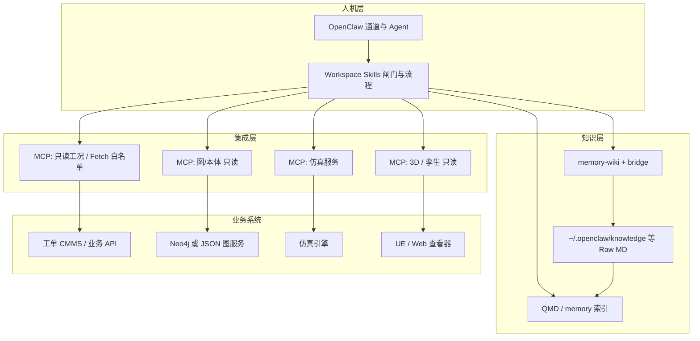

# 石油天然气管道场站 · 工业 AI 模块化落地设计（OpenClaw 为中心）

**文档性质**：架构与行动指南（归档用）  
**适用场景**：场站运维、阀与工艺设备、规程与工单、只读工况、后续图/本体/仿真/3D 按需 plugging  
**读者**：方案负责人、集成开发、运维与合规  
**关联**：个人网关优化见 **`contrib/operator-playbooks/personal-gateway-optimization.zh.md`**；MCP/Knowledge 见 **`contrib/examples/mcp-and-knowledge-integration.zh.md`**；**本机 `Projects` 资源清单**见 **`contrib/operator-playbooks/industrial-local-resources-inventory.zh.md`**；Skills 见 **`docs/tools/skills.md`**；Memory Wiki 见 **`docs/plugins/memory-wiki.md`**；路由见 **`docs/channels/channel-routing.md`**。

---

## 一、目标与原则

### 1.1 业务目标

- 在**与真实生产一致的主数据与规程**之上，让 AI 做**分析、检索、草案与推理辅助**。
- **执行**必须通过**经治理的业务 API / 工单**，保留**人工确认**与审计。
- 支持**分阶段上线**：先「规程 + 只读工况 + 工单闭环」，再按需叠加**图/本体、仿真、3D/数字样件**。

### 1.2 设计原则

| 原则               | 说明                                                                                                          |
| ------------------ | ------------------------------------------------------------------------------------------------------------- |
| **数据真源分层**   | Raw 可来自现场导出与**经审核的互联网资料**；模型消费**策展层**（wiki/图/API 快照），不直接当 Raw 为唯一真理。 |
| **写得少、读得多** | 早期以**只读工况**为主；写操作走**工单或受控 API**，禁止模型直连现场控制未鉴权端点。                          |
| **可插拔**         | 图库、仿真、3D 以**独立服务 + MCP** 接入，OpenClaw 不吞掉这些运行时。                                         |
| **可审计**         | 规程出处、规程版本、API 响应时间戳写入对话或 wiki **source/concept**，便于复盘。                              |

---

## 二、总体架构（模块化拼装）

**拼装关系（一句话）**：OpenClaw = **编排与对话**；Memory/QMD/Wiki = **规程与叙事知识**；MCP = **可替换的工业能力插件**；Neo4j/仿真/3D = **系统外服务**。

---

## 三、阶段路线（行动顺序）

### 阶段 A — 早上线（优先）

| 能力       | OpenClaw 侧                                                             | 外部侧                            |
| ---------- | ----------------------------------------------------------------------- | --------------------------------- |
| 主数据纪律 | Skill：`industrial-mdm`（Tag/设备 ID、引用方式）                        | 主数据表或 CMMS 导出              |
| 规程知识   | `memory-wiki` + QMD 路径 + `~/.openclaw/knowledge`                      | 企业规程 + 见第八节互联网来源治理 |
| 只读工况   | MCP：`gen-mcp-fetch` 或专用只读 HTTP MCP + **URL 白名单**（写在 Skill） | Historian / REST 网关             |
| 工单闭环   | Skill：`industrial-work-order`（仅草案 + 模板，人审后录入）             | CMMS / 纸质流程对接               |

### 阶段 B — 图 / 本体（下一步重点）

| 能力     | 推荐形态                                                                    | MCP 契约（建议）                                                                              |
| -------- | --------------------------------------------------------------------------- | --------------------------------------------------------------------------------------------- |
| 图查询   | **Neo4j** + 只读角色；或 **自建 JSON API**（封装 Cypher/图遍历）            | 工具如 `graph_equipment_context(tagId)`、`graph_neighbors(tagId, depth)`，**禁止任意 Cypher** |
| 本体约束 | LinkML / SHACL / OWL 在**服务内**校验；OpenClaw 只消费**已通过校验的 JSON** | 返回字段含 `ontologyVersion`、`validUntil`                                                    |

**落地步骤（检查清单）**：

1. 冻结 **equipment / line / valve** 等与现场一致的 **ID 合同**（与 CMMS/SCADA 点表对齐）。
2. 部署 Neo4j（或只读副本）与**最小图模式**（点/边类型枚举写死）。
3. 实现 **HTTP 网关**：输入 `tagId` / `stationCode`，输出**固定 schema** 的 JSON（含出处与查询 id）。
4. 在 `openclaw.json` 的 **`mcp.servers`** 注册（`streamable-http` 或 `command` + 小适配器）。
5. Skill：`industrial-graph-read`：**何时调用、参数范围、失败时禁止编造**。
6. （可选）`memory-wiki` 的 claims **引用**图查询 id，便于审计。

### 阶段 C — 仿真

| 能力        | 推荐形态                                        | MCP 契约（建议）                                                                                                       |
| ----------- | ----------------------------------------------- | ---------------------------------------------------------------------------------------------------------------------- |
| 稳态/瞬态等 | **独立仿真服务**（离线或队列 Job）              | 输入：`TagSnapshot`（JSON，来自只读工况 MCP 或上传）、`scenarioId`；输出：`summary`、`plotsRef`、`runId`、`warnings[]` |
| AI 角色     | **组态输入 + 解读输出**，不在聊天内手搓数值内核 | 仿真服务版本号写入 Skill                                                                                               |

**落地步骤**：

1. 定义 **TagSnapshot** schema（与主数据字段一致）。
2. 仿真服务提供 **`POST /runs`**（异步）+ **`GET /runs/{id}`**。
3. MCP 暴露 `sim_submit`、`sim_status`、`sim_result` 或单一 `sim_run` 聚合。
4. Skill：`industrial-simulation`：**适用范围、与规程冲突时以规程与现场为准**。

### 阶段 D — 3D / 数字样件

| 能力     | 推荐形态                                                    | MCP 契约（建议）                                                                           |
| -------- | ----------------------------------------------------------- | ------------------------------------------------------------------------------------------ |
| 可视化   | **UE Pixel Streaming / Web 查看器** + **深链** `?tag=P-101` | `twin_link_for_tag(tagId)` 返回 URL；或 `twin_snapshot_metadata(tagId)` 返回相机与图层状态 |
| 与图一致 | 3D 对象 ID **映射表**由主数据/图库服务维护                  | OpenClaw 只返回链接与元数据，**不直接改模型**                                              |

**落地步骤**：

1. 建立 **Tag ↔ 3D 节点 ID** 映射（单一真源）。
2. 若仅需链接：**Fetch MCP + 固定 viewer 基址** 即可 MVP。
3. 若需会话态：**streamable-http MCP** 指向查看器后端。
4. Skill：`industrial-twin`：**3D 为辅助，控制与限值以 SCADA/规程为准**。

---

## 四、OpenClaw 侧模块映射（汇总）

| 模块                            | 类型                  | 说明                               |
| ------------------------------- | --------------------- | ---------------------------------- |
| 飞书 / 微信等                   | 内置通道插件          | 见通道文档                         |
| memory-core / QMD / memory-wiki | 内置插件              | 规程与 bridge、外挂目录            |
| active-memory                   | 内置插件              | 回合前检索                         |
| tavily / 自研搜索               | 内置插件              | 互联网**发现**线索，非企业规程真源 |
| `gen-mcp-fetch` 等              | `mcp.servers`         | 只读 HTTP，**白名单**              |
| neo4j-readonly / sim / twin     | `mcp.servers`（自建） | 阶段 B/C/D 接入                    |
| industrial-\*                   | `<workspace>/skills`  | 流程、合规、停机线                 |

---

## 五、Workspace Skills 建议清单（工业线工作区）

在 **`main`（场站/工程）** workspace 下建议至少：

| Skill ID                   | 职责                                              |
| -------------------------- | ------------------------------------------------- |
| `industrial-core`          | 总闸门：OT 安全、禁止直连控制、升级路径、责任声明 |
| `industrial-mdm`           | Tag/设备 ID、规程版本、主数据引用                 |
| `industrial-procedures`    | wiki 入库格式、出处、与 `memory-wiki` 协作方式    |
| `industrial-readonly-live` | MCP 工况调用边界、超时、白名单 URL                |
| `industrial-work-order`    | 工单草案字段、人审、与 CMMS 交接                  |
| `industrial-graph-read`    | 阶段 B：何时查图、如何用返回 JSON                 |
| `industrial-simulation`    | 阶段 C：仿真输入输出解读                          |
| `industrial-twin`          | 阶段 D：3D 链接与免责声明                         |

**personal-life 工作区不要挂载 industrial-\*Skill**，避免数据串线。

配置可通过 **`skills.load.extraDirs`** 复用共享 Skill 目录；见 **`personal-gateway-optimization.zh.md`** 中的 **`OPENCLAW_OPTIMIZE_SKILL_EXTRA_DIRS`**。

---

## 六、与互联网规程结合（增强信心）

> 目标：利用互联网公开资料**加速冷启动**，同时不让未验证内容**冒充**企业内部强条。

### 6.1 流程

1. **发现**：`web_search` / 公开标准摘要 / 厂商白皮书（注意版权与条款）。
2. **摄取**：下载 → **Raw 区**（只读命名空间）→ 转 Markdown → `openclaw wiki ingest` 或落入 `knowledge/`。
3. **标注**：wiki **source** 页 `sourceType: external-web`，**frontmatter** 含 URL、抓取日期、许可备注。
4. **对照**：与企业issued 规程 **diff**；冲突项写入 **contradiction / open question**（memory-wiki 报告）。
5. **准入**：仅当 **角色/用户** 将外部来源标为「已采纳」或「训练参考」后，Agent 在 Skill 约束下可提升引用优先级。

### 6.2 信心来源（可对外说明）

- **出处可追溯**：每条建议附带 **source 链接 + 内部规程条款号**。
- **双源校验**：外网 vs 企业规程 **显式对比**在 wiki。
- **只读工况**：结论与 **实时 API 快照** 时间戳绑定。
- **执行分离**：操作建议 ≠ 已执行；以 **工单/审批** 为准。

---

## 七、安全与合规（最小集）

- **网络分域**：生产 OT 与 AI 网关**分区**；只读接口经 **DMZ/API 网关**。
- **密钥**：MCP / API Key 放 **`env:` 或 SecretRef**，不把生产凭证写入 Skill 正文。
- **日志**：工单草案、图查询 id、仿真 runId **可审计**；保留保留期按企业政策。
- **模型边界**：Skill 中写明 **禁止**内容（例如未授权阀门开度建议、跳过联锁等）。

---

## 八、近期行动清单（按优先级）

| 序号 | 行动项                                                                      | 产出                                    |
| ---- | --------------------------------------------------------------------------- | --------------------------------------- |
| 1    | 落地 5 个基础 Skill（core / mdm / procedures / readonly-live / work-order） | `SKILL.md` + 团队评审签字               |
| 2    | 工况只读 API 清单 + MCP 白名单                                              | `openclaw.json` + Skill 附录            |
| 3    | **阶段 B**：Neo4j 或 JSON 图服务 + MCP + `industrial-graph-read`            | 端到端演示：Tag → 图上下文 → 回答带引用 |
| 4    | **阶段 C**：仿真 Job API + MCP + `industrial-simulation`                    | 演示：快照 → runId → 摘要               |
| 5    | **阶段 D**：Viewer 深链 + MCP + `industrial-twin`                           | 演示：Tag → 打开 3D                     |
| 6    | 互联网规程：Raw 目录规范 + wiki 外部来源模板 + 冲突报告纳入周会             | 治理制度一页纸                          |

---

## 九、文档维护

- **变更时**：更新本文件章节与检查清单；重大接口变更同步 **MCP 工具名与 JSON schema**。
- **与 OpenClaw 版本**：升级网关后复核 **`memory-wiki` bridge**、`wiki doctor`、MCP 连接（见 **`docs/cli/wiki.md`**）。

---

**结语**：本方案以 **OpenClaw 为编排与信任界面**，把 **图、仿真、3D** 做成 **可替换 MCP 插件**，把 **规程与纪律** 放在 **Skill + wiki**，适合油气管道场站在 **合规前提下** 持续迭代 AI 能力。
