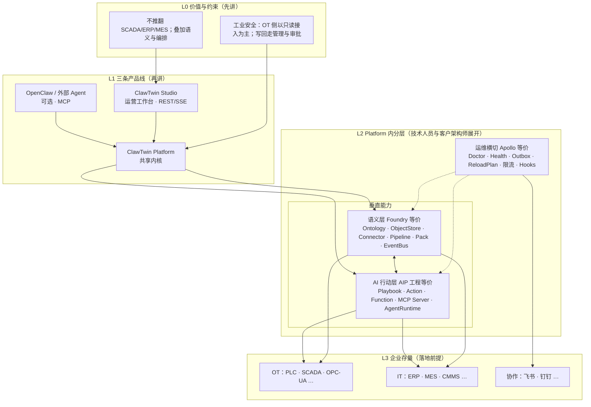
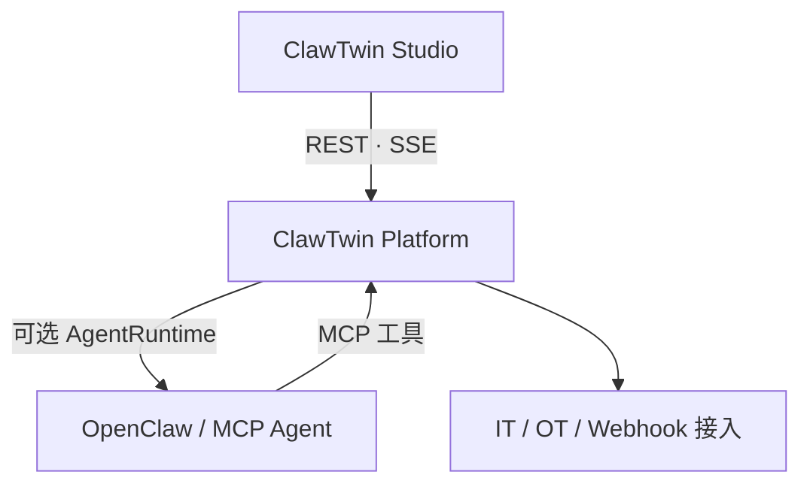
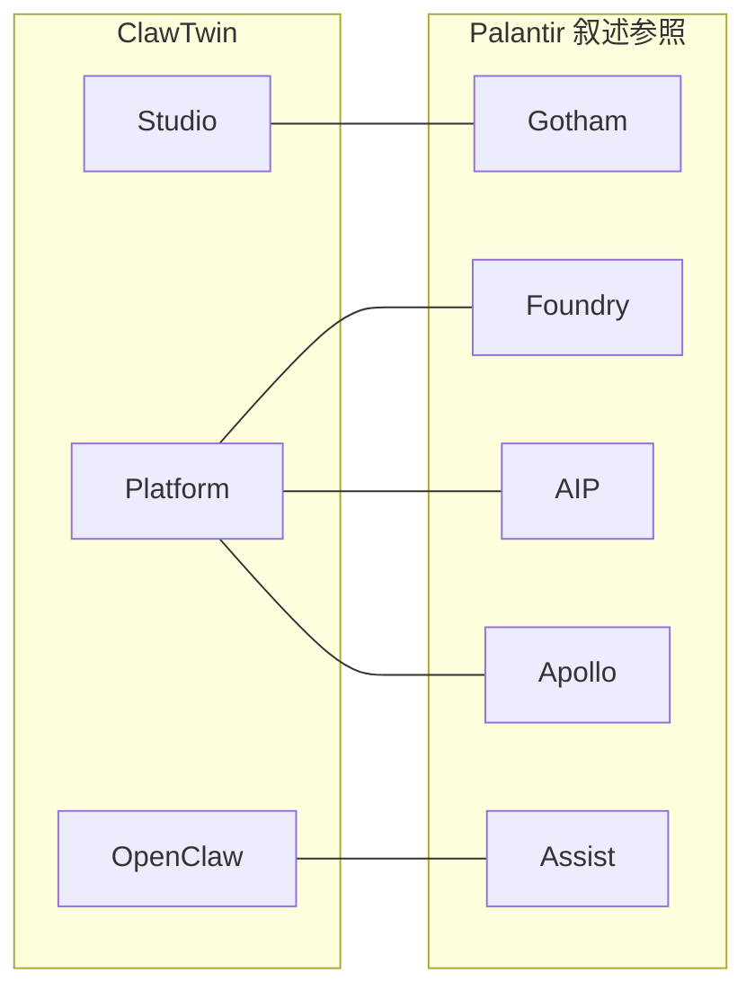

# ClawTwin 多受众讲解逻辑与层次结构

**地位**: 对外叙事方法论 / 演讲与培训提纲  
**版本**: v1.0.0（2026-05-13）  
**读者**: 售前、产品、架构师、客户成功；需同时对齐高管、业务用户与技术人员时优先读本篇  
**配套**: `CLAWTWIN-ARCHITECTURE-SYSTEMATIC.md`（**纯文字**系统化：产品·组合·模块全集·依赖公理）· `CLAWTWIN-PALANTIR-POSITIONING.md`（Palantir 四条线专场）· `CLAWTWIN-ENTERPRISE-AI-ARCHITECTURE.md`（客户向总图）· `CLAWTWIN-SYSTEM-FRAMEWORK.md`（系统框架）

---

## 一、为什么听众会「听不懂」

材料本身拆得很细（本体、MCP、Playbook、Pack、Outbox 等），若**起步粒度**选错，三类人会同时迷失：

| 听众         | 典型卡点                                     | 常见误讲                           |
| ------------ | -------------------------------------------- | ---------------------------------- |
| **高层**     | 需要「投入产出与风险边界」，不是模块清单     | 开场就讲 YAML、端点、Palantir 缩写 |
| **企业用户** | 需要「我哪天怎么用、和现有流程怎么接」       | 开场就讲单向依赖、语义层           |
| **技术人员** | 需要「契约、边界、调用方向、与存量系统接口」 | 只讲愿景不讲协议面与真源           |

本篇给出一套 **统一的层次逻辑**：**同一套故事，按「变焦」加深**；Palantir 对照放在 **可选层级**，避免绑架所有听众。

---

## 二、总原则：先因果，后名词；先三层产品，后 Platform 内分层

推荐讲解顺序（自上而下，所有人都从这里开始）：

1. **价值与边界（一句）**：在**不替换**现有 IT/OT 的前提下，把运营对象语义化，让人机协作闭环可编排、可审计、可演进。
2. **三个可见「产品」**：**Studio（人直接干活）**、**Platform（共享内核）**、**OpenClaw（可选对话助手）**——先建立这三个盒子，再打开 Platform。
3. **Platform 内再拆三层**：**语义层（数据与世界模型）** → **AI 行动层（编排与确定性 AI 函数）** → **运维横切层（可靠与可自愈）**。
4. **（可选）Palantir 对照**：仅当听众熟悉 Gotham/Foundry/AIP/Apollo 时，用一层映射表对齐认知（详见 `CLAWTWIN-PALANTIR-POSITIONING.md`）。
5. **（技术人员加长）**：接口矩阵（REST/SSE/MCP/Webhook/CLI）、依赖有向无环、文档真源路径。

**记忆口诀（对内培训用）**：「**三下两三**」——**三下**：三个产品；**两三**：Platform 里 **2 个垂直栈（语义 + 行动）** + **1 个横切运维壳**。

---

## 三、层次结构图（图 1：全员共用的一张「三层变焦」）

下图表达：**最外层是业务价值与存量系统；中间是三条产品线；底层展开 Platform 内部逻辑分层**。演讲时可指着图层逐级放大。

**口头解说模板**：「上面三块是你们会摸到的：**Studio** 给人用，**OpenClaw** 给喜欢说话的人用，中间 **Platform** 是大家共用的发动机和底座。发动机里面分两垛：**一垛管世界长什么样（语义）**，**一垛管出事以后自动怎么走（行动）**；外面裹一层 **运维**，保证不坏、不丢消息、能热更新。」

---

## 四、层次结构图（图 2：调用关系与依赖方向）

下图强调 **谁依赖谁**（技术人员与客户架构师极受用）：Studio 与 Agent **都只往下看 Platform**；Platform **可选**回调 Agent；Platform **往下**接 IT/OT。

---

## 五、层次结构图（图 3：可选 Palantir 映射叠加）

仅在听众已有 Palantir 语境时使用（避免对不熟悉听众强加缩写）。

语义提醒：**Foundry + AIP + Apollo 在 ClawTwin 侧 primarily 收敛为同一个可部署的 Platform**；Gotham 映射到 Studio；Assist 映射到外部 Agent。详解见 `CLAWTWIN-PALANTIR-POSITIONING.md`。

---

## 六、按受众的讲解脚本（可直接裁剪进 PPT）

### 6.1 高层（董事会 / 事业部总裁）：结论先行

**目标**：听懂「买什么、不买什么风险、和组织怎么配合」，不需要记住模块名。

| 时长          | 讲什么                                                                                                | 不讲什么                      |
| ------------- | ----------------------------------------------------------------------------------------------------- | ----------------------------- |
| **约 30 秒**  | 叠加层 + 不推翻存量 + 人机闭环可审计                                                                  | 任何三字缩写（MCP、Ontology） |
| **约 2 分钟** | 三产品：**工作台给人**、**对话可选**、**中间是共享平台**；分阶段 SKU（见产品包装文档）                | Platform 内分层细节           |
| **约 5 分钟** | 加一句工业边界（OT 只读为主）；加一句「确定性自动化 vs 对话智能」分工（平台负责前者，Agent 负责后者） | API 路径与目录结构            |

**推荐配图**：本文 **图 1** 只展开到 **L1**（三条产品线），L2 折叠成一句口头话。

---

### 6.2 企业用户（运营、班长、工艺工程师）：任务链先行

**目标**：听懂「告警来了谁处理、在哪点、会不会误控设备」。

**推荐叙述顺序（故事链）**：

1. **日常入口**：多数人用 **Studio**；已在 IM 里的人可通过 **飞书卡片 / OpenClaw** 收到同一条闭环（见 `CLAWTWIN-OPERATOR-GUIDE.md`）。
2. **一条告警怎么走**：传感器进来 → 变成「对象上的告警」→ 可能触发 **自动步骤**（诊断、填建议）→ 需要人时 **提醒你审批** → 批准后才生成工单或下发动作。
3. **安全话**：工控侧我们不「偷偷写回去」；要写回到业务系统，走规程与权限。
4. **需要扩展时**：行业和规程在 **Pack** 里换皮肤，核心不散。

**推荐配图**：**图 1** 的 L1 + L3；必要时用手指 **图 2** 解释「消息都从中间平台过，方便审计」。

---

### 6.3 技术人员（架构师、集成工程师、客户 IT）：契约与真源先行

**目标**：能画集成图、能评审接口、能找文档真源。

**推荐叙述顺序**：

1. **依赖 DAG**：与 **图 2** 完全一致（Studio/Agent → Platform；Platform → 外部系统）。出处：`CLAWTWIN-INTEGRATION-ARCHITECTURE.md` 模块依赖矩阵一节。
2. **Platform 内分层**：语义层 vs AI 行动层 vs 运维横切；事件是否 **单一出口**（EventDispatcher）、外联是否 **Outbox**。出处：`CLAWTWIN-SYSTEM-FRAMEWORK.md`。
3. **协议面**：REST / SSE / MCP / Webhook / CLI 各自服务对象。出处：`CLAWTWIN-SYSTEM-FRAMEWORK.md` 接口层矩阵一节。
4. **本体与 HTTP 锁**：`INDUSTRIAL-FOUNDRY-ARCHITECTURE.md`、`DESIGN-FINAL-LOCK.md`。
5. **（可选）Palantir**：用 **图 3** 对齐业务高管听众的认知语言。

---

## 七、统一答疑：三个最容易混淆的边界（建议做成 FAQ 一页）

1. **Platform 是不是聊天机器人？**  
   **不是。** 多轮对话、规划、工具循环在 **OpenClaw（Assist）**；Platform 提供 **结构化单次 AI 函数**、**Playbook 编排**、**动作执行** 与 **MCP 工具出口**。

2. **Studio 和 Platform 会不会重复？**  
   **不重复。** Studio 只有界面与交互；业务真相与自动化在 Platform。**单向依赖**：Studio → Platform API。

3. **Palantir 四条线是四个产品吗？**  
   **在 Palantir 宣传里常分四条能力叙事；在 ClawTwin 工程里 Foundry+AIP+Apollo 主要打成一个 Platform 交付。** Studio 与 Assist 分列两侧体验。详见 `CLAWTWIN-PALANTIR-POSITIONING.md`。

---

## 八、材料裁剪清单（你做胶片时的 Checklist）

| 幻灯片  | 建议放入                         | 受众                           |
| ------- | -------------------------------- | ------------------------------ |
| 第 1 页 | 价值 + 不推翻存量 + 工业边界一句 | 全员                           |
| 第 2 页 | **图 1**（可到 L1 为止）         | 全员                           |
| 第 3 页 | **图 2** 依赖方向                | 架构师 / IT                    |
| 第 4 页 | 告警到工单故事链（文字箭头即可） | 企业用户                       |
| 第 5 页 | **图 3** Palantir 可选           | 听过 Palantir 的高管或甲方架构 |
| 附录    | 接口矩阵 + 文档索引              | 技术人员                       |

---

## 九、延伸阅读（按深度）

| 深度                | 文档                                     |
| ------------------- | ---------------------------------------- |
| 客户向大图与分工    | `CLAWTWIN-ENTERPRISE-AI-ARCHITECTURE.md` |
| Palantir 四条线专场 | `CLAWTWIN-PALANTIR-POSITIONING.md`       |
| 系统框架与事件流    | `CLAWTWIN-SYSTEM-FRAMEWORK.md`           |
| 集成与用户旅程      | `CLAWTWIN-INTEGRATION-ARCHITECTURE.md`   |
| 协议权威            | `INDUSTRIAL-FOUNDRY-ARCHITECTURE.md`     |
| 总索引              | `DESIGN-FINAL-MASTER-INDEX.md`           |

---

_讲解时宁可用一张层次图重复三遍（每次多展开一层），也不要在第一屏堆满术语。_
