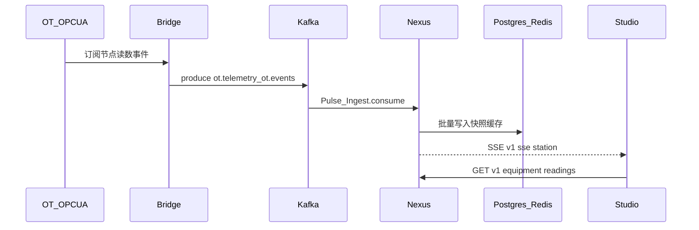
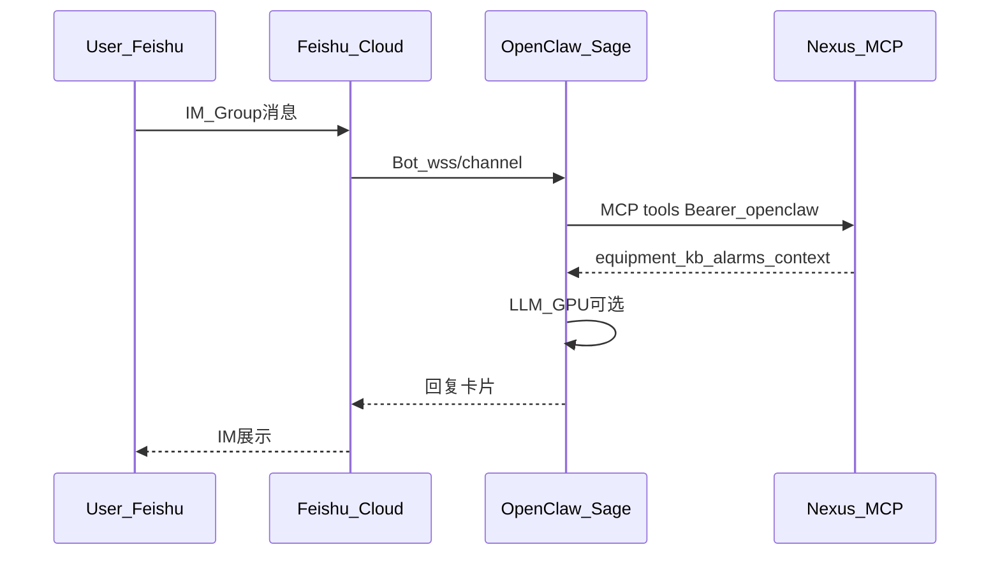
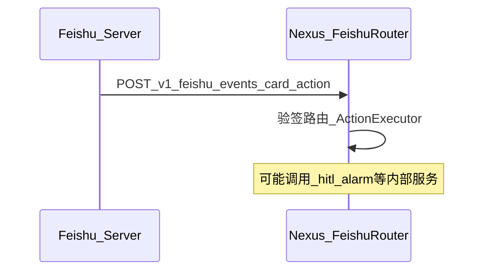
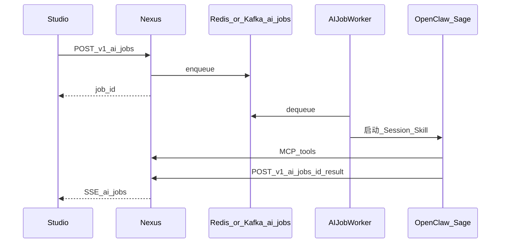

# ClawTwin 业务调用关系与工作流（汇总）

> **版本**：v1.0 · 2026-05-11  
> **目的**：从设计文档中**定位原始泳道图**，并把每条业务的**调用方 / 被调方 / 接口与事件**对齐到 `DESIGN-FINAL-LOCK.md`（路径与 Topic 以 LOCK 为最高权威）。  
> **非替代**：`NEXUS-BUSINESS-LOGIC.md §三` 仍为泳道 ASCII 的**原文出处**；本文仅在路径漂移处做纠偏表。  
> **油气场站视角**：站内运营业务名目 + 产品线分工 + 闭环案例见 **`PETROLEUM-STATION-BUSINESS-FLOWS.md`**（依据 `INDUSTRIAL-SCENARIOS-COMPLETE.md` §一 与 `USER-ENVIRONMENT-DELIVERY-VALIDATION.md` §九）。

---

## 一、原始「业务调用图」在哪里

| 内容                                        | 文档与章节                                            | 说明                                                        |
| ------------------------------------------- | ----------------------------------------------------- | ----------------------------------------------------------- |
| **六大业务流程 ASCII 泳道**                 | `NEXUS-BUSINESS-LOGIC.md` → **§三**                   | OT→孪生、飞书诊断、Studio AI Job、工单 FSM、MOIRAI、KB 摄入 |
| **飞书三条路径（对话 / 推送 / 卡片）**      | `USER-ENVIRONMENT-DELIVERY-VALIDATION.md` → **§五.1** | 决策：对话进 AgentRuntime；卡片进 Foundry                   |
| **「谁主导谁发起」商业调用表**              | `ARCHITECTURE-FINAL-REVIEW.md` → **§3.3**             | OpenClaw vs Nexus 主导关系                                  |
| **OpenClaw Skill → Platform HTTP 逐步示例** | `MODULE-DESIGN-PLATFORM.md` → **§24.6**               | 给 Skill 开发者的完整调用链                                 |
| **API / MCP / Kafka / ServiceToken 终态**   | `DESIGN-FINAL-LOCK.md` → **§一、§三、§四**            | 写代码与画图的**唯一路径真源**                              |

---

## 二、NEXUS-BUSINESS-LOGIC 与 DESIGN-FINAL-LOCK 的路径纠偏（读泳道时必看）

以下在 `NEXUS-BUSINESS-LOGIC.md §三` 的 ASCII 中出现的路径，实现与对外文档须改用 **LOCK** 列。

| 泳道中的写法（旧/示意）                                | 终态（`DESIGN-FINAL-LOCK.md`）                                                                                                            |
| ------------------------------------------------------ | ----------------------------------------------------------------------------------------------------------------------------------------- |
| `GET /context`、泛化 Tool API                          | **MCP** `GET/POST /mcp`（Bearer **openclaw-service-token**），工具如 `get_equipment_context`、`search_knowledge_base` 等（见 LOCK §1.7）  |
| `POST /kb/srch`                                        | `GET /v1/kb/search?q=...`                                                                                                                 |
| `POST /workorders/ai-draft`                            | `POST /v1/workorders/ai-draft`                                                                                                            |
| `POST /submit`、`POST /workorders/{id}/submit`（HITL） | `POST /v1/hitl/workorders/{id}/pending`（draft → pending_approval）                                                                       |
| 飞书 OA 回调 `POST /feishu/oa/callback`                | `POST /v1/hitl/workorders/{id}/oa-callback`（需 **oa-service-token**），以及审批侧亦可能走 `approve` / `reject` 等 HITL 端点（LOCK §1.3） |
| `POST /ai/jobs`                                        | `POST /v1/ai/jobs`；结果回写 `POST /v1/ai/jobs/{job_id}/result`（ServiceToken）                                                           |
| SSE 综合流                                             | `GET /v1/sse/station/{station_id}`；AI 任务流 `GET /v1/sse/ai-jobs/{job_id}`                                                              |
| 飞书卡片回调 URL                                       | **LOCK**：`POST /v1/feishu/events`（仅 `url_verification` + `card.action.trigger`）；**不处理** `im.message.receive_v1`                   |
| `POST /kb/docs`                                        | `POST /v1/kb/documents`（multipart）                                                                                                      |

---

## 三、Kafka 与 ServiceToken（所有异步边的共同语言）

**Topic（LOCK §三）**

| Topic                | 生产者            | 消费者               | 典型负载                  |
| -------------------- | ----------------- | -------------------- | ------------------------- |
| `ot.telemetry`       | OPC-UA **Bridge** | Nexus Pulse          | 设备读数                  |
| `ot.events`          | Bridge            | Nexus Pulse          | OT 事件                   |
| `platform.alarms`    | Nexus Pulse       | SSE / Notification   | 告警广播                  |
| `platform.workorder` | Nexus Work Order  | Notification / KB 等 | 工单状态-side effect      |
| `platform.ai-jobs`   | Nexus AI Job      | AI Job Worker        | Studio/自动触发的分析任务 |

**Token（LOCK §四）摘录**

| Token                    | 使用者                           | 范围要点                                           |
| ------------------------ | -------------------------------- | -------------------------------------------------- |
| `openclaw-service-token` | OpenClaw（及同类 Agent Runtime） | **/mcp** 全部工具 + `POST /v1/ai/jobs/{id}/result` |
| `oa-service-token`       | OA/BPM                           | HITL 审批相关 + `GET /v1/ctx/*`                    |
| `bridge-service-token`   | Bridge                           | LOCK 明示：**不调 Nexus API**，仅 Kafka 生产       |

---

## 四、逐业务：调用关系 + 实现要点 + 序列图

### 业务 A — OT 数据进入孪生并在 Studio 可见

**泳道出处**：`NEXUS-BUSINESS-LOGIC.md` Flow 1。  
**实现要点**：

1. **Bridge**（产品：ClawTwin Bridge）订阅 OPC-UA，向 **`ot.telemetry` / `ot.events`** 生产消息；**不调** Nexus HTTP（LOCK §四 bridge-service-token 说明）。
2. **Nexus** Kafka 消费者 → IngestPipeline：批量入库（Timescale/关系表）、更新 Redis 设备快照。
3. 可选：阈值越界 → 告警引擎 → **`platform.alarms`** → `GET /v1/sse/station/{id}` 推到 Studio。
4. Studio（产品）平时用 **`GET /v1/equipment*`**、读数与时间范围接口拉取/SSE 订阅。

---

### 业务 B — 飞书 IM：员工对话触发 AI（工具调用 Nexus）

**泳道出处**：`NEXUS-BUSINESS-LOGIC.md` Flow 2 前半段 + `USER-ENVIRONMENT-DELIVERY-VALIDATION.md` §五.1「对话消息」分支。  
**实现要点**：

1. 飞书 **`im.message.*` 不进入** `POST /v1/feishu/events`（LOCK §1.9）。
2. 消息 → **AgentRuntime（OpenClaw + Feishu Channel）** → Sage Skill。
3. Skill 使用 **Bearer openclaw-service-token** 调 **`/mcp`**：`get_equipment_context`、`search_knowledge_base`、`create_work_order` 等（LOCK §1.7）。
4. 需要 LLM/embed 时走 **GPU 服务**（vLLM / bge-m3 等）；业务规则与持久化仍以 Nexus 为 SoT。
5. 回复由 OpenClaw 组装为飞书消息/卡片返回用户。

---

### 业务 C — 飞书卡片动作（按钮）：直连 Nexus Webhook

**文档**：`DESIGN-FINAL-LOCK.md` §1.9、`USER-ENVIRONMENT-DELIVERY-VALIDATION.md` §五.1「卡片回调」。  
**纠偏**：交付文档中有 `.../callback` 的叙述时，以 LOCK 为准：**`POST /v1/feishu/events`**。  
**实现要点**：

1. 飞书服务器推送：`url_verification` / **`card.action.trigger`**。
2. Nexus **验签** → 映射为内部 Action（如确认告警、推进 HITL 按钮）；**不承担对话理解**。
3. 与其它域协作仍走工单/告警 API 或领域事件。

---

### 业务 D — Studio Web：对象浏览、孪生大屏、告警

**出处**：产品与接口分层见 `PRODUCT-NAMING-AND-MODULES.md` §三、`DESIGN-FINAL-LOCK.md` §一。  
**实现要点**：

1. 浏览器 **JWT**（`/v1/auth/login`）。
2. 业务读：`GET /v1/equipment`、`GET /v1/alarms`、`GET /v1/workorders`、`GET /v1/pid/*` 等。
3. 实时：`GET /v1/sse/station/{station_id}`。
4. 写工单草稿：`POST /v1/workorders`（服务端强制 draft）、`PATCH /v1/workorders/{id}`。

---

### 业务 E — Studio 触发 AI 诊断/分析异步任务（与飞书链路解耦）

**泳道出处**：`NEXUS-BUSINESS-LOGIC.md` Flow 3；**主导方**：Nexus（`ARCHITECTURE-FINAL-REVIEW.md` §3.3）。  
**LOCK 对齐**：

1. Studio → **`POST /v1/ai/jobs`** → 落库并入队（可与 **`platform.ai-jobs`** Topic 对齐，见 FLOW 设计与 LOCK §三）。
2. **AI Job Worker** 拉起 OpenClaw/Sage Session；推理过程通过 **`/mcp`** 读上下文。
3. 结果 → **`POST /v1/ai/jobs/{job_id}/result`**（Service Token）。
4. Studio 订阅 **`GET /v1/sse/ai-jobs/{job_id}`** 或通过 **`GET /v1/ai/jobs/{job_id}`** 轮询。

---

### 业务 F — 工单 HITL 全生命周期（含飞书 OA）

**泳道出处**：`NEXUS-BUSINESS-LOGIC.md` Flow 2 后半 + Flow 4。  
**LOCK 状态枚举**：`draft` → `pending_approval` → `approved` → `in_progress` → `done` / `rejected`（LOCK §1.3 与 §二轮班前文字一致处为准）。  
**实现要点**：

| 步骤          | 触发       | LOCK 端点（示例）                                                                                           |
| ------------- | ---------- | ----------------------------------------------------------------------------------------------------------- |
| AI/人创建草稿 | Skill 或人 | `POST /v1/workorders/ai-draft` / `POST /v1/workorders/`                                                     |
| 提交审批      | 操作员     | `POST /v1/hitl/workorders/{id}/pending`                                                                     |
| 主管通过/驳回 | 主管或 OA  | `POST /v1/hitl/.../approve` / `reject`；OA 系统 **`POST /v1/hitl/.../oa-callback`**（**oa-service-token**） |
| 开工/完工     | 现场       | `POST /v1/hitl/.../start` / `done`                                                                          |
| 副作用        | 系统       | **`platform.workorder`**、飞书通知、Connector 写回 CMMS（Connect 产品）                                     |

领域状态机细节仍见 `NEXUS-BUSINESS-LOGIC.md` §4.1（若与 LOCK 冲突以 LOCK 为准）。

---

### 业务 G — 告警：从越界到通知

**泳道出处**：Flow 1 阈值分支 + `platform.alarms`（LOCK §三）。  
**实现要点**：Pulse 创建告警 → **`platform.alarms`** → Notification/SSE；飞书卡片为 **Nexus 主动调飞书 OpenAPI 推送**（USER §五.1「主动推送」），与 **B** 的入站对话不同。

---

### 业务 H — 知识库：上传与可检索

**泳道出处**：`NEXUS-BUSINESS-LOGIC.md` Flow 6。  
**LOCK**：`POST /v1/kb/documents`、`GET /v1/kb/search`；摄入进度若产品化 SSE 可挂在现有 Admin/文档路由（以模块实现为准）。嵌入依赖 **bge-m3**；向量存 **`kb_chunks` + PostgreSQL pgvector**（**Phase A 权威**，见 **DESIGN-FINAL-LOCK**、**SKILL 铁律 20**）；**独立 Milvus 仅 Phase C 超大规模备选**（`TECH-STACK-RATIONALIZATION`）。

---

### 业务 I — IMS / ERP / CMMS：Connector（ClawTwin Connect）

**出处**：`USER-ENVIRONMENT-DELIVERY-VALIDATION.md` §四。  
**实现要点**：声明式 **connector.yaml** + 字段映射；SoT 策略决定拉/推/双向；**不**在本文重复 Airbyte/实施阶段表——实施动作见该节「4.5 标准流程」。

---

### 业务 J — 可选：MOIRAI 定时异常检测（Phase B 能力）

**泳道出处**：`NEXUS-BUSINESS-LOGIC.md` Flow 5。  
**实现要点**：调度器读历史读数 → 调 MOIRAI HTTP → 超阈 → 告警引擎 → 与 **业务 G** 汇合。

---

### 业务 K — 自然语言运维（AdminSage）

**出处**：`DESIGN-FINAL-LOCK.md` §七.4。  
**实现要点**：**sys_admin** 角色经 **MCP** 暴露的扩展工具调用 `GET /v1/admin/*` 等；与 **业务 B** 共用 `/mcp` 机制，权限模型更严。

---

## 五、落地建议（给画图 / 评审）

1. **泳道底图**：直接复制 `NEXUS-BUSINESS-LOGIC.md §三` 六段 ASCII，把本文 **§二** 的路径替换后再贴到 Gamma/Figma。
2. **对外评审 PPT**：按 **飞书 / Studio / OpenClaw+Sage / Nexus / Bridge / Connect+IMS** 六个产品块着色，异步边统一标 **Kafka Topic 名**。
3. **联调 Checklist**：每条业务至少覆盖 **HTTP 方法 + 路径 + 401/403 期望 + 一个 ServiceToken 场景**（LOCK §一、§四）。

---

## 六、参考索引（防迷路）

- `DESIGN-FINAL-LOCK.md` — API、Kafka、Token
- `NEXUS-BUSINESS-LOGIC.md` — 泳道 + 领域边界 §五
- `USER-ENVIRONMENT-DELIVERY-VALIDATION.md` — 飞书三条路径、Connector、部署
- `ARCHITECTURE-FINAL-REVIEW.md` — 谁主导调用
- `MODULE-DESIGN-PLATFORM.md` §24.6 — Skill HTTP 逐步调用示例
